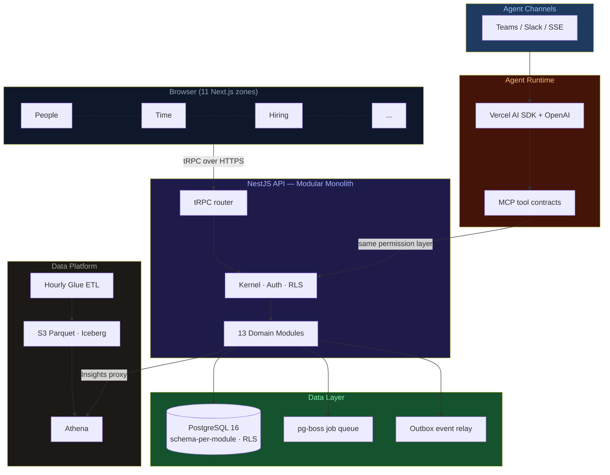

# Future

<p align="center">
  <strong>The enterprise OS where AI agents do the work — not just surface it.</strong><br/>
  Built by <a href="https://seta-international.com">SETA International</a> · 17 years of enterprise engineering
</p>

<p align="center">
  
  
  
  
  
  
</p>

---

Most business software gives you a dashboard and leaves you to figure out what to do next. Future is different. Every workflow has an embedded agent that **acts**: reconciles payroll, surfaces contract expirations, routes approvals, answers "what's our margin on this project?" in seconds from data you can trust.

Built on a unified canonical data layer across HR, time, hiring, finance, projects, and goals — the kind of foundation that makes cross-functional answers possible without a three-day spreadsheet exercise.

---

## Table of Contents

- [What it does](#what-it-does)
- [How it's built](#how-its-built)
- [Set up with an AI agent](#set-up-with-an-ai-agent)
- [Get started](#get-started)
- [Docs](#docs)

---

## What it does

| Module          | What the agent handles                                                         |
| --------------- | ------------------------------------------------------------------------------ |
| **People**      | Employment lifecycle, org changes, offboarding — with compliance guardrails    |
| **Time**        | Attendance, leave, OT, timesheets — automated reconciliation against payroll   |
| **Hiring**      | Pipeline, interviews, offers — agents draft, route, and remind                 |
| **Performance** | Review cycles, 360 feedback — structured and on schedule                       |
| **Finance**     | Invoices, payroll, project profitability — real-time, not end-of-quarter       |
| **Goals**       | OKRs and KPIs drawn from live operational data — not manually updated          |
| **Planner**     | Tasks, evidence, delivery tracking — synced with MS 365 Planner                |
| **Insights**    | Cross-module analytics via Athena — ask in plain language, get sourced answers |

---

## How it's built

The frontend is **11 independent Next.js zones** — one per domain — talking to a single NestJS API over tRPC. No monolithic frontend. No shared state between zones. Each zone deploys independently.

The backend is a **modular monolith**: 13 domain modules (People, Time, Hiring, Finance...), each owning its own Postgres schema and Drizzle ORM layer. Modules never import each other's internals — cross-module reads go through typed facades, async writes go through a durable outbox. Row-level security enforces tenant isolation at the database level.

**Agents** live inside the `agents` module and reach other modules through MCP tool contracts — the same authorization layer the UI uses. No agent bypasses the kernel permission check. Every action leaves an `audit_event`.



> Deployed on **AWS ECS Fargate (Graviton ARM64)** · Terraform · ap-southeast-1

---

## Set up with an AI agent

Open your agent and paste:

```
Read AGENTS.md and QUICKSTART.md, then run `sh scripts/bootstrap.sh --full`. Tell me which .env values still need filling in, then start the dev server. I'm working on: [your task]
```

---

## Get started

```bash
git clone <repo>
sh scripts/bootstrap.sh --full   # copies .env files, installs, starts DB, builds, migrates
bun run dev --filter=@future/api --filter=@future/web-shell
```

Full guide: [QUICKSTART.md](QUICKSTART.md)

---

## Docs

|                                                                  |                                                |
| ---------------------------------------------------------------- | ---------------------------------------------- |
| [QUICKSTART.md](QUICKSTART.md)                                   | Setup, commands, port map, PR rules            |
| [AGENTS.md](AGENTS.md)                                           | Hard rules, DDD boundaries, module conventions |
| [DESIGN.md](DESIGN.md)                                           | Design system — read before any UI work        |
| [docs/architecture/overview.md](docs/architecture/overview.md)   | Full architecture diagram                      |
| [docs/engineering/tech-stack.md](docs/engineering/tech-stack.md) | Every technology choice with rationale         |
