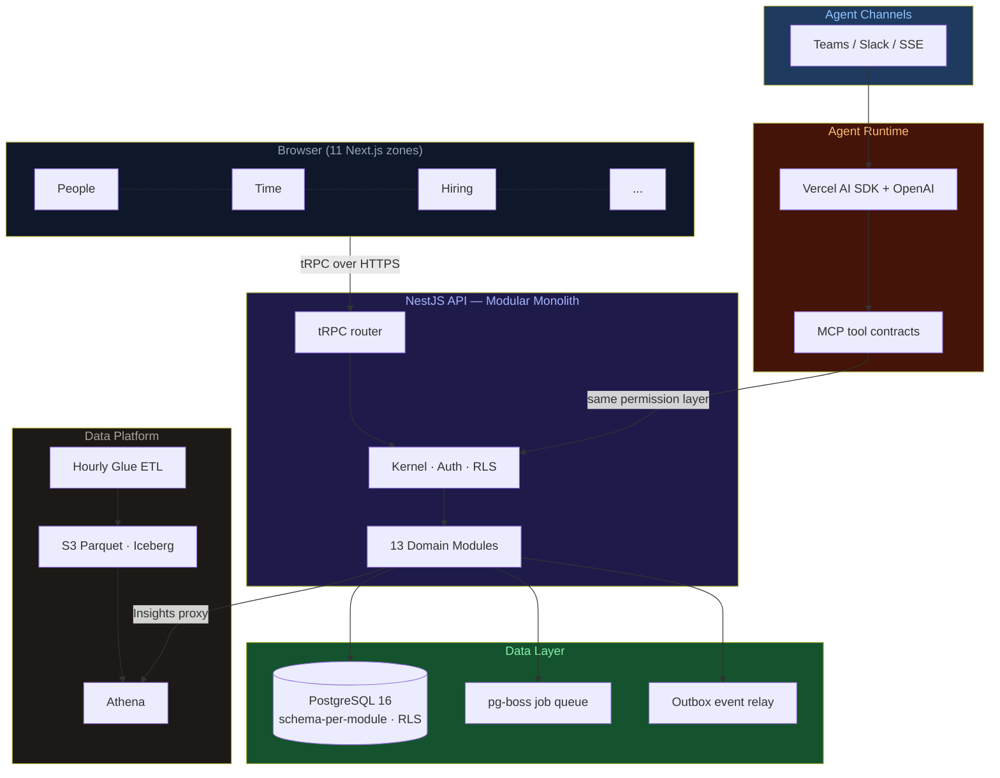

# Future

<p align="center">
  <strong>The enterprise OS where AI agents do the work — not just surface it.</strong><br/>
  Built by <a href="https://seta-international.com">SETA International</a> · 17 years of enterprise engineering
</p>

<p align="center">
  
  
  
  
  
  
</p>

---

Most enterprise software hands you a dashboard and calls it done. Future goes further — every workflow has an embedded agent that **takes action**: it reconciles payroll, flags expiring contracts, routes approvals, and answers _"what's our margin on this project?"_ in seconds, from data you can actually trust.

One canonical data layer spans HR, time, hiring, finance, projects, and goals. Cross-functional questions get real answers — not a three-day spreadsheet exercise.

---

## Table of Contents

- [What it does](#what-it-does)
- [How it's built](#how-its-built)
- [Set up with an AI agent](#set-up-with-an-ai-agent)
- [Get started manually](#get-started-manually)
- [Docs](#docs)

---

## What it does

| Module          | What the agent handles                                                         |
| --------------- | ------------------------------------------------------------------------------ |
| **People**      | Employment lifecycle, org changes, offboarding — with compliance guardrails    |
| **Time**        | Attendance, leave, OT, timesheets — automated reconciliation against payroll   |
| **Hiring**      | Pipeline, interviews, offers — agents draft, route, and remind                 |
| **Performance** | Review cycles, 360 feedback — structured and on schedule                       |
| **Finance**     | Invoices, payroll, project profitability — real-time, not end-of-quarter       |
| **Goals**       | OKRs and KPIs drawn from live operational data — not manually updated          |
| **Planner**     | Tasks, evidence, delivery tracking — synced with MS 365 Planner                |
| **Insights**    | Cross-module analytics via Athena — ask in plain language, get sourced answers |

---

## How it's built

The frontend is **11 independent Next.js zones** — one per domain — each talking to a single NestJS API over tRPC. No shared state, no monolithic bundle. Zones deploy and scale independently.

The backend is a **modular monolith** of 13 domain modules, each owning its own Postgres schema and Drizzle ORM layer. Modules are strictly isolated: cross-module reads go through typed facades, async writes through a durable outbox. Row-level security enforces tenant boundaries at the database itself.

**Agents** are first-class citizens — they live in the `agents` module and reach every other module through MCP tool contracts, subject to the same kernel permission check as the UI. No shortcuts, no side doors. Every action leaves an `audit_event`.



> Deployed on **AWS ECS Fargate (Graviton ARM64)** · Terraform · ap-southeast-1

---

## Set up with an AI agent

Drop this into any AI coding agent (Copilot, Cursor, Claude, etc.) and it handles the rest:

```
Read AGENTS.md and QUICKSTART.md, then run `sh scripts/bootstrap.sh --full`. Tell me which .env values still need filling in, then start the dev server. I'm working on: [your task]
```

---

## Get started manually

```bash
git clone <repo>
sh scripts/bootstrap.sh --full   # copies .env files, installs, starts DB, builds, migrates
bun run dev --filter=@future/api --filter=@future/web-shell
```

Full setup guide, port map, and PR rules: [QUICKSTART.md](QUICKSTART.md)

---

## Docs

|                                                                  |                                                |
| ---------------------------------------------------------------- | ---------------------------------------------- |
| [QUICKSTART.md](QUICKSTART.md)                                   | Setup, commands, port map, PR rules            |
| [AGENTS.md](AGENTS.md)                                           | Hard rules, DDD boundaries, module conventions |
| [DESIGN.md](DESIGN.md)                                           | Design system — read before any UI work        |
| [docs/architecture/overview.md](docs/architecture/overview.md)   | Full architecture diagram                      |
| [docs/engineering/tech-stack.md](docs/engineering/tech-stack.md) | Every technology choice with rationale         |
