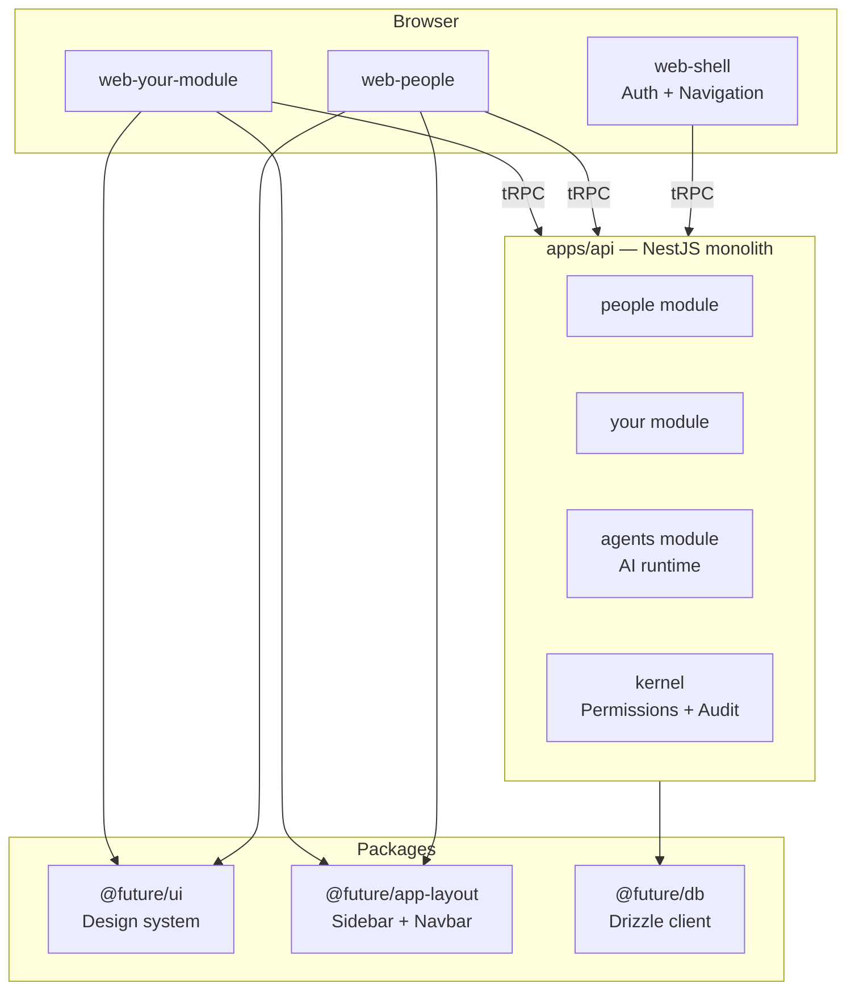
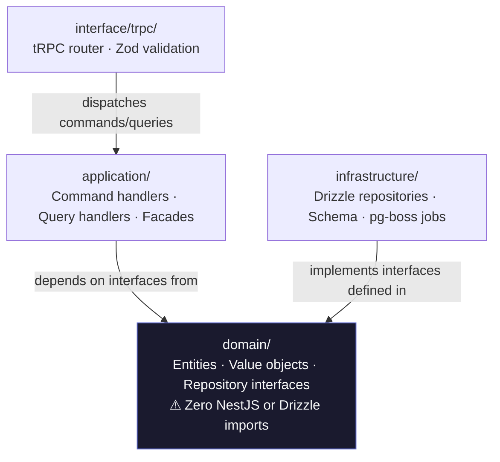
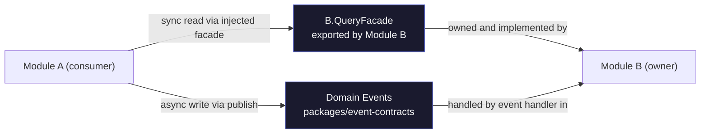
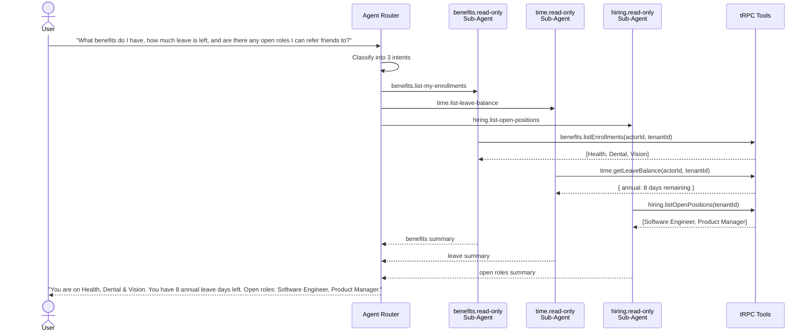
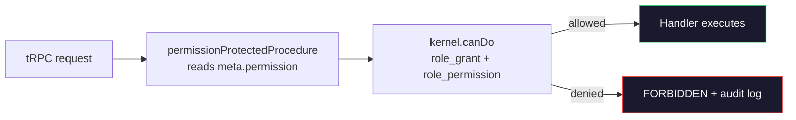
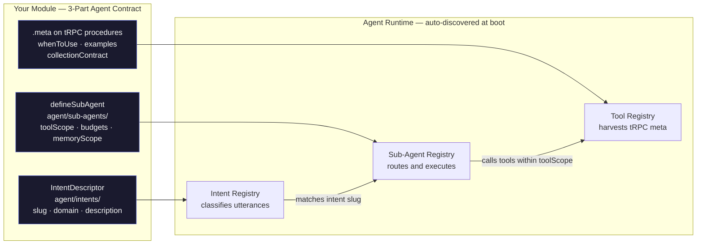
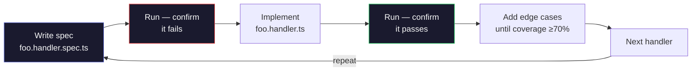

# SETA Future — Hackathon Build Challenge

> Build a new domain module on the Future AaaS platform. Three weeks. AI-first by design.

---

## Quick Start

**What you are building on.** Future is a multi-tenant business workflow platform — HR, hiring, finance, projects — where every module is governed by the same kernel, speaks the same API, and is augmented by a shared AI agent runtime. Your deliverable is one new domain module added to that platform.

**Two mandates, non-negotiable:**

1. **AI-assisted SDLC** — use AI tools (Claude Code, Cursor, Copilot) at every phase: domain design, schema generation, handler scaffolding, test writing, code review, documentation. Your AI-assisted workflow must be visible in your commit history and PR description.
2. **AI-first module** — your module must expose agent tools from day one. Design the agent contract before writing your first handler. The AI layer is a requirement, not a finishing step.

**How to read this guide:**

- _New to this codebase:_ Read Part I in full to build the mental model, then follow Parts II–IV top to bottom. Every concept is explained before its code pattern.
- _Experienced engineers:_ Skim Part I for architecture context, then jump directly to whichever Part II–IV section you need.

**Environment setup.** Follow `QUICKSTART.md` to get Postgres, the API, and a zone running locally before anything else. Build all workspace packages first:

```bash
bun run --filter "@future/*" build
```

---

## Part I — Platform Concepts

### 1.1 What Future Is

Future is an Agent as a Service (AaaS) platform for business operations. Tenants — companies — use it to run HR, hiring, finance, and project workflows. Every feature is owned by a **domain module**. Your hackathon deliverable is one new domain module: a backend API slice, a frontend zone, and an AI agent integration.

Future is not a developer tool. It handles payroll, leave, org charts, and performance reviews for real companies. Keep that context in every design decision you make.

### 1.2 Monorepo Layout

The codebase is a [Turborepo](https://turbo.build/repo) monorepo with two top-level buckets:

```
apps/
  api/          → single NestJS backend — all domain modules live here
  web-<name>/   → one Next.js zone per domain (people, time, hiring, …)
  web-shell/    → authentication hub and global navigation shell
  e2e/          → Playwright end-to-end tests

packages/
  ui/           → design system components
  app-layout/   → AppLayout, sidebar, and navbar primitives
  api-client/   → tRPC type export (no runtime code)
  db/           → Drizzle client, migrations, DB_TOKEN
  event-contracts/ → domain event type definitions
  agent/        → frontend agent components and hooks
```

Each domain module lives at `apps/api/src/modules/<name>/` and owns its own schema, handlers, and [tRPC](https://trpc.io) router slice. There is one running API process — modules are not separate services.



### 1.3 Domain Module Model

Every module follows **[Hexagonal Architecture](https://alistair.cockburn.us/hexagonal-architecture/)** (also called Ports and Adapters) with four strict layers:

| Layer          | Path              | Owns                                                                                                                       |
| -------------- | ----------------- | -------------------------------------------------------------------------------------------------------------------------- |
| Domain         | `domain/`         | Entities, value objects, repository interfaces — zero NestJS or Drizzle                                                    |
| Application    | `application/`    | Command handlers, query handlers, facades, event handlers                                                                  |
| Infrastructure | `infrastructure/` | [Drizzle ORM](https://orm.drizzle.team) repositories, schema, [pg-boss](https://github.com/timgit/pg-boss) jobs, listeners |
| Interface      | `interface/trpc/` | tRPC router, [Zod](https://zod.dev) input validation                                                                       |

Layers only communicate downward: Interface → Application → Domain. Infrastructure implements the repository interfaces that Domain defines. Nothing in Domain knows about Drizzle or [NestJS](https://nestjs.com).



Cross-module communication uses exactly two channels:

- **QueryFacade** — synchronous reads. Exported from the module, injected by consumers.
- **Domain events** in `packages/event-contracts` — asynchronous writes. Published via the outbox transport.



### 1.4 Agent Runtime Model

The agent runtime is a shared platform layer that sits above all domain modules. When a user sends a message to the AI agent, the runtime:

1. **Classifies** the intent — determines which domain the request belongs to
2. **Routes** to the matching sub-agent — a domain-scoped AI worker
3. **Executes tools** — calls tRPC procedures your module exposes to the agent
4. **Returns** a structured, readable response to the user

Your module teaches the runtime about itself through three declarations:

- **tRPC agent meta** — annotates each procedure with LLM guidance (`whenToUse`, `examples`)
- **IntentDescriptor** — tells the router classifier what kinds of requests belong to your domain
- **SubAgent definition** — declares which tools the AI can call, how many iterations it may run, and what memory layers it reads

The runtime discovers all three at boot time via barrel exports. There is no manual registration step.



### 1.5 Multi-Zone Frontend Model

Each domain gets its own [Next.js](https://nextjs.org) app (`apps/web-<name>/`) deployed as an independent service. Zones share no code at runtime — they are separate processes. They communicate with the backend exclusively through tRPC calls to `apps/api`.

Cross-zone navigation uses plain `<a>` links (hard page reload). Within a zone, use Next.js `<Link>`. The sidebar and navbar are rendered by `AppLayout` from `@future/app-layout` — you configure them via a `NavigationConfig` object. You never build your own sidebar.

---

### 1.6 Permissions & RBAC

Every API procedure is guarded by a permission key. The platform uses role-based access control: each actor holds one or more roles (`employee`, `line_manager`, `hr_ops`, `tenant_admin`, …), and each role maps to a set of permission keys. The kernel's `canDo` check resolves this at request time.

**Permission keys** follow the format `module:resource:action` and are registered in a single source-of-truth file:

```
apps/api/src/common/auth/permissions.ts
```

To add permissions for your new module:

1. **Register the keys** — add entries to the `PERMISSIONS` object in `permissions.ts`:

```typescript
BENEFITS_ENROLLMENT_READ: 'benefits:enrollment:read',
BENEFITS_ENROLLMENT_CREATE: 'benefits:enrollment:create',
```

2. **Assign to roles** — add entries in `kernel/domain/constants/default-role-permissions.ts` for the roles that should have access by default (e.g., `employee` gets self-read, `hr_ops` gets full access).

3. **Decorate your tRPC procedures** — the `permissionProtectedProcedure` middleware checks `meta.permission` automatically:

```typescript
.meta({ permission: PERMISSIONS.BENEFITS_ENROLLMENT_READ })
```

4. **CI drift test** — a test in `common/auth/permissions.spec.ts` scans all `*.router.ts` files and fails if any `.meta({ permission: '...' })` string is not in the registry. String typos are caught before they ship.

`tenant_admin` and `platform_admin` automatically receive every new permission — no manual sync required.



> **Rule:** Every new permission key must be in `permissions.ts` before being used in a route. Never hardcode permission strings — always reference `PERMISSIONS.YOUR_KEY`.

---

### 1.7 Feature Flags

Module toggles let tenant admins enable or disable your module per company. They are stored in `admin.tenant_settings` and checked manually at the start of each route.

To add a toggle for your module:

1. **Add a boolean column** to the `tenantSettings` table in `apps/api/src/modules/admin/infrastructure/schema/admin.schema.ts`:

```typescript
benefitsCoreEnabled: boolean('benefits_core_enabled').notNull().default(false),
```

2. **Create a query handler** in `admin/application/queries/` to read the flag.

3. **Expose via facade** — add a method to `AdminQueryFacade`:

```typescript
async isBenefitsEnabled(tenantId: string): Promise<boolean>
```

4. **Guard your routes** — inject `AdminQueryFacade` into your router service and check at the top of each procedure:

```typescript
async assertBenefitsEnabled(tenantId: string): Promise<void> {
  const enabled = await this.adminFacade.isBenefitsEnabled(tenantId)
  if (!enabled) throw new TRPCError({ code: 'FORBIDDEN', message: 'Benefits module not enabled' })
}
```

> **Rule:** Feature flags are checked manually per route, not via middleware. Default is `false` — a tenant must explicitly enable your module. Missing the guard means your module is live for all tenants immediately.

---

## Part II — Building the Backend Module

Each section below follows the same micro-format: **concept → code pattern → rule.** Read the concept, apply the pattern, respect the rule.

### 2.1 Domain Entities

A domain entity is a plain TypeScript interface that represents a core business object. It contains only business fields. Zero NestJS decorators, zero Drizzle types.

```typescript
// domain/entities/benefit-enrollment.entity.ts
export interface BenefitEnrollment {
  id: string
  tenantId: string
  employeeId: string
  benefitPlanId: string
  status: 'pending' | 'active' | 'cancelled'
  enrolledAt: Date
  createdAt: Date
  updatedAt: Date
}
```

> **Rule:** If you see `@nestjs/` or `drizzle-orm` imported in `domain/`, move it to `infrastructure/`.

---

### 2.2 Repository Interfaces

A repository interface defines the data contract that the application layer depends on. The domain owns the interface; infrastructure implements it. This separation allows unit tests to mock the repository without touching a database.

```typescript
// domain/repositories/benefit-enrollment.repository.ts
export const BENEFIT_ENROLLMENT_REPOSITORY = Symbol('BENEFIT_ENROLLMENT_REPOSITORY')

export interface IBenefitEnrollmentRepository {
  findById(id: string, tenantId: string): Promise<BenefitEnrollment | null>
  findByEmployee(employeeId: string, tenantId: string): Promise<BenefitEnrollment[]>
  insert(
    data: Omit<BenefitEnrollment, 'id' | 'createdAt' | 'updatedAt'>,
  ): Promise<BenefitEnrollment>
  update(id: string, tenantId: string, data: Partial<BenefitEnrollment>): Promise<BenefitEnrollment>
}
```

> **Rule:** Repository interfaces belong in `domain/repositories/`. Ports (for external systems like email, storage, or third-party APIs) belong in `domain/ports/`. Never mix the two.

---

### 2.3 DB Schema

A Drizzle schema defines your tables inside a PostgreSQL schema namespace. Namespace isolation prevents table name collisions across modules. Every table is scoped to a tenant.

```typescript
// infrastructure/schema/benefits.schema.ts
import { pgSchema, uuid, text, timestamp } from 'drizzle-orm/pg-core'
import { uuidv7 } from 'uuidv7'

export const benefitsSchema = pgSchema('benefits')

export const benefitEnrollment = benefitsSchema.table('benefit_enrollment', {
  id: uuid('id')
    .$defaultFn(() => uuidv7())
    .primaryKey(),
  tenantId: uuid('tenant_id').notNull(),
  employeeId: uuid('employee_id').notNull(),
  benefitPlanId: uuid('benefit_plan_id').notNull(),
  status: text('status', {
    enum: ['pending', 'active', 'cancelled'],
  })
    .notNull()
    .default('pending'),
  enrolledAt: timestamp('enrolled_at').defaultNow().notNull(),
  createdAt: timestamp('created_at').defaultNow().notNull(),
  updatedAt: timestamp('updated_at').defaultNow().notNull(),
})
```

> **Rule:** Always use `pgSchema('<your-module-name>')`. Always use `uuidv7()` for IDs. No FK constraints that reference a table in another module's schema.

---

### 2.4 Migrations

Drizzle migrations are SQL files generated from your schema. They run once, in order, against the database. Never hand-write migration SQL — always generate it from the schema.

```bash
# After editing your schema file:
bun run db:generate

# Apply to your local dev DB:
bun run db:migrate
```

The generated SQL will include RLS enablement. Verify it is present before committing:

```sql
ALTER TABLE "benefits"."benefit_enrollment" ENABLE ROW LEVEL SECURITY;
```

> **Rule:** Every new table must have RLS enabled in its migration. Never edit a migration file after it has been applied to any environment.

---

### 2.5 Command Handlers

The application layer uses the [CQRS pattern](https://martinfowler.com/bliki/CQRS.html) — commands for writes, queries for reads. A command handler executes a single write operation. It validates preconditions, applies business rules, and persists the result. One command class paired with one handler class.

```typescript
// application/commands/enroll-in-benefit.handler.ts
@CommandHandler(EnrollInBenefitCommand)
export class EnrollInBenefitHandler implements ICommandHandler<EnrollInBenefitCommand> {
  constructor(
    @Inject(BENEFIT_ENROLLMENT_REPOSITORY)
    private readonly repo: IBenefitEnrollmentRepository,
  ) {}

  async execute(command: EnrollInBenefitCommand): Promise<BenefitEnrollment> {
    const existing = await this.repo.findByEmployee(command.employeeId, command.tenantId)
    if (existing.some((e) => e.status === 'active')) {
      throw new Error('Already enrolled')
    }
    return this.repo.insert({ ...command, status: 'pending' })
  }
}
```

The spec, written **before** the handler:

```typescript
// enroll-in-benefit.handler.spec.ts
describe('EnrollInBenefitHandler', () => {
  beforeEach(() => {
    repo = { findById: vi.fn(), findByEmployee: vi.fn(), insert: vi.fn(), update: vi.fn() }
    handler = new EnrollInBenefitHandler(repo)
  })

  it('creates enrollment on happy path')
  it('throws when already actively enrolled')
  // one it() per distinct code path
})
```

> **Rule:** Write the spec first. Cover the happy path and every error path. Mock the repository — never hit the DB in unit tests.

---

### 2.6 Query Handlers

A query handler reads data and returns it. No side effects, no writes. The structure mirrors the command handler — same injection pattern, no business logic.

```typescript
// application/queries/list-enrollments.handler.ts
@QueryHandler(ListEnrollmentsQuery)
export class ListEnrollmentsHandler implements IQueryHandler<ListEnrollmentsQuery> {
  constructor(
    @Inject(BENEFIT_ENROLLMENT_REPOSITORY)
    private readonly repo: IBenefitEnrollmentRepository,
  ) {}

  async execute(query: ListEnrollmentsQuery): Promise<BenefitEnrollment[]> {
    return this.repo.findByEmployee(query.employeeId, query.tenantId)
  }
}
```

> **Rule:** Query handlers never trigger commands. A read is a read; a write is a write. Never mix them.

---

### 2.7 Drizzle Repository

The Drizzle repository implements the domain repository interface using the injected DB client. It is the only place where Drizzle query builders appear. Every query filters by both the target field **and** `tenantId`.

```typescript
// infrastructure/repositories/drizzle-benefit-enrollment.repository.ts
@Injectable()
export class DrizzleBenefitEnrollmentRepository implements IBenefitEnrollmentRepository {
  constructor(@Inject(DB_TOKEN) private readonly db: Db) {}

  async findByEmployee(employeeId: string, tenantId: string): Promise<BenefitEnrollment[]> {
    return this.db
      .select()
      .from(benefitEnrollment)
      .where(
        and(eq(benefitEnrollment.employeeId, employeeId), eq(benefitEnrollment.tenantId, tenantId)),
      )
  }

  // insert, update, findById follow the same pattern
}
```

> **Rule:** Every `where` clause must include `tenantId`. Never use `Promise.all` for DB calls — await each query sequentially.

---

### 2.8 tRPC Router with Agent Meta

The tRPC router exposes your handlers as type-safe API procedures. Any procedure the agent should be able to call gets a `.meta({ agent: {...} })` block — the tool contract the runtime reads at boot.

```typescript
// interface/trpc/benefits.router.ts
export function createBenefitsRouter(
  proc: PermissionProtectedProcedure,
  facade: BenefitsQueryFacade,
) {
  return router({
    listEnrollments: proc
      .meta({
        permission: 'benefits:enrollment:read',
        agent: {
          whenToUse:
            'Use when the user asks what benefits they are enrolled in or their current benefit status.',
          whenNotToUse: 'Do not use to enroll in or cancel benefits.',
          examples: [
            {
              input: 'What benefits am I enrolled in?',
              callArgs: { actorId: '...', tenantId: '...' },
            },
            { input: 'Show me my active plans', callArgs: { actorId: '...', tenantId: '...' } },
          ],
        },
      })
      .query(async ({ ctx }) => facade.listEnrollments(ctx.actorId, ctx.tenantId)),
  })
}
```

> **Rule:** `whenToUse`, `whenNotToUse`, and at least two `examples` are all required. Missing any field throws `ToolRegistryValidationError` at boot and prevents the API from starting.

---

### 2.9 NestJS Module Wiring

The NestJS module file connects all providers and registers handlers with the dependency injection container. It is the only place that maps the repository symbol to the implementation class.

```typescript
// benefits.module.ts
import { Module } from '@nestjs/common'
import { CqrsModule } from '@nestjs/cqrs'
import { KernelModule } from '../kernel/kernel.module'

@Module({
  imports: [CqrsModule, KernelModule],
  providers: [
    // Repositories
    {
      provide: BENEFIT_ENROLLMENT_REPOSITORY,
      useClass: DrizzleBenefitEnrollmentRepository,
    },

    // Command handlers
    EnrollInBenefitHandler,
    CancelEnrollmentHandler,

    // Query handlers
    ListEnrollmentsHandler,
    GetEnrollmentHandler,

    // Facade
    BenefitsQueryFacade,
  ],
  exports: [BenefitsQueryFacade],
})
export class BenefitsModule {}
```

> **Rule:** Export only the QueryFacade (and any write facade if other modules need to trigger writes). Never export repository tokens or entity classes. Other modules must not know your internals.

---

## Part III — Building the Frontend Zone

### 3.1 Zone Scaffold

Each domain gets its own Next.js app under `apps/web-<module>/`. The zone is an independent service — it has its own port, its own deployment, and no shared runtime state with other zones.

Create the zone using the workspace generator:

```bash
turbo gen workspace
# Choose: Next.js app
# Name: web-<your-module>
```

Set the port in `apps/web-<module>/next.config.ts`:

```typescript
const nextConfig: NextConfig = {
  // Each zone has a dedicated port
  // web-shell: 3000, web-people: 3001, web-time: 3002, ...
  // Assign the next available port for your module
}
```

> **Rule:** Zones never query the database directly. All data flows through `apps/api` via tRPC calls.

---

### 3.2 NavigationConfig

`NavigationConfig` is a typed object that defines your zone's sidebar and navbar. You pass it to `AppLayout` — you never build a sidebar component yourself.

```typescript
// src/navigation.tsx
import { Gift } from 'lucide-react'
import type { NavigationConfig } from '@future/app-layout'

export const benefitsNavConfig: NavigationConfig = {
  navbar: {
    title: 'Benefits',
    icon: Gift,
  },
  sidebar: [
    {
      items: [
        {
          label: 'My Enrollments',
          icon: Gift,
          href: '/',
          permission: 'benefits:enrollment:read',
        },
        {
          label: 'Available Plans',
          icon: Gift,
          href: '/plans',
          permission: 'benefits:enrollment:read',
        },
      ],
    },
  ],
}
```

Sidebar items with a `permission` field are hidden automatically if the current user lacks that permission.

> **Rule:** A `NavGroup` has exactly one of `items` (static list) or `render` (dynamic React component). Never both. The sidebar is owned by `AppLayout` — never recreate it locally.

---

### 3.3 AppLayout Integration

`AppLayout` from `@future/app-layout` is the shell that wraps all page content. It renders the sidebar and navbar from your `NavigationConfig`. Wire it in the root layout client component.

```typescript
// src/app/layout-client.tsx
'use client'
export function BenefitsLayoutClient({ children }: { children: React.ReactNode }) {
  return (
    <AppLayout config={benefitsNavConfig} trpc={trpc as any}>
      {children}
    </AppLayout>
  )
}
```

Wire it into `src/app/layout.tsx` as the root layout wrapper. That is the only place `AppLayout` appears.

> **Rule:** `AppLayout` is rendered once per zone, in the root layout only. Never nest it inside a page.

---

### 3.4 Pages and Data Fetching

Pages are client components that fetch data via the tRPC client and render using `@future/ui` components. The pattern is always: `useEffect` → `trpc.query()` → `useState` for data and loading, `<Skeleton />` while loading, `@future/ui` components to render.

```typescript
// src/app/page.tsx — key patterns
'use client'
if (loading) return <Skeleton className="h-48 w-full" />
// render with <Card>, <Table>, <Button> etc. from @future/ui
// mutations: dispatch via (trpc as any).<module>.<procedure>.mutate(input)
```

> **Rule:** Never use raw `<button>`, `<input>`, or `<textarea>`. Always use `@future/ui`. Pending mutations get `<Spinner className="size-4" />` inside the button alongside the label.

---

### 3.5 Design System Compliance

The platform has a strict design language documented in `DESIGN.md`. Read it before writing any UI. Every visual decision — colors, typography, spacing, radii — must follow it.

---

## Part IV — AI-First Integration

> **Deep reference:** Study the agent runtime architecture specification and sub-agent declaration contract thoroughly before writing your first tool. Ask your SETA mentor for access to the reference materials.

> **Scope:** Teams are not only building new modules — improving and extending the existing agent system is equally valid. If you identify a gap in the runtime (tool retrieval, memory, governance, async turns), proposing and implementing a well-argued improvement is a high-scoring contribution.

### 4.1 What AI-First Means

An **AI-bolted-on** module builds a complete working API and UI, then adds agent tools at the end. The tool descriptions are vague, the examples are thin, and the agent struggles to use them reliably.

An **AI-first** module starts with the agent contract. Before writing the first handler, the team answers: _what will a user ask this domain in natural language, and what data does the agent need to answer?_ The `.meta({ agent: {...} })` annotation is the requirements document. The handler is its implementation.

Design your agent contract in the same session as your domain model. It is not a separate phase.



---

### 4.2 tRPC Agent Meta

The `.meta({ agent: {...} })` pattern is shown in §2.8. The key principle: write `whenToUse` as if explaining to a colleague — specific enough that the LLM knows exactly when to call this procedure versus any other. Vague descriptions produce unreliable routing.

The CI governance lint enforces **quality**, not just presence. A `whenToUse` that is non-empty but describes the wrong tool will be flagged in code review. Research shows that description quality moves agent tool-selection accuracy from ~72% to ~90%.

> **Rule:** `whenToUse`, `whenNotToUse`, and at least two `examples` are required. Missing any field throws `ToolRegistryValidationError` at boot. Weak descriptions pass the type check but fail the governance review.

---

### 4.3 Intent Descriptors

An intent descriptor tells the router classifier what kinds of natural-language requests belong to your domain. One file per intent, collected in `agent/intents/`.

```typescript
// agent/intents/list-my-enrollments.ts
import type { IntentDescriptor } from '../../agents/declare'

export const listMyEnrollmentsIntent: IntentDescriptor = {
  slug: 'benefits.list-my-enrollments',
  domain: 'benefits',
  description:
    'User is asking what benefit plans they are enrolled in, their coverage status, or what benefits they currently have.',
}
```

```typescript
// agent/intents/index.ts — barrel export
export { listMyEnrollmentsIntent } from './list-my-enrollments'
```

Define one intent per distinct user goal in your domain. A user asking "what benefits do I have" and a user asking "how do I enrol in a plan" are different intents.

> **Rule:** Slug format is `<domain>.<name>`. Slugs must be unique across all modules. The slug `unclassified` is reserved by the runtime.

---

### 4.4 Sub-Agent Definition

A sub-agent is the AI worker that handles requests routed to your domain. It declares which tools it can call, its budget, and what memory it reads.

```typescript
// agent/sub-agents/benefits-read-only.ts
export const benefitsReadOnlySubAgent = defineSubAgent({
  key: 'benefits.read-only',
  domain: 'benefits',
  description: "Answers read-only questions about the caller's benefit enrollments.",
  whenToUse: 'Use when the user asks about their own benefit plans or enrollment status.',
  promptTemplate: {
    body: 'You are a read-only benefits assistant. Do not make any changes.',
    variables: z.object({ userDisplayName: z.string().min(1) }),
  },
  inputSchema: z.object({ utterance: z.string().min(1) }),
  outputSchema: z.object({ summary: z.string() }),
  toolScope: ['benefits.listEnrollments'], // only tools this agent needs
  budgets: { maxIterations: 3, wallclockMs: 10_000, costUsd: 0.01, toolCeilingBytes: 32_000 },
  memoryScope: { reads: ['L1', 'L2', 'L3'], writes: ['L1'] },
  model: (ctx) => ({
    provider: 'openai',
    model: ctx.surface === 'async' ? 'gpt-5.4' : 'gpt-5.4-nano',
  }),
  source: 'code',
})
```

```typescript
// agent/sub-agents/index.ts
export { benefitsReadOnlySubAgent } from './benefits-read-only'
```

> **Rule:** `writes` can only be `['L1']`. Keep `toolScope` minimal — only the tools this sub-agent actually needs.

---

### 4.5 Wiring into the Agent Registry

The agent runtime discovers your sub-agents and intents at boot time via barrel exports. Add your module's barrels to the import lists in `apps/api/src/modules/agents/agents.module.ts`:

```typescript
// In agents.module.ts — add alongside existing module imports:
import * as benefitsSubAgents from '../benefits/agent/sub-agents'
import * as benefitsIntents from '../benefits/agent/intents'
```

Your `agent/` folder must have this structure before wiring:

```
agent/
  intents/
    list-my-enrollments.ts
    index.ts          ← re-exports all IntentDescriptors
  sub-agents/
    benefits-read-only.ts
    index.ts          ← re-exports all SubAgent definitions
```

> **Rule:** After wiring, start the API and check the boot log. `ToolRegistryValidationError` means a procedure is missing required agent meta. An `IntentRegistryError` means a slug collision or format violation. Fix before proceeding.

---

### 4.6 Smoke-Testing the Agent Turn

Once wired, verify the agent can call your tools in a local session before the demo:

1. Start the API: `bun run dev --filter=@future/api`
2. Open `web-shell` at `localhost:3000` and start an agent conversation
3. Type a query that matches your intent description
4. Confirm the router classifies to your intent slug in the API logs
5. Confirm your sub-agent's tool is called and returns a coherent result

A procedure with `.meta({ agent: {...} })` that has never been called by the agent in a real turn is not an AI-first feature — it is incomplete.

> **Rule:** Include a screen recording or live demo of at least one complete agent turn (user query → intent classification → tool call → response) in your submission.

---

## Part V — Testing Standards

### The TDD Workflow

1. Create `foo.handler.spec.ts` alongside `foo.handler.ts` — before any implementation code.
2. Run the test suite and confirm it fails for the right reason.
3. Write the minimum implementation to make it pass.
4. Add edge-case tests until all paths are covered.
5. Repeat for every handler.



```bash
# Run unit tests (fast, no DB required)
bun run test:unit --filter=@future/api

# Run with coverage report
bun run test:unit --filter=@future/api --coverage
```

Coverage must reach ≥70% on lines, functions, and branches for all new files. The CI gate blocks PRs below this threshold.

### Unit Test Pattern

Tests use [Vitest](https://vitest.dev). Mock all repositories with `vi.fn()`. Test one handler per `describe` block. Every `it` block tests one scenario. Never hit the database in unit tests.

```typescript
describe('MyCommandHandler', () => {
  let handler: MyCommandHandler
  let repo: IMyRepository

  beforeEach(() => {
    repo = { findById: vi.fn(), insert: vi.fn(), update: vi.fn() }
    handler = new MyCommandHandler(repo)
  })

  it('succeeds on the happy path')
  it('throws when precondition A is not met')
  it('throws when precondition B is not met')
  // one it() per distinct code path
})
```

### Integration Tests

Use integration tests when you need to verify the actual DB schema, migration output, or cross-module interactions. Name them `*.integration.spec.ts` and place them alongside the unit spec.

```bash
# Integration tests require the test DB to be running
bun run test:integration --filter=@future/api
```

> **Rule:** Co-locate all specs next to the file they test. No `__tests__/` directories. Jest conventions are not used in this repo.

---

## Part VI — Submission and Judging

### Submission Checklist

Before opening your PR, verify every item:

- [ ] PR opened against `main` with a description linking to the problem statement you chose
- [ ] CI green — lint, typecheck, and unit tests all pass
- [ ] ≥70% test coverage on all new files (check with `--coverage`)
- [ ] All new tables have `tenant_id` and RLS enabled
- [ ] Migrations apply cleanly from a fresh DB (`bun run db:migrate` on an empty schema)
- [ ] No cross-module imports — only facades used for cross-module reads
- [ ] Sub-agent and intent barrel exports wired into `agents.module.ts`
- [ ] At least one complete agent turn demonstrated (screen recording or live demo)
- [ ] `DESIGN.md` compliance — no raw `<button>`, `<input>`, or `<textarea>`, no custom sidebar
- [ ] `QUICKSTART.md` followed — a teammate can clone, install, and run your module from scratch

### Judging Rubric

| Criterion                      | Weight | What judges look for                                                                                                                                                                                                                                                    |
| ------------------------------ | ------ | ----------------------------------------------------------------------------------------------------------------------------------------------------------------------------------------------------------------------------------------------------------------------- |
| **Business impact & insight**  | 35%    | Does the module solve a real, meaningful workflow problem? Is the domain model accurate to how the business actually operates? Does the AI surface genuinely useful, actionable information — not just raw data?                                                        |
| **AI-first integration depth** | 30%    | Is the agent contract thoughtful — multiple intents, well-described tools, useful examples? Does the agent produce coherent and accurate responses? Was AI visibly used throughout the SDLC (commit history, AI-generated tests, design prompts in the PR description)? |
| **Technical correctness**      | 25%    | Hexagonal architecture followed correctly. No cross-module boundary violations. Tests written before handlers. Coverage ≥70%. Migrations apply cleanly.                                                                                                                 |
| **Demo and presentation**      | 10%    | Can the team walk through the full flow — UI to agent conversation to data — clearly in under 5 minutes? Is the problem statement and solution framing compelling?                                                                                                      |

**Scoring note:** A module with impressive UI but no working agent turn cannot score above 65%. The AI-first mandate is load-bearing, not optional.

---
