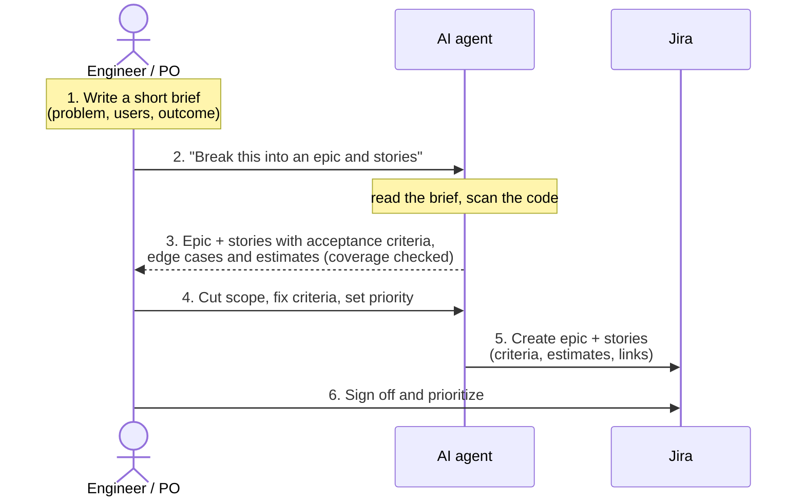
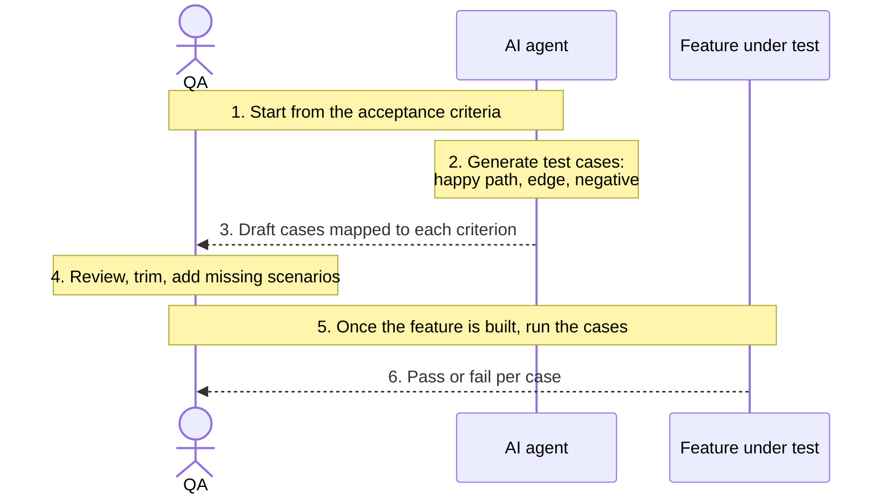
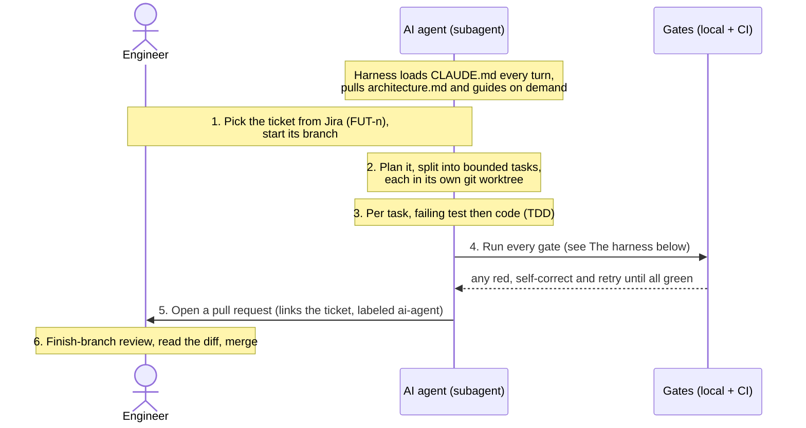
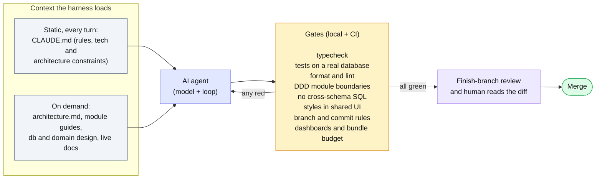
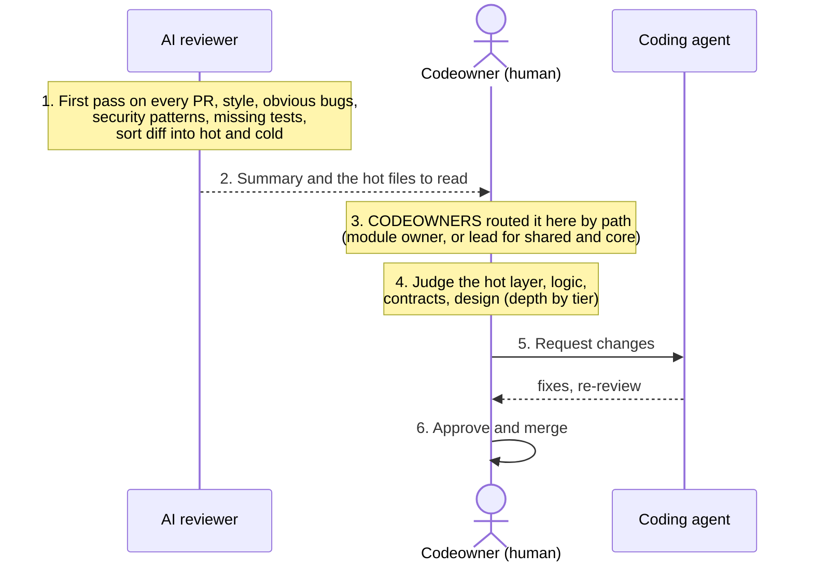

# How We Apply AI Across the SDLC — Stage by Stage

How the Future team uses AI at each stage of building software, from a user story to a release. Every stage has the same layout: its goal, how we use AI, who does what, what comes out, and what it records. Bracketed `[evidence]` notes mark where a screenshot or file is shown during the walkthrough.

The stages:

`User Story / AC` → `Architecture & Design` → `Test Cases` → `Agentic Coding` → `AI Code Review` → `Release Note / Docs`

Across every stage the AI drafts and a person decides. Nothing an agent produces reaches a customer without review.

---

## Stage 1 — User Story / Acceptance Criteria

### Goal
Turn a requirement into a few clear, right-sized tickets with testable acceptance criteria, without missing anything.

### Flow (input to output)

### How we use AI
We take one feature or epic at a time, not a whole-module spec. Writing a full spec up front is not realistic on a live product. The loop:

1. The engineer writes a short brief: the problem, who it is for, the outcome.
2. The AI reads the brief, scans the existing code so the work fits what is there, and proposes one epic with a few vertical-slice stories. Each story gets acceptance criteria in Given/When/Then form and the edge cases the AI found.
3. The AI checks its own breakdown against the brief: every requirement maps to at least one criterion, with no gaps and no overlaps.
4. The engineer reviews: cuts scope, fixes the criteria, splits or merges stories, sets priority.
5. The AI creates the tickets in Jira with their criteria, estimates, and links.

The acceptance criteria carry the weight. The same Given/When/Then lines are what the coding agent builds to, what the reviewer checks, and what QA tests. A ticket is ready when all three can act on it without asking a question, which is also why it can stay short.

### Who does what
| AI | Human |
|---|---|
| Drafts the epic and stories from the brief and the code | Owns the intent and what is in scope |
| Proposes acceptance criteria and edge cases | Approves or corrects the criteria |
| Checks every requirement has a criterion | Decides priority |
| Sizes each story and creates the tickets | Signs off before work starts |

### Output
A few tickets: one epic and a handful of stories, each with a user story, acceptance criteria, and an estimate. Every branch, commit, and pull request later carries the ticket key, so the work traces back to here.

### Recorded for measurement
Tickets moved to Done are counted. The ticket key is what lets later signals — AI usage, time saved, review, tests — attach to a specific piece of work.

### Evidence (shown live)
- `[evidence: the prompt and the stories and criteria it produced]`
- `[evidence: the Jira board with the created tickets]`
- `[evidence: a real acceptance-criteria block from a ticket]`

---

## Stage 2 — Architecture & Design
*(to fill next)*

---

## Stage 3 — Test Cases

### Goal
Generate the QA test cases that validate the feature against its acceptance criteria — the black-box scenarios a person uses to confirm it works, separate from the developer tests written during coding.

### Flow (input to output)

### How we use AI
These are acceptance test cases, not the developer tests written in coding. They check the feature from the outside, the way a user or QA would.

1. Start from the acceptance criteria on the ticket.
2. The AI generates test cases from each criterion: the happy path, the edge cases, and the negative cases where it should fail cleanly.
3. It hands QA a draft set, each case mapped back to the criterion it covers.
4. QA reviews, trims duplicates, and adds the scenarios only a person would think of.
5. Once the feature is built, QA runs the cases against it and records pass or fail.

The value is coverage without the blank page. The AI turns each criterion into concrete scenarios in seconds; QA spends its time judging and finding the gaps, not typing boilerplate.

### Who does what
| AI | Human (QA) |
|---|---|
| Generates test cases from each criterion | Reviews and trims the set |
| Covers happy path, edge, and negative cases | Adds the scenarios AI missed |
| Maps each case back to a criterion | Runs the cases and judges pass or fail |

### Output
A set of acceptance test cases, each tied to a criterion, that QA reviews and later runs against the built feature.

### Recorded for measurement
Which criteria are covered by a test case, and what the runs find. This is lighter to instrument than the code metrics, and today it is tracked more by QA than by the dashboard — an honest gap.

### Evidence (shown live)
- `[evidence: AI-generated acceptance test cases from a real ticket]`
- `[evidence: the cases mapped to each acceptance criterion]`
- `[evidence: a QA run with pass or fail results]`

---

## Stage 4 — Agentic Coding

### Goal
Turn a broken-down Jira ticket into a reviewed, merged change, with the agent writing the tests and the code, and a person reviewing every line.

### Flow (input to output)

### The harness
The model is only part of the agent. What makes its output safe is the harness around it — the context it loads and the gates it must clear.

**Context it loads.** CLAUDE.md loads on every turn: the fixed tech choices, the architecture constraints, the branch and commit rules. Heavier references load only when the task needs them — the architecture document, the module guides, the database and domain design, live library docs. The agent always carries the rules and pulls the detail on demand.

**Gates it must clear.** Before a change can merge it passes the stack of automatic checks above, run locally and again in CI. A red gate sends the work back to the agent, not to a person. Only when every gate is green does the branch go up for a finish-the-branch review and a human read of the diff. The gates are how we know the code matches the requirement and the architecture, not just that it runs.

### How we use AI
This is where the agent does the most, and where the discipline around it matters most. The tests are written here, by the agent, as part of the build — not handed in from a separate stage.

1. The agent picks the ticket from Jira — already broken down and estimated in Stage 1 — and starts its branch, named for the ticket.
2. Working from the ticket and the design, it lays out a short plan and, for larger work, splits it into bounded tasks, each in its own isolated git worktree so parallel tasks do not collide. For tricky parts the engineer drives the agent inline instead.
3. For each task the agent writes the failing test first, then the code to make it pass — the developer test and the code together, against a real database with no mocks.
4. It runs the gates (below) and fixes what they surface, on its own, until every one is green.
5. It opens a pull request that links back to the ticket, labeled so the work is counted as agent-written.
6. The engineer reads the whole diff and merges. This is the gate: no agent code ships without a person reading it.

The model fits the job — a small, cheap model for mechanical work, the strongest for the hard parts. This is the most mature stage here; most pull requests are agent-written today. Scoring the agent's own behavior with Mastra evals in CI is the next step, not yet wired.

### Who does what
| AI | Human |
|---|---|
| Picks the ticket, plans it, splits into worktree tasks | Approves the plan and scope |
| Writes the failing test, then the code (TDD) | Reads the whole diff |
| Runs the checks and evals, fixes what fails | Owns the merge decision |
| Opens the pull request | Handles the hard parts the agent cannot |

### Output
A merged change behind a reviewed pull request linked to the ticket: the code, the developer tests the agent wrote, and a description recording whether an agent wrote it, which tool, and the time saved.

### Recorded for measurement
Every pull request is labeled agent-written or AI-assisted and carries the tool and the time saved. We also track the share of AI pull requests that include test changes, the agent-versus-human comparison of speed and rework, and the share of agent pull requests that merge with no human fixes.

### Evidence (shown live)
- `[evidence: a subagent brief and its report from a real run]`
- `[evidence: a red test turning green inside a task]`
- `[evidence: a pull request labeled ai-agent with its checks green]`

## Stage 5 — AI Code Review

### Goal
Review every change at the right depth: the AI and the gates clear the mechanical layer on every PR, and the module's owner judges what needs a person, before it merges.

### Flow (input to output)

### How we use AI
Review has two layers: the mechanical one, which the AI and the automatic gates handle on every PR, and the judgment one, which a person owns.

1. On every pull request the AI does a first pass — it flags style, obvious bugs, security patterns, and missing tests, and sorts the diff into hot files to read closely and cold files that are safe to skim.
2. CODEOWNERS routes the PR to the right person by the paths it touches: a feature module goes to its owner; shared surfaces, SDKs, and the core modules — identity, shared UI, migrations, CI — auto-request the tech lead.
3. The reviewer reads the hot files — business logic, contracts, design — at a depth that follows the tier. A change to a feature module is a normal review; a change to core, identity, or a migration ships as its own PR and the lead reads all of it.
4. Comments go back to the coding agent to fix, or the reviewer approves and merges.

The rule is simple: the AI and the gates catch what is mechanical, a person owns what takes judgment, and the riskier the module, the more of it a person reads. The AI first pass runs on demand today; making it automatic on every PR is the next step.

### Who does what
| AI reviews | Human reviews |
|---|---|
| Style, formatting, and convention | Business-logic correctness |
| Obvious bugs and security patterns | Architecture and design decisions |
| Whether tests cover the change | Cross-module contracts and auth |
| Sorts the diff into hot and cold | The hot files, at a depth set by the tier |

### Output
A merged pull request that a person has approved, with the AI's first-pass comments and the reviewer's judgments recorded on it.

### Recorded for measurement
For AI-written PRs we track the share that got a human review, how long a PR waits for its first review, how many review rounds it takes, and how much rework traces back to AI-written code. Review coverage is one of the gates on the maturity ladder — heavy AI output without human review is capped, not rewarded.

### Evidence (shown live)
- `[evidence: an AI first-pass review with hot and cold on a real PR]`
- `[evidence: CODEOWNERS routing a PR to the module owner or the lead]`
- `[evidence: a human review that caught a logic issue the AI missed]`

## Stage 6 — Release Note / Documentation
*(to fill next)*
