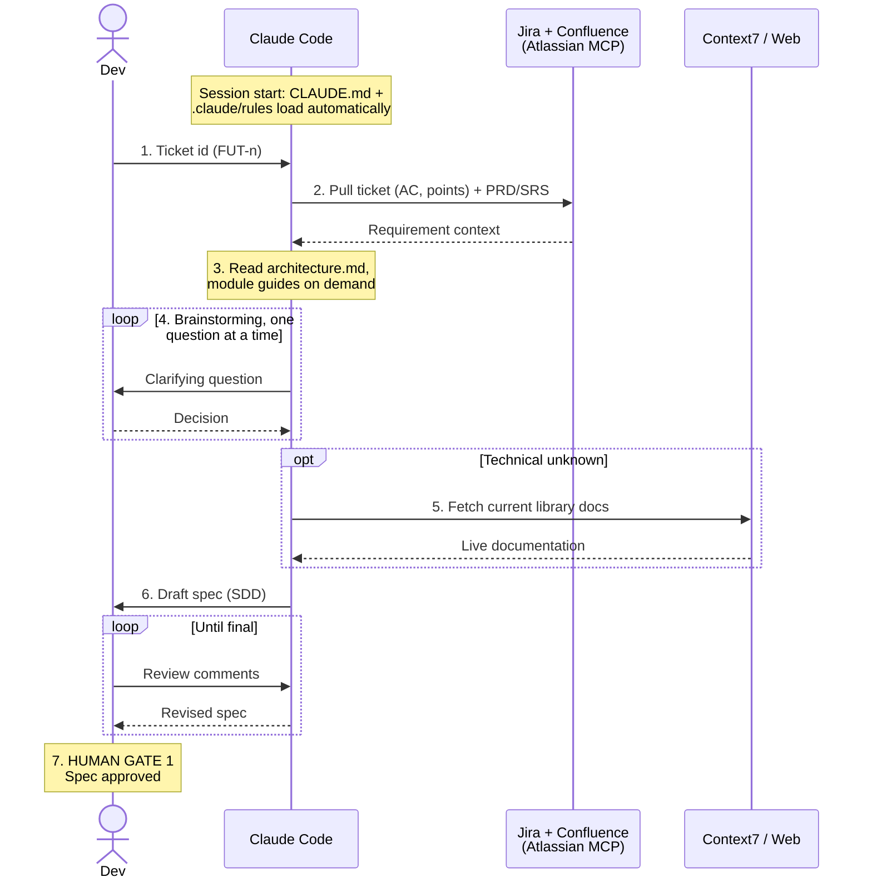
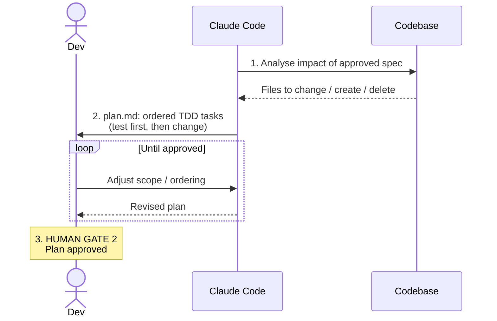
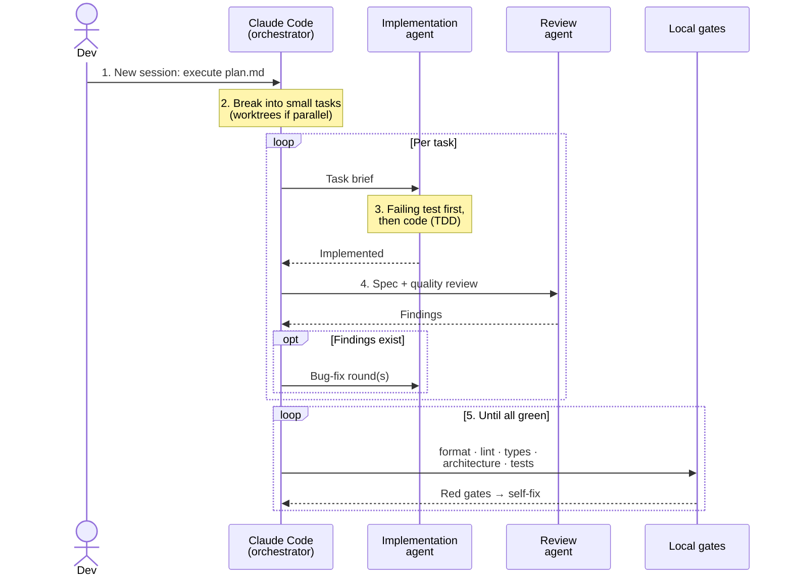
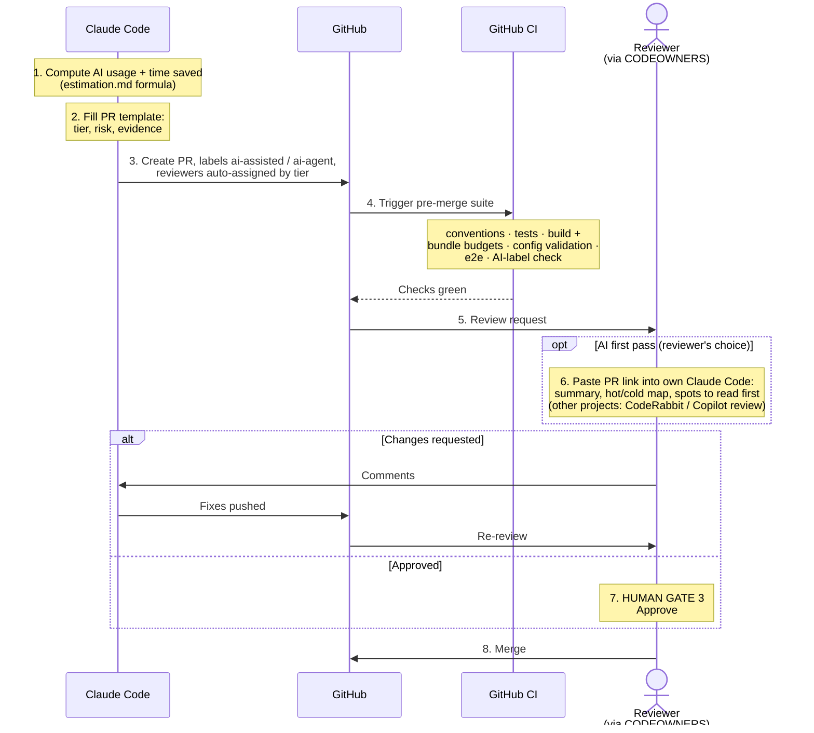
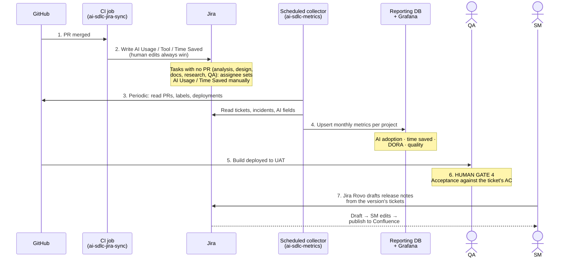

# AIDC on the Future App: From Sprint Ticket to Measured Merge

How the Future team runs AI-Driven Coding (AIDC) on the `agent-platform` repository: a developer picks up a sprint ticket, an AI agent (Claude Code) does most of the build inside a harness of rules and gates, and the result is a reviewed, merged change with its AI usage and time saved recorded automatically. This is the process running today: every rule file, gate, template, and workflow referenced below exists in the repo.

**Scope.** The flow starts *after* the PO/PM has broken work down: the ticket is sprint-planned in Jira with acceptance criteria, story points, and links to the PRD/SRS on Confluence. How tickets get to that state (requirement analysis and breakdown by the PO/PM) is outside the scope of this document.

**Principle.** *AI drafts, a human decides.* The agent produces specs, plans, code, tests, and PRs, but four gates are always held by people:

| # | Human gate | Where |
|---|---|---|
| 1 | Spec approval | end of Phase 1 |
| 2 | Plan approval | end of Phase 2 |
| 3 | PR review & merge | Phase 4 |
| 4 | QA acceptance on UAT | Phase 5 |

---

## 0. The harness: built before any session starts

A coding agent is only as good as the context and guardrails around it. The harness below is set up once per project, so every developer's agent works the same way and no agent output reaches a reviewer without passing machine checks first.

| Component | What it is (in the repo) | Why it is needed |
|---|---|---|
| Project rules | `CLAUDE.md` + `.claude/rules/` split by module (`frontend.md`, `backend.md`, `agent.md`) | Loaded into every session automatically, so the agent follows team conventions from turn one. Rules are enforced by context, not tribal knowledge. |
| Pre-installed skills | A process library (superpowers) that scripts the agent's workflow: brainstorm → spec → plan → test-first coding → verification → review; plus skills for UI design, browser testing, and live library docs | Every developer's agent follows the same scripted workflow, so quality does not depend on individual prompting skill. |
| On-demand docs | `docs/agent/architecture.md`, module guides, DB & domain design, infra briefs | Keeps the always-loaded context small and cheap; the agent pulls deep detail only when the task needs it, which is both faster and more accurate than stuffing everything in up front. |
| Design handoff | UI/UX mockups handed off to Claude as design files | The agent builds to the approved mockup instead of inventing its own UI. |
| Hard local gates | Automatic checks that run before any commit or push: formatting, lint, type checks, architecture-boundary checks, naming conventions, tests | A machine-enforced quality floor. A failed check sends the work back to the agent, not to a person. |
| Estimation guide | `docs/guides/estimation.md`: story-point anchors, team velocity constant (recalibrated quarterly), and the time-saved formula | Makes "AI time saved" a derived number (`points × velocity − actual hours`, cross-checked against the real diff), not a self-reported guess. |
| Review routing | `.github/CODEOWNERS` + review tiers T1/T2/T3 in the PR template | Review depth follows risk automatically: a feature module goes to its owner, anything touching core / identity / shared-ui / migrations / CI auto-requests the tech lead. |
| PR template + label check | `.github/pull_request_template.md` with AI-usage labels and AI-time-saved field; a CI check enforces the labels | Every PR declares its AI usage the same way, so adoption metrics come free as a by-product of working. |
| CI + metrics pipeline | CI workflows (convention checks, tests, build and bundle budgets, e2e, config validation) plus `ai-sdlc-jira-sync.yml` and the scheduled metrics collector feeding Grafana | Independent verification of every PR, and automatic ROI reporting without anyone filling in a spreadsheet. |

---

## The workflow at a glance

```mermaid
flowchart LR
    classDef phase fill:#E0E7FF,stroke:#4F46E5,color:#111;
    classDef gate fill:#EDE9FE,stroke:#7C3AED,color:#111;

    P1["P1 · Context & Spec<br/>ticket + docs → spec.md"]
    G1["Human:<br/>spec review"]
    P2["P2 · Plan<br/>spec → plan.md (TDD)"]
    G2["Human:<br/>plan approval"]
    P3["P3 · Implementation<br/>tasks → code + tests,<br/>local gates green"]
    P4["P4 · PR & Review<br/>auto PR → CI → human review"]
    G3["Human:<br/>approve & merge"]
    P5["P5 · Metrics & Release<br/>Jira sync → Grafana → UAT<br/>→ release notes"]
    G4["Human:<br/>QA on UAT"]

    P1 --> G1 --> P2 --> G2 --> P3 --> P4 --> G3 --> P5 --> G4

    class P1,P2,P3,P4,P5 phase;
    class G1,G2,G3,G4 gate;
```

Each phase below has a step table (`Actor · Action · Precondition · Output · Why`) and its own sequence diagram.

---

## Phase 1: Context & Spec

The most expensive mistake is building the wrong thing, so this phase spends its time before code: the agent assembles the requirement context, clarifies it with the developer, and freezes the result as a spec.

| # | Actor | Action | Precondition / Input | Output / Gate | Why |
|---|---|---|---|---|---|
| 1 | Dev | Picks a planned ticket (FUT-n) from the sprint board and starts a Claude Code session with the ticket id | Ticket has AC, story points, PRD/SRS links | Session started | The ticket key is the thread that ties spec, branch, PR, and metrics together later. |
| 2 | Claude Code | Automatically loads `CLAUDE.md` and the relevant `.claude/rules/*` | Harness in place (§0) | Conventions in context | The rules load on every session, so the agent cannot forget them. |
| 3 | Claude Code | Pulls the Jira ticket and linked Confluence PRD/SRS via Atlassian MCP | Ticket id from step 1 | Requirement context in session | No copy-paste: context comes from the live source of truth, so the agent works from the same documents the PO signed off. |
| 4 | Claude Code | Reads architecture and module guides on demand (`docs/agent/architecture.md`, guides) | On-demand docs exist | System context | The solution fits the existing architecture instead of fighting it. |
| 5 | Dev + Claude Code | Guided brainstorming: the agent asks clarifying questions one at a time against the AC, codebase, and docs | Steps 2–4 done | Ambiguities resolved | Ambiguity is cheapest to fix here, before any code exists. |
| 6 | Claude Code | *(optional)* Fetches current library docs via context7 or web search | A technical unknown surfaces | Up-to-date technical facts | Prevents building on outdated library knowledge. |
| 7 | Claude Code | Writes the spec (requirements, approach, impact, test strategy) and saves it in the repo | Brainstorm converged | Spec file committed | A written spec can be reviewed and versioned; a chat log cannot. |
| 8 | Dev | **Human gate 1:** reviews the spec line by line, loops with the agent until final | Spec draft | Approved spec | Everything downstream (plan, code, tests, PR) is generated from this document, so this review has the most leverage. |

---

## Phase 2: Plan

An approved spec says *what*; the plan says *exactly how*. The agent analyses the codebase and produces a TDD implementation plan small enough to verify step by step.

| # | Actor | Action | Precondition / Input | Output / Gate | Why |
|---|---|---|---|---|---|
| 1 | Claude Code | Analyses the codebase against the approved spec: which files change, which are created or deleted, what can break | Approved spec (gate 1) | Impact analysis | Grounding the plan in the real code prevents the classic AI failure of planning against an imagined codebase. |
| 2 | Claude Code | Writes the plan, saved in the repo: ordered small tasks, each with the failing test to write first, then the change (TDD) | Impact analysis | Plan file | Small, test-first tasks are verifiable one by one; a mistake is caught at its own step, not at the end. |
| 3 | Dev | **Human gate 2:** reviews and approves the plan | Plan draft | Approved plan | The plan is the contract for the implementation session; approving it is what makes hands-off execution safe. |

---

## Phase 3: Implementation

A fresh session executes the plan, so the plan file is the single source of truth with no leftover assumptions from brainstorming. Work is split into small tasks; each task passes an implement round and a review round, and nothing leaves the machine until every local gate is green.

| # | Actor | Action | Precondition / Input | Output / Gate | Why |
|---|---|---|---|---|---|
| 1 | Dev | Opens a new Claude Code session pointed at the approved plan | Approved plan (gate 2) | Execution session | A clean session executes exactly what was approved, nothing more. |
| 2 | Claude Code (orchestrator) | Breaks the plan into small bounded tasks; parallel tasks run in isolated workspaces | Plan file | Task list | Small tasks keep the work reliable; isolation stops parallel tasks colliding. |
| 3 | Implementation agent | Per task: writes the failing test first, then the code to make it pass (TDD) | Task definition | Code + passing test | The test pins the requirement before the code exists; the agent cannot declare success without proof. |
| 4 | Review agent | Per task: a second pass checks the change against the spec and quality rules; bug-fix rounds until clean | Task implemented | Task accepted | Implementer and reviewer are separated even inside the AI, the same separation of duties we require of people. |
| 5 | Claude Code | Runs the full local gate stack: formatting, lint, type checks, architecture boundaries, naming conventions, tests | All tasks done | All gates green | Humans never spend review time on what a machine can catch. |
| 6 | Claude Code | Self-corrects anything a gate flags and re-runs until everything passes | Any red gate | Green working tree | Failures cost agent cycles, not developer attention. The agent must show green output, not claim it. |

---

## Phase 4: Pull Request & Review

The agent assembles the PR the same way every time (template, tier, AI-usage declaration, time-saved figure, auto-assigned reviewers), then CI verifies independently and a human makes the merge decision.

| # | Actor | Action | Precondition / Input | Output / Gate | Why |
|---|---|---|---|---|---|
| 1 | Claude Code | Computes AI usage (labels `ai-assisted` / `ai-agent`) and AI time saved per `docs/guides/estimation.md`: `baseline = story points × team velocity`, reconciled against the real diff size, minus actual hours spent | Ticket points; work done | Declared AI metrics | The number is derived from a formula and checked against the real diff, not guessed. A human can still override it in Jira, and the human value wins. |
| 2 | Claude Code | Fills the PR template: Jira key, tier (T1/T2/T3), risk & affected modules, hot/cold review map for big diffs, evidence of verification | Template in repo | Complete PR description | Every PR arrives in the same structure, so reviewers spend their time judging the change, not reconstructing it. |
| 3 | Claude Code | Assigns reviewers via CODEOWNERS and the tier rules; core / identity / shared-ui / migrations / CI auto-request the tech lead | CODEOWNERS in repo | Right reviewers requested | Review depth scales with blast radius automatically; nobody has to remember who owns what. |
| 4 | Claude Code | Opens the PR on GitHub | Gates green (Phase 3) | PR created | — |
| 5 | GitHub CI | Runs the pre-merge suite: commit/branch convention checks, unit and integration tests, build with per-app bundle budgets, dashboard and infra config validation, Playwright e2e tests, AI-label check. Dependabot keeps dependencies patched. Per-project optional additions: SonarQube-style quality scans, Sentry release checks | PR opened | Checks green or red | Local green is a claim; CI green is evidence from an environment the agent does not control. |
| 6 | Reviewer *(optional AI assist)* | Pastes the PR link into their own Claude Code session for an AI first pass: summary, hot/cold file map, suspicious spots to read first. Other projects can plug in CodeRabbit or GitHub Copilot code review as the same first pass | PR open, checks green | AI first-pass comments | The reviewer starts from an AI map of the diff instead of a cold read. The tool is a per-project choice; the principle stays the same: AI clears the mechanical layer, a person judges. |
| 7 | Reviewer | **Human gate 3:** reads the diff (hot files closely), requests changes or approves | Checks green | Approved PR | No agent-written code ships without a person reading it; the merge decision is never delegated to the machine. |
| 8 | Claude Code | Fixes review comments; reviewer re-checks | Change requests | Updated PR | The fix loop stays with the agent; the reviewer's time is spent only on judgment. |
| 9 | Dev | Merges the PR | Approval | Merged to main | — |

---

## Phase 5: Metrics & Release

After merge the pipeline closes the loop on its own: AI metrics flow back to the Jira ticket, a scheduled collector aggregates them into the shared reporting database behind Grafana, the build ships to UAT for QA acceptance, and release notes are drafted from the same tickets. Tasks that never produce a PR follow one manual step instead: the assignee fills the same two AI fields on the ticket.

| # | Actor | Action | Precondition / Input | Output / Gate | Why |
|---|---|---|---|---|---|
| 1 | GitHub CI (`ai-sdlc-jira-sync`) | On merge, runs the collector's `update_ticket`: writes AI Usage, AI Tool, and AI Time Saved to the Jira ticket | PR merged with labels + template fields | Jira fields updated | Captured at merge by the pipeline, so the data stays complete without anyone remembering to fill it in. A sync failure never blocks the merge. |
| 2 | Jira | Merge policy applies: usage never downgrades, tool set once, hours accumulate; a human edit always wins | Sync ran | Consistent ticket data | Multiple PRs per ticket do not corrupt each other's data, and people keep the final say over the numbers. |
| 3 | Assignee | For tasks with no PR (analysis, design, documentation, research, QA), sets AI Usage and AI Time Saved manually on the Jira ticket | Task done with AI, no PR to sync from | Jira fields set | The automatic sync only covers merged PRs. The manual path keeps every other kind of work in the same metrics, so the dashboard reflects the whole team, not just coding. |
| 4 | Scheduled collector (`ai-sdlc-metrics`) | Periodically queries GitHub + Jira and upserts per-project monthly metrics into the shared reporting database | Merged PRs, Jira fields | `reporting.metric_counts` rows | One shared pipeline and schema across projects, so numbers are comparable and re-runs are safe. |
| 5 | Grafana | Shared dashboards visualise AI adoption, time saved, DORA, and quality metrics | Reporting DB populated | Leadership dashboard | Leadership watches trends from live data, not slide-deck claims assembled by hand. |
| 6 | Dev | Deploys the merged build to UAT (or the QA environment) | Merged to main | Build on UAT | — |
| 7 | QA | **Human gate 4:** runs acceptance test cases against the ticket's AC, passes or fails the feature | Build on UAT | Accepted feature | Final independent check against the original requirement. |
| 8 | SM | Drafts release notes with Jira Rovo (Release Notes Drafter agent): Rovo summarises the version's completed tickets into themed notes, published to Confluence after the SM edits | Version released in Jira | Release notes on Confluence | The tickets already hold everything the notes need; Rovo drafts in minutes and the SM edits instead of writing from scratch. |

---

## What leadership sees

Every number on the Grafana dashboard is a by-product of the process above, not a survey: AI usage comes from enforced PR labels, time saved from a formula a human can override, and delivery signals (DORA, incidents, review coverage) from GitHub and Jira directly. The whole loop, from sprint ticket to measured merge, runs today on the Future app.
