# Agents Module — System Architecture Document

**Status:** Draft v1.0 · **Scope:** Phase 1 — Planner module (primary, user-facing flow) with People as supporting domain · **Classification:** Internal only · **Date:** 2026-05

---

## Table of Contents

| §   | Section                                                                       | Audience    |
| --- | ----------------------------------------------------------------------------- | ----------- |
| 1   | [Executive Summary](#1-executive-summary)                                     | BoD         |
| 2   | [Introduction & Goals](#2-introduction--goals)                                | Both        |
| 2.1 | Purpose & Scope                                                               | Both        |
| 2.2 | Business Context & Drivers                                                    | BoD         |
| 2.3 | Stakeholders                                                                  | Both        |
| 2.4 | Glossary & Abbreviations                                                      | Both        |
| 3   | [Requirements Overview](#3-requirements-overview)                             | Both        |
| 3.1 | Functional Requirements (High-Level)                                          | Both        |
| 3.2 | Non-Functional Requirements (NFRs)                                            | Engineering |
| 3.3 | Constraints & Assumptions                                                     | Both        |
| 4   | [Solution Overview](#4-solution-overview)                                     | Both        |
| 4.1 | Solution Strategy                                                             | Both        |
| 4.2 | High-Level Architecture Diagram                                               | Both        |
| 4.3 | Key Design Principles                                                         | Both        |
| 5   | [Architecture Views](#5-architecture-views)                                   | Engineering |
| 5.1 | System Context View (C4 Level 1)                                              | Both        |
| 5.2 | Logical / Component Architecture (C4 Level 2)                                 | Engineering |
| 5.3 | Data Architecture                                                             | Engineering |
| 5.4 | Integration Architecture                                                      | Engineering |
| 5.5 | Infrastructure / Deployment Architecture                                      | Engineering |
| 5.6 | Security Architecture                                                         | Both        |
| 5.7 | Reliability, Resilience & Failure Handling                                    | Both        |
| 6   | [Technology Stack](#6-technology-stack)                                       | Engineering |
| 7   | [Architecture Decision Records (ADRs)](#7-architecture-decision-records-adrs) | Engineering |
| 8   | [Risks, Assumptions, Issues & Dependencies (RAID)](#8-raid)                   | BoD         |
| 9   | [Migration & Transition Plan](#9-migration--transition-plan)                  | Both        |
| 10  | [Operational Model](#10-operational-model)                                    | Engineering |
| 11  | [Appendices](#11-appendices)                                                  | Both        |

---

## 1. Executive Summary

> **At a glance.** The Agents module is the AI capability of the Future platform — the feature that turns it into a marketable Agent-as-a-Service product. The Phase 1 sprint (2026-04-23 → 2026-05-29; demo 2026-05-20) ships read-only Q&A over Planner + People + a tenant knowledge base. The agent is governed, auditable, cost-bounded, and runs in two execution modes per conversation (Default approvals / Bypass approvals) with a non-bypassable floor. This document describes the target architecture; §8 tracks the pre-launch gaps to close.

### What it is

A governed, multi-tenant AI assistant inside Future. Employees ask questions, surface insights, and propose actions in plain language.

It is the **single feature** that distinguishes Future from a cleaner internal ERP, and the **commercial differentiator** for the Agent-as-a-Service market.

### The architectural premise

> The difference between an AI feature that earns trust and one that erodes it is **not the model behind it** — it is **the boundary around it.**

Every choice in this document follows from that premise.

### Phase 1 scope

|                                  |                                                                                                                                                                                                                               |
| -------------------------------- | ----------------------------------------------------------------------------------------------------------------------------------------------------------------------------------------------------------------------------- |
| **Sprint window**                | 2026-04-23 → 2026-05-29 (~5 weeks / ~26 working days); demo checkpoint 2026-05-20                                                                                                                                             |
| **Goal at end of sprint**        | **Sprint go-live** — read-only Q&A over a fixed Planner-intent set + tenant KB, controlled SETA-internal pilot                                                                                                                |
| **Headline experience**          | Planner — task lookup, plan status synthesis, role-scoped analysis (FR-P1, FR-P2, FR-P3); plus tenant knowledge Q&A (FR-C9 / FR-C10)                                                                                          |
| **Supporting domain**            | People — canonical record of who is who in the organisation                                                                                                                                                                   |
| **Out of scope for this sprint** | All other modules; cross-customer external rollout; autonomous writes; **all single-target write flows (mode-controlled writes + inbox)**; meeting action-item extraction (FR-P6 — deferred to a post-sprint write iteration) |
| **What follows the sprint**      | Four-week production measurement window; the next iteration adds writes (FR-P4–P6) once measurement confirms read-only quality is acceptable                                                                                  |

### Five operating promises

Each is enforced by architecture, not by prompt instructions.

| #   | Promise                                                                                                                                                                                                       | Why it matters                                       |
| --- | ------------------------------------------------------------------------------------------------------------------------------------------------------------------------------------------------------------- | ---------------------------------------------------- |
| 1   | **Two execution modes per conversation: Default (confirm before write) and Bypass (run immediately).** Reads stream freely in both. A non-bypassable floor (bulk, cross-target, destructive) always confirms. | Failure mode of competing AI products                |
| 2   | The agent has **the caller's access rights — never more.**                                                                                                                                                    | Database-enforced; survives prompt injection         |
| 3   | **Spending is bounded at every level** — per question / employee-day / tenant-day / scheduled-job, in dollars.                                                                                                | A misfiring automation cannot run away with the bill |
| 4   | **Every action is fully auditable** — who asked, in which execution mode, on which data, with what confirmation, and when.                                                                                    | Single query, not forensic project                   |

### Investment posture

Build once, correctly, for the long-term target. **Staged rollout governs who uses the agent — not what is engineered.**

Each new module beyond Phase 1 is a configuration-and-permissions exercise, not a fresh integration. The Q2–Q3 2026 investment compounds through 2027 and beyond.

> This document describes the **target architecture**. A pre-launch readiness backlog in §8 tracks the gap between today's implementation and that target.

### Phase 1 success criteria

**End of sprint (2026-05-29):**

- The agent is live: read-only Q&A over a fixed Planner-intent set + tenant KB to a controlled SETA-internal pilot.
- Demo on 2026-05-20 ran successfully — correct answers with citations, in front of stakeholders.
- Zero cross-tenant data-exposure incidents during the sprint.
- AI provider spending tracks within the Appendix F forecast envelope.
- The operational dashboard answers _"what did the agent do and why"_ for any flow, any conversation, any day.

The post-sprint measurement window and the gates that unlock subsequent capability iterations are defined in §9.3.

---

## 2. Introduction & Goals

### 2.1 Purpose & Scope

This document is the **architectural source of truth** for the Agents module — the design that engineering implements, that leadership signs off on, and that audit and compliance reviewers verify against.

**What this document covers:** the agent runtime end-to-end — conversation handling, planning and execution, memory, drafts and approvals, scheduled and event-triggered runs, observability, cost control, reliability handling, and rollout mechanics — for the Phase 1 scope (see §1).

**What this document does not cover:**

- Internal mechanics of domain modules other than Planner (treated as black-box dependencies).
- The broader Future data platform (analytics lakehouse, reporting layers).
- Frontend application surfaces beyond the agent's interface contract.
- Advanced execution modes deferred to later platform versions.

### 2.2 Business Context & Drivers

The Future platform consolidates four legacy internal systems (EMS, Hiring, Timesheet, Resource Insight) into a single agent-native enterprise operating system. **Without the agent module, Future is a cleaner internal ERP. With it, Future is a marketable AaaS product.**

**Why the agent ships in Phase 1, not deferred:**

1. **Market timing.** Building Future in 2026 without agents is building cloud software in 2015 without internet. The category has crossed the threshold of inevitability.
2. **The compounding moat.** Agents on fragmented data produce faster mistakes, not better operations — the documented reason 95% of enterprise AI pilots fail. Future's canonical data layer is the structural advantage that incumbents (MISA, Base.vn) cannot retrofit.
3. **AI as a build accelerator.** The same generation of AI tools that creates the market opportunity also makes a 6.5-FTE team capable of delivering it. The bottleneck is architectural clarity, not engineering volume.

> The strategic bet: **internal truth before external go-to-market.** SETA's own 300+ person operation is the validation environment. A platform that runs SETA correctly can credibly be offered to the market.

### 2.3 Stakeholders

| Stakeholder                                       | Role           | Primary interest                                       |
| ------------------------------------------------- | -------------- | ------------------------------------------------------ |
| Board / CEO                                       | Sponsor        | Strategic differentiation, commercial readiness        |
| CTO / Tech Lead                                   | Owner          | Architectural integrity, security, cost control        |
| Engineering team (3 FTE — 1 AI eng + 2 fullstack) | Implementer    | Buildability, testability, operational handle          |
| Product Manager                                   | Roadmap owner  | Capability iteration rollout, UX                       |
| Department Heads (HR, Finance, Delivery)          | First users    | Trustworthy answers; drafts respect existing workflows |
| End users (300+ SETA employees)                   | Daily users    | Plain-language access; agent never lies or oversteps   |
| Compliance / Legal                                | Reviewer       | GDPR, audit trail, data residency                      |
| External customers (2027+)                        | Future tenants | Configurability, isolation guarantees                  |

### 2.4 Glossary & Abbreviations

Terms used throughout this document. Business-level terms appear in any section; engineering-level terms are confined to engineering sections.

**Business-level terms:**

| Term                      | Meaning                                                                                                                                                                                                                                                                                                                                                                          |
| ------------------------- | -------------------------------------------------------------------------------------------------------------------------------------------------------------------------------------------------------------------------------------------------------------------------------------------------------------------------------------------------------------------------------- |
| **Tenant**                | A customer organisation using the platform. SETA itself is the first tenant; external customers join later.                                                                                                                                                                                                                                                                      |
| **Module**                | A functional area of the platform — Planner, People, Time, Hiring, etc. The agent integrates module by module.                                                                                                                                                                                                                                                                   |
| **Capability iteration**  | A scoped delivery of agent capabilities. The first iteration is read-only Q&A + tenant KB; subsequent iterations add single-target writes, then async writes, then multi-step orchestration. Each iteration unlocks only after the previous iteration's production data clears the agreed measurement gate; rollback is a tenant-scope configuration change, not a code release. |
| **Execution mode**        | The per-conversation setting (chat dropdown) that picks between **Default approvals** (the agent previews each write inline; requester clicks confirm) and **Bypass approvals** (the agent runs writes immediately). Reads run immediately in both.                                                                                                                              |
| **Non-bypassable floor**  | The set of write tools (bulk batches, cross-target, destructive) that always require confirmation and land in the approval inbox regardless of execution mode. Declared per tool.                                                                                                                                                                                                |
| **Previewed intent**      | A structured write the agent shows in-chat in Default mode for the requester to confirm before it runs. In-memory only — not persisted to `agent_draft`.                                                                                                                                                                                                                         |
| **Drafted action**        | A write the agent has composed and **persisted to `agent_draft`** for inbox-path review. Used for non-bypassable writes (bulk batches, cross-target, destructive). The agent never owns a parallel approval state machine.                                                                                                                                                       |
| **Approval inbox**        | The existing in-product surface where pending items are reviewed and confirmed. The agent reuses it for inbox-path writes; no parallel inbox.                                                                                                                                                                                                                                    |
| **Scheduled run**         | An agent run that fires on a schedule rather than from a live conversation (e.g. "send my morning task brief every weekday at 8am", "draft a stale-task nudge every Friday afternoon").                                                                                                                                                                                          |
| **Audit trail**           | The end-to-end record of who asked, what the agent did, with which data, what the requester confirmed (or declined), and when.                                                                                                                                                                                                                                                   |
| **Tenant knowledge base** | A tenant-scoped library of reference documents (handbook, policies, FAQs) imported by tenant admins. The agent retrieves passages from it to answer knowledge questions and cites the source. One tenant's content never appears in another tenant's results.                                                                                                                    |

**Engineering-level terms (used in Engineering sections only):**

| Term                             | Meaning                                                                                                                                                                                                                                                                                                                             |
| -------------------------------- | ----------------------------------------------------------------------------------------------------------------------------------------------------------------------------------------------------------------------------------------------------------------------------------------------------------------------------------- |
| Turn                             | A single user message and the agent's complete response cycle.                                                                                                                                                                                                                                                                      |
| Flow                             | A user-intent thread that may span multiple turns (e.g. draft → approval → execute).                                                                                                                                                                                                                                                |
| Router / sub-agent / synthesizer | The three LLM-driven roles inside one turn: planner, domain-scoped worker, final-answer composer.                                                                                                                                                                                                                                   |
| Topology mode 0/1/2/3            | The four execution-topology shapes the router picks for a turn: direct call · bounded plan · iterative supervisor · asynchronous (scheduled or event-triggered). Distinct from execution mode (Default / Bypass) which is a per-conversation user setting.                                                                          |
| Taint                            | A turn-scoped flag triggered by tool results that contain tenant-authored free-text fields. Once set, every write drafted afterward in that turn is forced onto the inbox path regardless of the user's chosen execution mode. Sometimes referred to as "field-level taint" because the trigger is declared per-field on each tool. |
| Trace                            | The structured record of one turn — plan, sub-agent steps, tool calls, final answer — used for observability and replay.                                                                                                                                                                                                            |

---

## 3. Requirements Overview

### 3.1 Functional Requirements

#### 3.1.1 Core agent requirements

The **core agent** is the module-agnostic runtime that every domain integration inherits — surface contract, execution modes, governance, memory, reliability, approval lifecycle, audit and replay, and the tenant knowledge base. New modules onboarded after Phase 1 (Time, Hiring, Performance, …) inherit all of these without re-derivation; the per-module work is intent and tool declaration only (§9.4).

**Surface and interaction:**

| ID    | Requirement                                                                                                                                                                                                      |
| ----- | ---------------------------------------------------------------------------------------------------------------------------------------------------------------------------------------------------------------- |
| FR-C1 | The agent is reachable through three surfaces: a global chat surface in the web app, inline copilots inside module screens (e.g. task / plan detail), and asynchronous (scheduled or event-triggered) workflows. |
| FR-C2 | Outputs are structured: short answer, list, table, narrative, or chart. The output shape is declared before the first token streams so the UI can render progressively.                                          |

**Execution modes and approval:**

| ID    | Requirement                                                                                                                                                                                                                                                                                                                                                                                                                                                                                                                                                                                                |
| ----- | ---------------------------------------------------------------------------------------------------------------------------------------------------------------------------------------------------------------------------------------------------------------------------------------------------------------------------------------------------------------------------------------------------------------------------------------------------------------------------------------------------------------------------------------------------------------------------------------------------------- |
| FR-C3 | Each conversation has an **execution mode** the user picks from a dropdown in the chat UI: **Default approvals** (the agent previews each write inline, the requester clicks confirm before it runs) or **Bypass approvals** (the agent runs writes immediately as part of the response). Reads always run immediately in both modes. A **non-bypassable floor** declared per tool — bulk batches, cross-target writes, and destructive actions — always confirm or land in the approval inbox regardless of mode. Tenant admins may disable Bypass tenant-wide or pin specific tools to "always confirm". |
| FR-C4 | Scheduled and event-triggered runs operate under explicit per-user delegation grants. Async runs are read-only summaries or inbox-drafts only — no autonomous writes at Phase 1, regardless of the originator's chosen execution mode for live conversations.                                                                                                                                                                                                                                                                                                                                              |

**Governance and trust:**

| ID    | Requirement                                                                                                                                                                                                                                                                                                                                                                                                                                          |
| ----- | ---------------------------------------------------------------------------------------------------------------------------------------------------------------------------------------------------------------------------------------------------------------------------------------------------------------------------------------------------------------------------------------------------------------------------------------------------- |
| FR-C5 | Every agent action produces a kernel audit event with full lineage (initiator, delegation, execution mode, confirmation event if any, tool calls, prompt versions). Reconstruction of "who asked, what ran, under what authority, with which data" is a single query.                                                                                                                                                                                |
| FR-C6 | Tenant administrators configure per-tenant model selection, cost ceilings, schedule policies, tool visibility, execution-mode policy (e.g. disable Bypass tenant-wide), and **memory policy** (L2 retention below the 90-day default, per-turn prompt-token cap, L3 preferences disable, per-surface memory profile overrides — see Appendix C) through a self-service admin surface — no engineering involvement for routine configuration changes. |
| FR-C7 | Users may cancel an in-flight turn. The cancel-vs-committed-write race is handled by the honesty contract: the user is told the truthful timestamp of any write that committed before cancellation arrived; no fictional rollback messages.                                                                                                                                                                                                          |
| FR-C8 | Aggregate and analytical queries respect the composition-attack defence in §5.6.2. Tools that return aggregates declare a minimum group size; queries that fall below it are refused or k-anonymised — never silently sharpened to identify an individual.                                                                                                                                                                                           |

**Memory:**

| ID     | Requirement                                                                                                                                                                                                                                                                                                                                                                                                                                                                                  |
| ------ | -------------------------------------------------------------------------------------------------------------------------------------------------------------------------------------------------------------------------------------------------------------------------------------------------------------------------------------------------------------------------------------------------------------------------------------------------------------------------------------------- |
| FR-C11 | **Conversation continuity, scoped.** Within a conversation the agent maintains coherent context (prior turns, user preferences) so the user does not have to re-establish state. Cross-conversation recall is forbidden at Phase 1 (no "you said X yesterday"). Cross-tenant recall is forbidden permanently. Memory inherits the caller's permission scope — the agent cannot pre-load facts the caller could not retrieve themselves. Implementation: Appendix C; admin controls in FR-C6. |

**Reliability and honesty (user-visible):**

| ID     | Requirement                                                                                                                                                                                                                                                                                                                                                                                                                                            |
| ------ | ------------------------------------------------------------------------------------------------------------------------------------------------------------------------------------------------------------------------------------------------------------------------------------------------------------------------------------------------------------------------------------------------------------------------------------------------------ |
| FR-C12 | **Degradation is communicated, not disguised.** When the AI provider degrades and the runtime falls back through the model ladder, the user sees a notice that the experience changed (e.g. "answering on a faster model"). When budget, taint, or provider outage forces a refusal, the agent says so plainly with a reason — never silent failure, never fluent prose covering an empty answer. Targets and ladder steps in §5.7; ADR-018 / ADR-020. |

**Approval lifecycle:**

| ID     | Requirement                                                                                                                                                                                                                                                                                                                                                                                                                                                     |
| ------ | --------------------------------------------------------------------------------------------------------------------------------------------------------------------------------------------------------------------------------------------------------------------------------------------------------------------------------------------------------------------------------------------------------------------------------------------------------------- |
| FR-C13 | **Inbox drafts have a defined lifecycle.** Drafts carry a TTL (default 72h, per-tool override); expired drafts auto-reject and notify the initiator. On confirmation, the platform revalidates preconditions before execution; precondition failure surfaces honestly to the initiator with `agent.draft_execution_failed`. Retried writes carry an idempotency key per intended side effect — a retry returns the original result, never produces a duplicate. |

**Audit and replay:**

| ID     | Requirement                                                                                                                                                                                                                                                                                                                                                                                                                  |
| ------ | ---------------------------------------------------------------------------------------------------------------------------------------------------------------------------------------------------------------------------------------------------------------------------------------------------------------------------------------------------------------------------------------------------------------------------- |
| FR-C14 | **Deterministic replay by trace ID.** Any turn can be reconstructed from its trace ID — the same prompt, the same tool calls, the same outcome — for audit, incident response, and regression testing. Distinct from FR-C5 (audit lineage answers "who did what"); FR-C14 answers "rebuild the exact prompt that ran". Implementation: ADR-008 (content-hash prompt store) + ADR-029 (deterministic prompt-assembly budget). |

**Tenant knowledge base (RAG):**

| ID     | Requirement                                                                                                                                                                                                                                                                                                                                                                                                       |
| ------ | ----------------------------------------------------------------------------------------------------------------------------------------------------------------------------------------------------------------------------------------------------------------------------------------------------------------------------------------------------------------------------------------------------------------- |
| FR-C9  | **Tenant knowledge Q&A.** The agent answers questions grounded in tenant-curated reference material — HR handbook, policies, onboarding docs, internal FAQs, process guides. Answers cite the source document and section. The retrieval index is **tenant-keyed**: no cross-tenant search; one tenant's content never appears in another tenant's results.                                                       |
| FR-C10 | **Admin knowledge ingestion.** Tenant administrators upload reference documents (markdown, plain text, PDF — text-only at Phase 1; OCR for image-PDFs deferred) through `web-admin`. The platform chunks, embeds, and indexes the content; admins can browse, edit, deprecate, and re-index. Ingestion runs asynchronously with a status notification. Per-tenant document quota and per-document size cap apply. |

#### 3.1.2 Planner module requirements

The Phase-1 user-facing capability surface, scoped to the Planner module with People as the supporting context.

**Read — answer questions about work:**

| ID    | Requirement                                                                                                                                                                                                                                                                                                                                                                                                                                |
| ----- | ------------------------------------------------------------------------------------------------------------------------------------------------------------------------------------------------------------------------------------------------------------------------------------------------------------------------------------------------------------------------------------------------------------------------------------------ |
| FR-P1 | **Personal and team task views.** Answers questions over Planner tasks joined to People for ownership and reporting lines — "my open tasks", "what's due this week", "overdue items I own", "what's my team working on", "who's blocked", "who's overloaded". Results cite source tasks.                                                                                                                                                   |
| FR-P2 | **Plan status synthesis.** For any plan the caller can see: narrative status, on-track / at-risk / done breakdown, recent changes, stale items (no update in N days), and a "what to surface in stand-up" digest.                                                                                                                                                                                                                          |
| FR-P3 | **Role-scoped analysis.** Analytical and aggregate questions scoped to the caller's authority — individual contributor ("my throughput last sprint", "tasks I closed vs. opened"), team lead ("team workload balance", "completion rate by member", "blockers by team"), and department or org leader ("plan progress across teams I oversee", "cross-team dependencies at risk", "throughput comparison across teams"). Subject to FR-C8. |

**Write — single-target writes are mode-controlled (FR-C3); batches and cross-target are inbox-only:**

| ID    | Requirement                                                                                                                                                                                                                                                                                                               |
| ----- | ------------------------------------------------------------------------------------------------------------------------------------------------------------------------------------------------------------------------------------------------------------------------------------------------------------------------- |
| FR-P4 | **Create a task from natural language.** "Follow up with Anh about the Q3 brief by Friday" → structured task with inferred owner (resolved through People), parent plan (from current screen or conversation), due date, and dependencies. Mode-controlled: Default → inline preview + confirm; Bypass → run immediately. |
| FR-P5 | **Single-task mutations.** Reassign, reschedule, mark done, split, link to a parent plan — all expressed in plain language, all run under the requester's authority. Mode-controlled per FR-C3.                                                                                                                           |
| FR-P6 | **Extract action items from a meeting transcript** as a batch of draft tasks. Each item carries a suggested owner (via People) and a confidence score; the requester accepts or rejects per item. Always inbox-only — non-bypassable regardless of execution mode (batch + multi-target).                                 |

**Async — scheduled digests and nudges (per FR-C4):**

| ID    | Requirement                                                                                                                                                      |
| ----- | ---------------------------------------------------------------------------------------------------------------------------------------------------------------- |
| FR-P7 | **Opt-in scheduled digests and nudges**: morning task brief, end-of-week status digest, stale-task nudges, at-risk milestone alerts. Read-only summary or email. |

### 3.2 Non-Functional Requirements (NFRs)

Targets are Phase-1 commitments, measurable through the observability surface in §5.7.8. Reliability requirements derive from §5.7; security requirements from §5.6.

| Category                          | Requirement                                                     | Phase 1 Target                                                                                                                           |
| --------------------------------- | --------------------------------------------------------------- | ---------------------------------------------------------------------------------------------------------------------------------------- |
| **Latency**                       | Time-to-first-token (interactive turn)                          | p95 ≤ 2.5 s                                                                                                                              |
| **Latency**                       | Total turn wallclock                                            | hard abort 30 s (interactive); 5 min (asynchronous)                                                                                      |
| **Throughput**                    | Concurrent turns per tenant                                     | 50 (initial sizing; tunable)                                                                                                             |
| **Cost**                          | Per-turn cost ceiling                                           | dollar-denominated; default minimum remaining $0.10                                                                                      |
| **Cost**                          | Cache-aware accounting                                          | cache-read and cache-write priced separately on every cost event                                                                         |
| **Availability**                  | Single-region MVP (ap-southeast-1)                              | 99.5% during business hours                                                                                                              |
| **Reliability — retry**           | LLM provider transient errors (429, 5xx, timeout)               | one retry with exponential backoff and jitter (i.e. up to two total attempts); **single layer only** (gateway-owned; SDK retry disabled) |
| **Reliability — retry**           | Honor provider `Retry-After` header on rate limits              | required                                                                                                                                 |
| **Reliability — circuit breaker** | Per-tool failure threshold within a sub-agent                   | 2 failures → tool disabled for the rest of the turn                                                                                      |
| **Reliability — fallback**        | Model degradation ladder                                        | 7-step ordered ladder, each step trace-tagged distinctly; user-visible notice when the experience changes                                |
| **Reliability — cancellation**    | Abort signal latency (user click → next ceasing point)          | sub-second                                                                                                                               |
| **Reliability — cancellation**    | Honesty contract on cancel-vs-committed-write race              | user told the timestamp at which the write committed; no fictional rollback                                                              |
| **Reliability — quality probe**   | Synthetic probe interval per model tier                         | hourly                                                                                                                                   |
| **Reliability — quality probe**   | Degradation flag trigger                                        | rolling 30-min success rate < 90%                                                                                                        |
| **Idempotency**                   | Within-turn read cache                                          | canonical-hash keyed; same arguments → same result without re-invocation                                                                 |
| **Idempotency**                   | Cross-retry write safety                                        | idempotency key per intended side effect, persisted by domain (Phase-1 readiness backlog)                                                |
| **Security**                      | Database-enforced tenant isolation on every tenant-scoped table | required                                                                                                                                 |
| **Security**                      | Agent acts with caller's permissions only                       | no service-account bypass anywhere in the call chain                                                                                     |
| **Auditability**                  | Every tool call produces a kernel audit event                   | correlated by flow and intent identifiers                                                                                                |
| **Observability**                 | Trace per turn                                                  | 1% baseline sampling + 100% on triggers (errors, taint, approvals, ceiling breaches)                                                     |
| **Observability**                 | Span attributes                                                 | OpenTelemetry GenAI semantic conventions (industry-converging standard)                                                                  |
| **Replay**                        | Deterministic prompt reconstruction by trace ID                 | content-hash-keyed prompt store; canonicalisation rules pinned per trace                                                                 |
| **Compliance**                    | GDPR right-to-erasure                                           | hard-delete content; retain anonymised audit shell                                                                                       |
| **Scalability**                   | Designed to absorb modules 4–13 without runtime rewrite         | extensibility-invariant contract (Appendix B)                                                                                            |
| **KB ingestion**                  | Per-document end-to-end ingestion latency                       | p95 ≤ 60 s for documents ≤ 1 MB; ≤ 5 min for documents up to the 5 MB cap                                                                |
| **KB retrieval**                  | `kb.retrieve` p95 latency (top-K query, K ≤ 8)                  | ≤ 250 ms                                                                                                                                 |
| **KB scale**                      | Per-tenant default quotas                                       | 1,000 documents / 50 MB / 5 MB per document; raisable per tenant                                                                         |

### 3.3 Constraints & Assumptions

**Constraints (binding for Phase 1):**

| #   | Constraint                                                                                         | Rationale                                                                                                                                                                                                                                                     |
| --- | -------------------------------------------------------------------------------------------------- | ------------------------------------------------------------------------------------------------------------------------------------------------------------------------------------------------------------------------------------------------------------- |
| C-1 | Single AWS region — `ap-southeast-1` (Singapore)                                                   | Multi-region gated to Beta on traffic justification                                                                                                                                                                                                           |
| C-2 | Single AI provider — OpenAI                                                                        | Multi-provider routing gated to Beta after the first major provider-outage incident                                                                                                                                                                           |
| C-3 | A single hardware platform standard across the fleet                                               | Cost and energy efficiency; platform-wide standard (technical detail in §6)                                                                                                                                                                                   |
| C-4 | Database-enforced tenant isolation on every tenant-scoped table                                    | Application-layer isolation is insufficient under prompt-injection threat model                                                                                                                                                                               |
| C-5 | No autonomous writes from scheduled or event-triggered runs                                        | Scheduled runs may read and draft-to-inbox only; promotion gated to Beta                                                                                                                                                                                      |
| C-6 | No vector-embedding-based long-term **conversational** memory recall (e.g. "you said X yesterday") | Recency + user preferences cover the chat-quality target. Tenant-curated knowledge base via embeddings (FR-C9 / FR-C10) is **in scope** — it is admin-imported reference material, tenant-keyed by construction, and distinct from cross-conversation memory. |
| C-7 | Observability backend vendor deferred                                                              | Runtime exports through a vendor-neutral standard so the choice is independent                                                                                                                                                                                |

**Assumptions (load-bearing for delivery):**

| #   | Assumption                                                                    | Failure mode if false                                                                    |
| --- | ----------------------------------------------------------------------------- | ---------------------------------------------------------------------------------------- |
| A-1 | Microsoft Entra is the primary SSO IdP; magic link is the fallback            | Identity surface re-design                                                               |
| A-2 | 3 FTE allocated to the Phase 1 sprint — 1 AI engineer + 2 fullstack engineers | Schedule slip; demo-day scope contracts further; or sprint go-live slips past 2026-05-29 |
| A-3 | AI tooling continues to mature at current trajectory                          | Per-engineer output drops; capacity plan revises                                         |
| A-4 | The platform-wide December 31, 2026 deadline for legacy decommission holds    | Phase-2 module integration cadence compresses                                            |

---

## 4. Solution Overview

### 4.1 Solution Strategy

#### What the runtime is, in plain language

A user asks the agent something. A **planner** (an LLM call with a strict output shape) reads the question and breaks it into one or two pieces of work. **Workers** (one per piece, running in parallel) gather the data they need by calling the platform's existing APIs — never the database directly. A **composer** (a second LLM call) takes the workers' findings and writes the user's answer. Every API call along the way is funnelled through a **single gate** that checks the caller's permissions, records an audit event, and counts the spend.

When the user asks for a _change_, not just a question — "create this task", "reassign this to Anh" — what happens depends on the **execution mode** the user has set in the chat dropdown. In **Default approvals**, the runtime previews the structured intent inline ("I'm about to create this task: …") and waits for the requester to click confirm before running. In **Bypass approvals**, the runtime runs the write immediately as part of its reply. Both modes run the change under the requester's own authority — the agent never elevates beyond what the user could do themselves. A small set of high-impact actions — bulk batches (e.g. meeting-extracted action items), cross-target writes, and destructive operations — always confirm regardless of mode and land in the existing approval inbox.

Capabilities ship in **iterations** — read-only Q&A first, then single-target writes, then async writes, then multi-step orchestration. An iteration unlocks only when production data from the previous iteration shows it has been earned — not when a calendar says so. Tenant admins can roll an iteration back through configuration alone, no code release.

That is the solution. The five choices below explain _why this shape_ over the defaults common in the AI-agent space.

#### The five non-obvious choices

This section serves both audiences (BoD + Engineering) per the TOC. Each choice is one decision read two ways — what it means for the business, what it means for the runtime — followed by the default we walked away from.

---

**S-1 — One plan up front; only short workers loop**

|                      |                                                                                                                                                                                                                                                                                                                                                                      |
| -------------------- | -------------------------------------------------------------------------------------------------------------------------------------------------------------------------------------------------------------------------------------------------------------------------------------------------------------------------------------------------------------------- |
| **Board view**       | Phase 1 is read-only Q&A. There is nothing to orchestrate yet. Shipping an open-ended AI loop on day one trades capability we don't need today for surface area we'd maintain forever — and breaks the deterministic replay auditors and compliance reviewers will ask for.                                                                                          |
| **Engineering view** | One up-front plan; code (not the AI) dispatches workers in parallel; each worker runs a short, capped ReAct loop (≤4–5 iterations, abortable, audited, observable). Built on Vercel AI SDK primitives (ADR-001); supervisor-ready (Mode 2 in App B; ADR-033) but disabled at Phase 1 — drops in when production data shows intents that need cross-worker iteration. |
| **Default rejected** | A top-level supervisor that re-plans on every step, shipped on day one (LangChain `AgentExecutor`, AutoGPT default).                                                                                                                                                                                                                                                 |

---

**S-2 — Own the gate**

|                      |                                                                                                                                                                                                                          |
| -------------------- | ------------------------------------------------------------------------------------------------------------------------------------------------------------------------------------------------------------------------ |
| **Board view**       | The point where permission, audit, and cost are checked **is** the security boundary. Outsourcing it to a vendor means our regulatory and compliance posture depends on a third party's product roadmap.                 |
| **Engineering view** | Every tool call traverses an in-house six-step pipeline (resolve → taint-wrap → ceiling pre-check → pre-write abort → invoke → audit emit). No third-party "AI gateway" sits between the agent and the domain (ADR-021). |
| **Default rejected** | A third-party AI-gateway product that routes LLM calls but does not enforce our permission model.                                                                                                                        |

---

**S-3 — Earn autonomy in stages**

|                      |                                                                                                                                                                                                                                                                                                |
| -------------------- | ---------------------------------------------------------------------------------------------------------------------------------------------------------------------------------------------------------------------------------------------------------------------------------------------- |
| **Board view**       | Production usage produces a trust signal no pre-launch test can fake. The next capability (writes → async writes → orchestration) unlocks only when the previous one has shown it works in real use. Rollback is a configuration change, not a code release — leadership can move fast safely. |
| **Engineering view** | Capability iterations gated by measurement (§9.3); tenant-scope feature flags flip iterations on; no code rollouts to revert.                                                                                                                                                                  |
| **Default rejected** | Full autonomy shipped on day one — or manual approval forever.                                                                                                                                                                                                                                 |

---

**S-4 — Reuse the existing approval UX; don't build a new one**

|                      |                                                                                                                                                                                                                            |
| -------------------- | -------------------------------------------------------------------------------------------------------------------------------------------------------------------------------------------------------------------------- |
| **Board view**       | Users already trust the existing approval inbox. A parallel agent-owned queue would drift from it over time — a UX and compliance liability that compounds as more modules onboard.                                        |
| **Engineering view** | Single-target writes confirm inline (Default) or run immediately (Bypass); bulk / destructive writes go to the existing inbox. The agent emits drafts; the domain owns workflow (P-5, ADR-006). No parallel state machine. |
| **Default rejected** | A new agent-owned approval queue.                                                                                                                                                                                          |

---

**S-5 — One AI provider at Phase 1; degrade honestly**

|                      |                                                                                                                                                                                                                                        |
| -------------------- | -------------------------------------------------------------------------------------------------------------------------------------------------------------------------------------------------------------------------------------- |
| **Board view**       | Multi-provider failover is the cost-and-complexity equivalent of running a second business. We commit to one provider until traffic and reliability data justify the investment — and tell users honestly when the experience changes. |
| **Engineering view** | OpenAI flagship → smaller OpenAI tier → honest refusal (ADR-018 ladder). Cross-provider failover is engineered as a drop-in addition (ADR-012); not activated at Phase 1.                                                              |
| **Default rejected** | OpenAI ↔ Anthropic ↔ Bedrock failover shipped on day one.                                                                                                                                                                              |

---

> **Strategic shape, in one sentence:** a bounded, gateway-centric, progressively-trusted runtime that hands artifacts to domain workflows and degrades honestly when something fails.

### 4.2 High-Level Architecture Diagram

The diagram below shows Phase 1 components and the trust boundaries between them. Detailed views are in §5.

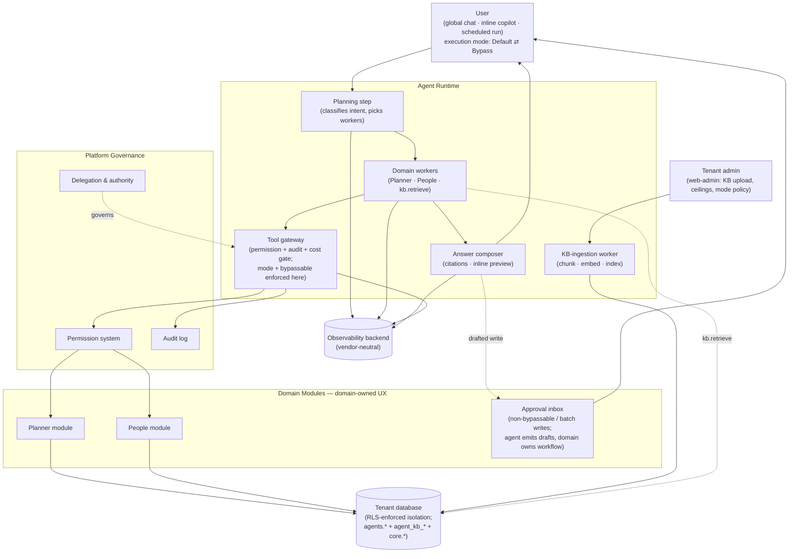

### 4.3 Design Principles

§4.1 named the architectural moves. This section names the **invariants every future decision must respect** — the rules that survive when the strategy expands or a new module joins. If a future change violates a principle, the principle wins or the principle gets explicitly revisited; silent exceptions are not tolerated.

| #    | Principle                                                                     | What it means in practice                                                                                                                                                                                 |
| ---- | ----------------------------------------------------------------------------- | --------------------------------------------------------------------------------------------------------------------------------------------------------------------------------------------------------- |
| P-1  | **The boundary is the gateway, not the prompt**                               | A successful prompt-injection attack still cannot exceed the caller's permissions, because the gateway and the database refuse — independent of what the AI was told to do.                               |
| P-2  | **The agent runs as the caller**                                              | No service-account bypass anywhere in the call chain. If the user cannot do it, the agent cannot do it on their behalf.                                                                                   |
| P-3  | **Memory inherits the caller's permission scope**                             | The agent's memory layers cannot pre-load facts the caller could not retrieve themselves. Convenience never weakens isolation.                                                                            |
| P-4  | **Delegation, not impersonation**                                             | Async and approved-write actions carry scoped, expiring, audited delegation grants. Never copied credentials, never long-lived tokens.                                                                    |
| P-5  | **The agent produces artifacts; the domain owns workflows**                   | Writes land in existing surfaces — inline preview in the chat (Default mode) or the existing approval inbox (inbox-path / non-bypassable). The agent does not maintain a parallel approval state machine. |
| P-6  | **Honesty over fluency**                                                      | Failure is reported truthfully — degraded mode, partial answer, committed-before-cancel timestamp. The platform does not paper over reality with fluent prose.                                            |
| P-7  | **Trust earned, not declared**                                                | Each capability iteration unlocks only after the previous one shows production accuracy data and an incident-free window. No "ship it and hope" autonomy upgrades.                                        |
| P-8  | **Observability from day zero**                                               | Version-tagged, trace-correlated, tenant-partitioned spans on every action. Retrofitting observability is measurably more expensive than building with it.                                                |
| P-9  | **Composition-attack defense at PR-time, not runtime**                        | Aggregate-returning tools declare a minimum group size at design time, reviewed at code-review. The runtime monitors patterns but does not infer attacker intent at call time.                            |
| P-10 | **Defensive posture via observability + rate-limiting, not intent detection** | Abnormal patterns are rate-limited and visible to operators; the platform does not attempt to classify whether a user is "an attacker" mid-call.                                                          |
| P-11 | **Design-ready for later**                                                    | Where a future capability has cheap Phase-1 invariants (shadow-ready gateway, opt-in tool metadata, idempotency-key shape), those invariants are baked in even when the capability ships later.           |

---

## 5. Architecture Views

§4 stated the strategic shape and the invariants. This section drills from that level into the system as engineers will build, deploy, and operate it. Six views, in order of increasing technical depth: system context, logical components, data, integration, infrastructure, security. A seventh view (§5.7) covers reliability and failure handling end-to-end.

### 5.1 System Context View (C4 Level 1)

The agent module sits inside the Future platform and interacts with **four classes of external actor** and **four external systems**. Everything outside the dotted boundary is owned by someone else; everything inside is the scope of this document.

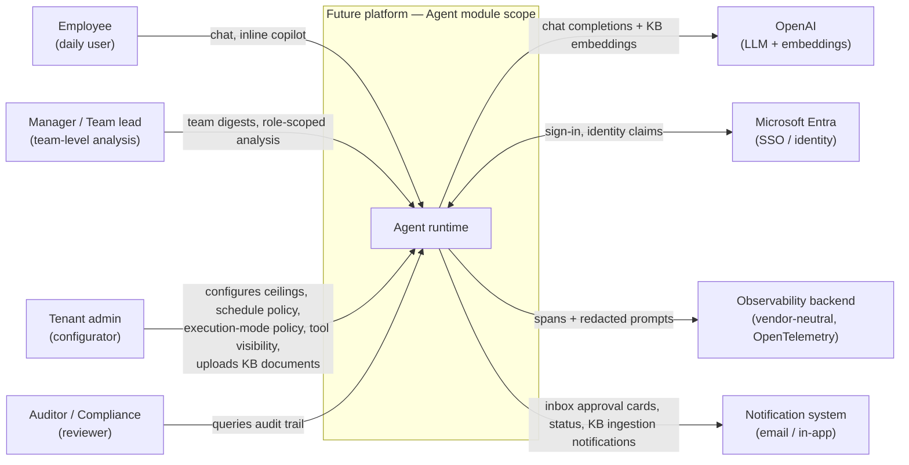

**External actors:**

| Actor                | What they do                                                                                              | What they expect from the agent                                      |
| -------------------- | --------------------------------------------------------------------------------------------------------- | -------------------------------------------------------------------- |
| Employee             | Asks questions, requests drafted actions, runs scheduled tasks                                            | Plain-language access; agent never lies or oversteps                 |
| Manager / Team lead  | Asks team-level analytical questions; uses team digests; confirms their own drafts (same as any employee) | Honest, role-scoped analysis; aggregates respect composition defence |
| Tenant admin         | Configures cost ceilings, schedule policies, execution-mode policy, tool visibility, KB document upload   | Self-service; changes take effect without engineering                |
| Auditor / Compliance | Reconstructs what the agent did and why, on demand                                                        | A single query that returns full lineage; no forensic reconstruction |

**External systems:**

| System                | Role                                                                                                                                                                                        | Interface                                               | Failure posture                                                                |
| --------------------- | ------------------------------------------------------------------------------------------------------------------------------------------------------------------------------------------- | ------------------------------------------------------- | ------------------------------------------------------------------------------ |
| OpenAI                | LLM provider — `gpt-5.4` (router/synthesizer), `gpt-5.4-nano` (classify/inline), `text-embedding-3-small`                                                                                   | HTTPS, vendor SDK, OpenAI-compatible                    | Quality canary + degradation ladder — see §5.7                                 |
| Microsoft Entra       | SSO and identity                                                                                                                                                                            | OIDC                                                    | Sign-in failure surfaces as a platform-level error, not an agent error         |
| Observability backend | Trace storage, query, sampling                                                                                                                                                              | OpenTelemetry exporter (vendor TBD; selection deferred) | Vendor-neutral export; backend swap is a configuration change                  |
| Notification system   | Email and in-app delivery of inbox-path approval cards, status messages, scheduled-run digests and nudges. (Inline-preview confirmations in Default mode are in-chat, not via this system.) | Existing platform notification module                   | The agent emits an event; delivery is the notification module's responsibility |

**Trust boundary.** The dotted boundary in the diagram is the line every external interaction crosses. **Three properties hold at the boundary**, regardless of which actor or system is on the other side:

- The caller's identity and access rights flow into every action the agent takes inside the boundary.
- Every action that crosses the boundary outbound is audited.
- No data leaves the boundary except through one of the four external systems above.

**What the agent module does NOT depend on.** The agent does not call Slack, MS Teams, or other channel surfaces directly at Phase 1 — these arrive in later phases through the notification module's existing channel adapters. The agent does not call domain modules other than Planner and People; cross-module reach happens through the platform's permission and query facades, not through direct integration.

### 5.2 Logical / Component Architecture (C4 Level 2)

This view zooms inside the agent runtime container shown in §5.1. It is the engineering map: the components, their layered placement, the direction of dependencies, and the contract between layers.

#### 5.2.1 Container diagram

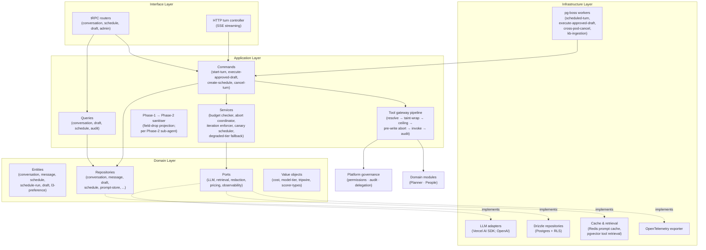

#### 5.2.2 Layer responsibilities

The module follows **hexagonal DDD**. Dependencies point inward only; the Domain layer has zero framework dependencies.

| Layer              | Owns                                                                           | Knows nothing about                    |
| ------------------ | ------------------------------------------------------------------------------ | -------------------------------------- |
| **Interface**      | tRPC routers, HTTP turn controller, SSE event encoding                         | Drizzle, OpenAI, pg-boss               |
| **Application**    | Commands, queries, pipeline orchestration, runtime services                    | Drizzle, OpenAI SDK details            |
| **Domain**         | Entities, value objects, ports (interfaces), repository interfaces             | NestJS, Drizzle, the LLM, anything I/O |
| **Infrastructure** | Drizzle implementations, LLM adapters, pg-boss workers, OpenTelemetry exporter | Domain rules, business invariants      |

#### 5.2.3 Component map

| Component                          | Layer          | Role                                                                                                                                                                              |
| ---------------------------------- | -------------- | --------------------------------------------------------------------------------------------------------------------------------------------------------------------------------- |
| **HTTP turn controller**           | Interface      | Owns the SSE connection per live turn; composes the turn's abort signal; routes start/cancel events                                                                               |
| **tRPC routers**                   | Interface      | Type-safe API surface for conversation, schedule, draft, admin operations                                                                                                         |
| **Start-turn command**             | Application    | Single entry point for any new turn; sets up budget, observability, abort signal, conversation context                                                                            |
| **Execute-approved-draft command** | Application    | Fired from pg-boss when the requester confirms an inbox-path draft; revalidates against live state, then invokes the domain command under the original delegation                 |
| **Cancel-turn command**            | Application    | Marks a turn cancelled; forwards across pods if the running turn lives elsewhere                                                                                                  |
| **Tool gateway pipeline**          | Application    | Six-step ordered pipeline every tool call traverses (resolve → taint-wrap → ceiling pre-check → pre-write abort → invoke → audit emit)                                            |
| **Budget checker**                 | Application    | Pre-turn refusal and mid-turn abort against per-turn / per-user / per-tenant / per-delegation ceilings                                                                            |
| **Abort coordinator**              | Application    | Composes the typed cancellation reason (`user / timeout / budget / provider_outage / quality_canary`); single abort path                                                          |
| **Iteration ceiling enforcer**     | Application    | Guards the ReAct loop on max iterations, cumulative cost, cumulative wallclock between iterations                                                                                 |
| **Quality canary scheduler**       | Application    | Hourly synthetic probe per model tier; flips degraded flag on rolling 30-min success rate                                                                                         |
| **Degraded-tier fallback service** | Application    | Routes a turn to the smaller model when the canary flags the flagship as degraded                                                                                                 |
| **LLM adapters**                   | Infrastructure | Vercel AI SDK wrappers; OpenAI provider integration; cache-token accounting                                                                                                       |
| **Drizzle repositories**           | Infrastructure | Concrete implementations of domain repository interfaces; enforce RLS through request-bound DB connection                                                                         |
| **pg-boss workers**                | Infrastructure | Scheduled-turn worker, execute-approved-draft worker, cross-pod-cancel worker, KB-ingestion worker (chunk + embed + index uploaded documents) — each version-pinned per job spawn |
| **Prompt cache + tool retrieval**  | Infrastructure | Redis prompt cache for cost; pgvector tool retrieval (top-K per sub-agent invocation)                                                                                             |
| **OpenTelemetry exporter**         | Infrastructure | Span emit, GenAI semantic conventions, sampling decision propagation                                                                                                              |

#### 5.2.4 Module boundary contract

Three rules enforce the layering and the platform-wide DDD discipline. **Violations fail at build, not at code review.**

| Rule                                | What it enforces                                                                                                                                                                                                |
| ----------------------------------- | --------------------------------------------------------------------------------------------------------------------------------------------------------------------------------------------------------------- |
| **No cross-module domain imports**  | The agent module never imports from another module's `domain/` or `infrastructure/`. Cross-module reads happen through that module's exposed query facade only.                                                 |
| **Single facade per module**        | The agent module exposes exactly two facades to other modules — `AgentQueryFacade` (read-only) and `AgentAuditFacade` (write the audit trail). No other surface.                                                |
| **Tool surface is opt-in metadata** | A tRPC procedure becomes an agent-callable tool only when its meta block declares it agent-exposed. Adding the agent surface requires explicit per-procedure decision; no central registry to forget to update. |

#### 5.2.5 Single-turn runtime flow

The bounded execution model from §4.1 S-1 mechanises like this for a topology-mode-1 turn (App B):

| #   | Step                                                                                                                                                                                  | Owning component                | Output                                                                      | Primary failure mode                                                                          |
| --- | ------------------------------------------------------------------------------------------------------------------------------------------------------------------------------------- | ------------------------------- | --------------------------------------------------------------------------- | --------------------------------------------------------------------------------------------- |
| 1   | Open SSE; compose abort signal; invoke start-turn                                                                                                                                     | HTTP turn controller            | Composed `AbortSignal`; opened response stream                              | Client disconnect — short-circuit start-turn                                                  |
| 2   | Pre-turn budget refusal check                                                                                                                                                         | Budget checker                  | Pass (proceed) or refuse (`turn.ended.reason: refused`)                     | Tenant ceiling exhausted — refuse with reason                                                 |
| 3   | Open observability root span; stamp tenant/trace/flow/intent identifiers                                                                                                              | Observability adapter           | Root span open                                                              | Exporter unavailable — span buffered locally                                                  |
| 4   | Planning LLM call; structured-output plan validated against schema                                                                                                                    | Router                          | Plan: `{ intent, sub-agents, expected output shape }`                       | Structured-output parse fail — one retry then escalate to disambiguation (§5.7.1 class 5)     |
| 5   | Spawn Phase-1 sub-agents in parallel under their own budgets                                                                                                                          | Start-turn command              | One sub-agent runner per Phase-1 entry                                      | Per-sub-agent budget breach — sub-agent aborts; sibling sub-agents continue                   |
| 6   | Sub-agent ReAct loop (production-grade — capped iterations, abortable mid-loop, every step audited and observable); each tool call traverses the gateway pipeline (six ordered steps) | Sub-agent runner + Tool gateway | Tool call results captured to L1 cache; audit emitted per call              | Per-tool ceiling — tripwire `retry` first, `abort` second; circuit breaker after two failures |
| 7   | Phase-1 → Phase-2 sanitiser projects to each Phase-2 sub-agent's input schema (where Phase 2 exists)                                                                                  | Sanitiser (pure function)       | Field-dropped projection per Phase-2 entry                                  | Plan-shape mismatch — one bounded re-plan then escalate                                       |
| 8   | Sub-agents return structured summaries with confidence and provenance                                                                                                                 | Sub-agent runner                | Summaries with `{ summary, semantics, confidence, source_tool_provenance }` | Sub-agent error — class-specific behaviour (§5.7.1)                                           |
| 9   | Synthesizer LLM call; shape declaration fires before first token                                                                                                                      | Synthesizer                     | Shape event + token stream + citations                                      | Provider degradation — degradation ladder steps 1–3                                           |
| 10  | SSE token stream to client; structured trailing event carries final shape and citations                                                                                               | HTTP turn controller            | User sees streamed answer                                                   | Cancel arrives — pre-write check + honesty contract (§5.7.4)                                  |
| 11  | Close root span with sampling decision; finalise audit per tool call                                                                                                                  | Observability adapter           | Trace persisted at sampled rate                                             | Sampling decision applied per stratified rules (§5.7.8)                                       |

Detailed sequence diagrams for live turn, drafted-write approval, scheduled async run, and cancellation are in §5.4.

#### 5.2.6 Sub-agent prompt boundary

Mode-1 dispatches multiple workers in parallel. The prompt each worker receives is **explicitly bounded** — not a snapshot of the parent conversation. This is a security and cost contract, not a convenience choice.

| Worker receives                                  | Worker does **not** receive                                                                                                                      |
| ------------------------------------------------ | ------------------------------------------------------------------------------------------------------------------------------------------------ |
| Router-issued sub-task (intent + arguments)      | Parent conversation L2 (full or summarised). Cross-turn context only re-enters via lazy-fetched L4 facts the worker requests under caller scope. |
| Shared turn-taint flag (read-only)               | The verbatim text of any earlier tool result. Workers re-fetch under the caller's current permission scope, never replay history.                |
| Lazy-fetched L4 (tenant / role facts) on request | L3 user preferences. Preferences shape the **synthesizer**'s output, not worker behaviour.                                                       |
| Composed `AbortSignal` (parameter-threaded)      | Direct DB or kernel access. Every read is a gateway-mediated tool call.                                                                          |

**Why these specifically:**

- **No parent L2** — the prompt-injection blast radius for any tainted message stays scoped to the turn and worker that retrieved it. A compromised conversation cannot taint workers in unrelated future turns.
- **Cross-worker taint propagation is invariant, not heuristic.** Once any worker in a turn retrieves a tool result containing `tenantAuthoredFreeText`, the turn-taint flag flips for _every_ sibling worker still running and every worker spawned afterward. Build-time test (EI-extension) asserts the flag-propagation contract: a fixture turn with one tainted worker and one parallel write-worker must produce a tainted-write audit on the second.
- **Lazy L4, not pre-injected** — workers ask for what they need; the prompt token count of unused tenant facts is zero. P-3 (memory inherits caller scope) is mechanical, not a habit.

The synthesizer's prompt boundary is different — it sees the L2 selection set computed at turn start (per ADR-029), the workers' structured summaries, and L3 user preferences. The synthesizer never calls tools; its boundary is read-only across the layers that shape phrasing.

### 5.3 Data Architecture

The agent module owns the `agents` schema in Postgres. Delegation rows are kernel-owned and live in `core.agent_delegation` (the agent module reads them through the platform's authority facade; no direct foreign-key reference).

#### 5.3.1 Tables grouped by concern

Every table carries `tenant_id` and forces RLS (D-1, D-2). The "Primary key shape" column shows the partition shape per cluster.

| Cluster                                 | Tables                                                                                                                            | Primary key shape                                                                                                                      | Purpose                                                                                                                     |
| --------------------------------------- | --------------------------------------------------------------------------------------------------------------------------------- | -------------------------------------------------------------------------------------------------------------------------------------- | --------------------------------------------------------------------------------------------------------------------------- |
| **Conversation state**                  | `agent_conversation`, `agent_message`                                                                                             | `(tenant_id, conversation_id)`; messages indexed `(tenant_id, user_id, conversation_id, created_at)`                                   | The visible chat history per user, per surface.                                                                             |
| **User-scoped state**                   | `agent_l3_preference`, `agent_scratchpad`                                                                                         | `(tenant_id, user_id, key)`                                                                                                            | UX-scoped preferences (display format, default currency view) and the agent-writable scratchpad (Beta-gated).               |
| **Drafts and confirmations**            | `agent_draft`                                                                                                                     | `(tenant_id, draft_id)`; indexed by `(tenant_id, requester_id, status)`                                                                | Pending drafted actions (inbox path); carries the permission envelope captured at draft time and the provenance block.      |
| **Scheduled and async**                 | `agent_schedule`, `agent_schedule_run`                                                                                            | `(tenant_id, schedule_id)` and `(tenant_id, schedule_id, run_id)`                                                                      | Schedule definition (cron, scope, delegation reference) and per-run audit.                                                  |
| **Per-turn runtime**                    | `agent_active_turn`, `agent_iteration`, `agent_turn_sampling_decision`                                                            | `(tenant_id, trace_id)`                                                                                                                | Live-turn registry (cross-pod cancellation lookup), iterative-loop state, sampling decision per trace.                      |
| **Tool layer**                          | `agent_tool_invocation`, `agent_tool_result_cache`, `agent_tool_embedding`, `agent_semantic_index`                                | `(tenant_id, trace_id, call_id)` for audit; `(tenant_id, tool_name, canonical_args_hash)` for cache; vector cluster keyed by embedding | Per-call audit; semantic result cache; pgvector indexes for tool retrieval.                                                 |
| **Tenant knowledge base (RAG)**         | `agent_kb_document`, `agent_kb_chunk`, `agent_kb_embedding`, `agent_kb_ingestion_run`                                             | `(tenant_id, document_id)`; chunks `(tenant_id, document_id, chunk_id)`; vector index `(tenant_id, embedding)` HNSW                    | Admin-imported reference material; chunked + embedded for retrieval; ingestion-run audit. Tenant-keyed; never cross-tenant. |
| **Prompt versioning and replay**        | `agent_prompt_store`, `agent_narrative_store`                                                                                     | `(content_hash)` — append-only, content-addressed                                                                                      | Replay-deterministic prompt reconstruction (D-4).                                                                           |
| **Cost and budgeting**                  | `agent_tenant_budget`, `agent_user_budget`, `agent_cost_event`                                                                    | `(tenant_id)` and `(tenant_id, user_id)` for budgets; `(tenant_id, trace_id, event_id)` for events                                     | Per-scope ceilings + per-event ledger with cache-aware token breakdown.                                                     |
| **Quality and rollout**                 | `agent_canary_run`, `agent_canary_query`, `agent_golden_trace`, `agent_rollout_config`, `agent_rollout_event`, `agent_shadow_run` | Mostly `(tenant_id, run_id)` keyed                                                                                                     | Health probe + regression suite + rollout state + shadow-mode runs.                                                         |
| **Kernel-owned (read-only from agent)** | `core.agent_delegation`                                                                                                           | `(tenant_id, delegation_id)`                                                                                                           | Delegation grants — scoped, expiring, audited.                                                                              |

#### 5.3.2 Entity relationships (logical)

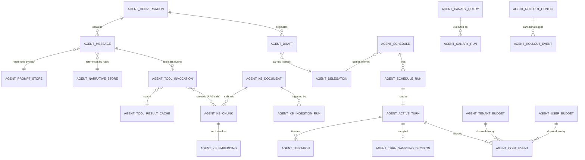

Cross-schema relationships (drafts and schedules referencing `core.agent_delegation`) are **logical, not foreign-keyed**. The agent module reads delegation rows through the kernel's authority facade.

#### 5.3.3 Data invariants

The schema enforces five invariants. Each is a build-time test (integration suite asserts the property; the build fails if a future migration breaks it).

| Invariant                                              | What it enforces                                                                                                                                                     |
| ------------------------------------------------------ | -------------------------------------------------------------------------------------------------------------------------------------------------------------------- |
| **D-1 — `tenant_id` on every table**                   | No exceptions. Every row belongs to exactly one customer organisation.                                                                                               |
| **D-2 — RLS forced on every tenant-scoped table**      | `relforcerowsecurity = true`; the request-bound DB session sets `app.tenant_id`; the database refuses cross-tenant rows independently of application code.           |
| **D-3 — No foreign keys across schema boundaries**     | Schema-per-module discipline. Cross-schema relationships are logical and read through facades.                                                                       |
| **D-4 — Append-only stores are content-hash-keyed**    | `agent_prompt_store` and `agent_narrative_store` use the canonical content hash as primary key; same content writes idempotently.                                    |
| **D-5 — Idempotency-key column on write-tool results** | (Phase-1 readiness backlog — RAID R-12.) The `(tenant_id, idempotency_key)` pair guarantees a retried write returns the original result, never produces a duplicate. |

#### 5.3.4 Retention and lifecycle

| Data class                                                              | Default retention                                             | GDPR erasure behaviour                                                                                                                            |
| ----------------------------------------------------------------------- | ------------------------------------------------------------- | ------------------------------------------------------------------------------------------------------------------------------------------------- |
| Conversation content (`agent_message.content`, `agent_message.summary`) | 90 days active, then archive or hard-delete per tenant config | **Hard-delete content; retain anonymised shell** (`id`, `trace_id`, `created_at`) so audit and trace-backend joins do not dangle                  |
| L3 preferences                                                          | Until user-deleted                                            | Hard-delete on erasure request                                                                                                                    |
| Tool result cache                                                       | TTL declared per tool (typically minutes to hours)            | Eviction on next mutation in the domain; user-scoped purge on erasure                                                                             |
| Prompt and narrative stores                                             | Indefinite (content-hashed, deduplicated)                     | Not personal data; not subject to user erasure                                                                                                    |
| Audit and cost events                                                   | 90+ days, configurable per tenant for compliance              | Retained under documented legitimate-interest; structural fields only                                                                             |
| Trace data                                                              | ≥30 days, vendor-dependent                                    | Vendor selection criteria require user-scoped purge support                                                                                       |
| Tenant knowledge base (`agent_kb_*`)                                    | Until admin deletes or deprecates the document                | Not user-personal data; tenant-owned. Deprecated documents are excluded from retrieval but retained as audit shell unless the admin hard-deletes. |

### 5.4 Integration Architecture

Six flows cover Phase-1 integration: the live read-only turn, two write paths that branch on execution mode (single-target confirm-or-bypass; batch/cross-target inbox), the scheduled async run, cancellation, and tenant-knowledge-base ingestion. Each is shown as a sequence diagram followed by the integration points and failure paths the diagram does not show inline.

#### 5.4.1 Live interactive turn

The most common flow. A user asks a question; the agent answers. Bounded DAG (topology mode 1, see App B) is the typical shape — one planning step, one or two sub-agents in parallel, one synthesizer.

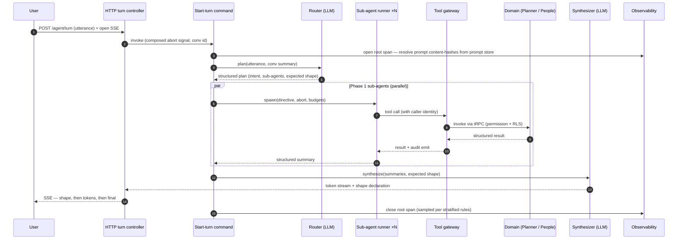

**Integration points:**

| Point               | Contract                                                                                                                                                                              |
| ------------------- | ------------------------------------------------------------------------------------------------------------------------------------------------------------------------------------- |
| HTTP → Start-turn   | Composed abort signal threaded as a parameter; never reconstructed downstream                                                                                                         |
| Start-turn → Router | Single LLM call; outputs validated against the router-plan schema before phase execution                                                                                              |
| Sub-agent → Gateway | Every tool call traverses the six-step pipeline (§5.2.3); audit emit is non-skippable                                                                                                 |
| Gateway → Domain    | Server-side tRPC caller (no direct service injection); permission middleware + RLS apply automatically                                                                                |
| Knowledge retrieval | A worker tool (`kb.retrieve`) — not a separate sub-agent. Returns top-K chunks with `(document_id, section, score)` provenance; tenant-keyed pgvector index. Gated by FR-C9 / FR-C10. |
| Synthesizer → SSE   | Shape declaration fires before the first token so the UI can render progressively; citations rendered inline as `[doc-title §section]` references                                     |

**Failure paths (handled by §5.7 mechanisms):** provider 5xx → single retry → fall back to nano; per-tool ceiling → tripwire → sub-agent continues with other tools; circuit-breaker trip → "tool X unavailable this turn" propagates to Phase 2.

#### 5.4.2 Single-target write — mode-controlled

Used for write tools that opt into mode-controlled behaviour (see Appendix D `bypassable: true`). The user's chat-level execution mode picks the branch. In both branches the change runs under the requester's own authority and the audit event is identical — only the confirmation step differs.

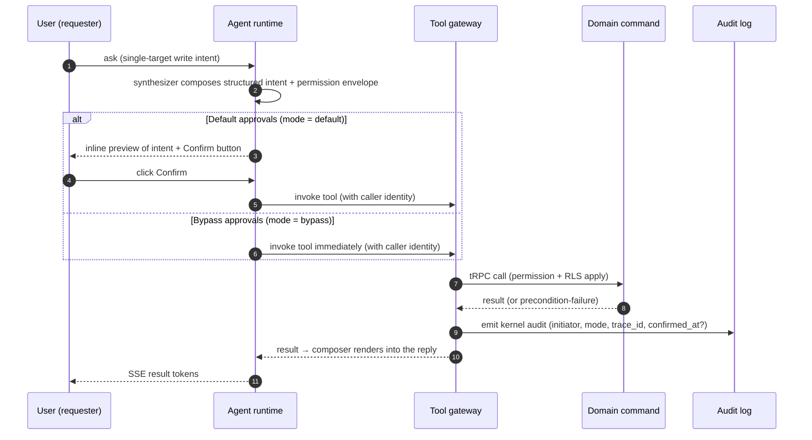

**Integration points:**

| Point                       | Contract                                                                                                                                |
| --------------------------- | --------------------------------------------------------------------------------------------------------------------------------------- |
| Mode resolution             | Mode read once per turn from the conversation row; cannot change mid-turn. Tenant override (`bypass_disabled`) forces Default.          |
| Bypassable check            | Gateway refuses to run in Bypass mode if the tool meta declares `bypassable: false`; falls through to inbox path (5.4.3).               |
| Inline-preview confirmation | Confirm click is a typed event on the SSE channel; no separate HTTP round-trip; cancel collapses into the standard cancel path (5.4.5). |
| Audit emit                  | `mode` field on the audit event is `default` or `bypass`; `confirmed_at` populated only in Default mode.                                |

**Failure paths:** user denies the inline preview → emit `agent.write_declined` audit; tool meta is `bypassable: false` → gateway forces inbox path with a user-visible "this one needs approval" notice; precondition revalidation fails at execute time → emit `agent.write_failed` audit and surface to the user inline.

#### 5.4.3 Batch or cross-target write — approval inbox

Used for tools whose meta declares `bypassable: false` (bulk meeting-extraction batches, cross-target reassignments, destructive operations). The user's execution mode is irrelevant here — the inbox path always runs.

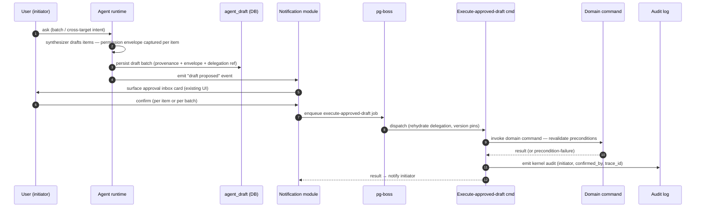

**Integration points:**

| Point                   | Contract                                                                                                                              |
| ----------------------- | ------------------------------------------------------------------------------------------------------------------------------------- |
| Draft persistence       | Permission envelope captured at draft time; provenance block always populated (empty array, never absent)                             |
| Notification → pg-boss  | Confirmation is the only event that triggers `execute-approved-draft` enqueue; rejection emits a kernel audit and updates draft state |
| Worker → Domain command | Domain command **must** revalidate preconditions; the draft payload is intent, not a snapshot of ground truth                         |
| Audit emit              | `initiator` and `confirmed_by` appear on the same event (in self-confirm flows the two are equal); reconstruction is a single query   |

**Failure paths:** draft TTL expiry → auto-reject → notify initiator; precondition revalidation fails at execute time → emit `agent.draft_execution_failed` audit → notify initiator; permission narrowing between draft and execute → execution fails with the standard permission-denied path.

#### 5.4.4 Scheduled async run

A schedule fires. The agent runs a turn under a delegation grant, with the same security model as a live turn but no live user attached.

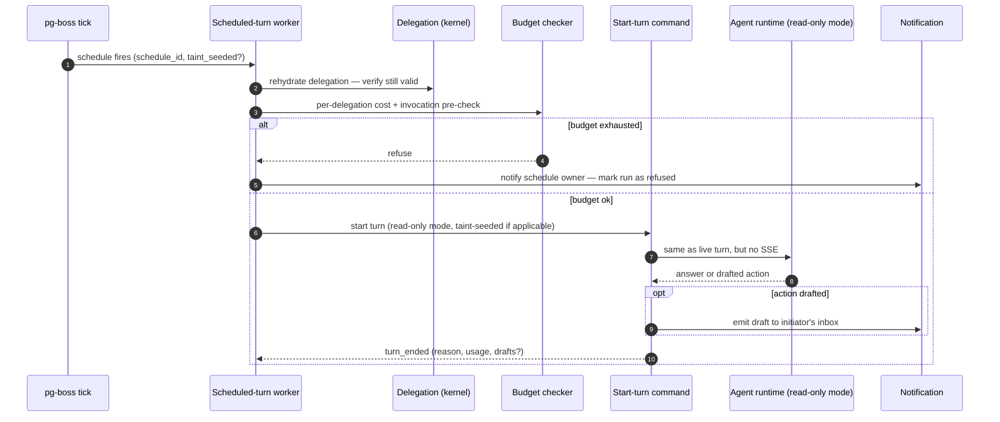

**Integration points:**

| Point                  | Contract                                                                                                                                                         |
| ---------------------- | ---------------------------------------------------------------------------------------------------------------------------------------------------------------- |
| Delegation rehydrate   | Validity check at every fire — expired delegations refuse cleanly, never silently elevate to caller                                                              |
| Pre-spawn budget check | Fires **before** the LLM turn spawns; catches misfiring schedules at the cheapest possible point                                                                 |
| Read-only mode         | Tool gateway refuses `.mutation()` procedures regardless of model intent during scheduled runs (Phase-1 constraint C-5)                                          |
| Taint seeding          | If the trigger event is tenant-authored content, the turn starts tainted; any drafted action lands on the inbox path regardless of any execution-mode preference |
| Version pinning        | Job row carries `pinned_versions` at spawn; any retry rehydrates the same versions, even if rollout has advanced                                                 |

**Failure paths:** delegation expired → audit + refuse + notify; budget refusal → audit + skip + notify; turn errors during run → standard error class taxonomy (§5.7.1); schedule-level circuit breaker if the same schedule fails N consecutive runs.

#### 5.4.5 Cancellation

A user cancels a running turn. The active-turn registry tells the platform which pod owns the running turn; the cancel signal reaches it; the turn ends with a typed reason and an honest report of any write that committed before cancellation arrived.

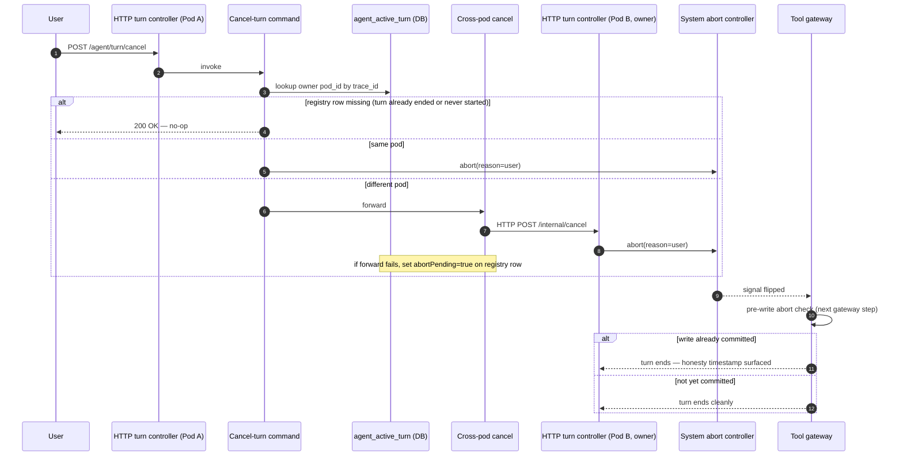

**Integration points:**

| Point                 | Contract                                                                                                                    |
| --------------------- | --------------------------------------------------------------------------------------------------------------------------- |
| Active-turn registry  | Single source of truth for which pod owns which trace_id; updated on turn start, cleared on turn end                        |
| Cross-pod forward     | HTTP POST to the owning pod; if forward fails, the `abortPending` flag is the durable backstop checked at next gateway step |
| Pre-write abort check | The gateway's step 4 check (§5.2.5) — once past it, the write commits and cannot be rolled back                             |
| Honesty contract      | If a write committed before the cancel arrived, the timestamp is surfaced to the user (§5.7.4)                              |

**Failure paths:** registry row missing (turn never started or already ended) → cancel is a no-op; cross-pod HTTP failure → durable flag picked up at next gateway boundary; cancel during synthesizer streaming → the SSE stream truncates at next token boundary, structured "cancelled" event closes the stream.

#### 5.4.6 Tenant knowledge ingestion

The flow that turns an admin-uploaded document into retrievable chunks. Decoupled from the live turn: ingestion runs asynchronously through pg-boss; the admin sees status notifications, not a blocking call.

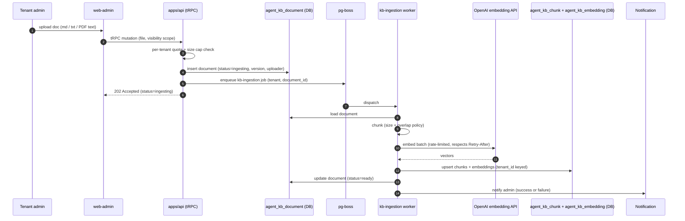

**Integration points:**

| Point                        | Contract                                                                                                                                              |
| ---------------------------- | ----------------------------------------------------------------------------------------------------------------------------------------------------- |
| Quota + size cap             | Pre-enqueue check refuses oversize documents and tenants over their document quota; admin sees the refusal reason on the upload screen.               |
| Async ingestion              | The HTTP request returns immediately with `status=ingesting`; the admin polls or receives a notification when the worker finishes.                    |
| Embedding rate limit         | The worker rate-limits embedding calls per tenant; bulk uploads queue rather than parallelise (see RAID R-22).                                        |
| Tenant-keyed index           | The pgvector index is keyed `(tenant_id, embedding)`; cross-tenant retrieval is blocked by RLS on `agent_kb_*` (EI-11).                               |
| Deprecate / re-index         | Admin-initiated; deprecation excludes the document from retrieval immediately and retains the audit shell. Re-index re-runs chunk + embed end-to-end. |
| Visibility-scope on retrieve | The `kb.retrieve` tool filters chunks by the caller's role / scope at query time using the visibility scope set at upload (RAID R-21).                |

**Failure paths:** chunker error → document marked `status=failed`, admin notified with the error class; embedding API outage → worker retries with backoff (degradation ladder step 8 in §5.7.3); per-tenant quota breach during re-index → refused, admin notified to deprecate older docs first; partial-success batch → individual chunks succeed and are indexed; failed chunks recorded for retry.

### 5.5 Infrastructure / Deployment Architecture

Phase 1 deployment is **single-region, single-AZ-tolerant**. Multi-region failover and cross-provider routing activate at Beta on traffic justification (see Constraint C-1).

#### 5.5.1 Deployment topology

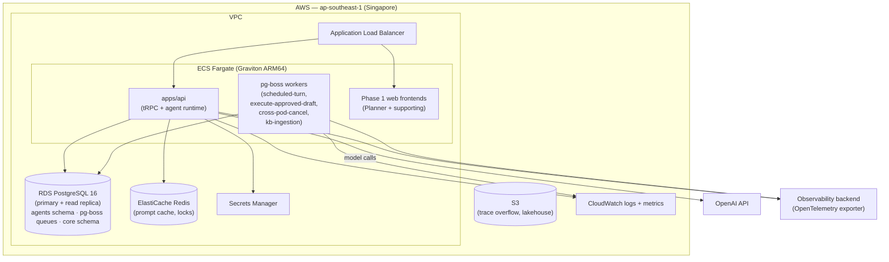

#### 5.5.2 Service sizing

| Service                        | Phase 1 sizing                               | Scaling trigger                                                   |
| ------------------------------ | -------------------------------------------- | ----------------------------------------------------------------- |
| `apps/api` (Fargate task)      | 2 tasks × 1 vCPU / 2 GB                      | CPU > 70% sustained 5 min; or active-turn count > 80% of capacity |
| pg-boss workers (Fargate task) | 1 task × 0.5 vCPU / 1 GB                     | Queue depth > 50 jobs sustained 2 min                             |
| Web frontends (Fargate task)   | 1 task per Phase-1 zone × 0.25 vCPU / 0.5 GB | CPU > 60% sustained 5 min                                         |
| RDS Postgres 16 — primary      | `db.t4g.medium`                              | Connection count > 80% of pool; CPU > 70%                         |
| RDS Postgres 16 — read replica | `db.t4g.medium`                              | Replica lag > 30s                                                 |
| ElastiCache Redis              | `cache.t4g.small`                            | Memory > 75%                                                      |

Production runs on-demand with no reserved instances at Phase 1; reserved instances activate after Q3 once load patterns stabilise (see §10).

#### 5.5.3 Network topology

| Layer                 | Subnet                   | Notes                                                |
| --------------------- | ------------------------ | ---------------------------------------------------- |
| ALB                   | Public subnet, two AZs   | TLS termination via ACM; HTTP/2 to backends          |
| ECS tasks             | Private subnets, two AZs | No public IPs; egress through NAT Gateway            |
| RDS, ElastiCache      | Private subnets, two AZs | No public access; security-group-locked to ECS tasks |
| Secrets Manager       | VPC endpoint (Interface) | No internet egress for secret retrieval              |
| OpenAI API            | Egress via NAT Gateway   | TLS 1.3; per-tenant API keys not used at Phase 1     |
| Observability backend | Egress via NAT Gateway   | Vendor selection deferred; OTel-neutral exporter     |

Single-AZ-tolerant means a single AZ failure degrades capacity but does not lose data: RDS Multi-AZ failover, ECS task replacement across AZs, Redis primary-replica failover. **Single-region** means a region-wide AWS failure renders the platform unavailable; cross-region failover is a Beta capability.

#### 5.5.4 Deployment pipeline

| Stage               | Action                                                                      | Gate                                       |
| ------------------- | --------------------------------------------------------------------------- | ------------------------------------------ |
| Build               | Bun build; container image (ARM64); push to ECR                             | All tests pass; type check clean           |
| Deploy — staging    | ECS task definition swap; canary at 100% (single tenant: SETA dev)          | Smoke test of golden traces                |
| Deploy — production | ECS task definition swap; canary at 1% → 5% → 25% → 100% over 60 min        | Auto-rollback on regression signals (§10)  |
| Schema — production | Forward-only migrations after stable Beta; rollback strategy is forward-fix | Migration idempotency confirmed in staging |

**Prompt-only changes** flow through the content-hash store without ECS deployment — a new prompt is a database row, not a code release. Capability-iteration rollout (e.g. enabling write tools for a tenant once read-only quality measures clear) is a configuration change at tenant scope, not a deployment.

### 5.6 Security Architecture

The §1 promises (caller's-rights-only, two-mode confirmation, full audit) are enforced by the layers below. The boundary properties — _the agent never has more access than the person asking it_, _every action is auditable as a single query_ — are not restated here; this section is the engineering reference behind them.

#### 5.6.1 Defence-in-depth model

Six enforcement layers, in order of strength. Layers 1–4 are **the security boundary**; layers 5–6 reduce attack surface but are not relied on for correctness.

| #   | Layer                        | Mechanism                                                                                                                                                              | Bypassable?                      |
| --- | ---------------------------- | ---------------------------------------------------------------------------------------------------------------------------------------------------------------------- | -------------------------------- |
| 1   | Tenant isolation             | Postgres RLS (`relforcerowsecurity = true`); `app.tenant_id` set per request via the request-bound DB session                                                          | No (DB-enforced)                 |
| 2   | Per-action permission        | Permission middleware on every protected tRPC procedure; `canDo` evaluated against the caller's grants                                                                 | No (middleware-enforced)         |
| 3   | Tool gateway                 | Procedures opt into agent visibility via meta declaration; gateway invokes via the server-side tRPC caller so layers 1+2 always apply                                  | No (single ingress)              |
| 4   | Role + screen filter         | Static pre-LLM filter drops tools the caller's role or current screen could not use                                                                                    | No (compile-time scope)          |
| 5   | Structural prompt delimiters | Tool results wrapped in `<tenant_authored>`, `<user_data>`, `<tool_result>` with system-prompt instruction to treat content as information not directives              | Yes (UX hardening, not boundary) |
| 6   | Field-level taint            | Turn-scoped flag set when a tool result contains tenant-authored free-text; forces every subsequent write in the turn onto the inbox path regardless of execution mode | Yes (UX hardening, not boundary) |

#### 5.6.2 Threat catalogue

| Threat                               | Vector                                                                                                                                                                                  | Defence                                                                                                                                                                                                                                                                                   |
| ------------------------------------ | --------------------------------------------------------------------------------------------------------------------------------------------------------------------------------------- | ----------------------------------------------------------------------------------------------------------------------------------------------------------------------------------------------------------------------------------------------------------------------------------------- |
| **Prompt injection**                 | Malicious instructions hidden in task descriptions, comments, meeting notes the agent reads                                                                                             | Layers 1–4 hold regardless of prompt content; layer 6 (taint) bumps approval requirement; layer 5 (delimiters) reduces compliance rate                                                                                                                                                    |
| **Cross-tenant data leak**           | Faulty or absent tenant isolation; shared embedding/vector index                                                                                                                        | Layer 1 (DB-enforced RLS); no cross-tenant vector index at Phase 1; integration test asserts RLS on every table at build time                                                                                                                                                             |
| **Composition-derived disclosure**   | Multiple individually-permitted aggregate queries combine to reveal a single individual                                                                                                 | `compositionSensitive` declaration on aggregate tools (PR-time review, principle P-9); runtime monitor flags burst patterns to audit team                                                                                                                                                 |
| **Runaway cost / abuse**             | Misfiring schedule, malicious user spamming queries, prompt-injection-driven loop                                                                                                       | Layered budget ceilings (per question / user-day / tenant-day / delegation); pre-spawn check on schedules; rate limits on user query rate                                                                                                                                                 |
| **JWT not inherited**                | Service-account bypass somewhere in the call chain elevates the agent above caller                                                                                                      | Architectural rule (P-2); build-time lint bans direct domain-service injection in agent module                                                                                                                                                                                            |
| **Replay-fuzzy-fallback**            | Replay harness silently substitutes a near-match prompt when exact hash is missing                                                                                                      | Replay raises on hash miss; never falls back to fuzzy match (named anti-pattern, ADR-008 consequence)                                                                                                                                                                                     |
| **Stale draft execution**            | Approved action executes against state that has changed since draft                                                                                                                     | `approvalFreshness: 'revalidate'` default on every write tool; domain command revalidates preconditions at execute time (§5.4.3)                                                                                                                                                          |
| **Approval fatigue**                 | The requester clicks confirm (Default mode) or accepts items in the approval inbox without reading them after volume crosses a threshold; the human-in-the-loop becomes nominal         | Inline-preview rate-limit per requester per minute; approval inbox depth throttle (§5.7.3 step-7-adjacent counter); UX surfaces drafted-action volume to the requester and to admin dashboards; admin can pin sensitive tools to "always confirm" to bypass the Bypass mode for that tool |
| **Cost weaponisation**               | Internal user (or compromised account) intentionally drives expensive turns to exhaust the tenant ceiling and deny service to colleagues                                                | Per-user-day budget separate from tenant-day budget; rate-limit on queries-per-user-per-minute; admin dashboard surfaces top spend contributors; suspicious patterns alert before tenant ceiling is reached                                                                               |
| **Agent-induced over-disclosure**    | Legitimate user asks a benign question; the agent's answer aggregates or surfaces information the user could technically read but should not have presented in this combined form       | `compositionSensitive` declarations on aggregate tools (P-9); synthesizer cited-source rendering exposes provenance; runtime monitor flags unusual aggregation patterns to the audit team                                                                                                 |
| **Model output toxicity / harm**     | The model produces output that is offensive, biased, or harmful, surfaced verbatim to the user                                                                                          | Provider-level safety filters (OpenAI moderation); platform-level content filtering on synthesizer output; thumbs-down feedback feeds quality canary corpus                                                                                                                               |
| **Cancel-race contract scope limit** | The honesty-timestamp contract (§5.7.4) is acceptable for Planner-class workflows but does not satisfy regulators in finance/legal contexts; using it there creates compliance exposure | The contract scope is **explicitly limited to Phase-1 Planner-class workflows**. Extending the agent into regulated modules (finance, legal) requires an upgraded write-protocol (durable workflow with rollback or strong idempotency keys) before activation                            |

#### 5.6.3 GDPR right-to-erasure pipeline

A user erasure request fans out to a single transactional pipeline:

1. Hard-delete the user's conversation content (`agent_message.content`, `agent_message.summary`).
2. Hard-delete L3 preferences keyed to the user.
3. Purge user-scoped tool result cache entries.
4. Trigger trace-backend user-scoped purge (vendor selection criteria require this support).
5. Retain anonymised audit shells (id, trace_id, timestamps) under documented legitimate-interest for compliance defensibility.

Partial success is a compliance incident; the pipeline is transactional or compensating.

#### 5.6.4 Secrets and key management

| Secret                   | Storage                                                              | Rotation                                    |
| ------------------------ | -------------------------------------------------------------------- | ------------------------------------------- |
| OpenAI API key           | AWS Secrets Manager; tenant-scoped at Beta, platform-wide at Phase 1 | 90 days; on suspected compromise, immediate |
| JWT signing key          | AWS Secrets Manager                                                  | 90 days                                     |
| Database credentials     | AWS Secrets Manager; rotated by RDS-managed rotation                 | 30 days                                     |
| Provider webhook secrets | AWS Secrets Manager                                                  | Per integration policy                      |

No secret in environment files, container images, source code, or the database.

#### 5.6.5 Security test surface

Each security property below is asserted by an automated test that fails the build on regression.

| Property                                                  | Test type                                                                                                                                             |
| --------------------------------------------------------- | ----------------------------------------------------------------------------------------------------------------------------------------------------- |
| Every tenant-scoped table has RLS forced on               | Integration test scans `pg_class.relforcerowsecurity`                                                                                                 |
| Permission middleware on every protected procedure        | Build-time meta scan; missing meta fails build                                                                                                        |
| Cross-module domain imports forbidden in the agent module | Lint rule (build-blocking)                                                                                                                            |
| Replay raises on hash miss; never silent fallback         | Unit test asserts the raise                                                                                                                           |
| `approvalFreshness` declared on every write tool          | Build-time meta drift test                                                                                                                            |
| `compositionSensitive` declared on aggregate tools        | Build-time meta drift test                                                                                                                            |
| Cross-tenant leak canary                                  | Daily synthetic cross-tenant probe across `agents.*` (incl. `agent_kb_*`); alert on success — covers RLS, retrieval, and `kb.retrieve` filter (EI-11) |

---

### 5.7 Reliability, Resilience & Failure Handling

> A dedicated treatment is included because the failure surface of an LLM-driven agent — provider outages, rate limits, partial answers, racing cancellations, silent quality regressions — differs from a typical request/response service and is the leading source of operational risk in production agent platforms.

> **What ships when.** The treatment below is the **target architecture** for the runtime. The Phase 1 sprint ships a focused subset (read-only Q&A + tenant KB); the remaining mechanisms ship as later capability iterations add writes and async automation. The split is:
>
> | Mechanism                                                   | Sprint scope (read-only)                                                                      | Post-sprint (writes onward)                                    |
> | ----------------------------------------------------------- | --------------------------------------------------------------------------------------------- | -------------------------------------------------------------- |
> | Error class taxonomy (5.7.1)                                | All 8 classes                                                                                 | —                                                              |
> | Single-layer retry with backoff (5.7.1, 5.7.2)              | Yes                                                                                           | —                                                              |
> | Per-tool circuit breaker (5.7.2)                            | Yes                                                                                           | —                                                              |
> | Degradation ladder steps 1–3 (5.7.3)                        | Yes                                                                                           | —                                                              |
> | Degradation ladder steps 4–7 (canary-driven, budget-driven) | Targeted; activates as canary corpus and tenant-budget defaults populate                      | Fully operational once writes ship                             |
> | Cancellation, abort signal, cancel-race contract (5.7.4)    | Yes                                                                                           | —                                                              |
> | Cross-pod cancellation (§5.4.5)                             | Yes — `apps/api` runs ≥2 tasks (§5.5.2) so cross-pod is the standard path from sprint go-live | —                                                              |
> | Wallclock + per-turn ceilings (5.7.5)                       | Yes                                                                                           | —                                                              |
> | Idempotency-key schema for writes (5.7.6)                   | Schema landed as readiness item R-12; no write tools call it yet (sprint is read-only)        | Activates when single-target writes ship in the next iteration |
> | Quality canary (5.7.7)                                      | Synthetic probe runs hourly from sprint go-live                                               | Full coverage once writes ship                                 |
> | Embedding-API degradation (KB)                              | Yes — `kb.retrieve` falls back to "answering without knowledge base" (see §5.7.3)             | —                                                              |
> | KB ingestion retry (`kb-ingestion` worker)                  | Yes — pg-boss retry with backoff; failed docs surfaced in admin UI                            | —                                                              |
> | Semantic result cache                                       | Backlog item — defer until profiling shows benefit                                            | Optimisation                                                   |
>
> Industry reports place tool-call retry rates at 15–30% in production agent systems, well above conventional API error rates — the case for designing for this surface from day one.

#### 5.7.1 Failure model and error class taxonomy

The agent runtime classifies every failure into one of a closed set of named classes. The class determines retry disposition, observability tagging, and user-visible message — never an ad-hoc string. There is no "unknown" class.

| Class                    | Source                                                                        | Disposition                                                                                                              | Notes                                                               |
| ------------------------ | ----------------------------------------------------------------------------- | ------------------------------------------------------------------------------------------------------------------------ | ------------------------------------------------------------------- |
| Tool validation          | Model called a tool with bad arguments or unresolved IDs                      | Retry × 1 per tool per iteration, × 2 per turn                                                                           | Counts toward circuit breaker                                       |
| Permission denied        | Permission middleware refused; database returned empty under tenant isolation | No retry; tool disabled in this sub-agent for the rest of the turn                                                       | "Not permitted, proceed without"                                    |
| Domain execution         | Optimistic lock conflict, downstream 500, downstream timeout                  | Domain owns concurrency retry; gateway retries network-only, max 2 with backoff                                          | Distinct "transient" error class returned to model on final failure |
| LLM provider             | Provider rate limit (429), 5xx, timeout                                       | Retry with jitter, max 2; **single retry layer only** (gateway OR SDK, never both stacked)                               | Honors provider `Retry-After` header where present                  |
| Structured-output parse  | Router or sub-agent structured decoder failed to validate                     | One retry with schema re-injection; then escalate to disambiguation                                                      | No silent string-repair fallback                                    |
| Ceiling hit (turn-scope) | Per-turn budget, wallclock, or iteration cap reached                          | Not retried; sub-agent aborts; synthesizer runs against whatever is available                                            | Partial-answer gate applies (see §5.7.4)                            |
| Ceiling hit (tool-scope) | Per-tool ceiling (bytes scanned, wallclock) breached                          | Returned to the model as a distinct error for this call only; sub-agent continues with other tools; second breach aborts | Disposition: `retry` first time, `abort` second                     |
| Model refusal / policy   | Model declined to comply                                                      | No retry; emitted as a structured refusal event                                                                          | Distinct from system refusal                                        |

**Single retry layer rule.** Industry guidance (OpenAI Cookbook, AWS Bedrock retry mode notes) and operational experience converge: stacked retries across SDK, application, and gateway silently multiply attempts and worsen the load on a degrading provider. The runtime owns retry; the underlying SDK retry is disabled.

#### 5.7.2 Circuit breaker

**Per-tool, per-sub-agent, turn-scoped.** Two failures of the same tool in one sub-agent disable that tool for the remainder of the turn. State is held in turn context only; no cross-turn carryover. The disabled state propagates from a Phase-1 sub-agent into Phase-2 fan-out via the sanitized handoff context as a "tool X unavailable this turn" note — Phase-2 sub-agents do not retry the broken tool.

Industry practice has not converged on a canonical threshold. Two failures is intentionally conservative: it accepts one transient miss without giving up, refuses a third call that is unlikely to succeed, and prevents a runaway error loop from consuming the per-turn iteration cap on a single broken dependency.

#### 5.7.3 Graceful degradation ladder

When a dependency degrades, the runtime walks an explicit, ordered ladder. **Each step is observable via distinct trace tags and is communicated to the user when it changes their experience.** Silent degradation is forbidden — if quality drops, the user is told.

| Step | Trigger                                                           | Action                                                                                                                                                | What the user sees                                                                      |
| ---- | ----------------------------------------------------------------- | ----------------------------------------------------------------------------------------------------------------------------------------------------- | --------------------------------------------------------------------------------------- |
| 1    | Provider transient error (5xx, timeout)                           | Single retry with jitter                                                                                                                              | (none — retry is invisible)                                                             |
| 2    | Retry exhausted on the flagship model                             | Fall back to the smaller, faster model for this call                                                                                                  | "Switched to a faster model for this response"                                          |
| 3    | Smaller model also failing                                        | Short-circuit the sub-agent; synthesizer runs against whatever data is available                                                                      | "Partial answer — model unavailable"                                                    |
| 4    | Quality probe flags the flagship as degraded                      | Tenant-wide route to the smaller model until the probe recovers                                                                                       | "Answering in simplified mode — full quality resumes shortly"                           |
| 5    | Quality probe flags both tiers as degraded                        | Continue on the less-degraded tier with an elevated user-visible notice                                                                               | "Service quality is degraded across all tiers"                                          |
| 6    | Severe degradation (probe success rate below 50% on both tiers)   | Refuse new turns; admin alerted                                                                                                                       | "Service temporarily unavailable; try again shortly"                                    |
| 7    | Tenant daily spending budget reached (100%)                       | Refuse new turns until refill                                                                                                                         | "Daily budget reached; try again after [time]"                                          |
| 8    | Embedding API (used by `kb.retrieve` and `kb-ingestion`) degraded | `kb.retrieve` calls return empty; the synthesizer answers from non-KB sources only and discloses the gap. `kb-ingestion` worker retries with backoff. | "Answering without the knowledge base — knowledge retrieval is temporarily unavailable" |

**Multi-provider failover (gateway-level routing across multiple AI providers) is treated by recent industry experience as a baseline expectation and is explicitly a Beta capability for this platform.** The Phase-1 ladder runs entirely within a single provider's tiers. The ladder's _shape_ does not change at Beta — a new step (alternate provider) inserts between steps 1 and 2 without re-architecting downstream behaviour.

#### 5.7.4 Cancellation and abort

**Single abort path with typed reason.** User cancellation, system-triggered abort (budget tripped, provider outage, quality canary degraded), and wallclock timeout all flow through the same code path. They differ only in the value of `cancellation_reason`, a closed enum: `user | timeout | budget | provider_outage | quality_canary`. There is no "unknown" or null reason; that would be a runtime bug.

**Composed abort signal.** At turn entry, a single composed signal is built from `[user_cancel, wallclock_timeout, system_abort]` (browser-native `AbortSignal.any`) and threaded as a parameter through every layer. It is never reconstructed at leaf nodes and never stored in async-local storage — both patterns drift over time and produce ghost-cancellation bugs.

**Cancel-race contract (the key honesty property).** The gateway checks the abort signal **immediately before issuing a write call**. Once past that check, the write commits and cancellation cannot undo it. This is not a limitation of our system — industry-wide, the cancel-vs-committed-write race is unresolved at the SDK level (Vercel AI SDK exposes the abort signal but does not solve durable rollback). Our contract is: tell the user the truth.

> "Timesheet draft saved at 10:23:45.102 before cancellation at 10:23:45.401."

No fictional rollback messages, no silently-discarded partial writes.

**Cross-pod cancellation.** Because turns can run on a different pod than the user's HTTP connection, a cancel signal from one pod must reach the running turn on another. The active-turn registry records the owning pod; cancel requests are forwarded over HTTP, with an `abortPending` flag in the registry as the durable backstop in case the forward fails.

#### 5.7.5 Timeouts and ceilings

Layered, every layer named, every breach observable.

| Ceiling                        | Default                                                    | Scope                   | Enforced where                                                       |
| ------------------------------ | ---------------------------------------------------------- | ----------------------- | -------------------------------------------------------------------- |
| Per-turn wallclock             | 30 s (interactive); per-surface override                   | Whole turn              | Composed abort signal at router entry                                |
| Per-sub-agent ReAct iterations | 4–5                                                        | One sub-agent           | Iteration enforcer between iterations                                |
| Per-tool wallclock             | Declared per tool in metadata                              | Single tool call        | Gateway pre-check + invocation timeout                               |
| Per-tool bytes-scanned         | Declared per tool                                          | Single tool call        | Gateway pre-check                                                    |
| Per-turn dollar cost           | Declared at session start; default minimum $0.10 remaining | Whole turn              | Pre-turn check refuses; mid-turn check aborts                        |
| Per-user daily                 | Tenant-configurable                                        | One user across the day | Pre-turn check; soft 80% warning, hard 100% block                    |
| Per-tenant daily               | Tenant-configurable                                        | All users in a tenant   | Pre-turn check; tiered: 80% async pause, 95% nano-only, 100% refuse  |
| Per-delegation                 | Per scheduled job at creation                              | Single scheduled run    | Checked **before** the LLM turn spawns (catches misfiring schedules) |

Industry-converging defaults referenced for sanity: ~30s tool-call timeout, ~15 max iterations per turn, ~60–120s for interactive turns. Asynchronous runs may extend wallclock substantially (default 5 min); this trades latency for completion likelihood on event-triggered work.

#### 5.7.6 Idempotency

**Replay determinism for read-side operations is achieved through canonical hashing.** Tool arguments are canonicalised to a deterministic JSON form (lexicographic key sort, `undefined` dropped, `null` preserved, ISO-8601 dates re-parsed to UTC), hashed, and used as the key for the within-turn read cache. The same call with the same arguments returns the same result without a second tool invocation, on the same turn.

**For writes, idempotency must be explicit.** Industry-reported retry rates of 15–30% on tool calls make this mandatory; an agent that retried a "create task" tool after a transient timeout must not produce two tasks. The platform pattern: a write tool that may be retried declares an idempotency-key field in its meta; the application generates a key per intended side effect; the receiving domain command persists `(tenant, key, response)` and returns the cached response on a replay.

> **Phase-1 implementation status:** the idempotency-key schema is on the pre-launch readiness backlog (RAID R-12). Until it ships, write-class tools that may be retried are gated to manual-only execution, where the user retries explicitly rather than the runtime retrying invisibly.

#### 5.7.7 Quality canary

The agent's answer quality can degrade silently — a model version updated by the provider, a prompt change rolled out, a retrieval index drift — without any error code firing. To catch this, the platform runs a continuous health probe.

- **What is probed.** A small set of canonical queries with known-good expected answers, run on a schedule (hourly) against each model tier (flagship and smaller). The corpus is rotated quarterly from anonymised production traffic so it does not ossify against a fixed pattern.
- **What it produces.** A rolling success-rate per tier. When the rate drops below 90% for a 30-minute rolling window, the tier is flagged degraded; the graceful degradation ladder routes around it (step 4 or 5 above). A second, stricter threshold (50% rolling success) triggers hard-refuse (step 6).
- **What the user sees.** Either nothing (probe healthy), a "simplified mode" notice (one tier degraded), or an "elevated degradation" notice (both tiers).
- **What does not gate it.** LLM-as-a-judge scoring is deferred until a hand-labelled validation corpus shows the judge agrees with humans above a 95% threshold. Until then, only deterministic scorers gate quality decisions.

The probe is also the agent's primary input to the auto-rollback decision during canary deployments — a regression that does not trip an error monitor will trip the probe.

#### 5.7.8 Observability hooks for reliability

Every reliability-relevant event is a typed signal on the trace, not a string log line. The platform adopts the **OpenTelemetry GenAI semantic conventions** (the emerging industry standard) for span attributes: `gen_ai.agent.{id, name, version}`, `gen_ai.tool.{name, call.id}`, `gen_ai.request/response.*` for model and token accounting. To this the runtime adds platform-specific attributes:

- `cancellation_reason` (when the span ended in abort)
- `tier_shift` vs `provider_fallback` (distinct trace tags — policy-driven tier change vs error-recovery fallback; conflating them hides root cause)
- `circuit_broken_at` (per-tool circuit breaker state)
- `ladder_step_reached` (which step of the degradation ladder the turn reached)
- `cost_ceiling_hit`, `wallclock_ceiling_hit`, `iteration_ceiling_hit` (boolean tags on the trace root)

Stratified sampling captures these triggers at 100% even when baseline traffic samples at 1% (see §5.4 Integration Architecture).

---

## 6. Technology Stack

Each row names the layer, the technology, the role it plays in the agent module, and the rationale (why this over the obvious alternative). Versions are pinned platform-wide; the agent module does not choose its own.

| Layer              | Technology                                                                                                                 | Role                                                                                  | Rationale (vs alternative)                                                                                                                                                                                 |
| ------------------ | -------------------------------------------------------------------------------------------------------------------------- | ------------------------------------------------------------------------------------- | ---------------------------------------------------------------------------------------------------------------------------------------------------------------------------------------------------------- |
| Language / Runtime | TypeScript on Node.js (Bun for tooling)                                                                                    | All agent code                                                                        | End-to-end type safety from tRPC schemas through domain logic into the LLM SDK. Alternative: Python (loses type safety into the LLM layer and across the tRPC boundary).                                   |
| Backend Framework  | NestJS (modular monolith via Turborepo)                                                                                    | Dependency injection, module boundaries, lifecycle                                    | DI surface is the natural place to enforce hexagonal layering. Alternative: Express/Fastify directly (no DI primitive; layer-rule lint becomes brittle).                                                   |
| API Surface        | tRPC (end-to-end type-safe)                                                                                                | Tool gateway invokes domain procedures via the server-side caller                     | Tool meta lives on the procedure declaration; permission middleware is non-skippable. Alternative: REST/OpenAPI (loses type-safety into the agent SDK; meta lives outside the procedure, drift-prone).     |
| LLM orchestration  | Vercel AI SDK (primitive-level — `streamText`, `generateObject`, MCP support)                                              | Sub-agent ReAct loop, structured output, streaming                                    | Primitive-level surface lets the platform own orchestration (ADR-001). Alternative: LangChain/LlamaIndex (orchestration framework — fights bounded-DAG topology; large dependency surface).                |
| LLM provider       | OpenAI — `gpt-5.4` (router, synthesizer), `gpt-5.4-nano` (classify, inline copilots), `text-embedding-3-small` (retrieval) | Per-tier model selection                                                              | Single provider at Phase 1 (Constraint C-2); multi-provider gated to Beta. Cache-token accounting and structured output are mature on this provider.                                                       |
| Database           | PostgreSQL 16 + Drizzle ORM; schema-per-module; RLS forced                                                                 | All agent state                                                                       | RLS is the security boundary (ADR-003); pgvector available in the same instance. Alternative: separate vector store (multiplies operational surface; cross-store consistency is an unforced complication). |
| Vector index       | pgvector HNSW                                                                                                              | Tool retrieval, semantic result cache, **tenant knowledge base RAG (FR-C9 / FR-C10)** | Co-located with relational data; tenant-keyed by construction.                                                                                                                                             |
| Job queue          | pg-boss                                                                                                                    | Scheduled agents, `execute-approved-draft`, cross-pod cancel, `kb-ingestion`          | Postgres-backed queue means schedule rows and audit are in the same transaction. Alternative: SQS/Redis queues (cross-store consistency hazard for delegation rehydrate).                                  |
| Cache              | ElastiCache Redis                                                                                                          | Prompt cache, distributed locks                                                       | Sub-millisecond hit latency; required by the prompt-cache discipline in §5.7.8.                                                                                                                            |
| Streaming          | Server-Sent Events (SSE)                                                                                                   | Turn output, phase progress events                                                    | Native browser support, no protocol complexity, abort signal flows through naturally. Alternative: WebSockets (bidirectional capability the agent does not need; more failure modes).                      |
| Observability      | OpenTelemetry SDK (vendor-neutral); backend vendor deferred                                                                | Span tracing, prompt capture, sampling                                                | GenAI semantic conventions are industry-converging (ADR-022); vendor swap is configuration-only.                                                                                                           |
| Infrastructure     | AWS ECS Fargate Graviton ARM64; Terraform IaC                                                                              | Single-region (ap-southeast-1) Phase 1                                                | ARM64 cost/energy advantage; single-AZ-tolerant; multi-region gated to Beta.                                                                                                                               |
| Secrets            | AWS Secrets Manager                                                                                                        | OpenAI key, JWT signing key, DB credentials                                           | RDS-managed rotation for DB credentials; VPC endpoint for retrieval. No secrets in env files, code, images, or DB.                                                                                         |

---

## 7. Architecture Decision Records (ADRs)

This section is the **index** of architectural decisions made for the agent module. Each row names a decision and its status. Full ADRs (Context · Decision · Consequences in Michael-Nygard format) live in a companion ADR log; the index here is what reviewers scan to verify nothing important is undocumented.

**Status meanings:** _Accepted_ — the decision is the current standard. _Superseded by ADR-NNN_ — replaced by a later decision (no decisions are superseded yet at Phase 1). _Proposed_ — under review (none currently). ADRs are grouped by category for scannability.

**Topology and execution model**

| #       | Decision                                                                                                                                                                                                             | Status   |
| ------- | -------------------------------------------------------------------------------------------------------------------------------------------------------------------------------------------------------------------- | -------- |
| ADR-001 | Vercel AI SDK at primitive level (not orchestration framework)                                                                                                                                                       | Accepted |
| ADR-002 | Bounded DAG (router → sub-agents → synthesizer); not freeform supervisor                                                                                                                                             | Accepted |
| ADR-013 | No autonomous async writes at Phase 1 (read-only + draft-to-inbox only)                                                                                                                                              | Accepted |
| ADR-021 | Self-built tool gateway over LLM-gateway-as-a-service products; rationale: gateway is the security boundary and must enforce permission middleware + tenant isolation, not just route calls                          | Accepted |
| ADR-023 | pg-boss for scheduled and approved-execution work (over SQS or Temporal); rationale: queue rows live in Postgres alongside delegation and audit, enabling single-transaction enqueue+state-update semantics          | Accepted |
| ADR-024 | Server-Sent Events for turn output (over WebSocket or HTTP-streaming); rationale: native browser support, abort signal flows through naturally, no protocol complexity for the unidirectional stream the agent needs | Accepted |

**Security and trust**

| #       | Decision                                                                                                                                                                                                                                                                                                                                                                                                                                                                                                                                                                                                                                                                                   | Status   |
| ------- | ------------------------------------------------------------------------------------------------------------------------------------------------------------------------------------------------------------------------------------------------------------------------------------------------------------------------------------------------------------------------------------------------------------------------------------------------------------------------------------------------------------------------------------------------------------------------------------------------------------------------------------------------------------------------------------------ | -------- |
| ADR-003 | Database-enforced tenant isolation as the unbypassable security boundary                                                                                                                                                                                                                                                                                                                                                                                                                                                                                                                                                                                                                   | Accepted |
| ADR-004 | Agent runs with caller's permissions; no service-account bypass                                                                                                                                                                                                                                                                                                                                                                                                                                                                                                                                                                                                                            | Accepted |
| ADR-005 | Delegation grants (scoped, expiring, audited); not impersonation                                                                                                                                                                                                                                                                                                                                                                                                                                                                                                                                                                                                                           | Accepted |
| ADR-006 | Domain owns approval workflows; agent does not maintain parallel state machine. Both write paths (inline preview in chat, inbox) are domain-owned UX surfaces.                                                                                                                                                                                                                                                                                                                                                                                                                                                                                                                             | Accepted |
| ADR-011 | Tool registration via opt-in metadata on each tRPC procedure                                                                                                                                                                                                                                                                                                                                                                                                                                                                                                                                                                                                                               | Accepted |
| ADR-027 | **Two execution modes per conversation: Default approvals (inline preview + confirm) and Bypass approvals (run immediately).** A non-bypassable floor (bulk batches, cross-target writes, destructive actions) always lands on the inbox path regardless of mode. Tenant admins can disable Bypass tenant-wide or pin specific tools to "always confirm". Rationale: matches modern-agent UX expectations users carry from Claude Code / Cursor / Copilot / ChatGPT Agent; the floor preserves the security boundary; tenant override preserves enterprise control. Alternatives rejected: single confirm-everything mode (approval fatigue) or single auto-execute mode (no safety brake) | Accepted |

**Memory and replay**

| #       | Decision                                                                                                                                                                                                                                                                                                                                                                                                                                                                                                                                                                                                                                                                                                                                                                                                              | Status   |
| ------- | --------------------------------------------------------------------------------------------------------------------------------------------------------------------------------------------------------------------------------------------------------------------------------------------------------------------------------------------------------------------------------------------------------------------------------------------------------------------------------------------------------------------------------------------------------------------------------------------------------------------------------------------------------------------------------------------------------------------------------------------------------------------------------------------------------------------- | -------- |
| ADR-007 | No embeddings for **conversational** memory at Phase 1; recency + user preferences only. Scope: this applies to cross-conversation recall ("you mentioned X yesterday") — admin-imported tenant knowledge base via embeddings (ADR-028) is explicitly in scope. Trade-off: forfeits conversational recall for simplicity and zero cross-tenant-leak surface; revisited when session lengths exceed context window                                                                                                                                                                                                                                                                                                                                                                                                     | Accepted |
| ADR-008 | Content-hash-keyed prompt store for deterministic replay                                                                                                                                                                                                                                                                                                                                                                                                                                                                                                                                                                                                                                                                                                                                                              | Accepted |
| ADR-025 | pgvector co-resident with relational data (over a dedicated vector store); rationale: tenant-keyed by construction; one store to operate, one consistency model                                                                                                                                                                                                                                                                                                                                                                                                                                                                                                                                                                                                                                                       | Accepted |
| ADR-028 | **Tenant knowledge base (RAG) at Phase 1**, with admin ingestion via `web-admin` (FR-C9 / FR-C10). Knowledge retrieval is a single read tool (`kb.retrieve`) on the worker, not a separate sub-agent. Tenant-keyed pgvector HNSW index; no cross-tenant search. Alternative considered: defer RAG to Beta — rejected because tenant-curated knowledge Q&A is the highest-leverage common capability across modules and demands tenant-isolated infrastructure that is cheaper to build correctly day-1 than to retrofit                                                                                                                                                                                                                                                                                               | Accepted |
| ADR-029 | **Bounded prompt-assembly budget per turn, deterministic and replay-correlated.** Each LLM call's prompt is built by the algorithm in Appendix C.2: pin the per-surface budget, fill fixed-cost layers, fill L2 by recency-then-compacted-summary, materialise the selection set as content hashes, refuse on overflow rather than silently truncate. Rationale: replay (ADR-008) requires deterministic prompt reconstruction; embedding-based "most relevant" selection is non-reproducible across model revisions; budget overflow is a refusal, not a truncation, because silent drops break the agent's honesty contract (P-6). Trade-off: forfeits embedding-based recall for replay determinism — same posture as ADR-007 for conversational memory                                                            | Accepted |
| ADR-030 | **L2 compaction at threshold; summariser is a first-class instrumented LLM call.** When verbatim L2 tokens exceed `compaction_threshold` (default 6,000), a pg-boss compaction job runs off the turn's hot path, calls a configurable model tier (default smaller-tier per ADR-018 ladder posture), preserves intent / entities / decisions / drafts / taint events, strips verbatim tool text and raw args, emits `span_type=L2_COMPACTION` with its own cost event, and stores the summary as a content-hashed row alongside (not in place of) the original turns until retention expires. Rationale: long conversations are inevitable in production; ad-hoc truncation breaks both replay and trust. Alternative considered: pin to a specific model tier — rejected to preserve the operator's tier-tuning lever | Accepted |
| ADR-031 | **Tainted tool output stored by reference, not inlined.** Tool results containing `tenantAuthoredFreeText` are persisted to L2 as `{tool, args_hash, retrieved_at, citation_ref}` — never as inlined verbatim text. Later turns that select the entry re-fetch under the caller's current permission scope (P-3); revoked or deleted sources resolve to "no longer available" rather than replaying authored-by-others text. Rationale: contains prompt-injection blast radius across turns; an attacker who plants instructions in a task description cannot have those instructions resurface verbatim into a future turn's prompt. The L3.5 scratchpad (Beta-gated) inherits the same contract by pre-declaration: any L3.5 write originating from a turn-tainted run is force-routed through the inbox path       | Accepted |
| ADR-032 | **Previewed intents (Default mode) are L1-only; never persisted to L2 unless confirmed.** The structured intent shown inline for confirmation lives only in the turn's working memory. On confirm, L2 receives the semantic outcome reference (idempotency key + outcome summary + draft id if applicable) — never the raw tool args. On decline, L2 receives a single line recording the outcome with timestamp; the proposed payload does not enter conversation history. Rationale: a conversation history that stores unconfirmed payloads is a replay vector (an attacker who can re-issue the turn can re-submit the original intent); also reduces the write-replay safety contract surface — a re-played write turn is read-only by construction (idempotency key + outcome reference, no executable payload) | Accepted |

**Cost and observability**

| #       | Decision                                                                                                  | Status   |
| ------- | --------------------------------------------------------------------------------------------------------- | -------- |
| ADR-009 | Stratified sampling (1% baseline + 100% on triggers)                                                      | Accepted |
| ADR-010 | Dollar-denominated cost ceilings with cache-aware accounting                                              | Accepted |
| ADR-015 | Observability backend vendor deferred; OpenTelemetry-neutral exporter from v1                             | Accepted |
| ADR-022 | OpenTelemetry GenAI semantic conventions for span attributes; platform-specific attributes layered on top | Accepted |

**Reliability and resilience**

| #       | Decision                                                                                                                                                                                                                                                                                                                                                                                                                                                                                                                                                                                                                                                                                                                                                                                                                                                                                                                                                                                                                                                                                                                                                                                                                                                                                                                                                                                                                                                                                                                                                                                                                                                                                                | Status   |
| ------- | ------------------------------------------------------------------------------------------------------------------------------------------------------------------------------------------------------------------------------------------------------------------------------------------------------------------------------------------------------------------------------------------------------------------------------------------------------------------------------------------------------------------------------------------------------------------------------------------------------------------------------------------------------------------------------------------------------------------------------------------------------------------------------------------------------------------------------------------------------------------------------------------------------------------------------------------------------------------------------------------------------------------------------------------------------------------------------------------------------------------------------------------------------------------------------------------------------------------------------------------------------------------------------------------------------------------------------------------------------------------------------------------------------------------------------------------------------------------------------------------------------------------------------------------------------------------------------------------------------------------------------------------------------------------------------------------------------- | -------- |
| ADR-012 | OpenAI single-provider at Phase 1; multi-provider gated to Beta                                                                                                                                                                                                                                                                                                                                                                                                                                                                                                                                                                                                                                                                                                                                                                                                                                                                                                                                                                                                                                                                                                                                                                                                                                                                                                                                                                                                                                                                                                                                                                                                                                         | Accepted |
| ADR-014 | Deterministic scorers only at Phase 1; LLM-as-judge gated on meta-eval. Trade-off: forfeits broader quality coverage until a hand-labelled corpus shows judge agreement ≥95% with humans                                                                                                                                                                                                                                                                                                                                                                                                                                                                                                                                                                                                                                                                                                                                                                                                                                                                                                                                                                                                                                                                                                                                                                                                                                                                                                                                                                                                                                                                                                                | Accepted |
| ADR-016 | Single retry layer (gateway-owned); SDK-level retry disabled to prevent stacked attempts                                                                                                                                                                                                                                                                                                                                                                                                                                                                                                                                                                                                                                                                                                                                                                                                                                                                                                                                                                                                                                                                                                                                                                                                                                                                                                                                                                                                                                                                                                                                                                                                                | Accepted |
| ADR-017 | Per-tool circuit breaker, two-failure threshold, turn-scoped. Threshold rationale: industry has not converged on a canonical number; two accepts one transient miss without giving up, refuses a third call unlikely to succeed, and prevents one broken dependency from consuming the per-turn iteration cap                                                                                                                                                                                                                                                                                                                                                                                                                                                                                                                                                                                                                                                                                                                                                                                                                                                                                                                                                                                                                                                                                                                                                                                                                                                                                                                                                                                           | Accepted |
| ADR-018 | Seven-step graceful degradation ladder over binary up/down; each step distinctly trace-tagged and user-visible when experience changes                                                                                                                                                                                                                                                                                                                                                                                                                                                                                                                                                                                                                                                                                                                                                                                                                                                                                                                                                                                                                                                                                                                                                                                                                                                                                                                                                                                                                                                                                                                                                                  | Accepted |
| ADR-019 | Cancel-race honesty contract: pre-write abort check + truthful timestamp; no fictional rollback                                                                                                                                                                                                                                                                                                                                                                                                                                                                                                                                                                                                                                                                                                                                                                                                                                                                                                                                                                                                                                                                                                                                                                                                                                                                                                                                                                                                                                                                                                                                                                                                         | Accepted |
| ADR-020 | Quality canary as tenant-wide degradation trigger (not just per-call); rolling 30-minute success rate per tier                                                                                                                                                                                                                                                                                                                                                                                                                                                                                                                                                                                                                                                                                                                                                                                                                                                                                                                                                                                                                                                                                                                                                                                                                                                                                                                                                                                                                                                                                                                                                                                          | Accepted |
| ADR-026 | Composed `AbortSignal.any` for turn cancellation, threaded as a parameter through every layer (over async-local-storage); rationale: stored or reconstructed cancellation produces ghost-cancel bugs over time; parameter-threading is verifiable at compile time                                                                                                                                                                                                                                                                                                                                                                                                                                                                                                                                                                                                                                                                                                                                                                                                                                                                                                                                                                                                                                                                                                                                                                                                                                                                                                                                                                                                                                       | Accepted |
| ADR-033 | **Mode-2 (supervisor) deferred at Phase 1 with readiness invariants baked in now.** The runtime ships supervisor-ready: router signature accepts `topology: 'supervisor'` (rejected at runtime today, accepted by the type system); worker re-entry contract holds (worker output → router decision → next worker); cancel / cost / audit / observability envelope wraps mode 2 unchanged; `tenant_settings.mode_2_enabled` flag exists and defaults `false`; one canonical mode-2 trace passes integration test behind the flag (EI-13). Activation requires production data showing genuinely investigative cross-worker iteration patterns — not anticipation, not open-ended querying (which is intra-worker iteration and fits Mode 1 via ADR-034). Rationale: Phase-1 scope has no cross-worker-dependent intents; shipping supervisor on day one adds surface area without earning capability (S-1); shipping it as a feature flag adds ~1 engineer-day of skeleton and zero runtime cost                                                                                                                                                                                                                                                                                                                                                                                                                                                                                                                                                                                                                                                                                                        | Accepted |
| ADR-034 | **Open-ended query surface — typed analytics worker over the lakehouse, deferred to post-Phase-1.** When the agent gains the ability to answer questions outside the closed-catalog tool surface, the access path is a typed `analytics.query(sql)` + `analytics.describe_schema()` + `analytics.list_tables()` set of procedures executed by an _analytics sub-agent_ running a bounded ReAct loop (mode 1, intra-worker iteration), **not** a top-level supervisor (mode 2) and **not** raw DB or arbitrary-code execution. Substrate: **lakehouse (Athena over Iceberg) is the default target**, not Postgres — read-only by construction, tenant-partitioned, doesn't compete with the tRPC tool surface, doesn't bypass RLS-bound `pg.PoolClient`. Constraints: parser-pinned SELECT-only (rejects DDL/DML at parse time); pre-allowlisted table catalog (`agent_visible` tag); per-query row-cap + wallclock + bytes-scanned ceiling (Athena prices on bytes scanned); caller permission scope propagates through query rewrite (row filters injected, never service-account); generated SQL content-hashed into the prompt store; trace records both the rewritten query and the executed query; composition-attack defence (FR-C8) extends to analytics — aggregate queries declare minimum group size, sub-K results refused or k-anonymised. Phase-1 scope: design the contract; do not implement. Activation gated to the post-Phase-1 free-query iteration in §9.3. Rationale: open-ended querying is the highest-risk surface for sharpening attacks, runaway cost, and permission bypass; getting the contract right before any line of implementation is cheaper than retrofitting later | Accepted |

---

## 8. Risks, Assumptions, Issues & Dependencies (RAID)

This is the live register. Items marked **Issue** are confirmed gaps in the current implementation and are on the pre-launch readiness backlog. Items marked **Risk** are conditions that could occur during operation; mitigations describe what the architecture does about them. Each row is written in business language; engineering remediation detail lives in the linked sections.

| ID   | Type       | Description                                                                                                                                                                                                                                                                                                                                                                        | Probability               | Impact                     | Mitigation                                                                                                                                                                                                                                                                                                                                                                                                                                               |
| ---- | ---------- | ---------------------------------------------------------------------------------------------------------------------------------------------------------------------------------------------------------------------------------------------------------------------------------------------------------------------------------------------------------------------------------- | ------------------------- | -------------------------- | -------------------------------------------------------------------------------------------------------------------------------------------------------------------------------------------------------------------------------------------------------------------------------------------------------------------------------------------------------------------------------------------------------------------------------------------------------- |
| R-01 | Risk       | An attacker hides instructions inside content the agent reads (e.g. a task description authored by a colleague), and the agent acts on those instructions when drafting writes for the user.                                                                                                                                                                                       | Medium                    | High                       | The agent recognises content authored by other people, marks the conversation as "potentially influenced," and forces every subsequent write in the turn onto the inbox path regardless of the execution mode the user has set — even actions that would otherwise run immediately under Bypass.                                                                                                                                                         |
| R-02 | Risk       | Data from one customer organisation becomes visible to another through shared infrastructure (e.g. a shared search index).                                                                                                                                                                                                                                                         | Low                       | Critical                   | At Phase 1 the platform uses no cross-customer shared index. Every data store is keyed by customer organisation and isolation is enforced by the database itself.                                                                                                                                                                                                                                                                                        |
| R-03 | Risk       | A misconfigured automation runs the agent in a tight loop, consuming an unexpectedly large amount of AI provider spend before anyone notices.                                                                                                                                                                                                                                      | Medium                    | High                       | Spending limits are enforced at four scopes: per question, per employee per day, per tenant per day, and per scheduled job. The check fires _before_ the run starts, so a misbehaving job self-limits. Admin notifications fire at 80% and 100%.                                                                                                                                                                                                         |
| R-04 | Risk       | The AI provider (OpenAI) suffers an outage or quality regression, degrading user experience.                                                                                                                                                                                                                                                                                       | Medium                    | High                       | A continuous quality probe detects degradation per model tier; the platform automatically falls back to a faster, cheaper tier with a user-visible notice, and refuses new turns honestly when degradation is severe.                                                                                                                                                                                                                                    |
| R-05 | Issue      | An audit of the current agent code identified gaps where database-level tenant isolation has not yet been enabled on every relevant table — meaning tenant separation is currently relying on the application layer alone, not the database layer.                                                                                                                                 | High (confirmed by audit) | Critical                   | Remediation is the first item on the pre-launch backlog: enable database-enforced isolation on every agent table, with an automated test that fails the build if any future table is added without it. Estimated effort: 1 engineer-day.                                                                                                                                                                                                                 |
| R-06 | Risk       | An attacker uses several individually-permitted queries to derive information that no single query would have revealed (e.g. small-group disclosure).                                                                                                                                                                                                                              | Medium                    | Medium                     | Tools that return aggregates declare a minimum group size at design time, reviewed at code-review. A runtime monitor flags suspicious patterns to the audit team without blocking legitimate use.                                                                                                                                                                                                                                                        |
| R-07 | Issue      | The audit identified that some approval-related events (draft approved, draft rejected, draft execution failed) are not currently being logged.                                                                                                                                                                                                                                    | High (confirmed by audit) | High                       | Remediation backlog item; the events are named and a build-time check will assert they are emitted. Estimated effort: half an engineer-day.                                                                                                                                                                                                                                                                                                              |
| R-08 | Issue      | The core AI execution path (the worker that calls the AI and the answer composer) is currently a placeholder rather than the production implementation — meaning the agent does not yet actually answer questions in production code.                                                                                                                                              | High (confirmed by audit) | Critical (launch-blocking) | Wiring the production AI path is a known engineering item; estimated effort 5–7 engineer-days plus quality validation before launch. The runtime infrastructure around it (permissions, audit, observability, cost) is in place; the core call needs to be connected.                                                                                                                                                                                    |
| R-09 | Risk       | Schedule pressure on the broader December 31, 2026 deadline produces shortcuts in the agent's security or audit posture.                                                                                                                                                                                                                                                           | Medium                    | High                       | Security and audit properties are governed by automated tests that fail the build if violated; bypassing a gate requires explicit CTO sign-off, not an inline decision. Phase-1 launch can be delayed without affecting other modules' deadlines.                                                                                                                                                                                                        |
| R-10 | Dependency | The platform-wide compliance pipeline for "right to be forgotten" requests (GDPR Article 17) depends on the choice of observability backend, which is deferred.                                                                                                                                                                                                                    | Medium                    | Medium                     | The agent platform exports observability data through a vendor-neutral standard so the choice is independent. The vendor selection criteria explicitly require user-scoped purge support before commitment.                                                                                                                                                                                                                                              |
| R-11 | Risk       | A major AI provider outage renders the agent unavailable to all users for the duration. Recent industry experience treats automatic fallback to a different AI provider as a baseline expectation.                                                                                                                                                                                 | Medium                    | High                       | At Phase 1, the platform stays within a single provider and falls back through smaller, faster models honestly when the primary degrades, with a visible notice to the user. Cross-provider failover is engineered as a drop-in addition for Beta. The Phase-1 risk is consciously accepted; users are told the truth when it occurs.                                                                                                                    |
| R-12 | Issue      | The platform pattern for write-tool idempotency (an idempotency key per intended side effect, persisted by the receiving domain) is designed but not yet implemented in the schema. Industry-reported tool-call retry rates of 15–30% make this mandatory before agent-driven writes can run unattended.                                                                           | High (confirmed by audit) | High                       | Idempotency-key schema and the dedup-table pattern are on the pre-launch readiness backlog. Until they ship, any write-class tool that the agent might retry is gated to manual user retry only — the runtime never auto-retries a write. Estimated effort: 2 engineer-days.                                                                                                                                                                             |
| R-13 | Risk       | Retry timing for AI provider errors is not yet implemented; current behaviour is a single retry without a configurable wait envelope. Under sustained provider rate-limit pressure, this could either retry too aggressively or give up too quickly.                                                                                                                               | Medium                    | Medium                     | Retry timing follows industry standard (random exponential wait with jitter, attempt cap, and respect for the provider's wait-time hint) and is on the pre-launch readiness backlog. Estimated effort: half an engineer-day.                                                                                                                                                                                                                             |
| R-14 | Risk       | The AI provider deprecates a model used by the platform with weeks of notice (now routine OpenAI behaviour). Existing replay traces become non-reproducible if the cited model is gone.                                                                                                                                                                                            | Medium                    | Medium                     | Model identifier is captured on every trace and on the prompt store; replay uses the captured identifier and falls back to the closest current generation when deprecation occurs. A planned vendor monitoring task tracks model lifecycle announcements; tier-shift to alternate model is a configuration change.                                                                                                                                       |
| R-15 | Risk       | Microsoft Entra (the primary identity provider) suffers an outage; users cannot sign in even though the agent and its data are healthy.                                                                                                                                                                                                                                            | Low                       | High                       | Magic-link fallback path provides emergency access (assumption A-1). Outage detection is platform-wide, not agent-specific; the agent honestly reports unavailability of authenticated turns rather than partial-state behaviour.                                                                                                                                                                                                                        |
| R-16 | Risk       | Key-person dependency on a 3-FTE team (1 AI eng + 2 fullstack). The AI engineer is single-threaded on R-08 (production AI execution path) for the entire sprint — illness, attrition, or distraction breaks the schedule. The two fullstack engineers similarly cover R-19 (KB pipeline + admin UI) and items 1–4. Loss of any one engineer disproportionately threatens delivery. | High                      | Critical                   | Architectural documentation (this document), build-time-enforced invariants, and pair review on every PR reduce key-person risk. Pair-availability across the 3 engineers limits siloing. Team grows in the iteration after sprint go-live to absorb the next capability iteration's load. **In a 1-month sprint, no realistic in-sprint backstop exists for the AI eng on R-08** — schedule risk is accepted, mitigated by aggressive scope discipline. |
| R-17 | Risk       | OpenAI repricing or restructuring of cache-token rates invalidates the dollar-denominated ceiling assumption (ADR-010). A pricing change of 2× or more would require ceiling re-baselining and a budget review.                                                                                                                                                                    | Medium                    | Medium                     | Pricing is captured on every cost event with `pricing_id` and effective-from timestamp; historical reconciliation remains correct. A pricing-change runbook recalibrates tenant defaults within one business day.                                                                                                                                                                                                                                        |
| R-18 | Risk       | OpenTelemetry GenAI semantic conventions remain pre-1.0 and may change in incompatible ways before vendor selection (ADR-022).                                                                                                                                                                                                                                                     | Low                       | Low                        | Conventions are pinned to a specific revision in the platform's exporter configuration. Backend vendor selection criteria require support for both the pinned revision and the current spec. Re-instrumentation cost is bounded by the small number of platform-specific attributes.                                                                                                                                                                     |
| R-19 | Issue      | Knowledge-base ingestion pipeline (FR-C10) — admin upload UI, chunker, embed-and-index `kb-ingestion` worker, deprecation/re-index flow, per-tenant quota enforcement — is greenfield and must be built before FR-C9 can ship. Also includes the cross-tenant leak canary extension to KB chunk retrieval (EI-11).                                                                 | High (new build)          | High                       | Pre-launch readiness backlog item; estimated effort 5–8 engineer-days for the ingestion pipeline + admin UI + canary extension. FR-C9 is gated on this. Tenant-default quotas (1,000 docs / 50 MB / 5 MB per doc) are configurable per tenant from day 1.                                                                                                                                                                                                |
| R-20 | Risk       | Bypass-approval mode misuse — a user inadvertently fires destructive bursts of writes, or a compromised account exploits Bypass to do damage faster than the user can notice. Industry experience (Cursor YOLO, Claude Code bypass) shows these modes shift the failure surface from "approval fatigue" to "blast radius".                                                         | Medium                    | High                       | Non-bypassable floor (Appendix D) keeps destructive / bulk / cross-target writes on the inbox path regardless of mode. Per-user per-minute write rate-limit applies in Bypass. Tenant admin can disable Bypass tenant-wide. Admin dashboard surfaces top Bypass-mode write contributors. Suspicious patterns alert before the tenant ceiling is reached.                                                                                                 |
| R-21 | Risk       | Tenant admin ingests a sensitive or wrongly-classified document into the knowledge base, and employees retrieve passages that should not have been broadly visible (e.g. an exec policy uploaded into general FAQ).                                                                                                                                                                | Medium                    | High                       | Admin upload UI surfaces a "visibility scope" selector at upload time (default: all tenant employees; alternatives: role-restricted) which the retriever respects. Admin can deprecate any document, removing it from retrieval immediately while retaining the audit shell. Per-document audit captures who uploaded, when, and visibility scope.                                                                                                       |
| R-22 | Risk       | Bulk admin upload of a large corpus floods the OpenAI embedding endpoint, hits a rate limit, lengthens ingestion latency, and may push spend above the per-tenant cost forecast.                                                                                                                                                                                                   | Medium                    | Medium                     | `kb-ingestion` worker rate-limits embedding calls to a documented per-second ceiling and respects `Retry-After`. Per-tenant document quota (1,000 docs / 50 MB / 5 MB per doc) caps total damage. Cost events tag embedding calls separately so admin sees the spike. Bulk uploads queue rather than parallelise.                                                                                                                                        |
| R-23 | Risk       | Demo on 2026-05-20 fails because R-08 quality validation reveals issues (hallucinated answers, citation mismatches, KB-retrieval misses) that cannot be fixed in time without slipping the date.                                                                                                                                                                                   | Medium                    | High                       | Demo-day scope is **deliberately narrowed** to a fixed set of FR-P1 / FR-P2 / FR-C9 intents (see §9.1 schedule note). Golden-trace validation runs from 13 May. If validation fails, the demo holds a degraded scope — narrower intent set, fewer KB documents — rather than slipping the 2026-05-20 date.                                                                                                                                               |
| R-24 | Risk       | Admin-uploaded KB documents may contain personal data of tenant employees (names, IDs, examples in handbooks or FAQs). The §5.6.3 GDPR right-to-erasure pipeline currently treats KB as "tenant-owned, not user-personal data" and does not automatically scan KB chunks on erasure.                                                                                               | Medium                    | High                       | Tenant onboarding contract requires admin to confirm KB content is review-cleared before upload. On a user-erasure request, the platform issues an admin notification listing KB documents that mention the user (full-text search at first, embedding similarity later) so the admin can redact and re-index. Hard automation deferred.                                                                                                                 |

**Assumptions:** see §3.3.

**Dependencies:**

- The platform's governance layer (the system that records permissions, authority, and audit history) must be operational before any agent run can occur.
- The Planner module and the People module must each have published the set of actions and queries the agent is permitted to invoke on their behalf.
- The AI provider account (OpenAI) must be provisioned with appropriate spending limits and the cache-aware billing breakdown enabled.

---

## 9. Migration & Transition Plan

There is no legacy agent system to migrate from — the agent module is greenfield. **"Transition" applies along two dimensions instead:** capability iteration (read-only first, then writes, then async, then orchestration — each unlocked by production data) and module integration cadence (modules onboarded one at a time).

### 9.1 Timeline at a glance

**Phase 1 sprint runs 2026-04-23 → 2026-05-29** (~5 weeks / ~26 working days), with a demo checkpoint on 2026-05-20 and sprint go-live on 2026-05-29. The team is **3 FTE** — 1 AI engineer (single-threaded on R-08) and 2 fullstack engineers (covering R-19 plus items 1–4 plus admin UI plus chat-surface integration). R-08 is the schedule driver; ~20 working days of AI-engineer time to demo and ~26 to go-live, against a 3–6 week honest envelope at 4 FTE. Scope discipline closes the gap; see the schedule note below.

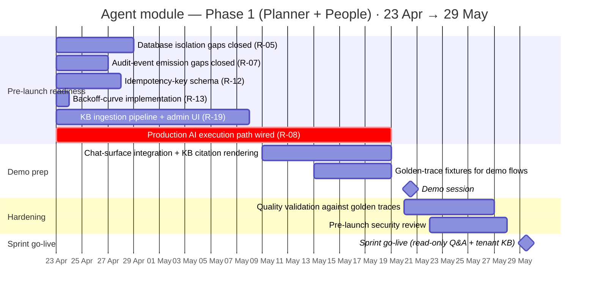

> **Beyond the sprint.** Single-target writes (mode-controlled + inbox), autonomous async writes within delegation, multi-step orchestration, and onward module expansion all sit outside this timeline. The post-sprint measurement gate (§9.3) is the exit criterion for the sprint and the entry criterion for the next iteration; module-onboarding cadence is in §9.4. Post-sprint dates are gated on production data we will not have until the agent is live.

### 9.2 Pre-launch readiness backlog

Six RAID issues block sprint go-live. The backlog below is the path from the current implementation to 2026-05-29.

| Order | Item                                                                                                                                                                                                                  | RAID | Honest effort                                                                                                            |
| ----- | --------------------------------------------------------------------------------------------------------------------------------------------------------------------------------------------------------------------- | ---- | ------------------------------------------------------------------------------------------------------------------------ |
| 1     | Enable database-enforced tenant isolation on every agent table; build-time test asserts the property                                                                                                                  | R-05 | 1–2 engineer-days                                                                                                        |
| 2     | Implement the missing approval-related audit events (`agent.draft_approved`, `agent.draft_rejected`, `agent.draft_execution_failed`) with build-time emit assertion                                                   | R-07 | half engineer-day                                                                                                        |
| 3     | Implement idempotency-key schema and the dedup-table pattern for write tools; gate auto-retry on writes until shipped                                                                                                 | R-12 | 2 engineer-days                                                                                                          |
| 4     | Implement exponential-backoff curve for provider retry with jitter, max-attempts cap, `Retry-After` honoring                                                                                                          | R-13 | half engineer-day                                                                                                        |
| 5     | **Build the tenant knowledge base ingestion pipeline** (admin upload UI in `web-admin`, chunker, `kb-ingestion` worker, deprecate / re-index, per-tenant quota enforcement, cross-tenant leak canary extension to KB) | R-19 | **5–8 engineer-days** — must finish by 2026-05-08 for chat integration to start                                          |
| 6     | **Wire the production AI execution path** (router LLM call with structured output, sub-agent ReAct loop, synthesizer with shape declaration, SSE streaming, cache-token accounting, golden-trace validation)          | R-08 | **~4 calendar weeks** (2026-04-23 → 2026-05-19) — schedule driver; under the lower bound of the 3–6 week honest envelope |

**Owner assignment (3 FTE):**

- **AI engineer (1):** Item 6 (R-08) — single-threaded across 23 Apr → 19 May (~20 working days to demo, ~26 to go-live). Under the lower bound of R-08's honest envelope; scope discipline is the only path to demo-day.
- **Fullstack engineer A (1):** Item 5 (R-19 KB pipeline + admin UI) 23 Apr → 8 May, then chat-surface integration + KB-citation rendering 9 May → demo.
- **Fullstack engineer B (1):** Items 1–4 (23–29 Apr, parallel), then golden-trace fixtures (13–19 May), security review prep, demo-day operations and post-demo hardening.

Items 1–4 total ≈4 engineer-days and parallelise across the team in week 1. Items 5 and 6 run in parallel; item 5 (KB ingestion) gates demo-day FR-C9 and must land by 8 May to leave time for chat integration. Item 6 gates the entire agent runtime. **Sprint go-live target is 2026-05-29**; demo on 2026-05-20 with the deliberately narrowed scope in §9.1. If R-08 quality validation surfaces issues, demo-day scope contracts further rather than the date slipping.

### 9.3 Post-sprint capability iterations

Each iteration ships only after the previous one's production data clears the agreed measurement gate. The gates are evaluated against real usage, not a calendar. Roll-back is a tenant-scope configuration change, not a code release.

| Iteration                                                                   | What it unlocks                                                                                                                                                                                                                                                                                                                                                                                                                                                 | Measurement gate to enter the next iteration                                                                                                                                                                                                                                                                                                            |
| --------------------------------------------------------------------------- | --------------------------------------------------------------------------------------------------------------------------------------------------------------------------------------------------------------------------------------------------------------------------------------------------------------------------------------------------------------------------------------------------------------------------------------------------------------- | ------------------------------------------------------------------------------------------------------------------------------------------------------------------------------------------------------------------------------------------------------------------------------------------------------------------------------------------------------- |
| **Sprint go-live (Phase 1)**                                                | Read-only Q&A over Planner + People (FR-P1 / FR-P2 / FR-P3) and tenant KB (FR-C9) — controlled SETA-internal pilot                                                                                                                                                                                                                                                                                                                                              | Sprint readiness backlog closed; zero cross-tenant or data-isolation incidents during the sprint **and** for the four weeks of post-sprint production measurement; user thumbs-up rate at or above baseline                                                                                                                                             |
| **Single-target writes**                                                    | FR-P4 (create from NL), FR-P5 (single-target mutations), FR-P6 (meeting batches — inbox-only). Mode-controlled per FR-C3; non-bypassable floor for batch / cross-target / destructive.                                                                                                                                                                                                                                                                          | Default-mode requester confirm rate ≥90% on previewed writes for 4 consecutive weeks; Bypass-mode post-hoc thumbs-down rate ≤2% over the same window; zero confirmation-bypass incidents (no write against a non-bypassable tool without inbox confirmation)                                                                                            |
| **Free-query (lakehouse-Q&A)** _(parallel post-Phase-1 track; see ADR-034)_ | Open-ended analytical questions over the lakehouse via the typed analytics worker (`analytics.query` + `analytics.describe_schema` + `analytics.list_tables`). Read-only by construction; bounded intra-worker ReAct loop in Mode 1; allowlisted catalog; SELECT-only; per-query row / wallclock / bytes-scanned ceilings; permission-scope query rewrite; composition-attack defence extended to aggregates. **Substrate: Athena over Iceberg, not Postgres.** | Sprint go-live measurement gate cleared; corpus accuracy on a hand-labelled analytics-question set ≥90%; per-query bytes-scanned p95 within the cost envelope; zero permission-rewrite bypass incidents on a 4-week pilot; cross-tenant leak canary extends to analytics; SQL-injection-of-DDL canary fires zero false negatives over the canary window |
| **Autonomous async writes**                                                 | Approved inbox drafts execute autonomously within their original delegation; scheduled runs may write within delegation scope                                                                                                                                                                                                                                                                                                                                   | First external-customer Beta gate; LLM-judge meta-eval validated against hand-labelled corpus (≥95% human agreement); full audit-trail completeness verified; idempotency-key activation across all write tools                                                                                                                                         |
| **Multi-step orchestration**                                                | Cross-module flows orchestrated end-to-end (e.g. "draft this, then notify, then schedule a follow-up")                                                                                                                                                                                                                                                                                                                                                          | GA gate — two consecutive 30-day windows meeting all operational thresholds across ≥3 customer organisations                                                                                                                                                                                                                                            |

### 9.4 Module integration cadence

After the Phase 1 sprint, additional modules onboard one at a time. Each onboarding is a per-module engineering task that does **not** change the agent runtime:

| Wave                | Modules                                |
| ------------------- | -------------------------------------- |
| Phase 1 sprint      | Planner (primary), People (supporting) |
| Next iteration      | Time, Hiring                           |
| Then                | Performance, Finance, Goals            |
| First-customer Beta | Insights, Admin self-service polish    |

Windows are intentionally not dated — each onboarding wave starts when the previous capability iteration's measurement gate (§9.3) is met.

Each module's onboarding work is owned by that module's engineers and consists of: declaring the agent-callable procedures (opt-in metadata), declaring the module's intent slugs, providing golden-trace fixtures, and any module-specific tool retrieval configuration.

### 9.5 Backout strategy

| Scenario                                      | Backout action                                                                     | Recovery time            |
| --------------------------------------------- | ---------------------------------------------------------------------------------- | ------------------------ |
| Capability iteration unlocked prematurely     | Tenant-scoped configuration change reverts to the previous iteration               | Seconds; no code release |
| New prompt regression                         | Prompt store row marked deprecated; previous content-hash version reactivated      | Seconds; no code release |
| Module integration causes cross-module issues | Disable the new module's agent surface for affected tenants                        | Seconds; no code release |
| Critical bug in agent runtime                 | Disable the agent for affected tenants; full rollback via ECS task definition swap | Minutes                  |
| Cross-tenant incident                         | Tenant-isolation kill-switch disables agent platform-wide pending investigation    | Seconds                  |

The agent's safety lever is **always a configuration change first, a code release second**. This is what makes iterative capability rollout safe at the speed leadership wants to operate.

---

## 10. Operational Model

How the agent module is operated day-to-day, who handles what, and where the dashboards and runbooks live.

### 10.1 Deployment cadence

| Change class                          | Mechanism                                                                                                                      | Rollout shape                                | Backout                                                                                                     |
| ------------------------------------- | ------------------------------------------------------------------------------------------------------------------------------ | -------------------------------------------- | ----------------------------------------------------------------------------------------------------------- |
| Application code                      | ECS task definition swap (blue/green); ARM64 container image from ECR                                                          | Canary 1% → 5% → 25% → 100% over ≈60 minutes | Task definition rollback (≤2 min)                                                                           |
| Prompt-only change                    | New row in content-hash prompt store; tenant config points to new hash                                                         | Canary by tenant cohort                      | Point tenant config back to previous hash (seconds)                                                         |
| Tool-meta change                      | Source change → ECS deploy                                                                                                     | Same as application code                     | Task definition rollback                                                                                    |
| Capability iteration change           | Tenant configuration row enabling the next capability set (e.g. write tools)                                                   | Per-tenant, immediate                        | Tenant config rollback (seconds)                                                                            |
| Execution-mode toggle                 | Per-conversation user setting (Default ↔ Bypass); tenant admin can disable Bypass tenant-wide or pin tools to "always confirm" | Per-user / per-tenant, immediate             | Re-toggle (no release)                                                                                      |
| KB document upload / edit / deprecate | Tenant admin uploads via `web-admin`; pg-boss `kb-ingestion` worker chunks + embeds + indexes; status notification to admin    | Per-document, async (minutes)                | Mark document deprecated (excluded from retrieval, retained as audit shell); hard-delete is admin-initiated |
| Schema change                         | Forward-only numbered migrations applied in the deploy window                                                                  | Applied in deploy window                     | Forward-fix only at production                                                                              |

### 10.2 Auto-rollback regression signals

The canary fails (and rolls back automatically) on any of the following over the canary window:

| Signal                                                                            | Threshold                                                                                                                                                                                                 |
| --------------------------------------------------------------------------------- | --------------------------------------------------------------------------------------------------------------------------------------------------------------------------------------------------------- |
| Turn error rate                                                                   | ≥ 2× baseline over rolling 10 minutes                                                                                                                                                                     |
| Total turn cost p95                                                               | ≥ 1.5× baseline over rolling 10 minutes                                                                                                                                                                   |
| Time-to-first-token p95                                                           | ≥ 1.5× baseline over rolling 10 minutes                                                                                                                                                                   |
| Requester-confirm rate on mode-controlled writes (Default mode), once writes ship | drop ≥ 10 percentage points vs the pre-canary 7-day baseline — _deployment regression_ signal, distinct from the post-sprint write-iteration gate in §9.3 (which measures absolute level over four weeks) |
| Bypass-mode post-hoc thumbs-down rate, once writes ship                           | rise ≥ 5 points vs the pre-canary 7-day baseline — same distinction as above                                                                                                                              |
| Router-accuracy signals (user-corrects, sub-agent-empty-handoff, thumbs-down)     | Any threshold breach                                                                                                                                                                                      |
| Quality canary degraded flag                                                      | Either tier flagged degraded                                                                                                                                                                              |

### 10.3 On-call and runbooks

Initial coverage by the agent-module delivery team during Phase 1 rollout, transitioning to the wider platform on-call rotation once the team is comfortable with the runbook surface. The on-call engineer always has these runbooks at hand:

| Runbook                             | When fired                                                                      | Primary action                                                                                                                                                                                  |
| ----------------------------------- | ------------------------------------------------------------------------------- | ----------------------------------------------------------------------------------------------------------------------------------------------------------------------------------------------- |
| Provider outage / degradation       | Quality canary flips degraded flag                                              | Verify auto-fallback activated; communicate user-visible notice; track recovery                                                                                                                 |
| Cost ceiling breach (tenant-wide)   | Tenant 100% budget alert                                                        | Verify tenant admin notified; consider emergency top-up only with authorisation                                                                                                                 |
| Tenant-isolation incident           | Cross-tenant leak canary fires                                                  | **Activate platform-wide kill-switch immediately**; preserve evidence; engage CTO                                                                                                               |
| GDPR erasure request                | Compliance ticket                                                               | Run erasure pipeline (§5.6.3); confirm transactional success; notify compliance                                                                                                                 |
| Composition-attack pattern observed | Audit-team dashboard alert                                                      | Engage audit team; review tool meta on involved tools; do **not** block legitimate use                                                                                                          |
| Schedule-storm event                | Schedule run rate spikes ≥10× baseline                                          | Identify offending schedule(s); pause; investigate before resume                                                                                                                                |
| KB ingestion failure                | `kb-ingestion` worker error rate >5% in rolling 1h, or a single doc retries ≥3× | Surface the failing document(s) to the tenant admin; check chunker/embedder health; if vendor-side (embedding API), apply degradation ladder; never silently drop a doc — admin must see status |
| KB retrieval anomaly                | Sudden drop in retrieval-hit rate or surge in zero-result queries on a tenant   | Verify the tenant's index is intact; check whether a recent deprecate/re-index left the index empty; rebuild if needed; do **not** route to another tenant's index                              |

### 10.4 Dashboards

| Dashboard             | What it shows                                                                                                                                                                                                     | Primary audience          |
| --------------------- | ----------------------------------------------------------------------------------------------------------------------------------------------------------------------------------------------------------------- | ------------------------- |
| Agent overview        | Turn volume, p50/p95 latency, error-class distribution                                                                                                                                                            | Engineering on-call       |
| Cost & budget         | Cost per turn split by cache-read / cache-write / output / reasoning; tenant budget utilisation; refusal volume + estimated lost cost                                                                             | Engineering, finance      |
| Approval inbox health | Per-requester queue depth; throttle threshold counters; Default-mode confirm rate; Bypass-mode thumbs-down rate                                                                                                   | Product, engineering      |
| Quality               | Quality canary success rate per tier; degradation flag history; user thumbs feedback rates                                                                                                                        | Engineering, product      |
| Router accuracy       | User-corrects rate; sub-agent-empty-handoff rate; tier-shift vs provider-fallback distinct counts                                                                                                                 | Engineering               |
| Audit & compliance    | Tainted-turn drafted-write count; GDPR erasure pipeline success; cross-tenant leak canary status                                                                                                                  | Compliance, audit         |
| Knowledge base health | Per-tenant: ingestion success rate, queue depth, embed-and-index latency; document count vs quota (1,000 docs / 50 MB); retrieval hit-rate, zero-result query rate, top retrieved documents; deprecated-doc count | Tenant admin, engineering |

### 10.5 Capacity planning

Refusal traces capture an expected-cost estimate inferred from history of similar turns. **This means capacity planning is named, not guessed**: a sentence like "we refused 87 turns over the last 7 days that would have cost $213" feeds the budget-raise-or-accept-refusals decision directly. The same data informs ECS task-count adjustments and RDS instance sizing.

### 10.6 Incident response

The four indexed identifiers on every audit and trace surface (tenant id, trace id, flow id, intent slug) make incident-time reconstruction a database query, not a log scrape. Standard reconstruction examples:

- _"Show every action this user took on December 5th."_ — single query on tenant id + user id, joining audit + trace.
- _"All approved drafts originating from tainted turns in the last 30 days."_ — single query on the `derived_from_tainted_sources` audit dimension.
- _"Did we ever send tool result X to model version Y?"_ — single query on prompt-store hash + version stamp.

Incidents that affect a single tenant follow standard severity-classification rules; cross-tenant incidents activate the platform-wide kill-switch and engage the CTO directly.

---

## 11. Appendices

Reference material that supports the body but is too granular for inline treatment.

### A. Extensibility Invariants

The architectural contract that lets modules 4–13 onboard without changes to the agent runtime. Each invariant is a build-time test; a future change that violates one fails the build.

| #     | Invariant                                                                                                                                                                                                                                                                      | Enforced by                                                                                                                                                                                                                  |
| ----- | ------------------------------------------------------------------------------------------------------------------------------------------------------------------------------------------------------------------------------------------------------------------------------ | ---------------------------------------------------------------------------------------------------------------------------------------------------------------------------------------------------------------------------- |
| EI-1  | Adding a sub-agent is a new file in the owning module's `agent/sub-agents/` directory; zero central edits                                                                                                                                                                      | Root aggregator discovers at build; key-collision test fails build                                                                                                                                                           |
| EI-2  | Adding an agent tool is an opt-in metadata change on the tRPC procedure; no central registration                                                                                                                                                                               | Drift test enumerates all procedures with the agent meta block                                                                                                                                                               |
| EI-3  | Adding an intent slug is a new file in the owning module's `agent/intents/` directory                                                                                                                                                                                          | Slug registry aggregated at build; unique-slug test fails build                                                                                                                                                              |
| EI-4  | Sub-agent retrieval scales as registry grows; router prompt token budget holds                                                                                                                                                                                                 | Synthetic 12-sub-agent registry probe; recall test                                                                                                                                                                           |
| EI-5  | Tool retrieval scales as per-sub-agent tool count grows; selection accuracy holds                                                                                                                                                                                              | Synthetic 20-tool sub-agent probe; recall test                                                                                                                                                                               |
| EI-6  | Router prompt budget holds at scale; breach triggers sub-agent retrieval activation                                                                                                                                                                                            | Budget-ceiling test at synthetic scale                                                                                                                                                                                       |
| EI-7  | Observability dimensions are module-neutral; no module-specific dashboards hardcoded                                                                                                                                                                                           | Span-schema test asserts every trace carries the four indexed identifiers                                                                                                                                                    |
| EI-8  | Approval flow is module-owned; no parallel agent state machine                                                                                                                                                                                                                 | Lint rule + integration test                                                                                                                                                                                                 |
| EI-9  | Memory layers are tenant-keyed by construction; no shared cross-tenant indexes                                                                                                                                                                                                 | Schema constraint + cross-tenant leak canary                                                                                                                                                                                 |
| EI-10 | Tool authoring lints (whenToUse / whenNotToUse quality, examples present, `executionLane` set, `bypassable` on `.mutation()`, `approvalFreshness` on writes, `compositionSensitive` on aggregates) fire at PR time                                                             | Build-time meta drift suite                                                                                                                                                                                                  |
| EI-11 | Tenant knowledge base is tenant-keyed by construction; no shared cross-tenant retrieval index, no cross-tenant document visibility                                                                                                                                             | Schema constraint on `agent_kb_*` tables (tenant_id required, RLS forced); cross-tenant leak canary extends to KB chunk retrieval                                                                                            |
| EI-12 | Direct database / lakehouse access never bypasses the gateway; no tool emits raw SQL outside the typed analytics surface (ADR-034)                                                                                                                                             | Build-time test scans the tool registry for SQL-string parameters; only `analytics.*` procedures (post-Phase-1) may declare them; `analytics.*` procedures are parser-pinned to SELECT-only and gated by allowlisted catalog |
| EI-13 | Mode-2 (supervisor) readiness: router signature accepts `topology: 'supervisor'`; worker re-entry contract holds; cancel / cost / audit / observability envelope wraps mode 2; one canonical mode-2 trace passes integration test behind `tenant_settings.mode_2_enabled` flag | Type-level test on router output schema; integration fixture exercises a stub mode-2 turn end-to-end; flag default `false` at Phase 1                                                                                        |
| EI-14 | Cross-worker turn-taint propagation is mechanical, not heuristic. Once any worker retrieves a `tenantAuthoredFreeText` field, the turn-taint flag flips for every sibling worker still running and every worker spawned afterward in that turn                                 | Integration fixture: a turn with one tainted reader + one parallel write-worker must produce a tainted-write audit on the second; build-time invariant test                                                                  |
| EI-15 | The prompt-assembly budget (ADR-029) is deterministic and replay-correlated. The selection set produced for a given trace ID is reproducible from the trace's content hashes and the pinned budget                                                                             | Replay-determinism test: trace replay over 100 sample turns reproduces identical `MEMORY_SELECTION` span outputs                                                                                                             |

### B. Topology Mode Decision Tree

How the router picks between the four execution-topology shapes for a given turn. Topology mode is a runtime routing decision; it is distinct from the per-conversation execution mode (Default / Bypass) in FR-C3.

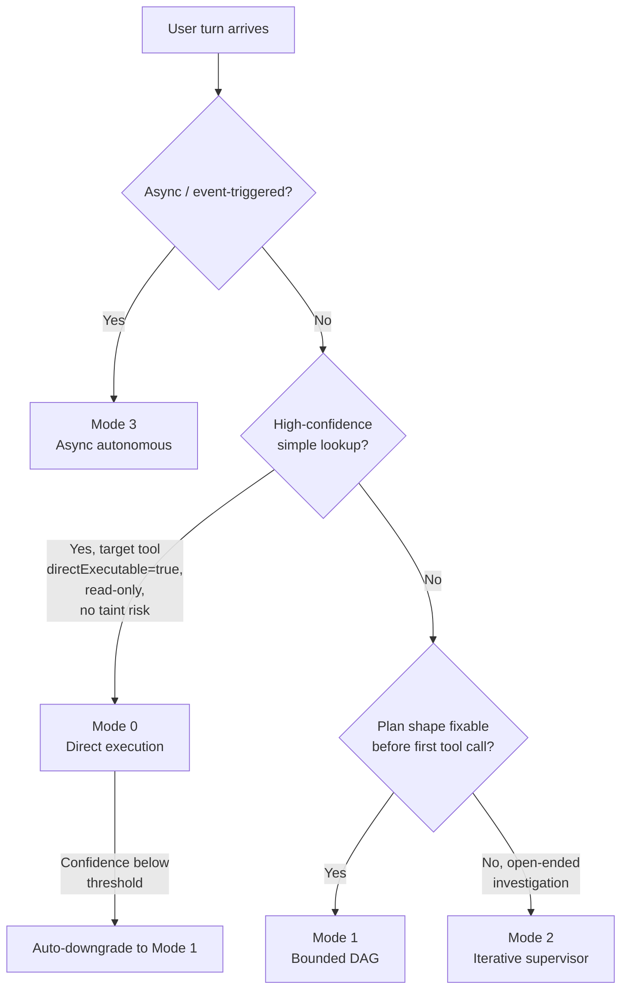

**Coverage targets at 200 flows:** Mode 0 ≈60–70% (typed lookups), Mode 1 ≈25% (cross-domain reads, drafted writes), Mode 2 ≈5% (investigative tail), Mode 3 (async) — scheduled volume.

**Phase-1 sprint scope.** During the sprint, the agent operates in **Mode 1 (bounded DAG)** for live turns and **Mode 3 (asynchronous)** for scheduled runs. Read-only Q&A + KB has no need for mode 2's iterative supervisor — there is no multi-step write to orchestrate yet. Modes 0 and 2 are first-class citizens in the design; the runtime contracts (cancel signal, ceilings, audit, observability, **prompt-assembly budget per ADR-029**, **mode-2 readiness invariants per ADR-033**) cover them so they drop in without re-architecting when scope earns them. Activation is gated to later iterations.

**Mode 2 — when it earns activation.** The investigative-tail pattern is _cross-worker iteration_: one worker's content (not just shape) determines whether another worker is needed. Open-ended querying (lakehouse / DB) is **intra-worker** iteration and fits Mode 1 unchanged via the analytics-worker pattern (ADR-034) — a sub-agent runs a bounded ReAct loop against a typed query surface and returns a structured summary, just like any other worker. Mode 2 is reserved for genuinely investigative intents (e.g. "find the team with the worst plan health, explain why, propose three remediations") where worker 2's existence depends on worker 1's payload. Activation requires production data showing that pattern, not anticipation of it.

**Mode 3 — memory contract.** Memory layers per Appendix C.6 (Mode 3 row). Rationale: a scheduled run is a different surface than the user's chat thread; conflating them leaks unrelated conversational context into automated outputs and breaks audit reconstruction (the run's `flow_id` is its own, not the conversation's).

### C. Memory Model Reference

The memory model is a layered specification, not a free-form set of stores. Each layer has a defined token budget, partition key, retention rule, write policy, and erasure rule — uniform across surfaces unless a per-surface override is declared. Production-grade discipline at Phase 1: every layer's behaviour is mechanical, not heuristic.

#### C.1 Layer specification

Token budgets per surface live in C.6; retention and erasure live in §5.3.4 + C.8. This table identifies the layers and their partition shape.

| Layer | Contents                                                                                      | Partition key                | Phase 1 status                                                  |
| ----- | --------------------------------------------------------------------------------------------- | ---------------------------- | --------------------------------------------------------------- |
| L1    | Sub-agent ReAct trace within one turn; turn-scoped read cache                                 | Turn                         | Live                                                            |
| L2    | Conversation history — last-K turns verbatim + earlier turns as compacted summaries (ADR-030) | (tenant, user, conversation) | Live                                                            |
| L3    | Non-domain user preferences (display format, default currency view)                           | (tenant, user)               | Live; user-initiated writes only                                |
| L3.5  | Agent-writable persistent scratchpad (allowlisted fields)                                     | (tenant, user)               | Beta-gated; not Phase 1 — taint contract pre-declared (ADR-031) |
| L4    | Tenant / role facts (working hours, fiscal year, currency)                                    | (tenant) or (tenant, role)   | Live via lazy fetch                                             |
| L5    | Tenant knowledge base (admin-imported docs, chunked + embedded)                               | (tenant)                     | Live (FR-C9 / FR-C10); retrieved via `kb.retrieve`              |

**Total per-turn input ceiling.** Default 8,000 tokens across all memory layers + worker tool results (excluding L5 which charges per-call). Tenant admins may lower this through `tenant_settings.memory.token_budget`; raising above the default requires a tier change. Budget breach trips the iteration-ceiling enforcer (§5.2.3) — the turn refuses with `turn.refused.reason: memory_budget_exhausted` rather than truncating silently.

#### C.2 Selection algorithm (deterministic, replay-correlated)

Per ADR-029, the prompt assembled for each LLM call (router, worker, synthesizer) is built by a deterministic algorithm whose output set is content-hashed into the trace. The algorithm:

1. **Pin the budget.** Read the per-surface token budget from `tenant_settings.memory.token_budget` (default per the table above).
2. **Reserve fixed-cost layers first.** L3 (200 tokens), L4 lazy reservations (per worker request).
3. **Fill L2 by recency.** Walk the conversation backward from the current turn, including each turn verbatim until the budget is met. Turns that overflow the budget are replaced by their compacted summary (per ADR-030); if the summary still overflows, fall back to a one-line `{turn_id, intent, outcome}` reference.
4. **Materialise the selection set as content hashes.** Emit `span_type=MEMORY_SELECTION` with the per-layer hash list; this is the replay key for ADR-008.
5. **Refuse on overflow.** If even the compacted prefix exceeds the budget, the turn refuses with `turn.refused.reason: memory_budget_exhausted` — never silently drop content the user could plausibly expect the agent to remember.

**Why deterministic.** Replay (ADR-008) requires that the same trace ID rebuilds the same prompt. A heuristic selector ("most relevant" by embedding) is non-deterministic across model revisions and breaks replay. Recency + compaction is reproducible.

#### C.3 Compaction policy (L2)

Per ADR-030, L2 compaction triggers when the verbatim conversation tokens for a partition exceed `compaction_threshold` (default 6,000 tokens). The compaction job:

- Runs **off the turn's hot path** as a pg-boss job, not inside the user-facing wallclock.
- Calls the smaller LLM tier (configurable; default minimum-viable per ADR-018 ladder posture) to produce a summary preserving: intent, key entities mentioned, decisions made, drafted-but-not-confirmed actions, taint events.
- Strips: verbatim tool result text, raw tool args, intermediate worker reasoning, tainted free-text content (replaced by a reference per ADR-031).
- Emits `span_type=L2_COMPACTION` with input/output token counts, model used, and a `pricing_id`-tagged cost event (cost is attributed to the tenant, not the user).
- Stores the summary as a content-hashed row; the original verbatim turns remain in `agent_message` until the retention window expires (the compaction is an _added_ projection, not a replacement of source data).

**Compaction is a first-class trace event,** not a background detail. It has its own cost line, its own model selection, its own replay key.

#### C.4 Tainted content storage rule (ADR-031)

When a tool returns content containing `tenantAuthoredFreeText` (R-01 trigger), the L2 storage rule is:

- The verbatim text is **never inlined** into `agent_message.content`.
- Instead, L2 stores `{tool, args_hash, retrieved_at, citation_ref}` — a reference, not the payload.
- On a later turn that selects this entry, the worker re-fetches under the **caller's current permission scope** (P-3); if access has been revoked or the source has been deleted, the reference resolves to "no longer available" rather than replaying authored-by-others text.

Rationale and threat model: ADR-031.

#### C.5 Write-turn handling

| Write path                               | What enters L2                                                                        | What does **not** enter L2                                    |
| ---------------------------------------- | ------------------------------------------------------------------------------------- | ------------------------------------------------------------- |
| Previewed intent (Default mode, ADR-032) | Nothing until the user confirms. The previewed intent is **L1-only** during the turn. | Raw tool args; the structured intent payload                  |
| Confirmed write (Default or Bypass)      | Semantic outcome reference: `{tool, idempotency_key, outcome_summary, draft_id?}`     | Raw tool args; raw response body                              |
| Drafted action (inbox path)              | Handoff reference: `{draft_ids, count, target_module}`                                | Per-item draft contents (those live in `agent_draft`, not L2) |
| Cancelled / declined / TTL-expired       | A single line recording the outcome with timestamp                                    | Anything about the proposed payload                           |

**Replay determinism for write turns.** A re-played write turn is **read-only by construction**: the L2 entry carries the idempotency key + outcome reference, not the executable payload. The replay reconstructs the prompt and the worker decisions; it never re-issues the write. ADR-008 + ADR-029 + the idempotency-key invariant (D-5) compose to make this true without an explicit "replay mode" flag.

#### C.6 Per-surface defaults

| Surface                             | L1                | L2 budget (input tokens) | L3  | L4   | L5    | Notes                                                                                         |
| ----------------------------------- | ----------------- | ------------------------ | --- | ---- | ----- | --------------------------------------------------------------------------------------------- |
| Global chat                         | turn-scoped       | 4,000                    | 200 | lazy | top-K | Default surface; full conversation context expected                                           |
| Inline copilot (task / plan detail) | turn-scoped       | 2,000                    | 200 | lazy | top-K | The on-screen entity is already in the prompt; full L2 doubles tokens                         |
| Scheduled run (mode 3)              | fresh per run     | 0 — no L2 access         | 200 | lazy | top-K | No live conversation history primes a scheduled run (rationale: Appendix B mode-3 note)       |
| Inbox-draft execution               | fresh per execute | 0 — no L2 access         | n/a | lazy | n/a   | The execute step revalidates and runs; it is not a turn from the conversation's point of view |

**Override.** `tenant_settings.memory.surface_overrides` lets tenants tighten any cell; raising any cell above the default requires a tier change.

#### C.7 Per-tenant policy knobs (FR-C6 surface)

| Knob                                       | Default                    | Effect                                                                   |
| ------------------------------------------ | -------------------------- | ------------------------------------------------------------------------ |
| `memory.l2_retention_days`                 | 90                         | Lower for compliance regimes; range 7–90                                 |
| `memory.token_budget`                      | 8,000 total                | Lower for cost discipline; raising requires tier change                  |
| `memory.l3_enabled`                        | `true`                     | Disabling clears existing prefs and stops new writes                     |
| `memory.compaction_threshold`              | 6,000                      | Lower triggers compaction sooner (cheaper input, higher compaction cost) |
| `memory.compaction_model_tier`             | smaller-tier               | Pin to a specific tier or "auto" (degradation ladder posture)            |
| `memory.surface_overrides.{surface}.{key}` | per-surface defaults above | Per-surface tightening                                                   |

#### C.8 Per-layer erasure rules (GDPR Article 17)

The authoritative storage-table erasure rules live in §5.3.4 (conversation content, prefs, tool cache, prompt stores, audit, trace, KB). This table covers only the **layer-specific additions** §5.3.4 does not enumerate:

| Layer                  | On user-erasure request                                                                       | Notes                                                                                          |
| ---------------------- | --------------------------------------------------------------------------------------------- | ---------------------------------------------------------------------------------------------- |
| L1                     | n/a — turn-scoped, dies at turn end                                                           | The compaction summary that may be derived from L1 content is governed by the L2 row in §5.3.4 |
| L3.5                   | Hard-delete (Beta-gated; pre-declared so the contract is fixed before the layer ships)        | Inherits the same shape as L3 in §5.3.4                                                        |
| Compacted L2 summaries | Hard-delete with the original turns; the compaction is an added projection, not a replacement | Recorded separately because the summary is a content-hashed row distinct from `agent_message`  |

Erasure is transactional across layers; partial erasure is a runbook-level incident, not an acceptable outcome.

### D. Tool Meta Field Reference

Fields available in the agent meta block of a tRPC procedure. Required fields are compile-checked; optional fields are validated at build time when present.

| Field                    | Required?                                           | Purpose                                                                                                                                                                                                                                                                                                                          |
| ------------------------ | --------------------------------------------------- | -------------------------------------------------------------------------------------------------------------------------------------------------------------------------------------------------------------------------------------------------------------------------------------------------------------------------------- |
| `whenToUse`              | Yes                                                 | Decision hint for the router and sub-agents on when this tool applies                                                                                                                                                                                                                                                            |
| `whenNotToUse`           | Yes                                                 | Negative cases — when NOT to call this tool                                                                                                                                                                                                                                                                                      |
| `examples`               | Yes (≥1, including ≥1 negative case)                | Few-shot pattern for the model                                                                                                                                                                                                                                                                                                   |
| `bypassable`             | Required on `.mutation()`                           | Single source of truth for the write's execution path. `true` → tool honours the user's execution mode (Default confirms inline, Bypass runs immediately). `false` → tool always lands on the inbox path (the non-bypassable floor — see §5.4.3). Reads on `.query()` are always mode-independent and do not declare this field. |
| `tenantAuthoredFreeText` | Optional                                            | Field names whose contents are wrapped in `<tenant_authored>` and trigger turn taint; forces subsequent writes in the turn onto the inbox path regardless of mode                                                                                                                                                                |
| `approvalFreshness`      | Required on `.mutation()`                           | `'revalidate'` (default) or `'accept-stale'`; controls precondition revalidation at execute time                                                                                                                                                                                                                                 |
| `approvalTtl`            | Optional, on `.mutation()` with `bypassable: false` | Draft TTL override; default 72h                                                                                                                                                                                                                                                                                                  |
| `compositionSensitive`   | Required on aggregate-returning tools               | Declares minimum group size for k-anonymity                                                                                                                                                                                                                                                                                      |
| `ceilings`               | Optional, on non-token-denominated tools            | `bytesScanned`, `wallclockMs` budgets                                                                                                                                                                                                                                                                                            |
| `directExecutable`       | Optional                                            | Eligibility for the direct-execution topology mode (App B mode 0); rejected on `.mutation()` and on tools declaring `tenantAuthoredFreeText`                                                                                                                                                                                     |
| `cacheable`              | Optional, on `.query()`                             | TTL for semantic result cache                                                                                                                                                                                                                                                                                                    |
| `idempotencyKey`         | Optional, on `.mutation()`                          | Activates auto-retry safety once the dedup-table pattern lands per RAID R-12                                                                                                                                                                                                                                                     |

**`bypassable` defaults.** Single-target task create / update / reschedule / reassign-to-self → `true`. Bulk batches (meeting-extraction, multi-task operations), cross-target reassign (assign to someone other than the caller), destructive deletes → `false`.

**Knowledge-retrieval tool (`kb.retrieve`).** Read-only `.query()`; `cacheable: true` with TTL ~5 min. Tool meta declares the tenant-keyed pgvector index it queries; the gateway enforces tenant isolation as it does for all reads.

### E. Span Taxonomy

Two parallel enumerations stamped on every span; queries can filter by either dimension independently.

| Dimension              | Values                                                                                                                                                                                                                                                                                                                                      |
| ---------------------- | ------------------------------------------------------------------------------------------------------------------------------------------------------------------------------------------------------------------------------------------------------------------------------------------------------------------------------------------- |
| `span_type` (shape)    | `TURN`, `ROUTER_PLAN`, `SUB_AGENT_PLAN`, `SUB_AGENT_TOOL_CALL`, `SUB_AGENT_SYNTHESIS`, `PHASE_2`, `SYNTHESIZER`, `GATEWAY_STEP`, `ITERATION`, `FINAL`, `KB_RETRIEVE`, `KB_INGEST`, `MEMORY_SELECTION`, `L2_COMPACTION`, `WRITE_PREVIEW`, `WRITE_CONFIRM`, `WRITE_DRAFT_HANDOFF`, `WRITE_OUTCOME`, `ANALYTICS_QUERY` (post-Phase-1, ADR-034) |
| `entity_type` (origin) | `ROUTER`, `SUB_AGENT`, `TOOL`, `SYNTHESIZER`, `GATEWAY`, `PROCESSOR`, `MEMORY`, `DELEGATION`, `KB`, `ANALYTICS` (post-Phase-1)                                                                                                                                                                                                              |

**Memory-related span semantics:**

| Span                  | Emitted by            | Required attributes                                                                                      |
| --------------------- | --------------------- | -------------------------------------------------------------------------------------------------------- |
| `MEMORY_SELECTION`    | Start-turn command    | `selection_set_hash`, per-layer `{layer, content_hashes[], token_count}`, `budget_pinned`                |
| `L2_COMPACTION`       | Compaction worker     | `conversation_id`, `input_token_count`, `output_token_count`, `model_tier`, `pricing_id`, `summary_hash` |
| `WRITE_PREVIEW`       | Synthesizer (Default) | `tool_name`, `args_hash`, `bypassable`, `taint_state`                                                    |
| `WRITE_CONFIRM`       | HTTP turn controller  | `tool_name`, `idempotency_key`, `confirmed_at`, `mode`                                                   |
| `WRITE_DRAFT_HANDOFF` | Synthesizer           | `draft_ids[]`, `count`, `target_module`, `bypassable: false`, `taint_state`                              |
| `WRITE_OUTCOME`       | Tool gateway          | `tool_name`, `idempotency_key`, `outcome_summary_hash`, `cost_event_id`                                  |

### F. Cost Model Worked Example

A typical Phase-1 chat turn against Planner data. Numbers are illustrative for the cost-attribution split required by ADR-010. **Rates as of 2026-05; rebaseline whenever the AI provider publishes a price change (RAID R-17).**

| Layer                             | Tokens | Rate (USD per 1M tokens)               | Cost (USD)   |
| --------------------------------- | ------ | -------------------------------------- | ------------ |
| Router input — uncached           | 800    | $1.25                                  | $0.0010      |
| Router input — cached read        | 4,200  | $0.13 (≈10% of input)                  | $0.00055     |
| Router output                     | 120    | $5.00                                  | $0.0006      |
| Sub-agent ×2 input — cached read  | 6,000  | $0.13                                  | $0.0008      |
| Sub-agent ×2 input — cached write | 1,200  | $1.56 (≈125% of input — first warm-up) | $0.0019      |
| Sub-agent ×2 output               | 180    | $5.00                                  | $0.0009      |
| Synthesizer input — cached read   | 3,500  | $0.13                                  | $0.00046     |
| Synthesizer output                | 320    | $5.00                                  | $0.0016      |
| **Turn total**                    |        |                                        | **≈ $0.007** |

Cache-read and cache-write priced separately is non-negotiable: a turn metered uniformly at the input rate over-bills by ≈8× on hot sessions and under-bills cache-write by ≈10× on cold ones.

**Phase-1 forecast envelope (illustrative, current OpenAI rates as of 2026-05):**

| Variable                                       | Value       |
| ---------------------------------------------- | ----------- |
| Cost per typical turn (above)                  | ~$0.007     |
| Turns per employee per workday (estimated)     | ~20         |
| Active employees (SETA Phase-1 internal)       | ~300        |
| Workdays per month                             | ~21         |
| **Forecast monthly OpenAI spend**              | **~$880**   |
| Tenant default daily ceiling (proposed)        | $50         |
| **Worst-case monthly envelope (ceiling × 30)** | **~$1,500** |

Forecast is a planning anchor, not a commitment. Variance ≥2× over rolling 7 days triggers a budget review; ≥3× triggers an admin alert and a tier-shift evaluation. Rates rebaseline whenever OpenAI publishes a price change (RAID R-17).

**Knowledge base ingestion cost (one-off + incremental, not part of the per-turn budget):**

| Variable                                                     | Value (illustrative)                                                               |
| ------------------------------------------------------------ | ---------------------------------------------------------------------------------- |
| Embedding rate (`text-embedding-3-small`, effective 2026-05) | $0.02 per 1M tokens — rebaseline per RAID R-17 on provider price change            |
| Average tokens per document (e.g. handbook)                  | ~50,000                                                                            |
| Embedding cost per document                                  | ~$0.001                                                                            |
| Phase-1 SETA-internal corpus (estimated)                     | ~200 documents (handbook, policies, FAQs, onboarding)                              |
| **One-off ingestion cost**                                   | **~$0.20**                                                                         |
| Re-index cost (full corpus, e.g. on chunker change)          | ~$0.20                                                                             |
| Per-turn retrieval cost (top-K embedding query)              | rolled into per-turn cost above; one embedding call ≈400 tokens ≈ $0.000008 / turn |

KB ingestion is cheap relative to the per-turn budget — the operational concern is **storage and retrieval latency**, not embedding spend. A separate per-tenant document quota (default 1,000 documents, 50 MB total) and per-document size cap (default 5 MB) prevent runaway ingestion.

---

## Document control

**Owners:** Agent module engineering team; CTO-sign-off on architectural changes.
**Reviewers:** Engineering leadership, Product, Compliance.
**Update cadence:** This document is updated on any change to the architectural shape (sections 4, 5, 7) or pre-launch readiness backlog (section 8). Operational details (sections 9, 10) are updated at each capability iteration unlock.
