# Software Requirements Specification — Agents Module (Phase 1)

| Field              | Value                                                   |
| ------------------ | ------------------------------------------------------- |
| **Document type**  | Software Requirements Specification (IEEE Std 830-1998) |
| **System**         | Future platform — Agents module                         |
| **Phase**          | Phase 1 (sprint window 2026-04-23 → 2026-05-29)         |
| **Status**         | Approved baseline v1.0                                  |
| **Classification** | Internal only                                           |
| **Date**           | 2026-05                                                 |
| **Owner**          | Future platform engineering — Agents track              |
| **Approvals**      | CTO · Product Manager · Compliance · Engineering Lead   |

---

## Table of Contents

1. [Introduction](#1-introduction)
   1.1 [Purpose](#11-purpose) · 1.2 [Intended Audience](#12-intended-audience) · 1.3 [Document Conventions](#13-document-conventions) · 1.4 [Intended Use](#14-intended-use) · 1.5 [Project Scope](#15-project-scope) · 1.6 [Definitions and Acronyms](#16-definitions-and-acronyms) · 1.7 [References](#17-references)
2. [Overall Description](#2-overall-description)
   2.1 [User Needs](#21-user-needs) · 2.2 [Product Perspective](#22-product-perspective) · 2.3 [Assumptions and Dependencies](#23-assumptions-and-dependencies) · 2.4 [Constraints](#24-constraints)
3. [System Features and Requirements](#3-system-features-and-requirements)
   3.1 [Functional Requirements](#31-functional-requirements) · 3.2 [User Interfaces](#32-user-interfaces) · 3.3 [External Interface Requirements](#33-external-interface-requirements) · 3.4 [Non-Functional Requirements](#34-non-functional-requirements)
4. [Other Requirements](#4-other-requirements)
   4.1 [Database Requirements](#41-database-requirements) · 4.2 [Legal, Regulatory, Compliance](#42-legal-regulatory-compliance) · 4.3 [Internationalization and Localization](#43-internationalization-and-localization)
5. [Appendices](#5-appendices)
   A. [Glossary](#appendix-a-glossary) · B. [Analysis Models](#appendix-b-analysis-models) · C. [Use Cases](#appendix-c-use-cases) · D. [Requirements Traceability Matrix](#appendix-d-requirements-traceability-matrix)

---

## 1. Introduction

### 1.1 Purpose

This Software Requirements Specification (SRS) defines the functional, non-functional, interface, data, and compliance requirements for the **Agents module** of the Future platform — Phase 1 release. It is the authoritative requirements baseline against which the system is implemented, verified, and accepted.

The Agents module is the AI capability of the Future platform: a governed, multi-tenant, audit-complete assistant that lets employees ask questions, surface insights, propose actions, and receive scheduled summaries grounded in the platform's canonical data.

This SRS describes **what** the system must do and the constraints under which it must do it. It is intended to be a stand-alone document; readers do not need any other artifact to understand, verify, or sign off on the requirements herein.

### 1.2 Intended Audience

| Reader                        | What this document gives them                                               |
| ----------------------------- | --------------------------------------------------------------------------- |
| Project sponsor / executives  | The system's purpose, scope, and success criteria                           |
| Product manager               | The full feature set, prioritisation, and acceptance scope                  |
| Engineering team              | The complete, unambiguous specification to implement against                |
| Quality assurance / test team | The verification surface; every "shall" statement is a test obligation      |
| Compliance, legal, audit      | Privacy, security, retention, and audit obligations the system commits to   |
| Operations / SRE              | Reliability, performance, and degradation behaviour the system must exhibit |
| Customer-facing teams         | The capabilities and limits to communicate to tenants                       |

Reading order: §1–§2 are written for any reader; §3.1–§3.2 for product, engineering, QA; §3.3–§4 for engineering, compliance, operations; §5 for everyone needing definitions, models, or use-case detail.

### 1.3 Document Conventions

- **Requirement keywords** follow IETF RFC 2119 / ISO/IEC Directives Part 2:
  - **shall** / **must** — a binding, verifiable requirement.
  - **should** — a recommendation; deviation requires documented rationale.
  - **may** — an optional capability.
- **Requirement identifiers** are immutable for the life of this baseline. Each requirement has a stable identifier of the form:
  - `FR-NNN` — functional requirement
  - `NFR-NNN` — non-functional requirement
  - `UI-NNN` — user-interface requirement
  - `EI-NNN` — external-interface requirement
  - `DB-NNN` — database requirement
  - `LR-NNN` — legal/regulatory/compliance requirement
  - `I18N-NNN` — internationalization/localization requirement
  - `UC-NNN` — use case
- **Tables** are the primary structural device for requirements. Every requirement appears as a row in a table to support tooling, traceability, and review.
- **Diagrams** use Mermaid (rendered by GitHub, GitLab, and most modern Markdown viewers). Where diagrams are omitted (e.g. wireframes), narrative prose describes the surface in sufficient detail for review and implementation.
- **Dollar amounts** are USD unless otherwise stated.
- **Times** are in 24-hour format; durations in seconds, minutes, hours, or days as labelled; dates are ISO-8601.
- **Tenant** is the unit of isolation — an entire customer organisation. Inside a tenant, **user** is the unit of identity.

### 1.4 Intended Use

This SRS is used to:

1. Establish the requirements baseline at sign-off (this document, v1.0).
2. Drive design, implementation, and test planning.
3. Anchor change control — every requirement change becomes a documented amendment.
4. Provide the verification surface for Phase 1 acceptance.
5. Support compliance, audit, and procurement reviews with a single normative artifact.

This document does **not** describe how the system is implemented internally. Implementation, architecture, deployment topology, code organisation, and technology choices are owned by separate engineering artifacts and may evolve without amending this SRS, provided every requirement herein remains satisfied.

### 1.5 Project Scope

#### In scope (Phase 1)

The Agents module — a governed, tenant-isolated AI assistant — comprising:

1. **Conversational surfaces.** Global chat surface in the web application; inline copilot surfaces within Planner module screens; asynchronous (scheduled) workflows.
2. **Planner read capabilities.** Personal and team task views, plan status synthesis, role-scoped analysis grounded in Planner tasks joined to the People domain.
3. **Planner write capabilities.** Natural-language task creation, single-task mutations (reassign, reschedule, mark done, split, link to plan), and meeting-transcript action-item extraction.
4. **Tenant knowledge base (RAG).** Tenant-curated reference Q&A — handbook, policies, onboarding documents, internal FAQs — with cited sources and tenant-keyed retrieval.
5. **Execution-mode framework.** Per-conversation Default approvals / Bypass approvals modes, with a non-bypassable floor for bulk, cross-target, and destructive operations.
6. **Approval inbox integration.** Drafted writes land in the platform's existing approval inbox; the Agents module does not own a parallel approval queue.
7. **Scheduled and event-triggered runs.** Opt-in digests and nudges (morning task brief, end-of-week status, stale-task alerts, at-risk milestone notices), running under explicit per-user delegation grants and producing read-only summaries or inbox drafts only.
8. **Tenant administration.** Self-service configuration of model selection, cost ceilings, schedule policy, tool visibility, execution-mode policy, memory policy, and knowledge-base ingestion.
9. **Governance.** Caller-scoped permission inheritance, kernel audit emission for every action, deterministic replay by trace identifier, dollar-denominated cost ceilings at every scope, GDPR right-to-erasure compliance.
10. **Reliability framework.** Retry, circuit breaker, model-degradation ladder, quality canary, cancellation, idempotency, and honesty-of-failure user messaging.

#### Out of scope (Phase 1)

The following are explicitly excluded from Phase 1 and are not addressed by any requirement in this SRS:

| Excluded                                                             | Disposition                                                                                                             |
| -------------------------------------------------------------------- | ----------------------------------------------------------------------------------------------------------------------- |
| Modules other than Planner (with People as supporting context)       | Time, Hiring, Performance, Finance, etc. integrations are governed by future SRS amendments.                            |
| External tenant rollout                                              | Phase 1 is a controlled SETA-internal pilot. External-customer onboarding is a later phase.                             |
| Autonomous writes from scheduled or event-triggered runs             | Async runs are read-only or inbox-draft only at Phase 1 (see FR-027).                                                   |
| Cross-conversation memory recall (e.g. "you said X yesterday")       | Permanently constrained at Phase 1; revisited in a later phase under an explicit privacy review.                        |
| Multi-region deployment                                              | Single region (`ap-southeast-1`) at Phase 1.                                                                            |
| Multi-AI-provider failover at runtime                                | Single provider (OpenAI) at Phase 1; multi-provider routing is engineered as a drop-in but not activated.               |
| OCR ingestion of image-PDF documents into the knowledge base         | Text-only ingestion at Phase 1; OCR deferred.                                                                           |
| LLM-as-a-judge automated quality scoring gating release decisions    | Deferred until a hand-labelled corpus shows ≥95% agreement with human raters. Deterministic scorers only at Phase 1.    |
| Slack, Microsoft Teams, or other channel-surface integrations        | Notifications flow through the platform notification module's existing channels only.                                   |
| Event-source triggers from `outbox_event` (domain-event-driven runs) | The runtime contract is pre-declared so the adapter drops in later, but event-triggered firing is not wired at Phase 1. |

#### Phase 1 success criteria

| Criterion                                                                                       | Verification                                                           |
| ----------------------------------------------------------------------------------------------- | ---------------------------------------------------------------------- |
| The Agents module is live and accessible to the SETA-internal pilot population                  | Production deployment record; pilot user roster                        |
| Read-only Q&A over Planner + People + tenant knowledge base demonstrates correct, cited answers | Acceptance demonstration on 2026-05-20; user-acceptance test report    |
| Zero cross-tenant data-exposure incidents during the sprint window                              | Daily synthetic cross-tenant probe results; security incident register |
| AI-provider spend remains within the documented forecast envelope                               | Daily cost reports vs. forecast                                        |
| Audit trail answers "who asked, what ran, under what authority, with which data" in one query   | Acceptance test on a sampled set of production turns                   |
| Every "shall" requirement in §3 has a passing verification artifact (test, observation, audit)  | Requirements traceability report (Appendix D) reviewed at acceptance   |

### 1.6 Definitions and Acronyms

A complete glossary appears in **Appendix A**. The terms below are necessary to read §1–§2.

| Term                      | Definition                                                                                                                                    |
| ------------------------- | --------------------------------------------------------------------------------------------------------------------------------------------- |
| **Tenant**                | A customer organisation using the platform — the unit of data isolation.                                                                      |
| **User**                  | An authenticated identity within a tenant (employee, manager, administrator, auditor).                                                        |
| **Module**                | A functional area of the Future platform (Planner, People, Time, Hiring, etc.).                                                               |
| **Agent**                 | The conversational and asynchronous AI capability defined by this SRS.                                                                        |
| **Turn**                  | One user request and the agent's complete response.                                                                                           |
| **Conversation**          | A user-scoped thread of turns; the unit on which execution mode is configured.                                                                |
| **Execution mode**        | A per-conversation setting — **Default approvals** or **Bypass approvals** — controlling whether single-target writes confirm before running. |
| **Non-bypassable floor**  | The set of write actions (bulk, cross-target, destructive) that always require approval-inbox confirmation regardless of execution mode.      |
| **Approval inbox**        | The platform's existing in-product approval surface, reused by the Agents module for non-bypassable drafts.                                   |
| **Tenant knowledge base** | A tenant-scoped library of reference documents that the agent retrieves passages from and cites in answers.                                   |
| **Scheduled run**         | A turn that fires on a schedule (e.g. a morning task brief) rather than from an interactive conversation.                                     |
| **Delegation grant**      | A scoped, expiring, audited authorisation that lets a scheduled or asynchronous run act on behalf of a user.                                  |
| **Audit trail**           | The end-to-end record of who asked, what the agent did, with which data, and when.                                                            |
| **Trace identifier**      | The unique identifier of a single turn, used to reconstruct it deterministically.                                                             |
| **RLS**                   | Row-Level Security — a database mechanism that filters rows based on session context (in this system, tenant identifier).                     |
| **OIDC**                  | OpenID Connect — the identity protocol used for SSO sign-in.                                                                                  |
| **OTLP**                  | OpenTelemetry Protocol — the protocol used to export observability data.                                                                      |
| **RAG**                   | Retrieval-Augmented Generation — answering a question by retrieving passages from a corpus and grounding the model's response in them.        |
| **SSO**                   | Single Sign-On — federated authentication via the tenant's identity provider.                                                                 |
| **SSE**                   | Server-Sent Events — a one-way HTTP streaming protocol used to deliver tokens from the agent to the browser.                                  |
| **GDPR**                  | EU General Data Protection Regulation.                                                                                                        |
| **PII**                   | Personally Identifiable Information.                                                                                                          |

### 1.7 References

| Ref  | Title                                                                                                                      |
| ---- | -------------------------------------------------------------------------------------------------------------------------- |
| R-1  | IEEE Std 830-1998 — IEEE Recommended Practice for Software Requirements Specifications.                                    |
| R-2  | IETF RFC 2119 — Key words for use in RFCs to Indicate Requirement Levels.                                                  |
| R-3  | OpenTelemetry Generative AI Semantic Conventions (current published version).                                              |
| R-4  | OpenID Connect Core 1.0 specification.                                                                                     |
| R-5  | EU Regulation 2016/679 — General Data Protection Regulation (GDPR).                                                        |
| R-6  | OWASP Top 10 (current edition) — referenced for the security threat model.                                                 |
| R-7  | OWASP LLM Top 10 (current edition) — referenced for the LLM-specific threat model.                                         |
| R-8  | ISO/IEC 27001 — Information security management systems (referenced for the operational security control framework).       |
| R-9  | OpenAI API Reference (current published version) — chat completions, embeddings, structured outputs, moderation endpoints. |
| R-10 | Microsoft Entra ID OIDC integration documentation.                                                                         |
| R-11 | Web Content Accessibility Guidelines (WCAG) 2.1 Level AA.                                                                  |
| R-12 | Future platform — Master Service Agreement and Tenant Privacy Policy templates.                                            |

---

## 2. Overall Description

### 2.1 User Needs

The Agents module addresses six concrete user needs, expressed in user-need form (who · what · why):

| #     | User                          | Need                                                                                                                          | Why it matters                                                                                                |
| ----- | ----------------------------- | ----------------------------------------------------------------------------------------------------------------------------- | ------------------------------------------------------------------------------------------------------------- |
| UN-01 | Employee (daily user)         | Ask the platform questions in plain language and get correct, sourced answers about their work, their team, and their company | Removes the click-path overhead of finding information across ten screens; democratises analysis-grade access |
| UN-02 | Employee                      | Express task changes in plain language ("reassign this to Anh and push to Friday") and have the agent draft or run them       | Reduces task-management friction; the platform meets the user where they already think in language            |
| UN-03 | Manager / Team lead           | Get team-level analysis (workload balance, blockers, throughput) without manually assembling spreadsheets                     | Shifts management time from data plumbing to decisions                                                        |
| UN-04 | Department / Org leader       | Get cross-team and cross-plan synthesis with role-scoped data; receive scheduled digests rather than pulling them             | Operates the organisation from the platform, not a parallel reporting layer                                   |
| UN-05 | Tenant administrator          | Configure the agent's behaviour, costs, knowledge sources, and policies without engineering involvement                       | Ownership of configuration is a hard requirement for multi-tenant operation; engineering tickets do not scale |
| UN-06 | Auditor / Compliance reviewer | Reconstruct what the agent did, on whose authority, with which data, on demand, in a single query                             | Compliance posture; without this the platform cannot operate in regulated contexts                            |

### 2.2 Product Perspective

The Agents module is **one module of the Future platform**, not a stand-alone product. It depends on, and operates within, the wider platform ecosystem.

**Platform context — what the Agents module relies on:**

| Capability                                   | Owner                        | What the Agents module needs                                                                                                |
| -------------------------------------------- | ---------------------------- | --------------------------------------------------------------------------------------------------------------------------- |
| Identity, authentication, session            | Platform identity & shell    | Authenticated user identity is available on every inbound request; sign-in is handled outside the Agents module             |
| Permission system (role grants, delegations) | Platform governance / kernel | A `canDo(user, resource, action)` evaluation is invoked on every protected platform call                                    |
| Tenant isolation (database, vector store)    | Platform data layer          | Every tenant-scoped table enforces row-level security keyed to the request session                                          |
| Audit log infrastructure                     | Platform governance / kernel | The Agents module emits structured audit events; the kernel persists, indexes, and queries them                             |
| Approval inbox                               | Platform — domain modules    | The Agents module emits drafted writes; the domain owns the approval workflow surface                                       |
| Notification system (email, in-app)          | Platform notification module | The Agents module emits notification events; delivery channels are owned by the notification module                         |
| Planner module (read and write)              | Platform — Planner module    | The Agents module reads tasks and plans, and proposes/executes write operations through Planner's existing public interface |
| People module (read)                         | Platform — People module     | The Agents module resolves user identity, ownership, and reporting lines through People's read interface                    |

**Module context — what other modules expect from the Agents module:**

The Agents module exposes only two surfaces to other platform modules: a read-only query surface for agent state (conversations, drafts, schedules, audit-correlated events) and a structured event stream describing agent activity. The Agents module does not call any other module's internal data structures directly.

**External systems — what the Agents module relies on outside the platform:**

| External system           | Role in Phase 1                                                                                                       |
| ------------------------- | --------------------------------------------------------------------------------------------------------------------- |
| OpenAI                    | LLM and embedding provider (chat completions, embeddings, moderation)                                                 |
| Microsoft Entra ID        | Tenant identity provider for SSO sign-in                                                                              |
| Observability backend     | Trace and span storage; queried by operations and audit                                                               |
| Email / messaging gateway | Outbound delivery for scheduled digests, ingestion notifications, draft alerts (via the platform notification module) |

**Architectural shape (one paragraph, requirements-relevant only).** Inbound user requests cross a single trust boundary into the Agents module; the module operates entirely as the calling user, never as a service account; every call to platform domains traverses a single gate that records audit, enforces permission, and accounts for cost; outputs stream back to the user; structured drafted writes flow into the platform's existing approval surfaces. The only persistent state owned by the module is conversation, draft, schedule, knowledge-base, and observability data; all canonical business data remains in the originating module.

### 2.3 Assumptions and Dependencies

**Assumptions** (load-bearing for the Phase 1 release; if any becomes false, the affected scope is re-scoped under change control):

| #     | Assumption                                                                                                       | Failure consequence                                                                  |
| ----- | ---------------------------------------------------------------------------------------------------------------- | ------------------------------------------------------------------------------------ |
| AS-01 | Microsoft Entra is the primary SSO IdP for the SETA pilot tenant; magic link is the documented fallback          | Identity surface re-design; Phase 1 schedule slip                                    |
| AS-02 | Three engineers are allocated to Phase 1 — one AI engineer plus two full-stack engineers                         | Schedule slip; demonstration scope contracts; sprint go-live moves                   |
| AS-03 | Generative-AI tooling continues to mature at its current trajectory                                              | Per-engineer output drops; Phase 1 capacity plan is revised                          |
| AS-04 | The platform-wide legacy-decommission deadline of 2026-12-31 holds                                               | Subsequent module integration cadence compresses                                     |
| AS-05 | OpenAI's commercial terms, regional availability, and rate-limit allowances remain consistent with current offer | Provider-tier shift; cost forecast revises; model-degradation ladder revises         |
| AS-06 | Tenants enrolled in Phase 1 have appointed an administrator with authority to configure ceilings and policies    | Self-service admin features go unused; engineering becomes the configuration surface |

**Dependencies** (external commitments the Phase 1 release relies on):

| #     | Dependency                                                                                       | Owner                                |
| ----- | ------------------------------------------------------------------------------------------------ | ------------------------------------ |
| DP-01 | Platform identity, permission, audit, and delegation kernel are available and stable             | Platform governance team             |
| DP-02 | Planner module exposes its read and write interfaces in the form documented for cross-module use | Planner team                         |
| DP-03 | People module exposes its read interface in the form documented for cross-module use             | People team                          |
| DP-04 | Approval inbox surface accepts drafted-write events in the contracted shape                      | Domain modules / notification module |
| DP-05 | Notification module supports the notification event types defined in §3.3                        | Notification module team             |
| DP-06 | Production AWS region `ap-southeast-1` is provisioned and operational                            | Platform infrastructure team         |
| DP-07 | OpenAI API key is provisioned, stored in the platform's secrets manager, and rotated per policy  | Platform security team               |
| DP-08 | Microsoft Entra tenant integration is configured for the SETA pilot tenant                       | IT operations                        |
| DP-09 | Observability backend is provisioned and accepts OTLP exports                                    | Platform observability team          |
| DP-10 | Tenant administrators are appointed and onboarded prior to pilot launch                          | Pilot programme manager              |

### 2.4 Constraints

**Binding constraints** for Phase 1; rationale is documented per constraint.

| #     | Constraint                                                                                                                                                  | Rationale                                                                                                                               |
| ----- | ----------------------------------------------------------------------------------------------------------------------------------------------------------- | --------------------------------------------------------------------------------------------------------------------------------------- |
| CN-01 | Single AWS region — `ap-southeast-1` (Singapore)                                                                                                            | Multi-region deployment is gated to a later phase based on traffic justification                                                        |
| CN-02 | Single AI provider — OpenAI                                                                                                                                 | Multi-provider runtime routing is gated to a later phase, after the first major provider-outage incident or sustained degradation event |
| CN-03 | A single hardware platform standard across the production fleet                                                                                             | Cost, energy efficiency, and supply-chain simplicity                                                                                    |
| CN-04 | Database-enforced tenant isolation on every tenant-scoped table                                                                                             | Application-layer isolation alone is insufficient under the documented prompt-injection threat model                                    |
| CN-05 | No autonomous writes from scheduled or event-triggered runs                                                                                                 | Scheduled runs may read or draft to the inbox only; promotion to autonomous writes is gated to a later phase                            |
| CN-06 | No cross-conversation long-term memory recall                                                                                                               | Within-conversation continuity covers the user-experience target without the privacy risk of cross-conversation recall                  |
| CN-07 | Observability backend vendor is not selected at this baseline                                                                                               | The runtime exports through a vendor-neutral standard (OTLP) so the choice is a deployment-time configuration                           |
| CN-08 | Caller-permission inheritance — service-account elevation is prohibited                                                                                     | The architectural premise of the system: the agent is never more privileged than the human asking it                                    |
| CN-09 | Costs are denominated in dollars at every accounting layer                                                                                                  | Cache-aware pricing makes token accounting an unreliable cost proxy; dollar accounting is the only consistent unit                      |
| CN-10 | Knowledge-base ingestion at Phase 1 is text-only (markdown, plain text, text-extractable PDF)                                                               | Image-PDF / OCR ingestion is gated to a later phase; image content and embedded-image PDFs are out of scope                             |
| CN-11 | All requirements in this SRS shall be implementable within the Phase 1 sprint window (2026-04-23 → 2026-05-29) or are explicitly marked deferred (see §1.5) | Schedule discipline                                                                                                                     |

---

## 3. System Features and Requirements

### 3.1 Functional Requirements

Functional requirements are organised by **feature**. Each feature is a coherent capability area; each requirement within a feature is a single verifiable statement. A complete identifier list and traceability map is in **Appendix D**.

#### 3.1.1 Feature: Conversational surfaces and output

The system shall expose three surfaces through which users interact with the agent and shall produce outputs in declared, structured shapes.

| ID     | Requirement                                                                                                                                                                                     | Priority |
| ------ | ----------------------------------------------------------------------------------------------------------------------------------------------------------------------------------------------- | -------- |
| FR-001 | The system shall provide a global chat surface in the web application, accessible to every authenticated user.                                                                                  | Must     |
| FR-002 | The system shall provide inline copilot surfaces inside Planner module screens (task detail, plan detail) and shall pass screen context to the agent for intent resolution.                     | Must     |
| FR-003 | The system shall support asynchronous workflows that fire from a schedule and produce read-only summaries or inbox drafts.                                                                      | Must     |
| FR-004 | Each agent response shall declare its output shape — short answer, list, table, narrative, or chart — before the first response token is delivered to the client.                               | Must     |
| FR-005 | The system shall stream the agent's response progressively to the client surface; users shall begin seeing content within the time-to-first-token target stated in §3.4.                        | Must     |
| FR-006 | Outputs that present data sourced from the platform (tasks, plans, knowledge-base passages) shall include source citations sufficient to navigate to the underlying record or document section. | Must     |
| FR-007 | The system shall support concurrent open conversations per user; switching between conversations shall preserve each conversation's execution mode, history, and pending drafts.                | Must     |

#### 3.1.2 Feature: Execution modes and approval routing

The system shall support two per-conversation execution modes, with a non-bypassable floor for high-impact actions.

| ID     | Requirement                                                                                                                                                                                     | Priority |
| ------ | ----------------------------------------------------------------------------------------------------------------------------------------------------------------------------------------------- | -------- |
| FR-008 | Each conversation shall have an execution mode setting selectable by the user from a chat UI control, with two values: **Default approvals** and **Bypass approvals**.                          | Must     |
| FR-009 | In **Default approvals** mode the system shall preview each write as a structured intent in the conversation and shall not execute the write until the user clicks an explicit confirm control. | Must     |
| FR-010 | In **Bypass approvals** mode the system shall execute single-target writes immediately as part of the response, without separate confirmation.                                                  | Must     |
| FR-011 | In both execution modes the system shall execute reads immediately, without separate confirmation.                                                                                              | Must     |
| FR-012 | Each write tool shall declare a non-bypassable property; tools so declared shall always route through the approval inbox regardless of execution mode.                                          | Must     |
| FR-013 | The non-bypassable property shall be set on every tool that performs a bulk batch operation, a cross-target write, or a destructive operation.                                                  | Must     |
| FR-014 | The execution mode of a conversation shall be resolved at turn start and shall not change mid-turn.                                                                                             | Must     |
| FR-015 | Tenant administrators shall be able to disable Bypass mode tenant-wide; while disabled, all conversations in the tenant shall behave as if in Default mode regardless of the user's selection.  | Must     |
| FR-016 | Tenant administrators shall be able to pin individual tools to "always confirm", overriding the tool's own bypassable declaration.                                                              | Must     |
| FR-017 | When a tool result contains tenant-authored free-text fields, the system shall route every write proposed afterward in the same turn through the approval inbox, regardless of execution mode.  | Must     |
| FR-018 | If a user denies an inline preview in Default mode, the system shall record the denial as a structured event and shall not execute the proposed write.                                          | Must     |

#### 3.1.3 Feature: Governance and trust boundary

The system shall enforce caller-scoped permissions, audit every action, and protect against composition-derived disclosure.

| ID     | Requirement                                                                                                                                                                                                                                            | Priority |
| ------ | ------------------------------------------------------------------------------------------------------------------------------------------------------------------------------------------------------------------------------------------------------ | -------- |
| FR-019 | Every domain action initiated by the agent shall execute under the caller's identity and permission scope; the system shall not elevate to a service account at any point in the call chain.                                                           | Must     |
| FR-020 | The system shall produce a structured audit event for every call the agent makes against any platform domain.                                                                                                                                          | Must     |
| FR-021 | Each audit event shall record: initiator user identifier, tenant identifier, delegation reference (if any), execution mode, confirmation event reference (if any), tool identifier, prompt-version hash, input arguments, output reference, timestamp. | Must     |
| FR-022 | The audit trail shall support reconstruction of "who asked, what ran, under what authority, with which data" for any past turn in a single query.                                                                                                      | Must     |
| FR-023 | A user shall be able to cancel an in-flight turn at any point during its execution.                                                                                                                                                                    | Must     |
| FR-024 | When a write commits before a cancellation signal arrives, the system shall present the truthful timestamp of the committed write to the user and shall not present a fictional rollback message.                                                      | Must     |
| FR-025 | Tools that return aggregate or analytical results shall declare a minimum group size; queries returning fewer rows than the declared minimum shall be refused or returned in k-anonymised form.                                                        | Must     |
| FR-026 | Asynchronous and approved-write actions shall execute under scoped, expiring, audited delegation grants; actions without a valid grant shall be refused.                                                                                               | Must     |
| FR-027 | Asynchronous runs shall execute as read-only or as inbox-draft only at Phase 1; autonomous writes from scheduled or event-triggered runs shall be prohibited.                                                                                          | Must     |

#### 3.1.4 Feature: Conversation memory

The system shall maintain coherent within-conversation context, scoped to the caller's permissions, with administrator controls.

| ID     | Requirement                                                                                                                                                                                           | Priority |
| ------ | ----------------------------------------------------------------------------------------------------------------------------------------------------------------------------------------------------- | -------- |
| FR-028 | Within a single conversation the system shall preserve and use prior turns, prior results, and stated preferences so that a user does not have to re-state context that has already been established. | Must     |
| FR-029 | The system shall not recall content from a different conversation in the same user's history.                                                                                                         | Must     |
| FR-030 | The system shall not recall content across tenant boundaries under any circumstance.                                                                                                                  | Must     |
| FR-031 | The agent's memory layers shall not pre-load any fact that the calling user could not retrieve under their own permission scope.                                                                      | Must     |
| FR-032 | Tenant administrators shall be able to configure the active-conversation memory retention period below the 90-day platform default.                                                                   | Must     |
| FR-033 | Tenant administrators shall be able to configure a per-turn prompt-token cap.                                                                                                                         | Must     |
| FR-034 | Tenant administrators shall be able to disable user-preference memory (e.g. format preferences, default views) tenant-wide.                                                                           | Must     |
| FR-035 | Tenant administrators shall be able to override memory profile per surface (global chat, inline copilot, scheduled run).                                                                              | Should   |

#### 3.1.5 Feature: Honesty and degradation

The system shall communicate degradation truthfully and shall never substitute fluent prose for a missing or empty answer.

| ID     | Requirement                                                                                                                                                                                 | Priority |
| ------ | ------------------------------------------------------------------------------------------------------------------------------------------------------------------------------------------- | -------- |
| FR-036 | When the LLM provider degrades and the runtime falls back to a smaller or less-capable tier, the system shall display a user-visible notice that the experience has changed.                | Must     |
| FR-037 | When budget, taint, or provider outage forces the system to refuse a request, the system shall display a plain-language refusal stating the reason category (budget, unavailable, refused). | Must     |
| FR-038 | The system shall not produce fluent natural-language output covering an empty or missing answer; the absence of an answer shall be surfaced explicitly.                                     | Must     |
| FR-039 | When the knowledge-base retrieval subsystem is unavailable, the system shall answer from non-knowledge-base sources only and shall disclose that the knowledge base could not be consulted. | Must     |

#### 3.1.6 Feature: Approval lifecycle

Drafted writes shall have a defined lifecycle with TTL, revalidation, and idempotency guarantees.

| ID     | Requirement                                                                                                                                                                                                    | Priority |
| ------ | -------------------------------------------------------------------------------------------------------------------------------------------------------------------------------------------------------------- | -------- |
| FR-040 | Each draft persisted to the approval inbox shall carry a time-to-live; the default shall be 72 hours and shall be overridable per tool.                                                                        | Must     |
| FR-041 | Drafts whose TTL elapses without confirmation shall be auto-rejected; the initiator shall be notified.                                                                                                         | Must     |
| FR-042 | On confirmation of a draft, the system shall revalidate the precondition state of the underlying domain entity before executing the write.                                                                     | Must     |
| FR-043 | If revalidation of a confirmed draft fails, the system shall record a structured event, shall not execute the write, and shall notify the initiator with an explicit reason.                                   | Must     |
| FR-044 | A retried write shall carry an idempotency key per intended side effect; a retry that completes shall return the original outcome and shall not produce a duplicate write.                                     | Must     |
| FR-045 | Drafted writes shall record the permission envelope captured at draft time; if the initiator's permissions narrow between draft and execution, execution shall fail under the standard permission-denied path. | Must     |

#### 3.1.7 Feature: Audit trail and deterministic replay

Any past turn shall be reconstructible from its trace identifier with the same prompt, tool calls, and outcome.

| ID     | Requirement                                                                                                                                                                | Priority |
| ------ | -------------------------------------------------------------------------------------------------------------------------------------------------------------------------- | -------- |
| FR-046 | The system shall reconstruct any past turn from its trace identifier into the same prompt, the same sequence of tool calls, and the same outcome.                          | Must     |
| FR-047 | The system shall store every prompt content-addressed by hash in an append-only prompt store; identical prompts shall hash identically.                                    | Must     |
| FR-048 | The system shall record per-trace canonicalisation rules so that prompt-assembly inputs (token budgets, summary selection, preference snapshots) replay deterministically. | Must     |
| FR-049 | A replay that cannot resolve a referenced prompt-store hash shall raise an error and shall not fall back to a fuzzy or near-match prompt.                                  | Must     |

#### 3.1.8 Feature: Tenant knowledge base (RAG)

The system shall answer questions from a tenant-curated reference library, with cited sources and tenant-keyed isolation.

| ID     | Requirement                                                                                                                                                                         | Priority |
| ------ | ----------------------------------------------------------------------------------------------------------------------------------------------------------------------------------- | -------- |
| FR-050 | The system shall answer questions grounded in tenant-curated reference material (handbook, policies, onboarding documents, internal FAQs, process guides).                          | Must     |
| FR-051 | Answers grounded in the knowledge base shall cite the source document and section.                                                                                                  | Must     |
| FR-052 | The knowledge-base retrieval index shall be tenant-keyed; the system shall not perform cross-tenant search and one tenant's content shall never appear in another tenant's results. | Must     |
| FR-053 | Tenant administrators shall be able to upload reference documents in markdown, plain text, and text-extractable PDF through the tenant administration interface.                    | Must     |
| FR-054 | The system shall asynchronously chunk, embed, and index uploaded documents and shall make them available for retrieval upon successful ingestion.                                   | Must     |
| FR-055 | Tenant administrators shall be able to browse, edit, deprecate, and re-index uploaded documents.                                                                                    | Must     |
| FR-056 | The system shall send a notification to the uploading administrator on ingestion completion (success or failure), including any per-document errors.                                | Must     |
| FR-057 | The system shall enforce per-tenant document quotas with a default of 1,000 documents per tenant, raisable per tenant by platform administrators.                                   | Must     |
| FR-058 | The system shall enforce a per-document size cap with a default of 5 MB, raisable per tenant by platform administrators.                                                            | Must     |
| FR-059 | Documents that fail ingestion shall be surfaced to the administrator in the administration interface with a structured failure reason.                                              | Must     |

#### 3.1.9 Feature: Planner — read capabilities

The agent shall answer questions about Planner tasks and plans, joined to People for ownership and reporting context.

| ID     | Requirement                                                                                                                                                                                                                                                                                                                                                                                                 | Priority |
| ------ | ----------------------------------------------------------------------------------------------------------------------------------------------------------------------------------------------------------------------------------------------------------------------------------------------------------------------------------------------------------------------------------------------------------- | -------- |
| FR-060 | The agent shall answer task-view questions over Planner tasks joined to People — including "my open tasks", "what is due this week", "overdue items I own", "what is my team working on", "who is blocked", "who is overloaded".                                                                                                                                                                            | Must     |
| FR-061 | Read results that reference tasks shall include source-task identifiers sufficient for the user to navigate to the underlying task in Planner.                                                                                                                                                                                                                                                              | Must     |
| FR-062 | The agent shall produce plan-status synthesis for any plan the caller can access — including narrative status, on-track / at-risk / done breakdown, recent changes, stale items (no update within a configurable threshold), and a stand-up digest summary.                                                                                                                                                 | Must     |
| FR-063 | The agent shall produce role-scoped analysis appropriate to the caller's authority, including: individual-contributor analysis (own throughput, tasks closed vs. opened); team-lead analysis (team workload balance, completion rate by member, blockers by team); department or org leader analysis (plan progress across overseen teams, cross-team dependency risk, throughput comparison across teams). | Must     |
| FR-064 | All analytical and aggregate Planner queries shall respect the minimum-group-size composition defence stated in FR-025.                                                                                                                                                                                                                                                                                     | Must     |

#### 3.1.10 Feature: Planner — write capabilities

The agent shall support natural-language single-target writes (mode-controlled per FR-008–FR-011) and inbox-only batch and cross-target writes.

| ID     | Requirement                                                                                                                                                                                                                                  | Priority |
| ------ | -------------------------------------------------------------------------------------------------------------------------------------------------------------------------------------------------------------------------------------------- | -------- |
| FR-065 | The agent shall create a Planner task from natural-language input — for example "Follow up with Anh about the Q3 brief by Friday" — resolving owner via People, parent plan from current screen or conversation, due date, and dependencies. | Must     |
| FR-066 | Task-creation writes shall be mode-controlled per FR-009 / FR-010.                                                                                                                                                                           | Must     |
| FR-067 | The agent shall execute single-task mutations from natural language — reassign, reschedule, mark done, split, link to parent plan — under the requester's authority and shall be mode-controlled per FR-009 / FR-010.                        | Must     |
| FR-068 | The agent shall extract action items from a meeting transcript as a batch of draft Planner tasks; each item shall carry a suggested owner (resolved via People) and a confidence score.                                                      | Must     |
| FR-069 | Meeting-extracted batches shall route through the approval inbox regardless of execution mode (FR-013 applies — batch and multi-target).                                                                                                     | Must     |
| FR-070 | The user shall be able to accept or reject each meeting-extracted item individually before batch execution.                                                                                                                                  | Must     |

#### 3.1.11 Feature: Scheduled and event-triggered runs

The agent shall support opt-in scheduled digests and nudges, executing under explicit delegation grants.

| ID     | Requirement                                                                                                                                               | Priority |
| ------ | --------------------------------------------------------------------------------------------------------------------------------------------------------- | -------- |
| FR-071 | Users shall be able to opt in to scheduled digests including: morning task brief, end-of-week status digest, stale-task nudges, at-risk milestone alerts. | Must     |
| FR-072 | Each scheduled run shall execute under an explicit per-user delegation grant; runs without a valid grant shall be refused.                                | Must     |
| FR-073 | Scheduled runs shall produce read-only summaries or inbox drafts only and shall not perform autonomous writes (CN-05).                                    | Must     |
| FR-074 | Users shall be able to view, modify, pause, and cancel their own schedules from a self-service surface.                                                   | Must     |
| FR-075 | Tenant administrators shall be able to set a per-tenant maximum number of active schedules per user.                                                      | Should   |

#### 3.1.12 Feature: Tenant administration

Tenant administrators shall be able to configure agent behaviour without engineering involvement.

| ID     | Requirement                                                                                                                                                                                                                         | Priority |
| ------ | ----------------------------------------------------------------------------------------------------------------------------------------------------------------------------------------------------------------------------------- | -------- |
| FR-076 | Tenant administrators shall be able to select the active LLM model tier from the platform's catalogue of approved models.                                                                                                           | Must     |
| FR-077 | Tenant administrators shall be able to configure cost ceilings at per-turn, per-user-per-day, and per-tenant-per-day scopes, denominated in dollars.                                                                                | Must     |
| FR-078 | Tenant administrators shall be able to configure schedule policy — maximum concurrency, allowed schedule windows, and per-schedule cost caps.                                                                                       | Must     |
| FR-079 | Tenant administrators shall be able to configure tool visibility — disable specific tools tenant-wide (e.g. disable meeting-action-item extraction).                                                                                | Must     |
| FR-080 | Tenant administrators shall be able to configure execution-mode policy (per FR-015 / FR-016).                                                                                                                                       | Must     |
| FR-081 | Tenant administrators shall be able to configure memory policy (per FR-032 / FR-033 / FR-034 / FR-035).                                                                                                                             | Must     |
| FR-082 | All tenant-administration changes shall be audited as structured events with the configuring administrator's identity, the previous value, the new value, and the timestamp.                                                        | Must     |
| FR-083 | Tenant-administration changes shall take effect within five minutes of being saved, without engineering intervention or platform redeployment.                                                                                      | Must     |
| FR-084 | The platform administration role (operator) shall be distinct from the tenant administration role and shall be able to view but not alter tenant configuration values, except where platform-level policy supersedes tenant policy. | Must     |

#### 3.1.13 Feature: Cancellation and abort

A unified cancellation path shall serve user, system, and timeout cancellations with a typed reason.

| ID     | Requirement                                                                                                                                                                                               | Priority |
| ------ | --------------------------------------------------------------------------------------------------------------------------------------------------------------------------------------------------------- | -------- |
| FR-085 | The system shall provide a single cancellation path for user-initiated, system-initiated (budget, provider outage, quality canary), and timeout-initiated cancellations, distinguished by a typed reason. | Must     |
| FR-086 | The cancellation reason shall be one of a closed enumeration: `user`, `timeout`, `budget`, `provider_outage`, `quality_canary`. There shall be no "unknown" cancellation reason.                          | Must     |
| FR-087 | A user-initiated cancellation shall reach the next ceasing point in the agent runtime within the latency target stated in §3.4.                                                                           | Must     |
| FR-088 | If a cancellation arrives after a write has committed, FR-024 (truthful timestamp) shall apply.                                                                                                           | Must     |

### 3.2 User Interfaces

The system exposes four user-interface surfaces. Each is described in narrative form (no wireframes); detailed visual design is owned by the platform design system.

#### 3.2.1 Global chat surface (web application)

| ID     | Requirement                                                                                                                                                                                                              |
| ------ | ------------------------------------------------------------------------------------------------------------------------------------------------------------------------------------------------------------------------ |
| UI-001 | The global chat surface shall be reachable from a persistent control in the platform's primary navigation, available to every authenticated user.                                                                        |
| UI-002 | The chat surface shall display the user's conversation history grouped by recency and shall allow opening a new conversation or switching to a prior conversation.                                                       |
| UI-003 | The chat surface shall display an execution-mode control (Default approvals / Bypass approvals) that is visible at all times and indicates the current mode for the active conversation.                                 |
| UI-004 | The chat surface shall display a turn-cancel control while a turn is in flight; the control shall disappear when the turn ends.                                                                                          |
| UI-005 | The chat surface shall stream tokens progressively and shall render the declared output shape (table, list, narrative, chart) before tokens begin to arrive, so the layout does not visually reflow as content fills in. |
| UI-006 | The chat surface shall render citations (source-task identifiers, source-document references) as navigable links from within the rendered answer.                                                                        |
| UI-007 | The chat surface shall render inline preview cards for proposed writes in Default mode; each card shall include the proposed action, the affected entities, and explicit Confirm and Decline controls.                   |
| UI-008 | The chat surface shall display a non-bypassable indicator on any proposed write that is routed through the approval inbox, and shall surface a link to the inbox item.                                                   |
| UI-009 | When the system is operating in a degraded tier (per FR-036), the chat surface shall display a non-blocking banner conveying the plain-language degradation message.                                                     |
| UI-010 | When the system refuses a request (per FR-037), the chat surface shall present the refusal in a clearly distinct visual style from a normal answer, with the reason category named.                                      |

#### 3.2.2 Inline copilot surface (Planner module)

| ID     | Requirement                                                                                                                                                                                         |
| ------ | --------------------------------------------------------------------------------------------------------------------------------------------------------------------------------------------------- |
| UI-011 | The Planner module's task-detail and plan-detail screens shall provide an inline copilot surface (a panel or expandable region) reachable without leaving the screen.                               |
| UI-012 | The inline copilot shall pass the active screen's primary entity (task identifier or plan identifier) to the agent so that "this task" or "this plan" intents resolve without explicit identifiers. |
| UI-013 | The inline copilot shall display the same execution-mode control as the global chat surface and shall obey FR-014 (mode resolved at turn start).                                                    |
| UI-014 | The inline copilot shall not display conversation history from the global chat surface; the inline copilot is conversation-scoped to the screen.                                                    |

#### 3.2.3 Tenant administration surface

| ID     | Requirement                                                                                                                                                                                       |
| ------ | ------------------------------------------------------------------------------------------------------------------------------------------------------------------------------------------------- |
| UI-015 | The tenant administration surface shall be accessible only to users granted the tenant-administrator role.                                                                                        |
| UI-016 | The tenant administration surface shall provide controls for every configurable property required by FR-076 through FR-081.                                                                       |
| UI-017 | The tenant administration surface shall provide a knowledge-base management view supporting upload (FR-053), browse, edit, deprecate, re-index (FR-055), and ingestion-status review (FR-059).    |
| UI-018 | The tenant administration surface shall display current cost-ceiling utilisation for the day (per-user, per-tenant) so the administrator can see the spending posture without leaving the screen. |
| UI-019 | The tenant administration surface shall surface a structured audit-event view filtered to administrative changes (per FR-082).                                                                    |

#### 3.2.4 Approval inbox integration

| ID     | Requirement                                                                                                                                                                                          |
| ------ | ---------------------------------------------------------------------------------------------------------------------------------------------------------------------------------------------------- |
| UI-020 | Drafted writes from the agent shall appear in the platform's existing approval-inbox surface; the agent shall not introduce a parallel inbox.                                                        |
| UI-021 | Each agent-emitted draft in the inbox shall display: the proposed action, the affected entities, the requesting user, the conversation reference, the confidence score (if any), and the TTL expiry. |
| UI-022 | The approval-inbox confirmation control shall trigger the standard execution path (per FR-042 / FR-043).                                                                                             |

#### 3.2.5 General usability properties

| ID     | Requirement                                                                                                                            |
| ------ | -------------------------------------------------------------------------------------------------------------------------------------- |
| UI-023 | All user-interface surfaces shall meet WCAG 2.1 Level AA accessibility requirements (R-11).                                            |
| UI-024 | All user-interface surfaces shall render correctly on the supported desktop browser matrix and on the supported mobile browser matrix. |
| UI-025 | All user-interface text strings shall be externalised for localisation (per §4.3).                                                     |

### 3.3 External Interface Requirements

#### 3.3.1 Software interfaces

| ID     | Interface                                                                                                                                                                                                                               | Direction                 |
| ------ | --------------------------------------------------------------------------------------------------------------------------------------------------------------------------------------------------------------------------------------- | ------------------------- |
| EI-001 | The system shall integrate with the OpenAI HTTPS API for chat completions (model `gpt-5.4` for synthesis and reasoning, `gpt-5.4-nano` for classification and inline operations) and embeddings (model `text-embedding-3-small`).       | Outbound                  |
| EI-002 | The system shall use the OpenAI structured-output mechanism for any LLM call whose output is consumed programmatically; structured outputs shall validate against a declared JSON schema before downstream use.                         | Outbound                  |
| EI-003 | The system shall integrate with OpenAI's content-moderation endpoint for synthesizer outputs and shall block or annotate output that the moderation endpoint flags above the configured threshold.                                      | Outbound                  |
| EI-004 | The system shall integrate with Microsoft Entra ID over OpenID Connect (R-4) for tenant single sign-on, accepting identity claims as the basis for authentication context.                                                              | Inbound (caller identity) |
| EI-005 | The system shall accept identity claims provided by the platform's session layer; the agent module itself shall not perform IdP discovery or token exchange.                                                                            | Inbound                   |
| EI-006 | The system shall export observability data (traces, spans, metrics) over the OpenTelemetry Protocol (OTLP) to a vendor-neutral observability backend.                                                                                   | Outbound                  |
| EI-007 | Span attributes shall conform to the OpenTelemetry Generative AI semantic conventions (R-3) for LLM-related fields, augmented with the platform-specific attributes required to fulfil §3.4 reliability and observability requirements. | Outbound                  |
| EI-008 | The system shall emit notification events to the platform notification module for: scheduled-run digests, knowledge-base ingestion status, draft TTL expiry, draft execution failure.                                                   | Outbound (internal)       |
| EI-009 | The system shall consume read APIs of the Planner module (task and plan retrieval) and the People module (user, ownership, reporting-line resolution) through the platform's documented cross-module read interface.                    | Outbound (internal)       |
| EI-010 | The system shall produce drafted-write events to the Planner module's domain command interface; the agent module shall not write to Planner data structures directly.                                                                   | Outbound (internal)       |
| EI-011 | The system shall integrate with the platform kernel for permission evaluation, audit emission, and delegation grant resolution.                                                                                                         | Outbound (internal)       |

#### 3.3.2 Hardware interfaces

The Agents module is a cloud-resident service; it has no direct hardware interface requirements. Compute, storage, and networking provisioning are owned by the platform infrastructure layer and are subject to constraint CN-03.

#### 3.3.3 Communications interfaces

| ID     | Requirement                                                                                                                                                                           |
| ------ | ------------------------------------------------------------------------------------------------------------------------------------------------------------------------------------- |
| EI-012 | All inbound user traffic to the system shall be over HTTPS (TLS 1.2 or higher).                                                                                                       |
| EI-013 | Token-streaming responses to client surfaces shall use Server-Sent Events (SSE) over HTTPS.                                                                                           |
| EI-014 | All outbound calls to OpenAI shall be over HTTPS using the provider's published API endpoints; API credentials shall be retrieved from the platform secrets manager at process start. |
| EI-015 | All outbound calls to the platform notification module, kernel, and other internal modules shall use the platform's internal RPC transport with TLS in transit.                       |
| EI-016 | All observability exports shall use OTLP over gRPC or HTTP per the deployment's exporter configuration.                                                                               |

### 3.4 Non-Functional Requirements

#### 3.4.1 Performance

| ID      | Requirement                                                                                                        | Target                                                                              |
| ------- | ------------------------------------------------------------------------------------------------------------------ | ----------------------------------------------------------------------------------- |
| NFR-001 | Time-to-first-token for an interactive turn shall meet a 95th-percentile latency target.                           | p95 ≤ 2.5 seconds                                                                   |
| NFR-002 | Total turn wallclock for an interactive turn shall be hard-aborted at the configured ceiling.                      | 30 seconds (interactive); 5 minutes (asynchronous)                                  |
| NFR-003 | The system shall sustain a target concurrent-turn load per tenant.                                                 | 50 concurrent turns per tenant (initial sizing; tunable per tenant)                 |
| NFR-004 | The system shall enforce a per-turn dollar-cost ceiling, with a configurable default minimum-remaining budget.     | Default minimum remaining: $0.10                                                    |
| NFR-005 | The system shall account for cache-read and cache-write tokens at distinct prices on every cost event.             | Cache-aware ledger entries on every cost event                                      |
| NFR-006 | Knowledge-base ingestion end-to-end latency per document shall meet a 95th-percentile target.                      | p95 ≤ 60 seconds for documents ≤ 1 MB; ≤ 5 minutes for documents up to the 5 MB cap |
| NFR-007 | Knowledge-base retrieval latency for top-K queries (K ≤ 8) shall meet a 95th-percentile target.                    | p95 ≤ 250 milliseconds                                                              |
| NFR-008 | A user-initiated cancellation shall propagate to the next ceasing point in the runtime within a sub-second target. | < 1 second from click to next ceasing point                                         |

#### 3.4.2 Security and privacy

| ID      | Requirement                                                                                                                                                                                                                                  |
| ------- | -------------------------------------------------------------------------------------------------------------------------------------------------------------------------------------------------------------------------------------------- |
| NFR-009 | Every tenant-scoped table shall enforce row-level security keyed to the request session's tenant identifier; cross-tenant rows shall be inaccessible at the database layer regardless of application-level logic.                            |
| NFR-010 | The agent shall execute all domain calls as the calling user; service-account elevation shall not occur at any point in the call chain (CN-08).                                                                                              |
| NFR-011 | Every tool invocation shall produce a kernel audit event correlated by trace identifier and conversation identifier (FR-020).                                                                                                                |
| NFR-012 | Secrets — including LLM provider keys, JWT signing keys, and database credentials — shall be stored only in the platform secrets manager. Secrets shall not appear in environment files, container images, source code, or databases.        |
| NFR-013 | OpenAI API credentials shall be rotated at least every 90 days, and immediately on suspected compromise.                                                                                                                                     |
| NFR-014 | The system shall protect against prompt injection through database-level isolation, permission-middleware enforcement, and field-level taint propagation (FR-017); a successful injection attempt shall not exceed the caller's permissions. |
| NFR-015 | The system shall protect against composition-derived disclosure through minimum-group-size declarations on aggregate tools (FR-025) and through observability-driven monitoring of unusual aggregation patterns.                             |
| NFR-016 | The system shall protect against runaway-cost abuse through layered cost ceilings (per-turn, per-user-day, per-tenant-day, per-delegation) and through query rate limits per user.                                                           |
| NFR-017 | All personal data ingested by, stored by, or produced by the system shall be classified, retained, and disposed of per the retention table in §4.1.                                                                                          |
| NFR-018 | A daily synthetic cross-tenant probe shall verify that tenant isolation holds across every tenant-scoped table including the knowledge-base index; a successful cross-tenant read shall page on-call.                                        |
| NFR-019 | The system shall not log raw prompt content to non-tenant-isolated stores; observability prompts are redacted by default and stored under tenant-keyed access controls.                                                                      |

#### 3.4.3 Usability

| ID      | Requirement                                                                                                                                                                                                                |
| ------- | -------------------------------------------------------------------------------------------------------------------------------------------------------------------------------------------------------------------------- |
| NFR-020 | All user-interface surfaces shall meet WCAG 2.1 Level AA conformance (R-11).                                                                                                                                               |
| NFR-021 | All user-interface text shall be available in English at Phase 1; the system shall be architected so additional locales can be added without code changes (per §4.3).                                                      |
| NFR-022 | The agent shall communicate state changes — degradation, refusal, partial answer, cancellation outcome — in plain language at no greater than secondary-school reading level (per honesty principle FR-036/FR-037/FR-038). |
| NFR-023 | The chat surface shall provide visible feedback within 1 second of a user action (send, cancel, switch mode, switch conversation).                                                                                         |
| NFR-024 | A user shall be able to identify which conversation they are in, what execution mode is active, and whether a turn is in flight at any moment without scrolling.                                                           |
| NFR-025 | Error messages presented to users shall include a structured reason category and shall not present internal stack traces or implementation details.                                                                        |

#### 3.4.4 Reliability

| ID      | Requirement                                                                                                                                                                                                                    | Target / Behaviour                                                                                                                                                  |
| ------- | ------------------------------------------------------------------------------------------------------------------------------------------------------------------------------------------------------------------------------ | ------------------------------------------------------------------------------------------------------------------------------------------------------------------- |
| NFR-026 | The system shall be available during business hours.                                                                                                                                                                           | 99.5% during business hours (single-region MVP)                                                                                                                     |
| NFR-027 | LLM provider transient errors (HTTP 429, 5xx, timeout) shall be retried with exponential backoff and jitter, with at most one retry (two total attempts), in a single layer (no SDK-stacked retries).                          | Single retry layer; exponential backoff with jitter; honour `Retry-After`                                                                                           |
| NFR-028 | A per-tool failure shall trip a per-sub-agent circuit breaker; the tool shall be disabled for the remainder of the turn after the configured failure threshold.                                                                | Threshold: 2 failures within a sub-agent                                                                                                                            |
| NFR-029 | When a model tier degrades, the system shall walk an explicit, ordered fallback ladder; each ladder step shall be observable through distinct trace tags; the user shall see a notice when the ladder shifts their experience. | Ladder shape: provider retry → smaller model → partial answer → tenant-wide tier shift → tier-shift on both tiers → hard refuse → daily-budget refuse → KB-degraded |
| NFR-030 | The system shall execute a synthetic quality probe per model tier on a regular interval; the probe shall flag a tier as degraded when a rolling success-rate threshold is breached.                                            | Interval: hourly; degraded threshold: rolling 30-minute success rate < 90%; hard-refuse threshold: rolling success rate < 50% on both tiers                         |
| NFR-031 | Within-turn read calls with identical canonicalised arguments shall return cached results without re-invoking the underlying tool.                                                                                             | Canonical-hash keyed within-turn read cache                                                                                                                         |
| NFR-032 | Write tools that may be retried shall persist an idempotency key per intended side effect; a retry of the same key shall return the original result and shall not produce a duplicate.                                         | Persisted by domain; key shape: per intended side effect                                                                                                            |
| NFR-033 | The system shall sample traces at a baseline rate plus 100% on triggers (errors, taint, approvals, ceiling breaches).                                                                                                          | Baseline 1% + triggered 100%                                                                                                                                        |
| NFR-034 | The system shall emit a structured cost-event ledger per turn, partitioned by tenant, with cache-aware token breakdown.                                                                                                        | Per-event ledger with cache-read / cache-write fields                                                                                                               |
| NFR-035 | Cancellation, timeout, budget breach, provider outage, and quality canary degradation shall all flow through a single abort path with a typed reason (per FR-085 / FR-086).                                                    | Single abort path; closed reason enumeration                                                                                                                        |

#### 3.4.5 Maintainability and scalability

| ID      | Requirement                                                                                                                                                                                                 |
| ------- | ----------------------------------------------------------------------------------------------------------------------------------------------------------------------------------------------------------- |
| NFR-036 | The system shall be designed to absorb additional domain modules (Time, Hiring, Performance, Finance, etc.) without runtime rewrite; per-module work shall be limited to intent and tool declaration.       |
| NFR-037 | The system shall support deployment without downtime through rolling deployment of stateless service instances; in-flight turns shall complete or be cancelled cleanly during deployment.                   |
| NFR-038 | Tenant administration changes (FR-076 through FR-081) shall take effect within five minutes of save without service redeployment.                                                                           |
| NFR-039 | The system shall support a model-degradation fallback to a smaller model tier and (post-Phase-1) a multi-provider fallback through the same ordered ladder mechanism, without runtime architecture changes. |

---

## 4. Other Requirements

### 4.1 Database Requirements

The following database-level requirements apply across all data owned by the Agents module.

| ID     | Requirement                                                                                                                                                                                                                       |
| ------ | --------------------------------------------------------------------------------------------------------------------------------------------------------------------------------------------------------------------------------- |
| DB-001 | Every persistent data store owned by the Agents module shall be tenant-isolated; every record shall carry an explicit tenant identifier.                                                                                          |
| DB-002 | Every tenant-scoped table shall enforce row-level security; the request session's tenant identifier shall determine row visibility, independently of application-layer logic.                                                     |
| DB-003 | The Agents module shall not declare foreign-key references to tables owned by other modules; cross-module references shall be logical and read through documented module facades.                                                 |
| DB-004 | The system shall persist conversation, message, draft, schedule, schedule-run, prompt-store, narrative-store, cost-event, knowledge-base document, knowledge-base chunk, knowledge-base embedding, and audit-correlated metadata. |
| DB-005 | The prompt store and narrative store shall be append-only and content-addressed by hash; identical content shall produce identical keys and shall be stored at most once.                                                         |
| DB-006 | Each row in tables holding write-tool results shall carry an idempotency key column, unique per `(tenant_id, key)`, supporting the retry-safety requirement (FR-044).                                                             |
| DB-007 | The knowledge-base index shall support per-tenant vector search with retrieval throughput meeting NFR-007; cross-tenant index entries shall not exist.                                                                            |
| DB-008 | Each cost event shall record dollar-denominated cost broken down by cache-read tokens, cache-write tokens, prompt tokens, and completion tokens; tenant identifier; user identifier; trace identifier; and timestamp.             |

#### Retention and lifecycle

| Data class                                   | Default retention                                               | Erasure behaviour on user GDPR request                                                                                      |
| -------------------------------------------- | --------------------------------------------------------------- | --------------------------------------------------------------------------------------------------------------------------- |
| Conversation content (messages, summaries)   | 90 days active; archive or hard-delete per tenant configuration | Hard-delete content; retain anonymised audit shell                                                                          |
| User preferences                             | Until user-deleted                                              | Hard-delete on erasure request                                                                                              |
| Tool result cache                            | TTL declared per tool (typically minutes to hours)              | Eviction on next domain mutation; user-scoped purge on erasure                                                              |
| Prompt store and narrative store             | Indefinite (content-hashed, deduplicated)                       | Not personal data; not subject to user erasure                                                                              |
| Audit and cost events                        | 90+ days, configurable per tenant for compliance                | Retained under documented legitimate-interest; structural fields only                                                       |
| Trace data                                   | ≥30 days, vendor-dependent                                      | User-scoped purge required                                                                                                  |
| Knowledge-base documents, chunks, embeddings | Until administrator deletes or deprecates                       | Not user-personal data; tenant-owned. Deprecated documents excluded from retrieval; shell retained until admin hard-delete. |

| ID     | Requirement                                                                                                                                                                                                                                                                                      |
| ------ | ------------------------------------------------------------------------------------------------------------------------------------------------------------------------------------------------------------------------------------------------------------------------------------------------ |
| DB-009 | The system shall implement the retention table above; retention windows below the platform default may be configured by tenant administrators per FR-032.                                                                                                                                        |
| DB-010 | A GDPR right-to-erasure request shall execute as a single transactional pipeline: hard-delete user content, hard-delete user preferences, purge user-scoped cache, request user-scoped trace purge, retain anonymised audit shells. Partial completion shall be raised as a compliance incident. |
| DB-011 | Database backups shall be encrypted at rest, retained per tenant configuration, and restorable to a point in time within the documented recovery-point objective.                                                                                                                                |

### 4.2 Legal, Regulatory, Compliance

| ID     | Requirement                                                                                                                                                                                                                                                                        |
| ------ | ---------------------------------------------------------------------------------------------------------------------------------------------------------------------------------------------------------------------------------------------------------------------------------- |
| LR-001 | The system shall comply with the EU General Data Protection Regulation (R-5), including lawful basis for processing, data minimisation, purpose limitation, transparency, and the data-subject rights of access, rectification, and erasure.                                       |
| LR-002 | The system shall provide a data-subject access mechanism through which a user (or a tenant administrator on behalf of a user) can obtain a structured export of conversation content, preferences, and audit-correlated metadata.                                                  |
| LR-003 | The system shall implement the GDPR right-to-erasure pipeline defined in DB-010.                                                                                                                                                                                                   |
| LR-004 | All data processing involving personal data shall be performed under a documented lawful basis (legitimate interest for audit, consent or contract for conversation content, etc.); the lawful basis shall be recorded per data class.                                             |
| LR-005 | The system shall maintain a documented record of processing activities sufficient to satisfy GDPR Article 30 obligations.                                                                                                                                                          |
| LR-006 | All personal data shall reside in the platform's documented data residency region (`ap-southeast-1`) at Phase 1; cross-region data transfers shall not occur except through documented sub-processor agreements (e.g. OpenAI processing for inference).                            |
| LR-007 | The system shall maintain a documented sub-processor list; tenant administrators shall be informed of sub-processor changes per the platform's tenant master service agreement (R-12).                                                                                             |
| LR-008 | The audit trail (FR-020 / FR-021 / FR-022) shall be retained for at least the period required by the most restrictive applicable regulation in tenant scope.                                                                                                                       |
| LR-009 | The system shall log administrator actions on tenant configuration with sufficient detail to support compliance review (FR-082).                                                                                                                                                   |
| LR-010 | The system shall not present model-generated output that includes personal data the calling user is not permitted to view; this is enforced by FR-019 / NFR-009 / NFR-010.                                                                                                         |
| LR-011 | The system shall apply provider content-moderation filters (EI-003) to synthesizer output; output flagged above the configured threshold shall be blocked or annotated.                                                                                                            |
| LR-012 | The system shall provide a documented incident-response procedure for data breach scenarios that meets GDPR Article 33 notification timelines.                                                                                                                                     |
| LR-013 | Where the system stores tenant content for the purpose of model training, fine-tuning, or evaluation, it shall do so only with explicit documented tenant consent; default behaviour shall be no training use of tenant content.                                                   |
| LR-014 | The system shall align operational security controls with ISO/IEC 27001 (R-8) including access control, change management, vulnerability management, and incident management — recognising that formal certification is a platform-level commitment outside the scope of this SRS. |

### 4.3 Internationalization and Localization

| ID      | Requirement                                                                                                                                                                                                         |
| ------- | ------------------------------------------------------------------------------------------------------------------------------------------------------------------------------------------------------------------- |
| I18N-01 | All user-interface text shall be externalised in resource files keyed by locale; no end-user-visible text shall be hard-coded in source.                                                                            |
| I18N-02 | The system shall support English (en) at Phase 1 as the supported user-interface locale.                                                                                                                            |
| I18N-03 | The system architecture shall support adding additional locales (e.g. Vietnamese `vi`) without source-code changes; the addition of a locale shall require translation resources only.                              |
| I18N-04 | The system shall accept user input in any language the LLM provider supports for the active model; the agent's response language shall match the user's input language unless the user explicitly requests another. |
| I18N-05 | All persistent text fields (conversation content, draft content, knowledge-base documents) shall be stored in Unicode (UTF-8).                                                                                      |
| I18N-06 | Date and time presentation shall respect the user's configured timezone and locale-formatting preferences; storage shall always use UTC ISO-8601.                                                                   |
| I18N-07 | Currency presentation in cost dashboards shall use the platform's denominated currency (USD per CN-09); locale formatting may vary, the underlying value shall not.                                                 |

---

## 5. Appendices

### Appendix A. Glossary

The terms below extend the abbreviated glossary in §1.6.

**Business and product terms**

| Term                          | Definition                                                                                                                                                                                                         |
| ----------------------------- | ------------------------------------------------------------------------------------------------------------------------------------------------------------------------------------------------------------------ |
| **Agent**                     | The conversational and asynchronous AI capability defined by this SRS.                                                                                                                                             |
| **Agent-as-a-Service (AaaS)** | Future's commercial positioning — an enterprise platform whose differentiating capability is the agent layer.                                                                                                      |
| **Tenant**                    | A customer organisation using the platform — the unit of data isolation. SETA itself is the first tenant; external customers join in later phases.                                                                 |
| **Module**                    | A functional area of the Future platform — Planner, People, Time, Hiring, Performance, Finance, etc.                                                                                                               |
| **Capability iteration**      | A scoped delivery of agent capabilities. The first iteration is read-only Q&A plus tenant knowledge base; subsequent iterations add single-target writes, then asynchronous writes, then multi-step orchestration. |
| **Execution mode**            | A per-conversation setting — Default approvals or Bypass approvals — controlling whether single-target writes are previewed before execution. Reads always run immediately in both modes.                          |
| **Default approvals**         | The execution mode in which the agent previews each write inline and waits for the user's explicit confirm before executing.                                                                                       |
| **Bypass approvals**          | The execution mode in which the agent executes single-target writes immediately as part of the response.                                                                                                           |
| **Non-bypassable floor**      | The set of write actions (bulk batches, cross-target, destructive) that always require approval-inbox confirmation regardless of execution mode.                                                                   |
| **Previewed intent**          | A structured write the agent shows in-chat in Default mode for the user to confirm; not persisted to the draft store.                                                                                              |
| **Drafted action**            | A write the agent has composed and persisted to the draft store for inbox-path review. Used for non-bypassable writes.                                                                                             |
| **Approval inbox**            | The platform's existing in-product approval surface where pending items are reviewed and confirmed.                                                                                                                |
| **Scheduled run**             | A turn that fires on a schedule rather than from a live conversation.                                                                                                                                              |
| **Audit trail**               | The end-to-end record of who asked, what the agent did, with which data, what the user confirmed, and when.                                                                                                        |
| **Tenant knowledge base**     | A tenant-scoped library of reference documents (handbook, policies, FAQs) imported by tenant administrators. Tenant-keyed by construction.                                                                         |
| **Citation**                  | A reference rendered in an agent answer that points to the source data record or document section grounding the claim.                                                                                             |
| **Composition attack**        | The exploitation of multiple permitted aggregate queries to derive information about a single individual; defended by minimum-group-size declarations.                                                             |

**Engineering and runtime terms**

| Term                    | Definition                                                                                                                                                                             |
| ----------------------- | -------------------------------------------------------------------------------------------------------------------------------------------------------------------------------------- |
| **Turn**                | One user message and the agent's complete response cycle.                                                                                                                              |
| **Conversation**        | A user-scoped thread of turns; the unit on which execution mode is configured.                                                                                                         |
| **Trace identifier**    | The unique identifier of a single turn, used to reconstruct the turn deterministically.                                                                                                |
| **Prompt store**        | An append-only content-addressed store of prompt content, used for replay determinism (FR-046 / FR-047).                                                                               |
| **Idempotency key**     | A per-side-effect identifier that ensures a retried write returns the original result rather than producing a duplicate.                                                               |
| **Taint flag**          | A turn-scoped flag set when a tool result returned tenant-authored free-text; once set, every subsequent write in the turn routes through the inbox path regardless of execution mode. |
| **Quality canary**      | A scheduled synthetic query run against each model tier whose success rate is the runtime's signal of silent quality degradation.                                                      |
| **Degradation ladder**  | An ordered sequence of fallback steps the runtime walks when an LLM provider or model tier degrades; each step is observable and (when the user's experience changes) communicated.    |
| **Delegation grant**    | A scoped, expiring, audited authorisation that lets a scheduled run act on behalf of a user.                                                                                           |
| **Permission envelope** | The captured snapshot of a user's permissions at draft-creation time, used by the system to detect permission narrowing between draft and execution (FR-045).                          |

### Appendix B. Analysis Models

This appendix presents two analysis models supporting the requirements: the system context view (boundaries and external actors) and the high-level data-flow view (how user requests, agent responses, and audit events flow through the system). These models are illustrative; they do not constitute architectural commitments and may evolve provided the requirements in §3 remain satisfied.

#### B.1 System context (Mermaid)

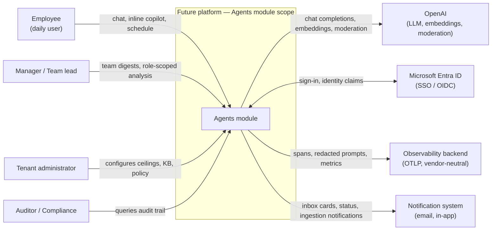

#### B.2 High-level data flow (Mermaid)

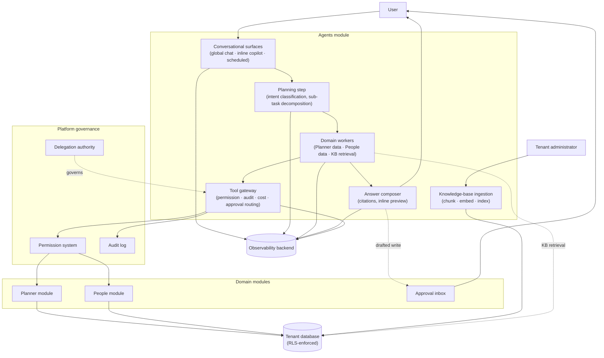

#### B.3 Trust-boundary properties

The dotted boundary in B.1 is the line every external interaction crosses. Three properties hold at the boundary regardless of which actor or system is on the other side:

1. The caller's identity and permission scope flow into every action the agent takes inside the boundary.
2. Every action that crosses the boundary outbound is audited.
3. No data leaves the boundary except through the four external systems shown.

#### B.4 State diagram — Conversation execution mode and turn lifecycle

A turn is the unit of agent work; each turn passes through a small, deterministic set of states. The lifecycle below is normative for FR-008 through FR-018, FR-023 / FR-024, FR-085 through FR-088, and NFR-026 through NFR-035.

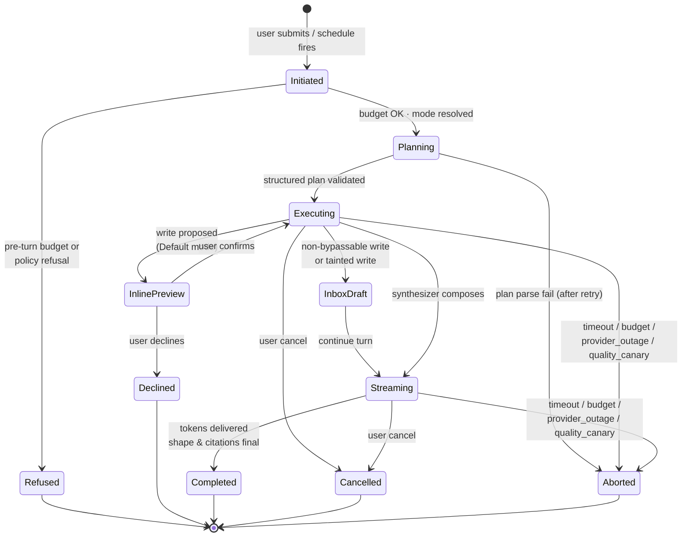

#### B.5 State diagram — Draft lifecycle

Drafts persisted to the approval inbox follow the lifecycle below. The diagram is normative for FR-040 through FR-045.

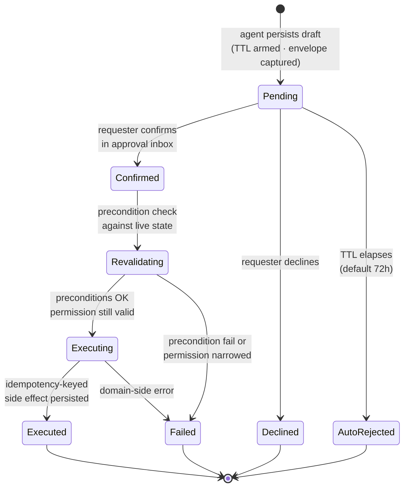

#### B.6 Sequence diagram — Interactive read-only turn

Canonical flow for FR-001 / FR-005 / FR-019 / FR-020 / FR-060 / FR-062 / FR-063 / NFR-001.

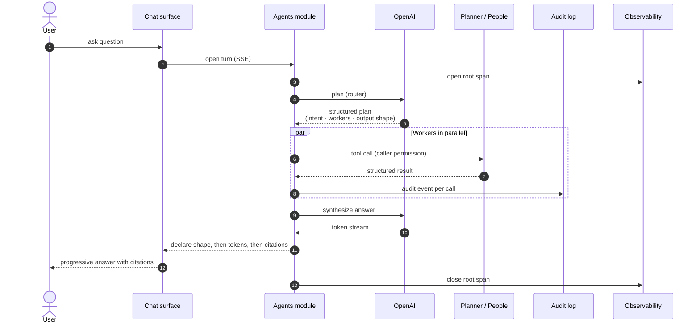

#### B.7 Sequence diagram — Default-mode single-target write

Canonical flow for FR-008 / FR-009 / FR-018 / FR-021 / FR-067 / UI-007.

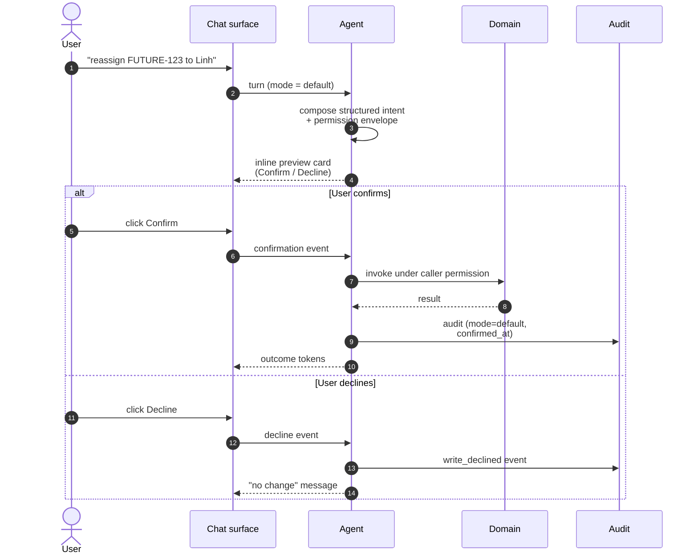

#### B.8 Sequence diagram — Inbox-path batch write (non-bypassable)

Canonical flow for FR-012 / FR-013 / FR-040 / FR-042 / FR-044 / FR-068 / FR-069 / FR-070.

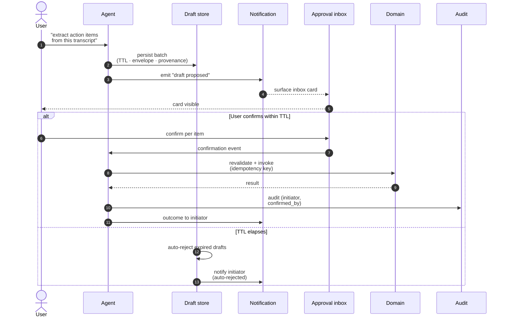

#### B.9 Sequence diagram — Scheduled asynchronous run

Canonical flow for FR-003 / FR-026 / FR-027 / FR-071 / FR-072 / FR-073.

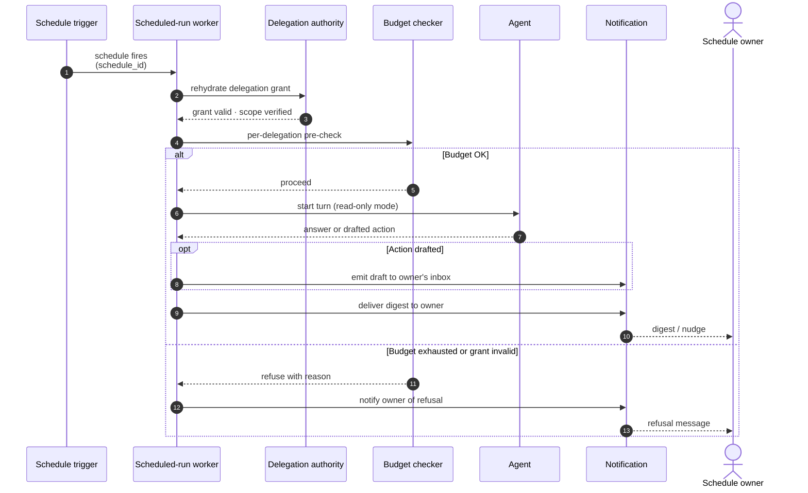

#### B.10 Sequence diagram — Cancellation with committed-write race

Canonical flow for FR-023 / FR-024 / FR-085 / FR-086 / FR-087 / FR-088 / NFR-008. The diagram shows the honesty contract: when a write commits before the cancel signal arrives, the user is told the truthful timestamp.

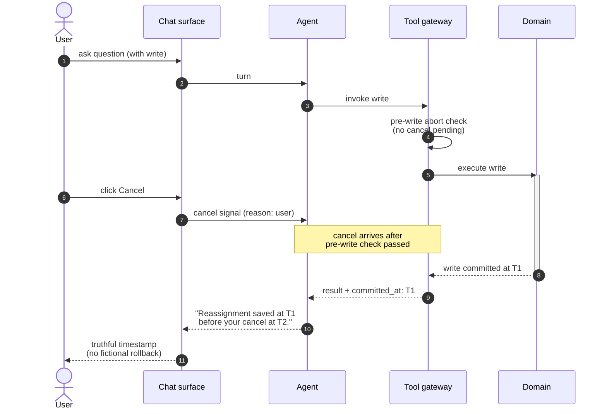

#### B.11 Activity diagram — Knowledge-base ingestion

Activity model for FR-053 through FR-059 and NFR-006.

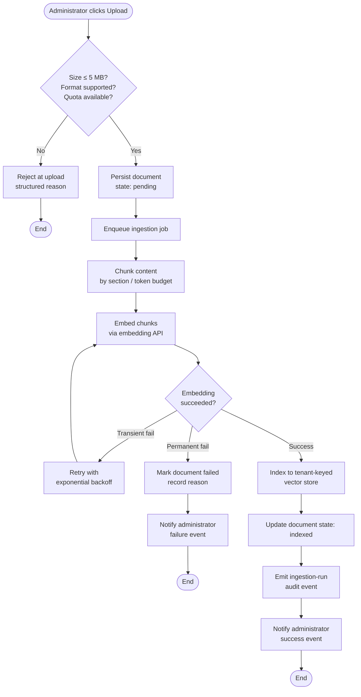

#### B.12 ER diagram — Logical data model

Logical entity-relationship view of the persistent state owned by the Agents module. The diagram is illustrative for the database requirements in §4.1; physical schema, partitioning, and indexing are owned by separate engineering artifacts.

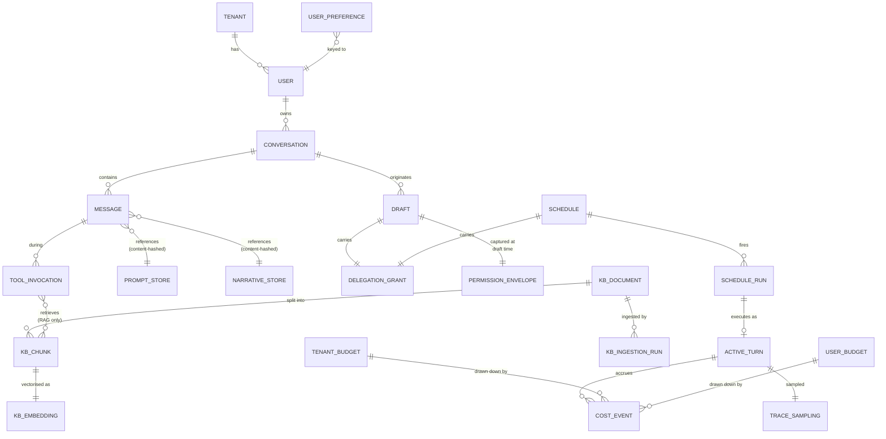

**Note on tenant isolation.** Every entity above is implicitly keyed by `tenant_id` (per DB-001 / DB-002 / NFR-009). The ER diagram omits the tenant key for visual clarity; in implementation it appears in every entity's primary key.

### Appendix C. Use Cases

Each use case is referenced by an identifier (`UC-NNN`) and includes: actor, preconditions, primary scenario, alternative scenarios, postconditions, and the requirements it exercises. Use cases are illustrative; they do not exhaustively enumerate user behaviour but cover every primary capability area.

#### C.0 Use case diagram — Actors and use cases

The diagram below maps each external actor (§2.1) to the use cases they initiate. Actor-to-use-case lines indicate "this actor initiates this use case"; UML-style `«include»` and `«extend»` relationships are not shown — alternatives are captured in each use-case's narrative below.

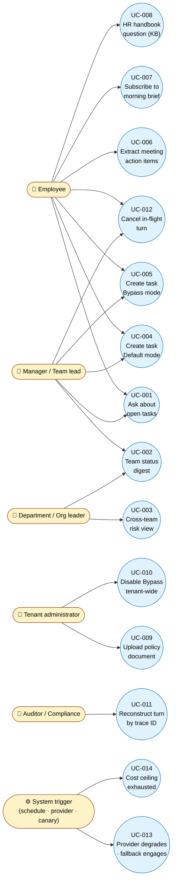

**How to read.** Each circle is a use case detailed in §C.1 onward. Each rounded box is an actor from §2.1. A line from actor to use case means the actor is the primary initiator. Use cases without an actor line (none in Phase 1) would be system-internal flows.

---

#### UC-001 — Employee asks about open tasks

| Field                | Value                                                                                                                                                                                                                                                                                           |
| -------------------- | ----------------------------------------------------------------------------------------------------------------------------------------------------------------------------------------------------------------------------------------------------------------------------------------------- |
| **Actor**            | Employee                                                                                                                                                                                                                                                                                        |
| **Preconditions**    | User is authenticated; conversation execution mode is set                                                                                                                                                                                                                                       |
| **Primary scenario** | (1) User opens the global chat surface. (2) User asks "What are my open tasks this week?". (3) The agent classifies intent, retrieves tasks scoped to the user, composes a structured list with citations, and streams the response. (4) User clicks a citation to navigate to the source task. |
| **Alternative — A**  | The user has no open tasks: agent responds with a plain-language "no open tasks" answer, no fabricated content (FR-038).                                                                                                                                                                        |
| **Alternative — B**  | LLM provider degrades during the response: ladder step engaged, user-visible notice shown (FR-036, NFR-029).                                                                                                                                                                                    |
| **Postconditions**   | Audit event recorded; cost event accrued; conversation history updated.                                                                                                                                                                                                                         |
| **Exercises**        | FR-001, FR-004, FR-005, FR-006, FR-019, FR-020, FR-028, FR-060, FR-061, NFR-001                                                                                                                                                                                                                 |

#### UC-002 — Manager requests team status digest

| Field                | Value                                                                                                                                                                                                                                                                                                                  |
| -------------------- | ---------------------------------------------------------------------------------------------------------------------------------------------------------------------------------------------------------------------------------------------------------------------------------------------------------------------- |
| **Actor**            | Manager / Team lead                                                                                                                                                                                                                                                                                                    |
| **Preconditions**    | User has team-lead permission scope on at least one team                                                                                                                                                                                                                                                               |
| **Primary scenario** | (1) User asks "Give me a status digest for my team this sprint." (2) The agent identifies the user's overseen team, retrieves plan and task state, and composes a narrative-with-table response with on-track / at-risk / done breakdown and recent changes. (3) Citations link each claim to the source task or plan. |
| **Alternative — A**  | The aggregated query falls below the minimum-group-size threshold for some metric: that metric is refused or k-anonymised (FR-025).                                                                                                                                                                                    |
| **Postconditions**   | Audit event recorded; conversation updated.                                                                                                                                                                                                                                                                            |
| **Exercises**        | FR-001, FR-006, FR-025, FR-062, FR-063, FR-064                                                                                                                                                                                                                                                                         |

#### UC-003 — Department leader requests cross-team risk view

| Field                | Value                                                                                                                                                                                               |
| -------------------- | --------------------------------------------------------------------------------------------------------------------------------------------------------------------------------------------------- |
| **Actor**            | Department / Org leader                                                                                                                                                                             |
| **Preconditions**    | User has department-leader permission scope                                                                                                                                                         |
| **Primary scenario** | (1) User asks "Which cross-team dependencies look at risk in Q3?". (2) Agent retrieves plans across overseen teams, evaluates dependency status, composes a table with risk callouts and citations. |
| **Postconditions**   | Audit event recorded.                                                                                                                                                                               |
| **Exercises**        | FR-019, FR-025, FR-063, FR-064                                                                                                                                                                      |

#### UC-004 — Employee creates a task in Default approvals mode

| Field                | Value                                                                                                                                                                                                                                                                                                                                                                                             |
| -------------------- | ------------------------------------------------------------------------------------------------------------------------------------------------------------------------------------------------------------------------------------------------------------------------------------------------------------------------------------------------------------------------------------------------- |
| **Actor**            | Employee                                                                                                                                                                                                                                                                                                                                                                                          |
| **Preconditions**    | Conversation execution mode is Default approvals                                                                                                                                                                                                                                                                                                                                                  |
| **Primary scenario** | (1) User says "Create a task to follow up with Anh about the Q3 brief by Friday." (2) The agent resolves "Anh" via People, identifies parent plan from current screen / conversation, composes the structured intent, renders an inline preview card with Confirm / Decline. (3) User clicks Confirm. (4) The task is created; conversation reflects the outcome with a citation to the new task. |
| **Alternative — A**  | User clicks Decline: the write is not executed; a structured decline event is recorded (FR-018).                                                                                                                                                                                                                                                                                                  |
| **Alternative — B**  | "Anh" is ambiguous (multiple matches): the agent surfaces the candidates and asks the user to choose before proceeding.                                                                                                                                                                                                                                                                           |
| **Postconditions**   | Audit event recorded with mode=default and confirmed_at timestamp; conversation updated.                                                                                                                                                                                                                                                                                                          |
| **Exercises**        | FR-008, FR-009, FR-018, FR-019, FR-020, FR-021, FR-065, FR-066, UI-007                                                                                                                                                                                                                                                                                                                            |

#### UC-005 — Employee creates a task in Bypass approvals mode

| Field                | Value                                                                                                                                                                                                                                  |
| -------------------- | -------------------------------------------------------------------------------------------------------------------------------------------------------------------------------------------------------------------------------------- |
| **Actor**            | Employee                                                                                                                                                                                                                               |
| **Preconditions**    | Conversation execution mode is Bypass approvals; tenant has not disabled Bypass tenant-wide                                                                                                                                            |
| **Primary scenario** | (1) User says "Reassign FUTURE-123 to Linh and push due date to next Tuesday." (2) The agent executes the mutation immediately under the user's permissions and includes the outcome in its reply with a citation to the updated task. |
| **Alternative — A**  | Tenant has disabled Bypass tenant-wide: the request is treated as Default approvals (FR-015), inline preview shown.                                                                                                                    |
| **Alternative — B**  | The tool is administrator-pinned to "always confirm" (FR-016): inline preview shown.                                                                                                                                                   |
| **Postconditions**   | Audit event recorded with mode=bypass and no confirmed_at; conversation updated.                                                                                                                                                       |
| **Exercises**        | FR-008, FR-010, FR-014, FR-015, FR-016, FR-067                                                                                                                                                                                         |

#### UC-006 — Employee extracts meeting action items (always inbox)

| Field                | Value                                                                                                                                                                                                                                                                                                                                                                                              |
| -------------------- | -------------------------------------------------------------------------------------------------------------------------------------------------------------------------------------------------------------------------------------------------------------------------------------------------------------------------------------------------------------------------------------------------- |
| **Actor**            | Employee                                                                                                                                                                                                                                                                                                                                                                                           |
| **Preconditions**    | User pastes or attaches a meeting transcript                                                                                                                                                                                                                                                                                                                                                       |
| **Primary scenario** | (1) User asks "Extract action items from this meeting transcript." (2) The agent extracts items, suggests an owner per item via People, attaches a confidence score, persists the batch as drafted tasks. (3) The platform notification module surfaces an approval-inbox card. (4) User opens the inbox, accepts or rejects per item. (5) Accepted items are executed under the user's authority. |
| **Alternative — A**  | TTL elapses before user reviews the batch: drafts auto-reject; initiator is notified (FR-040, FR-041).                                                                                                                                                                                                                                                                                             |
| **Alternative — B**  | Precondition revalidation fails for an accepted item (e.g. plan deleted): execution fails with a structured event; initiator notified (FR-042, FR-043).                                                                                                                                                                                                                                            |
| **Postconditions**   | Per-item audit events recorded; conversation updated with batch status.                                                                                                                                                                                                                                                                                                                            |
| **Exercises**        | FR-012, FR-013, FR-040, FR-041, FR-042, FR-043, FR-068, FR-069, FR-070, UI-020, UI-021                                                                                                                                                                                                                                                                                                             |

#### UC-007 — Employee subscribes to a morning task brief

| Field                | Value                                                                                                                                                                                                                                                                                                                 |
| -------------------- | --------------------------------------------------------------------------------------------------------------------------------------------------------------------------------------------------------------------------------------------------------------------------------------------------------------------- |
| **Actor**            | Employee                                                                                                                                                                                                                                                                                                              |
| **Preconditions**    | User is authenticated; tenant administrator has not capped the user's active schedules (FR-075)                                                                                                                                                                                                                       |
| **Primary scenario** | (1) User opens the schedules surface. (2) User configures a morning task brief at 08:00 weekdays. (3) The platform creates a delegation grant scoped to the brief's read intents. (4) Each weekday morning the schedule fires; the agent runs read-only, produces the brief, and the notification module delivers it. |
| **Alternative — A**  | Delegation grant has expired: the run is refused; user is notified (FR-072).                                                                                                                                                                                                                                          |
| **Alternative — B**  | Per-delegation budget exhausted: the run is refused with a budget reason (FR-077, NFR-016).                                                                                                                                                                                                                           |
| **Postconditions**   | Schedule run audit recorded.                                                                                                                                                                                                                                                                                          |
| **Exercises**        | FR-003, FR-026, FR-027, FR-071, FR-072, FR-073, FR-074                                                                                                                                                                                                                                                                |

#### UC-008 — Employee asks an HR-handbook question (knowledge base)

| Field                | Value                                                                                                                                                                                                                              |
| -------------------- | ---------------------------------------------------------------------------------------------------------------------------------------------------------------------------------------------------------------------------------- |
| **Actor**            | Employee                                                                                                                                                                                                                           |
| **Preconditions**    | The tenant has uploaded the handbook to its knowledge base                                                                                                                                                                         |
| **Primary scenario** | (1) User asks "How many days of bereavement leave am I entitled to?". (2) The agent retrieves passages from the tenant knowledge base. (3) The agent composes an answer with citations linking to the source document and section. |
| **Alternative — A**  | Embedding API degraded: retrieval returns empty; agent answers without the knowledge base and discloses the gap (FR-039).                                                                                                          |
| **Alternative — B**  | No relevant passage found: agent responds with "I could not find this in your knowledge base" plainly (FR-038).                                                                                                                    |
| **Postconditions**   | Audit event recorded.                                                                                                                                                                                                              |
| **Exercises**        | FR-006, FR-038, FR-039, FR-050, FR-051, FR-052                                                                                                                                                                                     |

#### UC-009 — Tenant administrator uploads a policy document

| Field                | Value                                                                                                                                                                                                                                                                                  |
| -------------------- | -------------------------------------------------------------------------------------------------------------------------------------------------------------------------------------------------------------------------------------------------------------------------------------- |
| **Actor**            | Tenant administrator                                                                                                                                                                                                                                                                   |
| **Preconditions**    | Administrator role granted; tenant under document quota (FR-057); document under per-document size cap (FR-058)                                                                                                                                                                        |
| **Primary scenario** | (1) Administrator opens the knowledge-base management view. (2) Administrator uploads a PDF policy document. (3) The system asynchronously chunks, embeds, indexes the document. (4) Notification delivered to administrator on completion. (5) Document is browsable and retrievable. |
| **Alternative — A**  | Document exceeds size cap: upload rejected at upload time with a structured reason.                                                                                                                                                                                                    |
| **Alternative — B**  | Ingestion fails (e.g. image-PDF, OCR not supported at Phase 1, CN-10): document marked failed with a structured failure reason; administrator notified (FR-056, FR-059).                                                                                                               |
| **Alternative — C**  | Document successfully ingested but later deprecated by administrator: deprecated document excluded from retrieval (FR-055).                                                                                                                                                            |
| **Postconditions**   | Ingestion run audit recorded; document available for retrieval.                                                                                                                                                                                                                        |
| **Exercises**        | FR-053, FR-054, FR-055, FR-056, FR-057, FR-058, FR-059, NFR-006, UI-017                                                                                                                                                                                                                |

#### UC-010 — Tenant administrator disables Bypass mode tenant-wide

| Field                | Value                                                                                                                                                                                                                               |
| -------------------- | ----------------------------------------------------------------------------------------------------------------------------------------------------------------------------------------------------------------------------------- |
| **Actor**            | Tenant administrator                                                                                                                                                                                                                |
| **Preconditions**    | Administrator role granted                                                                                                                                                                                                          |
| **Primary scenario** | (1) Administrator opens execution-mode policy view. (2) Administrator toggles "Disable Bypass tenant-wide" and saves. (3) Within five minutes, all conversations in the tenant behave as Default mode regardless of user selection. |
| **Postconditions**   | Configuration change audit recorded with old value, new value, administrator identity, timestamp.                                                                                                                                   |
| **Exercises**        | FR-015, FR-080, FR-082, FR-083, NFR-038                                                                                                                                                                                             |

#### UC-011 — Auditor reconstructs a turn by trace identifier

| Field                | Value                                                                                                                                                                                                                                                                                                                                                          |
| -------------------- | -------------------------------------------------------------------------------------------------------------------------------------------------------------------------------------------------------------------------------------------------------------------------------------------------------------------------------------------------------------- |
| **Actor**            | Auditor / Compliance reviewer                                                                                                                                                                                                                                                                                                                                  |
| **Preconditions**    | Auditor role granted; trace identifier available (e.g. from an incident report)                                                                                                                                                                                                                                                                                |
| **Primary scenario** | (1) Auditor enters trace identifier into the audit query interface. (2) The system returns: initiator identity, delegation reference, execution mode, sequence of tool calls, prompt-store hashes, output reference, timestamps, and any confirmation events. (3) Auditor invokes "replay" to reconstruct the prompt and tool-call sequence deterministically. |
| **Alternative — A**  | Prompt-store hash cannot be resolved: the system raises an error and refuses to fall back to a fuzzy match (FR-049).                                                                                                                                                                                                                                           |
| **Postconditions**   | Auditor obtains the full lineage in a single query (FR-022); reconstruction is identical to the original turn (FR-046).                                                                                                                                                                                                                                        |
| **Exercises**        | FR-020, FR-021, FR-022, FR-046, FR-047, FR-048, FR-049                                                                                                                                                                                                                                                                                                         |

#### UC-012 — Employee cancels an in-flight turn

| Field                | Value                                                                                                                                                                                                                 |
| -------------------- | --------------------------------------------------------------------------------------------------------------------------------------------------------------------------------------------------------------------- |
| **Actor**            | Employee                                                                                                                                                                                                              |
| **Preconditions**    | A turn is in flight                                                                                                                                                                                                   |
| **Primary scenario** | (1) User clicks Cancel. (2) The cancellation signal propagates within the sub-second target. (3) The agent ceases at the next ceasing point; conversation is updated with a cancellation indicator and reason `user`. |
| **Alternative — A**  | A write committed before the cancellation reached the gateway: the agent presents the truthful timestamp of the commit (FR-024); no fictional rollback message.                                                       |
| **Postconditions**   | Cancellation audit recorded with reason and timestamp.                                                                                                                                                                |
| **Exercises**        | FR-023, FR-024, FR-085, FR-086, FR-087, NFR-008, NFR-035                                                                                                                                                              |

#### UC-013 — LLM provider degrades; fallback engages

| Field                | Value                                                                                                                                                                                                                                                                                                                           |
| -------------------- | ------------------------------------------------------------------------------------------------------------------------------------------------------------------------------------------------------------------------------------------------------------------------------------------------------------------------------- |
| **Actor**            | Any user                                                                                                                                                                                                                                                                                                                        |
| **Preconditions**    | LLM provider is in a degraded state (transient errors or quality-canary flagged)                                                                                                                                                                                                                                                |
| **Primary scenario** | (1) User asks a question. (2) Provider call returns transient error; runtime retries once, then falls back to the smaller model. (3) The agent emits a user-visible notice that the experience has changed and continues to answer. (4) Quality canary detects continued degradation and routes the tenant to the smaller tier. |
| **Alternative — A**  | Both tiers degrade severely (success rate < 50%): the system refuses new turns with the elevated-degradation message (NFR-029, FR-037).                                                                                                                                                                                         |
| **Alternative — B**  | Tenant daily budget reached during degradation: refuse with budget reason (FR-077, NFR-029).                                                                                                                                                                                                                                    |
| **Postconditions**   | Degradation event audited; trace tagged with the ladder step reached.                                                                                                                                                                                                                                                           |
| **Exercises**        | FR-036, FR-037, FR-038, NFR-027, NFR-028, NFR-029, NFR-030                                                                                                                                                                                                                                                                      |

#### UC-014 — Cost ceiling exhausted; refusal with reason

| Field                | Value                                                                                                                                                                                       |
| -------------------- | ------------------------------------------------------------------------------------------------------------------------------------------------------------------------------------------- |
| **Actor**            | Employee or asynchronous run                                                                                                                                                                |
| **Preconditions**    | Tenant or per-user daily budget at 100%                                                                                                                                                     |
| **Primary scenario** | (1) User submits a turn (or a schedule fires). (2) The pre-turn budget check refuses; user / schedule owner sees a plain-language refusal with the budget reason. (3) Audit event recorded. |
| **Alternative — A**  | Budget reaches 80% (warning threshold): the user sees a non-blocking notice at turn start; turns continue.                                                                                  |
| **Postconditions**   | Refusal audit recorded; cost-event ledger reflects the day's consumption.                                                                                                                   |
| **Exercises**        | FR-037, FR-077, NFR-004, NFR-016                                                                                                                                                            |

---

### Appendix D. Requirements Traceability Matrix

The matrix below summarises requirement coverage by feature area. Every requirement in §3 and §4 is uniquely identified; tooling can mechanically extract this matrix from this document.

| Feature / Area                        | Requirement IDs   | Use Cases                              |
| ------------------------------------- | ----------------- | -------------------------------------- |
| Conversational surfaces and output    | FR-001 – FR-007   | UC-001, UC-002, UC-008                 |
| Execution modes and approval routing  | FR-008 – FR-018   | UC-004, UC-005, UC-006                 |
| Governance and trust boundary         | FR-019 – FR-027   | UC-001, UC-003, UC-004, UC-011         |
| Conversation memory                   | FR-028 – FR-035   | UC-001, UC-008                         |
| Honesty and degradation               | FR-036 – FR-039   | UC-008, UC-013                         |
| Approval lifecycle                    | FR-040 – FR-045   | UC-006                                 |
| Audit trail and deterministic replay  | FR-046 – FR-049   | UC-011                                 |
| Tenant knowledge base                 | FR-050 – FR-059   | UC-008, UC-009                         |
| Planner — read capabilities           | FR-060 – FR-064   | UC-001, UC-002, UC-003                 |
| Planner — write capabilities          | FR-065 – FR-070   | UC-004, UC-005, UC-006                 |
| Scheduled and event-triggered runs    | FR-071 – FR-075   | UC-007                                 |
| Tenant administration                 | FR-076 – FR-084   | UC-009, UC-010                         |
| Cancellation and abort                | FR-085 – FR-088   | UC-012, UC-013                         |
| User interfaces                       | UI-001 – UI-025   | UC-001, UC-004, UC-006, UC-009, UC-010 |
| External interfaces                   | EI-001 – EI-016   | All                                    |
| Performance                           | NFR-001 – NFR-008 | UC-001, UC-006                         |
| Security and privacy                  | NFR-009 – NFR-019 | UC-001, UC-003, UC-011                 |
| Usability                             | NFR-020 – NFR-025 | All                                    |
| Reliability                           | NFR-026 – NFR-035 | UC-006, UC-012, UC-013                 |
| Maintainability and scalability       | NFR-036 – NFR-039 | UC-010                                 |
| Database                              | DB-001 – DB-011   | UC-009, UC-011                         |
| Legal, regulatory, compliance         | LR-001 – LR-014   | UC-009, UC-011                         |
| Internationalisation and localisation | I18N-01 – I18N-07 | All                                    |

---

## Document Control

| Field              | Value                                                                                            |
| ------------------ | ------------------------------------------------------------------------------------------------ |
| **Version**        | 1.0 (baseline)                                                                                   |
| **Status**         | Approved baseline                                                                                |
| **Date**           | 2026-05                                                                                          |
| **Owner**          | Future platform engineering — Agents track                                                       |
| **Distribution**   | Internal — engineering, product, compliance, operations, executive sponsors                      |
| **Change control** | Any change to a numbered requirement is a documented amendment with a new revision and approval. |
| **Next review**    | At Phase 1 acceptance; thereafter quarterly while the Agents module is active.                   |
