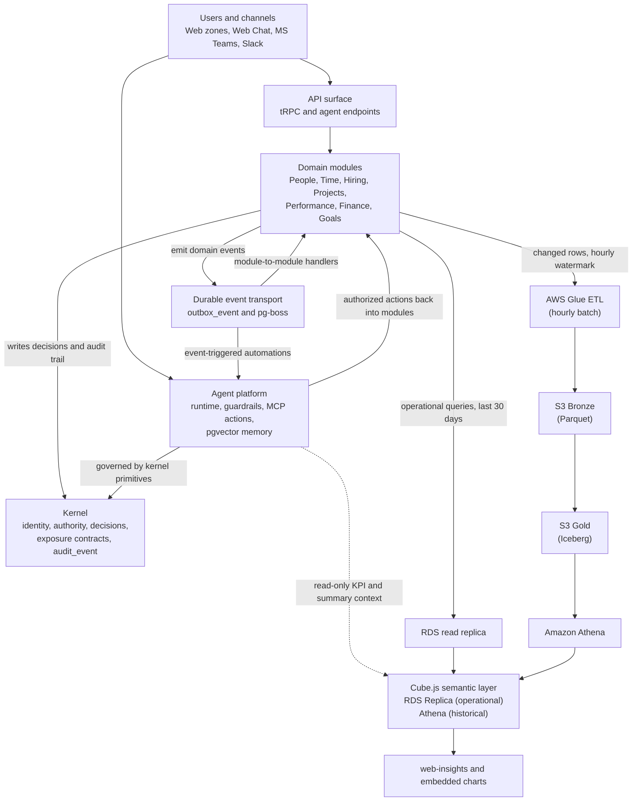

# Future — Solution Architecture View

**Date:** 2026-04-08  
**Status:** Derived from agreed specs  
**Project:** Seta Future AaaS

---

## Purpose

This document is the visual companion to Future's agreed architecture specs. It focuses on the infrastructure view and embeds the single unified architecture diagram for the full stack.

This file does not replace the source-of-truth specs. It summarizes and visualizes them.

---

## Source Specs

- [Deployment Infrastructure](./deployment.md)
- [Data Platform](./data-platform.md)
- [Application Architecture](./application.md)
- [Kernel Design](./kernel.md)
- [Agent Runtime](./agent-runtime.md)

---

## Solution Architecture View

The platform has one consistent serving path: Route 53 and ACM terminate into an ALB, which routes requests to ECS Fargate services for the web zones, API, and analytics surfaces. The full data platform (S3 lakehouse, Glue ETL, Iceberg, Athena) is operational from initial deployment — there is no interim-only phase.

---

## Operational Data Flow

This view shows how requests, domain events, agents, kernel governance, and the data platform connect end to end. Module-to-module communication is event-driven only via the durable outbox transport.

Agents use two distinct data paths:

- Module actions for operational reads and write-capable workflows.
- Data platform queries for read-heavy KPI, reporting, and summary context.

---

## Infrastructure Architecture

> Infrastructure diagram — TBD (to be generated once the initial Terraform topology is finalized)

**What this architecture includes**

- Shared edge layer with Route 53, ACM, and one ALB per environment using path-based routing.
- ECS Fargate Graviton ARM64 hosts the web zones (12 Next.js services including `web-admin`), NestJS API, Cube.js, and Langfuse. Fargate Spot for all stateless web zones; On-Demand baseline for API and Cube.js.
- The API reaches PostgreSQL through RDS Proxy for connection pooling and tenant context injection via `set_config` + RLS.
- Cube.js reads from two explicit data sources: RDS read replica (operational queries, last 30 days) and Amazon Athena (historical trends, cross-module analytics over S3 Gold Iceberg tables).
- AWS Glue ETL runs hourly: reads changed rows from RDS module schemas, writes Parquet to S3 Bronze, merges into S3 Gold using Apache Iceberg. ~$2/month.
- Redis (ElastiCache) supports Cube.js query caching only. Agent sessions are stored in PostgreSQL `agents.agent_session`.
- Langfuse self-hosted on ECS Fargate with its own isolated RDS db.t4g.micro — trace write volume is fully isolated from OLTP.
- ECR (one repo per service), Secrets Manager, CloudWatch, S3, DynamoDB, and EventBridge support delivery, observability, and staging cost control.
- Staging scale-to-zero via EventBridge: 9am–8pm SGT weekdays only.

**Cost summary**

- Production: ~$349/month
- Staging: ~$127/month
- Total: ~$476/month

**Source references**

- [Deployment Infrastructure](./deployment.md)
- [Data Platform](./data-platform.md)
