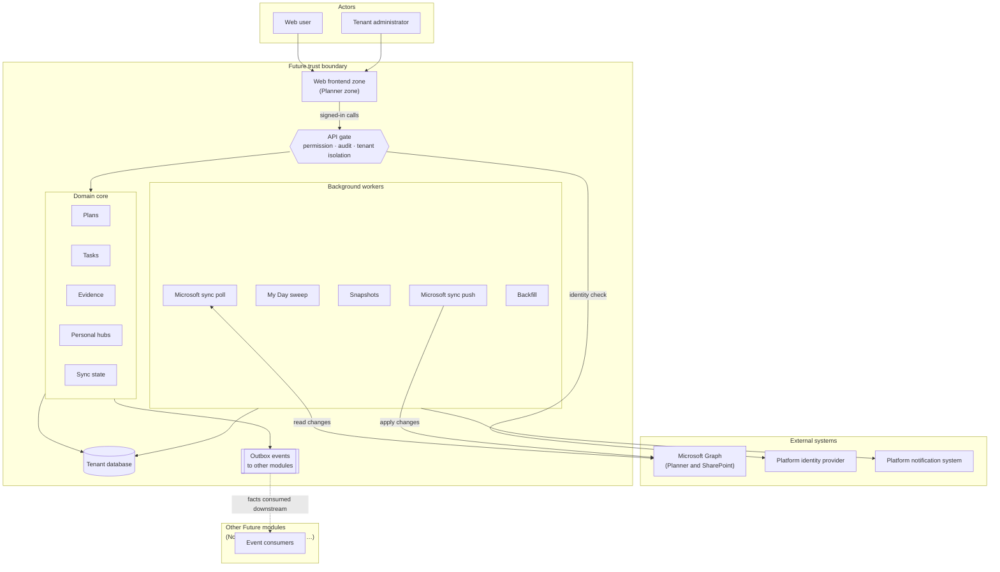
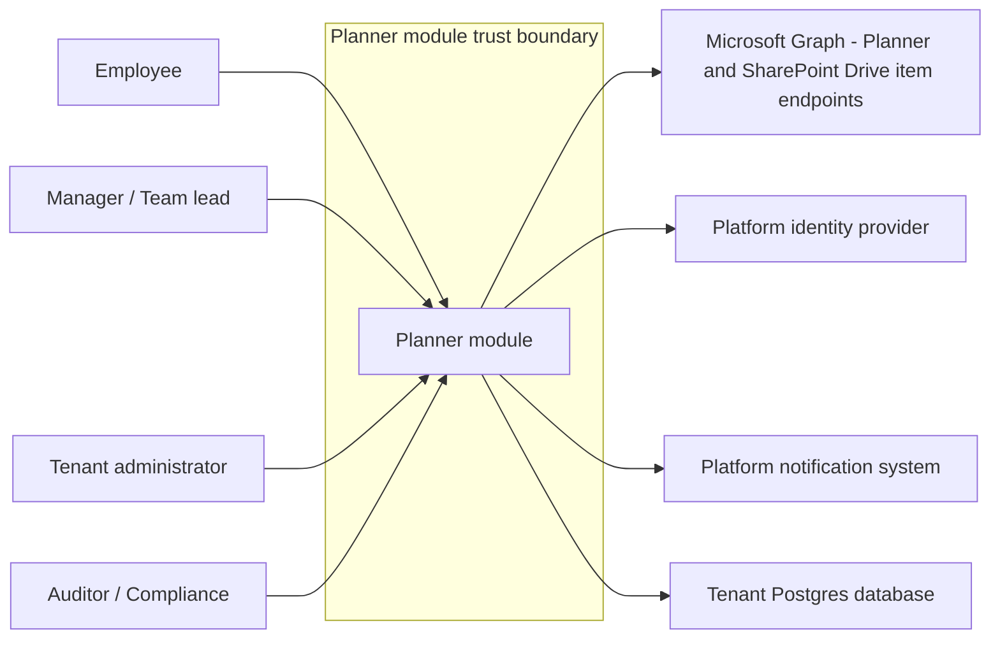
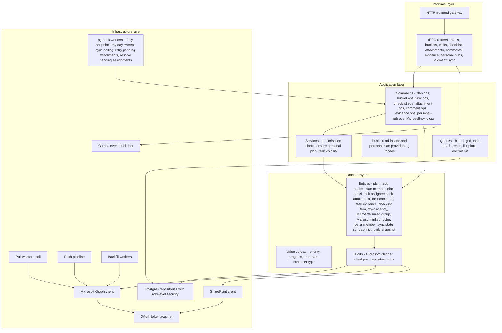
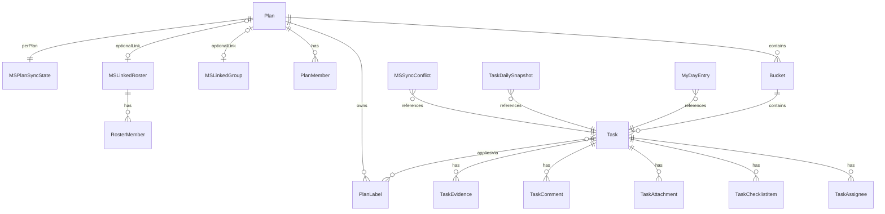
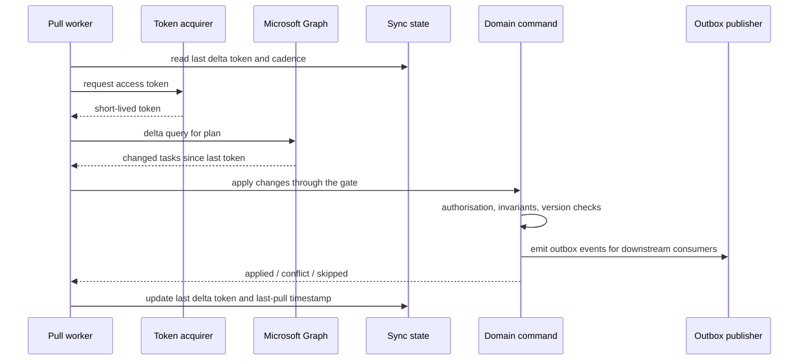
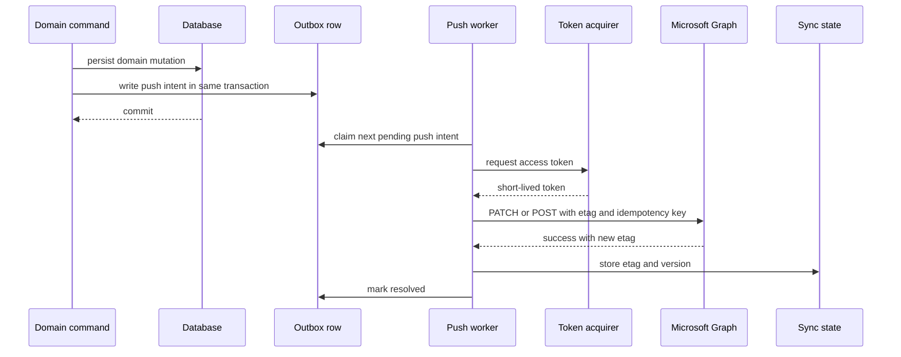
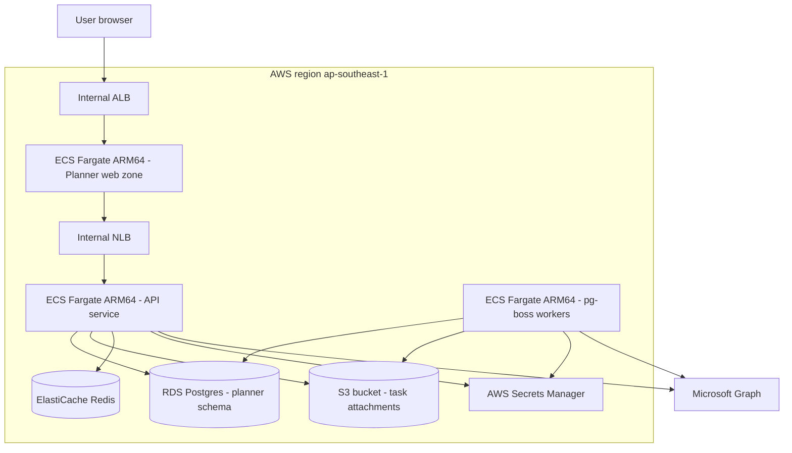
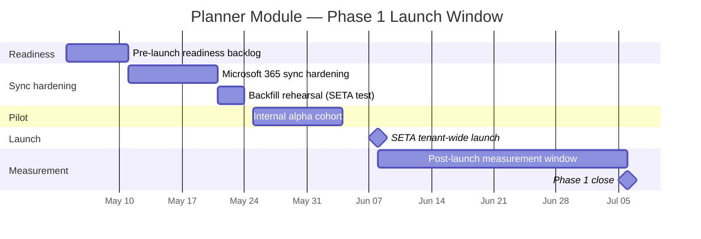

# Planner Module — System Architecture Document

**Status:** Draft v1.1 · **Scope:** Phase 1 — Planner module with bidirectional Microsoft 365 Planner sync and evidence capture · **Classification:** Internal only · **Date:** 2026-05-05

---

## Table of Contents

| §   | Section                                                                                            | Audience    |
| --- | -------------------------------------------------------------------------------------------------- | ----------- |
| 1   | [Executive Summary](#1-executive-summary)                                                          | BoD         |
| 2   | [Introduction & Goals](#2-introduction--goals)                                                     | Both        |
| 2.1 | Purpose & Scope                                                                                    | Both        |
| 2.2 | Business Context & Drivers                                                                         | BoD         |
| 2.3 | Stakeholders                                                                                       | Both        |
| 2.4 | Glossary & Abbreviations                                                                           | Both        |
| 3   | [Requirements Overview](#3-requirements-overview)                                                  | Both        |
| 3.1 | Functional Requirements                                                                            | Both        |
| 3.2 | Non-Functional Requirements                                                                        | Engineering |
| 3.3 | Constraints & Assumptions                                                                          | Both        |
| 4   | [Solution Overview](#4-solution-overview)                                                          | Both        |
| 4.1 | Solution Strategy                                                                                  | Both        |
| 4.2 | High-Level Architecture Diagram                                                                    | Both        |
| 4.3 | Key Design Principles                                                                              | Both        |
| 5   | [Architecture Views](#5-architecture-views)                                                        | Engineering |
| 5.1 | System Context View                                                                                | Both        |
| 5.2 | Logical / Component Architecture                                                                   | Engineering |
| 5.3 | Data Architecture                                                                                  | Engineering |
| 5.4 | Integration Architecture                                                                           | Engineering |
| 5.5 | Infrastructure / Deployment Architecture                                                           | Engineering |
| 5.6 | Security Architecture                                                                              | Both        |
| 5.7 | Reliability, Resilience & Failure Handling                                                         | Both        |
| 6   | [Technology Stack](#6-technology-stack)                                                            | Engineering |
| 7   | [Architecture Decision Records (ADRs)](#7-architecture-decision-records-adrs)                      | Engineering |
| 8   | [Risks, Assumptions, Issues & Dependencies (RAID)](#8-risks-assumptions-issues--dependencies-raid) | BoD         |
| 9   | [Migration & Transition Plan](#9-migration--transition-plan)                                       | Both        |
| 10  | [Operational Model](#10-operational-model)                                                         | Engineering |
| 11  | [Appendices](#11-appendices)                                                                       | Both        |

---

## 1. Executive Summary

## At a glance

Planner is the work-tracking module of the Future platform. In Phase 1 it ships a multi-tenant plans-and-tasks surface, evidence capture for completed work, and bidirectional synchronisation with Microsoft 365 Planner. The architectural premise is straightforward: be the canonical record of work and its proof, while leaving the user's existing Microsoft workflow untouched.

## What it is

Planner is a multi-tenant work-tracking surface inside the Future platform. It manages plans, tasks, buckets, schedules, and the people assigned to them, and it stays continuously aligned with Microsoft 365 Planner for tenants who already operate there. What sets it apart is evidence capture: every completed task can carry verifiable proof of work, so "done" stops being a self-declaration and starts being a record.

## The architectural premise

> _Microsoft 365 is where work is already happening. Planner does not try to win that surface — it earns the right to sit alongside it by being the system of record for proof, permission, and history._

Everything that follows in this document — the bidirectional sync model, the evidence layer, the audit posture — derives from that single decision. Planner complements Microsoft 365; it does not compete with it.

## Phase 1 scope

|                          |                                                                                                                                                                                                                                                                                       |
| ------------------------ | ------------------------------------------------------------------------------------------------------------------------------------------------------------------------------------------------------------------------------------------------------------------------------------- |
| Goal at end of phase     | A live, multi-tenant Planner module operating as the canonical work-tracking surface for the first cohort of users, kept continuously in sync with their Microsoft 365 Planner tenant.                                                                                                |
| Headline experience      | Plans and tasks with rich detail (progress, priority, dates, checklists, assignees, labels, attachments, comments), four view modes (board, grid, charts, schedule), personal hubs (My Day, My Tasks, Personal Charts, Carry-Over), and first-class evidence on every completed task. |
| Supporting integration   | Bidirectional Microsoft 365 Planner synchronisation with explicit, auditable conflict resolution.                                                                                                                                                                                     |
| Out of scope for Phase 1 | AI-generated reminders and nudges, KPI and OKR linkage, cross-tenant collaboration, native mobile apps, real-time collaborative cursors, and server-side processing of attachment contents.                                                                                           |
| What follows Phase 1     | AI reminders layered through the Agents module; KPI and OKR rollups through the Goals module. Both consume Planner as a source of truth — neither requires Planner to be re-architected.                                                                                              |

## Five operating promises

| #   | Promise                                                                                                                                                                      | Why it matters                                                                                                                                                                                                |
| --- | ---------------------------------------------------------------------------------------------------------------------------------------------------------------------------- | ------------------------------------------------------------------------------------------------------------------------------------------------------------------------------------------------------------- |
| 1   | **Bidirectional truth.** Writes flow both ways with Microsoft 365 Planner; the tenant's existing Microsoft workflow keeps working unchanged.                                 | Adoption fails the moment users are asked to abandon a tool they already trust. Bidirectional sync removes that ask entirely.                                                                                 |
| 2   | **Evidence-grade record.** Every completed task can carry proof of work — files, links, structured notes — with a verification state attached.                               | "Done" without evidence is the failure mode behind missed deliverables, disputed performance reviews, and unverifiable client billing. Evidence makes completion auditable.                                   |
| 3   | **Permission-bounded.** Every read and every write executes under the caller's authority. Cross-tenant isolation is enforced at the database layer, not by application code. | One tenant ever seeing another tenant's data is an existential incident for a multi-tenant business platform. Enforcement at the data layer means a single missed check in application code cannot leak data. |
| 4   | **Auditable changes.** Every mutation produces a kernel audit event. Reconstructing who changed what, and when, is a single query.                                           | Regulators, customers, and internal HR investigations all eventually ask the same question. The answer must take minutes, not weeks.                                                                          |
| 5   | **Honest sync.** Microsoft 365 Planner sync conflicts surface to administrators with full context. Nothing is silently overwritten.                                          | Silent overwrites destroy user trust and produce data losses that are discovered only after the affected work has been forgotten. Honest conflict surfacing is the price of a two-way integration.            |

## Investment posture

Planner is being built once, for the long-term target shape of the business. Staged rollout — feature flags, sync types per tenant, controlled cohorts — governs who is exposed to it and when, but the underlying module does not need a second rewrite to support the modules that come next. When the Goals module begins consuming task data for OKR rollups, and when the Agents module begins generating reminders against task state, both will integrate as configuration against a stable surface, not as fresh integration projects.

## Phase 1 success criteria

- Planner module is live for SETA-internal users with bidirectional Microsoft 365 Planner sync working end to end.
- Zero cross-tenant data exposure incidents during the launch window.
- Microsoft sync conflict resolution measurably surfaces every collision — no silent loss of user work.
- Evidence capture is in active use on at least the first cohort of plans.
- The administrative dashboard answers "what changed and why" for any plan, any task, on any day, in a single query.

---

_Continue to Section 2 — Introduction & Goals._

---

## 2. Introduction & Goals

### 2.1 Purpose & Scope

This document is the architectural source of truth for the Planner module of the Future platform. It is the design that engineering builds to, the picture that leadership signs off on, and the reference that audit and compliance reviewers verify against. Where day-to-day code, configuration, and decisions diverge from this document, the document is wrong and must be updated; where they agree, this document is what governs.

**What this document covers**

- The Phase 1 capabilities of the Planner module: plans, tasks, and the evidence record that proves work happened.
- The personal hubs every employee uses to see their own work across the platform.
- Bidirectional synchronization with Microsoft 365 Planner, including the three container types Future supports for plans.
- The operational and rollout model for the module — how it is brought into a tenant, how it stays healthy, and how it is shut down cleanly.

**What this document does not cover**

- The internal mechanics of other Future modules. Identity, Notifications, Kernel, and the rest are treated as black-box dependencies with stable contracts; their own architecture documents own their internals.
- The broader Future data platform — analytics, warehousing, and reporting infrastructure — beyond the events Planner publishes outward.
- Frontend implementation details below the level of the user-visible surfaces. Page-by-page interaction design and component-level concerns sit in product and design artifacts, not here.
- AI reminder generation, KPI scoring, and OKR linkage. These are deliberately deferred to later modules that will consume Planner's evidence stream; describing them here would over-promise what Phase 1 ships.

### 2.2 Business Context & Drivers

SETA, the first tenant, runs on Microsoft 365. So do most of the prospective external tenants Future will sell to. Microsoft 365 already includes Planner, and asking a tenant to abandon it in favor of a new tracker is, on its own, a non-starter — people do not change where they work simply because a new vendor asks them to. At the same time, Microsoft 365 Planner alone does not give Future the surface it needs. It does not capture evidence in the structured form that performance reviews and goal tracking require, it does not provide personal hubs that span every Future module, it does not expose the cross-module event signal that the rest of the platform depends on, and it does not feed the agent-driven KPIs that later modules will offer.

The strategic shape, then, is to complement rather than replace. Planner is the bridge that lets Future earn its way into a tenant's day-to-day work without forcing the tenant off the Microsoft tools they already use. Tasks created in either system show up in the other. Evidence captured against a task in Future enriches the same task in Microsoft 365 Planner. A tenant can adopt Future for goals, performance, and reviews while their teams keep planning the way they always have.

Three drivers underpin the decision to build the module this way:

1. **Where work actually happens.** Most tenants already live in Microsoft 365. A planner that ignores that surface is a planner nobody uses; one that mirrors it is an extension users adopt without friction.
2. **Evidence as the substrate for everything later.** Goals, performance reviews, and agent-driven KPIs all need a verifiable record of what got done. Evidence capture in Planner is the upstream source those later modules consume.
3. **One canonical work model across all modules.** Time, projects, hiring, performance — every module that needs a notion of task or plan reads it from here. Concentrating that model in one place is the difference between a coherent platform and a federation of mini-products.

> _Adopt where users already are; differentiate where they want more._

### 2.3 Stakeholders

| Stakeholder                              | Role                   | Primary interest                                                                                                                          |
| ---------------------------------------- | ---------------------- | ----------------------------------------------------------------------------------------------------------------------------------------- |
| Board / CEO                              | Strategic sponsor      | That Planner anchors Future inside the tenant's existing workday and feeds the modules that drive commercial value.                       |
| CTO / Tech Lead                          | Technical owner        | That the module is sound, scalable, maintainable, and that the Microsoft 365 sync does not become a long-term liability.                  |
| Engineering team (Planner module owners) | Designers and builders | Clear contracts, clean boundaries with neighbouring modules, and a sync model they can reason about under load and failure.               |
| Product Manager                          | Capability owner       | A coherent product narrative for plans, tasks, evidence, and personal hubs across both Future and Microsoft 365 surfaces.                 |
| Department heads (HR, Finance, Delivery) | First power users      | A reliable place to assign, track, and review work for their teams; trust that evidence rolls up into reviews and reporting.              |
| End users (everyday SETA employees)      | Daily users            | A personal hub that shows what they have to do today, and a planner that does not duplicate or fight the tools they already use.          |
| Tenant administrators                    | Operators              | A safe way to connect Microsoft 365, choose what is mirrored, set sync behaviour, and turn it off again without losing data.              |
| Compliance / Legal                       | Risk reviewers         | Confidence that data crossing the Microsoft boundary is governed, that evidence is auditable, and that tenants can be offboarded cleanly. |
| External tenants (post-launch)           | Future customers       | A platform that respects their existing Microsoft investment while giving them workflow capabilities Microsoft 365 alone does not.        |

### 2.4 Glossary & Abbreviations

#### Business-level terms

| Term                | Definition                                                                                                                                                                                                                  |
| ------------------- | --------------------------------------------------------------------------------------------------------------------------------------------------------------------------------------------------------------------------- |
| Plan                | A named container that holds a related set of tasks. The unit a team or an individual organizes their work around.                                                                                                          |
| Personal plan       | A plan owned by a single user, used for their own work. Not shared with a team unless the user chooses to share it.                                                                                                         |
| Team plan           | A plan shared by a group of people who collaborate on the work it contains. Members come from a defined roster or a connected Microsoft 365 Group.                                                                          |
| Bucket              | A named column inside a plan used to group tasks — for example, by stage, by owner, or by week.                                                                                                                             |
| Task                | A single unit of work inside a plan. Tasks have a title, an optional description, an owner, a due date, a status, and any number of attachments and checklist items.                                                        |
| Checklist           | An ordered list of sub-items inside a task, each of which can be ticked off independently. Used to break a task down without creating a separate task for every step.                                                       |
| Label               | A short tag attached to a task to mark a category, theme, or priority. Labels can be filtered and reported on.                                                                                                              |
| Evidence            | A structured record attached to a task that captures what was actually done, by whom, and when. Evidence is the upstream source that later modules — performance, goals, agent KPIs — consume.                              |
| Microsoft 365 Group | A real Microsoft 365 group, visible in the tenant's directory, with its own membership and its own Planner plan.                                                                                                            |
| Roster              | A Future-minted, tenant-scoped pseudo-group used when a tenant wants Microsoft sync semantics for a plan without exposing it in the Microsoft 365 directory. Useful for sensitive teams or for tenants migrating gradually. |
| Sync conflict       | A situation where the same task has been changed in both Future and Microsoft 365 Planner before the next sync, so the system has to choose which version wins.                                                             |
| My Day              | A personal view that gathers everything the user needs to focus on today: tasks due, tasks they pinned, and items pulled in from other Future modules.                                                                      |
| Tenant              | A single customer organization on the Future platform. SETA is one tenant; each external customer becomes another. Tenants are isolated from each other in every dimension that matters.                                    |
| Module              | A self-contained capability of the Future platform — Planner, Goals, Performance, Hiring, and so on. Modules can be turned on or off per tenant.                                                                            |

#### Engineering-level terms

| Term               | Definition                                                                                                                                                                                                                                                                                                            |
| ------------------ | --------------------------------------------------------------------------------------------------------------------------------------------------------------------------------------------------------------------------------------------------------------------------------------------------------------------- |
| Container type     | The kind of plan a given record represents. Three values are supported: future-only (lives only inside Future, no Microsoft connection), ms-group (mirrors a real Microsoft 365 Group's Planner plan), and ms-roster (uses a Future-minted roster for sync without exposing the plan in the Microsoft 365 directory). |
| Pull cycle         | The recurring inbound sync pass where Future pulls recent changes from Microsoft 365 Planner and reconciles them with its own state.                                                                                                                                                                                  |
| Push pipeline      | The outbound flow that takes changes made inside Future and writes them into Microsoft 365 Planner, in order, with retries and backoff.                                                                                                                                                                               |
| Last-write-wins    | The conflict-resolution rule that picks whichever side made the most recent change when the same task has been edited on both sides since the last sync.                                                                                                                                                              |
| Outbox event       | A durable record of a domain change that other modules can subscribe to. Written in the same transaction as the change itself, so an event is never lost and never published for a change that did not commit.                                                                                                        |
| Kernel audit event | A higher-trust record sent to the platform's central audit log, used for actions that compliance and security need to be able to reconstruct after the fact.                                                                                                                                                          |
| Query facade       | The narrow, read-only contract a module exposes to its peers. Other modules ask Planner questions through this surface and never reach into its internal data directly.                                                                                                                                               |
| Personal hub       | A user-scoped surface inside Planner that aggregates work across plans. The four hubs at Phase 1 are My Day, My Tasks, Personal Charts, and Carry-Over.                                                                                                                                                               |

---

## 3. Requirements Overview

The canonical requirement statements are in the SRS (`docs/architecture/planner-srs.md`). This section presents an architectural digest only: a feature-area summary mapped to SRS identifiers, the non-functional thresholds the architecture is designed to meet, and the binding constraints the design works within. Where this digest and the SRS conflict, the SRS prevails.

### 3.1 Functional Requirements (digest)

#### Plans and structure

| SRS ID    | Capability                                                                                                                                                   |
| --------- | ------------------------------------------------------------------------------------------------------------------------------------------------------------ |
| FR-PL-001 | Two plan ownership shapes: team plans (created by tenant members) and personal plans (auto-provisioned per user). Personal plans are private to their owner. |
| FR-PL-002 | Container type `{future-only, ms-group, ms-roster}` per plan; personal plans are always `future-only`.                                                       |
| FR-PL-003 | Container type is fixed at create or first-link time; not modifiable in Phase 1.                                                                             |
| FR-PL-004 | Owners may rename, soft-delete, and manage membership of a plan.                                                                                             |
| FR-PL-005 | Role-based plan membership with `owner` and `member` roles.                                                                                                  |
| FR-PL-006 | Ordered buckets per plan; CRUD and reorder by authorised members.                                                                                            |
| FR-PL-007 | Fixed pool of twenty-five named, colour-coded label slots per plan; rename and recolor only.                                                                 |

#### Tasks

| SRS ID    | Capability                                                                                                                                                                                        |
| --------- | ------------------------------------------------------------------------------------------------------------------------------------------------------------------------------------------------- |
| FR-PL-008 | Task CRUD, soft-delete, move between buckets, move between plans (with re-authorisation on both plans).                                                                                           |
| FR-PL-009 | Task attributes: title (≤255), description (≤32,000), progress {Not started, In progress, Completed}, priority {Low, Medium, High, Urgent}, start/due dates (UTC, due ≥ start when both present). |
| FR-PL-010 | Zero or more assignees, resolved through the identity directory.                                                                                                                                  |
| FR-PL-011 | Ordered checklist of up to twenty (20) items, matching the Microsoft Planner cap; overflow rejected with deterministic error.                                                                     |
| FR-PL-012 | Any subset of the plan's twenty-five label slots applied or removed.                                                                                                                              |
| FR-PL-013 | Attachments of kind `file` or `link`; exactly one cover designation per task; cover replacement is atomic.                                                                                        |
| FR-PL-014 | Per-tenant maximum file size and cumulative storage quota; quota exhaustion refuses uploads with deterministic error and admin alert.                                                             |
| FR-PL-015 | Threaded comments; deleted by author or by plan owner only.                                                                                                                                       |
| FR-PL-016 | Evidence records of kind `{file, link, note}` with verification state `{unsubmitted, submitted, verified, rejected}`.                                                                             |

#### Personal hubs

| SRS ID    | Capability                                                                                       |
| --------- | ------------------------------------------------------------------------------------------------ |
| FR-PL-017 | My Day pins of tasks to a target date, one entry per (user, task, date).                         |
| FR-PL-018 | Nightly idempotent orphan-sweep job removes pins for hard-deleted, archived, or invisible tasks. |
| FR-PL-019 | Carry-Over surface presents the previous day's unfinished pins; one-click roll-forward.          |
| FR-PL-020 | My Tasks hub lists every open task assigned to the user across all visible plans.                |
| FR-PL-021 | Personal Charts hub presents the user's progress, completion rate, and trends.                   |
| FR-PL-022 | First-login provisioning ensures the user's personal plan exists; idempotent.                    |

#### Views and navigation

| SRS ID    | Capability                                                                                                |
| --------- | --------------------------------------------------------------------------------------------------------- |
| FR-PL-023 | Four plan view modes: Board, Grid, Charts, Schedule.                                                      |
| FR-PL-024 | Uniform filter and search across all four views; filter state persists across view switches in a session. |
| FR-PL-025 | Direct task URL resolves to a task detail surface independent of any plan view.                           |
| FR-PL-026 | Unauthorised access via direct task URL returns `403`-equivalent and does not disclose existence.         |

#### Microsoft 365 Planner sync

| SRS ID    | Capability                                                                                                                                                  |
| --------- | ----------------------------------------------------------------------------------------------------------------------------------------------------------- |
| FR-PL-027 | Per-tenant Microsoft 365 connection via OAuth 2.0 client-credentials.                                                                                       |
| FR-PL-028 | Per-plan link to a Microsoft 365 Group (`ms-group`) or a Future-minted roster (`ms-roster`).                                                                |
| FR-PL-029 | Adaptive-cadence pull cycle imports tasks, comments, and attachments using Microsoft Graph delta queries.                                                   |
| FR-PL-030 | Outbox-driven push pipeline applies local changes to Microsoft Graph with deterministic idempotency keys.                                                   |
| FR-PL-031 | Last-write-wins conflict resolution by version comparison; loser snapshot preserved in conflict log.                                                        |
| FR-PL-032 | Admin operations on the conflict log: accept auto-resolution, override side, force-resync per task, retry pending attachments, resolve pending assignments. |
| FR-PL-033 | Roster member resolution keyed on `(tenant, roster, SSO subject)`; survives directory mutations.                                                            |
| FR-PL-034 | One-shot, checkpointed backfill job per newly linked plan; does not block steady-state sync.                                                                |
| FR-PL-035 | Daily sync-health summary per tenant: cycles, retries, conflicts, unresolved lookups, time-since-last-pull.                                                 |
| FR-PL-036 | Credential revocation pauses sync within one cycle; pull state and pending push intents survive the pause.                                                  |
| FR-PL-037 | Upstream Group deletion transitions the plan to `future-only` with audit trail; no silent task loss.                                                        |
| FR-PL-038 | First sync cycle after a new connection runs in **dry-preview** mode until administrator acceptance.                                                        |

#### Evidence and snapshots

| SRS ID    | Capability                                                                                                                                |
| --------- | ----------------------------------------------------------------------------------------------------------------------------------------- |
| FR-PL-039 | Evidence verification state is independent of task completion state.                                                                      |
| FR-PL-040 | Verification right is held by plan owners and by actors granted the right by tenant policy; verifier identity and timestamp are recorded. |
| FR-PL-041 | Daily task snapshot at 00:00 UTC for every active task.                                                                                   |
| FR-PL-042 | Snapshot retention: 90 days, pruned by a scheduled retention worker.                                                                      |
| FR-PL-043 | Evidence retention follows tenant policy.                                                                                                 |

#### Cross-module integration

| SRS ID    | Capability                                                                                                                                            |
| --------- | ----------------------------------------------------------------------------------------------------------------------------------------------------- |
| FR-PL-044 | Read facade: `listPlansForActor`, `countOpenTasksForActor`, `getPlanWithAuthorisation`.                                                               |
| FR-PL-045 | Personal-plan provisioning facade: `ensurePersonalPlanExists`, idempotent.                                                                            |
| FR-PL-046 | Outbox events: `task.assigned`, `task.completed`, `evidence.verified`, `ms_sync.conflict_raised`, `ms_sync.conflict_resolved`.                        |
| FR-PL-047 | Outbox events carry stable idempotency keys; consumers deduplicate on the key.                                                                        |
| FR-PL-048 | No other synchronous write surface is exposed to other modules; cross-module write semantics are expressed only via outbox events consumed elsewhere. |

#### Audit and reconstruction

| SRS ID    | Capability                                                                                                                                                      |
| --------- | --------------------------------------------------------------------------------------------------------------------------------------------------------------- |
| FR-PL-049 | Audit event per state-changing operation; carries tenant, actor, source `{user, ms_sync, system}`, correlation id, plan/task refs, before/after, UTC timestamp. |
| FR-PL-050 | Audit shells are written transactionally with the underlying mutation.                                                                                          |
| FR-PL-051 | Audit and conflict-log records are append-only; corrections are compensating entries.                                                                           |
| FR-PL-052 | Audit reconstruction by single indexed query on `(tenant, actor, plan, task, time-range)`.                                                                      |

##### Legacy ID bridge (informational)

The previous draft of this document used identifiers `FR-PL1`…`FR-PL33`. They are no longer authoritative. Use the SRS identifier table below to map any external reference encountered in a ticket, commit message, or test name.

| Legacy  | SRS                                               |
| ------- | ------------------------------------------------- |
| FR-PL1  | FR-PL-001                                         |
| FR-PL1a | FR-PL-002 (+ FR-PL-003 for the immutability rule) |
| FR-PL2  | FR-PL-004                                         |
| FR-PL3  | FR-PL-005                                         |
| FR-PL4  | FR-PL-006                                         |
| FR-PL5  | FR-PL-007                                         |
| FR-PL6  | FR-PL-008 (+ FR-PL-009 for the attribute set)     |
| FR-PL7  | FR-PL-010                                         |
| FR-PL8  | FR-PL-011                                         |
| FR-PL9  | FR-PL-012                                         |
| FR-PL10 | FR-PL-013                                         |
| FR-PL11 | FR-PL-015                                         |
| FR-PL12 | FR-PL-016                                         |
| FR-PL13 | FR-PL-017 (+ FR-PL-018 for the orphan sweep)      |
| FR-PL14 | FR-PL-019                                         |
| FR-PL15 | FR-PL-020                                         |
| FR-PL16 | FR-PL-021                                         |
| FR-PL17 | FR-PL-023                                         |
| FR-PL18 | FR-PL-024                                         |
| FR-PL19 | FR-PL-025                                         |
| FR-PL20 | FR-PL-027 (connect) + FR-PL-028 (link)            |
| FR-PL21 | FR-PL-029                                         |
| FR-PL22 | FR-PL-030                                         |
| FR-PL23 | FR-PL-031                                         |
| FR-PL24 | FR-PL-032                                         |
| FR-PL25 | FR-PL-033                                         |
| FR-PL26 | FR-PL-034                                         |
| FR-PL27 | FR-PL-035                                         |
| FR-PL28 | FR-PL-039                                         |
| FR-PL29 | FR-PL-041                                         |
| FR-PL30 | FR-PL-043                                         |
| FR-PL31 | FR-PL-044                                         |
| FR-PL32 | FR-PL-045                                         |
| FR-PL33 | FR-PL-046                                         |

The SRS introduces the additional requirements `FR-PL-014` (file size and storage quota), `FR-PL-022` (first-login personal-plan provisioning), `FR-PL-026` (403 on unauthorised direct URL), `FR-PL-036` (credential pause), `FR-PL-037` (upstream Group deletion), `FR-PL-038` (dry-preview), `FR-PL-040` (verification right), `FR-PL-042` (snapshot retention), `FR-PL-047` (outbox idempotency), `FR-PL-048` (no other write surface), and `FR-PL-049`…`FR-PL-052` (audit). These were implicit in the legacy draft and are made explicit by the SRS.

### 3.2 Non-Functional Requirements (digest)

| SRS ID            | Threshold                                                                                                                                                                                                                                     |
| ----------------- | --------------------------------------------------------------------------------------------------------------------------------------------------------------------------------------------------------------------------------------------- |
| NFR-PL-PERF-01    | Single-plan task list (Board) query — p95 ≤ 400 ms.                                                                                                                                                                                           |
| NFR-PL-PERF-02    | Task detail load — p95 ≤ 600 ms.                                                                                                                                                                                                              |
| NFR-PL-PERF-03    | My Day hub load — p95 ≤ 500 ms.                                                                                                                                                                                                               |
| NFR-PL-PERF-04    | My Tasks list (≤ 500 open assigned tasks) — p95 ≤ 1.0 s.                                                                                                                                                                                      |
| NFR-PL-PERF-05    | Board view first interactive frame with warm cache ≤ 1.5 s.                                                                                                                                                                                   |
| NFR-PL-PERF-06    | Sync pull freshness, steady state — p95 ≤ 5 min. The per-plan steady-state cadence in §5.7.7 (one poll per minute or less) sits inside this envelope and is the headroom the adaptive backoff in §5.7.2 spends when Microsoft Graph degrades. |
| NFR-PL-PERF-07    | Sync push from local commit to MS Graph enqueue — p95 ≤ 30 s.                                                                                                                                                                                 |
| NFR-PL-PERF-08    | Sustained writes per tenant: tens per second; bursts up to several hundred per second.                                                                                                                                                        |
| NFR-PL-PERF-09    | Design envelope per tenant: 10,000 active plans, 1,000,000 active tasks, 100,000 evidence items (raisable per tenant; Phase 1 launch profile is a strict subset, see §5.7.7).                                                                 |
| NFR-PL-PERF-10    | Concurrent web sessions per tenant: 200.                                                                                                                                                                                                      |
| NFR-PL-SEC-01     | Tenant isolation enforced by row-level security on every tenant-scoped table; application filtering is secondary defence only.                                                                                                                |
| NFR-PL-SEC-02     | Tenant and actor scope set by middleware on the request-scoped database connection.                                                                                                                                                           |
| NFR-PL-SEC-03     | No service-account or system bypass of authorisation in any user call chain; the only mutation source flagged as `system` is the sync worker (`ms_sync` source).                                                                              |
| NFR-PL-SEC-04     | Microsoft 365 client secrets in AWS Secrets Manager; access tokens short-lived (≤ 1 hour) and never persisted at rest.                                                                                                                        |
| NFR-PL-SEC-05     | Object storage downloads always proxied through the API; no anonymous bucket access.                                                                                                                                                          |
| NFR-PL-SEC-06     | All API inputs validated before reaching the domain layer.                                                                                                                                                                                    |
| NFR-PL-SEC-07     | OWASP Top 10 (current edition) clean at launch.                                                                                                                                                                                               |
| NFR-PL-SEC-08     | Online secret rotation without redeploy.                                                                                                                                                                                                      |
| NFR-PL-SEC-09     | Direct task URL on unauthorised access returns generic `403`; no existence disclosure.                                                                                                                                                        |
| NFR-PL-SEC-10     | Continuous cross-tenant leak canary in production; breach trips platform-wide kill-switch.                                                                                                                                                    |
| NFR-PL-USE-01..05 | WCAG 2.1 AA across all surfaces; reversible destructive actions where the model supports it; first-time task creation ≤ 2 minutes; actionable error copy; localisation per §4.3 of the SRS.                                                   |
| NFR-PL-REL-01     | 99.5% availability during business hours (UTC+07:00 08:00–18:00 Mon–Fri) on a rolling 30-day window, single region.                                                                                                                           |
| NFR-PL-REL-02     | Background workers idempotent under at-least-once delivery.                                                                                                                                                                                   |
| NFR-PL-REL-03     | Microsoft Graph PATCH/POST idempotency keys derived from `(tenant, entity_id, version)`.                                                                                                                                                      |
| NFR-PL-REL-04     | Conflict log retained 180 days; aging conflicts surfaced in the daily summary.                                                                                                                                                                |
| NFR-PL-REL-05     | RTO 30 minutes; RPO 15 minutes (single-region Phase 1).                                                                                                                                                                                       |
| NFR-PL-REL-06     | Fail closed on identity, DB, outbox, or audit failure; the underlying mutation does not commit.                                                                                                                                               |
| NFR-PL-REL-07     | Bulk operations report truthful per-target outcomes; no fictional rollback.                                                                                                                                                                   |
| NFR-PL-REL-08     | Per-plan and platform-wide sync pause levers; effective in seconds; bounded catch-up on resume.                                                                                                                                               |
| NFR-PL-REL-09     | Tenant-isolation kill-switch disables Planner platform-wide while the rest of Future operates.                                                                                                                                                |
| NFR-PL-COMP-01    | GDPR right-to-erasure: hard-delete user content; preserve audit shells with tombstoned actor identifier.                                                                                                                                      |
| NFR-PL-COMP-02    | Audit reconstruction by indexed query on `(tenant, actor, plan, task, time-range)`.                                                                                                                                                           |
| NFR-PL-COMP-03    | Tenant-configured evidence retention policy, no shorter than statutory minimums for the tenant's jurisdiction.                                                                                                                                |
| NFR-PL-COMP-04    | Conflict logs exportable on tenant-administrator request before pruning.                                                                                                                                                                      |

### 3.3 Constraints and Assumptions (digest)

#### Constraints (binding for Phase 1)

| SRS ID     | Constraint                                                                                                                                             |
| ---------- | ------------------------------------------------------------------------------------------------------------------------------------------------------ |
| CON-PL-001 | Tenant isolation enforced at the database (row-level security); application filtering is secondary only.                                               |
| CON-PL-002 | No foreign-key constraints across module schemas; cross-schema references are plain identifier columns.                                                |
| CON-PL-003 | Cross-module synchronous interaction only via the read facade and the personal-plan provisioning operation; cross-module async only via outbox events. |
| CON-PL-004 | No backward-compatibility shims, deprecated aliases, or dual-shape interfaces during the development phase; callers updated in the same change.        |
| CON-PL-005 | API service exposed only via tRPC over private networking from `web-planner`; no public REST endpoint for Planner.                                     |
| CON-PL-006 | Frontend zones never connect to the database; data access flows through the API service.                                                               |
| CON-PL-007 | Single AWS region (`ap-southeast-1`) for Phase 1.                                                                                                      |
| CON-PL-008 | ARM64 (AWS Graviton) only; no x86-only dependencies.                                                                                                   |
| CON-PL-009 | Bidirectional sync only with Microsoft 365 Planner; no other external task system integrated in Phase 1.                                               |
| CON-PL-010 | No autonomous AI agent writes into Planner directly in Phase 1; agent-driven mutations arrive only via later modules under their own delegation rules. |
| CON-PL-011 | Conflict policy fixed at last-write-wins for Phase 1; per-field merge and review-first policies are deferred.                                          |
| CON-PL-012 | All system-internal timestamps in UTC; user-visible times rendered in the user's timezone with UTC backing.                                            |
| CON-PL-013 | Migration files consolidated to a single `0000_initial.sql` during the development phase; numbered incrementals begin at stable Beta.                  |
| CON-PL-014 | All secrets in AWS Secrets Manager; never in env files, the database, or hardcoded.                                                                    |

Out-of-scope items for Phase 1 (AI reminders, KPI/OKR linkage, native mobile, real-time cursors, OCR on attachments, cross-tenant collaboration, multi-region active-active, server-side push to browser, vector index) are enumerated in SRS §1.5.2.

#### Assumptions (load-bearing)

| SRS ID     | Assumption                                                                                                                                 |
| ---------- | ------------------------------------------------------------------------------------------------------------------------------------------ |
| ASM-PL-001 | Tenants enabling Microsoft 365 sync hold administrative consent in their Microsoft 365 tenant for the required scopes.                     |
| ASM-PL-002 | Microsoft Graph Planner endpoints remain stable through the Phase 1 window; no breaking schema or behavioural change without prior notice. |
| ASM-PL-003 | The platform identity layer reliably maps SSO subject claims to Future actor records.                                                      |
| ASM-PL-004 | The platform outbox and event relay are operational before any cross-module consumer of Planner events is enabled.                         |
| ASM-PL-005 | The platform object store is available with the durability and access-control guarantees declared by the platform.                         |
| ASM-PL-006 | All servers and scheduled jobs operate against UTC as the canonical clock.                                                                 |
| ASM-PL-007 | The platform audit pipeline is available before Planner accepts production writes.                                                         |
| ASM-PL-008 | Each tenant's directory data is synchronised to Future by the identity layer before being referenced from a Planner record.                |
| ASM-PL-009 | Tenant administrators have the operational capacity to act on the daily sync-health summary within one business day.                       |

---

## 4. Solution Overview

### 4.1 Solution Strategy

A tenant inside Future has plans and tasks; users interact with them through web surfaces; every read and write travels through a single API gate that checks permission, records audit, and enforces tenant isolation; for plans linked to Microsoft 365, a synchronisation worker keeps the two sides converged. There is no autonomous behaviour at Phase 1 — the module produces facts and exposes them; downstream modules will consume those facts later.

The shape of that runtime is the obvious part. The non-obvious part is five strategic choices, each of which had a defensible default that we deliberately rejected. Each choice has a board reading and an engineering reading; both must be true for the choice to hold.

**S-1 — Complement Microsoft 365, do not replace it**

|                  |                                                                                                                                                                                                                                                                                         |
| ---------------- | --------------------------------------------------------------------------------------------------------------------------------------------------------------------------------------------------------------------------------------------------------------------------------------- |
| BoD view         | SETA and most prospective tenants live in Microsoft 365 today. A planner that demands they leave Microsoft is a planner nobody adopts. Mirroring it is an extension users absorb without retraining, which is the only path to organic uptake.                                          |
| Engineering view | Bidirectional sync — pull on adaptive polling, push on local events; last-write-wins by version comparison; conflicts logged and surfaced to administrators; container types let tenants choose how exposed the plan is to their Microsoft directory, from fully native to Future-only. |
| Default rejected | A Future-only planner that asks tenants to migrate off Microsoft Planner.                                                                                                                                                                                                               |

**S-2 — Evidence is a first-class object, not an afterthought**

|                  |                                                                                                                                                                                                                                                                                       |
| ---------------- | ------------------------------------------------------------------------------------------------------------------------------------------------------------------------------------------------------------------------------------------------------------------------------------- |
| BoD view         | "Done" without proof is a self-report. Future's value depends on goals, performance reviews, and agent-driven KPIs being able to ground claims in something verifiable. Building evidence in from the start is materially cheaper than retrofitting it after downstream modules ship. |
| Engineering view | A separate evidence entity per task; verification state independent of completion state; file, link, and note variants; retention follows tenant policy; verification published as outbox events for downstream consumption.                                                          |
| Default rejected | Optional task notes used as a proof channel.                                                                                                                                                                                                                                          |

**S-3 — Personal hub before team hub**

|                  |                                                                                                                                                                                                                                   |
| ---------------- | --------------------------------------------------------------------------------------------------------------------------------------------------------------------------------------------------------------------------------- |
| BoD view         | Adoption starts with the individual. If a user's "today" is not better here than in Microsoft Planner or paper, the team layer never matters because no individual ever opens the product on their own initiative.                |
| Engineering view | Personal plans auto-created on user provisioning; My Day, Carry-Over, My Tasks, and Personal Charts ship as named surfaces with their own caches; an orphan-sweep job keeps personal pins consistent when source tasks disappear. |
| Default rejected | Shipping team plans first and adding personal hubs later.                                                                                                                                                                         |

**S-4 — Conflict policy is fixed and visible at Phase 1**

|                  |                                                                                                                                                                                                                                                                   |
| ---------------- | ----------------------------------------------------------------------------------------------------------------------------------------------------------------------------------------------------------------------------------------------------------------- |
| BoD view         | A conflict policy users cannot reason about is a conflict policy users do not trust. Last-write-wins is simple, well-understood, and defensible — and the conflict log makes every collision visible to administrators rather than hiding them inside the system. |
| Engineering view | Version-comparison-based conflict resolution; the loser is preserved with a full snapshot; an administrator override path exists; a daily sync-health summary is delivered to tenant administrators.                                                              |
| Default rejected | Per-field merge or AI-assisted reconciliation at Phase 1.                                                                                                                                                                                                         |

**S-5 — Read facade exists from day one; cross-module writes do not**

|                  |                                                                                                                                                                                                                               |
| ---------------- | ----------------------------------------------------------------------------------------------------------------------------------------------------------------------------------------------------------------------------- |
| BoD view         | Later modules — Goals, Agents, Performance — will read planner data heavily. Pretending we will build that surface "later" produces a planner that is structurally hostile to the platform's most important downstream value. |
| Engineering view | A read-only query facade is part of the Phase 1 module surface; outbox events fire on assignment, completion, and evidence verification; no other module is granted write access to planner state at Phase 1.                 |
| Default rejected | Cross-module writes opened up the moment another module wants them.                                                                                                                                                           |

> _Strategic shape, in one sentence: a Microsoft-friendly, evidence-first work-tracking surface that earns the right to be the platform's canonical work record._

### 4.2 High-Level Architecture Diagram

The web frontend zone never reaches the database; every signed-in call lands at the gate, which verifies the caller's identity against the platform identity provider, applies permission rules, writes audit, and only then permits a read or write against the domain core. The domain core is the only writer to the tenant database, and tenant isolation is enforced at the database layer beneath it. Background workers operate on the same domain core, never bypassing it; the Microsoft sync workers are the only components that talk to Microsoft Graph, in both directions. Outbox events leave the module on assignment, task completion, evidence verification, and recorded sync conflicts — they are the contract by which other modules learn what happened, without ever reaching into planner state. Notifications to end users are dispatched through the platform's shared notification system, never directly from the workers to external mail or chat surfaces.

### 4.3 Key Design Principles

| #   | Principle · What it means in practice                                                                                                                                                                                        |
| --- | ---------------------------------------------------------------------------------------------------------------------------------------------------------------------------------------------------------------------------- |
| P-1 | The boundary is the API gate, not the user interface. Even a fully compromised frontend cannot exceed the calling user's permissions, because the frontend is just one of many possible callers and is treated as untrusted. |
| P-2 | The module runs as the caller. There is no service-account bypass anywhere — every read and every write is attributable to a real, named principal whose authority is checked at the moment of the call.                     |
| P-3 | Tenant isolation is enforced by the database. Application code is the second layer of defence, never the first; a bug in application logic must not be able to leak data across tenants.                                     |
| P-4 | Microsoft 365 is the user's existing home. Bidirectional sync is the contract; conflicts are surfaced honestly to administrators rather than silently resolved away.                                                         |
| P-5 | Evidence is a peer object to the task, not a comment field. Verification state is independent of completion state, so "marked done" and "proven done" are answerable as separate questions.                                  |
| P-6 | The module produces facts; downstream modules consume them. Cross-module writes do not exist at Phase 1, and that absence is a deliberate property of the design rather than an oversight.                                   |
| P-7 | Reconstructing "who changed what when" is a single query. Audit is a property of every write path, not a feature bolted on for compliance season.                                                                            |
| P-8 | Personal experience comes before team experience. Adoption follows individual usefulness; the team surface is a multiplier on a personal surface that already works.                                                         |
| P-9 | Designed for later. Outbox events, the read facade, and the conflict log are present from day one even where Phase 1 has no consumer, because adding them retroactively is a far costlier change than building them in.      |

---

## 5. Architecture Views

This section drills from strategic shape into the system as engineers will build, deploy, and operate it. Seven views are presented in increasing technical depth: system context, logical components, data, integration, infrastructure, security, then reliability and failure handling end-to-end.

### 5.1 System Context View

The system context view fixes the boundary of the Planner module: who pushes work into it, who draws value out of it, what external systems it must speak to, and what guarantees hold for every interaction crossing the line.

#### External actors

| Actor                | What they do                                                                                                           | What they expect                                                                                                                |
| -------------------- | ---------------------------------------------------------------------------------------------------------------------- | ------------------------------------------------------------------------------------------------------------------------------- |
| Employee             | Creates and updates tasks, attaches evidence, manages a personal day plan, comments on team work, completes checklists | Latency under a second on every interaction; nothing is silently lost; their work appears in their personal hub immediately     |
| Manager / Team lead  | Plans work for a team, reassigns tasks, approves evidence, watches a board for stalled items                           | Live aggregate views, accurate assignee resolution, the ability to act on twenty tasks at once without the system fighting them |
| Tenant administrator | Connects Microsoft 365, configures sync settings, toggles module features, resolves stuck sync conflicts               | Predictable sync behaviour; clear admin-only failure surfaces; never being asked to debug background workers                    |
| Auditor / Compliance | Reads the audit trail, exports evidence, verifies retention windows                                                    | A complete, append-only history of who did what; no edits to past records; survivable through user erasure events               |

#### External systems

| System                       | Role                                                                                                | Interface                           | Failure posture                                                                                       |
| ---------------------------- | --------------------------------------------------------------------------------------------------- | ----------------------------------- | ----------------------------------------------------------------------------------------------------- |
| Microsoft Graph (Planner)    | Bidirectional source of truth for plans linked to a Microsoft group; authoritative for sync state   | OAuth 2.0 token plus REST endpoints | Adaptive backoff on rate limits; pause-and-alert on credential failure; conflict log on version drift |
| Microsoft Graph (SharePoint) | Storage for attachments referenced from Planner tasks (Drive item endpoints)                        | OAuth 2.0 token plus REST endpoints | Pending-attachment state with bounded retry; user-visible recovery path                               |
| Platform identity provider   | Issues caller identity; maps directory subjects to platform users; provides single-sign-on sessions | Internal facade                     | Module fails closed if identity cannot be resolved                                                    |
| Platform notification system | Delivers assignment, completion, evidence, and sync messages to humans                              | Internal facade                     | Notification module owns delivery; planner only emits intent through outbox events                    |
| Tenant Postgres database     | Authoritative store for all module state; enforces row-level isolation                              | Connection pool with request scope  | Single connection per request for row-level security; transient errors retry inside the driver        |

#### Trust boundary

The trust boundary around the Planner module enforces three properties on every interaction that crosses it. First, the caller's identity flows in: every request carries a tenant identifier and an actor identifier set by upstream middleware, and no command runs without both. Second, every state-changing action is audited: the audit emission happens inside the same transaction as the domain mutation, so the audit shell exists if and only if the mutation took. Third, no data leaves except through one of the named external systems: there is no out-of-band log shipping, no debug exfiltration channel, no shadow analytics path. If a piece of data needs to leave the boundary, it leaves through Microsoft Graph, the notification system, the audit pipeline, or an outbox event consumed by another module that itself respects the same trust contract.

#### What the Planner module does NOT depend on

The Planner module does not own any chat surface or messaging delivery. It does not call any chat provider directly. The Notifications module owns delivery; Planner emits intent. The Planner module does not read from or write to the analytics lakehouse. Trend computations needed inside the module are produced from the daily snapshot table that Planner itself owns; downstream analytics consumers receive data through outbox events and a read-only export channel that the analytics module pulls. The Planner module does not integrate with any other task system at Phase 1. Microsoft 365 Planner is the only external task source; other systems are explicitly out of scope until a later phase opens that work.

### 5.2 Logical / Component Architecture

This view describes the module as engineers will read its source: a hexagonal-DDD layered structure with a strict outward-facing contract, a single set of domain rules at the centre, and infrastructure adapters at the edges.

#### 5.2.1 Container diagram

#### 5.2.2 Layer responsibilities

| Layer          | Owns                                                                                                                                                                                | Knows nothing about                                                                        |
| -------------- | ----------------------------------------------------------------------------------------------------------------------------------------------------------------------------------- | ------------------------------------------------------------------------------------------ |
| Interface      | Request shape, validation, authentication context attachment, response serialisation, transport-level error mapping                                                                 | Domain rules; how data is stored; the existence of Microsoft Graph                         |
| Application    | Orchestration of a single use case end to end; command and query objects; coordination of services and ports; the read facade contract; transaction boundary opening and closing    | The internal data shape of any specific repository; the wire format of Microsoft Graph     |
| Domain         | Entity invariants; value object validation; aggregate boundaries; domain ports; rules that hold no matter what stores or transports the data                                        | Postgres; Microsoft Graph; HTTP; logging; how a job scheduler runs                         |
| Infrastructure | Concrete adapters that implement domain ports; Postgres queries; Microsoft Graph calls; OAuth handling; outbox writes; background workers; row-level-security session configuration | The shape of a use case; the rules of an aggregate beyond what the port contract specifies |

#### 5.2.3 Component map

| Component                          | Layer          | Role                                                                                                                         |
| ---------------------------------- | -------------- | ---------------------------------------------------------------------------------------------------------------------------- |
| Plan tRPC router                   | Interface      | Exposes plan create, update, archive, member assignment, and label management                                                |
| Bucket tRPC router                 | Interface      | Exposes bucket create, rename, reorder, archive                                                                              |
| Task tRPC router                   | Interface      | Exposes the high-cardinality surface: create, update, complete, reassign, reorder, move-bucket, move-plan                    |
| Checklist tRPC router              | Interface      | Item create, toggle, update text, reorder, delete                                                                            |
| Attachment tRPC router             | Interface      | Begin upload, finalise, list, remove                                                                                         |
| Comment tRPC router                | Interface      | Add, edit, soft-delete                                                                                                       |
| Evidence tRPC router               | Interface      | Submit, verify, reject                                                                                                       |
| Personal hub tRPC router           | Interface      | My Day add, remove, sweep; My Tasks list; carry-over actions; chart data                                                     |
| Microsoft sync tRPC router         | Interface      | Admin-only: link group, link roster, force-resync, accept Microsoft state, list conflicts                                    |
| Plan command set                   | Application    | Mutations on plans, members, labels                                                                                          |
| Bucket command set                 | Application    | Mutations on buckets                                                                                                         |
| Task command set                   | Application    | Mutations on tasks (the largest surface in the module)                                                                       |
| Checklist command set              | Application    | Mutations on checklist items                                                                                                 |
| Attachment command set             | Application    | Two-phase upload coordination                                                                                                |
| Comment command set                | Application    | Mutations on comments                                                                                                        |
| Evidence command set               | Application    | Mutations on evidence and verification                                                                                       |
| Personal-hub command set           | Application    | My Day operations                                                                                                            |
| Microsoft-sync command set         | Application    | Admin actions on linked plans and conflict log                                                                               |
| Board query                        | Application    | Composes plan, buckets, tasks, assignees, labels into the kanban shape                                                       |
| Grid query                         | Application    | Tabular task list with filtering and sorting                                                                                 |
| Task detail query                  | Application    | Single-task view with checklist, attachments, comments, evidence                                                             |
| Trends query                       | Application    | Reads daily snapshot rows for charting                                                                                       |
| List-plans query                   | Application    | Plans visible to the actor; filtered by container type and membership                                                        |
| Conflict list query                | Application    | Admin-only conflict listing with paging                                                                                      |
| Public read facade                 | Application    | The single sync-read surface other modules import                                                                            |
| Personal-plan provisioning facade  | Application    | The only write surface other modules import: ensure-personal-plan-exists                                                     |
| Authorisation check service        | Application    | Plan-level role checks reused across commands                                                                                |
| Ensure-personal-plan service       | Application    | Idempotent provisioning of the actor's own personal plan                                                                     |
| Task visibility service            | Application    | Cross-plan visibility rules for personal hubs                                                                                |
| Plan entity                        | Domain         | Aggregate root for a plan and its labels and members                                                                         |
| Task entity                        | Domain         | Aggregate root for a task and its checklist, attachments, comments, evidence, assignees, applied labels                      |
| Bucket entity                      | Domain         | Aggregate child of plan; controls task ordering inside a column                                                              |
| My-day entry entity                | Domain         | A user's personal-day reference to a task                                                                                    |
| Microsoft-linked group entity      | Domain         | Binds a plan to a Microsoft group container                                                                                  |
| Microsoft-linked roster entity     | Domain         | Binds a plan to a Microsoft roster container                                                                                 |
| Roster member entity               | Domain         | A user's membership in a roster, used for assignment resolution                                                              |
| Sync state entity                  | Domain         | Per-plan sync metadata: last delta token, etag, last-pull, last-push                                                         |
| Sync conflict entity               | Domain         | First-class record of a divergence between platform and Microsoft state                                                      |
| Daily snapshot entity              | Domain         | Per-task, per-day status capture used by trends                                                                              |
| Priority value object              | Domain         | Bounded set of allowed priority values                                                                                       |
| Progress value object              | Domain         | Bounded set of allowed progress values                                                                                       |
| Label slot value object            | Domain         | Bounded set of label slot identifiers per plan                                                                               |
| Container type value object        | Domain         | future-only / ms-group / ms-roster                                                                                           |
| Microsoft Planner client port      | Domain         | The contract the domain calls; implemented by an adapter                                                                     |
| Repository ports                   | Domain         | One contract per aggregate root                                                                                              |
| Postgres repositories              | Infrastructure | Concrete repository adapters; every query carries the tenant scope set by middleware; row-level security is the second layer |
| Microsoft Graph client             | Infrastructure | Wraps Planner endpoints with retry, backoff, idempotency keys                                                                |
| SharePoint client                  | Infrastructure | Wraps Drive item endpoints for attachment storage and retrieval                                                              |
| OAuth token acquirer               | Infrastructure | Per-tenant token broker; returns short-lived tokens; never persists access tokens                                            |
| Pull worker                        | Infrastructure | Periodic Microsoft delta consumer with adaptive cadence per plan                                                             |
| Push pipeline                      | Infrastructure | Reads outbox-derived push intents and applies them to Microsoft Graph                                                        |
| Backfill workers                   | Infrastructure | Initial population of a newly linked group or roster                                                                         |
| Outbox event publisher             | Infrastructure | Writes a row to the kernel-shared outbox in the same transaction as the domain mutation                                      |
| Daily-snapshot worker              | Infrastructure | Captures task status per day for trends                                                                                      |
| My-day-sweep worker                | Infrastructure | Removes orphaned my-day entries; tolerates double-fire                                                                       |
| Microsoft sync poll-tenant worker  | Infrastructure | Drives the pull cycle on the cadence set by sync state                                                                       |
| Resolve-pending-assignments worker | Infrastructure | Reattempts assignment resolution when a directory subject was missing earlier                                                |
| Retry-pending-attachments worker   | Infrastructure | Reattempts SharePoint upload finalisation                                                                                    |
| Backfill-group worker              | Infrastructure | Populates initial state on first link of a Microsoft group                                                                   |
| Backfill-roster worker             | Infrastructure | Populates initial state on first link of a Microsoft roster                                                                  |

#### 5.2.4 Module boundary contract

| Rule                                                                             | What it means                                                                                                                                       |
| -------------------------------------------------------------------------------- | --------------------------------------------------------------------------------------------------------------------------------------------------- |
| No cross-module domain imports                                                   | Other modules cannot reach into the planner domain layer; the domain layer is private to the module                                                 |
| The module exposes only its read facade and a personal-plan provisioning service | These two surfaces are the entire outward contract for synchronous calls; everything else is internal                                               |
| Cross-module reach happens through the facade or via outbox events               | Other modules either ask synchronously through the read facade, ask once for personal-plan provisioning, or react asynchronously to an outbox event |

#### 5.2.5 Single-write runtime flow

The following walks through what happens when an employee marks a task complete on a plan that is linked to Microsoft 365.

1. The web client sends a complete-task request through the frontend gateway with a session cookie.
2. The gateway validates the session, attaches the actor and tenant to the request, and forwards to the task router.
3. The task router parses and validates the input shape, then dispatches the complete-task command.
4. The command opens a transaction. Inside it, the authorisation check service verifies the actor has rights to mutate the task on this plan; if not, the command fails closed and no audit shell is written.
5. The command loads the task aggregate through the repository port. The aggregate enforces invariants: a task already complete cannot be re-completed; a soft-deleted task cannot be mutated.
6. The aggregate applies the completion, advancing progress and stamping a completion timestamp.
7. The repository persists the change. In the same transaction, the outbox publisher writes a task-completed event row carrying tenant, plan, task, actor, before-state, after-state, and a deterministic idempotency key.
8. Still in the same transaction, the audit emit records the operation with actor, tenant, plan, task, and source set to user.
9. The transaction commits. The task router returns the new task state to the gateway, which returns it to the web client. The user sees their change without waiting on Microsoft Graph.
10. Asynchronously, the push pipeline picks up the outbox row. It translates the field mapping into a Microsoft Graph PATCH on the corresponding remote task, attaches the etag from the sync state, and submits the call with an idempotency key.
11. On success, the pipeline updates the sync state with the new etag and version. On etag mismatch, the pipeline records a sync conflict and emits a conflict-raised outbox event for downstream consumers.

#### 5.2.6 Personal hub data flow

Personal hubs (My Day, Carry-Over, My Tasks, Personal Charts) compose data from base entities without owning their own task store. My Day reads my-day-entry rows joined to tasks the actor can see across all plans the actor is a member of; the task visibility service enforces that filter centrally so the rule is not duplicated across queries. Carry-Over is computed from my-day entries whose target date has passed and whose underlying task is still open. My Tasks is the actor's set of assigned, open tasks across plans, again filtered through the task visibility service. Personal Charts read from the daily-snapshot table, scoped to tasks the actor was assigned to on each snapshot date. The orphan-sweep contract guarantees that my-day entries pointing at deleted, archived, or moved-out-of-scope tasks are removed before the user sees them as broken; the sweep is idempotent and tolerant of repeated execution.

### 5.3 Data Architecture

#### 5.3.1 Tables grouped by concern

Every table carries a non-nullable tenant identifier and is governed by row-level security that uses the request-bound tenant scope set by middleware. Application checks are second-layer; the database is the boundary.

| Cluster              | Tables                                                                                 | Primary key shape                                                                   | Purpose                                                                                                 |
| -------------------- | -------------------------------------------------------------------------------------- | ----------------------------------------------------------------------------------- | ------------------------------------------------------------------------------------------------------- |
| Plans and structure  | plan, plan_label, plan_member, bucket                                                  | Single-column identifier per row, with tenant scope enforced by row-level security  | The container hierarchy: a plan groups buckets, buckets order tasks, labels and members are plan-scoped |
| Tasks                | task, task_assignee, task_applied_label, task_checklist_item                           | Composite where appropriate (assignee, applied label, checklist position)           | The task aggregate and its directly-owned ordered children                                              |
| Task content         | task_attachment, task_comment, task_evidence                                           | Single-column identifier per row                                                    | The task's narrative and proof: files, threaded discussion, verifiable evidence                         |
| Personal             | my_day_entry                                                                           | Composite of actor and target task                                                  | The user's personal-day overlay across plans                                                            |
| Microsoft sync       | ms_linked_group, ms_linked_roster, roster_member, ms_plan_sync_state, ms_sync_conflict | Single-column identifier per row; sync state keyed by plan; roster member composite | The bidirectional sync surface and its observable failure log                                           |
| Snapshots and trends | task_daily_snapshot                                                                    | Composite of task and snapshot date                                                 | A per-day capture used by trend queries; bounded by retention                                           |
| Outbox               | kernel-shared outbox event                                                             | Single-column identifier with module discriminator                                  | The cross-module integration spine; written transactionally with domain mutations                       |

#### 5.3.2 Entity relationships

#### 5.3.3 Soft-delete and retention

User-visible entities (plan, bucket, task, comment, evidence, attachment, label) carry a deleted-at marker rather than disappearing on delete; the queries used by board and grid filter the marker out while the audit and conflict trails continue to reference the rows. The sync conflict log retains records for one hundred and eighty days and is then pruned by a retention worker; admins may export before pruning. Daily snapshots retain ninety days, sufficient for the trend windows the personal hub charts present. GDPR right-to-erasure pipelines hard-delete the user-personal content (my-day entries, personal-plan rows, comments authored by the erased user, attachments owned by the erased user) while preserving anonymised audit shells: the action stays on the audit timeline, but the actor identifier is replaced with a tombstone so downstream history remains intact.

### 5.4 Integration Architecture

#### 5.4.1 Microsoft 365 Planner sync

Microsoft 365 sync is the most operationally complex part of the module. It is a bidirectional pipeline with explicit conflict surfacing rather than a hidden best-effort merge.

##### Pull cycle

##### Push cycle

##### Conflict resolution

When a push receives an etag mismatch, the push worker stops and writes a sync conflict row containing both the platform state and the Microsoft state at the moment of divergence. Last-write-wins is the default policy: whichever side most recently mutated the field carries the day, with the loser's snapshot preserved in the conflict log. Administrators have an override path that lets them accept either side per conflict; they may also force-resync a single task, which clears the conflict, repulls authoritative state from Microsoft, and reapplies any in-flight platform mutation behind it. A per-task force-resync action is exposed in the admin surface for cases where automatic reconciliation would not converge. A daily sync-health summary surfaces error counts, conflict counts, and time-since-last-successful-pull per linked plan. Pending-attachment and pending-assignment retry workers handle the two known transient failure modes: attachments whose SharePoint upload did not finalise are retried with bounded backoff; assignments whose directory subject could not be resolved at sync time are retried until the subject appears in directory sync or until the bound expires, at which point the attempt is logged and the conflict surface is updated.

##### Container types

A plan's container type is one of three values. A future-only plan has no Microsoft linkage; sync workers ignore it entirely; member resolution comes from platform directory data. An ms-group plan is bound to a Microsoft 365 group; both pull and push are active; member resolution uses the group's membership; the platform treats the group as authoritative for membership. An ms-roster plan is bound to a Microsoft Planner roster; sync semantics are similar, with member resolution running through the roster member table the module maintains; rosters allow ad-hoc participants outside any group, and the planner module mirrors that. Container type is fixed at link time; switching a plan's container type is not supported at Phase 1.

#### 5.4.2 Outbox event publication

The module emits domain events through the kernel-shared outbox. Each event row is written in the same transaction as the domain mutation, so consumers can rely on the invariant that an event implies the underlying state.

| Event                  | Carries                                                        | Consumer notes                                                       |
| ---------------------- | -------------------------------------------------------------- | -------------------------------------------------------------------- |
| Task assigned          | Tenant, plan, task, prior assignees, new assignees, actor      | Notifications today; Goals and Agents in later phases                |
| Task completed         | Tenant, plan, task, actor, completion timestamp                | Notifications today; Goals (KPI roll-up) in later phases             |
| Evidence verified      | Tenant, plan, task, evidence reference, verifier               | Notifications today; Performance evidence ledger in later phases     |
| Sync conflict raised   | Tenant, plan, task, conflict identifier, both before-states    | Notifications to admins today; Insights conflict-rate signal later   |
| Sync conflict resolved | Tenant, plan, task, conflict identifier, chosen side, resolver | Notifications to admins today; Insights resolution-time signal later |

#### 5.4.3 Cross-module reads

Other modules read planner state through three exposed facade operations. List-plans-for-actor returns the plans visible to a given actor inside a given tenant. Count-open-tasks-for-actor returns the open task count for a given actor; consumers use this for badges and digests. Get-plan-with-authorisation returns a plan only if the caller's actor is permitted to see it, baking authorisation into the read so callers cannot accidentally bypass it. The posture is strictly read-only: there is no facade that mutates planner state from outside the module.

#### 5.4.4 Inbound dependencies

| Dependency    | What planner consumes from it                                                                                                  |
| ------------- | ------------------------------------------------------------------------------------------------------------------------------ |
| Identity      | Directory sync feeds the user pool; single-sign-on subject mapping resolves Microsoft identifiers to platform user identifiers |
| Admin         | Feature flags governing module-level toggles, sync-on or sync-off per tenant, evidence verification policy                     |
| Kernel        | Audit emission contract; the audit shell is written through the kernel facade                                                  |
| Notifications | Delivery of assignment, completion, evidence, and sync messages to humans; planner emits intent only                           |

### 5.5 Infrastructure / Deployment Architecture

| Service              | Scale unit                                                           | Failure mode handling                                                                     |
| -------------------- | -------------------------------------------------------------------- | ----------------------------------------------------------------------------------------- |
| API service          | Horizontal task count; CPU and request-per-second targets            | Health-check failure removes a task from the load balancer; the service replaces the task |
| Planner web zone     | Horizontal task count; CPU and request-per-second targets            | Same posture as the API; zone is fully autonomous from sibling zones                      |
| pg-boss workers      | Horizontal task count by job class; backpressure via job table depth | At-least-once execution; idempotent worker bodies; orphan-sweep tolerant of double-fire   |
| RDS Postgres         | Vertical with planned read-replica path                              | Driver-level retry on transient errors; row-level security enforced regardless of caller  |
| S3 attachment bucket | Effectively unlimited object capacity                                | Pending-attachment state on upload failure; bounded retry; user-visible recovery          |
| ElastiCache Redis    | Vertical instance, cluster mode if needed                            | Used only for ephemeral coordination; loss is tolerable                                   |
| Secrets Manager      | Per-secret rotation                                                  | Token acquirer treats expiry as a routine event; rotation is online                       |
| ALB / NLB            | Per-region                                                           | Standard AWS managed posture                                                              |

The Planner web zone reaches the API service through an internal load balancer, never the public internet, so signed-in tRPC calls travel only over the platform's private networking. The web zone is itself fronted by the platform's edge ALB; users hit the web zone through the public path, the web zone hits the API through the private path, and the API is never directly addressable from outside the trust boundary.

The deployment commits to a single region (ap-southeast-1) at Phase 1. All components run in that region; database, attachments, workers, and services are colocated. Multi-region active-active is deferred; the data model supports it (no single-row, single-region monotonic identifiers leak into client surfaces) but no operational topology is provisioned.

### 5.6 Security Architecture

#### 5.6.1 Tenant isolation

Tenant isolation is enforced at the database boundary. Every table in the planner schema carries a non-nullable tenant identifier, and row-level security policies on every table restrict visibility and mutation to rows matching the request-bound tenant scope. The request middleware checks out a single connection from the pool, sets the tenant scope on that connection, and pins it to the request lifetime. The connection is returned at the end of the request; no two requests ever share a connection while either is in flight. Application-layer checks (the authorisation service, the visibility service) are second-layer guards: they catch logic errors, but the database is the authority. If the application forgets to filter, the database still refuses to leak.

The single-connection-per-request model has a direct implication for query patterns: handlers must not issue concurrent queries on the same client. Sequential awaits are the rule; concurrent awaits inside a request are an error.

#### 5.6.2 Authorisation

The authorisation check service is the only place plan-level authorisation rules live. Every command consults it before any aggregate is loaded for mutation. Plan owners may manage members, labels, and structure; plan members may mutate tasks and content within the plan; cross-plan operations re-check on each plan touched, never relying on a single up-front check to authorise downstream mutations. Personal plans are a special case: the personal-plan owner is the only authorised actor; even tenant administrators do not get implicit access to a personal plan's contents (they get access to the audit trail, not the data). Bulk operations expand into per-target authorisation checks; failing one target does not authorise the rest.

#### 5.6.3 Microsoft 365 credential handling

Microsoft 365 credentials are managed under an OAuth 2.0 client-credentials flow per tenant. Access tokens are short-lived and never persisted; the token acquirer fetches a token on demand, hands it to the calling worker, and lets it expire naturally. Refresh is handled by the identity-layer token service; the planner module is a consumer only. The tenant-level client secret is stored in AWS Secrets Manager; rotation is supported online. When a tenant administrator revokes the application's grant in Microsoft, the next token acquisition fails; the failure cascades into the sync workers through a credentials-invalidated listener that pauses sync for the tenant and surfaces an admin alert. Sync resumes when credentials are restored, with the pull cycle picking up from the last delta token; conflict and pending state survive the pause.

#### 5.6.4 Attachment and evidence storage

Attachment and evidence files land in a tenant-keyed prefix in the platform's S3 bucket. Upload is a two-phase flow: the API mints a signed URL for the specific object key under the tenant's prefix after authorisation succeeds, and the client uploads directly to S3 using that URL. Finalisation goes back through the API, which records the attachment in the database. Download is always proxied through the API; the API verifies the caller's authorisation against the parent task, and only then streams the object. Direct-from-S3 download to anonymous clients is never permitted; the bucket has no public access. Object keys include the tenant scope as the first path segment, so any cross-tenant access attempt is structurally impossible at the storage layer in addition to being authorisation-denied at the application layer.

#### 5.6.5 Audit and compliance

Every state-changing operation emits a kernel audit event in the same transaction as the underlying mutation. The audit event carries actor, tenant, plan, task, operation, before-state, after-state, and source. The source field distinguishes user-initiated mutations from Microsoft-sync mutations: when the pull worker applies a remote change, the audit shell records the source as Microsoft sync rather than as a user, so the timeline accurately reflects who or what touched the state. GDPR right-to-erasure runs as a pipeline that hard-deletes user-personal content while replacing the actor identifier in audit shells with a tombstone; the shape of the audit timeline is preserved, the personal data is not. Sync conflict logs retain both the platform and Microsoft states for forensic reconstruction; they are pruned at the retention horizon, and they are exportable before pruning. Audit and conflict logs are append-only at the application layer; corrections are made by writing compensating entries, never by editing existing rows.

### 5.7 Reliability, Resilience & Failure Handling

#### 5.7.1 Failure classes

| Class                             | Example                                                                | Behaviour                                                                                                             |
| --------------------------------- | ---------------------------------------------------------------------- | --------------------------------------------------------------------------------------------------------------------- |
| Microsoft Graph rate limit        | A linked plan with high write volume hits the per-application throttle | Adaptive backoff with jitter; honour Retry-After; cadence per plan widens until success returns                       |
| Microsoft Graph server error      | Graph returns a 5xx                                                    | Retry with exponential backoff and an upper cap; after the cap, surface a sync-degraded indicator                     |
| Microsoft Graph credential expiry | Tenant admin revoked or rotated the application grant                  | Pause sync for the tenant; raise an admin alert; resume on credential restoration                                     |
| Database transient error          | Connection reset or short-lived availability blip                      | Driver-level retry with bounded attempts; fail closed when the bound is reached                                       |
| Object-storage upload failure     | A finalise call to S3 times out                                        | Mark the attachment pending; expose a user-visible retry action; the retry-pending-attachments worker also reattempts |
| Push-worker drift                 | Etag mismatch on PATCH                                                 | Record a sync conflict; do not silently overwrite; admin path resolves                                                |
| Push-worker repeated failure      | A given push intent fails repeatedly past the retry bound              | Mark the intent pending; surface to admin; do not loop forever                                                        |
| Pending assignment resolution     | A directory subject was missing at sync time                           | Hold the assignment in pending state; the resolve-pending-assignments worker retries; bound on attempts               |
| Background-job double-fire        | At-least-once delivery                                                 | Worker bodies are idempotent; orphan-sweep and snapshot writers tolerate repeated execution                           |

#### 5.7.2 Backoff and retry

Backoff is adaptive per linked plan rather than global. Under steady state, the pull cadence sits at a short interval suited to interactive work; on sustained errors the cadence widens, capped at a documented upper bound; on the next success the cadence resets. Exponential backoff with jitter is used for Microsoft Graph rate limits, with the Retry-After header honoured when present. Idempotency keys are attached to every Graph PATCH call and are deterministic in the domain entity and version, so a retry that wins a race with the prior attempt does not double-apply. Database retries are bounded and short; the driver retries transient errors a small number of times before propagating the failure to the caller.

#### 5.7.3 Conflict surface

Conflicts are not failures; they are first-class events. A conflict means the platform and Microsoft both intended a different outcome on the same field at near the same moment, and the system needs a human or a deterministic policy to choose. Every conflict is logged with both before-states, the operation that triggered it, and the metadata needed to reconstruct what happened. Administrators receive a notification when the conflict count crosses a threshold within a window. Two resolution paths are exposed in the admin surface: per-conflict accept-Microsoft-state, which keeps the remote side and discards the platform mutation, and force-resync per task, which clears the conflict and rebuilds local state from the Microsoft side authoritatively. Conflicts that are neither accepted nor force-resynced age out to the retention horizon; the daily sync-health summary surfaces aging conflicts so they do not accumulate silently.

#### 5.7.4 Cancellation and partial success

Bulk operations are common in this module: reassign twenty tasks, move a bucket of tasks across plans, apply a label to a filter result. When a user-initiated bulk operation aborts mid-flight (the user navigates away, the request times out, a downstream call refuses), the system reports the truthful state. The response enumerates which targets wrote successfully, which failed, and which were never attempted. There is no fictional rollback that pretends nothing happened; the audit trail reflects the reality. Clients that need atomic semantics across a bulk set must request a smaller bulk set or accept the partial-success contract.

#### 5.7.5 Background-job recovery

pg-boss provides at-least-once delivery for background jobs. Worker bodies are written to be idempotent: the daily-snapshot worker keys on task and date, so a partial-day re-run does not overwrite a complete day's snapshot; the my-day-orphan-sweep worker tolerates double-fire because it deletes only entries whose backing task no longer satisfies the visibility predicate; the Microsoft sync poll-tenant worker advances the delta token only on successful application; the resolve-pending-assignments and retry-pending-attachments workers operate on bounded queues with explicit attempt counters; the backfill-group and backfill-roster workers are checkpointed so a restart picks up where a crash left off. A worker that crashes in the middle of a job re-runs that job; the idempotent body absorbs the re-run.

#### 5.7.6 Observability

Every command, query, sync cycle, and conflict resolution emits a span. Spans carry the tenant, plan, task, actor, and operation as attributes. The exporter is OpenTelemetry-native and vendor-neutral, so the trace backend can be swapped without changing instrumentation. Logs are structured and carry the same correlation identifiers as the spans. Metrics exposed include push and pull latency per linked plan, conflict count per tenant per day, retry-pending-attachment depth, resolve-pending-assignments depth, daily-snapshot completeness, and per-tenant sync-paused duration. The observability backend is deferred at Phase 1: the contract is fixed, the destination is not.

#### 5.7.7 Capacity envelope

Two envelopes apply. The **design envelope** in §3.2 is the headline target the architecture is sized for and the figure raisable per tenant on request: 10,000 active plans and 1,000,000 active tasks per tenant. The **Phase 1 launch profile** below is the load shape actually expected for the first cohort of tenants going through SETA-internal launch, and the basis for ECS task-count and database instance sizing in §10.5.

| Dimension                      | Phase 1 launch profile                                                                       |
| ------------------------------ | -------------------------------------------------------------------------------------------- |
| Active plans per tenant        | Hundreds                                                                                     |
| Active tasks per tenant        | Tens of thousands                                                                            |
| Peak write rate per tenant     | Tens of writes per second sustained, hundreds per second burst                               |
| Peak sync poll rate per tenant | Bounded by adaptive cadence; under steady state, one poll per linked plan per minute or less |
| Region commitment              | Single region, ap-southeast-1                                                                |
| Multi-region scale path        | Deferred; data model supports it; operational topology not provisioned                       |
| Per-tenant attachment volume   | Tens of gigabytes baseline; bounded by tenant policy                                         |
| Conflict log cap               | Bounded by retention window; aging conflicts surfaced for action                             |
| Daily snapshot footprint       | Bounded by retention window; pruned by the snapshot retention worker                         |

---

## 6. Technology Stack

Versions are pinned platform-wide. The Planner module does not pick its own runtime, framework, database engine, or infrastructure primitives — it inherits them from the platform and is built to live within those choices. Where a layer is shared across all modules (for example, the database engine or the job queue), the Planner module participates as one tenant of that shared resource rather than provisioning its own.

The table below names each layer, the technology used, the role it plays specifically inside the Planner module, and the rationale for choosing it over the most obvious alternative. Rationale is included for every row because the value of a stack choice is in what it rules out — the alternatives that would have made the module harder to operate, slower to evolve, or harder to keep within a single tenant boundary.

| Layer                            | Technology                                                                                                                                                    | Role in Planner                                                                                                                                                                                                       | Rationale (vs alternative)                                                                                                                                                                                                                 |
| -------------------------------- | ------------------------------------------------------------------------------------------------------------------------------------------------------------- | --------------------------------------------------------------------------------------------------------------------------------------------------------------------------------------------------------------------- | ------------------------------------------------------------------------------------------------------------------------------------------------------------------------------------------------------------------------------------------ |
| Language / runtime               | TypeScript on Node, with Bun as the local tooling and package runner                                                                                          | One language across domain, application, infrastructure, and frontend. Schemas, DTOs, and tRPC contracts share types end-to-end.                                                                                      | Alternative: a polyglot split (TypeScript frontend, Go or Java backend). Loses the end-to-end type contract across the wire and forces hand-maintained DTOs at every boundary.                                                             |
| Backend framework                | NestJS, structured as a modular monolith                                                                                                                      | Hosts the Planner module alongside the other domain modules; provides DI, lifecycle hooks, and a stable place to attach the request-scoped tenant context.                                                            | Alternative: per-module microservices. Premature for current scale; adds network hops, partial-failure modes, and operational overhead before any tenant has asked for independent scaling.                                                |
| API surface                      | tRPC                                                                                                                                                          | Exposes Planner queries and commands to the `web-planner` zone with type-safe inputs and outputs derived from the same schemas the handlers validate against.                                                         | Alternative: REST + OpenAPI. Schema drift between client and server is a constant tax; tRPC eliminates it because the client imports the server's types directly.                                                                          |
| Frontend framework               | Next.js, deployed as one zone of a multi-zone frontend                                                                                                        | The `web-planner` zone owns the kanban board, hub views, and detail panels. Independent build, deploy, and rollback from other zones.                                                                                 | Alternative: a single monolithic Next.js app for all modules. Couples deploys across unrelated teams and turns every release into a coordination event.                                                                                    |
| Frontend interactivity (board)   | An accessibility-first drag-and-drop primitive set chosen for its keyboard navigation and screen-reader semantics, paired with optimistic state for hub views | Drives the kanban column reorder, card move, and inline edit interactions; hub list views apply optimistic updates and reconcile against server state.                                                                | Alternative: a mouse-only HTML5 drag-and-drop wrapper. Fails accessibility requirements and is awkward to integrate with optimistic server-state libraries.                                                                                |
| Database                         | PostgreSQL, accessed through Drizzle ORM, schema-per-module, row-level security forced                                                                        | The `planner` schema holds boards, columns, cards, links, evidence references, and outbox rows. RLS is enforced at the connection level so every read and write is automatically scoped to the calling tenant.        | Alternative: separate tables-per-tenant. Multiplies schema-management cost and complicates the per-tenant scale story; the RLS path scales horizontally without per-tenant DDL.                                                            |
| Row-level security model         | PostgreSQL RLS policies, with `tenant_id` set as a session variable on every request-scoped connection                                                        | Every Planner table carries `tenant_id`; policies reject any query that does not match the session tenant. The application code cannot accidentally leak across tenants because the database refuses.                 | Alternative: application-side filtering on `tenant_id`. One missed `WHERE` clause is a cross-tenant data breach; RLS makes that class of bug impossible.                                                                                   |
| Job queue                        | pg-boss on the same PostgreSQL instance                                                                                                                       | Runs the Microsoft 365 pull cycles, push retries, evidence post-processing, and any deferred Planner work. Jobs are transactional with the database, which matters for the outbox relay.                              | Alternative: a dedicated broker such as RabbitMQ or SQS. Adds a second durable system to operate, breaks transactional guarantees with the application data, and offers no benefit at current throughput.                                  |
| Object storage                   | AWS S3                                                                                                                                                        | Stores attachments uploaded against Planner cards and evidence artifacts captured against tasks. The application stores only the object key and metadata in PostgreSQL.                                               | Alternative: bytea blobs in PostgreSQL. Inflates database size, ruins backup economics, and hurts query performance for unrelated tables.                                                                                                  |
| Microsoft 365 integration client | Microsoft Graph SDK, wrapped behind a thin domain-port adapter                                                                                                | Powers the bidirectional sync with Microsoft 365 Planner — list, fetch, create, update, and delta-query operations. The adapter lives behind a port so the rest of the module never imports Graph types.              | Alternative: direct REST against Graph endpoints. Loses retry, throttling, and batch-call abstractions, all of which are non-trivial under sustained pull-cycle load.                                                                      |
| Authentication / SSO             | Tenant identity provider (typically Microsoft Entra) via the platform identity layer                                                                          | Planner does not own login. The shell zone authenticates the user, issues an httpOnly session cookie, and Planner reads the resulting principal. Sync workers use a separate per-tenant service principal credential. | Alternative: a Planner-local auth flow. Duplicates work, fragments session handling across zones, and creates a second place where SSO regressions can hide.                                                                               |
| Cache                            | ElastiCache Redis, used selectively for hot reads                                                                                                             | Caches a small number of frequently-recomputed projections (for example, hub aggregations and board summaries) where the hit ratio justifies the invalidation cost. Not a system-of-record.                           | Alternative: cache everything by default. The invalidation overhead exceeds the read savings for low-traffic queries; selective use is the only honest design.                                                                             |
| Observability                    | OpenTelemetry, vendor-neutral exporter                                                                                                                        | Emits traces, metrics, and structured logs from Planner handlers, sync workers, and outbox relay. The exporter target is configured per-environment so the backend stays a swap-out decision.                         | Alternative: a vendor-specific SDK such as a proprietary APM agent. Locks the module to one observability backend and makes a future change of vendor a code change rather than a configuration change.                                    |
| Infrastructure                   | AWS ECS Fargate on ARM64 (Graviton), region ap-southeast-1, provisioned via Terraform                                                                         | Runs the API container and the worker container as separate ECS services so sync load cannot starve interactive requests. Region is fixed by data-residency requirements.                                             | Alternative: EKS / Kubernetes. Fargate eliminates node-level operations; the team has no operating reason to run its own control plane today.                                                                                              |
| Secrets management               | AWS Secrets Manager                                                                                                                                           | Holds the Microsoft Graph client credentials, database passwords, and any third-party API keys the Planner module needs. Secrets are mounted into containers at boot, never in environment files or the database.     | Alternative: environment variables in the task definition. Rotating a secret becomes a deploy event, and the secret value ends up in CloudTrail and task-definition history.                                                               |
| Migration tooling                | Drizzle's schema generator, applied through a single consolidated initial migration during the development phase                                              | Schema changes to the `planner` schema flow through Drizzle, are reviewed as code, and apply uniformly across environments.                                                                                           | Alternative: hand-written SQL migrations under a separate migration runner. Loses the single source of truth between TypeScript schema definitions and the SQL that ships, and reintroduces the drift problem the ORM is there to prevent. |

What the Phase 1 Planner stack deliberately does not include: there is no separate vector index, because Planner does not run retrieval-augmented generation; semantic features that arrive later will be layered by other modules on top of Planner data. There is no message broker — the PostgreSQL outbox table and a polling relay are the entire async fabric, and they are sufficient at current and projected throughput. There is no real-time push channel to the browser — Planner changes become visible on the next view fetch or on the next background sync cycle, not via a WebSocket or server-sent-event stream. Each of these is a deliberate omission, not a gap; adding them would buy capability the module does not yet need at the cost of operational surface it would have to carry forever.

---

## 7. Architecture Decision Records (ADRs)

This is the index of architectural decisions made for the Planner module. Each row names a decision and its current status. Full ADRs, written in the Michael-Nygard format of Context, Decision, and Consequences, live in a companion ADR log; the index here is what reviewers scan to verify nothing important is undocumented.

Status meanings used in this index. Accepted means the decision is the current standard. Superseded by ADR-NNN means a later decision has replaced it; none are superseded yet. Proposed means under review and not yet ratified; none are proposed yet.

### Domain model and module shape

| #          | Decision                                                                                                                                                                                                                                                                                                                                                           | Status  |
| ---------- | ------------------------------------------------------------------------------------------------------------------------------------------------------------------------------------------------------------------------------------------------------------------------------------------------------------------------------------------------------------------ | ------- |
| ADR-PL-001 | Adopt a hexagonal, domain-driven layout in which the only public surface of the module is a single read facade. This bounds the blast radius of cross-module changes and prevents other modules from reading around the domain and silently breaking its invariants.                                                                                               | Pedding |
| ADR-PL-002 | Model containers as three explicit types — `future-only`, `ms-group`, and `ms-roster` — rather than a single boolean Microsoft-mode flag. The `ms-roster` type lets tenants have Microsoft sync semantics without exposing the plan in their Microsoft 365 directory, which is required for sensitive teams or for tenants who lack a backing Microsoft 365 Group. | Pedding |
| ADR-PL-003 | Treat personal plans as first-class plans rather than a special-case view over tasks. The same authorisation, audit, and outbox events apply uniformly, giving users and downstream consumers a single mental model.                                                                                                                                               | Pedding |
| ADR-PL-004 | Make evidence a separate aggregate with its own verification state, distinct from task completion. Completion and verification are different facts about a task; conflating them would prevent the future linkage to goals and key performance indicators.                                                                                                         | Pedding |

### Persistence and isolation

| #          | Decision                                                                                                                                                                                                                                                                    | Status  |
| ---------- | --------------------------------------------------------------------------------------------------------------------------------------------------------------------------------------------------------------------------------------------------------------------------- | ------- |
| ADR-PL-005 | Use schema-per-module on PostgreSQL with row-level security forced on every tenant-scoped table. The database itself becomes the tenant-isolation boundary, so a tenant identifier leak is caught at the storage layer rather than relying on application-level discipline. | Pedding |
| ADR-PL-006 | Soft-delete user-visible entities via a deletion timestamp; reserve hard-delete for the tenant-administered erasure pipeline. This keeps audit reconstruction possible and makes accidental deletes recoverable without restoring from backup.                              | Pedding |
| ADR-PL-007 | Permit no foreign-key constraints that cross module schemas. The constraint preserves the modular monolith's ability to be extracted into independent services later, without a costly schema split.                                                                        | Pedding |

### Microsoft 365 sync

| #          | Decision                                                                                                                                                                                                                                                                            | Status  |
| ---------- | ----------------------------------------------------------------------------------------------------------------------------------------------------------------------------------------------------------------------------------------------------------------------------------- | ------- |
| ADR-PL-008 | Run bidirectional Microsoft sync as adaptive polling on the inbound side and outbox-driven push on the outbound side. The Microsoft Graph delta endpoints are the supported path for change detection; a webhook-only design is fragile under Microsoft tenant configuration drift. | Pedding |
| ADR-PL-009 | Resolve sync conflicts with last-write-wins at Phase 1, in preference to per-field merge. Last-write-wins is simple, defensible, and well-understood; richer policies can be layered on once production data shows real conflict volume and shape.                                  | Pedding |
| ADR-PL-010 | Persist a conflict log that preserves a snapshot of the losing write for administrator review and override. This makes the question of who lost a given write reconstructible without forensic effort against external systems.                                                     | Pedding |
| ADR-PL-011 | Apply idempotency keys to every Microsoft Graph patch call, keyed on the domain entity together with its version. Under at-least-once worker delivery, retried patches must converge Microsoft to the same state rather than producing duplicate or thrashing edits.                | Pedding |
| ADR-PL-012 | Use adaptive backoff per linked plan rather than a single fixed polling interval. Backoff lets the module ride out Microsoft-side rate limits per tenant and recover automatically when those limits clear, without starving other tenants.                                         | Pedding |
| ADR-PL-013 | Resolve roster members by tenant, roster, and the single-sign-on subject claim. Subject is stable across directory mutations and survives display-name and mailbox changes, which user-principal-name and email do not.                                                             | Pedding |
| ADR-PL-014 | Run backfill as a worker class separate from steady-state sync. Backfill is bounded and one-shot per linked plan; conflating it with steady-state polling complicates retry, observability, and rate-limit accounting.                                                              | Pedding |

### Personal hubs

| #          | Decision                                                                                                                                                                                                                                          | Status  |
| ---------- | ------------------------------------------------------------------------------------------------------------------------------------------------------------------------------------------------------------------------------------------------- | ------- |
| ADR-PL-015 | Store My Day pins as a separate entity rather than as a flag on the task. Pins are user-scoped and ephemeral, and putting them on the shared task pollutes that aggregate and complicates the cross-plan visibility query that My Day depends on. | Pedding |
| ADR-PL-016 | Sweep orphan pins with a nightly batch job rather than reactively on every task delete. An idempotent batch is simpler than a fan-out from every task deletion; daily cadence is acceptable for an entity as low-stakes as a personal pin.        | Pedding |
| ADR-PL-017 | Surface yesterday's incomplete pins as suggestions in Carry-Over rather than rolling them forward automatically. Pins are an intentional, daily user act, and auto-rolling them would erode that signal and the trust users place in the hub.     | Pedding |

### Outbox and cross-module

| #          | Decision                                                                                                                                                                                                                                                                            | Status  |
| ---------- | ----------------------------------------------------------------------------------------------------------------------------------------------------------------------------------------------------------------------------------------------------------------------------------- | ------- |
| ADR-PL-018 | Publish outbox events for task assignment, task completion, evidence verification, and sync conflicts, rather than calling consumer modules directly. The module stays unilaterally writable, and downstream consumers can be added or removed without touching the Planner module. | Pedding |
| ADR-PL-019 | Expose only a read facade at Phase 1 and defer cross-module writes into the Planner module. This protects the canonical work-record from accidental mutation by less-mature modules until the contracts and authorisation boundaries are settled.                                   | Pedding |

### Snapshots and analytics

| #          | Decision                                                                                                                                                                                                                                                                           | Status  |
| ---------- | ---------------------------------------------------------------------------------------------------------------------------------------------------------------------------------------------------------------------------------------------------------------------------------- | ------- |
| ADR-PL-020 | Produce daily task snapshots in a scheduled worker rather than reconstructing trends from event history at query time. Trend queries are cheap and cacheable from a snapshot table; replaying event history at scale is expensive and slow under tenant load.                      | Pedding |
| ADR-PL-021 | Retain task snapshots for ninety days and the conflict log for one hundred and eighty days. Ninety days covers a quarterly trend window, and one hundred and eighty days lets administrators investigate cross-quarter conflict patterns without exporting to the analytics store. | Pedding |

### Frontend and user experience

| #          | Decision                                                                                                                                                                                                                                                      | Status  |
| ---------- | ------------------------------------------------------------------------------------------------------------------------------------------------------------------------------------------------------------------------------------------------------------- | ------- |
| ADR-PL-022 | Deliver the Planner web surface as a Next.js multi-zone deployment rather than as route groups inside a single shell. Zones are independently deployable, independently scaled, and can fail in isolation without taking the rest of the Future product down. | Pedding |

The full Context, Decision, and Consequences write-up for any of the entries above is reviewable on request from the architecture owner for the Planner module.

---

## 8. Risks, Assumptions, Issues & Dependencies (RAID)

This section is the live register for the Planner module. Items marked Issue are confirmed gaps that must be closed before launch. Items marked Risk are conditions that could materialise once the module is operating in production; the mitigation column describes what the architecture already does, or is committed to do, about each one. Items marked Dependency are external commitments outside the Planner module's control on which the launch timetable depends. Each row is written for a board reader; the engineering remediation detail is intentionally short, and the technical answer in most cases is one of a small number of recurring architectural patterns described at the end of this section.

| ID      | Type       | Description                                                                                                                                                                                                                                 | Probability | Impact   | Mitigation                                                                                                                                                                                                                                                                                                                                   |
| ------- | ---------- | ------------------------------------------------------------------------------------------------------------------------------------------------------------------------------------------------------------------------------------------- | ----------- | -------- | -------------------------------------------------------------------------------------------------------------------------------------------------------------------------------------------------------------------------------------------------------------------------------------------------------------------------------------------- |
| R-PL-01 | Risk       | A transient outage or rate-limit response from the external Microsoft service interrupts a tenant's two-way synchronisation cycle for a period of hours.                                                                                    | Medium      | Medium   | Each linked plan backs off adaptively when the upstream signals stress, and the platform honours the upstream's stated retry guidance. A daily sync-health summary delivered to tenant administrators surfaces any sustained issue so it does not silently persist.                                                                          |
| R-PL-02 | Risk       | A synchronisation conflict involves a field that the user did not realise was being edited from a second surface, leading the user to perceive the outcome as lost work even though the losing version is preserved in the conflict log.    | Medium      | Medium   | The plan settings area exposes an in-product conflict surface that lists every conflict the system resolved, who won, and what the losing value was. Tenant administrators are notified once conflict frequency crosses a configurable threshold, and a per-task force-resync action is available when a user disagrees with the resolution. |
| R-PL-03 | Risk       | The credentials used to reach the external Microsoft service are revoked or expire silently in the upstream directory, and synchronisation grinds to a halt without a visible cause.                                                        | Low         | High     | A credentials-invalidated signal pauses synchronisation immediately at the tenant boundary and raises an alert to the tenant administrator. A documented remediation procedure walks the administrator through reauthorising the connection.                                                                                                 |
| R-PL-04 | Risk       | One tenant generates an unusually large synchronisation workload and starves the shared worker pool, slowing every other tenant's sync cycle.                                                                                               | Medium      | Medium   | Adaptive backoff is applied per tenant rather than globally, so a heavy tenant's poll cadence is throttled before it harms its neighbours. Worker concurrency is tuned per environment, and the administrator dashboard exposes per-tenant cycle time so capacity issues are visible early.                                                  |
| R-PL-05 | Risk       | The external Microsoft service changes its data model or its endpoint behaviour during the Phase 1 window, breaking the synchronisation mapper.                                                                                             | Low         | High     | The mapper is isolated behind a thin adapter so the rest of the module is not coupled to the upstream contract. Contract tests run daily against the upstream and will fail the pipeline before a production release if drift is detected. The release pipeline can ship a new adapter without touching the core domain.                     |
| R-PL-06 | Risk       | A tenant administrator deletes the upstream Microsoft 365 group whose plan is linked from the platform; tasks under that link become orphaned.                                                                                              | Low         | Medium   | The container detaches gracefully when the upstream container disappears, the plan reverts to a future-only state, the audit trail records the transition, and the administrator sees the change in the plan settings area. No task is silently lost.                                                                                        |
| R-PL-07 | Risk       | Evidence-attachment storage costs grow without limit because users upload large files freely.                                                                                                                                               | Medium      | Medium   | A per-tenant storage quota is enforced, individual attachment size is capped, and the administrator dashboard shows current utilisation so the tenant can manage growth before the cap is reached.                                                                                                                                           |
| R-PL-08 | Risk       | Cross-tenant data leakage occurs because a future schema change adds a table without the row-level security policy that every Planner table is required to carry.                                                                           | Low         | Critical | A build-time assertion in the pipeline fails the release if any Planner table is added without the tenant isolation policy. The pull-request review checklist requires explicit confirmation that every new table carries the tenant identifier and the matching policy.                                                                     |
| R-PL-09 | Risk       | Personal-hub pinned items become inconsistent if their underlying task is hard-deleted by a future workflow, and users see ghost entries that point to nothing.                                                                             | Medium      | Low      | A nightly orphan sweep removes any pinned reference whose source no longer exists. The sweep is idempotent and tolerates being run more than once in the same window.                                                                                                                                                                        |
| R-PL-10 | Risk       | Tenant workload exceeds the single-region availability target during peak business hours.                                                                                                                                                   | Low         | Medium   | The application and worker tiers auto-scale on load. A multi-region path is engineered as a deferred enhancement, and the administrator dashboard surfaces capacity headroom so the platform team is alerted before saturation.                                                                                                              |
| R-PL-11 | Risk       | The cross-module event channel fires an event more than once under retry, causing duplicate notifications or duplicate downstream side effects in consuming modules.                                                                        | Medium      | Low      | Every published event carries an idempotency key, and consuming modules deduplicate on that key. The channel is at-least-once by design and consumers are required to be idempotent.                                                                                                                                                         |
| R-PL-12 | Risk       | An initial bulk import of an existing Microsoft 365 group with many thousands of tasks blows past the daily snapshot or daily summary windows.                                                                                              | Low         | Low      | Backfill is treated as a separate worker class with its own concurrency cap and progress reporting, so a large import cannot block the steady-state sync cycle. The administrator sees per-group backfill progress while the import runs.                                                                                                    |
| R-PL-13 | Risk       | User-uploaded evidence attachments contain personal data of third parties, such as resumes or medical notes, which means the platform must locate every such reference when a data-subject erasure request is received under privacy law.   | Medium      | High     | Tenant onboarding requires the administrator to declare an evidence-handling policy, the erasure pipeline scans the evidence index by uploader, and the administrator confirms manually for any ambiguous match before deletion is finalised.                                                                                                |
| R-PL-14 | Risk       | A tenant administrator misconfigures the connection to the external Microsoft service, pointing at the wrong directory or granting the wrong scopes, and synchronisation runs against unintended data.                                      | Low         | High     | The connection wizard asks the administrator to confirm the directory identifier and the granted scopes explicitly. The first synchronisation cycle after a new connection runs in dry-preview mode, where the administrator must accept the planned changes before any write reaches the external service.                                  |
| R-PL-15 | Risk       | Audit-trail volume from heavy-use tenants outgrows the storage tier reserved for it, causing query latency on the audit dashboard to climb.                                                                                                 | Low         | Low      | Audit data is partitioned by month, older partitions are subject to lifecycle rules, and the administrator dashboard exposes audit volume so the platform team has lead time before quotas are reached.                                                                                                                                      |
| R-PL-16 | Risk       | A tenant operates under a privacy regime that requires evidence and audit records to remain in a specific geographic region, and the current single-region deployment cannot satisfy the contractual requirement.                           | Low         | High     | The platform commercial process flags such tenants during onboarding, and contracts are not signed until the deferred multi-region capability has shipped. The architectural pattern that supports relocation is already in place.                                                                                                           |
| I-PL-01 | Issue      | The conflict-resolution surface inside the plan settings area lists conflicts but does not yet visualise the field-level differences between the winning and losing versions, so the administrator must compare the two snapshots manually. | n/a         | Medium   | Pre-launch backlog item. Estimated half an engineer-day to add the diff visualiser inside the existing surface.                                                                                                                                                                                                                              |
| I-PL-02 | Issue      | The daily sync-health summary delivered to tenant administrators is wired through the notifications module but the message body is still placeholder copy.                                                                                  | n/a         | Low      | Pre-launch backlog item. Estimated quarter of an engineer-day to refresh the copy.                                                                                                                                                                                                                                                           |
| I-PL-03 | Issue      | The per-tenant evidence-attachment storage quota is currently enforced as a warning only at eighty percent utilisation and does not yet refuse uploads when the cap is reached.                                                             | n/a         | Medium   | Pre-launch backlog item. Estimated quarter of an engineer-day to switch the cap to hard refusal once the warning threshold has fired.                                                                                                                                                                                                        |
| D-PL-01 | Dependency | The platform identity layer must publish stable single-sign-on subject identifiers before upstream Microsoft 365 roster members can be resolved to platform users reliably.                                                                 | n/a         | High     | Tracked on the cross-module readiness register; identity layer commits to the contract before Planner enters tenant pilot.                                                                                                                                                                                                                   |
| D-PL-02 | Dependency | The platform-wide audit pipeline must be live before any Planner write reaches production; without it, every mutation would skip the audit emit step.                                                                                       | n/a         | Critical | Tracked on the cross-module readiness register; audit pipeline is a launch gate for the Planner module.                                                                                                                                                                                                                                      |
| D-PL-03 | Dependency | The notifications module must be ready to consume the assignment, completion, and synchronisation events the Planner module publishes; otherwise users see no real-time signal of activity.                                                 | n/a         | High     | Tracked on the cross-module readiness register; notifications consumer must be wired before tenant pilot opens.                                                                                                                                                                                                                              |
| D-PL-04 | Dependency | Each tenant must grant administrative consent inside the external Microsoft directory before the Microsoft connection can be established for that tenant.                                                                                   | n/a         | High     | The onboarding process for the Microsoft connection includes the consent step explicitly, and the connection wizard refuses to proceed until consent is observed.                                                                                                                                                                            |
| D-PL-05 | Dependency | The platform-wide privacy compliance pipeline for data-subject erasure must include the Planner schema before any tenant onboards under a privacy regime that mandates erasure.                                                             | n/a         | Critical | Tracked on the cross-module readiness register; the privacy pipeline must list the Planner schema before such a tenant is signed.                                                                                                                                                                                                            |

A small number of architectural mitigations recur across many of the rows above. Database-enforced tenant isolation closes the entire class of cross-tenant leakage risks at the storage layer rather than in application code. Idempotent event delivery with a deduplication key absorbs the entire class of retry-driven duplicate-effect risks at the channel layer. The administrator-visible conflict log and the daily sync-health summary together convert the entire class of synchronisation surprises into observable, actionable signals rather than silent drift. Build-time assertions on the tenant identifier prevent the schema-drift class of leakage from reaching production at all. These five patterns are the architecture's standing answer to the live register; reviewers will see them quoted again and again as the mitigation column moves down the table, and that repetition is intentional.

---

## 9. Migration & Transition Plan

There is no legacy Planner system to migrate from inside Future — the module is greenfield, and no tenant has ever used a previous version. Transition therefore applies along two dimensions instead. The first is capability rollout: feature flags gate user-visible surfaces and the Microsoft 365 sync container types until each is ready for production traffic. The second is tenant onboarding cadence: SETA-internal users come first, then external customers in deliberate waves once each measurement gate clears.

### 9.1 Timeline at a glance

The launch window for the Planner module is treated as a six-to-eight-week period running from early May to late June 2026. Everything inside that window is considered Phase 1; everything beyond it is Phase 2 work, gated on production data rather than calendar pressure.

Beyond the close of the post-launch measurement window, all subsequent capability iterations — richer conflict policy, additional integrations, AI reminders surfaced through the Agents module, and KPI linkage handled by the Goals module — sit outside this timeline. None of them are scheduled by date; each is gated on production data accumulated during and after launch.

### 9.2 Pre-launch readiness backlog

The following items close out issues identified in the RAID register and are the gating work items for entering the internal alpha. Effort is given honestly, in engineer-days.

| Order | Item                                                                                                                                                             | Linked RAID issue          | Honest effort        |
| ----- | ---------------------------------------------------------------------------------------------------------------------------------------------------------------- | -------------------------- | -------------------- |
| 1     | Add a per-conflict diff visualiser inside the plan settings conflict surface, so administrators can see which fields disagreed before they confirm a resolution. | Conflict log usability     | Half engineer-day    |
| 2     | Refresh the copy of the daily sync-health summary email so administrators get a clearer picture of what synced, what queued, and what failed.                    | Operator visibility        | Quarter engineer-day |
| 3     | Enable hard refusal at one hundred percent of the per-tenant evidence storage quota, including the user-facing message and the operator alert.                   | Storage runaway            | Quarter engineer-day |
| 4     | Run a full backfill rehearsal against a SETA test tenant; capture timings, any unexpected Microsoft Graph throttling, and the operator playbook updates.         | Sync backfill confidence   | One engineer-day     |
| 5     | Confirm the GDPR erasure pipeline covers all planner-owned data — plans, tasks, evidence, comments, attachments, and the conflict log — end to end.              | Privacy compliance         | Half engineer-day    |
| 6     | Run a final cross-tenant leak canary for Planner reads, asserting zero leakage on a synthetic dual-tenant fixture exercising every read path.                    | Tenant isolation assurance | Half engineer-day    |

Two engineers can clear this backlog in under a working week of focused effort. The rehearsal in item four is the critical-path item and drives the schedule; the other items can run in parallel and be folded in as soon as they are ready.

### 9.3 Capability iterations after launch

Capability after launch is sequenced by what production data demonstrates, not by date. Each iteration is entered only when the prior iteration's measurement gate is met.

| Iteration                         | What it unlocks                                                                                                                                                                                                                                                       | Measurement gate to enter the next iteration                                                                                                                                                                                                                                                      |
| --------------------------------- | --------------------------------------------------------------------------------------------------------------------------------------------------------------------------------------------------------------------------------------------------------------------- | ------------------------------------------------------------------------------------------------------------------------------------------------------------------------------------------------------------------------------------------------------------------------------------------------- |
| Launch                            | Plans, tasks, buckets, labels, attachments, comments, evidence as file, link, or note. Personal hubs covering My Day, My Tasks, Charts, and Carry-Over. Four task view modes. Microsoft 365 sync for Group and Roster container types. Operator-visible conflict log. | Zero cross-tenant or data-isolation incidents during the launch window and across the four-week post-launch measurement window; per-tenant sync conflict resolution latency, ninety-fifth percentile, within twenty-four hours; user-reported lost-write tickets at zero or a near-zero baseline. |
| Conflict-policy expansion         | Per-field merge applied automatically when changes from each side touch non-overlapping fields. User-facing conflict resolver UI for content fields such as description and checklist.                                                                                | Production conflict volume over four weeks shows a measurable share of conflicts that would have been resolvable by per-field merge; administrator demand for the resolver UI is explicitly recorded through support channels.                                                                    |
| Cross-module evidence consumption | The Goals module reads Planner evidence as a KPI input, closing the loop between task delivery and goal attainment.                                                                                                                                                   | The Goals module is ready to consume the relevant outbox event types; sustained event volume runs for two weeks at the expected rate without dead-letter accumulation.                                                                                                                            |
| Agent-driven reminders and nudges | The Agents module layers AI reminders, nudges, and end-of-day digests on top of Planner data, surfaced inside the personal hubs.                                                                                                                                      | The Agents module is operating under its own measurement gate; tenant administrators have explicitly opted in for their tenant.                                                                                                                                                                   |
| Multi-region availability         | A second AWS region warm-replicates Planner state for cross-region failover, raising the availability ceiling above the single-region target.                                                                                                                         | Tenant traffic sustained above the single-region 99.5 percent availability target's headroom for two consecutive thirty-day windows; latency sensitivity from a non-Singapore-based tenant cohort verified through real measurement.                                                              |

### 9.4 Tenant onboarding cadence

Tenants come on board in waves. Each wave has a clear cohort and a clear goal, and each wave's start is gated on the previous wave's measurement evidence rather than on a calendar date.

| Wave   | Tenants                                                                                  | Notes                                                                                                                                                                   |
| ------ | ---------------------------------------------------------------------------------------- | ----------------------------------------------------------------------------------------------------------------------------------------------------------------------- |
| Wave 0 | SETA-internal alpha — engineering and product owners only, behind a feature-flag cohort. | Goal: catch obvious bugs, copy issues, and rough edges before department heads see the product. Cohort is small enough that operators can speak directly to every user. |
| Wave 1 | SETA tenant-wide — every SETA department.                                                | Goal: validate the full SETA load profile, with all departments using Microsoft 365 sync at the same time. This is the first wave under realistic concurrency.          |
| Wave 2 | First external customers, small and hand-picked, once Wave 1's measurement gate clears.  | Goal: validate the multi-tenant story against a non-SETA Microsoft 365 environment, with a different user mix and a different administrative posture.                   |
| Wave 3 | General external availability for any qualifying tenant.                                 | Goal: steady-state operation. By this wave, capability and operability evidence are both expected to be in production.                                                  |

Wave dates are intentionally not pinned. Each wave starts when the previous wave's measurement gate is met. This keeps the rollout pace tied to evidence rather than to optimism, and it gives leadership a clear answer to the question of when the next wave starts: when the data says it should.

### 9.5 Backout strategy

Every change introduced through the rollout has a backout path that is faster to apply than the change itself. The table below covers the scenarios that have been rehearsed.

| Scenario                                                                         | Backout action                                                                                                                                    | Recovery time                                                                     |
| -------------------------------------------------------------------------------- | ------------------------------------------------------------------------------------------------------------------------------------------------- | --------------------------------------------------------------------------------- |
| A capability has been rolled out prematurely and is causing user-visible issues. | Tenant-scoped feature-flag flip turns the capability off for the affected tenants without a code release.                                         | Seconds.                                                                          |
| A regression has been introduced by a deployment.                                | Roll back the affected service to the prior task definition.                                                                                      | Minutes.                                                                          |
| Sync is misbehaving against a single tenant or a single plan.                    | Administrator pauses sync on the affected plan or plans from the plan settings surface.                                                           | Seconds.                                                                          |
| Sync is misbehaving platform-wide.                                               | Operator pauses all Microsoft sync workers globally; the per-plan accumulator catches up automatically on resume, with no manual replay required. | Seconds, with bounded catch-up time on resume proportional to the pause duration. |
| A cross-tenant incident, suspected or confirmed.                                 | Tenant-isolation kill-switch disables the Planner module platform-wide pending investigation, while the rest of Future continues to operate.      | Seconds.                                                                          |

The pattern across every scenario is the same: the safety lever is always a configuration change first, and a code release second. That is what makes the staged rollout safe at the speed leadership wants to operate, and it is the reason the timeline above can be tight without being reckless.

---

## 10. Operational Model

The Planner module is operated as a tenant-shared service on the wider Future platform. Day-to-day operation — deploys, on-call, capacity adjustments — is owned by the platform engineering group, with the Planner-module delivery team carrying the runbook surface during launch. Dashboards live alongside the rest of the Future platform observability stack; runbooks live in the engineering operations handbook.

### 10.1 Deployment cadence

| Change class                                                       | Mechanism                                                     | Rollout shape                                                | Backout                                   |
| ------------------------------------------------------------------ | ------------------------------------------------------------- | ------------------------------------------------------------ | ----------------------------------------- |
| Application code (API and web zone)                                | ECS task definition swap (blue/green) on ARM64 containers     | Canary 1% to 5% to 25% to 100% over approximately 60 minutes | Task definition swap, two minutes or less |
| Frontend zone deployment                                           | ECS task definition swap, independent of the API              | Same canary shape as application code                        | Independent of the API                    |
| Background-worker change                                           | ECS task definition swap                                      | Canary on a single tenant cohort first, then platform-wide   | Task definition swap                      |
| Schema change (rare in development phase, normal post-stable Beta) | Forward-only numbered migrations applied in the deploy window | Single window, forward-fix only at production                | Forward-fix only                          |
| Microsoft sync field-mapping change                                | Thin adapter swap                                             | Canary on a single SETA-internal tenant first                | Adapter revert                            |
| Feature-flag flip (per-tenant)                                     | Admin self-service or operator-driven                         | Immediate, per-tenant                                        | Re-flip                                   |
| Conflict-policy change (deferred capability)                       | Tenant configuration row                                      | Per-tenant, immediate                                        | Re-write the row                          |

### 10.2 Auto-rollback regression signals

The canary rolls back automatically when any of the following thresholds is breached.

| Signal                                | Threshold                                                                     |
| ------------------------------------- | ----------------------------------------------------------------------------- |
| API error rate                        | At least 2x baseline over rolling 10 minutes                                  |
| Plan-board query p95 latency          | At least 1.5x baseline over rolling 10 minutes                                |
| Microsoft sync conflict rate          | At least 3x baseline over rolling 30 minutes (excluding scheduled rehearsals) |
| Outbox event publication failure rate | At least 1% over rolling 10 minutes                                           |
| pg-boss worker restart rate           | At least 5x baseline over rolling 10 minutes                                  |
| Frontend hydration error rate         | At least 1% of sessions over rolling 10 minutes                               |
| Cross-tenant leak canary              | Any breach is an immediate rollback and an incident                           |

### 10.3 On-call and runbooks

Initial on-call coverage sits with the Planner-module delivery team during launch, while the runbook surface is being exercised against real tenant load. Once the runbook set has been validated end-to-end across at least one quarter of operation, on-call transitions to the wider platform rotation, with the Planner team retained as escalation only.

| Runbook                                   | When fired                                                                               | Primary action                                                                                                                         |
| ----------------------------------------- | ---------------------------------------------------------------------------------------- | -------------------------------------------------------------------------------------------------------------------------------------- |
| Microsoft sync degradation, single tenant | Quality probe shows sustained pull-cycle latency or repeated push failures on one tenant | Confirm credentials valid; check tenant Microsoft Graph health; apply backoff if not auto-applied; communicate via daily admin summary |
| Microsoft sync degradation, platform-wide | Global Microsoft Graph incident                                                          | Pause all push workers; pull workers continue with adaptive backoff; admin notification fires                                          |
| Cross-tenant incident                     | Leak canary trips                                                                        | Activate platform-wide kill-switch immediately; preserve evidence; engage CTO                                                          |
| Conflict surge on a tenant                | Conflict log accumulates faster than admin resolution                                    | Engage tenant admin directly; offer per-plan force-resync; investigate underlying mapper or schema drift                               |
| Personal-hub orphan storm                 | Orphan-sweep job removes a large unexpected number of pins                               | Investigate the upstream task delete that triggered it; verify it was authorised                                                       |
| Attachment-storage quota breach           | Tenant hits 100% on storage quota                                                        | Notify tenant admin; offer quota raise path; do not silently accept further uploads                                                    |
| Daily-snapshot worker failure             | Snapshots missed for more than one day                                                   | Investigate; trigger catch-up run; trends queries surface a "data gap" indicator until caught up                                       |
| GDPR erasure request                      | Compliance ticket arrives                                                                | Run erasure pipeline (planner tables and evidence storage); confirm transactional success; notify compliance                           |
| Microsoft credentials revoked on a tenant | Credentials-invalidated listener fires                                                   | Pause sync on affected tenant; notify admin; provide reconnection runbook                                                              |

### 10.4 Dashboards

| Dashboard             | What it shows                                                                                                                | Primary audience                            |
| --------------------- | ---------------------------------------------------------------------------------------------------------------------------- | ------------------------------------------- |
| Planner overview      | API request volume, p50 and p95 latency, error class distribution                                                            | Engineering on-call                         |
| Microsoft sync health | Per-tenant pull-cycle latency, push success rate, conflict count, daily sync-health summary delivery                         | Engineering, tenant administrators (subset) |
| Conflict log          | Per-tenant conflict volume by resolution outcome (auto-resolved last-write-wins, accepted-MS-state, force-resynced, pending) | Tenant administrators, compliance           |
| Capacity              | ECS task utilisation, worker queue depth, attachment storage utilisation per tenant                                          | Engineering, finance                        |
| Personal hubs         | My Day pin count, Carry-Over usage, orphan-sweep removal volume                                                              | Product, engineering                        |
| Audit and compliance  | Kernel audit emit rate, GDPR erasure pipeline success rate, cross-tenant leak canary status                                  | Compliance                                  |
| Frontend zone         | Page-load latency, hydration error rate, top-10 slowest plan boards by tenant                                                | Engineering, product                        |

### 10.5 Capacity planning

Capacity sizing for Phase 1 is anchored on the SETA load profile: approximately 300 active users and approximately 10,000 active tasks at any one time. That same profile feeds both ECS task-count adjustments and database instance sizing. Each new tenant brings its own load envelope; the architecture scales horizontally by adding API and worker tasks rather than by vertical resizing. The Microsoft sync worker pool is pinned per environment to keep per-tenant rate-limit accounting predictable, and is resized deliberately as new tenants onboard.

### 10.6 Incident response

Every audit and trace surface in the Planner module carries four indexed identifiers — tenant id, actor id, plan id, task id — so that incident-time reconstruction is a database query rather than a log scrape. Standard reconstructions:

- "Show every action this user took on Tuesday." Single query.
- "Which tasks had Microsoft sync conflicts last week?" Single query against the conflict log.
- "When was this evidence item last verified, and by whom?" Single query against the audit and evidence tables.

Single-tenant incidents follow the standard platform severity classification and are handled within the on-call rotation. Cross-tenant incidents — anything that suggests data has crossed a tenant boundary, including any leak-canary breach — activate the platform-wide kill-switch immediately and engage the CTO directly, regardless of business hours.

---

## 11. Appendices

The appendices collect material referenced by earlier sections — extensibility invariants, the audit-event catalogue, the Microsoft sync field map, an extended glossary, and document-control notes — kept here so the main chapters stay readable.

### Appendix A — Extensibility invariants

These are the contracts that future capability iterations must respect. They are not implementation choices; they are architectural promises. New capabilities may extend the module in any direction, but they must not break the entries below.

| #        | Invariant                                                                                                                                               | What it preserves                                                           |
| -------- | ------------------------------------------------------------------------------------------------------------------------------------------------------- | --------------------------------------------------------------------------- |
| EI-PL-1  | Every new planner table carries a tenant identifier and forces row-level security at creation time.                                                     | Database-enforced tenant isolation.                                         |
| EI-PL-2  | Every state-changing operation emits a kernel audit event.                                                                                              | Single-query reconstruction of "who changed what when".                     |
| EI-PL-3  | The module's only public surface is the read facade and the personal-plan provisioning service.                                                         | The modular monolith's ability to extract Planner to its own service later. |
| EI-PL-4  | Outbox events are the only outward signal to other modules.                                                                                             | Consumer independence.                                                      |
| EI-PL-5  | Microsoft sync conflicts are first-class events with a preserved loser snapshot.                                                                        | Admin transparency over automated reconciliation.                           |
| EI-PL-6  | Soft-delete is the default; hard-delete only happens through the tenant-administered erasure pipeline.                                                  | Audit reconstruction across the lifetime of a tenant.                       |
| EI-PL-7  | Personal plans are first-class plans, with the same authorisation, audit, and outbox behaviour as team plans.                                           | A single mental model across personal and team surfaces.                    |
| EI-PL-8  | Evidence verification state is independent of task completion state.                                                                                    | The future KPI and goals integration.                                       |
| EI-PL-9  | Container types are an enumerated set; introducing a new sync target requires an explicit container type and its own backfill, push, and pull contract. | A clean boundary against future integrations.                               |
| EI-PL-10 | Background workers are at-least-once and idempotent in their bodies.                                                                                    | Safe retry under at-least-once delivery.                                    |

### Appendix B — Audit-event catalogue

The events below are what the Planner module emits to the kernel audit pipeline at Phase 1. Each event carries actor, tenant, source (user, Microsoft sync, or system), correlation id, and the operation-specific attributes listed in the third column.

| Event                           | When fired                                                                                                                                                              | Operation-specific attributes                               |
| ------------------------------- | ----------------------------------------------------------------------------------------------------------------------------------------------------------------------- | ----------------------------------------------------------- |
| plan.created                    | A new plan is provisioned (team or personal).                                                                                                                           | plan id, plan kind, container type, container reference     |
| plan.renamed                    | Plan title changes.                                                                                                                                                     | plan id, prior title, new title                             |
| plan.deleted                    | Plan is soft-deleted.                                                                                                                                                   | plan id, deletion reason                                    |
| plan.member_added               | A roster member is added to a team plan.                                                                                                                                | plan id, member identifier, role                            |
| plan.member_removed             | A roster member is removed from a team plan.                                                                                                                            | plan id, member identifier                                  |
| bucket.created                  | A new bucket is added to a plan.                                                                                                                                        | plan id, bucket id, position                                |
| bucket.renamed                  | Bucket title changes.                                                                                                                                                   | bucket id, prior title, new title                           |
| bucket.reordered                | A bucket changes position within its plan.                                                                                                                              | bucket id, prior position, new position                     |
| bucket.deleted                  | Bucket is soft-deleted.                                                                                                                                                 | bucket id, plan id                                          |
| task.created                    | A task is created.                                                                                                                                                      | task id, plan id, bucket id, initial assignees              |
| task.updated                    | Generic non-targeted edit to a task.                                                                                                                                    | task id, changed field set                                  |
| task.moved                      | Task changes bucket or plan.                                                                                                                                            | task id, prior bucket id, new bucket id                     |
| task.progress_changed           | Progress moves between not-started, in-progress, and completed.                                                                                                         | task id, prior progress, new progress                       |
| task.priority_changed           | Priority changes.                                                                                                                                                       | task id, prior priority, new priority                       |
| task.dates_changed              | Start or due date changes.                                                                                                                                              | task id, prior dates, new dates                             |
| task.assigned                   | A new assignee is added to a task.                                                                                                                                      | task id, assignee identifier                                |
| task.unassigned                 | An assignee is removed from a task.                                                                                                                                     | task id, assignee identifier                                |
| task.deleted                    | Task is soft-deleted.                                                                                                                                                   | task id                                                     |
| checklist.added                 | A checklist item is added to a task.                                                                                                                                    | task id, checklist item id, title                           |
| checklist.toggled               | A checklist item is checked or unchecked.                                                                                                                               | task id, checklist item id, prior state, new state          |
| checklist.removed               | A checklist item is removed.                                                                                                                                            | task id, checklist item id                                  |
| attachment.uploaded             | A file attachment is uploaded.                                                                                                                                          | task id, attachment id, file size, content type             |
| attachment.linked               | A link attachment is added.                                                                                                                                             | task id, attachment id, target reference                    |
| attachment.cover_set            | An attachment is promoted to cover.                                                                                                                                     | task id, attachment id                                      |
| attachment.removed              | An attachment is removed.                                                                                                                                               | task id, attachment id                                      |
| comment.posted                  | A comment is added to a task.                                                                                                                                           | task id, comment id, parent comment id                      |
| comment.deleted                 | A comment is soft-deleted.                                                                                                                                              | task id, comment id                                         |
| evidence.added                  | A piece of evidence is captured directly on a task as a file, link, or note.                                                                                            | task id, evidence id, evidence kind                         |
| evidence.verified               | A reviewer verifies a piece of evidence.                                                                                                                                | task id, evidence id, verifier identifier                   |
| evidence.removed                | Evidence is unmarked or deleted.                                                                                                                                        | task id, evidence id                                        |
| my_day.added                    | A user pins a task to My Day.                                                                                                                                           | user identifier, task id, target date                       |
| my_day.removed                  | A user unpins a task from My Day.                                                                                                                                       | user identifier, task id                                    |
| my_day.carried_over             | An unfinished My Day pin is rolled forward to the next day.                                                                                                             | user identifier, task id, prior date, new date              |
| ms_sync.connected               | A tenant connects Microsoft 365 credentials.                                                                                                                            | credential identifier, scopes                               |
| ms_sync.disconnected            | A tenant disconnects.                                                                                                                                                   | credential identifier, reason                               |
| ms_sync.linked_group            | A team plan is linked to a Microsoft 365 Group.                                                                                                                         | plan id, group identifier                                   |
| ms_sync.unlinked_group          | A team plan is unlinked from its Group.                                                                                                                                 | plan id, group identifier                                   |
| ms_sync.linked_roster           | A plan is linked to a Future-minted Roster (a tenant-scoped pseudo-group used when sync semantics are needed without exposing the plan in the Microsoft 365 directory). | plan id, roster id                                          |
| ms_sync.unlinked_roster         | A plan is unlinked from its Roster.                                                                                                                                     | plan id, roster id                                          |
| ms_sync.conflict_raised         | The reconciler detects a divergent edit.                                                                                                                                | task id, conflict id, winner side, loser snapshot reference |
| ms_sync.conflict_resolved       | An admin or the system resolves a logged conflict.                                                                                                                      | conflict id, resolution mode, resolver identifier           |
| ms_sync.force_resync            | An admin triggers a forced re-pull or re-push for a plan.                                                                                                               | plan id, direction                                          |
| ms_sync.credentials_invalidated | Microsoft refuses the stored credential.                                                                                                                                | credential identifier, error class                          |

### Appendix C — Microsoft 365 Planner field map

Field-level mapping is what makes bidirectional sync deterministic. The table below records, per Future task field, the Microsoft 365 Planner field it corresponds to, and any coercion or resolution rules applied in either direction.

| Future field       | Microsoft Planner field               | Mapping notes                                                                                                                                                     |
| ------------------ | ------------------------------------- | ----------------------------------------------------------------------------------------------------------------------------------------------------------------- |
| title              | title                                 | One-to-one, plain text.                                                                                                                                           |
| description        | description                           | One-to-one, plain text. Rich formatting is normalised to plain text on both sides.                                                                                |
| progress           | percentComplete                       | Future stores 0, 50, or 100. Microsoft uses the same three values; if the Microsoft side somehow holds another integer, sync coerces to the nearest of the three. |
| priority           | priority                              | One-to-one across the four-step ladder 1, 3, 5, 9.                                                                                                                |
| start date         | startDateTime                         | One-to-one. Stored in UTC on both sides.                                                                                                                          |
| due date           | dueDateTime                           | One-to-one. Stored in UTC on both sides.                                                                                                                          |
| assignees          | assignments                           | Collection. Members are resolved by single-sign-on subject so that the same human is recognised on both sides.                                                    |
| checklist items    | checklistItems                        | Ordered by an order hint. Capped at the Microsoft Planner per-task limit; overflow is rejected at write time with a clear conflict message.                       |
| comments           | task conversation thread              | Microsoft routes comments through the parent Group conversation. Future stores threaded comments on the task and reconstructs the thread on push and pull.        |
| attachments (file) | references to Drive items             | Files live in the Microsoft SharePoint Drive backing the Group. Future stores a reference plus a content hash; the binary itself is never duplicated locally.     |
| attachments (link) | external reference links              | Plain URL plus optional title.                                                                                                                                    |
| labels             | category1 through category25 slot map | Future preserves the slot identity exactly so colour and meaning round-trip cleanly across the boundary.                                                          |
| cover attachment   | previewType plus reference            | The chosen cover attachment is promoted to the Microsoft preview, and vice versa.                                                                                 |

The following Future concepts are intentionally not mapped. Evidence is a Future-only construct that represents proof of work and is never synced outward. Daily task snapshots are an internal audit and trend artefact, not a user-visible field. My Day pins are user-scoped and personal, and have no equivalent on the Microsoft side; they remain inside Future.

### Appendix D — Glossary, extended

A reader landing here cold should be able to navigate the rest of the document with the entries below.

| Term                  | Definition                                                                                                                                                                                                                                                                                     |
| --------------------- | ---------------------------------------------------------------------------------------------------------------------------------------------------------------------------------------------------------------------------------------------------------------------------------------------- |
| Adaptive backoff      | A retry strategy where the wait between attempts grows after each failure and shrinks after each success.                                                                                                                                                                                      |
| Audit event           | An immutable record describing who changed what, when, and through which surface.                                                                                                                                                                                                              |
| Backfill              | The one-shot job that imports the existing state of a Microsoft container the first time it is linked.                                                                                                                                                                                         |
| Board view            | The canonical visualisation of a plan: vertical buckets, cards inside them.                                                                                                                                                                                                                    |
| Bucket                | An ordered column inside a plan that groups tasks. Equivalent to a Microsoft Planner bucket.                                                                                                                                                                                                   |
| Carry-Over            | The action of rolling an unfinished My Day pin forward to the next day so it is not silently dropped.                                                                                                                                                                                          |
| Charts view           | A read-only visualisation of plan health by bucket, assignee, progress, and priority.                                                                                                                                                                                                          |
| Checklist item        | A single tick-box step inside a task.                                                                                                                                                                                                                                                          |
| Conflict log          | The append-only record of divergent edits detected by the reconciler, with both sides preserved for review.                                                                                                                                                                                    |
| Container type        | How a plan is anchored to a directory. Three values at Phase 1: `future-only` (no Microsoft link), `ms-group` (mirrors a Microsoft 365 Group), `ms-roster` (a Future-minted tenant-scoped pseudo-group that supports sync semantics without exposing the plan in the Microsoft 365 directory). |
| Daily snapshot        | The end-of-day record of a task's state, captured for trend analysis and audit reconstruction.                                                                                                                                                                                                 |
| Evidence              | A first-class proof artefact captured directly on a task — a file upload, an external link, or a structured note — with a verification state independent of task completion.                                                                                                                   |
| Evidence verification | The act of a reviewer marking a piece of evidence as accepted; independent of task progress.                                                                                                                                                                                                   |
| Future-Roster         | A Future-native directory grouping that anchors plan membership when no Microsoft Group is involved.                                                                                                                                                                                           |
| Grid view             | A dense tabular visualisation of tasks suited to bulk edits and review.                                                                                                                                                                                                                        |
| Idempotency key       | A stable identifier on a write that lets the same operation be safely retried without producing duplicates.                                                                                                                                                                                    |
| Last-write-wins       | A reconciliation rule that accepts the most recent edit by timestamp and logs the loser side as a conflict.                                                                                                                                                                                    |
| Microsoft 365 Group   | The Microsoft 365 object that owns a Group plan, its conversation, and its Drive.                                                                                                                                                                                                              |
| Microsoft 365 Planner | Microsoft's task-management surface, exposed through the Microsoft Graph API.                                                                                                                                                                                                                  |
| My Day                | The personal hub showing tasks the user has pinned for today.                                                                                                                                                                                                                                  |
| My Tasks              | The personal hub showing every task assigned to the user across all plans.                                                                                                                                                                                                                     |
| Outbox event          | A durable record of a domain event written transactionally with the change that produced it, then relayed to consumers.                                                                                                                                                                        |
| Personal hub          | A user-scoped surface that aggregates work across plans. The four personal hubs are My Day, My Tasks, Personal Charts, and Carry-Over.                                                                                                                                                         |
| Plan member           | A roster member who has been added to a plan and therefore has access to its tasks.                                                                                                                                                                                                            |
| Pull cycle            | The scheduled job that reads recent changes from Microsoft and applies them to Future.                                                                                                                                                                                                         |
| Push cycle            | The scheduled job that propagates queued Future changes outward to Microsoft.                                                                                                                                                                                                                  |
| Read facade           | The narrow public read interface a module exposes to other modules; the only sanctioned cross-module read path.                                                                                                                                                                                |
| Roster member         | An individual on a Future roster, the unit of personal-plan membership.                                                                                                                                                                                                                        |
| Row-level security    | A database-enforced rule that restricts each query to rows belonging to the current tenant.                                                                                                                                                                                                    |
| Schedule view         | A calendar-style visualisation of tasks across time.                                                                                                                                                                                                                                           |
| Soft-delete           | Marking a record as deleted while keeping it in storage so audit reconstruction stays possible.                                                                                                                                                                                                |
| Tenant                | A single customer organisation. The hard isolation boundary in Future.                                                                                                                                                                                                                         |
| Tenant administrator  | The role authorised to configure module settings, integrations, and erasure within a tenant.                                                                                                                                                                                                   |

### Appendix E — Document control

| Field                       | Value                                                                                                                                                                                                                                          |
| --------------------------- | ---------------------------------------------------------------------------------------------------------------------------------------------------------------------------------------------------------------------------------------------- |
| Document type               | System Architecture Document (SAD)                                                                                                                                                                                                             |
| Status                      | Draft v1.1 — re-aligned to the Planner SRS                                                                                                                                                                                                     |
| Owner role                  | CTO / Tech Lead                                                                                                                                                                                                                                |
| Review cadence              | Every capability iteration; re-aligned whenever the SRS is amended                                                                                                                                                                             |
| Last reviewed               | 2026-05-05                                                                                                                                                                                                                                     |
| Approval gate before launch | CTO sign-off, security review, compliance review                                                                                                                                                                                               |
| Companion requirements doc  | `docs/architecture/planner-srs.md` (IEEE 830-1998) — canonical for functional, non-functional, and interface requirements                                                                                                                      |
| Companion design reference  | `docs/raws/design/project/Planner Module.html`                                                                                                                                                                                                 |
| Change-control reference    | Requirement changes shall be raised against SRS identifiers (`FR-PL-NNN`, `NFR-PL-…`, `EIR-PL-NNN`, `DBR-PL-NNN`, `UI-PL-NNN`, `LR-PL-NNN`, `I18N-PL-NNN`, `CON-PL-NNN`, `ASM-PL-NNN`); architecture-only changes are raised against this SAD. |

#### Change log

| Version | Date       | Change                                                                                                                                                                                                       |
| ------- | ---------- | ------------------------------------------------------------------------------------------------------------------------------------------------------------------------------------------------------------ |
| v1.0    | 2026-05-05 | Initial SAD covering Phase 1 capabilities.                                                                                                                                                                   |
| v1.1    | 2026-05-05 | Re-aligned §3 to the new Planner SRS: legacy `FR-PL1`…`FR-PL33` IDs replaced by `FR-PL-001`…`FR-PL-052`; NFRs, constraints, and assumptions tagged with SRS IDs; SRS named as canonical requirements source. |

_End of document._
