# Planner Module — Software Requirements Specification

**Document type:** Software Requirements Specification (SRS)
**Standard:** IEEE Std 830-1998
**System:** Future platform — Planner module
**Phase:** 1 (Phase 1 capabilities only)
**Status:** Draft v1.0 — production-ready candidate
**Classification:** Internal only
**Date:** 2026-05-05
**Owner:** CTO / Tech Lead, Future platform

---

## Table of Contents

| §   | Section                                                                             |
| --- | ----------------------------------------------------------------------------------- |
| 1   | Introduction                                                                        |
| 1.1 | Purpose                                                                             |
| 1.2 | Intended Audience                                                                   |
| 1.3 | Document Conventions                                                                |
| 1.4 | Intended Use                                                                        |
| 1.5 | Project Scope                                                                       |
| 1.6 | Definitions and Acronyms                                                            |
| 1.7 | References                                                                          |
| 2   | Overall Description                                                                 |
| 2.1 | User Needs                                                                          |
| 2.2 | Product Perspective                                                                 |
| 2.3 | Assumptions and Dependencies                                                        |
| 2.4 | Constraints                                                                         |
| 3   | System Features and Requirements                                                    |
| 3.1 | Functional Requirements                                                             |
| 3.2 | User Interfaces                                                                     |
| 3.3 | External Interface Requirements                                                     |
| 3.4 | Non-Functional Requirements                                                         |
| 4   | Other Requirements                                                                  |
| 4.1 | Database Requirements                                                               |
| 4.2 | Legal, Regulatory, and Compliance Requirements                                      |
| 4.3 | Internationalization and Localization Requirements                                  |
| 5   | Appendices                                                                          |
| A   | Glossary                                                                            |
| B   | Analysis Models (module boundary, ER diagram, event/audit catalogues, MS field map) |
| C   | Use Cases (with use-case overview diagram)                                          |
| D   | Requirements Traceability Matrix                                                    |
| E   | Document Control                                                                    |

---

## 1. Introduction

### 1.1 Purpose

This Software Requirements Specification (SRS) defines the externally observable behaviour, data, interface, and quality requirements that the **Planner module** of the Future platform shall satisfy at the close of Phase 1.

The document serves four purposes:

1. To establish the agreed scope and acceptance basis for the Planner module between product, engineering, quality assurance, security, compliance, and the executive sponsors.
2. To enumerate every functional and non-functional requirement at a granularity sufficient for verification by test, inspection, demonstration, or analysis.
3. To act as the contractual reference between the Planner module and other modules of the Future platform (`identity`, `kernel`, `notifications`, `goals`, `agents`) for the integration surfaces it exposes and consumes.
4. To act as the source of truth for change control: any deviation between the deployed system and this document indicates either a system defect, an SRS defect, or an approved change request, and shall be reconciled accordingly.

This SRS is written to be **complete and self-standing**: a reader who has not seen prior artefacts shall be able to determine, from this document alone, what the system shall do and how compliance shall be judged.

### 1.2 Intended Audience

| Audience                            | Use of this document                                                                                                          |
| ----------------------------------- | ----------------------------------------------------------------------------------------------------------------------------- |
| Project sponsor (CTO, BoD)          | Authoritative reference for scope, success criteria, and launch gates.                                                        |
| Product manager                     | Source of accepted requirements and the basis for backlog grooming, change requests, and release notes.                       |
| Engineering team (module owners)    | Binding specification driving design, implementation, code review, and integration with other modules.                        |
| Quality assurance                   | Source of test conditions; every requirement in §3 is testable and traceable.                                                 |
| Security and compliance reviewers   | Source for threat-model alignment, audit-trail expectations, retention windows, and data-subject rights handling.             |
| Tenant administrators (post-launch) | Reference for the administrative capabilities the module shall expose (sync, conflict log, evidence policy, retention).       |
| Owners of neighbouring modules      | Contract for the read facade, the personal-plan provisioning operation, and the outbox event catalogue this module publishes. |

Readers are recommended to read §1 and §2 first, then §3 in full, then any appendices relevant to their concern.

### 1.3 Document Conventions

The following conventions apply throughout.

**Requirement keywords** follow IETF RFC 2119 / IEEE 830 usage:

| Keyword       | Meaning                                                                                                |
| ------------- | ------------------------------------------------------------------------------------------------------ |
| **shall**     | Mandatory requirement. Non-compliance is a defect.                                                     |
| **shall not** | Mandatory prohibition. Violation is a defect.                                                          |
| **should**    | Strong recommendation. Deviations are permitted only with documented rationale and risk acceptance.    |
| **may**       | Permissible behaviour. Implementation discretion.                                                      |
| **will**      | Statement of fact about an external party (for example, _"Microsoft Graph will rate-limit requests"_). |

**Identifier conventions** for traceability:

| Prefix          | Class                             | Format example   |
| --------------- | --------------------------------- | ---------------- |
| `FR-PL-NNN`     | Functional Requirement            | `FR-PL-014`      |
| `NFR-PL-PERF-N` | Non-Functional — Performance      | `NFR-PL-PERF-03` |
| `NFR-PL-SEC-N`  | Non-Functional — Security/Privacy | `NFR-PL-SEC-05`  |
| `NFR-PL-USE-N`  | Non-Functional — Usability        | `NFR-PL-USE-02`  |
| `NFR-PL-REL-N`  | Non-Functional — Reliability      | `NFR-PL-REL-04`  |
| `NFR-PL-COMP-N` | Non-Functional — Compliance       | `NFR-PL-COMP-01` |
| `EIR-PL-NNN`    | External Interface Requirement    | `EIR-PL-002`     |
| `DBR-PL-NNN`    | Database Requirement              | `DBR-PL-001`     |
| `UI-PL-NNN`     | User Interface Requirement        | `UI-PL-007`      |
| `UC-PL-NN`      | Use Case                          | `UC-PL-09`       |
| `CON-PL-NNN`    | Constraint                        | `CON-PL-002`     |
| `ASM-PL-NNN`    | Assumption                        | `ASM-PL-003`     |

Identifiers shall be stable once assigned; deletions shall mark the slot as "withdrawn" rather than re-using the identifier.

**Cross-references** use the form `§3.1.4` for sections and the bare identifier (`FR-PL-014`) for requirements.

**Time, dates, and currency.** All system-internal timestamps are in Coordinated Universal Time (UTC). All currency values are in the tenant's configured currency. All dates in this document are in `YYYY-MM-DD` form.

**Diagrams** are drawn in Mermaid; they are illustrative and shall not be treated as binding when they conflict with the prose requirement.

### 1.4 Intended Use

This SRS is intended to be used as follows:

1. **As a contract.** The acceptance criteria for Phase 1 launch are the requirements in §3 plus the launch gates in §1.5. A requirement is met when it has been verified by the method declared in its row of the Requirements Traceability Matrix (Appendix D).
2. **As a verification reference.** Every functional and non-functional requirement is uniquely identified and individually testable. The QA test plan shall trace each test to one or more requirement identifiers.
3. **As a change-control basis.** Changes to scope after approval of this document shall be raised against specific requirement identifiers and shall be approved by the document owner before implementation begins.
4. **As the Phase 1 boundary.** Anything not stated, or stated as deferred, is out of scope for Phase 1. Aspirational behaviour, future capability, and downstream integrations are documented to clarify boundaries, not to authorise work.

### 1.5 Project Scope

#### 1.5.1 In scope (Phase 1)

The Planner module shall, at the close of Phase 1, provide:

- A multi-tenant work-tracking surface composed of **plans**, **buckets**, **tasks**, **checklists**, **labels**, **attachments**, **comments**, and **assignees**, with full CRUD and movement semantics.
- A first-class **evidence** record on every task, with verification state independent of task completion state.
- Four **view modes** per plan: Board (kanban), Grid (table), Charts (aggregate), and Schedule (timeline).
- Four **personal hubs** per user: My Day, My Tasks, Personal Charts, and Carry-Over.
- **Bidirectional synchronisation** with Microsoft 365 Planner, supporting three plan container types (`future-only`, `ms-group`, `ms-roster`), with explicit, auditable conflict surfacing.
- An **administrative surface** for tenant administrators to connect Microsoft 365, link plans, view conflicts, and resolve sync issues.
- A **read-only query facade** and a **personal-plan provisioning operation** as the only synchronous outward surfaces consumed by other Future modules.
- An **outbox-based event stream** for asynchronous cross-module integration on assignment, completion, evidence verification, and sync conflict events.
- Tenant isolation enforced **at the data layer**, not in application code alone.
- A complete, append-only **audit trail** correlating tenant, actor, plan, task, and operation for every state-changing action.

#### 1.5.2 Out of scope (Phase 1)

The following are explicitly out of scope and shall not be implemented as part of Phase 1:

- AI-generated reminders, nudges, and end-of-day digests (deferred to the Agents module).
- Key Performance Indicator (KPI) and Objectives & Key Results (OKR) linkage and rollups (deferred to the Goals module).
- Native mobile applications (web only at Phase 1).
- Real-time collaborative cursors and live presence indicators.
- Server-side processing of attachment content (no OCR, no virus scanning beyond what platform infrastructure provides, no automatic redaction).
- Cross-tenant collaboration of any kind.
- Integration with task-management systems other than Microsoft 365 Planner.
- Per-field merge conflict resolution policy (Phase 1 is fixed at last-write-wins).
- Multi-region active-active deployment.
- A WebSocket or server-sent-event push channel from server to browser.
- A separate vector index or retrieval-augmented generation feature.
- **Microsoft Outlook calendar integration.** Microsoft Outlook continues to surface tasks from the tenant's Microsoft 365 Planner under the tenant's existing Microsoft configuration; Future shall not introduce a separate Outlook integration.
- **Microsoft To Do integration.** The My Day hub (FR-PL-017) is the equivalent personal-day surface within Future.
- **Microsoft Loop integration.**
- **Gantt-style visualisation, task dependencies, milestones, and critical-path computation.** Phase 1 Schedule view (FR-PL-023) is timeline-by-date only; richer project-management visualisation is deferred.
- **Microsoft Planner Premium-tier features at parity.** Each of the following is explicitly out of scope for Phase 1:
  - **Custom fields** on tasks.
  - **Conditional coloring** of cards based on field values.
  - **People view** (workload allocation and balancing across assignees).
  - **Agile sprints and backlogs.**
  - **Custom calendars** per plan.
  - **Microsoft 365 Copilot in Planner.** AI-driven suggestions, summarisation, and generation are deferred and aligned with `CON-PL-010`.
- **Server-side rich-text editing.** Microsoft-sourced rich-text descriptions are preserved as an opaque payload across round-trip (see Appendix B.5); a Future-side rich-text editor that authors new rich-text content is deferred.

#### 1.5.2.1 Phase 1.5 parity backlog (deferred candidates)

The items below are recognised parity gaps with Microsoft Planner Basic. They are not in Phase 1 scope but are tracked as Phase 1.5 candidates so they cannot be later misclassified as new requirements:

| Candidate                        | Microsoft tier | Driver                                                                    |
| -------------------------------- | -------------- | ------------------------------------------------------------------------- |
| Copy Plan (template duplication) | Basic          | Common ask for tenants with recurring project shapes.                     |
| Export plan to Excel / CSV       | Basic          | Common reporting need; complements the tenant-wide export of `LR-PL-002`. |
| Per-bucket colour                | Premium        | Trivial to add; widely expected.                                          |

#### 1.5.3 Phase 1 launch gates

The system shall be considered launch-ready when **all** of the following are demonstrated:

| Gate                                                                                                       | Verification                                   |
| ---------------------------------------------------------------------------------------------------------- | ---------------------------------------------- |
| Zero cross-tenant data exposure incidents during the controlled launch window.                             | Synthetic dual-tenant canary in production.    |
| Microsoft 365 sync conflicts surface in the conflict log; no silent overwrite is observed.                 | Inspection of conflict log over launch window. |
| Evidence capture is in active use on at least one cohort of plans within SETA.                             | Telemetry of evidence creation events.         |
| The administrative surface answers "what changed and why" for any plan, on any day, within a single query. | Demonstration with random plan/date sample.    |
| All non-functional thresholds in §3.4 are met under the Phase 1 launch profile (§2.4).                     | Load test report.                              |

### 1.6 Definitions and Acronyms

A condensed list is provided here; the extended glossary is in Appendix A.

| Term / Acronym                                       | Definition                                                                                                                                                     |
| ---------------------------------------------------- | -------------------------------------------------------------------------------------------------------------------------------------------------------------- |
| **Plan**                                             | A named container of related tasks, owned by a user (personal plan) or a group of users (team plan).                                                           |
| **Personal plan**                                    | A plan owned by a single user, auto-provisioned at user activation, not visible to other users.                                                                |
| **Team plan**                                        | A plan shared by multiple users with role-based membership.                                                                                                    |
| **Bucket**                                           | An ordered column inside a plan that groups tasks.                                                                                                             |
| **Task**                                             | A unit of work inside a plan, carrying title, description, progress, priority, dates, assignees, labels, checklist items, attachments, comments, and evidence. |
| **Evidence**                                         | A first-class proof artefact on a task — file, link, or note — with a verification state independent of task completion.                                       |
| **Container type**                                   | The directory anchoring of a plan: `future-only`, `ms-group`, or `ms-roster`.                                                                                  |
| **Roster**                                           | A Future-minted, tenant-scoped pseudo-group used for sync semantics without exposing the plan in the Microsoft 365 directory.                                  |
| **My Day / My Tasks / Personal Charts / Carry-Over** | The four personal hubs that aggregate work across plans for a single user.                                                                                     |
| **Sync conflict**                                    | A divergence between the Future state of a task and the Microsoft 365 state of the corresponding remote task at reconciliation time.                           |
| **Outbox event**                                     | A durable event row written transactionally with the domain mutation that produced it, then relayed to consuming modules.                                      |
| **Read facade**                                      | The narrow, read-only synchronous interface this module exposes to other modules.                                                                              |
| **Tenant**                                           | A single customer organisation on the Future platform; the hard isolation boundary.                                                                            |
| **SSO**                                              | Single Sign-On.                                                                                                                                                |
| **RLS**                                              | Row-Level Security (database-enforced row visibility).                                                                                                         |
| **MS Graph**                                         | Microsoft Graph API.                                                                                                                                           |
| **GDPR**                                             | EU General Data Protection Regulation.                                                                                                                         |
| **PII**                                              | Personally Identifiable Information.                                                                                                                           |
| **UTC**                                              | Coordinated Universal Time.                                                                                                                                    |

### 1.7 References

| #   | Reference                                                                                                   |
| --- | ----------------------------------------------------------------------------------------------------------- |
| R1  | IEEE Std 830-1998 — _IEEE Recommended Practice for Software Requirements Specifications_.                   |
| R2  | IETF RFC 2119 — _Key words for use in RFCs to Indicate Requirement Levels_.                                 |
| R3  | Microsoft Graph API — _Planner resources reference_ (Microsoft Learn).                                      |
| R4  | EU Regulation 2016/679 — _General Data Protection Regulation_ (GDPR), Articles 15–22 (data subject rights). |
| R5  | OWASP Application Security Verification Standard (ASVS) v4.x — Levels 1–2.                                  |
| R6  | WCAG 2.1 — _Web Content Accessibility Guidelines_, Level AA.                                                |
| R7  | RFC 8174 — _Ambiguity of Uppercase vs Lowercase in RFC 2119 Key Words_.                                     |

---

## 2. Overall Description

### 2.1 User Needs

The Planner module addresses the following validated user needs.

| Need ID  | Stakeholder             | Need statement                                                                                                                                                                       |
| -------- | ----------------------- | ------------------------------------------------------------------------------------------------------------------------------------------------------------------------------------ |
| UN-PL-01 | Employee                | I need a single place to see what is on my plate today, drawn from across all the plans I am part of, without manually consolidating them.                                           |
| UN-PL-02 | Employee                | I need the work I create or update inside Future to remain in sync with Microsoft 365 Planner so that I do not have to maintain two separate task lists.                             |
| UN-PL-03 | Employee                | I need to attach proof that work is done — a file, a link, or a structured note — distinct from a self-declared "complete" status.                                                   |
| UN-PL-04 | Manager / Team lead     | I need to plan, assign, reorder, and track team work in board, grid, chart, and schedule views, with assignee resolution that survives directory changes.                            |
| UN-PL-05 | Manager / Team lead     | I need to verify or reject evidence on tasks my team has completed, with the verification visible to performance and reporting downstream.                                           |
| UN-PL-06 | Tenant administrator    | I need to connect my organisation's Microsoft 365 environment, choose what is mirrored, set sync behaviour, and disconnect cleanly without losing data.                              |
| UN-PL-07 | Tenant administrator    | I need every Microsoft 365 sync conflict to be visible to me, with both before-states preserved, and to be able to override the automatic resolution.                                |
| UN-PL-08 | Auditor / Compliance    | I need an append-only history of every change to plans, tasks, and evidence — by any actor, including the sync worker — that survives user erasure events.                           |
| UN-PL-09 | Owner of another module | I need a stable, read-only interface to learn which plans and open tasks are visible to a given person, and an event stream to react to assignments, completions, and verifications. |
| UN-PL-10 | End user (data subject) | I need confidence that, on request, my personal data is removed while the integrity of audit and team history is preserved.                                                          |

### 2.2 Product Perspective

#### 2.2.1 Position within the Future platform

The Planner module is one of the domain modules of the Future platform — a multi-tenant, business-process-as-a-service product. It is the **canonical work-tracking surface** for the platform: other modules (Goals, Performance, Hiring, Agents) treat Planner as the authoritative source for plans, tasks, and evidence, and consume it through the read facade and outbox events.

The Planner module is **not** standalone software. It depends on platform-wide services for authentication, audit, notifications, identity directory, secret storage, and event relay. Its operational boundary is the trust boundary of the Future platform.

#### 2.2.2 System context

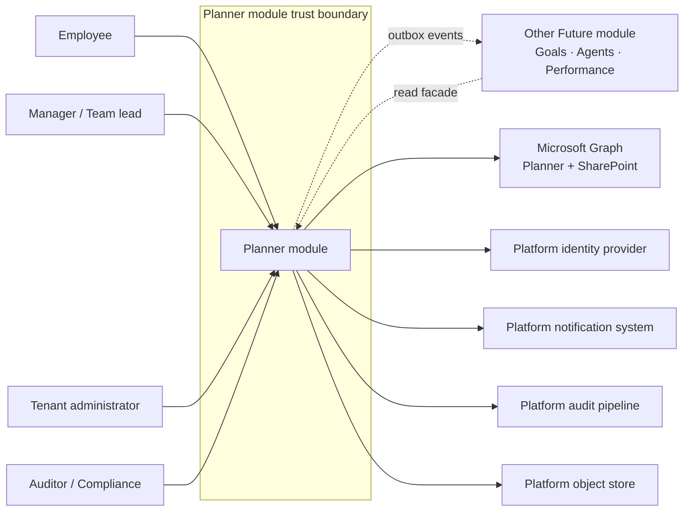

#### 2.2.3 Product features at a glance

| Capability area       | Phase 1 inclusion                                                                                               |
| --------------------- | --------------------------------------------------------------------------------------------------------------- |
| Plans, buckets, tasks | Full CRUD; reordering; movement across buckets and plans; soft delete with audit retention.                     |
| Tasks attributes      | Title, description, progress (3-state), priority (4-step), start/due dates (UTC), assignees, labels, checklist. |
| Attachments           | File (object storage) and link variants; one cover per task; two-phase upload.                                  |
| Comments              | Threaded; author or authorised member may delete.                                                               |
| Evidence              | File, link, or note; verification state independent of completion; verifiable separately from completion.       |
| Views                 | Board, Grid, Charts, Schedule; uniform filter and search across views.                                          |
| Personal hubs         | My Day, My Tasks, Personal Charts, Carry-Over.                                                                  |
| Microsoft 365 sync    | Three container types; bidirectional; last-write-wins; conflict log; force-resync; daily sync-health summary.   |
| Cross-module reads    | Three facade operations: list plans for actor; count open tasks for actor; get plan with authorisation.         |
| Outbox events         | Task assigned, task completed, evidence verified, sync conflict raised, sync conflict resolved.                 |
| Audit                 | One audit event per state-changing operation, transactionally co-emitted with the mutation.                     |
| Snapshots             | Daily per-task snapshot at 00:00 UTC; 90-day retention.                                                         |

#### 2.2.4 Operating environment

The Planner module shall operate within the following platform environment:

- **Cloud:** AWS, region `ap-southeast-1` (single region for Phase 1).
- **Hardware:** ARM64 (AWS Graviton) only.
- **Backend runtime:** NestJS modular monolith on Node, hosted on ECS Fargate.
- **Frontend runtime:** Next.js multi-zone deployment; the `web-planner` zone is independently deployed.
- **API protocol:** tRPC over HTTPS; invoked only from the `web-planner` zone over private networking.
- **Database:** PostgreSQL 16 with Drizzle ORM; schema-per-module; row-level security enforced.
- **Job queue:** pg-boss on the same PostgreSQL instance.
- **Object storage:** AWS S3.
- **Secrets:** AWS Secrets Manager.
- **Cache:** AWS ElastiCache (Redis).
- **External integration:** Microsoft Graph (Planner and SharePoint Drive item endpoints).
- **Observability:** OpenTelemetry-native instrumentation; vendor-neutral exporter.

The Planner module shall not assume any other operating environment.

#### 2.2.5 User classes and characteristics

| User class                  | Frequency of use | Subject-matter expertise       | Privilege level                                                       |
| --------------------------- | ---------------- | ------------------------------ | --------------------------------------------------------------------- |
| Employee                    | Daily            | Familiar with kanban and lists | Author and assignee of tasks within plans they are members of.        |
| Manager / Team lead         | Daily            | Comfortable with team planning | Plan owner privileges on plans they own; member privileges elsewhere. |
| Tenant administrator        | Weekly           | Operates the tenant            | Module-level configuration; sync configuration; conflict resolution.  |
| Auditor / Compliance        | Monthly          | Compliance and regulatory      | Read-only access to audit, conflict log, and evidence trails.         |
| Other module (programmatic) | Continuous       | n/a                            | Bound to the read facade and outbox subscriber roles only.            |

#### 2.2.6 Design and implementation constraints

The binding design and implementation constraints — tenant isolation at the data boundary, schema-per-module with no cross-schema foreign keys, cross-module communication restricted to the published facade and outbox events, no backward-compatibility shims, tRPC-only API entry, and the frontend-to-database prohibition — are normatively listed in §2.4.1 (`CON-PL-001` through `CON-PL-014`). They are summarised here only to flag that several arise from platform-wide engineering policy rather than from the Planner module's own design choices.

### 2.3 Assumptions and Dependencies

#### 2.3.1 Assumptions

The following assumptions are load-bearing for the requirements in §3. If any is invalidated, the affected requirements shall be re-evaluated.

| ID         | Assumption                                                                                                                                        |
| ---------- | ------------------------------------------------------------------------------------------------------------------------------------------------- |
| ASM-PL-001 | Tenants that enable Microsoft 365 sync hold administrative consent in their Microsoft 365 tenant for the scopes required by the integration.      |
| ASM-PL-002 | Microsoft Graph Planner endpoints remain stable through the Phase 1 window; no breaking schema or behavioural change occurs without prior notice. |
| ASM-PL-003 | The platform identity layer reliably maps SSO subject claims to Future actor records.                                                             |
| ASM-PL-004 | The platform outbox and event relay are operational before any cross-module consumer of Planner events is enabled.                                |
| ASM-PL-005 | The platform object store is available with the durability and access-control guarantees declared by the platform.                                |
| ASM-PL-006 | All servers and scheduled jobs operate against UTC as the canonical clock.                                                                        |
| ASM-PL-007 | The platform audit pipeline is available before Planner accepts production writes.                                                                |
| ASM-PL-008 | Each tenant's directory data (users, groups) is synchronised to Future by the identity layer before being referenced from a Planner record.       |
| ASM-PL-009 | Tenant administrators have the operational capacity to act on the daily sync-health summary within one business day.                              |

#### 2.3.2 Dependencies

| ID        | Dependency on               | Required capability                                                                                                  |
| --------- | --------------------------- | -------------------------------------------------------------------------------------------------------------------- |
| DEP-PL-01 | Identity module             | Tenant-aware SSO session establishment, subject-to-actor mapping, directory sync of users and groups.                |
| DEP-PL-02 | Kernel module (audit)       | Audit emission contract; transactional audit shells; tombstone-preserving GDPR pipeline.                             |
| DEP-PL-03 | Notifications module        | Delivery of assignment, completion, evidence, and sync-related messages on consumption of Planner outbox events.     |
| DEP-PL-04 | Admin module                | Per-tenant feature flags, evidence policy configuration, retention overrides, and Microsoft 365 connection settings. |
| DEP-PL-05 | Platform object store       | S3-compatible storage with signed-URL upload, signed-URL or proxied download, and lifecycle policies.                |
| DEP-PL-06 | Platform secrets store      | Online-rotated tenant secrets; short-lived token issuance; revocation notification.                                  |
| DEP-PL-07 | Microsoft 365 (per tenant)  | Active Microsoft 365 subscription including Planner; granted consent; reachable Microsoft Graph endpoints.           |
| DEP-PL-08 | Privacy compliance pipeline | Inclusion of the Planner schema in the platform-wide right-to-erasure pipeline.                                      |

### 2.4 Constraints

#### 2.4.1 Binding constraints (Phase 1)

| ID         | Constraint                                                                                                                                                                                                        |
| ---------- | ----------------------------------------------------------------------------------------------------------------------------------------------------------------------------------------------------------------- |
| CON-PL-001 | All tenant-scoped tables shall enforce tenant isolation by means of database-enforced row-level security; application-layer filtering shall not be the sole isolation mechanism.                                  |
| CON-PL-002 | The Planner schema shall not declare foreign-key constraints into any other module's schema; cross-schema references shall be plain identifier columns only.                                                      |
| CON-PL-003 | Cross-module synchronous interaction shall occur only through the Planner read facade and the personal-plan provisioning operation; cross-module asynchronous interaction shall occur only through outbox events. |
| CON-PL-004 | Backward-compatibility shims, deprecated aliases, and dual-shape interfaces shall not be introduced during the development phase; callers shall be updated in the same change.                                    |
| CON-PL-005 | The API service shall be exposed only via tRPC over private networking from the `web-planner` zone; no public REST endpoint shall be introduced for Planner.                                                      |
| CON-PL-006 | Frontend zones shall not connect to the database; all data access shall flow through the API service.                                                                                                             |
| CON-PL-007 | The system shall be deployed in a single AWS region (`ap-southeast-1`) for Phase 1; multi-region operation shall not be required.                                                                                 |
| CON-PL-008 | The compute fleet shall run on ARM64 (AWS Graviton); x86-only dependencies shall not be introduced.                                                                                                               |
| CON-PL-009 | Bidirectional sync shall be offered only with Microsoft 365 Planner. No other external task system shall be integrated in Phase 1.                                                                                |
| CON-PL-010 | No autonomous AI agent shall write directly into Planner state in Phase 1. Agent-driven mutations shall arrive only through future modules and only under their own delegation rules.                             |
| CON-PL-011 | The conflict-resolution policy shall be last-write-wins for Phase 1; per-field merge and review-first policies shall not be introduced in Phase 1.                                                                |
| CON-PL-012 | All system-internal timestamps shall be in UTC; user-visible timestamps shall be rendered in the user's timezone with a UTC backing value.                                                                        |
| CON-PL-013 | Migration files shall consolidate to a single `0000_initial.sql` during the development phase; numbered incremental migrations shall not be introduced until stable Beta.                                         |
| CON-PL-014 | All secrets shall be stored in AWS Secrets Manager; secrets shall not be stored in environment files, in the database, or hardcoded in source.                                                                    |

#### 2.4.2 Phase 1 launch profile (capacity envelope)

The system shall be sized for the following Phase 1 launch load profile. The design envelope (raisable per tenant) is declared in `NFR-PL-PERF-*`.

| Dimension                              | Phase 1 launch profile target                                                           |
| -------------------------------------- | --------------------------------------------------------------------------------------- |
| Active plans per tenant                | Hundreds                                                                                |
| Active tasks per tenant                | Tens of thousands                                                                       |
| Concurrent web sessions per tenant     | Up to 200                                                                               |
| Sustained writes per tenant per second | Tens; bursts up to hundreds                                                             |
| Sync poll cadence per linked plan      | Up to one poll per minute under steady state, widening adaptively under upstream stress |
| Per-tenant attachment volume           | Tens of gigabytes baseline; bounded by tenant-configured policy                         |

---

## 3. System Features and Requirements

This section enumerates the requirements the system shall satisfy. Each requirement is identifiable, atomic, testable, and traced to one or more user needs in Appendix D.

### 3.1 Functional Requirements

Functional requirements are grouped by feature area. Each requirement is stated using "shall" and is verifiable.

#### 3.1.1 Plans and structure

| ID        | Requirement                                                                                                                                                                                                                                                                                          |
| --------- | ---------------------------------------------------------------------------------------------------------------------------------------------------------------------------------------------------------------------------------------------------------------------------------------------------- |
| FR-PL-001 | The system shall support two plan ownership shapes: (a) **team plans**, created by an authorised tenant member; and (b) **personal plans**, automatically provisioned for every user upon account activation. A personal plan shall not be visible to any user other than its owner.                 |
| FR-PL-002 | The system shall associate each plan with exactly one **container type**, drawn from the enumeration `{future-only, ms-group, ms-roster}`. Team plans may be of any container type. Personal plans shall be `future-only` and shall not be linkable to a Microsoft container.                        |
| FR-PL-003 | The container type of a plan shall be fixed at the time of plan creation or first link and shall not be modifiable thereafter in Phase 1.                                                                                                                                                            |
| FR-PL-004 | A plan owner shall be able to rename a plan, soft-delete a plan, and manage its membership.                                                                                                                                                                                                          |
| FR-PL-005 | Plan membership shall be role-based with at minimum the roles `owner` and `member`. The `owner` role shall grant the ability to manage members, manage labels, manage buckets, and rename or delete the plan. The `member` role shall grant the ability to mutate tasks and content within the plan. |
| FR-PL-006 | A plan shall contain an ordered set of **buckets**. Authorised plan members shall be able to create, rename, reorder, and soft-delete buckets.                                                                                                                                                       |
| FR-PL-007 | A plan shall expose a fixed pool of **twenty-five (25)** label slots, each carrying a name and a colour. Authorised plan members shall be able to rename a slot and change a slot's colour. Slots shall not be added or removed.                                                                     |

#### 3.1.2 Tasks

| ID        | Requirement                                                                                                                                                                                                                                                                                                                                                      |
| --------- | ---------------------------------------------------------------------------------------------------------------------------------------------------------------------------------------------------------------------------------------------------------------------------------------------------------------------------------------------------------------- |
| FR-PL-008 | An authorised plan member shall be able to **create** a task within any bucket of any plan they are a member of.                                                                                                                                                                                                                                                 |
| FR-PL-054 | An authorised plan member shall be able to **update** the attributes of a task they may see within a plan they are a member of.                                                                                                                                                                                                                                  |
| FR-PL-055 | An authorised plan member shall be able to **soft-delete** a task. Soft-deletion shall set a `deleted_at` timestamp; the row shall remain in storage for audit reconstruction (see `DBR-PL-004`).                                                                                                                                                                |
| FR-PL-056 | An authorised plan member shall be able to **move a task between buckets within the same plan**. The new bucket position shall be specified at move time.                                                                                                                                                                                                        |
| FR-PL-057 | An authorised plan member shall be able to **move a task between plans**. The system shall re-check authorisation against **both** source and destination plans at move time; insufficient authority on either plan shall abort the move atomically.                                                                                                             |
| FR-PL-009 | A task shall carry a non-empty `title` of at most 255 characters and an optional plain-text `description` of at most 32,000 characters.                                                                                                                                                                                                                          |
| FR-PL-058 | A task shall carry a `progress` value drawn from the enumeration `{Not started, In progress, Completed}`. Transitions between values shall be unrestricted by the data model; `task.progress_changed` audit events shall record prior and new values.                                                                                                            |
| FR-PL-059 | A task shall carry a `priority` value drawn from the enumeration `{Low, Medium, High, Urgent}`.                                                                                                                                                                                                                                                                  |
| FR-PL-060 | A task shall carry an optional `start_date` and an optional `due_date`, both stored in UTC. When both are present, the system shall enforce the invariant `due_date ≥ start_date` at write time and shall reject violations with a deterministic, user-visible error.                                                                                            |
| FR-PL-010 | A task shall support zero or more **assignees**, each a Future user resolved through the platform identity directory.                                                                                                                                                                                                                                            |
| FR-PL-011 | A task shall support an ordered list of **checklist items**. An authorised actor shall be able to add, edit text, toggle complete, reorder, and remove a checklist item. A task shall accept up to twenty (20) checklist items, matching the Microsoft Planner limit; an attempt to exceed the limit shall be rejected with a deterministic, user-visible error. |
| FR-PL-012 | A task shall accept any subset of its plan's twenty-five label slots applied or removed by an authorised actor.                                                                                                                                                                                                                                                  |
| FR-PL-013 | A task shall support **attachments** of two kinds: a **file** stored in the platform object store, and a **link** as a URL with optional title. Exactly one attachment per task may be designated the **cover**; designating a new cover shall replace the previous cover designation atomically.                                                                |
| FR-PL-014 | The system shall enforce a per-tenant configurable **maximum file size** for individual attachment uploads. The configuration shall default to a platform-wide value at tenant onboarding and shall be raisable on request.                                                                                                                                      |
| FR-PL-061 | The system shall enforce a per-tenant configurable **storage quota** governing cumulative attachment and evidence storage across all plans of the tenant. Quota usage shall be observable to tenant administrators in real time.                                                                                                                                 |
| FR-PL-062 | When the per-tenant storage quota is fully consumed (`FR-PL-061`), the system shall refuse subsequent attachment and evidence uploads with a deterministic, user-visible error and shall raise an alert to the tenant administrator. Refusal shall not leave partial state in the object store.                                                                  |
| FR-PL-015 | A task shall support **threaded comments**. The author of a comment, or any actor with the `owner` role on the plan, shall be able to delete the comment. Other actors shall not.                                                                                                                                                                                |
| FR-PL-016 | A task shall support an ordered list of **evidence records**, distinct from ordinary attachments. Each evidence record shall be of kind `{file, link, note}` and shall carry an independent **verification state** drawn from `{unsubmitted, submitted, verified, rejected}`.                                                                                    |

#### 3.1.3 Personal hubs

| ID        | Requirement                                                                                                                                                                                                                                                                                                                          |
| --------- | ------------------------------------------------------------------------------------------------------------------------------------------------------------------------------------------------------------------------------------------------------------------------------------------------------------------------------------ |
| FR-PL-017 | The system shall provide each user with a **My Day** hub on which the user shall be able to pin one or more tasks for the current day. A pin shall reference exactly one task and exactly one target date.                                                                                                                           |
| FR-PL-018 | The system shall, by means of a daily scheduled job, remove any My Day pin whose underlying task has been hard-deleted, archived, or is no longer visible to the pinning user. The sweep shall be idempotent and shall tolerate repeated execution within the same window.                                                           |
| FR-PL-019 | The system shall, at the start of each day in the user's timezone, present unfinished pins from the previous day as a **Carry-Over** list. The user shall be able to roll a Carry-Over item forward to the current day with a single action.                                                                                         |
| FR-PL-020 | The system shall provide each user with a **My Tasks** hub listing every open task assigned to that user across every plan visible to that user.                                                                                                                                                                                     |
| FR-PL-021 | The system shall provide each user with a **Personal Charts** hub presenting the user's progress, completion rate, and trends, computed from the user's assigned and owned tasks across visible plans.                                                                                                                               |
| FR-PL-022 | The system shall ensure a personal plan exists for every activated user. The provisioning operation shall be invoked by the identity layer at user activation; if not yet present at first login, the operation shall also be invoked at first login as a safety net. The operation shall be idempotent under concurrent invocation. |

#### 3.1.4 Views and navigation

| ID        | Requirement                                                                                                                                                                                                                                                 |
| --------- | ----------------------------------------------------------------------------------------------------------------------------------------------------------------------------------------------------------------------------------------------------------- |
| FR-PL-023 | The system shall offer four view modes for every plan: **Board** (kanban by bucket), **Grid** (sortable, filterable table of tasks), **Charts** (aggregate visualisation by bucket, assignee, progress, and priority), and **Schedule** (timeline by date). |
| FR-PL-024 | The system shall apply a **single filter and search bar** uniformly across all four view modes of a plan. A filter set entered in one view shall apply when the user switches to another view of the same plan within the same session.                     |
| FR-PL-025 | The system shall provide a **direct task URL** that resolves to a task detail surface accessible without first loading the parent plan view, subject to the calling user's authorisation on the parent plan.                                                |
| FR-PL-026 | When an unauthorised user follows a direct task URL, the system shall return a `403`-equivalent response and shall not disclose the existence of the task.                                                                                                  |

#### 3.1.5 Microsoft 365 Planner synchronisation

| ID        | Requirement                                                                                                                                                                                                                                                                                                                                                                                                                                                                                                                 |
| --------- | --------------------------------------------------------------------------------------------------------------------------------------------------------------------------------------------------------------------------------------------------------------------------------------------------------------------------------------------------------------------------------------------------------------------------------------------------------------------------------------------------------------------------- |
| FR-PL-027 | A tenant administrator shall be able to **connect** the tenant to Microsoft 365 by completing an OAuth 2.0 client-credentials authorisation flow once per tenant. The system shall record the connection, the granted scopes, and the consent timestamp.                                                                                                                                                                                                                                                                    |
| FR-PL-028 | After connection, an authorised actor shall be able to **link** a team plan to either an existing Microsoft 365 Group (`ms-group`) or a Future-minted roster (`ms-roster`). The plan's container type shall be set to the linked kind at the moment of link.                                                                                                                                                                                                                                                                |
| FR-PL-029 | For each linked plan, the system shall **pull** remote changes from Microsoft 365 Planner on an adaptive cadence and shall reconcile pulled changes with local state. The pull cycle shall import tasks, comments, and attachments according to the field map in Appendix B.                                                                                                                                                                                                                                                |
| FR-PL-030 | For each linked plan, the system shall **push** local changes outbound to Microsoft 365 on the next push cycle following the local commit. The push pipeline shall use idempotency keys derived from the domain entity identifier and version, such that retries do not produce duplicate or thrashing edits.                                                                                                                                                                                                               |
| FR-PL-031 | When a divergent edit is detected between local state and Microsoft state on the same field of the same task, the system shall resolve the conflict by **last-write-wins** based on version comparison. The losing snapshot shall be preserved in the **conflict log** in full, and the resolution shall be recorded with both before-states.                                                                                                                                                                               |
| FR-PL-032 | A tenant administrator shall be able to **view the conflict log** filtered by plan, by task, and by date range, with paging.                                                                                                                                                                                                                                                                                                                                                                                                |
| FR-PL-063 | A tenant administrator shall be able to **accept the auto-resolved outcome** of an open conflict, marking the conflict closed. The resolution choice shall be recorded in the audit trail and emitted as `ms_sync.conflict_resolved`.                                                                                                                                                                                                                                                                                       |
| FR-PL-064 | A tenant administrator shall be able to **override the auto-resolved outcome** by accepting the losing side. The system shall apply the losing snapshot to the local task, mark the conflict closed, and emit `ms_sync.conflict_resolved` with the chosen side recorded.                                                                                                                                                                                                                                                    |
| FR-PL-065 | A tenant administrator shall be able to **force-resync a single task**. The operation shall clear any open conflict on the task, repull the authoritative state from Microsoft, and re-apply any in-flight Future-side mutation behind the repull.                                                                                                                                                                                                                                                                          |
| FR-PL-066 | A tenant administrator shall be able to **retry pending-attachment uploads** that failed to finalise into the object store. The retry shall be bounded by attempt count; exhaustion of the bound shall surface to the administrator as a permanent failure.                                                                                                                                                                                                                                                                 |
| FR-PL-067 | A tenant administrator shall be able to **resolve pending assignment lookups** for which the directory subject was not found at sync time. Resolution shall accept either a corrected subject mapping or a deliberate skip; the operation shall update the affected task's assignees and emit the corresponding audit events.                                                                                                                                                                                               |
| FR-PL-033 | The system shall map roster members from their SSO subject claim to a roster row keyed by `(tenant, roster, subject)`. The mapping shall survive directory mutations to display name and email.                                                                                                                                                                                                                                                                                                                             |
| FR-PL-034 | When a plan is linked for the first time to a Microsoft 365 Group or roster, the system shall **backfill** existing tasks from Microsoft into the Future plan as a one-shot job. Backfill shall be checkpointed, resumable, and shall not block steady-state sync of other plans.                                                                                                                                                                                                                                           |
| FR-PL-035 | The system shall deliver a **daily sync-health summary** to each tenant administrator at a tenant-configurable time. The summary shall report, per linked plan: successful pull cycles, retried items, conflicts (raised and resolved), unresolved assignment lookups, and time since last successful pull.                                                                                                                                                                                                                 |
| FR-PL-036 | When the Microsoft Graph credentials for a tenant are revoked or refused, the system shall **pause** sync for that tenant within one cycle, raise an admin alert, and shall not retry until the administrator restores valid credentials. Pull state and pending push intents shall survive the pause.                                                                                                                                                                                                                      |
| FR-PL-037 | When the Microsoft 365 Group backing an `ms-group` plan is deleted upstream, the system shall transition the plan to `future-only`, record the transition in the audit trail, and surface the transition in the plan's settings surface. No tasks shall be silently lost as a result of the upstream deletion.                                                                                                                                                                                                              |
| FR-PL-038 | The first sync cycle following a new tenant connection shall execute in **dry-preview mode**: the system shall enumerate the changes it would write to Microsoft and shall not write any change until the administrator explicitly accepts the preview.                                                                                                                                                                                                                                                                     |
| FR-PL-053 | When the pull worker receives a task carrying a Microsoft Planner recurrence schedule, the system shall preserve the recurrence schedule on the local task as an opaque, immutable field and shall round-trip it to Microsoft on push without local modification. Phase 1 shall not allow Future-side users to create or edit a recurrence schedule; recurrence shall remain editable only through Microsoft 365 Planner. The system shall not instantiate local copies of every individual occurrence of a recurring task. |

##### 3.1.5.1 Microsoft 365 connection state

The following state machine governs the Microsoft 365 sync connection per tenant.

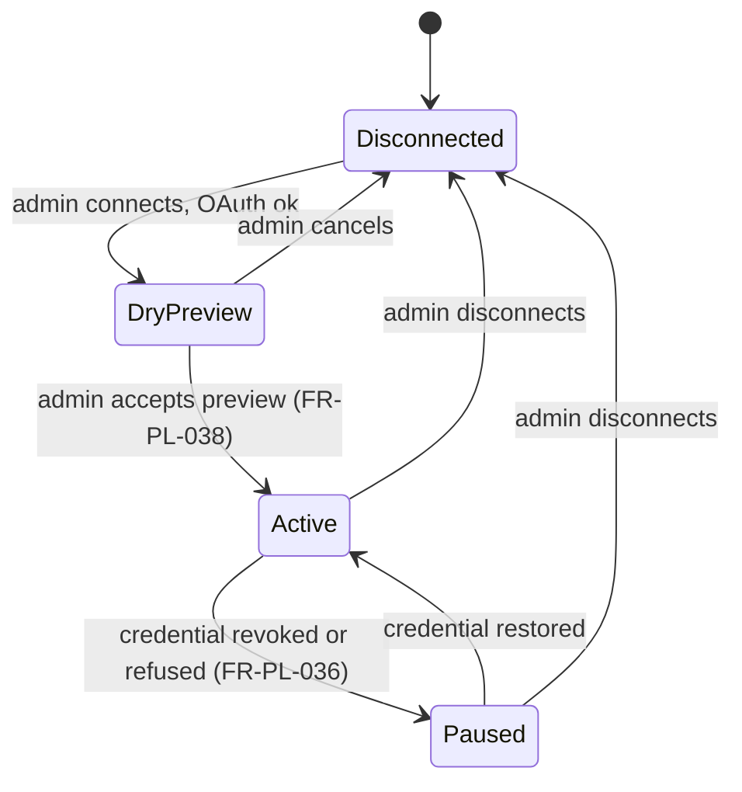

##### 3.1.5.2 Sync conflict lifecycle

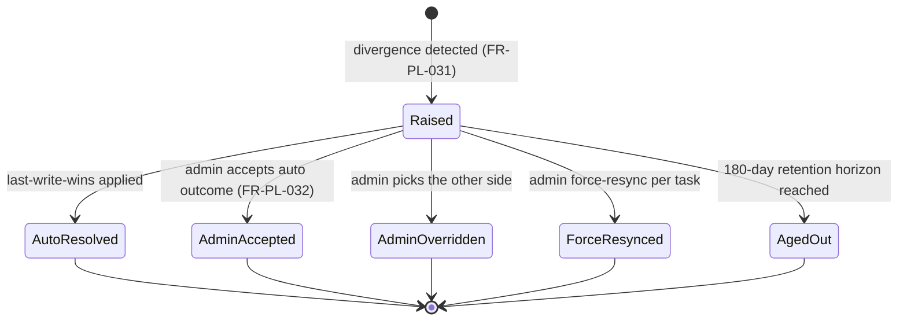

##### 3.1.5.3 Pull cycle (interaction)

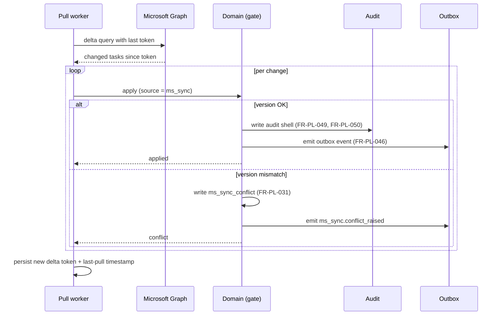

##### 3.1.5.4 Push cycle (interaction)

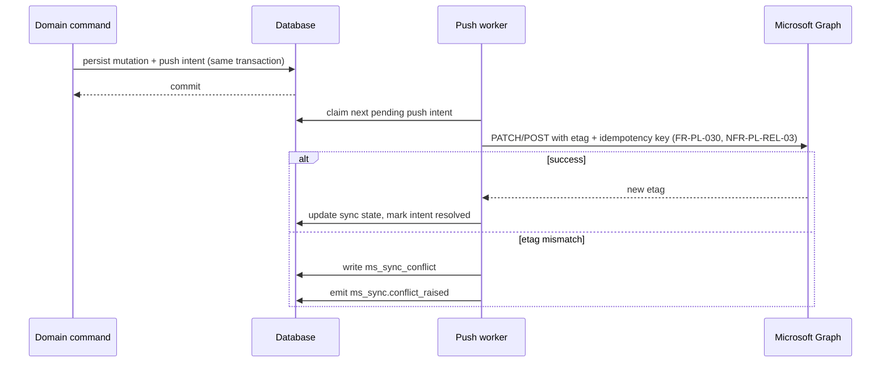

#### 3.1.6 Evidence and snapshots

| ID        | Requirement                                                                                                                                                                                                                                                             |
| --------- | ----------------------------------------------------------------------------------------------------------------------------------------------------------------------------------------------------------------------------------------------------------------------- |
| FR-PL-039 | The system shall treat evidence verification state as **independent of task completion state**. A task may be marked complete without any verified evidence; evidence may be verified on a task that is not yet complete.                                               |
| FR-PL-040 | An authorised actor (`owner` of the plan or an actor explicitly granted the verification right by tenant policy) shall be able to mark an evidence record as `verified` or `rejected`, with an optional comment. The verifier identity and timestamp shall be recorded. |
| FR-PL-041 | The system shall capture a **daily task snapshot** at 00:00 UTC for every active task. Snapshots shall be the source for trend visualisations and for historical reconstruction.                                                                                        |
| FR-PL-042 | The system shall retain task snapshots for ninety (90) days. Older snapshots shall be pruned by a retention worker.                                                                                                                                                     |
| FR-PL-043 | Evidence records shall be retained according to the tenant's configured data-retention policy. Until a retention boundary is crossed, the system shall not delete evidence records other than through user-initiated deletion or the GDPR right-to-erasure pipeline.    |

##### 3.1.6.1 Evidence verification state

The verification state of an evidence record is independent of the parent task's progress.

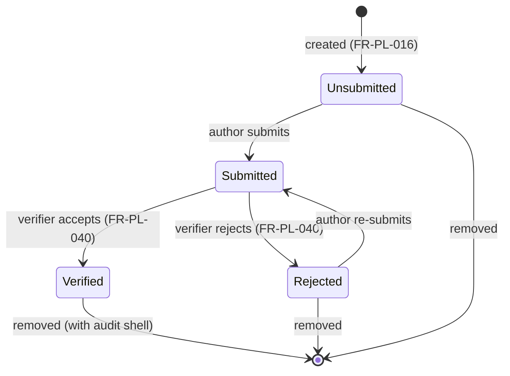

##### 3.1.6.2 Task progress state

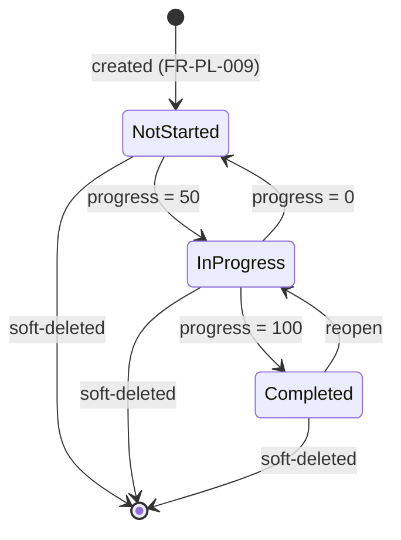

#### 3.1.7 Cross-module integration

| ID        | Requirement                                                                                                                                                                                                                                                                                                                           |
| --------- | ------------------------------------------------------------------------------------------------------------------------------------------------------------------------------------------------------------------------------------------------------------------------------------------------------------------------------------- |
| FR-PL-044 | The system shall expose a **read facade** to other Future modules supporting at minimum the operations: (a) **list-plans-for-actor** within a tenant, with authorisation applied; (b) **count-open-tasks-for-actor** within a tenant; (c) **get-plan-with-authorisation** that returns a plan only if the calling actor is permitted. |
| FR-PL-045 | The system shall expose a **personal-plan provisioning operation** for the identity layer to invoke when a user is activated. The operation shall be idempotent and shall be the only externally callable write surface of the module.                                                                                                |
| FR-PL-046 | The system shall publish **outbox events** for, at minimum, `task.assigned`, `task.completed`, `evidence.verified`, `ms_sync.conflict_raised`, and `ms_sync.conflict_resolved`. Each event shall be written transactionally with the underlying mutation. The full event catalogue is recorded in Appendix B.                         |
| FR-PL-047 | Outbox events shall carry a **stable idempotency key**. Consuming modules shall be able to deduplicate replays on the key.                                                                                                                                                                                                            |
| FR-PL-048 | The system shall not expose any other synchronous write surface to other modules; cross-module write semantics shall be expressed only by other modules consuming the outbox events of this module.                                                                                                                                   |

##### 3.1.7.1 Cross-module read (interaction)

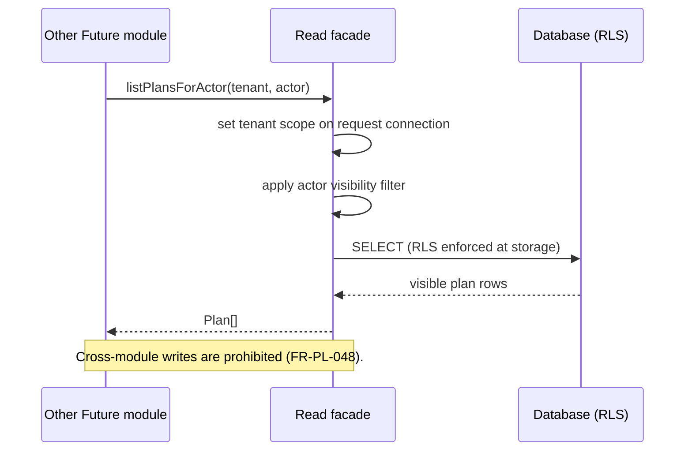

#### 3.1.8 Audit and reconstruction

| ID        | Requirement                                                                                                                                                                                                                                                                                       |
| --------- | ------------------------------------------------------------------------------------------------------------------------------------------------------------------------------------------------------------------------------------------------------------------------------------------------- |
| FR-PL-049 | The system shall emit a kernel **audit event** for every state-changing operation. The event shall carry: tenant, actor, source (`user`, `ms_sync`, `system`), correlation identifier, plan and task references where applicable, operation name, before-state, after-state, and timestamp (UTC). |
| FR-PL-050 | Audit events shall be written **transactionally** with the underlying mutation. An audit shell shall exist if and only if the corresponding mutation is committed.                                                                                                                                |
| FR-PL-051 | Audit and conflict-log records shall be **append-only** at the application layer. Corrections shall be recorded as compensating entries and shall not modify or delete existing records.                                                                                                          |
| FR-PL-052 | The system shall support reconstruction of "who changed what when" for any plan or task by indexed query on the audit table; the dimensions tenant, actor, plan, and task shall be indexed.                                                                                                       |

### 3.2 User Interfaces

This section states **what** the user-facing surfaces shall do. The visual realisation (typography, colour palette, spacing, motion) is realised by the platform design system referenced as a binding internal capability of the Future platform. Wireframes are intentionally omitted in favour of a normative text specification.

#### 3.2.1 General UI requirements

| ID        | Requirement                                                                                                                                                                                                                                                                                                                                            |
| --------- | ------------------------------------------------------------------------------------------------------------------------------------------------------------------------------------------------------------------------------------------------------------------------------------------------------------------------------------------------------ |
| UI-PL-001 | The Planner web zone shall be served as an independent Next.js zone (`web-planner`) and shall function correctly in the latest two stable versions of Chromium-based browsers, Firefox, and Safari. Internet Explorer is not supported.                                                                                                                |
| UI-PL-002 | The application shall comply with the platform design system for typography, colour, spacing, radii, and motion. Interactive elements (buttons, inputs, textareas, alerts, skeletons, icons) shall be drawn from the platform design-system component library; raw HTML interactive elements shall not be used in place of a design-system equivalent. |
| UI-PL-003 | All interactive controls shall meet WCAG 2.1 Level AA for contrast, keyboard operability, and screen-reader semantics, including the kanban drag-and-drop, the schedule timeline, and the chart surfaces.                                                                                                                                              |
| UI-PL-004 | All user-visible text shall be rendered through a localisation layer (see §4.3); no string shall be hardcoded outside the localisation catalogue.                                                                                                                                                                                                      |
| UI-PL-005 | All user-visible date and time values shall be displayed in the user's configured timezone, with the underlying UTC value preserved for transmission and storage.                                                                                                                                                                                      |
| UI-PL-006 | The application shall not read browser-only APIs (`window`, `localStorage`, `sessionStorage`) inside server-rendered initial state. URL state shall be obtained via the framework's URL primitives; client-only storage shall be read via a subscribe-style hook with a server-safe default snapshot.                                                  |
| UI-PL-007 | The application sidebar shall be owned by the platform application-shell layer and shall contribute the four Personal Hubs (My Day, My Tasks, Personal Charts, Carry-Over) as a dynamic group. The Planner web surface shall not implement a sidebar that duplicates or competes with the platform shell.                                              |
| UI-PL-008 | All optimistic-update UI state shall reconcile against authoritative server state on response; any reconciliation conflict shall be resolved in favour of the server state with a non-disruptive notification to the user.                                                                                                                             |
| UI-PL-009 | All forms with destructive consequences (deleting a plan, deleting a task, removing a member, disconnecting Microsoft 365) shall require explicit confirmation, including a typed-name confirmation for destructive operations on plans.                                                                                                               |
| UI-PL-010 | Pending operations longer than 250 ms shall expose a non-blocking progress indicator; longer than two seconds shall additionally surface a cancel affordance where cancellation is meaningful.                                                                                                                                                         |

#### 3.2.2 Plan views

| ID        | Requirement                                                                                                                                                                                                                                                                                                                                                                            |
| --------- | -------------------------------------------------------------------------------------------------------------------------------------------------------------------------------------------------------------------------------------------------------------------------------------------------------------------------------------------------------------------------------------- |
| UI-PL-011 | **Board view** shall present buckets as horizontally arranged columns, with task cards stacked vertically in display order. The user shall be able to reorder cards within a bucket and move cards between buckets via keyboard, pointer, or assistive technology.                                                                                                                     |
| UI-PL-012 | **Grid view** shall present tasks as rows in a sortable, filterable table with at minimum the columns: title, bucket, assignees, progress, priority, due date, labels. Column visibility shall be configurable per user per plan.                                                                                                                                                      |
| UI-PL-013 | **Charts view** shall present at minimum: tasks-by-bucket, tasks-by-assignee, tasks-by-progress, and tasks-by-priority, computed from the current filter set, with a control to switch between bar and donut representations where applicable.                                                                                                                                         |
| UI-PL-014 | **Schedule view** shall present tasks on a horizontal time axis using start and due dates, with a configurable scale of day, week, or month. Tasks without dates shall be listed in an undated lane. The Schedule view at Phase 1 is timeline-by-date and is **not** a Gantt chart: dependency arcs, milestone diamonds, and critical-path highlighting are out of scope (see §1.5.2). |
| UI-PL-015 | The same filter and search bar shall be visible above all four views and shall persist its state across view switches within the session.                                                                                                                                                                                                                                              |

#### 3.2.3 Task detail surface

| ID        | Requirement                                                                                                                                                                                                                                                            |
| --------- | ---------------------------------------------------------------------------------------------------------------------------------------------------------------------------------------------------------------------------------------------------------------------- |
| UI-PL-016 | The task detail surface shall be reachable both as a side panel within a plan view and as a full-page route via the direct task URL (FR-PL-025). Both presentations shall expose the same edit affordances.                                                            |
| UI-PL-017 | The task detail surface shall expose, in distinct sections: title and description; status (progress, priority, dates, assignees, labels); checklist; attachments; comments; and evidence. The evidence section shall be visually distinct from the attachment section. |
| UI-PL-018 | The task detail surface shall display the most recent five audit entries for the task to authorised viewers, with a control to reach the full history.                                                                                                                 |

#### 3.2.4 Personal hubs

| ID        | Requirement                                                                                                                                                                                                   |
| --------- | ------------------------------------------------------------------------------------------------------------------------------------------------------------------------------------------------------------- |
| UI-PL-019 | The **My Day** hub shall display today's pinned tasks at the top, with a visually distinguished Carry-Over section underneath listing yesterday's incomplete pins, each with a one-click roll-forward action. |
| UI-PL-020 | The **My Tasks** hub shall list every open task assigned to the user, grouped by plan, with a per-row indicator of due-date proximity (overdue, today, this week, later).                                     |
| UI-PL-021 | The **Personal Charts** hub shall present the user's completion rate over the last seven, thirty, and ninety days, and the user's open task count by priority and by plan.                                    |
| UI-PL-022 | A user shall not see another user's personal hub; the Personal Charts hub of a different user shall not be reachable in any way.                                                                              |

#### 3.2.5 Administrative surface

| ID        | Requirement                                                                                                                                                                                                                                                                                                                                                                          |
| --------- | ------------------------------------------------------------------------------------------------------------------------------------------------------------------------------------------------------------------------------------------------------------------------------------------------------------------------------------------------------------------------------------ |
| UI-PL-023 | The administrative surface shall expose, to tenant administrators only, the operations: connect/disconnect Microsoft 365; configure the daily sync-health summary recipient and time; view and resolve conflicts (accept either side, force-resync); manage retention overrides; configure the per-tenant attachment quota and maximum file size; trigger backfill state inspection. |
| UI-PL-024 | The administrative surface shall present the **conflict log** with, at minimum, the columns: plan, task, conflicted field set, winning side, resolver, resolution timestamp, and a link to both before-states. A field-level diff visualiser shall render the differences between the winning and losing snapshots side by side.                                                     |
| UI-PL-025 | The administrative surface shall not expose any user's personal-plan content; only the audit timeline of personal-plan operations shall be visible to tenant administrators.                                                                                                                                                                                                         |

### 3.3 External Interface Requirements

This section captures the system's interfaces with users, with other software, and with hardware/communications. The IDs are prefixed `EIR-PL-`.

#### 3.3.1 User interfaces

The user interface requirements are stated in §3.2.

#### 3.3.2 Hardware interfaces

| ID         | Requirement                                                                                                                                                                                               |
| ---------- | --------------------------------------------------------------------------------------------------------------------------------------------------------------------------------------------------------- |
| EIR-PL-001 | The system shall not require any client-side hardware beyond a desktop or laptop computer with a current evergreen browser. Mobile and tablet form factors shall render but are not optimised in Phase 1. |

#### 3.3.3 Software interfaces

##### Internal: tRPC API surface

| ID         | Requirement                                                                                                                                                                                                                                                  |
| ---------- | ------------------------------------------------------------------------------------------------------------------------------------------------------------------------------------------------------------------------------------------------------------ |
| EIR-PL-002 | The system shall expose all client-facing operations as tRPC procedures grouped under the routers: `plan`, `bucket`, `task`, `checklist`, `attachment`, `comment`, `evidence`, `personalHub`, `msSync`. Each procedure shall declare typed input and output. |
| EIR-PL-003 | All tRPC procedures shall require an authenticated session and shall reject anonymous calls.                                                                                                                                                                 |
| EIR-PL-004 | All tRPC inputs shall be validated against a Zod-equivalent schema before execution. Validation failures shall produce a deterministic, user-visible error code and shall not reach the domain layer.                                                        |

##### Internal: Read facade and provisioning

| ID         | Requirement                                                                                                                                                                                                                                                        |
| ---------- | ------------------------------------------------------------------------------------------------------------------------------------------------------------------------------------------------------------------------------------------------------------------ |
| EIR-PL-005 | The read facade shall expose: `listPlansForActor(tenant, actor): Plan[]`; `countOpenTasksForActor(tenant, actor): number`; `getPlanWithAuthorisation(tenant, actor, planId): Plan \| null`. All three shall be synchronous and shall apply tenant and actor scope. |
| EIR-PL-006 | The personal-plan provisioning facade shall expose: `ensurePersonalPlanExists(tenant, actor): PlanId`. The operation shall be idempotent and safe under concurrent invocation for the same actor.                                                                  |

##### Internal: Outbox events

| ID         | Requirement                                                                                                                                                                                                                    |
| ---------- | ------------------------------------------------------------------------------------------------------------------------------------------------------------------------------------------------------------------------------ |
| EIR-PL-007 | Outbox events shall be written to the platform-shared outbox table in the same transaction as the domain mutation. The event payload shall comply with the platform-wide event-contract schema for cross-module domain events. |
| EIR-PL-008 | Each outbox event shall carry: event type, idempotency key, tenant, actor, correlation identifier, occurrence timestamp (UTC), and a typed payload specific to the event type (see Appendix B).                                |

##### External: Microsoft Graph

| ID         | Requirement                                                                                                                                                                                                                                                                                             |
| ---------- | ------------------------------------------------------------------------------------------------------------------------------------------------------------------------------------------------------------------------------------------------------------------------------------------------------- |
| EIR-PL-009 | The system shall integrate with **Microsoft Graph Planner** endpoints for tasks, buckets, plan, plan details, and assignments; with **Microsoft Graph SharePoint Drive** endpoints for attachment storage; and with **Microsoft Identity Platform** for OAuth 2.0 client-credentials token acquisition. |
| EIR-PL-010 | The system shall honour the `Retry-After` header when present and shall apply exponential backoff with jitter on rate-limit and 5xx responses, capped at a documented upper bound, before resuming.                                                                                                     |
| EIR-PL-011 | The system shall attach a deterministic idempotency key to every PATCH and POST issued against Microsoft Graph for a Planner resource. The key shall be derived from `(tenant, entity_id, version)`.                                                                                                    |
| EIR-PL-012 | The system shall use the Microsoft Graph **delta query** mechanism for change detection where supported by the Planner endpoint; webhook-only change detection shall not be used in Phase 1.                                                                                                            |
| EIR-PL-013 | The mapping between Future task fields and Microsoft Planner task fields shall conform to the field map in Appendix B and shall not silently drop, coerce, or transform values outside the declared rules.                                                                                              |

##### External: Platform identity

| ID         | Requirement                                                                                                                                                                                                 |
| ---------- | ----------------------------------------------------------------------------------------------------------------------------------------------------------------------------------------------------------- |
| EIR-PL-014 | The system shall consume the platform identity directory for actor resolution by SSO subject claim. The system shall not maintain its own user directory and shall not authenticate users itself.           |
| EIR-PL-015 | The system shall fail closed if the identity directory is unavailable for a request: the request shall be rejected with an authentication error rather than served against stale or partial directory data. |

##### External: Platform notifications

| ID         | Requirement                                                                                                                                       |
| ---------- | ------------------------------------------------------------------------------------------------------------------------------------------------- |
| EIR-PL-016 | The system shall emit notification intent only through outbox events; it shall not call any external chat, email, or messaging provider directly. |

##### External: Object storage

| ID         | Requirement                                                                                                                                                                                                                                                                                                                       |
| ---------- | --------------------------------------------------------------------------------------------------------------------------------------------------------------------------------------------------------------------------------------------------------------------------------------------------------------------------------- |
| EIR-PL-017 | The system shall store attachment and evidence file content in the platform object store under a tenant-scoped key prefix. Direct anonymous access to the bucket shall not be permitted.                                                                                                                                          |
| EIR-PL-018 | Uploads shall use a two-phase pattern: (i) the API issues a signed URL bound to a specific object key after authorisation succeeds; (ii) the client uploads to the object store directly using that URL; (iii) the client invokes a finalise call on the API, which shall record the attachment and emit audit and outbox events. |
| EIR-PL-019 | Downloads shall be **proxied through the API**, which shall verify the caller's authorisation against the parent task before streaming the content. Direct signed-URL download to anonymous clients shall not be enabled.                                                                                                         |

##### 3.3.3.1 Two-phase upload (interaction)

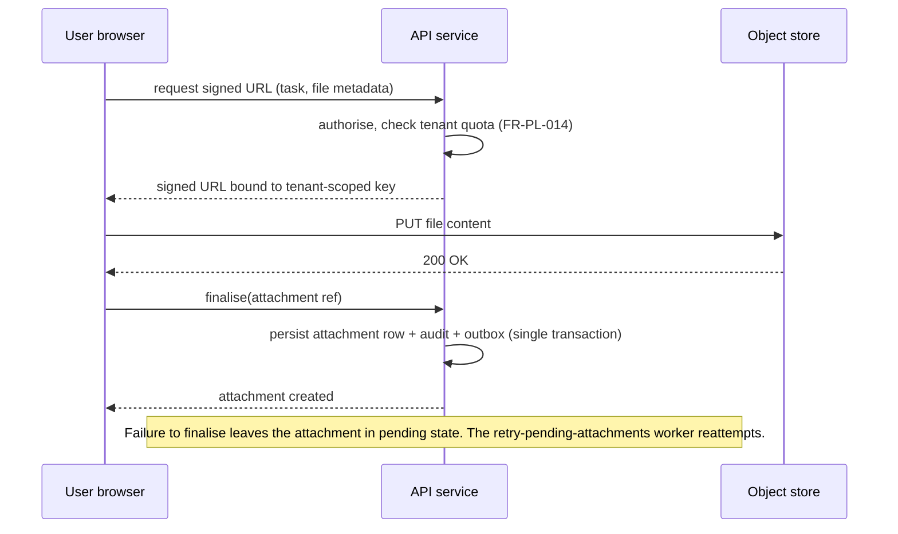

#### 3.3.4 Communications interfaces

| ID         | Requirement                                                                                                                                                             |
| ---------- | ----------------------------------------------------------------------------------------------------------------------------------------------------------------------- |
| EIR-PL-020 | All HTTP(S) traffic between the user agent and the Planner web zone shall be encrypted in transit using TLS 1.2 or higher.                                              |
| EIR-PL-021 | All HTTP(S) traffic between Future internal services shall traverse private networking; no Future inter-service call shall depend on the public internet for transport. |
| EIR-PL-022 | All outbound traffic to Microsoft Graph shall be encrypted in transit using TLS 1.2 or higher.                                                                          |

### 3.4 Non-Functional Requirements

Each non-functional requirement is stated as a measurable threshold and is verifiable.

#### 3.4.1 Performance

| ID             | Requirement                                                                                                                                                                                                                                                                                                                                                                                                                                                                                                                                                                                                               | Verification                |
| -------------- | ------------------------------------------------------------------------------------------------------------------------------------------------------------------------------------------------------------------------------------------------------------------------------------------------------------------------------------------------------------------------------------------------------------------------------------------------------------------------------------------------------------------------------------------------------------------------------------------------------------------------- | --------------------------- |
| NFR-PL-PERF-01 | Single-plan task list query (Board view) shall complete with p95 latency at or below **400 ms** under the Phase 1 launch profile.                                                                                                                                                                                                                                                                                                                                                                                                                                                                                         | Load test.                  |
| NFR-PL-PERF-02 | Task detail load shall complete with p95 latency at or below **600 ms**.                                                                                                                                                                                                                                                                                                                                                                                                                                                                                                                                                  | Load test.                  |
| NFR-PL-PERF-03 | My Day hub load shall complete with p95 latency at or below **500 ms**.                                                                                                                                                                                                                                                                                                                                                                                                                                                                                                                                                   | Load test.                  |
| NFR-PL-PERF-04 | My Tasks list shall complete with p95 latency at or below **1.0 s** for users with up to **500 assigned open tasks**. The 500-task envelope is the per-user upper bound for which Phase 1 latency is guaranteed; users exceeding it fall outside the Phase 1 latency contract until raised by an explicit per-tenant exception.                                                                                                                                                                                                                                                                                           | Load test.                  |
| NFR-PL-PERF-05 | First interactive frame on the Board view with warm cache shall occur at or below **1.5 s**.                                                                                                                                                                                                                                                                                                                                                                                                                                                                                                                              | Synthetic measurement.      |
| NFR-PL-PERF-06 | Sync **pull** cycle for a linked plan under steady state shall complete with p95 freshness at or below **5 minutes**.                                                                                                                                                                                                                                                                                                                                                                                                                                                                                                     | Production telemetry.       |
| NFR-PL-PERF-07 | Sync **push** cycle, from local commit to Microsoft Graph enqueue, shall complete with p95 latency at or below **30 seconds**.                                                                                                                                                                                                                                                                                                                                                                                                                                                                                            | Production telemetry.       |
| NFR-PL-PERF-08 | The system shall sustain **50 writes per second per tenant** in steady state and bursts of up to several hundred per second without queue collapse.                                                                                                                                                                                                                                                                                                                                                                                                                                                                       | Load test.                  |
| NFR-PL-PERF-09 | The **design envelope** of the system shall support, per tenant: **10,000 active plans**, **1,000,000 active tasks**, and **100,000 evidence items**. Phase 1 launch profile (§2.4.2) is a strict subset of this envelope.                                                                                                                                                                                                                                                                                                                                                                                                | Capacity analysis.          |
| NFR-PL-PERF-10 | The system shall support **200 concurrent web sessions per tenant** with no measurable degradation against the latency thresholds above.                                                                                                                                                                                                                                                                                                                                                                                                                                                                                  | Load test.                  |
| NFR-PL-PERF-11 | For plans of container type `ms-group` or `ms-roster`, the system shall enforce a per-plan task ceiling that does not exceed the upstream Microsoft Planner limit applicable to the tenant's Microsoft Planner tier. The ceiling value shall be configurable per linked plan and shall be sourced from current Microsoft documentation at tenant onboarding and on tier change. On approach to the ceiling (≥ 90% utilisation), plan owners shall be warned in-product. On reaching the ceiling, further task creation in the affected plan shall be refused with a deterministic, user-visible error and an admin alert. | Test; production telemetry. |

#### 3.4.2 Security and Privacy

| ID            | Requirement                                                                                                                                                                                                     | Verification                                        |
| ------------- | --------------------------------------------------------------------------------------------------------------------------------------------------------------------------------------------------------------- | --------------------------------------------------- |
| NFR-PL-SEC-01 | Tenant isolation shall be enforced by row-level security on every tenant-scoped table. Application-layer filtering shall be a secondary defence only.                                                           | Synthetic dual-tenant canary; build-time assertion. |
| NFR-PL-SEC-02 | A request shall be served against exactly one tenant; the tenant identifier and actor identifier shall be set by middleware on the request-scoped database connection.                                          | Code inspection; integration test.                  |
| NFR-PL-SEC-03 | No service account, system user, or worker shall bypass authorisation in any user-initiated call chain. The only mutation source flagged as `system` is the sync worker, which records `ms_sync` as its source. | Code inspection; audit-log review.                  |
| NFR-PL-SEC-04 | Microsoft 365 client secrets shall be stored only in AWS Secrets Manager. Access tokens shall be short-lived (≤ 1 hour) and shall not be persisted at rest.                                                     | Configuration inspection.                           |
| NFR-PL-SEC-05 | Object storage downloads shall be authorised at the API layer for every request; direct anonymous bucket access shall not be permitted.                                                                         | Bucket policy inspection.                           |
| NFR-PL-SEC-06 | All inputs to the API shall be validated; payloads shall not be deserialised into domain entities prior to validation.                                                                                          | Code inspection.                                    |
| NFR-PL-SEC-07 | The system shall be free of all OWASP Top 10 (current edition) vulnerabilities at launch, as verified by the platform's security review and dependency scan pipeline.                                           | Security review report.                             |
| NFR-PL-SEC-08 | Secret rotation shall not require a service redeploy; the token acquirer shall handle online rotation transparently.                                                                                            | Operational test.                                   |
| NFR-PL-SEC-09 | Direct task URLs shall not disclose existence of unauthorised tasks; an unauthorised follow shall return a generic `403`-equivalent response.                                                                   | Test case in QA suite.                              |
| NFR-PL-SEC-10 | Cross-tenant leak canaries shall run continuously in production; any breach shall trip the platform-wide kill-switch and engage the CTO regardless of business hours.                                           | Continuous canary.                                  |

#### 3.4.3 Usability

| ID            | Requirement                                                                                                                                                                                                                                                         | Verification             |
| ------------- | ------------------------------------------------------------------------------------------------------------------------------------------------------------------------------------------------------------------------------------------------------------------- | ------------------------ |
| NFR-PL-USE-01 | The system shall comply with WCAG 2.1 Level AA across all user-facing surfaces, including kanban drag-and-drop, the schedule timeline, and the chart surfaces.                                                                                                      | Accessibility audit.     |
| NFR-PL-USE-02 | All destructive operations shall require explicit user confirmation and shall be reversible by undo within ten seconds where the underlying data model supports it (notably soft-delete operations).                                                                | UX test.                 |
| NFR-PL-USE-03 | In a moderated usability test, at least **eight (8) of ten (10)** first-time users — given only the goal "create a task on your personal plan" and no further instruction — shall complete the task within **two minutes** of reaching the post-login landing page. | Usability test (n ≥ 10). |
| NFR-PL-USE-04 | Error messages shall be actionable: each shall state what went wrong, why, and what the user can do next.                                                                                                                                                           | Inspection.              |
| NFR-PL-USE-05 | All user-visible text shall be available in at least the languages declared in §4.3.                                                                                                                                                                                | Inspection.              |

#### 3.4.4 Reliability and Availability

| ID            | Requirement                                                                                                                                                                                                                             | Verification           |
| ------------- | --------------------------------------------------------------------------------------------------------------------------------------------------------------------------------------------------------------------------------------- | ---------------------- |
| NFR-PL-REL-01 | The Planner module shall achieve **99.5%** service availability during business hours (UTC+07:00, 08:00–18:00 Mon–Fri) over any rolling 30-day window in Phase 1, in a single AWS region.                                               | Production telemetry.  |
| NFR-PL-REL-02 | All background workers shall be idempotent and shall tolerate at-least-once delivery semantics. Repeated execution of the same job within the same window shall not produce duplicate side effects.                                     | Test case.             |
| NFR-PL-REL-03 | All Microsoft Graph PATCH and POST calls shall carry idempotency keys derived from `(tenant, entity_id, version)`. Repeated submission shall converge to the same remote state.                                                         | Code inspection; test. |
| NFR-PL-REL-04 | Conflict log records shall be retained for **180 days**. Aging conflicts shall be surfaced in the daily sync-health summary so they do not accumulate silently.                                                                         | Telemetry.             |
| NFR-PL-REL-05 | The recovery time objective (RTO) for the Planner module within the single-region deployment shall be **30 minutes** following a complete service outage. The recovery point objective (RPO) shall be **15 minutes** of database state. | DR rehearsal.          |
| NFR-PL-REL-06 | The system shall **fail closed** on identity resolution failure, on database connection exhaustion, on outbox publication failure, and on audit emission failure: the underlying mutation shall not commit.                             | Test case.             |
| NFR-PL-REL-07 | Bulk operations that abort mid-flight shall report truthful per-target outcomes (succeeded, failed, never attempted) without fictional rollback.                                                                                        | Test case.             |
| NFR-PL-REL-08 | The system shall provide a **per-plan sync pause** and a **platform-wide sync pause** lever, each effective within seconds of activation and bounded in catch-up time on resume by the duration of the pause.                           | Operational test.      |
| NFR-PL-REL-09 | A **tenant-isolation kill-switch** shall disable the Planner module platform-wide pending investigation, while leaving the rest of the Future product operational. The kill-switch shall be activatable in seconds via configuration.   | Operational test.      |

#### 3.4.5 Compliance

| ID             | Requirement                                                                                                                                                                                                                                                                                                                                                  | Verification           |
| -------------- | ------------------------------------------------------------------------------------------------------------------------------------------------------------------------------------------------------------------------------------------------------------------------------------------------------------------------------------------------------------ | ---------------------- |
| NFR-PL-COMP-01 | The system shall, on receipt of a verified GDPR right-to-erasure request, hard-delete user-personal content (My Day pins, the user's personal plan, comments authored by the user, attachments owned by the user, evidence authored by the user). The audit shells of those operations shall be preserved with the actor identifier replaced by a tombstone. | Pipeline test.         |
| NFR-PL-COMP-02 | Every state-changing action shall produce an audit record that is reconstructible by a single indexed query on `(tenant, actor, plan, task, time-range)`.                                                                                                                                                                                                    | Production query test. |
| NFR-PL-COMP-03 | The system shall observe the tenant's configured data-retention policy for evidence records, with retention boundaries no shorter than statutory minimums for the tenant's jurisdiction.                                                                                                                                                                     | Compliance review.     |
| NFR-PL-COMP-04 | Sync conflict logs shall be exportable on tenant-administrator request before pruning at the retention horizon.                                                                                                                                                                                                                                              | Operational test.      |

---

## 4. Other Requirements

### 4.1 Database Requirements

| ID         | Requirement                                                                                                                                                                                                                                                      |
| ---------- | ---------------------------------------------------------------------------------------------------------------------------------------------------------------------------------------------------------------------------------------------------------------- |
| DBR-PL-001 | Persistent state for the Planner module shall reside in PostgreSQL 16 under the schema `planner`.                                                                                                                                                                |
| DBR-PL-002 | Every table in the `planner` schema shall carry a non-nullable `tenant_id` column and an active row-level security policy that restricts visibility and mutation to rows whose `tenant_id` equals the request-scoped tenant set on the connection.               |
| DBR-PL-003 | The `planner` schema shall not declare foreign keys into any other module's schema. References to entities owned by other modules (for example, identity-owned users) shall be plain identifier columns.                                                         |
| DBR-PL-004 | User-visible entities (plan, bucket, task, comment, evidence, attachment, label slot) shall implement **soft-delete** by means of a `deleted_at` timestamp column. Read paths used by the user interface shall filter rows where `deleted_at IS NOT NULL`.       |
| DBR-PL-005 | The schema shall include the entities listed in Appendix B.2; their relationships shall conform to the entity-relationship diagram in Appendix B.1.                                                                                                              |
| DBR-PL-006 | A daily snapshot table shall exist for tasks, with composite key `(task_id, snapshot_date)` and a 90-day retention policy enforced by a scheduled retention worker.                                                                                              |
| DBR-PL-007 | A conflict log table shall exist for Microsoft sync conflicts, with both before-states preserved verbatim, and a 180-day retention policy enforced by a scheduled retention worker. Records shall be exportable before pruning.                                  |
| DBR-PL-008 | The outbox event table shall be the kernel-shared outbox; rows produced by Planner shall include a discriminator identifying the source module.                                                                                                                  |
| DBR-PL-009 | Database connection acquisition shall be **request-scoped**: middleware shall check out one client from the pool, set the tenant scope on it, pin it to the request lifetime, and return it on completion. Concurrent queries on a single client are prohibited. |
| DBR-PL-010 | During the development phase, schema changes shall be consolidated into the single migration file `0000_initial.sql`. Numbered incremental migrations shall not be introduced before stable Beta.                                                                |
| DBR-PL-011 | The schema shall include indexes sufficient to satisfy the audit reconstruction requirement (FR-PL-052) and the personal hub queries (FR-PL-017 through FR-PL-021) at the design envelope of NFR-PL-PERF-09.                                                     |
| DBR-PL-012 | A build-time assertion in the deployment pipeline shall fail any release that adds a table to the `planner` schema without the `tenant_id` column and the matching row-level security policy.                                                                    |

### 4.2 Legal, Regulatory, and Compliance Requirements

| ID        | Requirement                                                                                                                                                                                                                                   |
| --------- | --------------------------------------------------------------------------------------------------------------------------------------------------------------------------------------------------------------------------------------------- |
| LR-PL-001 | The system shall comply with EU Regulation 2016/679 (GDPR), Articles 15–22 (data subject rights), insofar as those rights apply to data processed by the Planner module on behalf of EU-resident data subjects.                               |
| LR-PL-002 | The system shall support tenant-scoped data export of plans, tasks, comments, attachments, evidence, and audit records on tenant-administrator request, in a documented, machine-readable format.                                             |
| LR-PL-003 | The system shall support tenant-scoped data deletion on tenant offboarding, including hard-deletion of all tenant content and revocation of all credentials. The audit shells shall be retained per platform retention policy.                |
| LR-PL-004 | Tenant onboarding shall require the tenant administrator to declare an evidence-handling policy where evidence may contain third-party personal data (for example, resumes or medical notes). The declared policy shall govern erasure scope. |
| LR-PL-005 | Data residency at Phase 1 is `ap-southeast-1` only. The platform commercial process shall flag tenants that require a different residency, and the contract shall not be signed until multi-region capability ships.                          |
| LR-PL-006 | The system shall not knowingly receive or process special-category personal data (GDPR Art. 9) without explicit tenant consent and a tenant-declared policy. The platform commercial process shall be the gating control.                     |
| LR-PL-007 | All user-facing copy shall make the role of Microsoft 365 sync clear, including that linked plan content is mirrored to the tenant's Microsoft 365 environment under the tenant's own Microsoft data-protection terms.                        |

### 4.3 Internationalization and Localization Requirements

| ID          | Requirement                                                                                                                                                                      |
| ----------- | -------------------------------------------------------------------------------------------------------------------------------------------------------------------------------- |
| I18N-PL-001 | All user-facing text shall be drawn from a localisation catalogue. No literal user-facing string shall be hardcoded outside the catalogue.                                       |
| I18N-PL-002 | The system shall ship at Phase 1 launch with at least the following locales: English (`en-US`) and Vietnamese (`vi-VN`). Additional locales may be added without a code release. |
| I18N-PL-003 | All system-internal timestamps shall be in UTC; all user-visible timestamps shall be rendered in the user's configured timezone.                                                 |
| I18N-PL-004 | Date, time, and number formatting shall follow the user's locale via the platform's i18n primitives; ad-hoc string concatenation for formatted values shall not be used.         |
| I18N-PL-005 | All user-input fields shall accept Unicode (UTF-8) including emoji and combining characters. Text length limits shall be enforced in characters (not bytes).                     |
| I18N-PL-006 | Right-to-left languages are out of scope for Phase 1; the catalogue infrastructure shall not preclude their later addition.                                                      |

---

## 5. Appendices

### Appendix A — Glossary

This glossary supplements §1.6 with full definitions of every domain and engineering term used in this document.

| Term                       | Definition                                                                                                                                                                                                 |
| -------------------------- | ---------------------------------------------------------------------------------------------------------------------------------------------------------------------------------------------------------- |
| Adaptive backoff           | A retry strategy where the wait between attempts grows after each failure and shrinks after each success.                                                                                                  |
| Audit event                | An immutable record describing who changed what, when, and through which surface, written transactionally with the underlying mutation.                                                                    |
| Backfill                   | The one-shot job that imports existing state from a Microsoft container the first time the container is linked to a Future plan.                                                                           |
| Board view                 | The kanban visualisation of a plan: vertical buckets, cards inside each bucket.                                                                                                                            |
| Bucket                     | An ordered column inside a plan that groups tasks; equivalent to a Microsoft Planner bucket.                                                                                                               |
| Carry-Over                 | The action of rolling an unfinished My Day pin forward to the next day so it is not silently dropped.                                                                                                      |
| Charts view                | A read-only visualisation of plan health by bucket, assignee, progress, and priority.                                                                                                                      |
| Checklist item             | A single tick-box step inside a task.                                                                                                                                                                      |
| Conflict log               | The append-only record of divergent edits detected by the reconciler, with both sides preserved for review.                                                                                                |
| Container type             | How a plan is anchored to a directory: `future-only`, `ms-group`, or `ms-roster`.                                                                                                                          |
| Daily snapshot             | The end-of-day record of a task's state, captured for trend analysis and audit reconstruction.                                                                                                             |
| Delta query                | A Microsoft Graph mechanism for retrieving only the changes since a previous query.                                                                                                                        |
| Dry-preview mode           | The mode of the first sync cycle after a new tenant connection, during which the system enumerates the changes it would write to Microsoft and writes nothing until the administrator accepts the preview. |
| Evidence                   | A first-class proof artefact captured directly on a task — a file, a link, or a structured note — with a verification state independent of task completion.                                                |
| Evidence verification      | The act of an authorised reviewer marking a piece of evidence as `verified` or `rejected`, independent of task progress.                                                                                   |
| Force-resync               | An administrator action that clears a sync conflict on a single task, repulls authoritative state from Microsoft, and reapplies any in-flight Future mutation behind it.                                   |
| Future-only plan           | A plan with no Microsoft 365 link; the sync workers ignore it.                                                                                                                                             |
| Grid view                  | A dense tabular visualisation of tasks suited to bulk edits and review.                                                                                                                                    |
| Idempotency key            | A stable identifier on a write that allows the same operation to be safely retried without producing duplicates.                                                                                           |
| Last-write-wins            | A reconciliation rule that accepts the most recent edit by version comparison and logs the loser side as a conflict.                                                                                       |
| Microsoft 365 Group        | The Microsoft 365 object that owns a Group plan, its conversation thread, and its SharePoint Drive.                                                                                                        |
| Microsoft 365 Planner      | Microsoft's task-management surface, exposed through the Microsoft Graph API.                                                                                                                              |
| `ms-group` plan            | A plan whose container type binds it to an existing Microsoft 365 Group.                                                                                                                                   |
| `ms-roster` plan           | A plan whose container type binds it to a Future-minted, tenant-scoped pseudo-group used when sync semantics are needed without exposing the plan in the Microsoft 365 directory.                          |
| My Day                     | The personal hub showing tasks the user has pinned for today.                                                                                                                                              |
| My Tasks                   | The personal hub showing every open task assigned to the user across all visible plans.                                                                                                                    |
| Outbox event               | A durable record of a domain event written transactionally with the change that produced it, then relayed to consumers.                                                                                    |
| Personal Charts            | The personal hub presenting the user's progress, completion rate, and trends.                                                                                                                              |
| Personal hub               | A user-scoped surface that aggregates work across plans. The four hubs at Phase 1 are My Day, My Tasks, Personal Charts, and Carry-Over.                                                                   |
| Personal plan              | A plan owned by a single user, auto-provisioned on user activation; not visible to any other user.                                                                                                         |
| Plan member                | A user who has been added to a plan and therefore has access to its tasks under the role assigned.                                                                                                         |
| Pull cycle                 | The scheduled job that reads recent changes from Microsoft and applies them to Future state.                                                                                                               |
| Push cycle / push pipeline | The scheduled job that propagates queued Future changes outward to Microsoft.                                                                                                                              |
| Read facade                | The narrow public read interface this module exposes to other modules; the only sanctioned cross-module read path.                                                                                         |
| Roster                     | A Future-minted, tenant-scoped pseudo-group; an alternative to a Microsoft 365 Group as the directory anchor for an `ms-roster` plan.                                                                      |
| Roster member              | An individual on a Future roster, used for assignment resolution under `ms-roster` plans.                                                                                                                  |
| Row-level security (RLS)   | A database-enforced rule that restricts each query to rows belonging to the current tenant, set as a session variable on the request-scoped connection.                                                    |
| Schedule view              | A calendar-style visualisation of tasks across time using start and due dates.                                                                                                                             |
| Soft-delete                | Marking a record as deleted while keeping it in storage so audit reconstruction stays possible. Read paths used by the user interface filter soft-deleted rows.                                            |
| Sync conflict              | A divergence between the Future state of a task and the Microsoft 365 state of the corresponding task at reconciliation time.                                                                              |
| Sync state                 | Per-plan sync metadata: last delta token, etag, last-pull and last-push timestamps, current cadence.                                                                                                       |
| Task assignee              | A user assigned to a task; one of zero or more.                                                                                                                                                            |
| Task                       | A unit of work inside a plan.                                                                                                                                                                              |
| Team plan                  | A plan shared by multiple users with role-based membership.                                                                                                                                                |
| Tenant                     | A single customer organisation on the Future platform; the hard isolation boundary.                                                                                                                        |
| Tenant administrator       | The role authorised to configure module settings, integrations, and erasure within a tenant.                                                                                                               |

### Appendix B — Analysis Models

#### B.0 Module boundary and exposed surface

The diagram below summarises which surfaces of the Planner module are visible to other parts of the platform and which are private. Only the elements drawn inside _Public surface_ are callable or subscribable from outside the module.

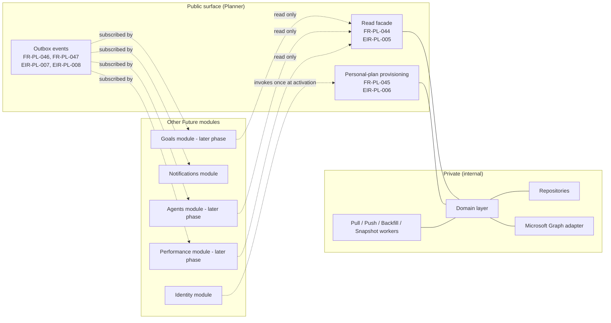

Cross-module synchronous **writes** to Planner state are not exposed (FR-PL-048).

#### B.1 Entity-relationship diagram

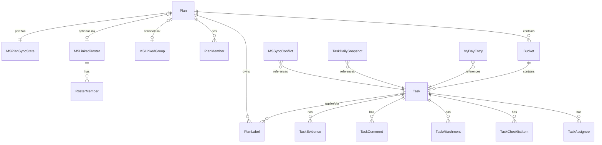

#### B.2 Logical data entities

| Entity                         | Purpose                                                                                | Tenant-scoped |
| ------------------------------ | -------------------------------------------------------------------------------------- | ------------- |
| `plan`                         | Plan aggregate root                                                                    | Yes           |
| `plan_label`                   | Twenty-five named, colour-coded label slots per plan                                   | Yes           |
| `plan_member`                  | Membership row associating a user to a plan with a role                                | Yes           |
| `bucket`                       | Ordered column inside a plan                                                           | Yes           |
| `task`                         | Task aggregate root                                                                    | Yes           |
| `task_assignee`                | Assignee membership for a task                                                         | Yes           |
| `task_applied_label`           | Application of a plan label to a task                                                  | Yes           |
| `task_checklist_item`          | Ordered checklist child of a task                                                      | Yes           |
| `task_attachment`              | File or link attachment on a task; one cover designation per task                      | Yes           |
| `task_comment`                 | Threaded comment on a task                                                             | Yes           |
| `task_evidence`                | Evidence record on a task with independent verification state                          | Yes           |
| `my_day_entry`                 | User pin of a task to a target date                                                    | Yes           |
| `ms_linked_group`              | Binding from a plan to a Microsoft 365 Group                                           | Yes           |
| `ms_linked_roster`             | Binding from a plan to a Future-minted roster                                          | Yes           |
| `roster_member`                | Membership on a roster keyed by SSO subject                                            | Yes           |
| `ms_plan_sync_state`           | Per-plan sync metadata: delta token, etag, timestamps, cadence                         | Yes           |
| `ms_sync_conflict`             | First-class divergence record with both before-states                                  | Yes           |
| `task_daily_snapshot`          | End-of-day capture per task per date                                                   | Yes           |
| `kernel.outbox_event` (shared) | Cross-module integration spine; Planner contributes events with a source discriminator | Yes           |

#### B.3 Outbox event catalogue

| Event type                          | Trigger                                                           | Payload includes                                                | Phase 1 consumers                          |
| ----------------------------------- | ----------------------------------------------------------------- | --------------------------------------------------------------- | ------------------------------------------ |
| `planner.task.assigned`             | One or more assignees added to a task                             | tenant, plan id, task id, prior assignees, new assignees, actor | Notifications                              |
| `planner.task.completed`            | A task's progress transitions to `Completed`                      | tenant, plan id, task id, actor, completion timestamp           | Notifications (Goals in later phase)       |
| `planner.evidence.verified`         | An evidence record's verification state transitions to `verified` | tenant, plan id, task id, evidence id, verifier                 | Notifications (Performance in later phase) |
| `planner.ms_sync.conflict_raised`   | The reconciler records a new conflict                             | tenant, plan id, task id, conflict id, both before-states       | Notifications (admin)                      |
| `planner.ms_sync.conflict_resolved` | An admin or the system resolves a logged conflict                 | tenant, plan id, task id, conflict id, chosen side, resolver    | Notifications (admin)                      |

#### B.4 Audit event catalogue (representative)

| Event                                                                                                   | When fired                                   | Operation-specific attributes                             |
| ------------------------------------------------------------------------------------------------------- | -------------------------------------------- | --------------------------------------------------------- |
| `plan.created`                                                                                          | A new plan is provisioned (team or personal) | plan id, plan kind, container type, container reference   |
| `plan.renamed`                                                                                          | Plan title changes                           | plan id, prior title, new title                           |
| `plan.deleted`                                                                                          | Plan is soft-deleted                         | plan id, deletion reason                                  |
| `plan.member_added` / `plan.member_removed`                                                             | Plan membership change                       | plan id, member identifier, role                          |
| `bucket.created` / `bucket.renamed` / `bucket.reordered` / `bucket.deleted`                             | Bucket lifecycle                             | plan id, bucket id, position, prior/new title or position |
| `task.created` / `task.updated` / `task.moved` / `task.deleted`                                         | Task lifecycle                               | task id, plan id, bucket id, before/after fields          |
| `task.progress_changed` / `task.priority_changed` / `task.dates_changed`                                | Task attribute changes                       | task id, prior value, new value                           |
| `task.assigned` / `task.unassigned`                                                                     | Assignee membership change on a task         | task id, assignee identifier                              |
| `checklist.added` / `checklist.toggled` / `checklist.removed`                                           | Checklist mutation                           | task id, checklist item id, prior/new state               |
| `attachment.uploaded` / `attachment.linked` / `attachment.cover_set` / `attachment.removed`             | Attachment lifecycle                         | task id, attachment id, kind, size                        |
| `comment.posted` / `comment.deleted`                                                                    | Comment lifecycle                            | task id, comment id, parent comment id                    |
| `evidence.added` / `evidence.verified` / `evidence.removed`                                             | Evidence lifecycle                           | task id, evidence id, kind, verifier                      |
| `my_day.added` / `my_day.removed` / `my_day.carried_over`                                               | My Day lifecycle                             | user identifier, task id, target date                     |
| `ms_sync.connected` / `ms_sync.disconnected`                                                            | Microsoft connection lifecycle               | credential identifier, scopes, reason                     |
| `ms_sync.linked_group` / `ms_sync.unlinked_group` / `ms_sync.linked_roster` / `ms_sync.unlinked_roster` | Plan link lifecycle                          | plan id, group or roster id                               |
| `ms_sync.conflict_raised` / `ms_sync.conflict_resolved`                                                 | Conflict lifecycle                           | task id, conflict id, sides, resolver                     |
| `ms_sync.force_resync`                                                                                  | Administrator-triggered force-resync         | plan id, task id, direction                               |
| `ms_sync.credentials_invalidated`                                                                       | Microsoft refuses the stored credential      | credential identifier, error class                        |

#### B.5 Microsoft 365 Planner field map

| Future field          | Microsoft Planner field                 | Mapping notes                                                                                                                                                                                                                                                                                                                                                               |
| --------------------- | --------------------------------------- | --------------------------------------------------------------------------------------------------------------------------------------------------------------------------------------------------------------------------------------------------------------------------------------------------------------------------------------------------------------------------- |
| `title`               | `title`                                 | One-to-one, plain text.                                                                                                                                                                                                                                                                                                                                                     |
| `description`         | `description`                           | One-to-one. When the description originates from Microsoft, the system shall preserve the upstream rich-text representation as an opaque payload so that round-trip from Microsoft → Future → Microsoft does not strip formatting. Future-side editors that operate on plain text shall present the plain-text projection while preserving the underlying payload for push. |
| `progress`            | `percentComplete`                       | Future stores 0, 50, or 100. Microsoft uses the same three values; if the Microsoft side holds another integer, sync coerces to the nearest of the three.                                                                                                                                                                                                                   |
| `priority`            | `priority`                              | One-to-one across the four-step ladder 1, 3, 5, 9.                                                                                                                                                                                                                                                                                                                          |
| `start_date`          | `startDateTime`                         | One-to-one. UTC on both sides.                                                                                                                                                                                                                                                                                                                                              |
| `due_date`            | `dueDateTime`                           | One-to-one. UTC on both sides.                                                                                                                                                                                                                                                                                                                                              |
| `assignees`           | `assignments`                           | Collection. Members resolved by SSO subject.                                                                                                                                                                                                                                                                                                                                |
| `checklist items`     | `checklistItems`                        | Ordered by an order hint. Capped at the Microsoft Planner per-task limit (20); overflow rejected with a deterministic conflict message.                                                                                                                                                                                                                                     |
| `comments`            | task conversation thread (Group thread) | Microsoft routes comments through the parent Group conversation. Future stores threaded comments on the task and reconstructs the thread on push and pull.                                                                                                                                                                                                                  |
| `attachment (file)`   | reference to a SharePoint Drive item    | Files live in the SharePoint Drive backing the Group. Future stores a reference plus a content hash; the binary itself is not duplicated locally.                                                                                                                                                                                                                           |
| `attachment (link)`   | external reference link                 | Plain URL plus optional title.                                                                                                                                                                                                                                                                                                                                              |
| `labels` (slot 1..25) | `category1` … `category25`              | Future preserves the slot identity so colour and meaning round-trip across the boundary.                                                                                                                                                                                                                                                                                    |
| `cover attachment`    | `previewType` plus reference            | The chosen cover attachment is promoted to the Microsoft preview, and vice versa.                                                                                                                                                                                                                                                                                           |
| `recurrence`          | `recurrence`                            | Phase 1 passthrough only (FR-PL-053). The recurrence schedule is opaque from the Future side, preserved verbatim across pull and push. Future-side users may not create or edit a recurrence schedule in Phase 1. The system shall not instantiate local copies of every individual occurrence.                                                                             |

The following Future concepts are intentionally **not** mapped: evidence (Future-only proof of work, not synced outward); daily task snapshots (internal audit and trend artefact); My Day pins (user-scoped and personal, no Microsoft equivalent).

### Appendix C — Use Cases

Use cases are written in Cockburn-style **fully dressed** form for high-value flows and in compact tabular form for elementary CRUD. Every use case traces to one or more functional requirements.

#### C.1 Actors

| Actor                        | Description                                                                               |
| ---------------------------- | ----------------------------------------------------------------------------------------- |
| Employee                     | Daily user; creates and works on tasks within plans they are members of.                  |
| Manager / Team lead          | Plan owner privileges on plans they own; manages team work and verifies evidence.         |
| Tenant administrator         | Operates the tenant; manages Microsoft 365 connection, sync, retention, and quotas.       |
| Auditor / Compliance         | Read-only consumer of audit, conflict, and evidence trails.                               |
| Identity layer (system)      | Invokes the personal-plan provisioning facade on user activation.                         |
| Sync worker (system)         | Internal actor for pull, push, backfill, and retention jobs; appears as `ms_sync` source. |
| Other Future module (system) | Reads via the read facade; consumes outbox events.                                        |

##### C.1.1 Use-case overview

The diagram below maps actors to the principal use cases described in §C.2 and §C.3.

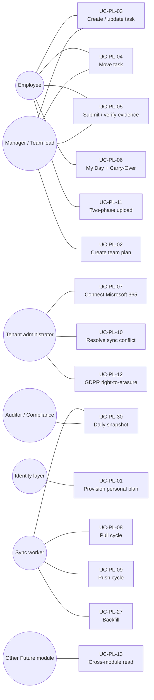

##### C.1.2 Personal-hub aggregation

The four personal hubs do not own a separate task store; they compose data from the base entities under the calling actor's visibility.

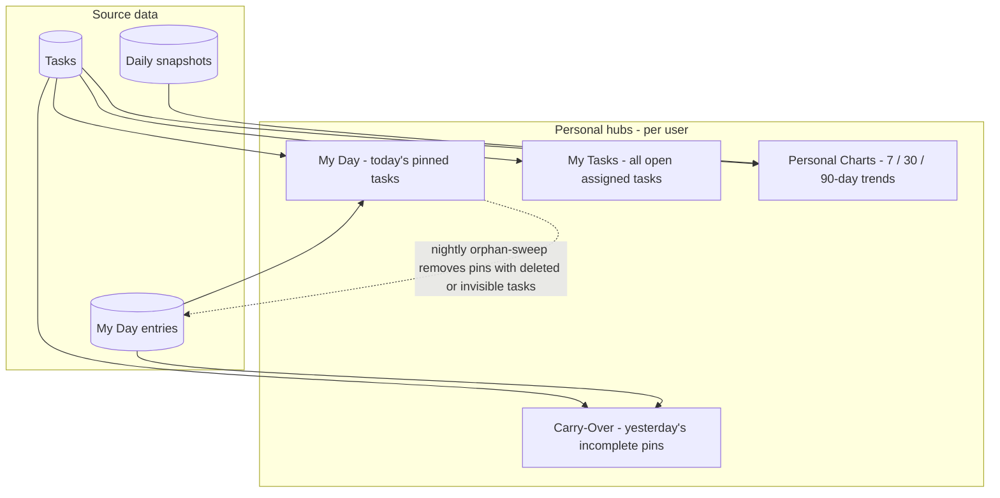

#### C.2 Detailed use cases

##### UC-PL-01 — Provision personal plan on user activation

| Field          | Value                                                                                                                                                                                                                                                                                                                                   |
| -------------- | --------------------------------------------------------------------------------------------------------------------------------------------------------------------------------------------------------------------------------------------------------------------------------------------------------------------------------------- |
| Primary actor  | Identity layer (system)                                                                                                                                                                                                                                                                                                                 |
| Stakeholders   | Employee (gains a personal plan); Tenant administrator (cost and audit visibility)                                                                                                                                                                                                                                                      |
| Trigger        | A new user is activated in the platform identity directory                                                                                                                                                                                                                                                                              |
| Preconditions  | The user has a valid Future actor record; the user does not yet have a personal plan                                                                                                                                                                                                                                                    |
| Postconditions | A personal plan exists for the user; an audit event `plan.created` with `kind=personal` is emitted                                                                                                                                                                                                                                      |
| Main flow      | (1) Identity layer calls `ensurePersonalPlanExists(tenant, actor)`; (2) the system loads any existing personal plan for the actor; (3) if none exists, the system creates one with default name and a single default bucket; (4) the system writes the audit event in the same transaction; (5) the system returns the plan identifier. |
| Alt: existing  | If a personal plan already exists, the system returns the existing identifier without creating a new plan and without emitting a `plan.created` event.                                                                                                                                                                                  |
| Exceptions     | If identity resolution fails, the operation aborts and no plan is created.                                                                                                                                                                                                                                                              |
| Traces to      | FR-PL-001, FR-PL-022, FR-PL-045, FR-PL-049                                                                                                                                                                                                                                                                                              |

##### UC-PL-02 — Create a team plan with a Microsoft 365 Group container

| Field            | Value                                                                                                                                                                                                                                                                                                                                                               |
| ---------------- | ------------------------------------------------------------------------------------------------------------------------------------------------------------------------------------------------------------------------------------------------------------------------------------------------------------------------------------------------------------------- |
| Primary actor    | Manager / Team lead                                                                                                                                                                                                                                                                                                                                                 |
| Stakeholders     | Plan members; Tenant administrator                                                                                                                                                                                                                                                                                                                                  |
| Trigger          | The actor invokes "Create plan" from the Planner web zone                                                                                                                                                                                                                                                                                                           |
| Preconditions    | The actor has authority to create plans in the tenant; the tenant has connected Microsoft 365 and granted the necessary scopes                                                                                                                                                                                                                                      |
| Postconditions   | A team plan exists with `container_type=ms-group`; the linked Microsoft Group is recorded; an initial backfill job is enqueued                                                                                                                                                                                                                                      |
| Main flow        | (1) Actor selects "Create team plan" and enters a name; (2) actor selects container type `ms-group` and chooses an existing Microsoft 365 Group; (3) the system creates the plan, sets the container type, and writes the `MSLinkedGroup` row; (4) the system enqueues a backfill job; (5) the system emits `plan.created` and `ms_sync.linked_group` audit events. |
| Alt: roster      | If the actor selects `ms-roster`, a roster is created instead of using a Microsoft Group; the audit event is `ms_sync.linked_roster`.                                                                                                                                                                                                                               |
| Alt: future-only | If the actor selects `future-only`, no Microsoft binding is created and no backfill is enqueued.                                                                                                                                                                                                                                                                    |
| Exceptions       | If Microsoft Graph rejects the connection during link, the plan is not created and the actor is shown an actionable error.                                                                                                                                                                                                                                          |
| Traces to        | FR-PL-001, FR-PL-002, FR-PL-027, FR-PL-028, FR-PL-034, FR-PL-049                                                                                                                                                                                                                                                                                                    |

##### UC-PL-03 — Create or update a task

| Field          | Value                                                                                                                                                                                                                                                                                                                                                                                                                                                       |
| -------------- | ----------------------------------------------------------------------------------------------------------------------------------------------------------------------------------------------------------------------------------------------------------------------------------------------------------------------------------------------------------------------------------------------------------------------------------------------------------- |
| Primary actor  | Employee                                                                                                                                                                                                                                                                                                                                                                                                                                                    |
| Stakeholders   | Plan members; assignees                                                                                                                                                                                                                                                                                                                                                                                                                                     |
| Trigger        | The actor invokes "New task" or edits an existing task                                                                                                                                                                                                                                                                                                                                                                                                      |
| Preconditions  | The actor has `member` or `owner` role on the plan; the plan is not soft-deleted                                                                                                                                                                                                                                                                                                                                                                            |
| Postconditions | The task exists with the requested attributes; an audit event is emitted; if the plan is linked to Microsoft, a push intent is enqueued                                                                                                                                                                                                                                                                                                                     |
| Main flow      | (1) Actor opens task creation in a bucket; (2) actor enters title, description, progress, priority, dates, assignees, labels, and checklist items; (3) the system validates inputs (title length, due ≥ start, ≤20 checklist items, valid label slots, resolvable assignees); (4) the system persists the task and emits the audit event; (5) if the plan is `ms-group` or `ms-roster`, the system writes a push-intent outbox row in the same transaction. |
| Exceptions     | Validation failure aborts the operation with an actionable error.                                                                                                                                                                                                                                                                                                                                                                                           |
| Traces to      | FR-PL-008, FR-PL-054, FR-PL-009, FR-PL-058, FR-PL-059, FR-PL-060, FR-PL-010, FR-PL-011, FR-PL-012, FR-PL-030, FR-PL-049                                                                                                                                                                                                                                                                                                                                     |

##### UC-PL-04 — Move a task across buckets or plans

| Field          | Value                                                                                                                                                                                                                        |
| -------------- | ---------------------------------------------------------------------------------------------------------------------------------------------------------------------------------------------------------------------------- |
| Primary actor  | Employee                                                                                                                                                                                                                     |
| Stakeholders   | Plan members of source and destination plans                                                                                                                                                                                 |
| Trigger        | The actor drags a task or selects "Move to…"                                                                                                                                                                                 |
| Preconditions  | The actor has `member` or `owner` role on **both** source and destination plans                                                                                                                                              |
| Postconditions | The task is in the destination bucket and plan; the source ordering is repaired; audit events are emitted                                                                                                                    |
| Main flow      | (1) Actor selects target plan and bucket; (2) the system **re-checks** authorisation on both plans; (3) the system updates the task's bucket and plan references in a single transaction; (4) the system emits `task.moved`. |
| Exceptions     | Insufficient authority on either plan aborts the move; partial movement does not occur.                                                                                                                                      |
| Traces to      | FR-PL-056, FR-PL-057, NFR-PL-SEC-03                                                                                                                                                                                          |

##### UC-PL-05 — Submit and verify evidence

| Field          | Value                                                                                                                                                                                                                            |
| -------------- | -------------------------------------------------------------------------------------------------------------------------------------------------------------------------------------------------------------------------------- |
| Primary actor  | Employee (submits); Manager / Team lead (verifies)                                                                                                                                                                               |
| Stakeholders   | Plan owner; downstream consumers (Performance module in later phase)                                                                                                                                                             |
| Trigger        | An employee submits evidence on a task; later, a verifier reviews                                                                                                                                                                |
| Preconditions  | The employee is a member of the plan and is an assignee or comment-poster on the task; for verification, the verifier holds the verification right per tenant policy                                                             |
| Postconditions | An evidence record exists; verification state transitions are recorded; the `planner.evidence.verified` outbox event is emitted on verification                                                                                  |
| Main flow      | (1) Employee adds an evidence record (file, link, or note) to a task; (2) state is `submitted`; (3) verifier reviews and marks `verified` or `rejected` with optional comment; (4) the system emits the audit and outbox events. |
| Notable        | Verification state is **independent** of task progress; verification of evidence on an in-progress task is permitted.                                                                                                            |
| Exceptions     | A non-authorised actor cannot mark `verified` or `rejected`.                                                                                                                                                                     |
| Traces to      | FR-PL-016, FR-PL-039, FR-PL-040, FR-PL-046                                                                                                                                                                                       |

##### UC-PL-06 — Pin to My Day and Carry-Over the next morning

| Field          | Value                                                                                                                                                                                                                                                                |
| -------------- | -------------------------------------------------------------------------------------------------------------------------------------------------------------------------------------------------------------------------------------------------------------------- |
| Primary actor  | Employee                                                                                                                                                                                                                                                             |
| Trigger        | Actor pins a task to "today" from any view; on the following day, actor opens My Day                                                                                                                                                                                 |
| Preconditions  | The task is visible to the actor                                                                                                                                                                                                                                     |
| Postconditions | A `MyDayEntry` exists for the actor with target date = today; the next day, unfinished pins surface in Carry-Over                                                                                                                                                    |
| Main flow      | (1) Actor pins a task; (2) `my_day.added` audit event is emitted; (3) at start-of-day in the actor's timezone, the system computes Carry-Over from the previous day's incomplete pins; (4) the actor optionally rolls items forward, emitting `my_day.carried_over`. |
| Sweep          | A nightly job removes pins whose underlying task has been hard-deleted, archived, or made invisible (FR-PL-018).                                                                                                                                                     |
| Traces to      | FR-PL-017, FR-PL-018, FR-PL-019, FR-PL-049                                                                                                                                                                                                                           |

##### UC-PL-07 — Connect Microsoft 365 to a tenant (admin)

| Field          | Value                                                                                                                                                                                                                                                                                                                                                 |
| -------------- | ----------------------------------------------------------------------------------------------------------------------------------------------------------------------------------------------------------------------------------------------------------------------------------------------------------------------------------------------------- |
| Primary actor  | Tenant administrator                                                                                                                                                                                                                                                                                                                                  |
| Stakeholders   | Microsoft Graph; Tenant compliance owner                                                                                                                                                                                                                                                                                                              |
| Trigger        | Administrator invokes "Connect Microsoft 365" in the admin surface                                                                                                                                                                                                                                                                                    |
| Preconditions  | The tenant administrator holds administrative consent in the Microsoft 365 directory                                                                                                                                                                                                                                                                  |
| Postconditions | Microsoft 365 credentials are recorded; the granted scopes and consent timestamp are persisted; the next sync cycle runs in dry-preview mode                                                                                                                                                                                                          |
| Main flow      | (1) Admin enters the Microsoft 365 directory identifier and confirms scopes; (2) the system performs the OAuth 2.0 client-credentials flow; (3) the system stores the credential reference (no token persisted); (4) the next sync cycle for the tenant runs in dry-preview; (5) the admin reviews and accepts the preview; (6) ongoing sync resumes. |
| Exceptions     | If consent is missing or the directory identifier is wrong, the system blocks the connection with an actionable error and writes a `ms_sync.credentials_invalidated`-equivalent audit shell.                                                                                                                                                          |
| Traces to      | FR-PL-027, FR-PL-038, EIR-PL-009, NFR-PL-SEC-04                                                                                                                                                                                                                                                                                                       |

##### UC-PL-08 — Inbound sync (pull cycle)

| Field          | Value                                                                                                                                                                                                                                                                                                                                                                                                                                                                        |
| -------------- | ---------------------------------------------------------------------------------------------------------------------------------------------------------------------------------------------------------------------------------------------------------------------------------------------------------------------------------------------------------------------------------------------------------------------------------------------------------------------------- |
| Primary actor  | Sync worker (system)                                                                                                                                                                                                                                                                                                                                                                                                                                                         |
| Trigger        | The pull worker fires on the cadence stored in the per-plan sync state                                                                                                                                                                                                                                                                                                                                                                                                       |
| Preconditions  | The plan is linked (`ms-group` or `ms-roster`) and the tenant credentials are valid                                                                                                                                                                                                                                                                                                                                                                                          |
| Postconditions | Local state reflects the latest Microsoft state up to the new delta token; conflicts are logged where they exist                                                                                                                                                                                                                                                                                                                                                             |
| Main flow      | (1) Worker reads the last delta token; (2) worker requests an access token from the platform secrets store; (3) worker calls Microsoft Graph delta endpoint; (4) for each changed task, the worker invokes the appropriate domain command **through the gate** with `source=ms_sync`; (5) the domain command applies authorisation, invariants, and version checks; (6) audit and outbox events are emitted; (7) the worker updates the delta token and last-pull timestamp. |
| Conflict path  | If the version check fails, the worker writes an `ms_sync_conflict` row preserving both before-states (UC-PL-10).                                                                                                                                                                                                                                                                                                                                                            |
| Exceptions     | Rate-limit (429) or 5xx triggers adaptive backoff; credential failure pauses sync for the tenant (FR-PL-036).                                                                                                                                                                                                                                                                                                                                                                |
| Traces to      | FR-PL-029, FR-PL-031, EIR-PL-010, EIR-PL-012, NFR-PL-PERF-06                                                                                                                                                                                                                                                                                                                                                                                                                 |

##### UC-PL-09 — Outbound sync (push cycle)

| Field          | Value                                                                                                                                                                                                                             |
| -------------- | --------------------------------------------------------------------------------------------------------------------------------------------------------------------------------------------------------------------------------- |
| Primary actor  | Sync worker (system)                                                                                                                                                                                                              |
| Trigger        | A push intent is enqueued by a domain command on a linked plan                                                                                                                                                                    |
| Preconditions  | The plan is linked; the tenant credentials are valid; an idempotency key is available for the entity and version                                                                                                                  |
| Postconditions | Microsoft 365 state reflects the local change; the per-plan sync state is updated with the new etag and version                                                                                                                   |
| Main flow      | (1) Worker claims the next pending push intent; (2) requests access token; (3) issues PATCH or POST against Microsoft Graph with the etag and idempotency key; (4) on success, updates sync state; (5) marks the intent resolved. |
| Conflict path  | On etag mismatch, the worker stops, writes an `ms_sync_conflict` row, and emits `ms_sync.conflict_raised` outbox event.                                                                                                           |
| Exceptions     | Repeated failure past the retry bound marks the intent pending and surfaces the issue to the admin.                                                                                                                               |
| Traces to      | FR-PL-030, FR-PL-031, EIR-PL-011, NFR-PL-PERF-07, NFR-PL-REL-03                                                                                                                                                                   |

##### UC-PL-10 — Resolve a sync conflict

| Field          | Value                                                                                                                                                                                                                                                                                      |
| -------------- | ------------------------------------------------------------------------------------------------------------------------------------------------------------------------------------------------------------------------------------------------------------------------------------------ |
| Primary actor  | Tenant administrator                                                                                                                                                                                                                                                                       |
| Trigger        | The administrator opens the conflict log entry                                                                                                                                                                                                                                             |
| Preconditions  | A conflict record exists in `ms_sync_conflict`                                                                                                                                                                                                                                             |
| Postconditions | The conflict is resolved (auto-accepted, override-accepted, or force-resynced); audit and outbox events are emitted                                                                                                                                                                        |
| Main flow      | (1) Admin opens the conflict; (2) reviews both before-states via the field-level diff visualiser; (3) selects one of: accept the auto-resolved outcome, override to the other side, or force-resync the task; (4) the system records the resolution and emits `ms_sync.conflict_resolved`. |
| Force-resync   | If selected, the system clears the conflict, repulls authoritative state from Microsoft, and reapplies any in-flight Future mutation behind it.                                                                                                                                            |
| Traces to      | FR-PL-031, FR-PL-032, FR-PL-063, FR-PL-064, FR-PL-065, NFR-PL-COMP-04                                                                                                                                                                                                                      |

##### UC-PL-11 — Two-phase attachment upload

| Field          | Value                                                                                                                                                                                                                                                                      |
| -------------- | -------------------------------------------------------------------------------------------------------------------------------------------------------------------------------------------------------------------------------------------------------------------------- |
| Primary actor  | Employee                                                                                                                                                                                                                                                                   |
| Trigger        | The actor selects "Add file" on a task                                                                                                                                                                                                                                     |
| Preconditions  | The actor has `member` role; the file is within the per-tenant size cap; the tenant has remaining storage quota                                                                                                                                                            |
| Postconditions | A `task_attachment` row exists referencing the uploaded object; an audit event is emitted                                                                                                                                                                                  |
| Main flow      | (1) Client requests a signed URL from the API; (2) API authorises and mints a URL bound to a specific tenant-scoped key; (3) client uploads to object storage; (4) client invokes the finalise call; (5) API records the attachment and emits the audit and outbox events. |
| Recovery       | If the finalise call does not arrive, the attachment remains in `pending` state; the retry-pending-attachments worker reattempts within bounds; the user sees a recovery affordance.                                                                                       |
| Exceptions     | Quota exhausted: the upload is refused with an actionable error and the admin is alerted (FR-PL-014).                                                                                                                                                                      |
| Traces to      | FR-PL-013, FR-PL-014, FR-PL-061, FR-PL-062, EIR-PL-018, EIR-PL-019                                                                                                                                                                                                         |

##### UC-PL-12 — GDPR right-to-erasure

| Field          | Value                                                                                                                                                                                                                                                                                                                                                                                                              |
| -------------- | ------------------------------------------------------------------------------------------------------------------------------------------------------------------------------------------------------------------------------------------------------------------------------------------------------------------------------------------------------------------------------------------------------------------ |
| Primary actor  | Tenant administrator (on data subject's behalf)                                                                                                                                                                                                                                                                                                                                                                    |
| Trigger        | A verified GDPR Art. 17 request reaches the platform compliance pipeline                                                                                                                                                                                                                                                                                                                                           |
| Preconditions  | The data subject is identified by SSO subject; the tenant has a declared evidence-handling policy                                                                                                                                                                                                                                                                                                                  |
| Postconditions | User-personal content authored by the subject is hard-deleted; audit shells are preserved with the actor identifier replaced by a tombstone                                                                                                                                                                                                                                                                        |
| Main flow      | (1) Compliance pipeline invokes the Planner erasure handler with the actor identifier; (2) the system hard-deletes My Day pins, the personal plan and its tasks, comments authored by the user, attachments owned by the user, evidence authored by the user; (3) the system rewrites audit shells to replace the actor identifier with a tombstone; (4) the system reports completion to the compliance pipeline. |
| Notable        | Audit reconstruction by date range remains possible; the actor identity is no longer recoverable.                                                                                                                                                                                                                                                                                                                  |
| Traces to      | FR-PL-051, NFR-PL-COMP-01, LR-PL-001                                                                                                                                                                                                                                                                                                                                                                               |

##### UC-PL-13 — Cross-module read of plans for actor

| Field          | Value                                                                                                                                                                                   |
| -------------- | --------------------------------------------------------------------------------------------------------------------------------------------------------------------------------------- |
| Primary actor  | Other Future module (system) — for example, Goals or Agents                                                                                                                             |
| Trigger        | The consuming module needs the set of plans visible to a given actor                                                                                                                    |
| Preconditions  | The consuming module is registered with the platform; the calling actor has a valid identity                                                                                            |
| Postconditions | The consumer receives the plans visible to the actor; no information is leaked about plans the actor cannot see                                                                         |
| Main flow      | (1) Consumer calls `listPlansForActor(tenant, actor)`; (2) the facade applies tenant scope on the database connection and the actor visibility filter; (3) the facade returns the list. |
| Notable        | This is a **read-only** path; cross-module writes are prohibited (FR-PL-048).                                                                                                           |
| Traces to      | FR-PL-044, EIR-PL-005                                                                                                                                                                   |

#### C.3 Supplementary use cases (compact)

The following use cases are elementary CRUD or follow patterns equivalent to those in §C.2; they are listed for completeness and traced in Appendix D.

| ID       | Use case                                          | Primary actor           | Traces to                           |
| -------- | ------------------------------------------------- | ----------------------- | ----------------------------------- |
| UC-PL-14 | Manage plan members                               | Manager / Team lead     | FR-PL-005, FR-PL-049                |
| UC-PL-15 | Manage plan label slots                           | Manager / Team lead     | FR-PL-007                           |
| UC-PL-16 | Create, rename, reorder, delete buckets           | Manager / Team lead     | FR-PL-006                           |
| UC-PL-17 | Manage task assignees                             | Employee / Manager      | FR-PL-010                           |
| UC-PL-18 | Manage checklist items                            | Employee                | FR-PL-011                           |
| UC-PL-19 | Apply or remove labels                            | Employee                | FR-PL-012                           |
| UC-PL-20 | Add or remove a comment                           | Employee                | FR-PL-015                           |
| UC-PL-21 | View My Tasks                                     | Employee                | FR-PL-020                           |
| UC-PL-22 | View Personal Charts                              | Employee                | FR-PL-021                           |
| UC-PL-23 | Switch plan view modes                            | Any plan member         | FR-PL-023, FR-PL-024                |
| UC-PL-24 | Open task by direct URL                           | Any authorised viewer   | FR-PL-025, FR-PL-026, NFR-PL-SEC-09 |
| UC-PL-25 | Filter and search across views                    | Any plan member         | FR-PL-024                           |
| UC-PL-26 | Force-resync a single task                        | Tenant administrator    | FR-PL-065                           |
| UC-PL-27 | Backfill a newly linked plan                      | Sync worker (system)    | FR-PL-034                           |
| UC-PL-28 | Daily sync-health summary                         | Sync worker (system)    | FR-PL-035, ASM-PL-009               |
| UC-PL-29 | Pause sync for a plan or for the platform         | Tenant admin / Operator | FR-PL-036, NFR-PL-REL-08            |
| UC-PL-30 | Capture daily task snapshot                       | Sync worker (system)    | FR-PL-041, FR-PL-042                |
| UC-PL-31 | Retention pruning of snapshots and conflict log   | Sync worker (system)    | FR-PL-042, NFR-PL-REL-04            |
| UC-PL-32 | Detach a plan when its Microsoft Group is deleted | Sync worker (system)    | FR-PL-037                           |

### Appendix D — Requirements Traceability Matrix

This matrix links each functional requirement to the user need(s) it satisfies and the use case(s) that exercise it.

| Requirement    | User needs         | Use cases                              | Verification          |
| -------------- | ------------------ | -------------------------------------- | --------------------- |
| FR-PL-001      | UN-PL-04           | UC-PL-01, UC-PL-02                     | Test                  |
| FR-PL-002      | UN-PL-02, UN-PL-04 | UC-PL-02                               | Test                  |
| FR-PL-003      | UN-PL-04           | UC-PL-02                               | Test                  |
| FR-PL-004      | UN-PL-04           | UC-PL-14                               | Test                  |
| FR-PL-005      | UN-PL-04           | UC-PL-14                               | Test                  |
| FR-PL-006      | UN-PL-04           | UC-PL-16                               | Test                  |
| FR-PL-007      | UN-PL-04           | UC-PL-15                               | Test                  |
| FR-PL-008      | UN-PL-04           | UC-PL-03, UC-PL-04                     | Test                  |
| FR-PL-009      | UN-PL-04           | UC-PL-03                               | Test                  |
| FR-PL-010      | UN-PL-04           | UC-PL-17                               | Test                  |
| FR-PL-011      | UN-PL-04           | UC-PL-18                               | Test                  |
| FR-PL-012      | UN-PL-04           | UC-PL-19                               | Test                  |
| FR-PL-013      | UN-PL-04           | UC-PL-11                               | Test                  |
| FR-PL-014      | UN-PL-06           | UC-PL-11                               | Test                  |
| FR-PL-015      | UN-PL-04           | UC-PL-20                               | Test                  |
| FR-PL-016      | UN-PL-03, UN-PL-05 | UC-PL-05                               | Test                  |
| FR-PL-017      | UN-PL-01           | UC-PL-06                               | Test                  |
| FR-PL-018      | UN-PL-01           | UC-PL-06                               | Test                  |
| FR-PL-019      | UN-PL-01           | UC-PL-06                               | Test                  |
| FR-PL-020      | UN-PL-01           | UC-PL-21                               | Test                  |
| FR-PL-021      | UN-PL-01           | UC-PL-22                               | Test                  |
| FR-PL-022      | UN-PL-01           | UC-PL-01                               | Test                  |
| FR-PL-023      | UN-PL-04           | UC-PL-23                               | Test                  |
| FR-PL-024      | UN-PL-04           | UC-PL-23, UC-PL-25                     | Test                  |
| FR-PL-025      | UN-PL-04           | UC-PL-24                               | Test                  |
| FR-PL-026      | UN-PL-04, UN-PL-08 | UC-PL-24                               | Test                  |
| FR-PL-027      | UN-PL-06           | UC-PL-07                               | Test                  |
| FR-PL-028      | UN-PL-06           | UC-PL-02                               | Test                  |
| FR-PL-029      | UN-PL-02           | UC-PL-08                               | Test                  |
| FR-PL-030      | UN-PL-02           | UC-PL-09                               | Test                  |
| FR-PL-031      | UN-PL-07           | UC-PL-08, UC-PL-09, UC-PL-10           | Test                  |
| FR-PL-032      | UN-PL-07           | UC-PL-10, UC-PL-26                     | Test                  |
| FR-PL-033      | UN-PL-04           | UC-PL-08                               | Test                  |
| FR-PL-034      | UN-PL-06           | UC-PL-27                               | Test                  |
| FR-PL-035      | UN-PL-06, UN-PL-07 | UC-PL-28                               | Telemetry             |
| FR-PL-036      | UN-PL-06           | UC-PL-29                               | Test                  |
| FR-PL-037      | UN-PL-06           | UC-PL-32                               | Test                  |
| FR-PL-038      | UN-PL-06           | UC-PL-07                               | Test                  |
| FR-PL-039      | UN-PL-03, UN-PL-05 | UC-PL-05                               | Test                  |
| FR-PL-040      | UN-PL-05           | UC-PL-05                               | Test                  |
| FR-PL-041      | UN-PL-08           | UC-PL-30                               | Test                  |
| FR-PL-042      | UN-PL-08           | UC-PL-30, UC-PL-31                     | Test                  |
| FR-PL-043      | UN-PL-08, UN-PL-10 | UC-PL-12                               | Test                  |
| FR-PL-044      | UN-PL-09           | UC-PL-13                               | Test                  |
| FR-PL-045      | UN-PL-09           | UC-PL-01                               | Test                  |
| FR-PL-046      | UN-PL-09           | UC-PL-05, UC-PL-08, UC-PL-09, UC-PL-10 | Test                  |
| FR-PL-047      | UN-PL-09           | UC-PL-09                               | Test                  |
| FR-PL-048      | UN-PL-09           | UC-PL-13                               | Inspection            |
| FR-PL-049      | UN-PL-08           | All UCs                                | Test                  |
| FR-PL-050      | UN-PL-08           | All UCs                                | Test                  |
| FR-PL-051      | UN-PL-08, UN-PL-10 | UC-PL-12                               | Test                  |
| FR-PL-052      | UN-PL-08           | All UCs                                | Production query test |
| FR-PL-053      | UN-PL-02           | UC-PL-08, UC-PL-09                     | Test                  |
| FR-PL-054      | UN-PL-04           | UC-PL-03                               | Test                  |
| FR-PL-055      | UN-PL-04, UN-PL-08 | UC-PL-03                               | Test                  |
| FR-PL-056      | UN-PL-04           | UC-PL-04                               | Test                  |
| FR-PL-057      | UN-PL-04           | UC-PL-04                               | Test                  |
| FR-PL-058      | UN-PL-04           | UC-PL-03                               | Test                  |
| FR-PL-059      | UN-PL-04           | UC-PL-03                               | Test                  |
| FR-PL-060      | UN-PL-04           | UC-PL-03                               | Test                  |
| FR-PL-061      | UN-PL-06           | UC-PL-11                               | Test                  |
| FR-PL-062      | UN-PL-06           | UC-PL-11                               | Test                  |
| FR-PL-063      | UN-PL-07           | UC-PL-10                               | Test                  |
| FR-PL-064      | UN-PL-07           | UC-PL-10                               | Test                  |
| FR-PL-065      | UN-PL-07           | UC-PL-10, UC-PL-26                     | Test                  |
| FR-PL-066      | UN-PL-06, UN-PL-07 | UC-PL-10                               | Test                  |
| FR-PL-067      | UN-PL-04, UN-PL-07 | UC-PL-10                               | Test                  |
| NFR-PL-PERF-11 | UN-PL-02, UN-PL-06 | UC-PL-03, UC-PL-09                     | Test; telemetry       |

The non-functional requirements in §3.4 are individually verifiable via the methods declared in their rows; the Phase 1 launch gates in §1.5.3 act as the integrating verification.

### Appendix E — Document Control

| Field                        | Value                                                                                                                                                                             |
| ---------------------------- | --------------------------------------------------------------------------------------------------------------------------------------------------------------------------------- |
| Document type                | Software Requirements Specification (IEEE Std 830-1998)                                                                                                                           |
| Status                       | Draft v1.0                                                                                                                                                                        |
| Owner role                   | CTO / Tech Lead, Future platform                                                                                                                                                  |
| Review cadence               | At every Phase iteration; ad hoc on approved change request                                                                                                                       |
| Last reviewed                | 2026-05-05                                                                                                                                                                        |
| Approval gates before launch | CTO sign-off, security review, compliance review, QA sign-off                                                                                                                     |
| Change-control reference     | All deviations shall be raised against specific requirement identifiers (FR-PL-NNN, NFR-PL-…, EIR-PL-NNN, DBR-PL-NNN, UI-PL-NNN, LR-PL-NNN, I18N-PL-NNN, CON-PL-NNN, ASM-PL-NNN). |

_End of document._
