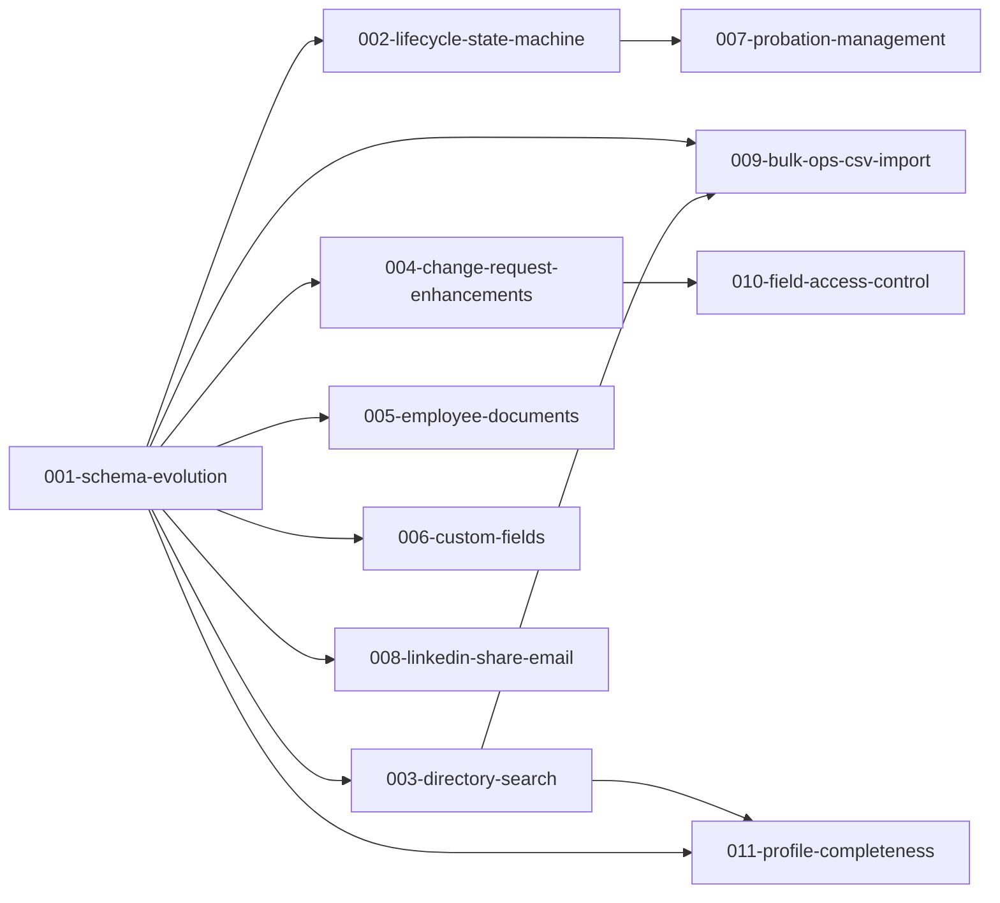
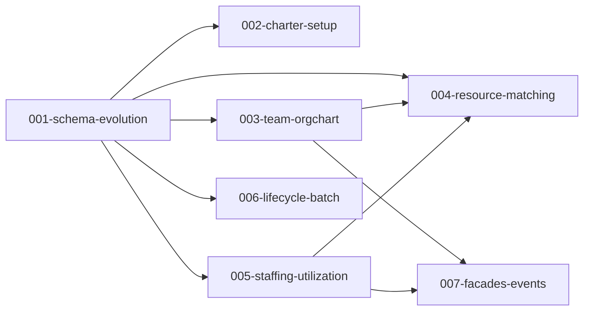
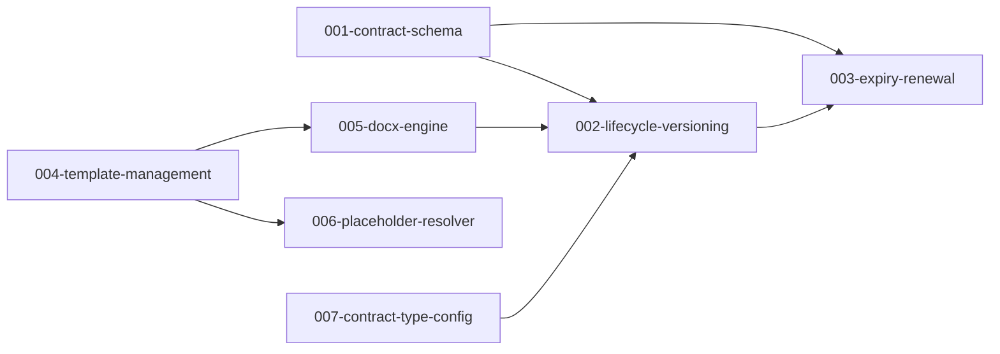

# Migration Progress: ems → future

**Source:** /Users/canh/Projects/Seta/legacy/ems
**Target:** /Users/canh/Projects/Seta/future
**Started:** 2026-04-14
**Updated:** 2026-04-15

## Summary

| Phase       | Progress     |
| ----------- | ------------ |
| Discovered  | 11 modules   |
| Refined     | 3/11 modules |
| Implemented | 0/25 tasks   |
| Verified    | 0/25 tasks   |

## Modules

<!-- Module status: pending-refinement | refined | in-progress | completed -->
<!-- Task status: pending | ready-to-implement | in-progress | done | verified | needs-revision -->

| Module           | Status             | Priority | Tasks |
| ---------------- | ------------------ | -------- | ----- |
| employee         | refined            | high     | 0/11  |
| contract         | refined            | high     | 0/7   |
| project-staffing | refined            | high     | 0/7   |
| offboarding      | pending-refinement | medium   | —     |
| templates        | pending-refinement | medium   | —     |
| admin-config     | pending-refinement | medium   | —     |
| statistics       | pending-refinement | low      | —     |
| tasks            | pending-refinement | low      | —     |
| media            | pending-refinement | low      | —     |
| audit-log        | pending-refinement | low      | —     |
| cv-parser        | pending-refinement | low      | —     |

## Tasks

### employee

| Task                            | Status  | Priority | Blocked By |
| ------------------------------- | ------- | -------- | ---------- |
| 001-schema-evolution            | pending | high     | —          |
| 002-lifecycle-state-machine     | pending | high     | 001        |
| 003-directory-search            | pending | high     | 001        |
| 004-change-request-enhancements | pending | high     | 001        |
| 005-employee-documents          | pending | medium   | 001        |
| 006-custom-fields               | pending | medium   | 001        |
| 007-probation-management        | pending | medium   | 002        |
| 008-linkedin-share-email        | pending | medium   | 001        |
| 009-bulk-ops-csv-import         | pending | medium   | 001, 003   |
| 010-field-access-control        | pending | medium   | 004        |
| 011-profile-completeness        | pending | low      | 001, 003   |

### project-staffing

| Task                     | Status  | Priority | Blocked By    |
| ------------------------ | ------- | -------- | ------------- |
| 001-schema-evolution     | pending | high     | —             |
| 002-charter-setup        | pending | high     | 001           |
| 003-team-orgchart        | pending | high     | 001           |
| 004-resource-matching    | pending | high     | 001, 003, 005 |
| 005-staffing-utilization | pending | medium   | 001           |
| 006-lifecycle-batch      | pending | medium   | 001           |
| 007-facades-events       | pending | medium   | 003, 005      |

### contract

Note: This module decomposes across `people` (001-003), `documents` (004-006), and `admin` (007).

| Task                     | Status  | Priority | Blocked By    |
| ------------------------ | ------- | -------- | ------------- |
| 001-contract-schema      | pending | high     | —             |
| 002-lifecycle-versioning | pending | high     | 001, 005, 007 |
| 003-expiry-renewal       | pending | medium   | 002           |
| 004-template-management  | pending | high     | —             |
| 005-docx-engine          | pending | high     | 004           |
| 006-placeholder-resolver | pending | high     | 004           |
| 007-contract-type-config | pending | medium   | —             |

## Excluded

| Module       | Reason                                                                                       |
| ------------ | -------------------------------------------------------------------------------------------- |
| auth-account | Already covered by identity + kernel modules. Role mapping handled during module refinement. |
