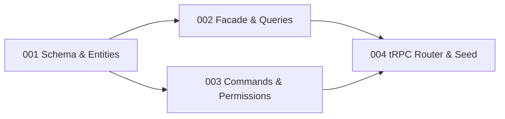

# Migration Progress: hiring-app → Future hiring module

> **Started:** 2026-04-15
> **Updated:** 2026-04-15
> **Source:** hiring-app-api-nest + hiring-app-ui-react
> **Target:** Future hiring module + web-hiring zone

---

## Summary

| Phase       | Count                |
| ----------- | -------------------- |
| Discovered  | 10 modules (0 + 1–9) |
| Refined     | 1/10                 |
| Implemented | 0/4 tasks            |
| Verified    | 0/4 tasks            |

---

## Modules

| #   | Module                             | Priority | Status               | Tasks    |
| --- | ---------------------------------- | -------- | -------------------- | -------- |
| 0   | Shared Skill Taxonomy              | High     | `refined`            | 0/4 done |
| 1   | Candidate Management & Talent Pool | High     | `pending-refinement` | —        |
| 2   | Recruitment Pipeline & Offers      | High     | `pending-refinement` | —        |
| 3   | Interview & Evaluation             | High     | `pending-refinement` | —        |
| 4   | Hiring Reference Data              | High     | `pending-refinement` | —        |
| 5   | AI & CV Processing                 | Medium   | `pending-refinement` | —        |
| 6   | Email & Communication              | Medium   | `pending-refinement` | —        |
| 7   | Hiring Analytics & Reporting       | Medium   | `pending-refinement` | —        |
| 8   | PDPD Compliance                    | Medium   | `pending-refinement` | —        |
| 9   | Web Crawling                       | Low      | `pending-refinement` | —        |

---

## Tasks

### Shared Skill Taxonomy

| Task | Name                               | Status    | Priority | Blocked By |
| ---- | ---------------------------------- | --------- | -------- | ---------- |
| 001  | Schema, Entities & Repositories    | `pending` | High     | —          |
| 002  | KernelSkillFacade & Query Handlers | `pending` | High     | 001        |
| 003  | CRUD Commands & Permission Keys    | `pending` | High     | 001        |
| 004  | tRPC Router & Seed Data            | `pending` | High     | 002, 003   |
