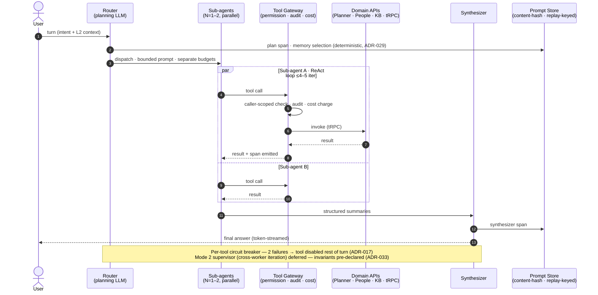
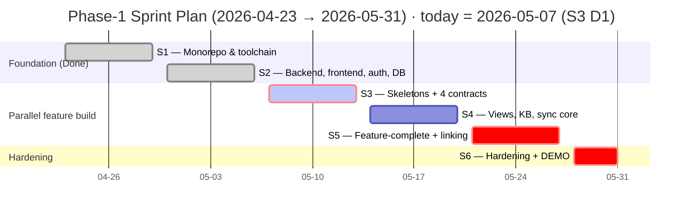

# Future — Phase-1 Kickoff Signoff

| Field             | Value                                            |
| ----------------- | ------------------------------------------------ |
| Document          | Project signoff for kickoff                      |
| For               | CEO · CTO · PMO                                  |
| Author            | Project Management Office                        |
| Status            | **For signature — kickoff blocked until signed** |
| Proposed kickoff  | **2026-04-23**                                   |
| MVP demonstration | **2026-05-31** (6-week window)                   |

## 1. The Ask

Approve a **six-week, six-FTE Phase-1 build** of Future kicking off **2026-04-23**, ending in a live MVP demonstration on **2026-05-31** against SETA's own data. This document is the scope-and-timeline contract.

---

## 2. Architecture at a Glance

**Invariants.** Every table carries `tenant_id` with **RLS at the DB layer** · zones never query the DB directly (all data via tRPC) · **Terraform-only** infrastructure, no manual console changes · **ARM64 only** · secrets in AWS Secrets Manager.

---

## 3. Scope — What Ships by 2026-05-31

### 3.1 Committed deliverables (in scope)

| Workstream                          | Headline                                                                                                                                       |
| ----------------------------------- | ---------------------------------------------------------------------------------------------------------------------------------------------- |
| **Agents module** _(detail in §4)_  | Conversational AI assistant — KB Q&A, role-scoped analysis, scheduled digests, approval-inbox-mediated writes, four-axis cost ceilings         |
| **Planner module** _(detail in §5)_ | Plans/buckets/tasks, evidence-backed completion, 4 view modes, 4 personal hubs, **bidirectional Microsoft 365 Planner sync** with conflict log |

### 3.2 Acceptance criteria — demo on 2026-05-31

Live, end-to-end run on real SETA data. Demo proves capability; production write activation is gated post-MVP per Agents SAD §9.3, and full Planner launch is **2026-06-08** per Planner SAD §9.1.

1. Magic-link login via Entra SSO.
2. KB Q&A with handbook citations — ≥80% accuracy on a held-out rubric.
3. "What are my overdue tasks?" — agent reads Planner under caller scope.
4. Mark task complete with evidence → approval inbox → approve → propagates to M365 Planner.
5. **Multi-tenant probe** — second tenant cannot see tenant 1's data; leak canary green.
6. **Failure modes** — sync conflict surfaces in log; cost-ceiling tripwire fires; KB miss returns plain-language refusal.
7. Daily digest subscription delivers next business day.
8. Admin surfaces: sync-health · conflict log · cost ledger · audit query.

**Gates:** Board p95 ≤ 400 ms · My Tasks p95 ≤ 1.0 s · agent answer p95 ≤ 8 s · zero leak canary failures.

### 3.3 Out of scope — programme-wide

Module-specific cuts in §4.3 and §5.2.

- **Other domain modules** — people, time, hiring, performance, projects, finance, goals
- **Manager / team-lead dashboards** and at-risk alerts
- **Multi-language UI · native mobile · multi-region · cross-tenant collab**
- **Slack / Teams chat surfaces · Outlook calendar**
- **External tenant onboarding** — SETA-internal pilot only

### 3.4 What 2026-05-31 is — and is not

| ✅ It is                                            | ❌ It is not                                  |
| --------------------------------------------------- | --------------------------------------------- |
| MVP demonstration on real SETA data                 | General Availability                          |
| PMO performance-evaluation anchor for the programme | External pilot launch                         |
| Foundation for the post-MVP Phase-1 GA gate         | An all-modules platform                       |
| Internal-use ready (SETA staff, existing privacy)   | External-tenant ready (GDPR erasure required) |

---

## 4. Agents Module — Detailed Scope

Conversational AI assistant for every SETA employee. Trust is earned in four phases: A (Q&A), B (Insights), C (Action Proposals), D (Autonomous). **MVP = A + B + constrained C** (own-scope writes only, all routed through the approval inbox). **D is out.**

The **approval inbox** is the safety mechanic: writes either preview inline (single-target, Bypass mode) or route through the inbox (bulk, cross-target, destructive, or any write after free-text user input). On approval, preconditions revalidate; narrowed permissions fail the write with a structured event — never silently.

### 4.1 Runtime architecture — one turn, end to end

One turn = one Router plan up front, 1–2 sub-agents in parallel, one Synthesizer at the end. Every tool call traverses a single non-skippable **Tool Gateway** (permission · audit · cost). Every LLM call is recorded in the replay-keyed **Prompt Store** — any past turn reconstructable from its trace ID.

**Not shown:** layered memory L1/L2/L3 (App. C) · `pg-boss` async workers (`scheduled-turn`, `execute-approved-draft`, `kb-ingestion`) — all enqueue into the same Router, none bypass the Gateway · **Mode 2 supervisor** (cross-worker iteration) pre-declared but not wired (ADR-033).

### 4.2 MVP capability buckets

| Bucket                                | Capabilities (FR refs)                                                                                                                                                                                                                                                                                                                                                                          |
| ------------------------------------- | ----------------------------------------------------------------------------------------------------------------------------------------------------------------------------------------------------------------------------------------------------------------------------------------------------------------------------------------------------------------------------------------------- |
| **Conversational surface**            | Global chat with token streaming + turn cancel · Inline copilot panels in Planner with auto screen context · Per-user concurrent threads (FR-001–007)                                                                                                                                                                                                                                           |
| **Router · sub-agents · synthesizer** | Three LLM-driven roles in one turn (Mode 1, bounded DAG): **Router** plans once with strict output shape · 1–2 **sub-agents** dispatched in parallel under separate budgets, each running a capped **ReAct loop** (≤4–5 iterations, abortable, audited, observable) · **Synthesizer** composes the final answer · Per-tool circuit breaker: 2 failures → tool disabled for the rest of the turn |
| **Layered memory model (App. C)**     | **L1** sub-agent ReAct trace + turn-scoped read cache · **L2** conversation history — last-K turns verbatim + earlier turns as **compacted summaries** (compaction is a first-class instrumented LLM call off the hot path, threshold default 6,000 tokens, ADR-030) · **L3** non-domain user preferences (display format, default currency view)                                               |
| **Tenant Knowledge Base**             | Markdown / plain-text / text-PDF ingestion (no OCR) · Tenant-keyed retrieval, cross-tenant search structurally prohibited · Q&A with citations · Admin upload / browse / edit / deprecate / re-index / failure reports (FR-050–059)                                                                                                                                                             |
| **Planner knowledge & analytics**     | "My open / due / overdue tasks", workload, blockage · Plan status synthesis (on-track / at-risk / done; stale items; standup) · Role-scoped analysis: IC throughput · team-lead balance · org-leader cross-team risk · k-anonymity floor on aggregates (FR-025, 060–064)                                                                                                                        |
| **Approval inbox & writes**           | Two modes: **Default** (every write confirms) · **Bypass** (single-target inline) · Non-bypassable floor: bulk · cross-target · destructive · post-free-text (FR-008–018, 040–045)                                                                                                                                                                                                              |
| **Scheduled digests**                 | Opt-in **cron-fired** only — morning brief · end-of-week status · stale-task nudges · at-risk alerts · Read-only or inbox-draft, never autonomous · Explicit per-user delegation · Self-service manage (FR-071–075)                                                                                                                                                                             |
| **Cost & governance**                 | Four-axis USD ceilings: **per-turn · per-user-day · per-tenant-day · per-delegation** (cache-aware) · Caller-scoped, no service-account elevation · Admin: model, ceilings, schedule, tool visibility, mode policy (FR-019–027)                                                                                                                                                                 |
| **Audit, replay, honesty**            | Caller-identity audit on every action · Deterministic replay from trace ID · Plain-language refusal with reason (budget / unavailable / refused) · Single-layer retry + per-tool circuit breaker · Model-degradation ladder with trace tags (FR-028–049)                                                                                                                                        |

### 4.3 Agents-specific deferrals

- **Cross-conversation memory** — within-conversation context only (no "you said X yesterday")
- **Autonomous writes** — scheduled / event-triggered runs cannot write without inbox approval
- **Event-triggered runs** — cron only at MVP; outbox-event subscriptions pre-designed, not wired
- **Image / OCR ingestion** — text KB only
- **Multi-provider routing** — single-provider (OpenAI); abstraction is post-Phase-1
- **LLM-as-judge gating** — deferred until ≥95% inter-rater corpus; deterministic scorers only

---

## 5. Planner Module — Detailed Scope

A work-tracking surface that **complements** Microsoft 365 Planner today and is positioned to **replace it** for tenants without an existing M365 investment — Future adds bidirectional sync, evidence-backed completion, personal hubs, and audit history that M365 Planner does not provide. Additional integrations (Trello, Asana, Jira) are post-MVP; the architecture is provider-agnostic by design.

### 5.1 MVP capability buckets

| Bucket                           | Capabilities (FR-PL refs)                                                                                                                                                                                                                                                                                                                                                                                                                                                                                                                                                      |
| -------------------------------- | ------------------------------------------------------------------------------------------------------------------------------------------------------------------------------------------------------------------------------------------------------------------------------------------------------------------------------------------------------------------------------------------------------------------------------------------------------------------------------------------------------------------------------------------------------------------------------ |
| **Plans, buckets, tasks**        | Team plans (multi-member) + personal plans (auto-provisioned, private) · Three plan types fixed at first link: `future-only` · `ms-group` · `ms-roster` · Ordered buckets · 25 label slots (renameable, not addable) · Task CRUD with title ≤255 / desc ≤32 KB / dates / assignees / labels / checklists (max 20) / attachments / comments · Soft-delete with audit-shell · Atomic re-auth on cross-bucket / cross-plan move (FR-PL-001–016)                                                                                                                                   |
| **Four view modes**              | **Board** kanban · **Grid** sortable/filterable table · **Charts** bar/donut by bucket/assignee/progress/priority · **Schedule** timeline by date (day/week/month) — **NOT a Gantt** (no dependencies, critical path, milestones) · Single filter+search across all four views (FR-PL-023, UI-PL-011–014)                                                                                                                                                                                                                                                                      |
| **Four personal hubs**           | **My Day** today's pins + Carry-Over · **My Tasks** all open tasks across visible plans, grouped, with due-date proximity · **Personal Charts** 7/30/90-day completion, open count by priority/plan · **Carry-Over** auto roll-forward of unfinished pins (FR-PL-017–022)                                                                                                                                                                                                                                                                                                      |
| **Evidence model**               | First-class records, **distinct from attachments** · Kinds: file · link · note · States: unsubmitted · submitted · verified · rejected (independent of task completion) · `evidence.verified` outbox event (FR-PL-016, 058)                                                                                                                                                                                                                                                                                                                                                    |
| **M365 bidirectional sync**      | Tenant-admin OAuth (once per tenant) · **Pull**: adaptive cadence, Graph delta query, reconcile · **Push**: idempotency per entity-version, no duplicate edits on retry · **Conflict**: last-write-wins by version; losing snapshot kept in log with both before-states · Dry-preview on first sync · Pre-flight M365 limit enforcement · Recurrence schedules opaque + round-tripped · Daily admin health summary (per-plan pull success / retries / conflicts / unresolved / time-since-last-pull) · Credential revoke pauses sync within one cycle + alerts (FR-PL-027–067) |
| **Admin surface**                | M365 connect / disconnect · Conflict log with field-level diff; accept either side or force-resync per task/bucket/plan · Unresolved assignment lookup · Attachment-upload retry mgmt · Tenant attachment quota + max-file-size · "What changed and why" answer for any plan/day from one query · Personal-plan **operations** visible to admins; **content** is not (UI-PL-023–025)                                                                                                                                                                                           |
| **Outbox events & admin alerts** | **Daily sync-health summary** to each tenant administrator at tenant-configurable time (FR-PL-035) · **Credential revocation/refusal pauses sync within one cycle + admin alert** (FR-PL-036) · Delivery (channels, per-user preferences) handled by the platform **Notifications module** (DEP-PL-03)                                                                                                                                                                                                                                                                         |

### 5.2 Planner-specific deferrals

- **M365 Planner Premium-tier** — custom fields, conditional colouring, People view, sprints/backlog, custom calendars, M365 Copilot, rich-text
- **Gantt** — no dependencies, critical path, or milestones (Schedule = timeline-by-date)
- **Real-time presence / cursors** — async only
- **AI reminders / EOD digests** — live in **Agents**, not Planner
- **Attachment processing** — no OCR, virus scan, or redaction
- **Per-field merge** — last-write-wins fixed
- **Copy/template · Excel/CSV export · per-bucket colour** — Phase-1.5 candidates
- **Push channels** — pull-only; no WebSocket / SSE
- **Other task systems** — M365 only (no Asana / Trello / Jira)

### 5.3 Hard external dependencies

| Dependency                                                | Owner             | Deadline       |
| --------------------------------------------------------- | ----------------- | -------------- |
| M365 sandbox tenant + Entra admin consent + Graph scopes  | SETA IT           | **2026-05-08** |
| Secrets manager with online rotation for M365 credentials | Platform Security | S3             |
| Identity directory sync (users, groups)                   | Identity / People | S3 D1 (05-07)  |

---

## 6. Timeline — Six One-Week Sprints

| Sprint | Window                 | Goal                                                                                             | Gate                           |
| ------ | ---------------------- | ------------------------------------------------------------------------------------------------ | ------------------------------ |
| ~~S1~~ | 04-23 → 04-29          | Monorepo + toolchain — **Done**                                                                  | —                              |
| ~~S2~~ | 04-30 → 05-06          | Backend, frontend, auth, DB skeletons + SSO — **Done**                                           | —                              |
| **S3** | 05-07 → 05-13          | Staging deployable · People + Planner CRUD + Agents chat skeleton · **4 contracts locked Day 1** | **Velocity re-baseline retro** |
| **S4** | 05-14 → 05-20          | Planner views + hubs + sync core · Agents KB + RAG + exec-mode · Deploy prod                     | Walkthrough                    |
| **S5** | 05-21 → 05-27          | **MVP feature-complete + linking · code freeze at S5 close**                                     | Go / no-go gate for S6         |
| **S6** | 05-28 → 05-31 (4 days) | **Hardening only** — bug fixes, perf/a11y, security, demo prep, RTM verification                 | **MVP demo — 2026-05-31**      |

### 6.1 Load-bearing dates

If any slips, the demo slips.

- **S3 D2 (05-08).** M365 sandbox + Entra consent + Graph scopes (SETA IT); KB ingestion pipeline complete (Agents track).
- **S3 retro (05-13).** Velocity re-baseline — target ~45 SP/eng/sprint; below plan → §6.2 cut order applies.
- **End of S5 (05-27).** Code freeze. Linking complete; integration smoke must be green or S6 hardening cannot land the demo.
- **S6 = 4 calendar days, but includes a weekend → 2 working days of hardening before the Sunday demo.**

### 6.2 Phase-1.5 cut order (pre-agreed, applies at S3 retro)

Apply in order until scope fits velocity: (1) scheduled digests · (2) bidirectional sync → one-way push · (3) Charts + Schedule views · (4) Personal Charts hub · (5) agent writes (already gated in Agents SAD §9.3).

### 6.3 Why one-week sprints

Six checkpoints, not three. AI-leveraged velocity (~45 SP/eng/sprint) is a forecast — S3 retro re-baselines from real burn. Two-week sprints would only surface the miss at week 5; too late to cut.

---

## 7. Team — 6.0 FTE for 6 weeks

| Role             | Allocation              | Status                                      | Owns                                                                                                                 |
| ---------------- | ----------------------- | ------------------------------------------- | -------------------------------------------------------------------------------------------------------------------- |
| Planner Module   | 1 fullstack             | Existing 0.5 + need to hire 0.5             | Plans/tasks/evidence → views/hubs → M365 sync → linking · web-admin Planner surfaces · People exact-subject resolver |
| Agents Module    | 1 AI + 1 fullstack      | Existing 1 AI · need to hire 1 fullstack    | Chat → KB + execution modes → admin/governance → linking · web-admin KB surfaces                                     |
| Deployment       | 1 DevOps                | Existing **(needs IT support)**             | Staging → production → web-shell SSO + magic-link · dual-tenant probe                                                |
| **QA Engineer**  | 1.0 FTE                 | **To hire — onboard by S3**                 | Manual + exploratory · regression · launch-gate verification                                                         |
| Business Analyst | 0.5 FTE                 | Existing                                    | Requirements · acceptance · traceability · pilot feedback · **doc work-stream owner**                                |
| Scrum Master     | 0.5 FTE                 | **To hire — onboard by S3**                 | Cadence · retros · impediments · velocity                                                                            |
| **Total**        | **6.0 FTE for 6 weeks** | **To hire — 1.5 fullstack + 1 QA + 0.5 SM** |                                                                                                                      |

**Bus factor.** Planner = single fullstack; Agents = single AI engineer. Either absence > 3 days → §6.2 cut activates (see §8 R3, R4).

**Enabling support (not against capacity):** IT/DevOps provides AWS, DNS, certs, M365 sandbox + Entra consent, shared Terraform + IAM. All pre-kickoff.

---

## 8. Risks That Bear on Scope or Timeline

The eight below need a CEO/CTO/PMO ruling **before** signoff. Full register in the board paper.

| #   | Risk                                                                  | P/I   | Mitigation / Action                                                                                                |
| --- | --------------------------------------------------------------------- | ----- | ------------------------------------------------------------------------------------------------------------------ |
| R1  | AI-leveraged velocity (~45 SP/eng/sprint) is a forecast, not measured | M / H | S3 retro re-baselines from real burn; below forecast → §6.2 cut order                                              |
| R2  | Hire slips past S3 (1.5 FS + 1 QA + 0.5 SM)                           | M / H | Commit onboard ≤ 2026-05-07; if 1 FS misses → §6.2 cut #2                                                          |
| R3  | Single-fullstack Planner — bus factor                                 | M / H | PR reviewer named; absence > 3 days → §6.2 cut #2                                                                  |
| R4  | Single-AI-engineer Agents — bus factor                                | M / H | FS cross-trains on Router/Synth in S2; AI absence > 3 days → KB-only (cut #5)                                      |
| R5  | M365 Graph throttling untested at SETA scale                          | M / M | S4 backfill rehearsal (Planner SAD §9.2); adaptive cadence + pre-flight limits                                     |
| R6  | S5 overload — feature-complete + linking same week                    | M / H | Code-freeze threshold mid-week; late-cut PLAN-6 polish + AGN-7 model-degradation if behind (per SDLC plan risk #9) |

---

## 9. Budget — Cloud + AI Envelope

| Line item                                                                                             | USD/month   | Status           |
| ----------------------------------------------------------------------------------------------------- | ----------- | ---------------- |
| AWS infrastructure (prod ~$349 + staging ~$127)                                                       | ~$476       | Budgeted         |
| Claude Code Max subscriptions (developer tooling)                                                     | ~$220       | Budgeted         |
| OpenAI inference — SETA-scale forecast (300 staff · ~10 turns/user/day · 4-axis cost ceilings active) | ~$880       | Budgeted         |
| Team payroll (6.0 FTE × 6 weeks)                                                                      | (existing)  | Already approved |
| **Recommended monthly operating envelope (cap)**                                                      | **~$2,100** | **Approve**      |

One-offs: M365 sandbox (zero marginal); KB ingestion of SETA corpus (~$0.20).

**Variance trigger:** per-tenant ≥ 2× ceiling on rolling 7-day → budget review; ≥ 3× → admin alert + pricing review.

---

## 10. Decisions Required Before 2026-04-22

By signing, approvers confirm each of:

1. **Approve commencement** 2026-04-23 with the scope, timeline, team, and budget above.
2. **Authorise hires** — 1.5 fullstack + 1 QA + 0.5 SM, onboard ≤ 2026-05-07.
3. **Authorise IT** to provision M365 sandbox + Entra consent before 2026-04-22.
4. **Confirm work-stream fold-ins** per §7 (People · web-admin · web-shell · Documentation). 6.0 FTE assumes these; reject → scope re-baselines.
5. **Ring-fence the team** for six weeks — no client-services pulls. AI-velocity bet is void otherwise.
6. **Pre-agree the §6.2 cut order** — applies at S3 retro without further escalation.
7. **Acknowledge** 2026-05-31 = MVP demo, not GA. Agent writes activate post-MVP per SAD §9.3; Planner launch 2026-06-08 per SAD §9.1.

---

## 11. Sign-off

| Role     | Name         | Signature | Date       |
| -------- | ------------ | --------- | ---------- |
| CEO      | Hung Vu      |           | YYYY-MM-DD |
| CTO      | Thu Mai      |           | YYYY-MM-DD |
| PMO Lead | Hoang Nguyen |           | YYYY-MM-DD |
