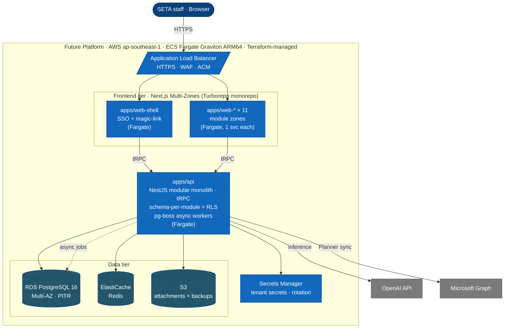
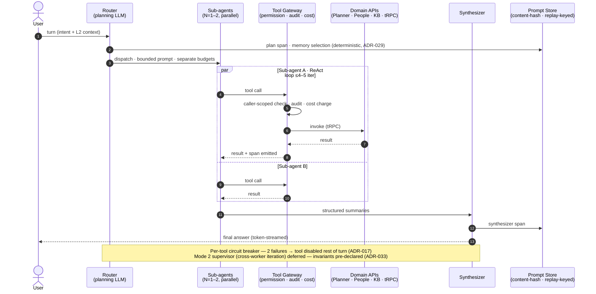
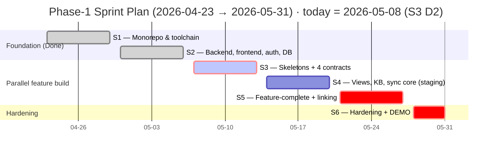

# Seta Future — Phase-1 Kickoff Signoff

| Field             | Value                                                   |
| ----------------- | ------------------------------------------------------- |
| Document          | Project signoff for kickoff                             |
| For               | CEO · CTO · PMO                                         |
| Author            | Project Management Office                               |
| Kickoff (actual)  | **2026-04-23** (S1–S2 complete on provisional approval) |
| First demo        | **2026-05-20** (interim · end of S4)                    |
| MVP demonstration | **2026-05-31** (staging only · 6-week window)           |

## 1. The Ask

### 1.1 Why this matters to SETA

- **Task & plan management** — plans, buckets, tasks, evidence-backed completion, 4 views, 4 personal hubs, bidirectional M365 Planner sync (detail in §5.1).
- **AI assistant for every employee** — KB Q&A with citations, "my overdue tasks / why at-risk" answers, scheduled digests, approval-inbox-mediated writes, four-axis cost ceilings.
- **Proves AI-leveraged velocity** — 2 non-trivial modules in 6 weeks with 6 FTE; S3 retro burn is the board-facing artefact for the rest of the SETA ecosystem build.
- **Builds the platform core once** — kernel/RLS, identity, multi-tenancy, approval inbox, agent runtime, audit/replay, M365 connector, Terraform. Every later module (people · time · hiring · performance · projects · finance · goals) plugs in.
- **SETA-internal pilot, staging only at MVP** — production cutover and external-tenant surface are post-MVP gates.

---

## 2. Architecture at a Glance

**Invariants.** Every table carries `tenant_id` with **RLS at the DB layer** · zones never query the DB directly (all data via tRPC) · **Terraform-only** infrastructure, no manual console changes · **ARM64 only** · secrets in AWS Secrets Manager.

---

## 3. Scope — What Ships by 2026-05-31

### 3.1 Committed deliverables (in scope)

| Workstream                          | Headline                                                                                                                                       |
| ----------------------------------- | ---------------------------------------------------------------------------------------------------------------------------------------------- |
| **Agents module** _(detail in §4)_  | Conversational AI assistant — KB Q&A, role-scoped analysis, scheduled digests, approval-inbox-mediated writes, four-axis cost ceilings         |
| **Planner module** _(detail in §5)_ | Plans/buckets/tasks, evidence-backed completion, 4 view modes, 4 personal hubs, **bidirectional Microsoft 365 Planner sync** with conflict log |

### 3.2 Acceptance criteria — demo on 2026-05-31

Live, end-to-end run on real SETA data **on the staging environment only** — no production deployment in Phase-1. Production cutover, agent write activation (Agents SAD §9.3), and full Planner launch (2026-06-08, Planner SAD §9.1) are post-MVP gates.

1. Magic-link or SSO login via Entra SSO.
2. **Plan & task management** — create plan + buckets + tasks (assignees · dates · labels · checklists · attachments); render Board, Grid, Charts, and Schedule views; My Day + My Tasks hubs load under caller scope.
3. **Mark task complete with evidence** → approval inbox → approve → propagates to M365 Planner via bidirectional sync; sync conflict surfaces in log with field-level diff.
4. **AI — KB Q&A** with handbook citations — ≥80% accuracy on a held-out rubric.
5. **AI — conversational Planner query & analysis** — natural-language questions on tasks, workload, and plan health, plus role-scoped throughput / balance / cross-team risk. Agent reads under caller scope, k-anonymity floor on team views, cites tasks.
6. **AI — inline copilot** in Planner with auto screen context; daily digest subscription delivers next business day.
7. **AI — conversational Planner control** — user issues task intents in natural language (create, update, reassign, reschedule, mark complete with evidence). Agent translates intent into a structured Planner write, routes through the approval inbox, executes on user approval under caller scope, and propagates to M365.
8. **Multi-tenant probe** — second tenant cannot see tenant 1's data; leak canary green.
9. **Failure modes** — cost-ceiling tripwire fires; KB miss returns plain-language refusal; sync retries idempotent.
10. Admin surfaces: sync-health · conflict log · cost ledger · audit query.

**Gates:** Board p95 ≤ 400 ms · My Tasks p95 ≤ 1.0 s · agent answer p95 ≤ 8 s · zero leak canary failures.

**Quality bar:** **≥70% unit-test coverage** across lines, functions, and branches (CI-blocking — TDD per CLAUDE.md) · **main user flows covered by Playwright E2E (~20% of test surface)** — login + magic link, KB Q&A with citations, Planner task → evidence → approval → M365 sync, multi-tenant isolation probe.

**Security gate (before staging hosts real data):** secrets in AWS Secrets Manager · RLS policy-coverage test green · dep/container scan clean of criticals · M365 tokens encrypted with rotation · staff comms sent. Pen-test, DPIA, GDPR erasure → post-MVP.

### 3.3 Out of scope — programme-wide

Module-specific cuts in §4.3 and §5.2.

- **Other domain modules** — people, time, hiring, performance, projects, finance, goals
- **Manager / team-lead dashboards** and at-risk alerts
- **Meeting-transcript → plan conversion** (auto-generate plans/tasks from meeting scripts) — Phase-1.5 candidate
- **Multi-language UI · native mobile · multi-region · cross-tenant collab**
- **Slack / Teams chat surfaces · Outlook calendar**
- **External tenant onboarding** — SETA-internal pilot only

### 3.4 What 2026-05-31 is — and is not

| ✅ It is                                            | ❌ It is not                                  |
| --------------------------------------------------- | --------------------------------------------- |
| MVP demonstration on real SETA data                 | General Availability                          |
| Deployed to staging only                            | Deployed to production                        |
| PMO performance-evaluation anchor for the programme | External pilot launch                         |
| Foundation for the post-MVP Phase-1 GA gate         | An all-modules platform                       |
| Internal-use ready (SETA staff, existing privacy)   | External-tenant ready (GDPR erasure required) |

---

## 4. Agents Module — Detailed Scope

Conversational AI assistant for every SETA employee. **MVP scope:** question-answering, role-scoped insights, and constrained writes (own-scope only, every write routed through the approval inbox). Autonomous writes are out.

The **approval inbox** is the safety mechanic: writes either preview inline (single-target) or route through the inbox (bulk, cross-target, destructive, or any write after free-text input). On approval, preconditions revalidate before execution; narrowed permissions fail the write with a structured event — never silently.

### 4.1 Runtime architecture — one turn, end to end

One turn = one Router plan up front, 1–2 sub-agents in parallel, one Synthesizer at the end. Every tool call traverses a single non-skippable **Tool Gateway** (permission · audit · cost). Every LLM call is recorded in the replay-keyed **Prompt Store** — any past turn reconstructable from its trace ID.

### 4.2 MVP capability buckets

| Capability                   | What it does                                                                                                                                                              |
| ---------------------------- | ------------------------------------------------------------------------------------------------------------------------------------------------------------------------- |
| **Conversational surface**   | Global chat plus inline copilot inside Planner; per-user threads with streaming responses                                                                                 |
| **Knowledge base Q&A**       | Ingest tenant handbooks / docs (Markdown · PDF · text); answer with citations; admin upload, edit, deprecate, re-index                                                    |
| **Planner query & analysis** | Natural-language questions on tasks, workload, plan health; role-scoped views (IC throughput · team-lead balance · org-leader cross-team risk) with k-anonymity on teams  |
| **Planner control (write)**  | Natural-language task intents → structured Planner write → routed through approval inbox → executed under caller scope on approval. Never silent, never autonomous at MVP |
| **Scheduled digests**        | Opt-in morning brief · end-of-week status · stale-task nudges · at-risk alerts. Read-only or inbox-draft only                                                             |
| **Cost & governance**        | Four-axis USD ceilings (per turn · user-day · tenant-day · delegation); admin controls model, ceilings, schedules, tool visibility                                        |
| **Audit & replay**           | Caller-identity audit on every action; deterministic replay from trace ID; plain-language refusal with reason (budget / unavailable / refused)                            |

_Internals (Router / sub-agents / Synthesizer · layered memory · ReAct loops · circuit breakers) are specified in the Agents SAD; FR-level refs in the SDLC traceability matrix._

### 4.3 Agents-specific deferrals

- **Cross-conversation memory** — within-conversation context only (no "you said X yesterday")
- **Autonomous writes** — scheduled / event-triggered runs cannot write without inbox approval
- **Event-triggered runs** — cron only at MVP; outbox-event subscriptions pre-designed, not wired
- **Meeting-transcript → plan conversion** — auto-generation of plans/tasks from meeting scripts is Phase-1.5
- **Image / OCR ingestion** — text KB only
- **Multi-provider routing** — single-provider (OpenAI); abstraction is post-Phase-1
- **LLM-as-judge gating** — deferred until ≥95% inter-rater corpus; deterministic scorers only

---

## 5. Planner Module — Detailed Scope

A work-tracking surface that **complements** Microsoft 365 Planner today and is positioned to **replace it** for tenants without an existing M365 investment — Future adds bidirectional sync, evidence-backed completion, personal hubs, and audit history that M365 Planner does not provide. Additional integrations (Trello, Asana, Jira) are post-MVP; the architecture is provider-agnostic by design.

### 5.1 MVP capability buckets

| Capability                  | What it does                                                                                                                                                                                |
| --------------------------- | ------------------------------------------------------------------------------------------------------------------------------------------------------------------------------------------- |
| **Plans, buckets, tasks**   | Team plans (multi-member) and personal plans (auto-provisioned, private); ordered buckets; tasks with assignees, dates, labels, checklists, attachments, comments; soft-delete + audit      |
| **Four view modes**         | Board (kanban) · Grid (sortable table) · Charts (by bucket / assignee / progress / priority) · Schedule (timeline by day / week / month). Single filter+search across all four. Not a Gantt |
| **Four personal hubs**      | My Day · My Tasks · Personal Charts · Carry-Over (auto roll-forward of unfinished pins)                                                                                                     |
| **Evidence model**          | First-class records (file · link · note); states unsubmitted / submitted / verified / rejected; tracked independently of task completion                                                    |
| **M365 bidirectional sync** | Tenant OAuth · adaptive pull + idempotent push · last-write-wins conflict log with both before-states · dry-preview on first sync · credential revoke pauses sync within one cycle          |
| **Admin surface**           | M365 connect / disconnect · conflict log with field-level diff and per-task force-resync · "what changed and why" query · daily sync-health summary · attachment quotas                     |

_Field-level limits, FR-PL refs, plan-type fixing, and Graph delta-query specifics are in the Planner SAD._

### 5.2 Planner-specific deferrals

- **M365 Planner Premium-tier** — custom fields, conditional colouring, People view, sprints/backlog, custom calendars, M365 Copilot, rich-text
- **Gantt** — no dependencies, critical path, or milestones (Schedule = timeline-by-date)
- **Real-time presence / cursors** — async only
- **AI reminders / EOD digests** — live in **Agents**, not Planner
- **Attachment processing** — no OCR, virus scan, or redaction
- **Per-field merge** — last-write-wins fixed
- **Copy/template · Excel/CSV export · per-bucket colour** — Phase-1.5 candidates
- **Push channels** — pull-only; no WebSocket / SSE
- **Other task systems** — M365 only (no Asana / Trello / Jira)

### 5.3 Hard external dependencies

| Dependency                                                | Owner             | Deadline       |
| --------------------------------------------------------- | ----------------- | -------------- |
| M365 sandbox tenant + Entra admin consent + Graph scopes  | SETA IT           | **2026-05-08** |
| Secrets manager with online rotation for M365 credentials | Platform Security | S3             |
| Identity directory sync (users, groups)                   | Identity / People | S3 D1 (05-07)  |

---

## 6. Timeline — Six One-Week Sprints

| Sprint | Window                 | Goal                                                                                                              | Gate                           |
| ------ | ---------------------- | ----------------------------------------------------------------------------------------------------------------- | ------------------------------ |
| ~~S1~~ | 04-23 → 04-29          | Monorepo + toolchain — **Done**                                                                                   | —                              |
| ~~S2~~ | 04-30 → 05-06          | Backend, frontend, auth, DB skeletons + SSO — **Done**                                                            | —                              |
| **S3** | 05-07 → 05-13          | Staging deployable · People + Planner CRUD + Agents chat skeleton · **4 cross-module API contracts locked Day 1** | **Velocity re-baseline retro** |
| **S4** | 05-14 → 05-20          | Planner views + hubs + sync core · Agents KB + retrieval-augmented Q&A + write/execute mode · staging hardened    | **First demo — 2026-05-20**    |
| **S5** | 05-21 → 05-27          | **MVP feature-complete + linking · code freeze at S5 close**                                                      | Go / no-go gate for S6         |
| **S6** | 05-28 → 05-31 (4 days) | **Hardening only** — bug fixes, performance / accessibility, security, demo prep, requirements-traceability check | **MVP demo — 2026-05-31**      |

### 6.1 Load-bearing dates

If any slips, the demo slips.

- **S3 D2 (05-08).** M365 sandbox + Entra consent + Graph scopes (SETA IT); KB ingestion pipeline complete (Agents track).
- **S3 retro (05-13).** Velocity re-baseline — target ~45 SP/eng/sprint; below plan → §6.2 cut order applies.
- **End of S4 (05-20).** **First demo** — interim walkthrough on staging; Planner views + hubs + KB Q&A working end-to-end. Surfaces gaps before code freeze.
- **End of S5 (05-27).** Code freeze. Linking complete; integration smoke must be green or S6 hardening cannot land the demo.

### 6.2 Phase-1.5 cut order (pre-agreed, applies at S3 retro)

Apply in order until scope fits velocity: (1) scheduled digests · (2) bidirectional sync → one-way push · (3) Charts + Schedule views · (4) Personal Charts hub · (5) agent writes (already gated in Agents SAD §9.3).

### 6.3 Why one-week sprints

Six checkpoints, not three. AI-leveraged velocity (~45 SP/eng/sprint) is a forecast — S3 retro re-baselines from real burn. Two-week sprints would only surface the miss at week 5; too late to cut.

---

## 7. Team — 6.0 FTE for 6 weeks

| Role             | Allocation              | Status                                      | Owns                                                                                                                 |
| ---------------- | ----------------------- | ------------------------------------------- | -------------------------------------------------------------------------------------------------------------------- |
| Planner Module   | 1 fullstack             | Existing 0.5 + need to hire 0.5             | Plans/tasks/evidence → views/hubs → M365 sync → linking · web-admin Planner surfaces · People exact-subject resolver |
| Agents Module    | 1 AI + 1 fullstack      | Existing 1 AI · need to hire 1 fullstack    | Chat → KB + writes via approval inbox → admin/governance → linking · web-admin KB surfaces                           |
| Deployment       | 1 DevOps                | Existing **(needs IT support)**             | Staging environment · web-shell SSO + magic-link · dual-tenant probe                                                 |
| **QA Engineer**  | 1.0 FTE                 | **To hire — onboard immediately**           | Manual + exploratory · regression · launch-gate verification                                                         |
| Business Analyst | 0.5 FTE                 | Existing                                    | Requirements · acceptance · traceability · pilot feedback · **doc work-stream owner**                                |
| Scrum Master     | 0.5 FTE                 | **To hire — onboard immediately**           | Cadence · retros · impediments · velocity                                                                            |
| **Total**        | **6.0 FTE for 6 weeks** | **To hire — 1.5 fullstack + 1 QA + 0.5 SM** |                                                                                                                      |

**Bus factor.** Planner = single fullstack; Agents = single AI engineer. Either absence > 3 days → §6.2 cut activates (see §8 R3, R4).

**Enabling support (not against capacity):** IT/DevOps provides AWS, DNS, certs, M365 sandbox + Entra consent, shared Terraform + IAM. All pre-kickoff.

---

## 8. Risks That Bear on Scope or Timeline

The six below need a CEO/CTO/PMO ruling **before** signoff. Full register in the board paper.

| #   | Risk                                                                           | P/I   | Mitigation / Action                                                                                                             |
| --- | ------------------------------------------------------------------------------ | ----- | ------------------------------------------------------------------------------------------------------------------------------- |
| R1  | AI-leveraged velocity (~45 SP/eng/sprint) is a forecast, not measured          | M / H | S3 retro re-baselines from real burn; below forecast → §6.2 cut order                                                           |
| R2  | Hires not yet onboard (1.5 FS + 1 QA + 0.5 SM) — already late vs. 05-07 target | H / H | Onboard immediately; each week of FS slip ≈ one §6.2 cut                                                                        |
| R3  | Single-fullstack Planner — bus factor                                          | M / H | PR reviewer named; absence > 3 days → §6.2 cut #2                                                                               |
| R4  | Single-AI-engineer Agents — bus factor                                         | M / H | FS cross-trained on chat + KB in S2; AI absence > 3 days → reduce Agents to KB Q&A + chat (drop Planner analysis + writes)      |
| R5  | M365 Graph throttling untested at SETA scale                                   | M / M | S4 backfill rehearsal (Planner SAD §9.2); adaptive cadence + pre-flight limits                                                  |
| R6  | S5 overload — feature-complete + linking same week                             | M / H | Code-freeze threshold mid-week; if behind, late-cut Planner UI polish + Agents model-degradation ladder (per SDLC plan risk #9) |

---

## 9. Budget — Cloud + AI Envelope

| Line item                                                                                             | USD/month   | Status           |
| ----------------------------------------------------------------------------------------------------- | ----------- | ---------------- |
| AWS infrastructure — staging during MVP (~$127); prod (~$349) activates at post-MVP cutover           | ~$476 (GA)  | Budgeted         |
| Claude Code Max subscriptions (developer tooling)                                                     | ~$220       | Budgeted         |
| OpenAI inference — SETA-scale forecast (300 staff · ~10 turns/user/day · 4-axis cost ceilings active) | ~$880       | Budgeted         |
| Team payroll (6.0 FTE × 6 weeks)                                                                      | (existing)  | Already approved |
| **Recommended monthly operating envelope (cap)**                                                      | **~$2,100** | **Approve**      |

One-offs: M365 sandbox (zero marginal); KB ingestion of SETA corpus (~$0.20).

**Variance trigger:** per-tenant ≥ 2× ceiling on rolling 7-day → budget review; ≥ 3× → admin alert + pricing review.

---

## 10. Decisions Required — Sign by 2026-05-13 (S3 retro)

S1–S2 were executed on provisional approval. Signing now **ratifies that work and authorises S3–S6**. Latest defensible signoff is the **S3 retro on 2026-05-13** — beyond that, the §6.2 cut order applies without re-escalation.

By signing, approvers confirm each of:

1. **Ratify** the 2026-04-23 commencement and the S1–S2 work delivered on provisional approval.
2. **Authorise S3–S6** with the scope, timeline, team, and budget above.
3. **Authorise outstanding hires immediately** — 1.5 fullstack + 1 QA + 0.5 SM. **Any further hiring delay slips the timeline** (already late vs. original ≤ 2026-05-07 target — see R2). Each week of slip on FS hire ≈ one cut from §6.2.
4. **Confirm M365 dependency** — sandbox + Entra consent + Graph scopes due **today, 2026-05-08** (S3 D2). Slip → §6.2 cut #2 (sync → one-way push) activates.
5. **Confirm work-stream fold-ins** per §7 (People · web-admin · web-shell · Documentation). 6.0 FTE assumes these; reject → scope re-baselines.
6. **Ring-fence the team** for the remaining four sprints — no client-services pulls. AI-velocity bet is void otherwise.
7. **Pre-agree the §6.2 cut order** — applies at S3 retro without further escalation.
8. **Acknowledge agile delivery** — scope may be refined mid-sprint for clarity, quality, or improvement opportunities surfaced during implementation. **Material changes (in/out of §3.1, demo-affecting) are communicated to CEO/CTO/PMO within 24h** with rationale and impact; non-material refinements land in the sprint demo.
9. **Acknowledge** 2026-05-31 = MVP demo on **staging**, not GA. Production cutover, agent writes (Agents SAD §9.3), and Planner launch (2026-06-08, Planner SAD §9.1) are post-MVP gates.

---

## 11. Sign-off

| Role     | Name         | Signature | Date       |
| -------- | ------------ | --------- | ---------- |
| CEO      | Hung Vu      |           | YYYY-MM-DD |
| CTO      | Thu Mai      |           | YYYY-MM-DD |
| PMO Lead | Hoang Nguyen |           | YYYY-MM-DD |
