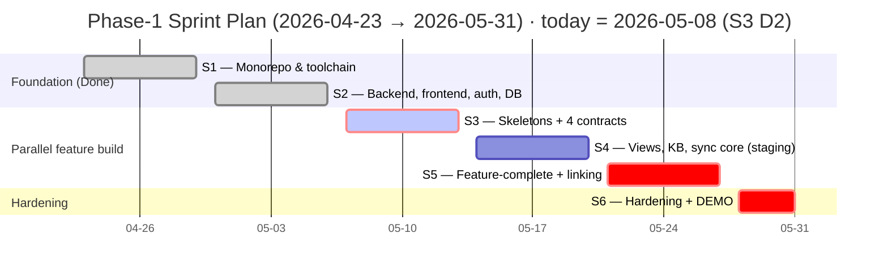
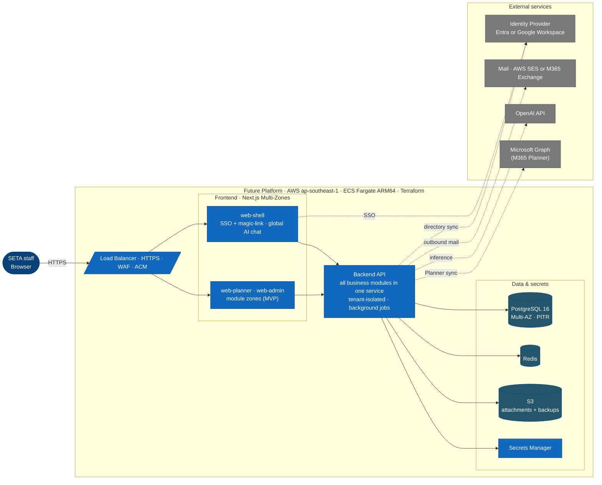
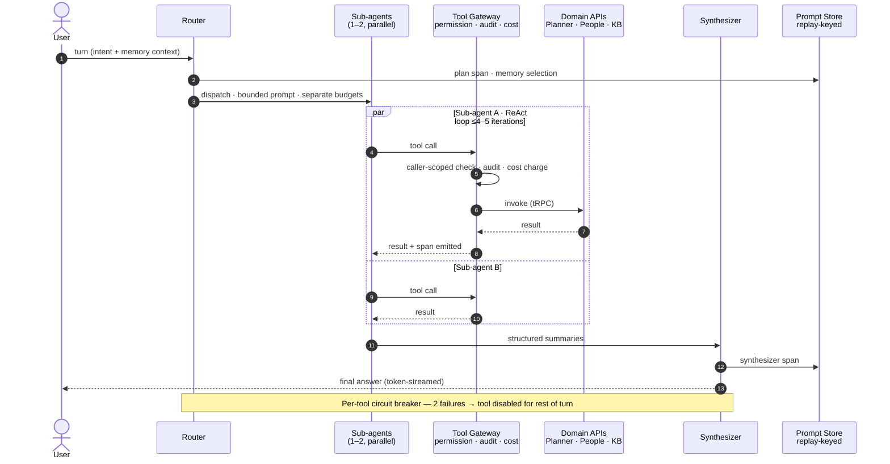

# Seta Future — Phase-1 Kickoff Signoff

| Field             | Value                                                   |
| ----------------- | ------------------------------------------------------- |
| Document          | Project signoff for kickoff                             |
| For               | CEO · CTO · PMO                                         |
| Author            | Project Management Office                               |
| Kickoff (actual)  | **2026-04-23** (S1–S2 complete on provisional approval) |
| First demo        | **2026-05-20** (interim · end of S4)                    |
| MVP demonstration | **2026-05-31** (staging only · 6-week window)           |

## 1. Why this matters

Ship Future Phase-1 MVP — **Planner** + **Agents** + platform core — on staging by **2026-05-31** with 6.0 FTE in 6 weeks.

| Problem today                                                                             | Outcome at MVP                                                                                                                                   |
| ----------------------------------------------------------------------------------------- | ------------------------------------------------------------------------------------------------------------------------------------------------ |
| Project data is siloed — each SETA project runs its own tools, no shared truth            | **Single source of truth** across modules — people, tasks, plans, evidence, audit all live in one tenant-scoped platform                         |
| **No company-wide task management** — management has no cross-team visibility, no roll-up | **Unified task management** — plans/tasks/evidence + role-scoped views (IC throughput · team-lead balance · org-leader cross-team risk)          |
| M365 Planner has no evidence, personal hubs, audit history                                | Evidence-backed completion · 4 personal hubs · audit · bidirectional M365 sync                                                                   |
| No governed AI surface for staff                                                          | **AI-as-a-Service** for every employee — KB Q&A with citations · role-scoped Planner analysis · natural-language task control via approval inbox |
| AI-leveraged delivery velocity is unmeasured                                              | S3 retro re-baselines burn (~45 SP/eng/sprint forecast) — sizing artefact for the rest of the build                                              |
| Every later module would re-solve identity, tenancy, audit                                | Platform core (kernel/RLS · identity · approval inbox · agent runtime · M365 connector) built once                                               |

---

## 2. Scope — What Ships by 2026-05-31

Two modules in scope: **Agents** (§9) and **Planner** (§10). Out of scope is the inverse — module-specific cuts in §9.3 and §10.2; programme-wide cuts cover other domain modules, manager dashboards, multi-language UI, native mobile, multi-region, Slack/Teams/Outlook, external tenants.

### 2.1 Acceptance criteria — demo on 2026-05-31

Live, end-to-end run on real SETA data on staging (post-MVP gates: §2.2).

1. SSO + magic-link login (Entra).
2. **Plan & tasks** — CRUD with assignees / dates / labels / checklists / attachments; Board · Grid · Charts · Schedule views; My Day + My Tasks hubs.
3. **Evidence flow** — complete-with-evidence → approval inbox → M365 sync; conflicts logged with field-level diff.
4. **AI — KB Q&A** with citations, ≥80% rubric accuracy.
5. **AI — Planner analysis** — natural-language queries, role-scoped views, k-anonymity, cites tasks.
6. **AI — inline copilot** + daily digest (next business day).
7. **AI — Planner control** — natural-language intent → write → inbox → approval → M365.
8. **Multi-tenant probe** — leak canary green.
9. **Failure modes** — cost-ceiling tripwire, KB-miss refusal, idempotent sync retries.
10. **Admin** — sync-health · conflict log · cost ledger · audit query.

**Perf gates:** Board p95 ≤ 400 ms · My Tasks p95 ≤ 1.0 s · agent p95 ≤ 8 s · zero leak.
**Quality:** ≥70% unit coverage (CI-blocking) + Playwright E2E on the four golden flows (login · KB Q&A · evidence→approval→sync · tenant isolation).
**Security:** secrets in AWS Secrets Manager · RLS coverage green · dep/container scans clean · M365 tokens encrypted+rotating · staff comms sent.

### 2.2 What 2026-05-31 is — and is not

| ✅ It is                                 | ❌ It is not                         |
| ---------------------------------------- | ------------------------------------ |
| MVP demo on real SETA data, staging only | GA · production · external pilot     |
| Internal-use ready (SETA staff)          | External-tenant ready (GDPR erasure) |
| PMO performance anchor for the programme | An all-modules platform              |

Post-MVP gates: production cutover · agent writes (Agents SAD §9.3) · Planner launch 2026-06-08 (Planner SAD §9.1).

---

## 3. Timeline — Six One-Week Sprints

| Sprint | Window        | Goal                                                                                 | Gate                       |
| ------ | ------------- | ------------------------------------------------------------------------------------ | -------------------------- |
| ~~S1~~ | 04-23 → 04-29 | Monorepo + toolchain — **Done**                                                      | —                          |
| ~~S2~~ | 04-30 → 05-06 | Backend / frontend / auth / DB skeletons + SSO — **Done**                            | —                          |
| **S3** | 05-07 → 05-13 | Staging deployable · Planner CRUD · Agents chat skeleton · 4 contracts D1            | Velocity re-baseline retro |
| **S4** | 05-14 → 05-20 | Planner views + hubs + sync · Agents KB + Q&A + write mode · staging hardened        | First demo — 2026-05-20    |
| **S5** | 05-21 → 05-27 | Feature-complete + linking · freeze at S5 close                                      | Go / no-go for S6          |
| **S6** | 05-28 → 05-31 | Hardening only — bugs, performance, accessibility, security, demo prep, traceability | MVP demo — 2026-05-31      |

### 3.1 Load-bearing date not on the gantt

**S3 D2 (05-08)** — M365 sandbox + Entra consent + Graph scopes (SETA IT); KB ingestion pipeline complete. Slips here cascade through S3 retro, first demo, and freeze.

### 3.2 Phase-1.5 cut order (pre-agreed, applies at S3 retro)

Apply in order until scope fits velocity: (1) scheduled digests · (2) bidirectional sync → one-way push · (3) Charts + Schedule views · (4) Personal Charts hub · (5) agent writes (already gated in Agents SAD §9.3).

---

## 4. Team — 6.0 FTE for 6 weeks

| Role             | FTE                | Status                                               | Owns                                                       |
| ---------------- | ------------------ | ---------------------------------------------------- | ---------------------------------------------------------- |
| Planner Module   | 1 fullstack        | 0.5 existing + 0.5 to hire                           | Plans/tasks/evidence → views/hubs → M365 sync → linking    |
| Agents Module    | 1 AI + 1 fullstack | 1 AI existing · 1 fullstack to hire                  | Chat → KB → writes via inbox → admin/governance → linking  |
| Deployment       | 1 DevOps           | Existing (needs IT support)                          | Staging · web-shell SSO + magic-link · dual-tenant probe   |
| QA Engineer      | 1.0                | **To hire — onboard now**                            | Manual / exploratory / regression / launch-gate            |
| Business Analyst | 0.5                | Existing                                             | Requirements · acceptance · traceability · doc work-stream |
| Scrum Master     | 0.5                | **To hire — onboard now**                            | Cadence · retros · impediments · velocity                  |
| **Total**        | **6.0**            | **To hire: 1.5 fullstack + 1 QA + 0.5 Scrum Master** |                                                            |

**Enabling support:** IT/DevOps provides AWS, DNS, certs, M365 sandbox + Entra consent, shared Terraform + IAM.

---

## 5. Budget — Cloud + AI Envelope

| Line item                                                  | USD/month   | Status           |
| ---------------------------------------------------------- | ----------- | ---------------- |
| AWS — staging $127 + prod $349 (post-MVP)                  | ~$476 (GA)  | Budgeted         |
| Claude Code Max (developer tooling)                        | ~$220       | Budgeted         |
| OpenAI inference — 300 staff · ~10 turns/day · 4-axis caps | ~$880       | Budgeted         |
| Team payroll (6.0 FTE × 6 weeks)                           | (existing)  | Already approved |
| **Monthly envelope (cap)**                                 | **~$2,100** | **Approve**      |

One-offs: M365 sandbox (zero); KB ingestion (~$0.20). **Variance:** ≥2× ceiling 7-day → review; ≥3× → admin alert.

---

## 6. Risks That Bear on Scope or Timeline

Each row needs a CEO/CTO/PMO ruling before signoff. Full register in the board paper.

| #   | Risk                                                           | P/I   | Mitigation                                                                           |
| --- | -------------------------------------------------------------- | ----- | ------------------------------------------------------------------------------------ |
| R1  | ~45 SP/eng/sprint velocity is forecast, not measured           | M / H | S3 retro re-baselines from real burn; under → §3.2 cut order                         |
| R2  | Hires (1.5 fullstack + 1 QA + 0.5 Scrum Master) late vs. 05-07 | H / H | Onboard now; each week of fullstack slip ≈ one §3.2 cut                              |
| R3  | Single-fullstack Planner — bus factor                          | M / H | PR reviewer named; >3-day absence → §3.2 cut #2                                      |
| R4  | Single-AI Agents — bus factor                                  | M / H | Fullstack cross-trained S2; >3-day AI absence → drop Agents to KB Q&A + chat         |
| R5  | M365 Graph throttling untested at SETA scale                   | M / M | S4 backfill rehearsal; adaptive cadence + pre-flight limits                          |
| R6  | S5 overload — feature-complete + linking same week             | M / H | Mid-week freeze threshold; behind → cut Planner UI polish + Agents model-degradation |

---

## 7. Asks to BOD — Sign by 2026-05-13 (S3 retro)

1. **Authorise** scope, timeline, team, and budget (§2, §3, §4, §5).
2. **Hires** — authorise 1.5 fullstack + 1 QA + 0.5 Scrum Master immediately (R2). Each week of fullstack slip ≈ one §3.2 cut.
3. **M365** — confirm sandbox + Entra consent + Graph scopes today, 2026-05-08. Slip → §3.2 cut #2 activates.
4. **Rule on §6 risks** — R2 (hires) and R5 (M365 throttling) are time-sensitive; the rest can be ruled at S3 retro.
5. **Acknowledge agile delivery.** Demo-affecting changes communicated to CEO/CTO/PMO within 24h; non-material refinements land in the sprint demo.

---

## 8. Architecture at a Glance

**Invariants.** Every table carries `tenant_id` with **RLS at the DB layer** · zones never query the DB directly (all data via tRPC) · **Terraform-only** infrastructure, no manual console changes · **ARM64 only** · secrets in AWS Secrets Manager.

---

## 9. Agents Module — Detailed Scope

### 9.1 Runtime architecture — one turn

Router plans → 1–2 sub-agents in parallel → Synthesizer. Every tool call goes through a non-skippable **Tool Gateway** (permission · audit · cost). Every LLM call lands in the replay-keyed **Prompt Store** — any past turn reconstructable by trace ID.

### 9.2 MVP capability buckets

| Capability                  | What it does                                                                                                       |
| --------------------------- | ------------------------------------------------------------------------------------------------------------------ |
| **Conversational surface**  | Global chat + inline Planner copilot; per-user threads with streaming                                              |
| **KB Q&A**                  | Ingest Markdown / PDF / text; cited answers; admin upload · edit · deprecate · re-index                            |
| **Planner query**           | Natural-language questions on tasks / workload / plan health; role-scoped views; k-anonymity on teams              |
| **Planner control (write)** | Natural-language intent → structured write → approval inbox → executed on approval. Never silent, never autonomous |
| **Scheduled digests**       | Opt-in morning brief · end-of-week status · stale-task nudges · at-risk alerts (read-only or inbox-draft)          |
| **Cost & governance**       | Four-axis USD ceilings (turn · user-day · tenant-day · delegation); admin controls model + visibility              |
| **Audit & replay**          | Caller-identity audit; deterministic replay from trace ID; plain-language refusal with reason                      |

_Router / sub-agents / Synthesizer / memory / ReAct / circuit-breaker internals: Agents SAD._

### 9.3 Agents-specific deferrals

- Cross-conversation memory (within-conversation only)
- Autonomous writes (all writes go through inbox approval)
- Event-triggered runs (cron only at MVP)
- Meeting-transcript → plan conversion (Phase-1.5)
- Image / OCR ingestion (text KB only)
- Multi-provider routing (OpenAI only)
- LLM-as-judge gating (deterministic scorers only)

---

## 10. Planner Module — Detailed Scope

Complements M365 Planner today and is positioned to replace it for non-M365 tenants. Future adds bidirectional sync, evidence-backed completion, personal hubs, and audit history M365 Planner doesn't provide. Architecture is provider-agnostic — Trello / Asana / Jira are post-MVP.

### 10.1 MVP capability buckets

| Capability                  | What it does                                                                                                                     |
| --------------------------- | -------------------------------------------------------------------------------------------------------------------------------- |
| **Plans / buckets / tasks** | Team + personal plans; ordered buckets; tasks (assignees, dates, labels, checklists, attachments, comments); soft-delete + audit |
| **Four views**              | Board · Grid · Charts · Schedule (day/week/month). Shared filter+search. Not a Gantt                                             |
| **Four personal hubs**      | My Day · My Tasks · Personal Charts · Carry-Over (auto roll-forward)                                                             |
| **Evidence**                | First-class records (file / link / note); unsubmitted → submitted → verified / rejected                                          |
| **M365 bidirectional sync** | Tenant OAuth; adaptive pull + idempotent push; last-write-wins conflict log; dry-preview; revoke pauses within 1 cycle           |
| **Admin**                   | Connect/disconnect · conflict log w/ field diff + force-resync · sync-health · attachment quotas                                 |

_Field limits, FR-PL refs, Graph delta specifics: Planner SAD._

### 10.2 Planner-specific deferrals

- M365 Planner Premium tier (custom fields, sprints, M365 Copilot, rich-text, etc.)
- Gantt (Schedule = timeline-by-date, no dependencies / critical path)
- Real-time presence / cursors (async only)
- AI reminders & digests (live in Agents)
- Attachment processing (no OCR / virus scan / redaction)
- Per-field merge (last-write-wins fixed)
- Copy/template · Excel/CSV export · per-bucket colour (Phase-1.5)
- Push channels (pull-only)
- Asana / Trello / Jira (M365 only at MVP)

### 10.3 Hard external dependencies

| Dependency                                                | Owner             | Deadline       |
| --------------------------------------------------------- | ----------------- | -------------- |
| M365 sandbox tenant + Entra admin consent + Graph scopes  | SETA IT           | **2026-05-08** |
| Secrets manager with online rotation for M365 credentials | Platform Security | S3             |
| Identity directory sync (users, groups)                   | Identity / People | S3 D1 (05-07)  |

---

## 11. Sign-off

| Role     | Name         | Signature | Date       |
| -------- | ------------ | --------- | ---------- |
| CEO      | Hung Vu      |           | 2026-05-08 |
| CTO      | Thu Mai      |           | 2026-05-08 |
| PMO Lead | Hoang Nguyen |           | 2026-05-08 |
