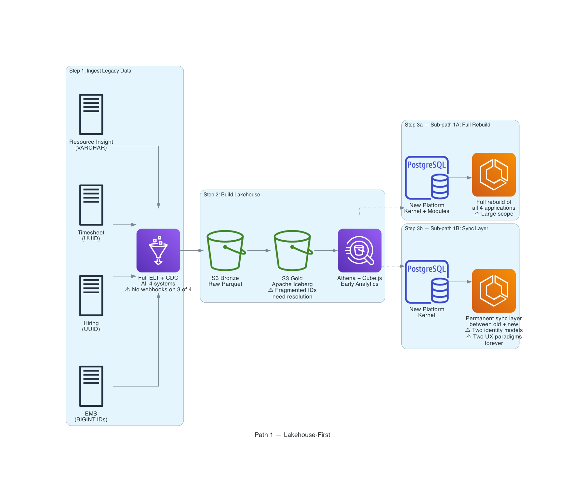
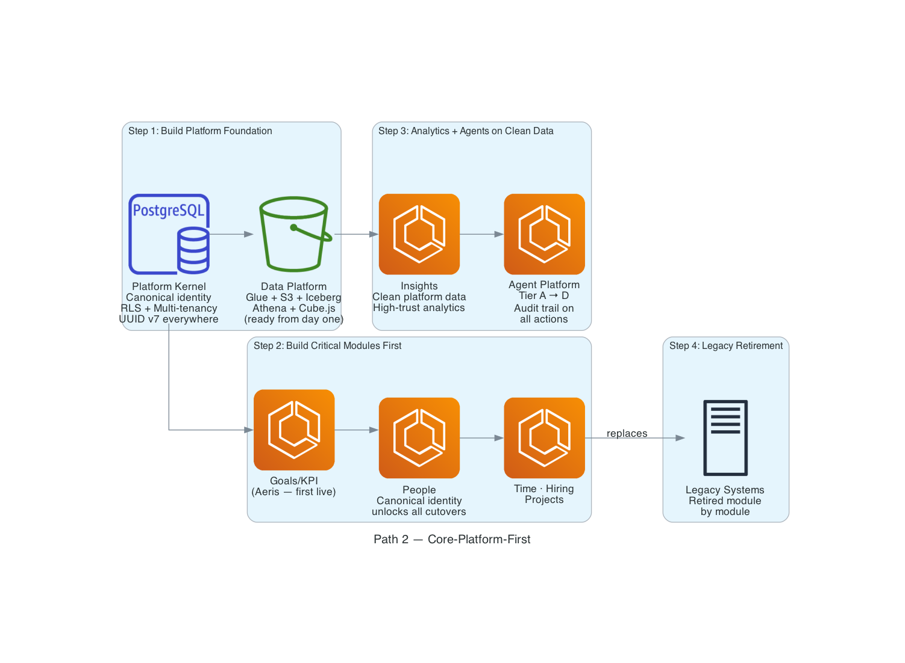
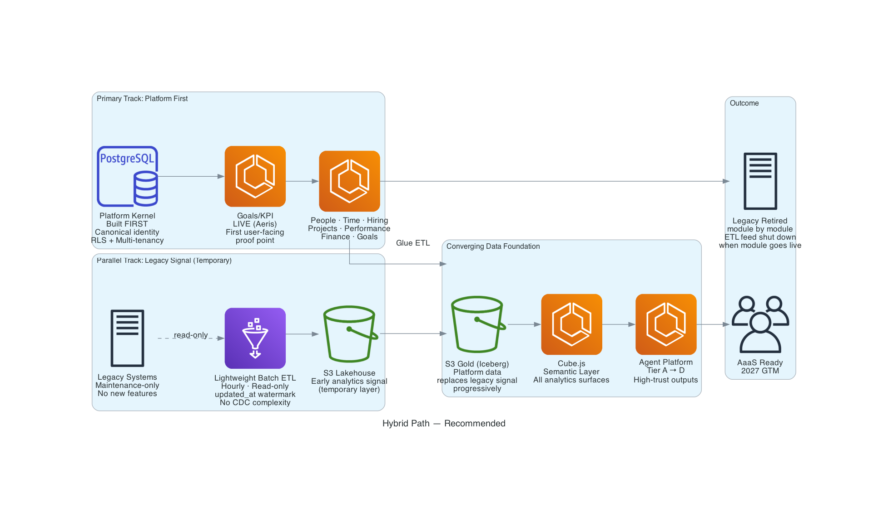
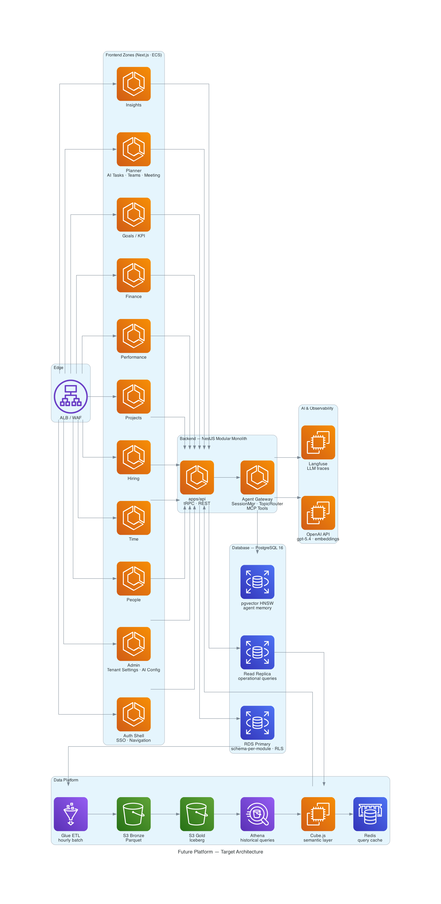
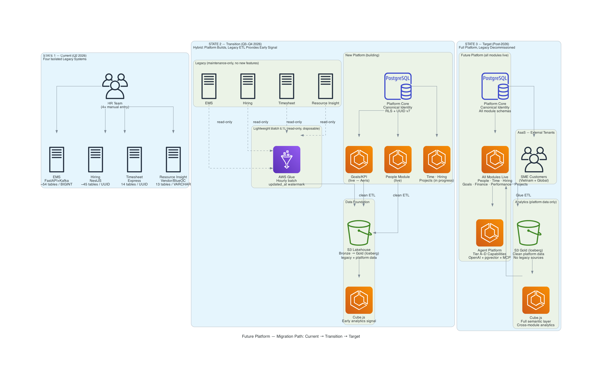
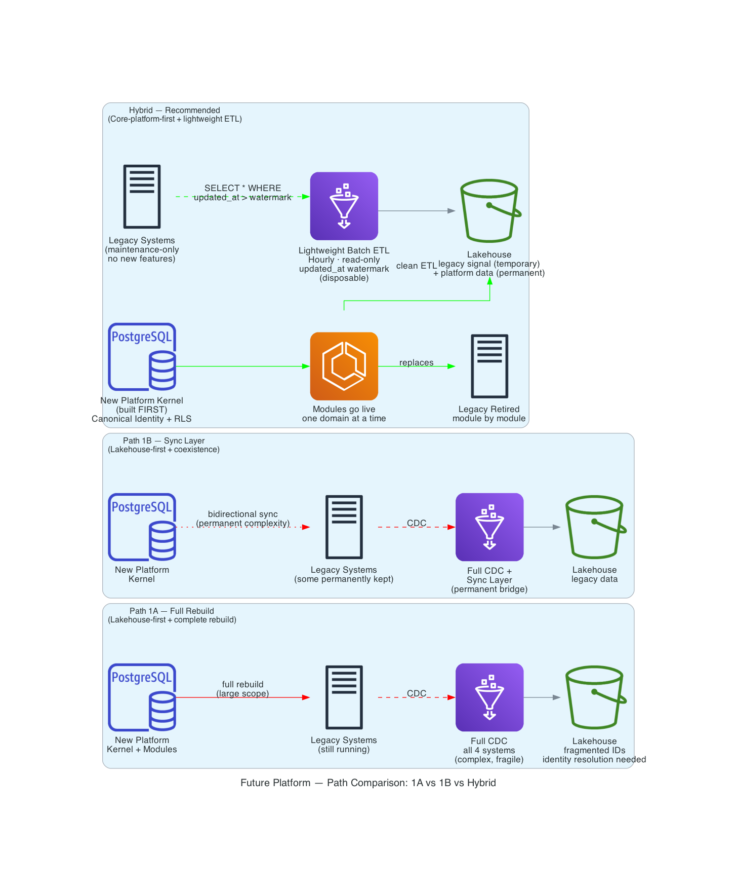
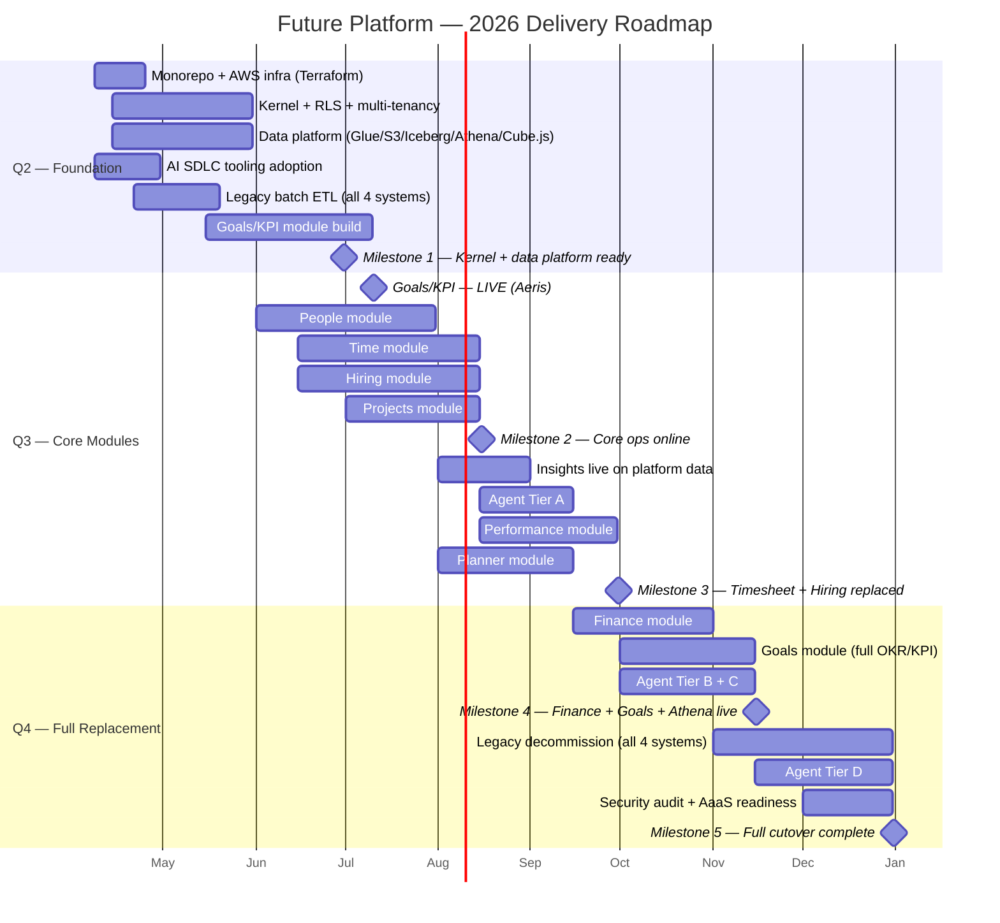

# Future Platform — Strategic Direction Proposal

## Table of Contents

1. [Current Situation](#1-current-situation)
2. [Strategic Options](#2-strategic-options)
3. [Comparison Matrix](#3-comparison-matrix)
4. [Recommendation Framework](#4-recommendation-framework)
5. [Target Architecture](#5-target-architecture)
6. [Migration Diagrams](#6-migration-diagrams)
7. [Phased Roadmap](#7-phased-roadmap)
8. [Team and Execution Feasibility](#8-team-and-execution-feasibility)
9. [AI Strategy](#9-ai-strategy)
10. [Risks and Mitigations](#10-risks-and-mitigations)
11. [Infrastructure Cost Estimate](#11-infrastructure-cost-estimate)
12. [Final Recommendation](#12-final-recommendation)
13. [Open Questions for Stakeholder Validation](#13-open-questions-for-stakeholder-validation)

---

## 1. Current Situation

### Current Architecture

The four legacy systems were built independently, with no shared identity or integration layer:

| System           | Stack                        | Tables | ID Scheme                           | Webhook Support   | Status                                                                               |
| ---------------- | ---------------------------- | ------ | ----------------------------------- | ----------------- | ------------------------------------------------------------------------------------ |
| EMS              | FastAPI + Kafka + PostgreSQL | ~54    | BIGINT auto-increment               | Yes (Kafka infra) | Production — employee master, contracts, offboarding, staffing, partner webhooks     |
| Hiring           | NestJS + AWS RDS             | ~45    | UUID                                | No                | Production — recruitment pipeline, interviews, talent pools, candidate deduplication |
| Timesheet        | Express + PostgreSQL         | ~14    | UUID (different namespace)          | No                | Production — attendance, leave ledger, approval chains, policy enforcement           |
| Resource Insight | FastAPI + PostgreSQL         | ~13    | VARCHAR (synced from Google Sheets) | No                | Production — performance reviews, dual-hierarchy reviewer routing, monthly scoring   |

A single employee exists as four unrelated records with four incompatible identifier formats. There is no programmatic join key. The question _"What is the OT pattern of employees currently under performance review?"_ cannot be answered without manual spreadsheet work.

### The Pain Points of the 4-App Legacy Landscape

| Pain Point                   | Description                                                                                                                                                                                | Consequence                                                        |
| ---------------------------- | ------------------------------------------------------------------------------------------------------------------------------------------------------------------------------------------ | ------------------------------------------------------------------ |
| **Operational inefficiency** | Every new hire requires manual entry across four systems. Every department transfer touches at least three.                                                                                | Cross-domain HR reports assembled by hand from spreadsheet exports |
| **Analytics ceiling**        | No cross-domain data model exists. Headcount, leave, performance, and recruitment cannot be analyzed together.                                                                             | Workforce intelligence is structurally incomplete                  |
| **AI readiness gap**         | Fragmented, inconsistently keyed data cannot support a trusted agent platform.                                                                                                             | Agents produce outputs that cannot be audited or explained         |
| **Platform debt**            | Four stacks, four migration tools, four deployment models.                                                                                                                                 | Maintenance burden grows every quarter; no capacity for new value  |
| **Cutover complexity**       | All four systems operationally active with non-trivial business rules: EMS contract versioning, Timesheet quotas/approvals, Hiring deduplication, Resource Insight dual-hierarchy routing. | Cutover is a behavioral parity exercise, not a data migration      |

### Assumptions

| Assumption                                                     | Status                                                        | Decision Required                                             |
| -------------------------------------------------------------- | ------------------------------------------------------------- | ------------------------------------------------------------- |
| Legacy systems will not receive new features during transition | Needs formal freeze decision                                  | Yes — who enforces, from what date                            |
| 60-minute analytics lag is acceptable                          | Confirmed by architecture decision                            | No                                                            |
| December 31, 2026 is the target deadline                       | Current commitment; Speed-First vs. Risk-First not yet chosen | Yes — directly affects cutover pace and Q4 pressure           |
| Goals/KPI is the first live module (Q3, July target)           | Committed to Aeris account; full OKR/KPI expands Q4           | No                                                            |
| Leadership accepts a Q2 "no visible user output" window        | Unavoidable; kernel and data platform built before modules    | No — but must be communicated proactively                     |
| The AI-assisted SDLC bet is sanctioned                         | Not yet formally endorsed                                     | Yes — without endorsement, team adoption will be inconsistent |

---

## 2. Strategic Options

### Path 1 — Data-First: Build Analytics Before the Platform

Pull data from all four legacy systems into a unified analytics layer early — cross-domain dashboards available before the new platform is ready.

**The continuation choice:**

- **Option A — Full Rebuild:** Replace all four applications on the new platform. Cleanest long-term outcome, largest scope.
- **Option B — Keep Some, Replace Some:** Bridge the new platform to legacy systems worth keeping. Reduces rebuild scope but creates a permanent maintenance obligation — two UX systems, two data models running side by side.

**Core risks:**

- Four incompatible ID formats — accurate cross-system identity resolution is never perfectly reliable. Analytics will have known gaps requiring ongoing reconciliation.
- Three systems have no integration interface; capturing live changes is brittle and breaks on upgrades.
- Team attention is split from day one. The analytics investment is in infrastructure retired once the platform is live — 12–18 month ROI window at most.

---

### Path 2 — Platform-First: Build the Foundation Before Analytics

Build the shared platform first — a single source of truth for identity, decisions, and workflows — then build modules on top in priority order. Analytics and AI come from clean platform data, not fragmented exports. Each module that goes live shuts down its legacy system. No bridges, no synchronization, no lingering debt.

**Trade-off:** No user-visible output for the first 2–3 months. Requires active expectation management with leadership.

**Core risks:**

- Invisible progress erodes confidence without clear milestone communication.
- Temptation to over-engineer the foundation before shipping anything. Hard delivery gates must be enforced.
- The longer the transition runs, the more data reconciliation is required at cutover time.

---

### Hybrid Path — Recommended

Platform-first as the primary investment. In parallel, a lightweight read-only batch feed from legacy gives early analytics visibility. Each time a module goes live, its legacy feed is retired and replaced by clean platform data.

This removes the biggest risk from each path: the analytics gap from Path 2, and the fragile legacy dependency from Path 1. The feed is intentionally minimal and time-bounded.

---

## 3. Comparison Matrix

| Dimension                                 |            Path 1 — Lakehouse-First            |     Path 2 — Core-Platform-First      |                **Hybrid (Recommended)**                |
| ----------------------------------------- | :--------------------------------------------: | :-----------------------------------: | :----------------------------------------------------: |
| **Strategic value**                       |                     Medium                     |                 High                  |                        **High**                        |
| **Time-to-first analytics**               |      Fast (legacy data visible in weeks)       |      Slow (modules needed first)      |        **Medium (lightweight ETL for signal)**         |
| **Architectural coherence**               |   Low (legacy fragmentation carries forward)   |  High (clean canonical from day one)  |                        **High**                        |
| **Analytics quality ceiling**             |        Low (bound by ID fragmentation)         |     High (clean, canonical data)      | **High (platform data progressively replaces legacy)** |
| **AI/agent readiness**                    |              Early but low-trust               |        Delayed but high-trust         |   **Pragmatic — expands with platform data quality**   |
| **Migration risk**                        |         High (CDC on 4 legacy systems)         |   Medium (module-by-module cutover)   |        **Low–medium (batch read-only, no CDC)**        |
| **Long-term maintainability**             |    Low (legacy pipelines become tech debt)     |                 High                  |                        **High**                        |
| **Scalability**                           |    Limited (bound by legacy schema design)     |   High (designed for multi-tenancy)   |                        **High**                        |
| **UX consistency**                        |    Low (mixed old/new UX, especially in 1B)    |      High (single design system)      |                        **High**                        |
| **Investment efficiency**                 |  Medium (some spend on disposable pipelines)   | High (every investment is permanent)  | **High (ETL investment is minimal and time-bounded)**  |
| **Dependency on legacy systems**          |   High (CDC keeps legacy as source of truth)   | Low (legacy runs but is not extended) |            **Low (batch ETL is read-only)**            |
| **AaaS readiness**                        | Low (requires rearchitect before external GTM) |     High (built in from day one)      |                        **High**                        |
| **Execution feasibility (4-person team)** |        Strained (team attention split)         |   Good (team focused on one track)    |     **Good (ETL is lightweight, focus preserved)**     |

---

## 4. Recommendation Framework

| Condition                                                      | Favors     |
| -------------------------------------------------------------- | ---------- |
| Cross-domain analytics is a leadership crisis today            | Path 1     |
| Legacy data quality is sufficient for identity resolution      | Path 1     |
| AaaS is a 3+ year horizon, not a 2027 constraint               | Path 1     |
| Platform quality and AaaS readiness are 2027 commitments       | Path 2     |
| Legacy data is too fragmented to produce trustworthy analytics | Path 2     |
| Team must stay focused to hit December 31, 2026                | Path 2     |
| Analytics gap is a known pain but not a crisis                 | **Hybrid** |
| 4-person team, hard deadline, AaaS ambition simultaneously     | **Hybrid** |

**The Hybrid captures the key benefit of each path without the principal risk of either:**

- Platform built correctly once — multi-tenancy and module isolation from day one
- Lightweight hourly batch ETL from legacy provides early analytics signal without CDC fragility
- Each module that goes live retires its legacy feed; platform data becomes authoritative progressively

---

## 5. Target Architecture

| Layer                   | What it is                                                                                 | Lifespan                                           | Business outcome                                                                                    |
| ----------------------- | ------------------------------------------------------------------------------------------ | -------------------------------------------------- | --------------------------------------------------------------------------------------------------- |
| **Legacy Systems**      | EMS, Hiring, Timesheet, Resource Insight — running as-is, no new features                  | Temporary — retired as each module replaces it     | No disruption to current users during transition                                                    |
| **Data Foundation**     | Unified analytics layer reading from legacy + platform, powering dashboards and AI context | Permanent — legacy feeds retire as modules go live | Cross-domain reports, leadership dashboards, historical trends from one source                      |
| **Platform Core**       | Single employee identity, permission model, approval workflows, and audit trail            | Permanent                                          | One employee record org-wide; every action traceable; AaaS foundation                               |
| **Business Modules**    | Goals/KPI, People, Time, Hiring, Projects, Performance, Finance, Planner, Insights         | Permanent                                          | Each module retires a legacy system; Insights provides customizable dashboards over Gold layer data |
| **AI & Agent Platform** | Governed, auditable AI assistants; capability expands in controlled tiers                  | Permanent, expands progressively                   | Automated workflows, intelligent recommendations; AaaS differentiator                               |

**AaaS readiness:** Adding an external customer is a configuration step, not an engineering project. The platform can be commercially packaged as soon as the first modules are mature internally.

### Business Modules

| Module          | Replaces                       | Key Capabilities                                                                                                                                                                                                                         | Key Integrations                                                                                                                                        |
| --------------- | ------------------------------ | ---------------------------------------------------------------------------------------------------------------------------------------------------------------------------------------------------------------------------------------- | ------------------------------------------------------------------------------------------------------------------------------------------------------- |
| **Goals / KPI** | Manual spreadsheets            | OKR tracking, KPI scoring, objective hierarchies, period-based review cycles                                                                                                                                                             | Planner (task-to-KPI linkage), Performance (evaluation input), Insights (KPI trend charts)                                                              |
| **People**      | EMS (employee records)         | Employee profiles, employment terms, org placements, contract management, offboarding                                                                                                                                                    | Kernel identity (`external_identity_map`), all modules (canonical actor reference)                                                                      |
| **Time**        | Timesheet App                  | Attendance ledger, leave management, overtime, monthly quota enforcement, two-stage approval chains                                                                                                                                      | People (identity), Goals (leave impact on KPI), Insights (leave utilization dashboards)                                                                 |
| **Hiring**      | Hiring App                     | Recruitment pipeline, candidate progression, interview scheduling, talent pools, deduplication, sourcing integrations (LinkedIn, CareerViet)                                                                                             | People (new hire handoff), Insights (hiring funnel dashboards)                                                                                          |
| **Projects**    | EMS (staffing)                 | Project staffing assignments, delivery tracking, project health, resource visibility                                                                                                                                                     | People (org placement), Performance (project-line review), Goals (project-linked OKRs)                                                                  |
| **Performance** | Resource Insight (BlueOC team) | Review cycles, evaluations, dual-hierarchy reviewer routing (org line + project line), weighted scoring, monthly submission windows                                                                                                      | People, Projects, Goals (evaluation feeds KPI scoring), Insights (performance trend charts)                                                             |
| **Finance**     | EMS (partial)                  | Invoices, payroll, budget tracking, cost allocation                                                                                                                                                                                      | People (payroll identity), Projects (project cost), Insights (invoice ageing, budget dashboards)                                                        |
| **Planner**     | — (net new)                    | Org-wide task and action tracking, AI-powered reminders, deadline risk detection, meeting action item extraction (read.ai style), drag-and-drop board/list views                                                                         | Teams (task creation via bot), Goals/KPI (task-to-KPI tagging), Insights (workload + completion analytics), Agent runtime (meeting extraction pipeline) |
| **Insights**    | — (net new)                    | Customizable dashboard builder (Jira-style), built-in per-module charts, widget catalog (line, bar, pie, heatmap, funnel, KPI card, table), pre-configured Gold layer datasets, cross-module dashboards, visibility and sharing controls | Cube.js semantic layer (all queries via tRPC proxy), all modules (data sources), Agent runtime (structured context for agents)                          |

---

## 6. Migration Diagrams

### Diagram 1 — Three-State Migration View

---

### Diagram 2 — Path Comparison: Full Rebuild (1A) vs. Sync Layer (1B) vs. Hybrid

---

## 7. Phased Roadmap

### Timeline Overview

---

### Phase 0 — Architecture Decision and Foundations (Q2 2026, Weeks 1–4)

**Purpose:** Close all open architectural decisions before writing production code. Establish the monorepo structure, CI/CD pipeline, AWS infrastructure baseline, and development tooling — including AI coding workflow standards.

**Expected Outcome:**

- Monorepo bootstrapped (Turborepo, Bun, Next.js multi-zones, NestJS, Drizzle)
- AWS infrastructure provisioned via Terraform (ECS Fargate ARM64, RDS PostgreSQL 16, S3 buckets, Glue jobs skeleton)
- Kernel schema authored and reviewed (actor, user_identity, role_grant, audit_event, outbox_event)
- Lightweight legacy ETL pipeline deployed (Glue → Bronze → Gold for EMS and Hiring as proof of concept)
- AI SDLC tooling adopted: Claude Code / Copilot configured for all engineers, prompt templates established, code review AI gates wired into CI

**Major Dependencies:** Final architecture decision approved by leadership; AWS account and network topology confirmed; legacy DB read access granted for ETL

**Key Risks:** Analysis paralysis on architecture decisions; infra setup taking longer than expected; legacy DB access permissions blocking ETL setup

**Decision Gate:** Team can write production code on the kernel. ETL pipeline is producing data in Athena. AI tooling is in daily use by all engineers.

---

### Phase 1 — Kernel and Platform Foundation (Q2 2026, Weeks 5–10)

**Purpose:** Build the Process Kernel to production quality — the single most important delivery in the entire project. Everything else depends on this being correct.

**Expected Outcome:**

- All kernel entities live and tested: `actor`, `user_identity`, `external_identity_map`, `department`, `role_grant`, `delegation`, `org_placement`, `decision_case/step/outcome`, `audit_event`, `outbox_event`, `visibility_scope`, `exposure_contract`
- Microsoft Entra OIDC authentication live (MSAL, `web-shell`)
- `KernelQueryFacade` implemented and enforced as the only cross-module import
- RLS enforced at DB layer for all kernel tables (`set_config` + `nestjs-cls`)
- Module boundary linting active (`eslint-plugin-boundaries`)
- Admin module live: tenant settings, module toggles, AI provider configuration
- Lightweight ETL expanded to all four legacy systems

**Major Dependencies:** Phase 0 complete; Microsoft Entra tenant configured; database schema decisions finalized

**Key Risks:** RLS implementation complexity; cross-module boundary discipline eroding under delivery pressure; `external_identity_map` design requiring iteration once legacy data shapes are fully understood

**Decision Gate:** At least two kernel modules have passed integration tests against real RLS-enforced data. First external identity resolution (EMS employee → canonical actor) is working.

---

### Phase 2 — Core Operations Modules (Q3 2026, targeting Milestone 2 by Aug 15)

**Purpose:** Deliver the four core operational modules covering the majority of SETA's daily workforce activity. Prove the platform works end-to-end under real usage. Begin retiring legacy systems.

**Priority Modules:**

1. **Goals/KPI** — first live module, committed to the Aeris account. Net-new capability with no legacy migration dependency — can go live on the platform without waiting for legacy data cutover. High leadership visibility; validates the platform for executive-facing use from day one.
2. **People** — canonical employee records, org placements, employment profiles. `external_identity_map` established here unlocks all subsequent legacy cutovers. Must be live before Time, Hiring, and Projects can fully migrate.
3. **Time** — attendance ledger, leave management, two-stage approval workflows, monthly quota enforcement. Replaces Timesheet App.
4. **Hiring** — recruitment pipeline, candidate progression, interviews, talent pool reuse, deduplication. Replaces Hiring App.
5. **Projects** — staffing assignments, delivery tracking. Feeds into Performance and Goals modules downstream.
6. **Planner** — org-wide task and action tracking, AI-powered reminders, and meeting action item extraction. Tasks can be tagged to KPI objectives and feed directly into Goals scoring. Integrates with Microsoft Teams (manual task creation via bot) and meeting intelligence (auto-extract action items from meeting transcripts, read.ai style). Task completion and workload data flows into the analytics pipeline.

**Expected Outcome:**

- Goals/KPI module live and in active use by Aeris; first real workflow running on Future — proof point for leadership
- People module live; `external_identity_map` bridging all four legacy ID schemes to canonical actor IDs
- Time module in active cutover; Timesheet App users migrated; carry-over rules and approval chains validated
- Hiring module live; talent pool and blacklist data reconciled; candidate deduplication logic verified
- Projects module live
- Planner module live; task completion and workload data flowing into Insights; KPI-linked tasks visible in Goals module
- Insights module live on real platform data (RDS read replica + Athena Gold layer); built-in dashboards per module and customizable layout builder available to all users
- Agent Tier A live: read-only Q&A over Goals/KPI, People, Time, and Hiring data; meeting action item extraction active
- Legacy ETL for People, Time, and Hiring retired from pipeline

**Major Dependencies:** Kernel from Phase 1; `external_identity_map` complete before any module cutover; BA-documented legacy business rules for Timesheet (quota rules, carry-over, two-stage approvals) and Hiring (deduplication, talent pool lifecycle) must be finalized before build starts

**Key Risks:** Timesheet behavioral parity is complex — monthly quotas, carry-over restrictions, two-stage approvals have edge cases not visible in database schema alone; Hiring deduplication logic has non-obvious rules; first real cutover taking longer than expected compresses Q4 schedule

**Decision Gate:** At least two legacy systems have an active cutover in progress. Parity proof floor met: identity parity, record counts reconciled, behavioral parity on core workflows, operator sign-off from HR and hiring teams.

---

### Phase 3 — Remaining Modules and Full Legacy Retirement (Q4 2026, targeting Milestone 4–5 by Nov 15 – Dec 31)

**Purpose:** Deliver the remaining domain modules and complete full legacy decommission by December 31, 2026.

**Priority Modules:**

1. **Performance** — replaces Resource Insight. Dual-hierarchy reviewer routing, weighted project scoring, monthly submission windows.
2. **Finance** — invoices, payroll, budget. Complex domain; requires dedicated BA engagement.
3. **Goals** — OKRs, KPIs, objectives, scoring. Cross-module dependencies on People, Performance, and Projects data.
4. Agent Tier B (draft actions, human approval required) and Tier C (approved autonomous execution) across all live modules.

**Expected Outcome:**

- Performance, Finance, and Goals modules live
- All four legacy systems decommissioned
- Agent Tier B and C live with full audit trail
- Full Athena lakehouse on clean platform data — no legacy ETL remaining

**Major Dependencies:** Phase 2 modules stable; Finance domain rules documented by BA; Goals requires People, Performance, and Projects data to be stable first

**Key Risks:** Finance complexity underestimated; Dec 31 deadline pressure causing parity shortcuts; Agent Tier C requiring more guardrail and observability work than estimated

**Decision Gate:** All legacy systems decommissioned. All SETA workflows confirmed on Future. Full parity proof floor met across all domains. Agent audit trail validated through Tier C.

---

### Phase 4 — Hardening and AaaS Readiness (Q1 2027)

**Purpose:** Harden for multi-tenancy, validate external tenant readiness, deliver Agent Tier D.

**Expected Outcome:**

- All ETL pipelines sourcing from platform data only
- Agent Tier D live: multi-step autonomous orchestration across modules
- Admin module polished for external tenant onboarding and self-service AI configuration
- Security audit and penetration test completed
- SLA instrumentation, alerting, and operational runbooks ready for external operations
- Platform commercially viable for first external customer engagement

**Major Dependencies:** All modules live and stable; full legacy decommission complete; security review process completed

**Key Risks:** Agent Tier D multi-step orchestration requires validated rollback mechanisms; external tenant onboarding surface requires polish beyond MVP quality

**Decision Gate:** First external tenant can be onboarded to Future without engineering intervention. Platform is commercially viable.

---

## 8. Team and Execution Feasibility

### Proposed Team Shape

| Role                   | FTE | Primary Responsibility                                     |
| ---------------------- | --- | ---------------------------------------------------------- |
| Fullstack Engineer × 2 | 2.0 | Platform kernel, domain modules, tRPC, Next.js zones       |
| AI Engineer            | 1.0 | Agent platform, AI features, SDLC enablement across team   |
| Data Engineer          | 1.0 | Glue ETL, lakehouse, Cube.js, data migration tooling       |
| QA Engineer (fresher)  | 1.0 | Manual testing, E2E test execution, regression coverage    |
| Scrum Master           | 0.5 | Delivery cadence, impediment removal                       |
| Business Analyst       | 0.5 | Requirements, domain modeling, legacy system documentation |
| Product Manager        | 0.5 | Backlog, stakeholder communication, cutover sequencing     |

**Effective capacity:** ~6.5 FTE dedicated, with 1.5 FTE in support functions.

### Feasibility Assessment by Path

| Path                         | Data Engineer Focus                                                                | Fullstack Focus                                       | Verdict                         |
| ---------------------------- | ---------------------------------------------------------------------------------- | ----------------------------------------------------- | ------------------------------- |
| **Path 1 — Lakehouse-First** | Fully consumed by 4 ELT pipelines; CDC on 3 systems without webhook infrastructure | Only 2.0 FTE left for kernel + modules — insufficient | Strained                        |
| **Path 2 — Platform-First**  | Lakehouse, Iceberg, Cube.js — well-scoped, permanent value                         | 100% on kernel and modules                            | Achievable, requires discipline |
| **Hybrid (Recommended)**     | 30% legacy ETL (Phase 0–1) → 70% lakehouse; ETL retires as modules go live         | 100% on kernel and modules                            | Most realistic allocation       |

### Likely Bottlenecks

| Area                        | Issue                                                                            | Action                                                                                        |
| --------------------------- | -------------------------------------------------------------------------------- | --------------------------------------------------------------------------------------------- |
| **Architecture leadership** | No dedicated architect on the team                                               | CTO or senior advisor reviews kernel design and module boundary decisions in Phase 0–1        |
| **QA coverage**             | Fresher QA needs scaffolding to be effective                                     | AI engineer establishes test generation standards in Phase 0; QA operates from generated base |
| **Product ownership**       | PM at 50% FTE will be strained during cutover phases                             | Increase PM to 100% from Q3                                                                   |
| **Domain knowledge**        | BA at 50% FTE is the only bridge between legacy behavior and module requirements | BA must be fully engaged in Phase 0–1 before module build starts                              |

### Capacity Allocation by Phase

| Role                        | Q2 — Foundation                                                                        | Q3 — Core Modules                                                                                | Q4 — Full Replacement                                                                     |
| --------------------------- | -------------------------------------------------------------------------------------- | ------------------------------------------------------------------------------------------------ | ----------------------------------------------------------------------------------------- |
| **Fullstack Eng 1**         | Kernel schemas, RLS, NestJS module structure                                           | Goals/KPI module, People module, identity migration                                              | Performance module, legacy decommission support                                           |
| **Fullstack Eng 2**         | Terraform infra, ECS/CI-CD, authentication shell                                       | Time module, Hiring module, Projects module, Planner module                                      | Finance module, Goals module (full), Admin module polish                                  |
| **AI Engineer**             | SDLC tooling (50%): Claude Code, prompt libs, test gen · Agent runtime (50%)           | Agent Tier A, MCP tool registry, Langfuse setup, Planner meeting extraction pipeline             | Agent Tier B–D, guardrails, evals, observability tuning                                   |
| **Data Engineer**           | Data platform (70%): Glue, S3 Bronze/Gold, Iceberg, Athena, Cube.js · Legacy ETL (30%) | Cube.js semantic layer, data migration tooling, legacy ETL retirement (Goals/People/Time/Hiring) | Full historical lakehouse on platform data, AaaS tenant isolation, all legacy ETL retired |
| **QA Engineer**             | Test environment setup, E2E tooling onboarding, first regression suite                 | Manual + E2E coverage per module as it goes live, defect triage                                  | Full regression across all modules, cutover validation, parity sign-off                   |
| **SM + BA + PM** (50% each) | Legacy domain rule documentation, backlog setup, delivery cadence                      | UAT coordination, cutover sequencing, stakeholder comms                                          | Parity sign-offs, legacy retirement ops, external GTM prep                                |

### Module Delivery Schedule

| Module               | Start    | Live Target | Replaces                   | Key Dependency                                                                                         |
| -------------------- | -------- | ----------- | -------------------------- | ------------------------------------------------------------------------------------------------------ |
| **Goals/KPI**        | May 2026 | Jul 2026    | Manual/spreadsheet process | Kernel + Aeris account commitment                                                                      |
| **People**           | Jun 2026 | Jul 2026    | EMS (employee records)     | Kernel; `external_identity_map` complete                                                               |
| **Time**             | Jun 2026 | Aug 2026    | Timesheet App              | People (canonical identity)                                                                            |
| **Hiring**           | Jun 2026 | Aug 2026    | Hiring App                 | People (canonical identity)                                                                            |
| **Projects**         | Jul 2026 | Aug 2026    | EMS (staffing)             | People                                                                                                 |
| **Planner**          | Aug 2026 | Sep 2026    | —                          | People (task assignment) + Goals/KPI (KPI linkage) + Agent runtime (AI reminders + meeting extraction) |
| **Insights**         | Aug 2026 | Sep 2026    | —                          | Platform data from 3+ modules; built-in charts + customizable dashboard layout                         |
| **Performance**      | Aug 2026 | Sep 2026    | Resource Insight           | People + Projects                                                                                      |
| **Finance**          | Sep 2026 | Nov 2026    | —                          | People + Projects                                                                                      |
| **Goals (full OKR)** | Oct 2026 | Nov 2026    | —                          | People + Performance + Projects                                                                        |

---

## 9. AI Strategy

### A. AI in the Product/Platform

**Agent/Orchestrator Direction**

A governed execution layer for workforce operations — not a chatbot. Single control plane (Agent Gateway: SessionManager → TopicRouter → McpToolRegistry) with channel adapters for SSE, Teams, Slack, and event triggers. Every agent action goes through kernel governance: `exposure_contract` check, `role_grant` validation, and `audit_event` write. Agents operate inside the same authority model as human users.

**Capability Gating (Tiers A–D)**

| Tier | Capability                                           | Prerequisite                                                |
| ---- | ---------------------------------------------------- | ----------------------------------------------------------- |
| A    | Read-only Q&A, data lookup, status retrieval         | Clean platform data in relevant modules                     |
| B    | Draft actions on behalf of users (requires approval) | Audit trail validated; `exposure_contract` enforced         |
| C    | Execute approved workflows autonomously              | Human override instrumented; accuracy metrics published     |
| D    | Multi-step orchestration across modules              | Full observability via Langfuse; rollback mechanisms tested |

**Planner as an AI-native module**

Planner is one of the clearest examples of AI embedded into the product rather than bolted on. Meeting transcripts (via read.ai-style integration) are processed by the agent runtime to extract action items and auto-create tasks assigned to the right actors. AI generates smart reminders calibrated to deadline risk and workload. Tasks tagged to KPI objectives flow into Goals scoring — so KPI progress is partially driven by verifiable task completion, not just manual input. Task and workload data feeds the analytics pipeline, giving managers visibility into execution capacity alongside goals and performance data.

**Insights — Customizable Dashboard Builder**

The Insights module is not a fixed reporting screen. It is a Jira-style dashboard builder: users compose their own layouts from a catalog of widgets and connect them to pre-configured datasets from the Gold layer.

| Capability                  | Description                                                                                                                                                                                                         |
| --------------------------- | ------------------------------------------------------------------------------------------------------------------------------------------------------------------------------------------------------------------- |
| **Built-in dashboards**     | Per-module default dashboards ship with each module: headcount trend (People), leave utilization (Time), hiring funnel (Hiring), task completion + workload (Planner), KPI scores (Goals), invoice ageing (Finance) |
| **Widget catalog**          | Line chart, bar chart, stacked bar, pie/donut, heatmap, funnel, KPI card, metric tile, data table — all configurable without code                                                                                   |
| **Dynamic layout**          | Drag-and-drop canvas; users add, resize, and reorder widgets; layouts saved per-tenant per-user in the platform DB                                                                                                  |
| **Pre-configured datasets** | Each dataset maps to a Cube.js cube backed by a Gold Iceberg table; datasets expose measures and dimensions that users can select when configuring a widget                                                         |
| **Cross-module dashboards** | A single dashboard can combine data from People + Goals + Planner + Performance — any combination of datasets the user has access to                                                                                |
| **Visibility and sharing**  | Dashboard visibility governed by `visibility_scope`; users can keep dashboards private, share with a department, or publish org-wide                                                                                |

All queries go through `trpc.insights.query` — the frontend never calls Cube.js directly. The backend validates the requested measures/dimensions against the tenant's allowed dataset scope before forwarding to Cube.js. Cube.js result caching (Redis) ensures repeated dashboard loads are served from cache, not from Athena on every render.

**Intelligence and Analytics Enablement**

Cube.js semantic layer (backed by Iceberg Gold data) gives agents reliable structured context. pgvector HNSW enables semantic search over policy documents and past decisions. Structured query + semantic retrieval = agents that can explain their reasoning.

**AaaS Differentiation**

Per-tenant configurability (model selection, BYO API key, topic/guardrail config) is a direct AaaS differentiator. External customers configure agent behavior without touching code.

---

### B. AI in the SDLC — The Team Force Multiplier

The highest-leverage investment the team can make in the first 60 days. AI must be a disciplined practice across the team — not an individual tool.

| Practice                | What it does                                                                                                              | When                                     |
| ----------------------- | ------------------------------------------------------------------------------------------------------------------------- | ---------------------------------------- |
| **Code generation**     | Claude Code + Copilot for all engineers; schemas, tRPC scaffolding, NestJS boilerplate at 3–5× manual speed               | Phase 0 setup; continuous                |
| **Test generation**     | AI-generated unit, integration, and E2E suites so every module ships with coverage from day one                           | Templates in Phase 0; applied per module |
| **Architecture review** | Static analysis flags boundary violations, missing RLS, hardcoded tenant IDs before code review                           | Every PR                                 |
| **Data migration**      | Generates schema mapping scripts, identity resolution tables, and transformation functions from legacy schema definitions | Phase 1–2 migration work                 |
| **Documentation**       | ADRs, module specs, API contracts generated from code and reviewed — not authored from scratch                            | Ongoing                                  |
| **Security guardrails** | Scans for OWASP vulnerabilities, missing RLS policies, and exposed secrets before merge                                   | Every PR                                 |
| **Compounding returns** | Shared prompt libraries reduce friction on every subsequent module; effective output approaches 8 engineers by Phase 3    | Accumulates from Phase 1 onward          |

---

## 10. Risks and Mitigations

| Risk                                                              | Probability | Impact     | Mitigation                                                                                                                                                                                            |
| ----------------------------------------------------------------- | ----------- | ---------- | ----------------------------------------------------------------------------------------------------------------------------------------------------------------------------------------------------- |
| **Legacy data quality is worse than assessed**                    | High        | High       | Treat legacy ETL as signal-only, not truth. Build identity resolution layer incrementally. Accept analytics gaps in early months.                                                                     |
| **CDC complexity on legacy systems**                              | High        | Medium     | **Do not implement CDC.** Use watermark-based batch ETL only. Accept 60-minute lag. CDC is not justified for this domain or this timeline.                                                            |
| **Domain knowledge gaps in module design**                        | Medium      | High       | BA engagement in Phase 0–1 is non-negotiable. Document legacy business rules before building. Use AI to analyze legacy codebase and extract implicit business logic.                                  |
| **Rebuilding too much too early (platform over-engineering)**     | Medium      | High       | Hard delivery gates at each phase. Platform work pauses when a critical module is behind schedule. No feature without a committed cutover date.                                                       |
| **Overinvesting in platform before proving value**                | Medium      | Medium     | Phase 2 must deliver a live module by Q3. If no real SETA workflow has cut over by Month 6, the roadmap must be reassessed.                                                                           |
| **UX inconsistency during transition**                            | High        | Low–Medium | Users of legacy apps continue using legacy UX. There is no mixed-UX period — users either use the old app or the new one. No coexistence UX.                                                          |
| **Governance and security in multi-tenant architecture**          | Medium      | Critical   | RLS is enforced at DB layer (not application layer) from day one. Every kernel entity carries `tenant_id`. Security audit in Phase 4 before any external tenant.                                      |
| **AI overreach without production discipline**                    | Medium      | High       | Agent capabilities are explicitly gated (Tier A–D). No autonomous execution without validated audit trail. Langfuse observability required before expanding any tier.                                 |
| **Team key-person dependency**                                    | High        | High       | AI tooling and documented architecture reduce bus factor. Cross-training on kernel and module patterns from Phase 1. No individual owns an entire module without a second reviewer.                   |
| **December 31, 2026 deadline pressure causing quality shortcuts** | Medium      | High       | Phased delivery gates prevent quality being deferred to the end. Phase 3 scope can be adjusted — the cutover sequence can be reordered — but architectural shortcuts in Phase 0–1 are not negotiable. |

---

## 11. Infrastructure Cost Estimate

All costs are for **ap-southeast-1 (Singapore)**, AWS Fargate Graviton ARM64, single-AZ RDS. Staging uses Fargate Spot for frontend zones (~70% discount). Production is on-demand with no reserved instances assumed (RI commitment could reduce compute by ~20%).

| Component                            | Staging / month | Production / month | Notes                                                          |
| ------------------------------------ | --------------: | -----------------: | -------------------------------------------------------------- |
| **ECS Fargate — apps/api**           |            ~$18 |               ~$72 | 1 task 0.5 vCPU/1 GB (staging) · 2 tasks 1 vCPU/2 GB (prod)    |
| **ECS Fargate — 11 frontend zones**  |            ~$30 |               ~$99 | Fargate Spot in staging (70% off) · 0.25 vCPU/0.5 GB per zone  |
| **ECS Fargate — Cube.js**            |             ~$9 |               ~$36 | 0.25 vCPU (staging) · 1 vCPU/2 GB (prod)                       |
| **ECS Fargate — Langfuse**           |             ~$9 |               ~$18 | Self-hosted LLM observability                                  |
| **RDS PostgreSQL 16 — primary**      |            ~$25 |               ~$60 | db.t4g.small (staging) · db.t4g.medium (prod)                  |
| **RDS PostgreSQL 16 — read replica** |               — |               ~$35 | Prod only; Cube.js operational queries                         |
| **RDS — Langfuse (isolated)**        |            ~$10 |               ~$20 | db.t4g.micro (staging) · db.t4g.small (prod)                   |
| **RDS storage**                      |             ~$2 |               ~$12 | 20 GB staging · 100 GB prod                                    |
| **ElastiCache Redis**                |            ~$10 |               ~$20 | cache.t4g.micro (staging) · cache.t4g.small (prod)             |
| **AWS Glue ETL**                     |             ~$2 |                ~$2 | Hourly batch · 2 DPUs · ~5 min/run                             |
| **S3 — Bronze + Gold (Iceberg)**     |             ~$1 |                ~$3 | 20 GB staging · 100 GB prod                                    |
| **Amazon Athena**                    |             ~$1 |                ~$5 | Light ad-hoc · heavier with Insights dashboard queries in prod |
| **ALB**                              |            ~$15 |               ~$20 | Shared across all zones                                        |
| **NAT Gateway**                      |            ~$35 |               ~$35 | Fixed hourly cost dominates; both envs need one                |
| **ECR**                              |             ~$5 |                ~$5 | 11+ image repos; storage shared                                |
| **Secrets Manager**                  |             ~$3 |                ~$3 | Per-secret fee + API call cost                                 |
| **CloudWatch logs + metrics**        |             ~$8 |               ~$15 | Log ingestion; keep retention short in staging                 |
| **Route 53**                         |             ~$2 |                ~$2 | Shared hosted zone                                             |
| **Total**                            | **~$185/month** |    **~$462/month** |                                                                |

**Combined: ~$647/month · ~$7,760/year**

### Cost Optimization

**Immediate (apply from Q2, zero architecture change)**

| Action                                                           | Saving     | How                                                                             |
| ---------------------------------------------------------------- | ---------- | ------------------------------------------------------------------------------- |
| Share NAT Gateway across staging + prod VPCs                     | ~$35/month | One NAT in a shared services VPC; acceptable for non-prod traffic               |
| Schedule staging auto-shutdown (8 pm – 8 am weekdays + weekends) | ~$55/month | ECS scheduled scaling to 0; RDS stop on schedule; ~55% staging uptime reduction |
| CloudWatch log retention: 7 days staging / 30 days prod          | ~$5/month  | Reduce log storage; filter verbose framework logs at source                     |
| Glue job: reduce to 1 DPU if job completes under memory limit    | ~$1/month  | Profile actual DPU usage; most HR ETL is I/O-bound, not compute-bound           |
| S3 Intelligent-Tiering on Bronze prefix (>30 days old)           | ~$1/month  | Auto-moves cold Parquet to lower-cost tier; no retrieval penalty for Glue       |

**Estimated saving: ~$97/month · revised combined ~$550/month**

---

**Medium-term (Q3 onward, once load pattern is established)**

| Action                                                               | Saving     | How                                                                    |
| -------------------------------------------------------------------- | ---------- | ---------------------------------------------------------------------- |
| RDS Reserved Instances — 1-year, no upfront (prod primary + replica) | ~$25/month | ~25% discount on both db.t4g.medium instances                          |
| Fargate Compute Savings Plan — 1-year (prod api + zones)             | ~$35/month | ~20% discount on committed Fargate compute                             |
| Cube.js Redis result cache — cap Athena scan volume                  | ~$3/month  | Most Insights dashboard queries repeat; cache hit rate >80% expected   |
| Iceberg Gold compaction — reduce small-file overhead in Athena       | ~$2/month  | Glue compaction job weekly; fewer files = less metadata scan per query |

**Additional saving: ~$65/month · revised combined ~$485/month**

---

**AaaS tenant scaling model**

The cost structure scales predictably as external tenants are added:

| Growth trigger      | Scaling action                            | Marginal cost |
| ------------------- | ----------------------------------------- | ------------- |
| +10 tenants (10→20) | RDS primary: db.t4g.medium → db.t4g.large | +~$60/month   |
| +10 tenants         | Add 1 Fargate task to apps/api            | +~$36/month   |
| +10 tenants         | S3 storage grows ~100 GB                  | +~$3/month    |
| +10 tenants         | Athena scan volume doubles                | +~$5/month    |
| 50+ tenants         | Consider RDS Multi-AZ for SLA             | +~$60/month   |

At 20 internal + external tenants, estimated production cost: **~$570/month**. Per-tenant cost decreases as tenants increase — fixed infrastructure (ALB, NAT, Langfuse, Glue) is already paid.

---

**Optimized cost summary**

| Scenario                                              | Monthly   | Annual      |
| ----------------------------------------------------- | --------- | ----------- |
| Staging — baseline                                    | ~$185     | ~$2,220     |
| Staging — optimized (scheduled shutdown + shared NAT) | ~$90      | ~$1,080     |
| Production — baseline (on-demand)                     | ~$462     | ~$5,544     |
| Production — optimized (RI + Savings Plans + cache)   | ~$385     | ~$4,620     |
| **Combined optimized**                                | **~$475** | **~$5,700** |

Optimization saves **~$170/month (~$2,040/year)** with no architectural changes — purely through scheduling, commitment discounts, and cache configuration.

---

## 12. Final Recommendation

### The Recommendation

**Adopt the Hybrid Path: Core-Platform-First with Lightweight Legacy Analytics.**

Build the kernel and platform foundation first. Deploy a lightweight, read-only hourly batch ETL from legacy systems in parallel — strictly as an early analytics signal, not as a strategic data investment. Build domain modules in business-value priority order. Retire legacy systems module by module as each new module reaches parity. Treat AI-assisted development as a team-wide discipline from day one, not as an optional productivity tool.

### Next 3 Months (Q2 2026: April – June) — Foundation

**The highest-leverage work in the entire project.** No module-level user value is visible externally, but every engineering decision made here either accelerates or constrains everything that follows.

- Approve this direction; resolve the December 31 vs. Risk-First deadline decision; feature-freeze all legacy systems
- Bootstrap monorepo (Turborepo, Bun, Next.js multi-zones, NestJS), Terraform-provisioned AWS infrastructure (ECS Fargate ARM64, RDS PostgreSQL 16 ap-southeast-1, S3 buckets, ECR)
- Deploy kernel schema to production with full RLS enforcement and multi-tenancy from day one
- Deploy full data platform infrastructure: Glue ETL jobs, S3 Bronze/Gold (Iceberg), Athena, Cube.js — operational from Milestone 1, not added later
- Deploy lightweight batch ETL from all four legacy systems for early analytics signal
- Establish AI coding standards across all engineers: Claude Code configuration, shared prompt libraries, test generation templates
- BA completes legacy business rule documentation for all four systems before module build starts

**Why this matters:** Architectural shortcuts in Q2 are the most expensive mistakes in the program. A correct foundation in 8–10 weeks avoids months of rework later.

### Next 6 Months (Q3 2026: July – September) — Core Operations Live

**Real SETA workflows start moving to Future.** Milestone 2 target: Aug 15.

- Goals/KPI live for Aeris — first user-facing proof point, no legacy migration dependency
- People live; `external_identity_map` bridging all legacy IDs to canonical actor IDs — unlocks all subsequent cutovers
- Time live and cutting over from Timesheet App; attendance, leave, and approval workflows validated
- Hiring live; candidate pipeline, talent pools, and deduplication migrated from Hiring App
- Projects live
- Insights live on real platform data; leadership dashboards available
- Agent Tier A live: read-only Q&A over Goals/KPI, People, Time, and Hiring data
- Legacy ETL for People, Time, Hiring retired

### Next 12 Months (Q4 2026: October – December) — Full Replacement and AaaS Readiness

**Complete the replacement. Prepare for commercial packaging.**

- Performance module live; Resource Insight decommissioned
- Finance and Goals modules live; cross-domain KPI analytics available via Insights
- All four legacy systems decommissioned
- Agent Tier B and C operational with full audit trail and Langfuse observability
- Platform ready for first external customer engagement (2027 GTM)

### The Strategic Bet

Three simultaneous bets:

1. **Platform quality compounds.** A correctly built kernel produces accelerating returns — the fifth module is faster than the first.
2. **AI-assisted development is a real force multiplier.** Four engineers with AI discipline can outproduce eight who do not.
3. **Internal truth before external GTM.** SETA as customer zero is the most valuable proving ground. A platform that runs SETA correctly can credibly be offered to the market.

---

## 13. Open Questions for Stakeholder Validation

1. **Analytics urgency:** Is there a board reporting requirement that depends on cross-domain analytics within 90 days? If so, can it be addressed through targeted exports while the platform is built?

2. **Legacy feature freeze:** Will leadership formally freeze new feature development on all four legacy systems from approval date? Who owns any in-flight requests?

3. **EMS Kafka infrastructure:** Is the Kafka cluster exclusive to EMS, or shared with other systems? This affects how EMS is decommissioned.

4. **December 31 deadline:** Speed-First (hold Dec 31, higher cutover intensity) or Risk-First (accept Q1 2027 slip, lower cutover risk)? This decision drives cutover pace and Q4 team pressure.

5. **Module priority confirmation:** Does leadership confirm the delivery sequence — Goals/KPI (July, Aeris) → People → Time → Hiring → Projects (Q3) → Performance → Finance → Goals full (Q4)?

6. **External GTM timeline:** Is the 2027 AaaS horizon a firm commitment or aspirational? This determines how much multi-tenant isolation and commercial packaging work is justified in 2026.

7. **AI API key governance:** Shared platform key, per-tenant key, or a mix? Affects admin module design and cost allocation.

8. **Architecture oversight:** Is a CTO or senior technical advisor available to review kernel and boundary decisions in Phase 0–1?

9. **Data residency and compliance:** Are there Vietnamese data residency or personal data protection requirements that constrain S3 region choices or retention policies?

---

_Strategic recommendation based on information available as of April 2026. Assumptions in Section 1 and open questions in Section 13 should be resolved before formal direction approval._
