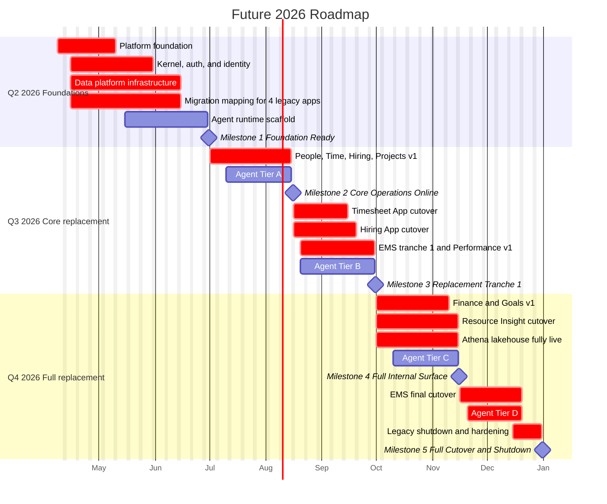

# Future — 2026 Master Roadmap

**Date:** 2026-04-08  
**Status:** Draft for review  
**Project:** Seta Future AaaS  
**Time Horizon:** 2026-04-08 to 2026-12-31  
**Audience:** Leadership, sponsors, and the build team

---

## Companion Document

- [2026 Execution Roadmap](./2026-execution-roadmap.md)

---

## Purpose

This document defines the 2026 roadmap for Future.

It is not a feature wishlist. It is the operating roadmap for one outcome:

**By December 31, 2026, Future replaces the 4 legacy internal systems at SETA and becomes the internal system of record.**

That means:

- all 7 domain modules are live inside SETA
- the full data platform is live — S3 lakehouse, Glue ETL, Iceberg, and Athena — operational from initial deployment
- agents are live through capability tier D for selected internal workflows
- the legacy systems are decommissioned, not merely "integrated"

---

## Roadmap Thesis

Future wins 2026 only if it stops being an architecture deck and starts running the company.

The roadmap therefore optimizes for:

1. **Legacy replacement over surface area**  
   A module is not "done" because screens exist. It is done when a real SETA workflow moves off the legacy stack.

2. **Cutovers over demos**  
   Progress is measured by production usage, auditability, and shutdown of old systems.

3. **Internal truth before external GTM**  
   SETA is customer zero. 2026 is for internal replacement, operational proof, and trust building.

4. **Sequencing over parallel chaos**  
   A 4-person team can move very fast with AI, but only if critical paths stay narrow and deliberate.

---

## Operating Constraints

| Constraint | 2026 Position |
|---|---|
| Starting point | Architecture/specs only, no meaningful implementation yet |
| Team size | 4 dedicated builders |
| End date | Hard commitment: 2026-12-31 |
| Customer focus | Internal-first, SETA only |
| Product scope | Full internal OS, all 7 modules plus full data platform and agent runtime |
| Legacy outcome | Full replacement of EMS, Timesheet, Hiring App, and Resource Insight |
| Data platform outcome | Full lakehouse (S3, Glue ETL, Iceberg, Athena, Cube.js) live in production from the start |
| Agent outcome | Agent capability tiers A, B, C, and D live internally by year-end |

---

## Current State vs End State

```
CURRENT STATE                      2026 ROADMAP                       TARGET STATE
Architecture agreed                Build the kernel, modules,         Future runs SETA's
Legacy behavior documented   --->  data platform, and agents   --->   internal operations
No real product code               in milestone-driven cutovers       Legacy stack retired
```

### Current State

- Product vision is clear.
- Architecture direction is clear.
- Legacy-system behavior is documented well enough to migrate intentionally.
- No implementation has started.

### Target State on 2026-12-31

- SETA operates on Future as the primary internal platform.
- People, Time, Hiring, Projects, Performance, Finance, Goals, Insights, and Agents are live in production.
- Kernel primitives are the canonical source of truth for identity, authority, decisions, events, and audit.
- Cube.js and the Insights surface are live on the full lakehouse path (Athena over S3 Gold Iceberg).
- Agent workflows are active across read, insight, proposal, and selected monitoring use cases.
- EMS, Timesheet App, Hiring App, and Resource Insight are decommissioned.

---

## Legacy Replacement Map

| Legacy System | Target in Future | 2026 Replacement Intent |
|---|---|---|
| EMS | Core, People, Projects, Finance, selected integration and governance surfaces | Replace in workflow slices, then retire as the broadest legacy system |
| Timesheet App | Time | Replace attendance, leave, approvals, schedules, and related manager/admin flows |
| Hiring App | Hiring | Replace recruitment planning, candidate pipeline, interview operations, and reporting |
| Resource Insight | Performance, Goals, selected Projects and org views | Replace review cycles, project assessment flows, performance history, and org/reporting surfaces |

The roadmap does **not** migrate by legacy app name alone. It migrates by workflow family, because EMS in particular spills across several future Future modules.

---

## 2026 Milestone Ladder

### Milestone 1: Foundation Ready
**Date target:** 2026-06-30

**What must be true**

- monorepo foundation, CI/CD, environments, and deployable app skeleton exist
- kernel schema and core auth path exist
- tenant #1 (SETA) exists in staging
- canonical identity and legacy-ID mapping path exists
- migration inventory is complete for all 4 legacy systems
- first end-to-end audit/event/decision flow works
- data platform infrastructure is live: Glue ETL job runs against staging RDS, S3 Bronze and Gold buckets exist, Athena and Cube.js are wired up

**Why it matters**

Without this milestone, every later module will invent its own shortcuts and the platform will rot before it ships. Standing up the data platform from the start means analytics are never a catch-up project.

---

### Milestone 2: Core Operations Online
**Date target:** 2026-08-15

**What must be true**

- People, Time, Hiring, and Projects are usable internally in controlled pilot scope
- Insights dashboards are live on real internal data, served through Cube.js
- Agent tier A is live for internal knowledge and policy Q&A
- first internal users are working in Future on real workflows
- shadow-mode comparison against legacy outputs is underway

**Why it matters**

This is the first point where Future stops being a build artifact and starts becoming an operating system.

---

### Milestone 3: Replacement Tranche 1 Complete
**Date target:** 2026-09-30

**What must be true**

- Timesheet App is fully replaced
- Hiring App is fully replaced
- the highest-frequency People and Projects workflows formerly trapped in EMS are live in Future
- Performance module is live enough to begin Resource Insight displacement
- Agent tier B is live on trusted internal operational data
- dual-run has collapsed enough risk that legacy write surfaces are being shut down

**Why it matters**

By the end of Q3, the roadmap must kill real legacy risk, not just accumulate more software.

---

### Milestone 4: Full Internal Surface Ready
**Date target:** 2026-11-15

**What must be true**

- Finance and Goals are live at v1 production depth
- remaining EMS workflows needed for internal replacement are live
- Resource Insight replacement is complete
- Cube.js is fully serving analytics from the Athena path over S3 Gold Iceberg tables
- Agent tier C is live for selected human-approved action proposals

**Why it matters**

This milestone closes the breadth gap. After this point, the remaining work is cutover hardening, decommissioning, and trust.

---

### Milestone 5: Full Cutover and Legacy Shutdown
**Date target:** 2026-12-31

**What must be true**

- Future is the internal system of record at SETA
- EMS is retired
- Timesheet App is retired
- Hiring App is retired
- Resource Insight is retired
- Agent tier D is live for selected internal monitoring and exception-routing flows
- the final cutover window has closed and the legacy rollback procedures are retired with the systems

**Why it matters**

This is the only end-state that counts as success for 2026.

---

## Quarter Buckets

| Period | Theme | Outcome |
|---|---|---|
| Remaining Q2 2026 | Foundations and migration truth | Platform skeleton, kernel, auth, infra + full data platform scaffolded, migration mapping, first governed flows |
| Q3 2026 | Core replacement | Operational modules online, Insights live on real data, Agent tiers A-B live, first major legacy cutovers |
| Q4 2026 | Complete replacement | Remaining modules live, Athena lakehouse path fully serving analytics, Agent tiers C-D live, final decommission |

---

## Roadmap Diagram

### Timeline View



### Dependency and Cutover View

```mermaid
flowchart LR
    A["Q2 Foundation<br/>Infra, kernel, auth, data platform, migration truth"]
    B["Q3 Core Operations<br/>People, Time, Hiring, Projects"]
    C["Insights on real data<br/>Agent Tiers A-B"]
    D["First Legacy Cutovers<br/>Timesheet App, Hiring App"]
    E["Q4 Surface Completion<br/>Performance, Finance, Goals"]
    F["Athena Lakehouse Live<br/>S3 Gold Iceberg serving Cube.js"]
    G["Agent Tier C<br/>Human-approved proposals"]
    H["Final Legacy Cutovers<br/>EMS, Resource Insight"]
    I["Agent Tier D<br/>Monitoring and exception routing"]
    J["Legacy Shutdown<br/>Future is system of record"]

    A --> B --> C --> D --> E --> F --> G --> H --> I --> J
```



The timeline answers when the roadmap moves. The dependency view answers what must be true before the next claim is credible.

---

## Strategic Sequencing Decisions

### 1. Build the kernel before broad module depth

The kernel is not paperwork. It is the thing that prevents identity, authority, approvals, and audit logic from fragmenting again.

### 2. Stand up the full data platform from the start

The lakehouse (S3, Glue ETL, Iceberg, Athena) is not a later upgrade. It is part of the initial infrastructure. Cube.js reads from both the RDS read replica (operational, last 30 days) and Athena (historical trends). The semantic layer contract is stable from day one.

### 3. Migrate by workflow families, not by repo boundaries

The four legacy systems do not map cleanly one-to-one into the future modules. The roadmap must respect the real business seams:

- employee master data and org structure
- time, leave, schedule, and approval flows
- hiring demand and candidate operations
- project staffing and delivery visibility
- performance and review operations
- finance and goals surfaces
- analytics and agent context

### 4. Use Agent capability tiers as trust gates, not as marketing labels

Tier D only belongs in 2026 if A, B, and C are already reliable on real internal usage. No fake autonomy.

---

## End-of-2026 Success Definition

Future counts as delivered in 2026 only if all of the following are true:

- SETA leadership can get trusted operational and KPI views from Future
- HR and managers can run employee, leave, hiring, and review workflows in Future without falling back to legacy apps
- the platform has a complete audit spine across core workflows
- at least selected action-proposal and monitoring workflows are agent-assisted in production
- the old systems can be turned off without breaking the business

If any legacy system still carries a mission-critical workflow on 2026-12-31, the roadmap has not fully succeeded.

---

## Primary Risks

| Risk | Why it matters | 2026 response |
|---|---|---|
| Too much parallelism | 4 builders can create broad partial coverage but not reliable replacement | Hold the roadmap to milestone gates and cutover order |
| UI-first drift | Easy to ship surfaces without migration truth, audit parity, or ops readiness | Tie every milestone to real workflow replacement |
| EMS scope sprawl | EMS covers too much and can absorb the whole year by itself | Decompose EMS into workflow families and replace slices deliberately |
| Agent overreach | Tier D becomes fantasy if A-C do not prove out first | Keep autonomy narrow, audited, and internal-only |
| Cutover avoidance | Teams tolerate dual-run too long and legacy systems never die | Define explicit retirement criteria and shutdown dates |

---

## 2026 Not In Scope

These items are intentionally deferred because they do not help the core 2026 goal of internal replacement:

- external commercial launch
- self-serve tenant onboarding
- broad international expansion and multi-region rollout
- enterprise-tier SLA hardening beyond what internal operations require
- full visual no-code Agent Builder depth
- non-essential module polish that does not unblock internal cutover

---

## What Changes If This Roadmap Works

By the end of 2026, Future is no longer "the future system." It is the system.

SETA stops reconciling across four disconnected apps. Leadership gets one source of truth. Managers stop living in approval fragments and spreadsheet joins. Agents stop being a demo layer and start operating against governed business reality.

That is the point of the roadmap.
