# Future — AI Agent System: Architecture Design

> **Document purpose:** Comprehensive architecture review package for AI solution architect.
> Covers full system flows, component responsibilities, design rationale, and open questions.
> Intended for pre-build review and improvement suggestions.
>
> **Date:** 2026-04-24
> **Author:** Canh Ta / Future Engineering
> **Status:** Pre-build review

---

## Table of Contents

1. [Executive Summary](#1-executive-summary)
2. [System Overview](#2-system-overview)
3. [Key Flows](#3-key-flows)
4. [Layer Deep-Dives](#4-layer-deep-dives)
5. [Data Model Overview](#5-data-model-overview)
6. [Extensibility Contract](#6-extensibility-contract)
7. [Roadmap & Status](#7-roadmap--status)
8. [Open Questions & Review Prompts](#8-open-questions--review-prompts)

---

## 1. Executive Summary

### What We Are Building

Future is a **multi-tenant business Agent-as-a-Service (AaaS) platform** — an AI layer embedded inside an HR/Finance/Hiring SaaS suite. Tenants interact through a chat panel or inline copilot to query data, draft actions, schedule tasks, and get synthesized answers across business domains (People, Time, Hiring, Finance, Goals, Projects, etc.).

The AI agent system handles all AI execution: routing user intent to the right domain specialists, enforcing tenant data boundaries, tracking cost, streaming answers back in real time, and building a human-in-the-loop approval workflow for writes.

This is not a developer tool or a generic LLM wrapper. Every design decision is shaped by the constraint that **tenant data is sensitive, costs are real money, and actions can affect payroll, employment records, and financial decisions.**

### Core Design Tenets

These 10 tenets govern every decision in the architecture. Any improvement suggestion should respect or explicitly challenge them:

| #   | Tenet                                   | Implication                                                                        |
| --- | --------------------------------------- | ---------------------------------------------------------------------------------- |
| T1  | **Single-tenant structural isolation**  | RLS enforced at DB layer — no application-layer equality filters as the only guard |
| T2  | **Audit completeness**                  | Every tool call, permission check, and approval decision logged to kernel audit    |
| T3  | **No silent failures**                  | Degradation is always visible to the user — never silently retry/fail              |
| T4  | **Permission parity**                   | `canDo` enforcement identical at tRPC boundary AND inside the tool gateway         |
| T5  | **Fail-safe cost direction**            | Over-bill rather than under-bill — revenue-safe failure mode                       |
| T6  | **Version-tagged observability**        | Every span/metric carries model version, prompt hash, tool version                 |
| T7  | **No backward compatibility**           | Full refactor when touching shared code — no shims or dual-shape handling          |
| T8  | **Composition safety**                  | Aggregate tools declare k-anonymity minimums; runtime monitors cross-tool patterns |
| T9  | **Graceful degradation always visible** | 7-step ladder — each step emits a user-facing message, never silent                |
| T10 | **No optional security**                | RLS on every agent table — no exceptions                                           |

### MVP Scope

- **3 domain modules** integrated at launch: Planner, People, Projects
- **Tier 0** (single-tool direct answer) + **Tier 1** (two-phase bounded multi-agent fan-out)
- **Full cost accounting** + 7-step graceful degradation
- **L1–L4 memory** + L3.5 agent scratchpad + semantic recall
- **Streaming SSE** with single-path cancellation
- **Draft → Approval** workflow for agent-proposed writes
- **Stratified observability** (1% baseline + 100% on 5 quality triggers)

### Roadmap Shape

```
MVP  ──►  Beta (modules 4–13, async delegation, iterative topology)
     ──►  GA (full-fleet tracing, agent-authored L3, code-execution tier)
```

---

## 2. System Overview

### Component Map

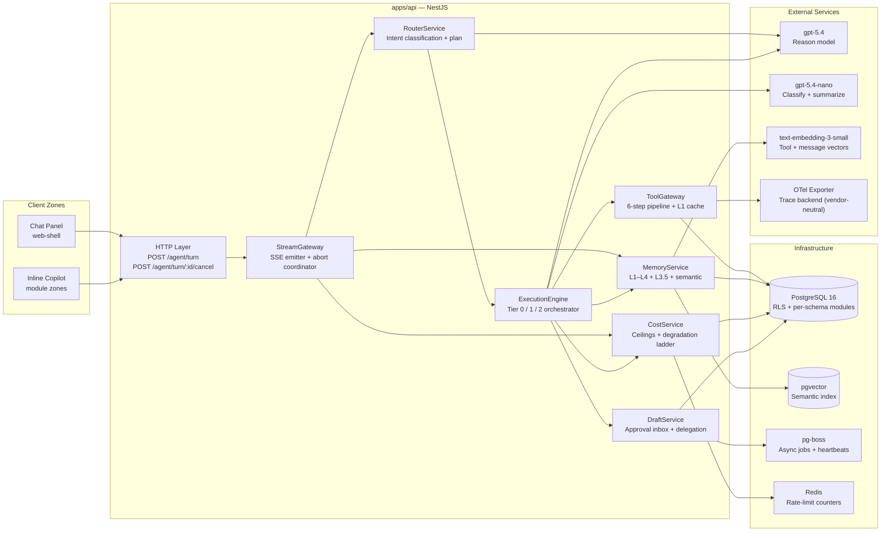

### Multi-Tenancy Model

Every request carries a `RequestContext` containing `tenant_id`, `user_id`, `role_id`, `trace_id`, `surface`, `flow_id`. These are set **once** by middleware and are read-only for all downstream code. PostgreSQL Row-Level Security policies enforce per-tenant data access at the DB driver layer — application code cannot bypass this.

No agent table lacks `tenant_id`. No cross-tenant query is structurally possible.

### Model Roles

| Model                    | Role                                                                                            | Why                                        |
| ------------------------ | ----------------------------------------------------------------------------------------------- | ------------------------------------------ |
| `gpt-5.4`                | Router decision, sub-agent ReAct, synthesizer (global chat)                                     | Full reasoning for complex domain planning |
| `gpt-5.4-nano`           | Intent classification, post-turn summarization, synthesizer (inline copilot), provider fallback | Low-latency, low-cost for throughput tasks |
| `text-embedding-3-small` | Tool descriptor embeddings, message semantic index                                              | Retrieval quality at scale                 |

---

## 3. Key Flows

### Flow 1 — User Turn Lifecycle

The end-to-end path from user utterance to closed SSE stream. This is the master flow that all other flows compose into.

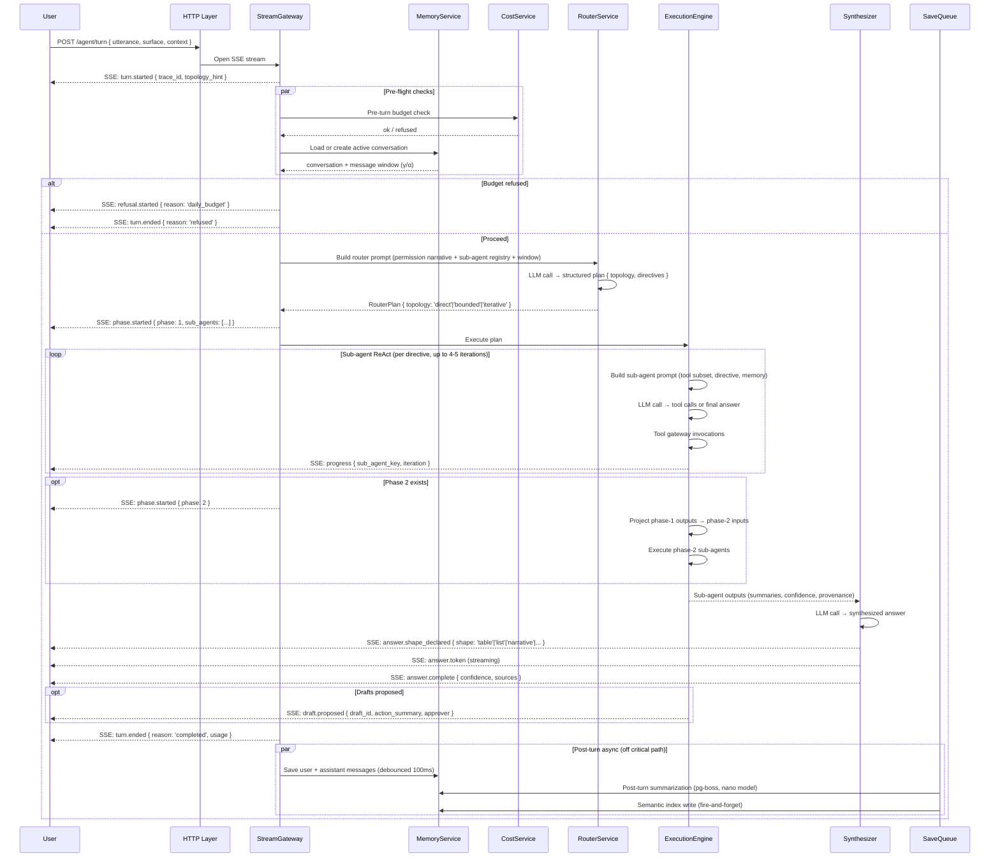

**Key design decisions in this flow:**

- Pre-flight checks (budget + conversation load) run in parallel before the router is invoked
- The router sees the permission narrative and sub-agent registry — it never has access to raw tenant data
- SSE events are emitted in a strictly enforced order (state machine); out-of-order emission terminates the stream
- Post-turn memory writes are off the critical path — the user receives `turn.ended` before saves complete

---

### Flow 2 — Tool Invocation Pipeline (6-Step Gateway)

Every tool call — whether a read or write — goes through this deterministic pipeline. The gateway is the primary security boundary.

```mermaid
sequenceDiagram
    participant SA as Sub-Agent (ReAct loop)
    participant GW as ToolGateway
    participant REG as ToolRegistry
    participant CEIL as CeilingChecker
    participant ABORT as AbortSignal
    participant TRPC as tRPC Procedure
    participant AUDIT as KernelAudit
    participant L1 as L1 ReadCache

    SA->>GW: invoke { toolName, args, subAgentKey, abortSignal }

    Note over GW: Step 1 — Resolve
    GW->>REG: Descriptor lookup + scope check
    REG-->>GW: descriptor (canDo key, metadata, taint fields) OR tripwire: procedure_not_agent_exposed / procedure_out_of_sub_agent_scope

    Note over GW: Step 2 — Taint-Wrap Setup
    GW->>GW: Register tenant-authored fields for post-invoke taint marking

    Note over GW: Step 3 — Ceiling Pre-Check
    GW->>CEIL: Check remaining bytes + wallclock budget
    CEIL-->>GW: ok OR tripwire: ceiling_breach_bytes / ceiling_breach_wallclock

    Note over GW: Step 4 — Pre-Write Abort Check (mutations only)
    GW->>ABORT: Read abortSignal.aborted
    ABORT-->>GW: false → continue OR true → tripwire: abort_pre_write

    Note over GW: Step 5 — Invoke
    GW->>TRPC: Call procedure (canDo + RLS enforced inside middleware)
    TRPC-->>GW: result OR permission_denied / business_rule_violation / infra_error

    Note over GW: Step 6 — Audit Emit
    GW->>AUDIT: Kernel audit event { tool_name, result_status, permission_key, on_behalf_of, result_hash }
    GW->>L1: Write to L1 cache (reads only; keyed by canonical args hash)

    GW-->>SA: ToolGatewayResult { kind: 'ok', result, fromCache } OR { kind: 'tripwire', variant, disposition }
```

**Critical properties:**

- **Order is load-bearing** — steps cannot be reordered (e.g. ceiling check before invoke is required for cost safety)
- **Tripwire, not throw** — all error paths return a typed discriminated union; exceptions from tRPC are caught and converted
- **Circuit breaker** — 2 tripwires of the same tool within one sub-agent disables that tool for the rest of the turn
- **L1 cache** — only reads are cached; writes invalidate all cached reads from the same module (not globally)
- **Concurrent dedup** — two identical `(tool, args)` calls within the same sub-agent share a single in-flight promise; only the first charges the ceiling

---

### Flow 3 — Draft → Approval → Execution

When a sub-agent proposes a write that requires human approval, this flow handles the full lifecycle from draft surfacing to committed execution.

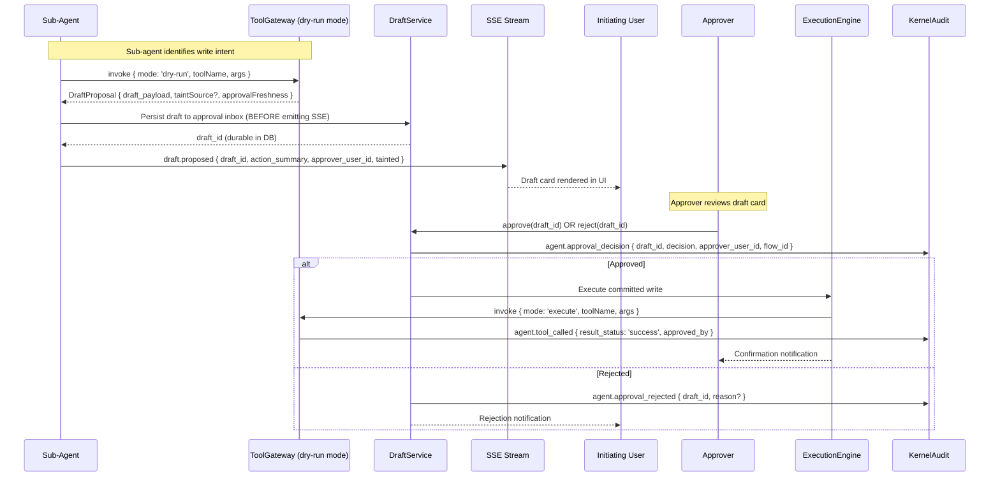

**Key design decisions:**

- Draft is **persisted before** the SSE `draft.proposed` event — the UI never shows a card that isn't durable
- Taint inheritance: if any field in the draft payload came from a tenant-authored free-text source, the approval tier is bumped
- `approvalFreshness` on the tool descriptor controls the TTL — 'revalidate' forces re-check of underlying data before execution; 'accept-stale' allows execute without re-read
- All approval decisions are kernel-audited with `flow_id` so the full chain (utterance → draft → approval → execution) is traceable

---

### Flow 4 — Async Agent Lifecycle

For scheduled or delegation-triggered agent actions that run outside a live user session.

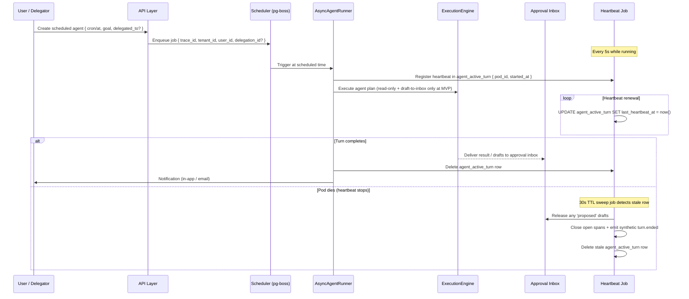

**Constraints at MVP:**

- Async agents are **read-only + draft-to-inbox** — no signed writes without live approver presence
- Signed writes (delegation with pre-authorized execution) are a Beta gate, unlocked after 4 weeks incident-free
- Cross-pod cancel works by reading `agent_active_turn` to find the owning pod, then forwarding the cancel RPC

---

## 4. Layer Deep-Dives

### 4.1 Router & Intent Classification

**Responsibility:** Translate a user utterance into a structured execution plan — which sub-agents to invoke, in what order, with what goals.

**Inputs:** User utterance, conversation window (γ/α), permission narrative, sub-agent registry, session hashes.

**Output:** `RouterPlan { topology: 'direct'|'bounded'|'iterative', directives[] }` — a typed, schema-validated plan.

#### Sub-Agent Selection Filter (3 stages)

Before the router LLM call, the available sub-agent set is filtered to what the user can actually use:

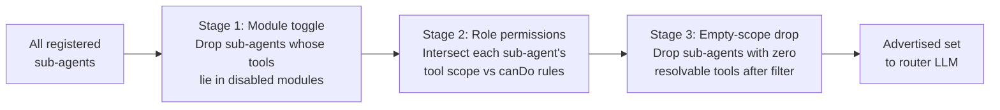

Each dropped sub-agent is recorded with reason (`module_toggle` or `permission`). The router never sees sub-agents the user cannot use.

#### Sub-Agent Retrieval (above 10-tool threshold)

When the rendered router prompt would exceed the token budget, semantic retrieval narrows the advertised sub-agent set. Below 10 sub-agents (MVP), the full registry is inlined and retrieval is dormant.

- Sub-agents are embedded by their `whenToUse` + `domain` description
- The user utterance + recent summary is the retrieval query
- `coreTools` are always included regardless of retrieval rank

#### Router Topology Decision

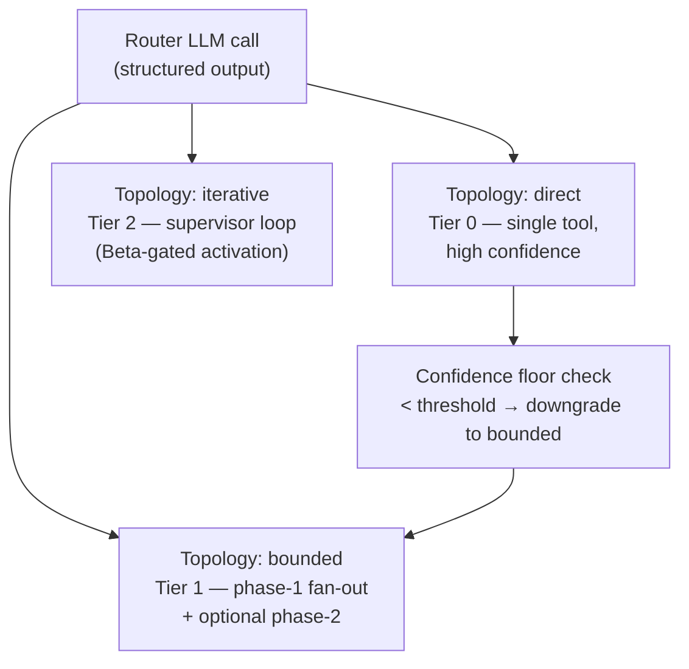

**Session pinning:** At the start of every turn, all hashes (router prompt hash, permission narrative hash, tool catalog hash, directive schema hash) are stamped on `agent_session`. Mid-session registry changes do not affect active turns — deterministic replay is guaranteed.

**Intent slug:** The router always emits an `intent_slug` from the controlled vocabulary (e.g. `people.headcount_query`, `time.leave_balance`). This propagates to every child span and kernel audit event. Unclassified turns (`intent_slug: 'unclassified'`) are monitored; exceedance of 2% on 30-day rolling traffic triggers an intent-registry review.

---

### 4.2 Execution Engine

**Responsibility:** Execute the router's plan using the right topology, fan out sub-agents, and synthesize a final answer.

#### Tier 0 — Direct Execution

For high-confidence, single-tool, read-only queries. The router bypasses sub-agent instantiation entirely:

```
Router → single tool call via gateway → lightweight formatter → turn.ended
```

- Tool must be declared `directExecutable: true` (build-time drift test verifies it is a pure read with no tenant-authored free-text fields)
- Confidence floor enforced; auto-downgrade to Tier 1 if below threshold

#### Tier 1 — Bounded Two-Phase Fan-Out

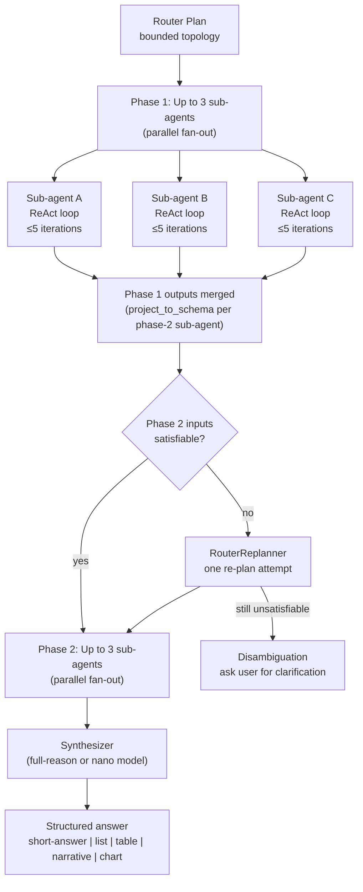

#### Sub-Agent ReAct Loop

Each sub-agent runs a standard ReAct loop (Reason → Act → Observe). Key constraints:

- Maximum 4–5 iterations (config-tunable per sub-agent)
- Only tools declared in the sub-agent's `toolScope` are available
- Tool retrieval narrows the visible set further when `toolScope > 10`
- All tool calls flow through the gateway (no direct DB access)

#### Confidence Scoring

Confidence is **rule-derived**, not LLM self-assessed:

| Level  | Conditions                                                                                                  |
| ------ | ----------------------------------------------------------------------------------------------------------- |
| `high` | Answered directly, corroborated by ≥1 tool result, zero retries, zero circuit-breaker events, no taint flip |
| `med`  | Single source OR retries occurred OR circuit-breaker fired OR partial results                               |
| `low`  | Taint flipped during execution OR ceiling hit OR contradicts sibling sub-agent output                       |

Synthesizer takes the **minimum confidence** across all contributing sub-agents. One-step demotion on detected contradiction.

#### Partial-Answer Gate

When a ceiling is hit mid-execution:

- If no writes were drafted → synthesizer runs with a `partial` label; answer surfaced with disclaimer
- If writes were drafted → answer suppressed; only draft cards shown (writes-only guard)

#### Synthesizer

The synthesizer receives structured per-sub-agent inputs: `summary`, `semantics` (what was measured), `confidence`, `sourceToolProvenance`. It never receives raw tool output or tenant PII directly.

- Contradiction framing: definitional clarity ("5 projects with logged hours via timesheet; 6 projects in active state via registry") — not disagreement language
- Output shapes declared before first token (enables client-side progressive rendering)
- Global chat uses full-reason model; inline copilot uses nano model

---

### 4.3 Tool Gateway & Registry

**Responsibility:** Enforce the security boundary between the agent and the data layer. Every tool call — regardless of source — passes through this single pipeline.

#### Tool Metadata Schema

Every tRPC procedure exposed to the agent must opt in via `.meta({ agent: {...} })` with required fields:

| Field                               | Purpose                                                |
| ----------------------------------- | ------------------------------------------------------ |
| `whenToUse`                         | Router decision hint; embedded for sub-agent retrieval |
| `whenNotToUse`                      | Prevents misuse; embedded for retrieval                |
| `examples`                          | ≥1 required; used in eval harness golden traces        |
| `approvalFreshness`                 | For mutations: `'revalidate'` or `'accept-stale'`      |
| `compositionSensitive.minGroupSize` | k-anonymity minimum for aggregate-returning tools      |
| `tenantAuthoredFreeText`            | Field names whose values must be redacted in traces    |
| `directExecutable`                  | Boolean — only pure reads; enables Tier 0              |

Missing required fields → build failure.

#### L1 Read Cache

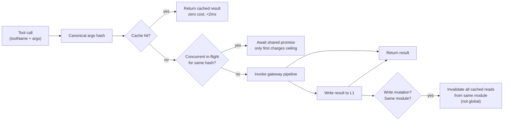

Cache scope: per-sub-agent, per-turn. Destroyed at turn end. Cross-module invalidation is module-scoped (write to `people.*` invalidates all cached `people.*` reads in the same sub-agent, but not `time.*`).

---

### 4.4 Memory System

**Responsibility:** Provide the right information to the agent at the right time — from fast turn-scoped cache to long-lived user preferences — while maintaining strict tenant isolation and supporting GDPR erasure.

#### Memory Layer Stack

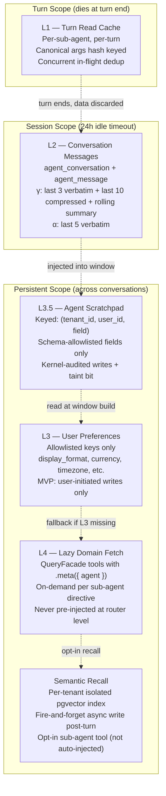

#### Window Injection Rules

The router and sub-agents receive different memory windows depending on surface:

| Surface         | Window (γ — global chat)                                                  | Window (α — inline copilot) |
| --------------- | ------------------------------------------------------------------------- | --------------------------- |
| What's included | Last 3 turns verbatim + last 10 compressed + 1 rolling background summary | Last 5 turns verbatim       |
| L3 included?    | Yes, at window build                                                      | Yes                         |
| L4 included?    | No — L4 is lazy; sub-agent must call domain tool                          | No                          |
| L3.5 included?  | Per-field, per-sub-agent at registry time                                 | Per-field                   |

#### L3.5 Scratchpad

The agent scratchpad allows sub-agents to persist structured intermediate state across turns (not just within a turn). Key constraints:

- Only schema-declared fields are writable (unknown field write → build failure)
- Each field is pinned to a specific sub-agent at registry time
- Every write is kernel-audited with `{ sub_agent_key, field, tainted, trace_id }`
- A tainted scratchpad read (value came from tenant free-text) bumps the approval tier for any write using that value

#### GDPR Erasure Pipeline

Full erasure on user deletion request (multi-step compensating transaction):

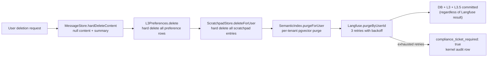

DB, L3, and L3.5 are committed regardless of the Langfuse outcome. Langfuse failure opens a compliance audit ticket.

---

### 4.5 Cost, Ceilings & Degradation Ladder

**Responsibility:** Track every dollar spent, enforce hard limits, and degrade gracefully when limits are hit — always with user-visible feedback.

#### Cost Accounting Model

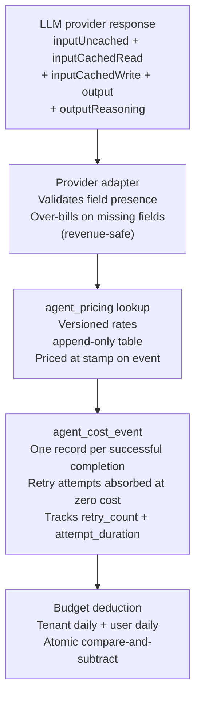

Pricing changes create new rows — historical events are never re-priced. Reconciliation is always possible via `pricing_id` + `priced_at` stamps.

#### Ceiling Hierarchy

| Ceiling                    | Scope     | Trigger                       |
| -------------------------- | --------- | ----------------------------- |
| Per-turn wallclock (30s)   | Turn      | `AbortSignal.timeout(30_000)` |
| Per-sub-agent iterations   | Sub-agent | 4–5 max (config)              |
| Per-sub-agent cost         | Sub-agent | Checked at gateway step 3     |
| Per-tool bytes / wallclock | Tool call | Checked at gateway step 3     |
| User daily                 | User      | Pre-turn + mid-turn           |
| Tenant daily               | Tenant    | Pre-turn + mid-turn           |

Worst-case per-turn accounting: 3 Phase-1 + 3 Phase-2 = 6 × per-sub-agent budget + 1 synthesizer call.

#### 7-Step Graceful Degradation Ladder

Every step has a distinct trace tag and a user-facing message. Steps 1–3 are per-call; steps 4–7 are turn-wide or tenant-wide.

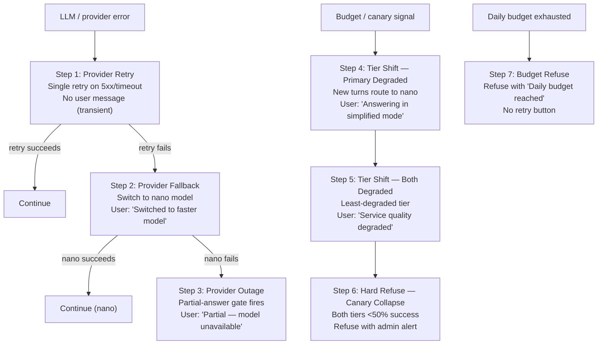

**Critical distinction:** `tier_shift` (policy-driven: budget or canary) and `provider_fallback` (error-recovery: 5xx/overload) are never conflated in traces, even if both occur in a single turn.

---

### 4.6 Streaming, SSE Contract & Cancellation

**Responsibility:** Deliver real-time agent output to the client over a versioned, ordered event stream, with a single composable abort path.

#### SSE Event Contract

12 event types, all carrying a monotonic `seq` number and optional non-versioned `metadata` bag. The contract is versioned via response header `event_schema_version: 1.0.0`:

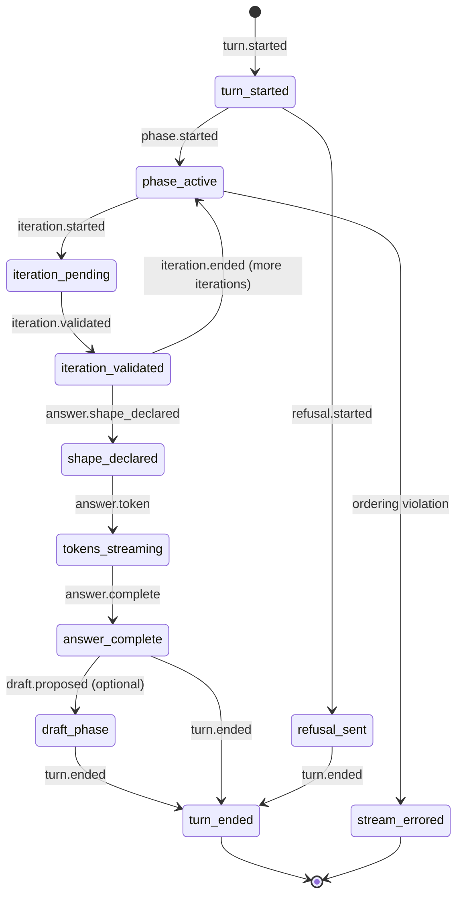

Ordering is enforced by a runtime state machine — not just documented. An out-of-order emission terminates the stream with `turn.ended { reason: 'error' }`.

#### Abort Signal Composition

All cancellation sources compose into a single `turnAbortSignal`:

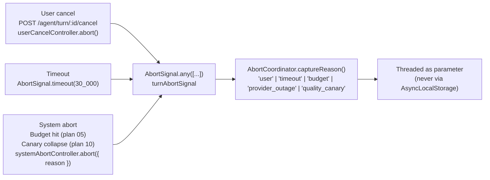

`'unknown'` is not a valid cancellation reason — the enum is closed.

#### Cross-Pod Cancel Discovery

The `agent_active_turn` table tracks every in-flight turn with `{ trace_id, pod_id, last_heartbeat_at }`. A cancel request hitting the wrong pod reads this table and forwards the RPC to the owning pod. If the row is missing (turn already ended), the API returns 404 idempotently.

---

### 4.7 Observability

**Responsibility:** Emit a complete, correlated, PII-safe observability signal that covers every span from turn entry to tool result, without vendor lock-in.

#### Span Taxonomy

Spans are typed on two independent axes — not free-text names:

| SpanType            | EntityType  | Example                        |
| ------------------- | ----------- | ------------------------------ |
| TURN                | ROUTER      | Root span for entire turn      |
| ROUTER_PLAN         | ROUTER      | LLM call + structured parse    |
| SUB_AGENT_PLAN      | SUB_AGENT   | Per-sub-agent ReAct loop       |
| SUB_AGENT_TOOL_CALL | TOOL        | Single tool invocation         |
| GATEWAY_STEP        | GATEWAY     | One of 6 gateway steps         |
| SUB_AGENT_SYNTHESIS | SYNTHESIZER | Per-sub-agent output building  |
| SYNTHESIZER         | SYNTHESIZER | Final synthesizer LLM call     |
| MEMORY              | MEMORY      | Window build, save queue flush |
| ITERATION           | PROCESSOR   | Tier 2 iteration (Beta)        |
| FINAL               | ROUTER      | Turn close + cost snapshot     |

#### Trace Correlation IDs

Three IDs travel together through every span, audit event, DB row, and pg-boss job:

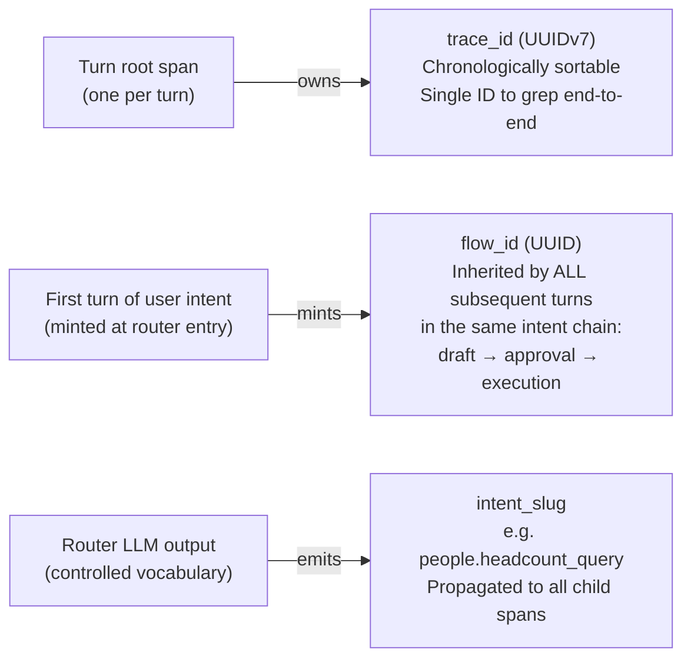

A single user intent (utterance → draft → approver action → committed write) is linked by one `flow_id` with multiple `trace_id`s. This enables end-to-end flow reconstruction.

#### Stratified Sampling

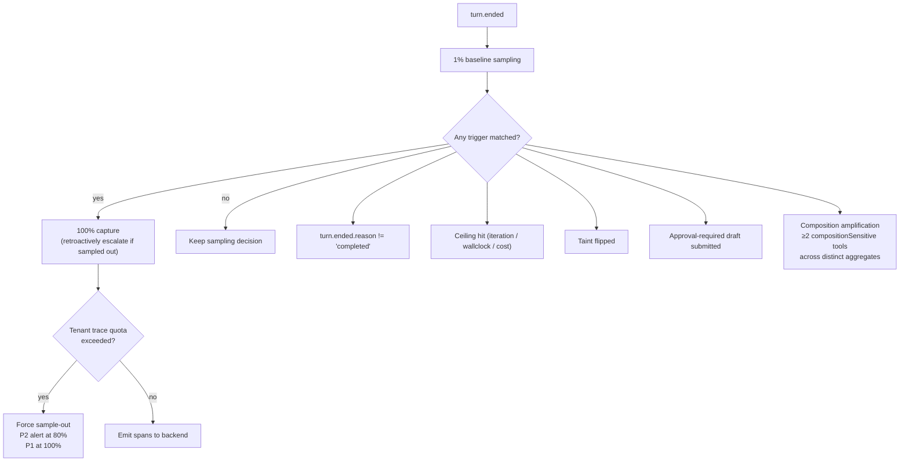

Sampled-out turns still write a `agent_turn_sampling_decision` diagnostic row recording which triggers would have fired — enabling offline analysis of what's being missed.

#### PII Redaction

Tool fields declared in `tenantAuthoredFreeText` are replaced with `<redacted:tenant_authored>` before spans leave the process. The raw result is stored in `agent_tool_invocation.result_preview` (kernel-owned, RLS-protected, 90-day retention) for incident reconstruction only.

#### Security Monitors

Two automated monitors run post-turn:

**Composition-attack monitor (pg-boss job):** Scans tool invocation sequences for patterns where ≥2 `compositionSensitive` tools were used across distinct aggregate dimensions. Emits a kernel audit event — never blocks the turn.

**Cross-tenant leak canary (daily job):** Emits a synthetic fixture-tenant turn with a known `trace_id`, then queries the trace backend across all other tenants' read surfaces for any match. A match pages on-call and temporarily disables the exporter read plane.

---

### 4.8 Governance & Production Readiness

**Responsibility:** Ensure every sub-agent declaration, tool annotation, and intent slug is correct, consistent, and extensible — enforced at build time, not reviewed by hand.

#### Build-Time Lints (fail the build on violation)

| Lint                                              | What it checks                                                                     |
| ------------------------------------------------- | ---------------------------------------------------------------------------------- |
| Tool metadata completeness                        | `whenToUse`, `whenNotToUse`, `examples` all present                                |
| `approvalFreshness` on mutations                  | Every mutating tool declares its freshness policy                                  |
| `compositionSensitive.minGroupSize` on aggregates | Every aggregate tool declares k-anonymity minimum                                  |
| `directExecutable` drift                          | Tier-0 candidates must be pure reads, zero taint fields                            |
| Sub-agent `toolRetrieval.enabled`                 | Required if `toolScope > 10` tools                                                 |
| Intent slug uniqueness                            | Duplicate slug across modules → build failure                                      |
| `whenToUse` collision detection                   | Semantic similarity between sub-agent `whenToUse` fields above threshold → warning |
| Unknown scratchpad field write                    | Sub-agent writes to field not declared at registry → build failure                 |

#### Extensibility Invariants (EI-1..EI-10)

The 10 invariants guarantee that adding modules 4–13 requires only PR-contained changes — no modifications to the agent runtime:

| Invariant | Guarantee                                                                                       |
| --------- | ----------------------------------------------------------------------------------------------- |
| EI-1      | Sub-agents declared via module-local `defineSubAgent` — registry aggregates at build            |
| EI-2      | Tools registered via `.meta({ agent })` on tRPC — ToolRegistry introspects without code changes |
| EI-3      | Intent slugs declared in `modules/<X>/agent/intents/*.ts` — build-time uniqueness enforced      |
| EI-4      | Retrieval recall meets target on 12-sub-agent synthetic probe                                   |
| EI-5      | Tool retrieval activates above 10-tool threshold; boot validator enforces                       |
| EI-6      | Embedding pipeline scales to 200+ tools                                                         |
| EI-7      | All 3 correlation IDs auto-stamped from `RequestContext` — zero manual call sites               |
| EI-8      | Draft approval per-flow policy; per-module approval tiers                                       |
| EI-9      | Memory partition keys are `(tenant_id, user_id)` or `(tenant_id)` only — never module-scoped    |
| EI-10     | Governance lints + PR protocol prevent scope creep                                              |

#### 13 Production-Readiness Gates (§18)

These are the measurable criteria that must pass before GA. All are tested in CI with synthetic fixtures:

| Gate | Criteria                                                                             |
| ---- | ------------------------------------------------------------------------------------ |
| G1   | Cross-tenant isolation: RLS verified via seeded leak tests                           |
| G2   | Tool-call audit completeness: zero spans without matching kernel audit rows          |
| G3   | Trace correlation: `trace_id` end-to-end join 100% across DB / audit / spans         |
| G4   | Cost accounting accuracy: reconciliation within 2% of vendor invoices                |
| G5   | Ceiling enforcement: every ceiling-hit charge correct per plan rules                 |
| G6   | Router accuracy: user-correct rate, empty-handoff rate, thumbs-down rate at baseline |
| G7   | Permission enforcement parity: `canDo` denial consistent at tRPC + gateway           |
| G8   | Prompt-hash stability: same session input → same hash always                         |
| G9   | Replay determinism: re-run 100 golden traces; 100% output identical                  |
| G10  | Observability completeness: all signal surfaces 100% populated                       |
| G11  | Graceful degradation: all 7 ladder steps reachable in staging; no silent steps       |
| G12  | Rate-limit enforcement: multi-account, burst, boundary-crossing all blocked          |
| G13  | GDPR erasure: full pipeline tested; compliance audit trail verified                  |

---

## 5. Data Model Overview

Key agent tables and their relationships. This is a conceptual view — full Drizzle schemas are in `apps/api/src/modules/agents/infrastructure/schema/`.

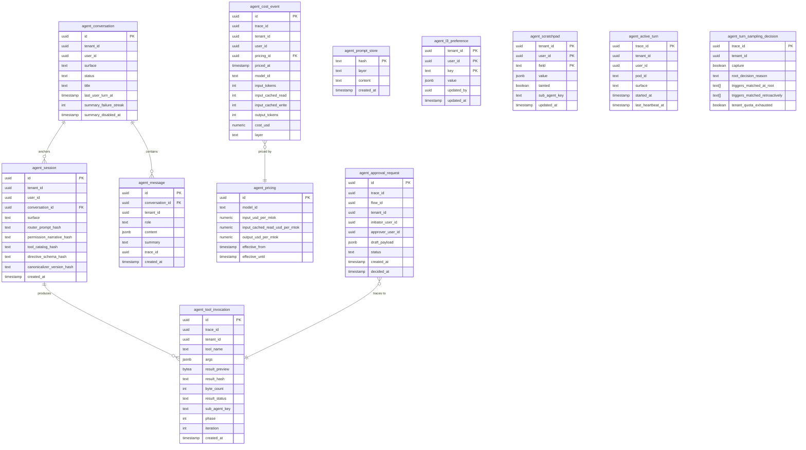

**Notable design choices:**

- `agent_prompt_store` uses content-hash as primary key — identical prompts across sessions share one row (no duplication)
- `agent_tool_invocation` is kernel-owned and RLS-protected — it persists regardless of sampling decisions
- `agent_active_turn` is ephemeral — rows are deleted on turn end or swept by heartbeat TTL
- `agent_tool_embedding` (not shown) is intentionally **tenant-neutral** — tool descriptors are not tenant data; documented exception to the "every table has tenant_id" rule

---

## 6. Extensibility Contract

### How a New Domain Module Joins the Agent System

Adding module 4 (e.g. `finance`) follows a pure PR-contained flow — no runtime changes required:

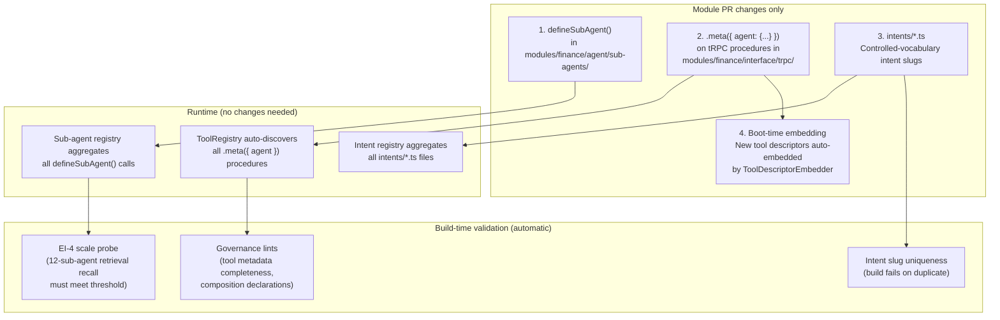

The invariant CI suite (EI-1..EI-10) runs on every build and verifies that the extensibility contract holds across the full 12-module synthetic probe.

---

## 7. Roadmap & Status

### Plan Status

| Plan | Title                                                            | Status            | Unlocks                        |
| ---- | ---------------------------------------------------------------- | ----------------- | ------------------------------ |
| 00   | Foundation — prompt/narrative store, content-hash infrastructure | ✅ Shipped        | Base for all plans             |
| 01   | Gateway pipeline + tool registry                                 | ✅ Shipped        | Security boundary              |
| 02   | Sub-agent declaration + router prompt + intent classifier        | ✅ Shipped        | Routing                        |
| 02.5 | Tool retrieval inside sub-agents                                 | ✅ Shipped        | Scale to 10+ tools             |
| 03   | Two-phase bounded execution + synthesizer                        | ✅ Shipped        | Tier 1 execution               |
| 04   | Memory L1-L4 + L3.5 scratchpad + semantic recall                 | ✅ Shipped        | Persistent context             |
| 05   | Cost ceilings + tier degradation + rate limits                   | ✅ Shipped        | Cost safety                    |
| 06   | Streaming + SSE contract + cancellation                          | 🔄 In Progress    | Public client contract         |
| 07   | Observability + sampling + correlation IDs                       | ✅ Shipped        | Debugging + analytics          |
| 08   | Drafts + approval + delegation                                   | 🔄 In Progress    | Human-in-the-loop writes       |
| 09   | Async agents                                                     | 🔄 In Progress    | Scheduled + deferred execution |
| 10   | Harness + replay + drift scorer + quality canary                 | 🔄 In Progress    | Eval + quality gates           |
| 11   | Shadow-mode rollout                                              | ⏳ Pending        | Safe canary deployment         |
| 12   | Iterative supervisor topology (Tier 2)                           | 🔄 In Progress    | Complex multi-step reasoning   |
| 13   | Production readiness validation + EI audit                       | 🔄 In Progress    | GA gates                       |
| 14   | Semantic result cache                                            | ⏳ Pending        | Cost + latency optimization    |
| 15   | Governance authoring lints + PR review protocol                  | 🔄 In Progress    | Build-time correctness         |
| 16   | Code-execution composition tier                                  | ⏳ Pending (v1.5) | Agent-invokes-agent            |

### Activation Gates

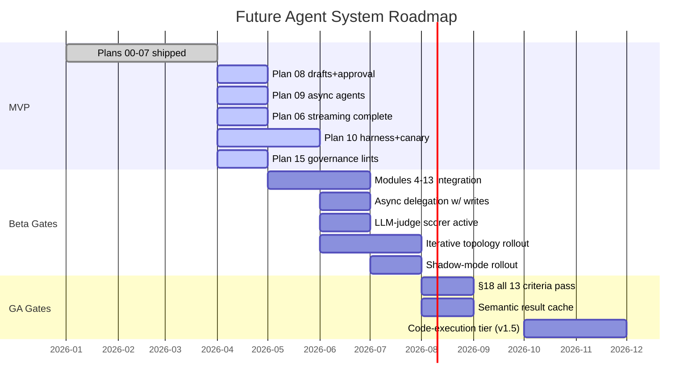

### Beta Activation Criteria

| Feature                             | Gate condition                                      |
| ----------------------------------- | --------------------------------------------------- |
| Async delegation with signed writes | 4 weeks incident-free in draft-only mode            |
| LLM-judge scorer                    | Golden corpus ≥100 rows + meta-eval accuracy ≥95%   |
| Iterative topology (Tier 2)         | UX demand signal + 12-sub-agent scale probe passing |
| Multi-region failover               | 3+ live tenants OR first regional outage            |

---

## 8. Open Questions & Review Prompts

The following areas are where we specifically invite the architect's review and improvement suggestions.

### A. Memory Architecture

1. **Semantic recall isolation model:** We use per-tenant physical pgvector tables (`agent_semantic_index_<tenant_id>`) rather than a shared table with metadata filtering. Is this the right tradeoff at our scale, or is a shared table with strong partition keys and pgvector `hnsw` indexing per-tenant more maintainable?

2. **L3.5 scratchpad scope:** The scratchpad is scoped to `(tenant_id, user_id)` — not per-sub-agent per-conversation. This means scratchpad state persists across conversations and can be read by any sub-agent that declares the field. Is this the right scope, or should it be `(tenant_id, user_id, conversation_id)`?

3. **L4 lazy fetch vs. pre-load:** L4 domain data is fetched on-demand by sub-agents via tool calls. This means the router doesn't have domain context when building the plan. Are there cases where pre-loading specific L4 fields into the window at router time would produce materially better routing decisions?

### B. Execution Topology

4. **Phase-2 input projection:** Phase-2 sub-agents receive their input by projecting phase-1 outputs through their `inputSchema` (field-drop sanitization). When phase-1 outputs are insufficient, a `RouterReplanner` fires one re-plan attempt. Should the replanner have access to the original user utterance, or only the phase-1 outputs? How should we design the replanner's context window?

5. **Iterative topology ceiling:** Tier 2 adds a supervisor loop with an iteration-count ceiling on top of the existing per-sub-agent iteration ceiling. What's the right ceiling design? Should iterations have access to previous iteration outputs (sliding window) or the full history?

6. **Tier 0 confidence floor:** The Tier-0 direct-execution path requires `high` confidence from the router. The confidence is rule-derived. Is there a risk of over-triggering Tier 0 for queries that appear simple but require context the router doesn't have?

### C. Cost & Safety

7. **Approval freshness policy:** Tool mutations declare `approvalFreshness: 'revalidate' | 'accept-stale'` with a 72h default TTL for `accept-stale`. Is 72h the right default? Are there mutation types where stale approval is never acceptable regardless of TTL?

8. **Composition-attack monitor sensitivity:** The runtime monitor fires on ≥2 `compositionSensitive` tools across distinct aggregates. Is this threshold calibrated correctly? Too low risks alert fatigue; too high risks missing real attacks. Should the threshold be per-tenant-type (e.g. enterprise vs. SMB)?

9. **Cost over-billing on provider field drop:** The adapter over-bills (counts dropped token fields as uncached) as a revenue-safe failure mode. Should there be a P1 alert threshold for sustained over-billing (not just any drop event)?

### D. Observability

10. **Vendor-neutrality invariant:** The OTel exporter adapts to any backend (Langfuse, ClickHouse, Tempo, etc.). At MVP, what's the minimum viable backend for the team to operate on? Is the vendor-neutral contract actually exercised, or will it drift if we only ever run against one backend?

11. **`intent_slug` unclassified rate:** The 2% threshold on `intent_slug: 'unclassified'` is a rolling 30-day metric. Should this threshold vary by module (newer modules will have higher unclassified rates before their intent vocabulary matures)?

12. **LLM-judge meta-evaluation:** The LLM-judge scorer (plan 10) requires a `SetaGoldenCorpus` of ≥100 rows with meta-eval accuracy ≥95% before activation. Who builds and maintains this corpus? What's the feedback loop for adding new golden traces from production?

### E. Deployment & Operations

13. **Cross-pod cancel at scale:** The `agent_active_turn` heartbeat-based discovery adds a DB round-trip to every cross-pod cancel. At high pod counts, what's the latency and contention risk? Should this be Redis-backed instead?

14. **Multi-region failover:** The design mentions multi-region as a Beta gate (triggered by 3+ tenants or first outage). What's the data residency model — does each tenant's DB stay in one region, or is there cross-region replication? How does this interact with the per-tenant semantic index?

15. **Shadow-mode rollout (plan 11):** Shadow mode runs real execution but suppresses responses. The cost of shadow turns is real. What's the cost model for shadow mode, and who is billed? Is there a per-tenant shadow-mode budget separate from the live budget?

---

_End of document. Questions and improvement suggestions welcome._
