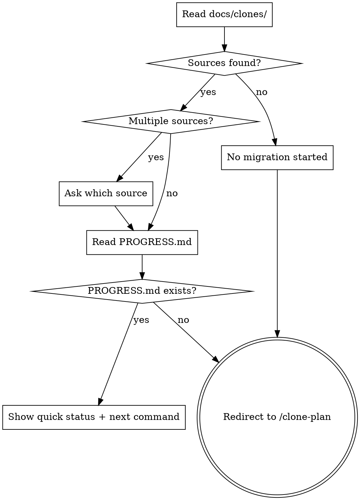

# Clone — Migration Entry Point

Quick session starter. Reads the current migration state and tells you exactly what to do next.

## Process



## Step 1: Read State

Scan `docs/clones/` for source directories. For each, check for `PROGRESS.md`.

- **No `docs/clones/`** or empty → "No migration started. Run `/clone-plan` to begin."
- **Multiple sources** → list them, ask which one to work on
- **One source, no `PROGRESS.md`** → "Migration state incomplete. Run `/clone-plan` to rebuild status."
- **One source, `PROGRESS.md` found** → read it and produce the quick status block

## Step 2: Show Quick Status

Read `PROGRESS.md` and output a compact summary:

```
Migration: {source-name} → {target-name}
Updated: {last-updated-date}

Discovered {n} modules — Refined {n}/{t} — Implemented {n}/{t} — Verified {n}/{t}

Current focus:
  Module: {module-name} ({n} tasks remaining)
  Next task: {date}-{seq}-{task-name} [status]

► Run /clone-{next-skill} to continue
```

Determine the current focus by finding:

1. First module with status `in-progress` (has at least one task started)
2. If none, first module with status `refined` and pending tasks
3. If none, first module with status `pending-refinement`
4. If none, all done → show completion summary

## Step 3: Recommend Exactly One Command

Based on current focus, output a single clear recommendation:

| State                            | Recommendation                                         |
| -------------------------------- | ------------------------------------------------------ |
| No inventory                     | `/clone-plan` — to set up and begin discovery          |
| Modules pending refinement       | `/clone-refine` — to design the next module            |
| Tasks pending implementation     | `/clone-implement` — to pick up the next task          |
| Tasks implemented but unverified | `/clone-verify` — to verify the last completed task    |
| Task marked needs-revision       | `/clone-implement` — re-run with verification findings |
| All tasks verified               | Migration complete — show summary                      |

Do NOT list all options. Pick one and recommend it clearly.

## PROGRESS.md

This file is the single source of truth for migration progress. It lives at:

```
docs/clones/{source-name}/PROGRESS.md
```

It is created by `clone-discover` and updated by every sub-skill after completing work. Format is defined in `skills/clone/templates/progress.md`.

**Task status values:** `pending` | `ready-to-implement` | `in-progress` | `done` | `verified` | `needs-revision`

**Module status values:** `pending-refinement` | `refined` | `in-progress` | `completed`

**Update rules per skill:**

| Skill             | Module update                                      | Task update                                  |
| ----------------- | -------------------------------------------------- | -------------------------------------------- |
| `clone-discover`  | Add module as `pending-refinement`                 | —                                            |
| `clone-refine`    | `pending-refinement` → `refined \| 0/n tasks done` | Add mermaid diagram + task table (`pending`) |
| `clone-implement` | `refined` → `in-progress \| n/t tasks done`        | `pending` → `in-progress ← CURRENT` → `done` |
| `clone-verify`    | `in-progress` → `completed` when all verified      | `done` → `verified` or `needs-revision`      |

Every skill that modifies PROGRESS.md must also update the **Summary** table counts and the **Updated** date at the top.
