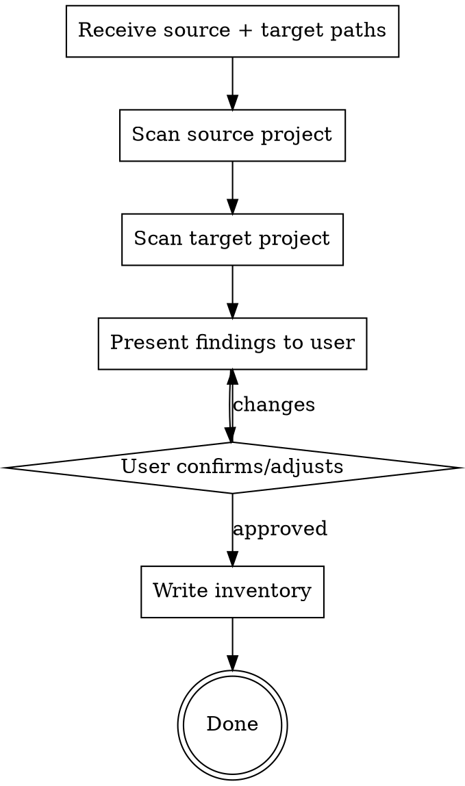

# Clone Discover — Source & Target Scanner

Scan source and target projects to produce a migration inventory. Stack-agnostic — observes and describes what it finds without assuming any specific framework or architecture.

## Resuming

Already ran discovery before? Run `/clone-plan` instead — it shows current status and routes you to the right next step.

## Process



## Step 1: Scan Source Project

Read the source project structure. Identify:

- **Directory structure** — top-level organization, package layout
- **Tech stack** — languages (by file extensions), frameworks (by config files, dependencies), package managers (lockfiles), databases (by config, migrations, schemas)
- **Module boundaries** — directories that look like independent features. Heuristics:
  - Has its own routes, controllers, or entry points
  - Has its own models, schemas, or data layer
  - Has its own services or business logic
  - Has its own tests
  - Is referenced as a separate package/workspace
- **Key files per module** — the most important files that define the module's behavior
- **Size estimate** — file count and rough LOC per module

Use Glob and Grep to explore. Read key files (package.json, config files, directory listings) to understand the project shape. Do NOT read every file — scan structure, spot-check contents.

## Step 2: Scan Target Project

Same analysis on the target:

- Structure and conventions
- Tech stack
- What already exists (detect partial migrations or overlap)
- Architecture patterns in use

## Step 3: Present Findings

Show the user what you found in a structured format:

```markdown
## Source: {source-name}

**Stack:** {languages, frameworks, DB}
**Structure:** {description}

### Discovered Modules

| #   | Module | Description    | Size                 | Dependencies    |
| --- | ------ | -------------- | -------------------- | --------------- |
| 1   | {name} | {what it does} | {small/medium/large} | {other modules} |

## Target: {target-name}

**Stack:** {languages, frameworks, DB}
**Existing overlap:** {what's already migrated or exists}
```

Then ask:

1. "Did I miss any modules or misidentify boundaries?"
2. "Should any of these be grouped together or split apart?"
3. "Set priority for each module (high / medium / low)"
4. "Any modules to exclude entirely?"

## Step 4: Write Inventory

Write `docs/clones/{source-name}/{date}-000-inventory.md` using the template from `skills/clone/templates/inventory.md`.

**Per-module metadata:**

- Name and source location
- Brief description (1-2 sentences)
- Detected tech (language, framework, DB if relevant)
- Dependencies on other discovered modules
- Size estimate: small / medium / large
- User-set priority: high / medium / low
- Status: `pending-refinement`

## Sizing Heuristic

- **Small** — under ~10 files, single concern → likely one execution task
- **Medium** — 10-50 files, a few concerns → 2-5 tasks
- **Large** — 50+ files, multiple sub-features → must decompose during refinement

These are rough guides for the refine phase, not hard rules.

## Step 5: Create PROGRESS.md

Create `docs/clones/{source-name}/PROGRESS.md` using the template from `skills/clone/templates/progress.md`.

- List all discovered modules as `pending-refinement`
- Fill the Summary table with discovered counts
- Set Updated date

`PROGRESS.md` is the single source of truth for all task and module status. Task files are specs only — do not track status inside them.

## Handoff

When the inventory and PROGRESS.md are written, end the session with:

```
Inventory written to docs/clones/{source-name}/{date}-000-inventory.md
PROGRESS.md created at docs/clones/{source-name}/PROGRESS.md

Next steps:
- Run /clone-refine to start refining the first module (suggested: highest priority)
- Run /clone to see quick status and next recommended command

To resume this migration in a future session, start with /clone.
```

## Important

- **No assumptions** about any specific stack, framework, or architecture. Observe and describe.
- **Don't over-scan** — structure and spot-checks, not line-by-line reads.
- **Let the user correct you** — you will misidentify boundaries. That's fine. The confirmation step exists for this reason.
- **Create the docs/clones directory** if it doesn't exist.
- **Always end with the handoff block** — never finish silently.
