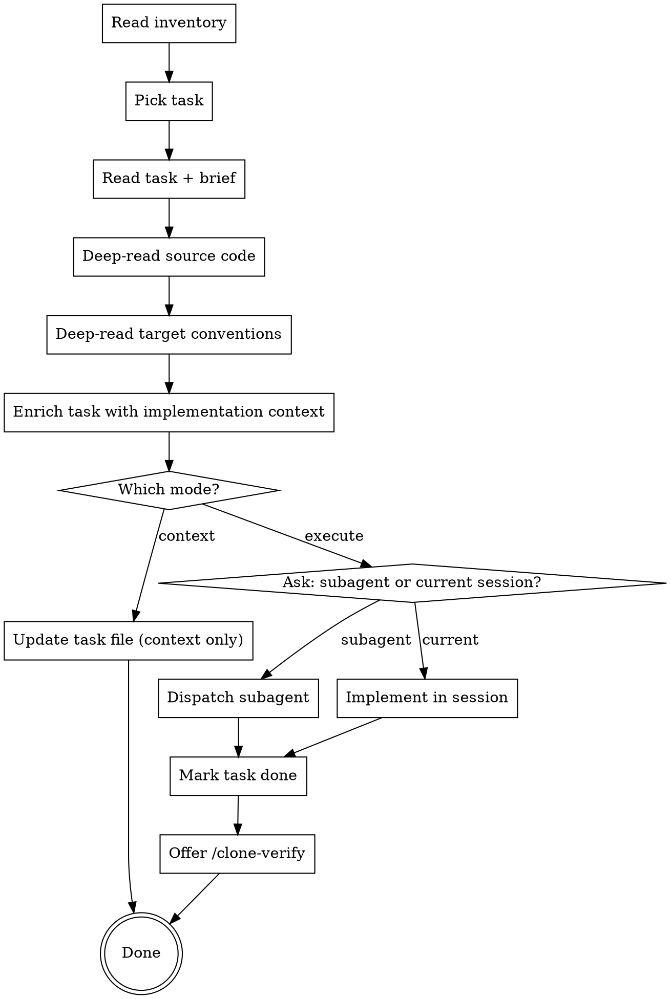

# Clone Implement — Execution Context Generator

Takes a single refined task and produces everything needed to implement it — or implements it directly.

## Resuming

If you're starting a new session mid-migration, run `/clone-plan` first — it shows full status and tells you which tasks are ready to implement.

## Prerequisites

- Brief and task files must exist under `docs/clones/{source-name}/modules/{module-name}/`
- If not, guide the user to run `/clone-refine` first

## Process



## Step 1: Pick Task

Read inventory and find modules with status `refined`. Within those modules, read task files and find ones with status `pending`. Respect dependency order — don't pick a task that depends on an incomplete one.

Ask the user which task to work on, or suggest the next one by priority and dependency order.

## Step 2: Read Task + Brief

Read the task file and its parent module's brief. Understand:

- What to build (scope from task)
- Why it matters (business context from brief)
- What decisions were made (keep/reimagine/skip from brief)
- What this task depends on (other tasks)

## Step 3: Deep-Read Source Code

For the specific feature this task covers, read the source code thoroughly:

- Exact files that implement this feature
- Core business logic (algorithms, workflows, validations)
- Data access patterns (queries, mutations, relationships)
- Error handling and edge cases
- Tests that document expected behavior

Summarize the key logic — don't just list files. Explain what the code does and why.

## Step 4: Deep-Read Target Conventions

Read the target project to understand:

- Where this code should go (directory, file naming)
- Patterns to follow (how similar features are built)
- Shared utilities available (don't reinvent)
- Related code that this feature will interact with

## Step 5: Enrich Task

Update the task file with implementation-ready context:

- **Source files** — exact paths with key logic explained (not just file names)
- **Target locations** — exact paths where new code goes
- **Step-by-step guidance** — ordered implementation steps
- **Code patterns** — examples from target project to follow
- **Data mappings** — how source schema/models map to target
- **Test cases** — specific tests to write with expected behavior
- **Verification steps** — how to confirm it works

## Step 6: Mode Selection

Ask the user:

> "Task enriched with full implementation context. How do you want to proceed?"
>
> - **A)** Context only — save the enriched task file for later implementation
> - **B)** Execute now in this session — implement interactively
> - **C)** Execute via subagent — dispatch implementation in background

### Context Mode (A)

- Update the task file in-place with the enriched content
- Set status to `ready-to-implement`
- Done — another agent or session picks it up later

### Execute Mode (B or C)

- Implement the code following the enriched task context
- After implementation:
  - Set task status to `done`
  - Update inventory checklist
  - If all tasks for the module are done, mark module as `completed`
  - Proactively offer: "Implementation complete. Want to run `/clone-verify` to validate against the source?"

## Handoff

After a task is completed (context-only or executed), end the session with:

```
Task "{task-name}" — {status: enriched / implemented}
  File: docs/clones/{source}/modules/{module}/tasks/{date}-{seq}-{name}.md

Remaining tasks in this module: {n} ({list next 2-3})
Unrefined modules: {n}

Next steps:
- Run /clone-verify to verify this task against the source  ← recommended if implemented
- Run /clone-implement to pick up the next task: {next-task-name}
- Run /clone-plan to see the full migration status dashboard

To resume in a future session, start with /clone-plan.
```

If verification was offered and declined, still show the full next-steps block — don't end silently.

## Important

- **One task at a time** — don't batch multiple tasks
- **Respect dependencies** — if task 002 depends on 001, don't start 002 until 001 is done
- **Explain, don't just list** — "this file validates approval chains by checking manager hierarchy" not just "approval.service.ts"
- **Follow target conventions** — the goal is code that looks like it was always part of the target project
- **Always offer verification** — ask about `/clone-verify` after implementation
- **Always end with the handoff block** — never finish silently, even if verify was skipped
