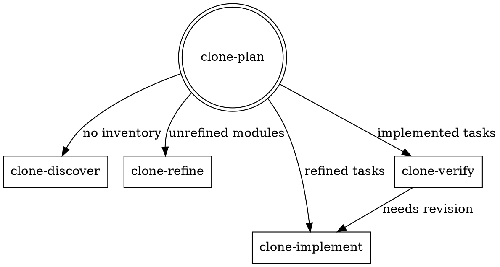
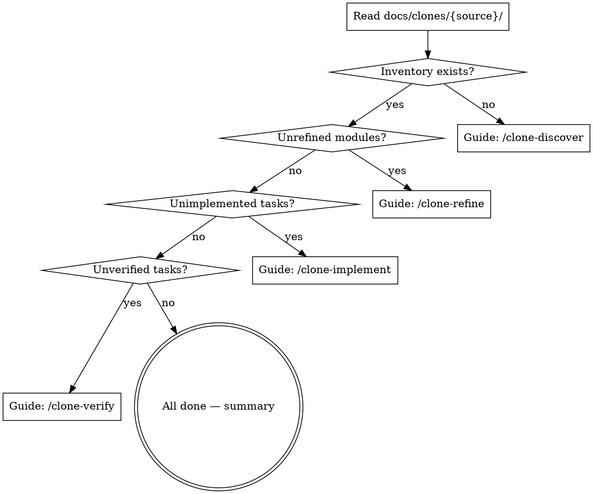

# Clone Plan — Migration Orchestrator

Entry point for the clone pipeline. Reads migration state from `docs/clones/` and routes to the right sub-skill.

## Pipeline



## Behavior

1. **Collect paths** — ask user for source and target project directories if not provided
2. **Derive source name** — slugify the source directory name for `docs/clones/{source-name}/`
3. **Read migration state** — scan `docs/clones/{source-name}/` for existing files
4. **Display status dashboard** — show counts and checklists (see format below)
5. **Route to next action** based on state:



## Status Dashboard Format

Present the dashboard as a markdown summary:

```markdown
## Migration: {source-name} → {target-name}

| Phase       | Count             |
| ----------- | ----------------- |
| Discovered  | {n} modules       |
| Refined     | {n}/{total}       |
| Implemented | {n}/{total} tasks |
| Verified    | {n}/{total} tasks |

### Pending Refinement

- [ ] {module-name}

### Ready to Implement

- [ ] {module}/{task-name}

### Awaiting Verification

- [ ] {module}/{task-name}
```

## Multi-Source Support

Multiple sources can coexist under `docs/clones/`:

```
docs/clones/
  {source-a}/
    {date}-000-inventory.md
    modules/...
  {source-b}/
    {date}-000-inventory.md
    modules/...
```

When multiple sources exist, show a summary of each and ask the user which one to work on.

## File Naming Convention

All output files follow: `{YYYY-MM-DD}-{sequence}-{descriptive-name}.md`

- `000` — reserved for inventory and brief files
- `001`+ — tasks, ordered by execution/dependency sequence
- Verification reports: same name as task, suffixed with `-verify`

## Resuming Across Sessions

Use `/clone` for quick session start — it reads `PROGRESS.md` and gives a one-line recommendation.

Use `/clone-plan` when you want the full status dashboard with all counts and checklists.

## This Skill Does NOT

- Scan or analyze code (that's `clone-discover`)
- Make design decisions (that's `clone-refine`)
- Generate implementation context (that's `clone-implement`)
- Verify implementations (that's `clone-verify`)

It is intentionally thin — a router and dashboard only.
