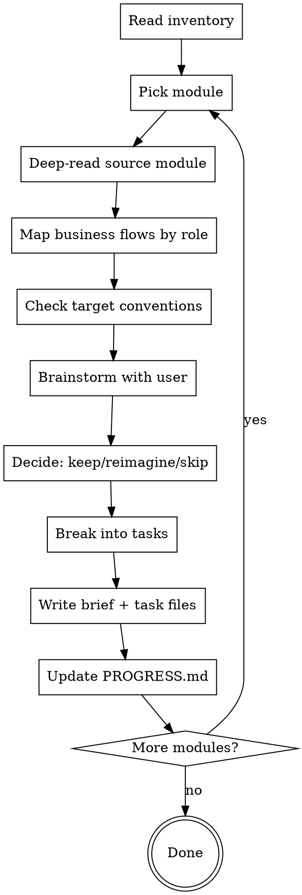
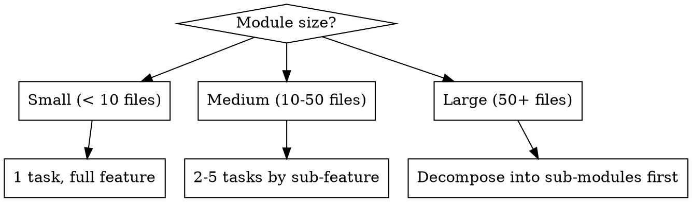

# Clone Refine — Per-Module Design Brainstorming

The critical filter between "what exists" and "what gets built." For each module, brainstorm with the user to decide what's worth keeping, what needs reimagining, and what should be dropped. No blind cloning.

## Resuming

If you're starting a new session mid-migration, run `/clone-plan` first — it shows full status and tells you which modules still need refinement.

## Prerequisites

- Inventory file must exist at `docs/clones/{source-name}/{date}-000-inventory.md`
- If not, guide the user to run `/clone-discover` first

## Process



## Step 1: Pick Module

Read inventory, find modules with status `pending-refinement`. Ask the user which to refine, or suggest the next one by priority.

## Step 2: Deep-Read Source Module

Read the source module thoroughly:

- Business logic and core workflows
- Data model (schemas, migrations, relationships)
- API surface (routes, endpoints, RPCs)
- UI components (if any)
- Tests (what's covered, what's not)
- Configuration and environment dependencies
- External integrations (third-party APIs, services)
- Edge cases visible in error handling

## Step 3: Map Business Flows by Role

Before making any design decisions, understand what the module does for each role. Look for role definitions in:

- Auth middleware, guards, decorators (`@Roles`, `@Permission`, `hasRole`, etc.)
- Route-level or controller-level access control
- Conditional logic branching on user role/permission
- UI visibility rules (show/hide based on role)
- Separate endpoints or actions per role

For each discovered role, describe its complete flow through this module:

| Role   | Can Do            | Cannot Do      | Notes        |
| ------ | ----------------- | -------------- | ------------ |
| {role} | {list of actions} | {restrictions} | {any nuance} |

If the system has no roles or a single role, note that explicitly — it simplifies the migration.

**Ask the user:** "Does this role mapping look complete? Are there roles in the new project that don't exist in the source, or source roles that map differently here?"

This step is the foundation for brainstorming — every keep/reimagine/skip decision should reference a specific role and flow.

## Step 4: Check Target Conventions

Read the target project to understand:

- Architecture patterns in use
- Naming conventions
- How similar features are structured
- What shared utilities/libraries exist
- Any partial work already done for this module
- Whether the target has the same roles or a different role model

## Step 5: Brainstorm with User

Ask questions **one at a time**. Ground every question in a specific role or flow from Step 3.

1. **Business value** — "What does this module solve for {role}? Is that still needed in the new project?"
2. **Role coverage** — "The source has flows for {roles}. The new project has {roles}. Should we map them 1:1 or merge/split?"
3. **Quality assessment** — "I see {pattern} in the {role} flow. This looks {good/problematic} because {reason}. Keep or fix?"
4. **Tech debt** — "These parts of the {role} flow look like workarounds: {list}. Should we drop them?"
5. **Missing flows** — "The {role} flow doesn't handle {case}. Should the new one?"
6. **Architecture fit** — "The source uses {pattern} for {role} access control, the target uses {pattern}. Here's how I'd map it."
7. **Dependencies** — "This module depends on {other modules} for {role} authorization. Are those migrated yet?"
8. **Integration points** — "This talks to {external services}. Same in the new project?"

Flag anything that smells bad:

- Copy-pasted code
- Overly complex logic with no tests
- Hardcoded values
- Security concerns
- Performance anti-patterns

## Step 6: Decide Per Feature

For each feature/sub-feature within the module, record a decision:

| Decision      | Meaning                                                        |
| ------------- | -------------------------------------------------------------- |
| **keep**      | Port faithfully — same behavior, adapted to target conventions |
| **reimagine** | Use as reference but redesign for the new system               |
| **skip**      | Drop entirely — not worth migrating                            |

Every decision must have a rationale. "Keep because it works" is not enough. "Keep because the approval workflow matches current business rules and has good test coverage" is.

## Step 7: Break Into Tasks

Split the module into execution tasks. For each task, define:

- **Scope** — what it covers (self-contained, fits one session)
- **Priority** — high / medium / low based on business value and blocking others
- **Depends on** — which other tasks must complete first (task sequence numbers)

**Sizing guidance:**



**Prefer grouping by feature** (schema + service + API + UI for one feature) over splitting by layer. Unless the module is too large for one task.

**After listing all tasks, draw the dependency diagram:**

- Use a mermaid `graph LR` diagram — one node per task (use sequence number + short name), edges for blockers
- Isolated nodes (no edges) mean fully independent tasks
- The diagram is the implementation strategy — no separate strategy field needed

## Step 8: Write Outputs

### Brief file

Write `docs/clones/{source-name}/modules/{module-name}/{date}-000-brief.md` using the template from `skills/clone/templates/brief.md`.

### Task files

Write one file per task: `docs/clones/{source-name}/modules/{module-name}/tasks/{date}-{sequence}-{feature-name}.md` using the template from `skills/clone/templates/task.md`.

Each task file includes:

- Scope (what to build)
- Business context (why it matters)
- Source reference (where to look)
- Target location (where it goes)
- Data model changes
- Interface contract
- Edge cases
- Dependencies on other tasks
- Acceptance criteria as `- [ ]` checklist

### Update PROGRESS.md

In `docs/clones/{source-name}/PROGRESS.md`:

- Modules table: change module status → `refined`, tasks count → `0/{n}`
- Tasks section: add a new `### {module-name}` block with:
  - A mermaid `graph LR` diagram showing task dependencies (nodes = tasks, edges = blocked-by)
  - A task details table: task name | status `pending` | priority | blocked-by
- Update Summary table refined count and Updated date

Task files are specs only — do not track status inside them.

## Handoff

When a module's brief, tasks, and PROGRESS.md are updated, end the session with:

```
Module "{module-name}" refined.
  Brief: docs/clones/{source}/modules/{module-name}/{date}-000-brief.md
  Tasks: {n} tasks created
  PROGRESS.md updated ✓

Remaining unrefined modules: {list or "none"}

Next steps:
- Run /clone-refine to refine the next module: {next-module-name}
- Run /clone-implement to start implementing tasks from this module
- Run /clone to see quick status and next recommended command

To resume in a future session, start with /clone.
```

If the user wants to continue refining more modules in the same session, ask:

> "Refine next module ({module-name}) now, or stop here?"

## Important

- **One question at a time** — don't overwhelm the user with a wall of questions
- **Be opinionated** — flag bad patterns proactively, don't wait for the user to notice
- **No blind cloning** — every feature must pass through the keep/reimagine/skip filter
- **Balanced tasks** — not so large they overflow context, not so small they create micro-loops
- **Refine one module per session** — don't try to batch all modules at once
- **Always end with the handoff block** — never finish silently
