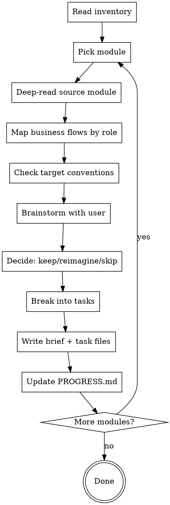
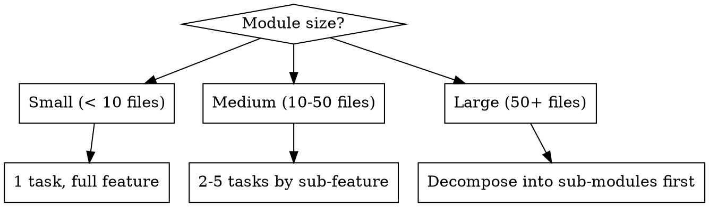

# Clone Refine — Per-Module Design Brainstorming

The critical filter between "what exists" and "what gets built." For each module, brainstorm with the user to decide what's worth keeping, what needs reimagining, and what should be dropped. No blind cloning.

## Resuming

If you're starting a new session mid-migration, run `/clone-plan` first — it shows full status and tells you which modules still need refinement.

## Prerequisites

- Inventory file must exist at `docs/clones/{source-name}/{date}-000-inventory.md`
- If not, guide the user to run `/clone-discover` first

## Process



## Step 1: Pick Module

Read inventory, find all modules with status `pending-refinement`. Present them as a numbered list with priority and size:

```
Modules pending refinement:

  1. {module-name} — {description} [high | {size}]
  2. {module-name} — {description} [medium | {size}]
  3. {module-name} — {description} [low | {size}]

Which module should we refine first? (enter number, name, or "all" to go in priority order)
```

Wait for the user's answer before proceeding. If they say "all", refine modules one at a time in priority order, looping automatically after each.

## Step 2: Deep-Read Source Module

Read the source module thoroughly:

- Business logic and core workflows
- Data model (schemas, migrations, relationships)
- API surface (routes, endpoints, RPCs)
- UI components (if any)
- Tests (what's covered, what's not)
- Configuration and environment dependencies
- External integrations (third-party APIs, services)
- Edge cases visible in error handling

## Step 3: Map Business Flows by Role

Before making any design decisions, understand what the module does for each role. Look for role definitions in:

- Auth middleware, guards, decorators (`@Roles`, `@Permission`, `hasRole`, etc.)
- Route-level or controller-level access control
- Conditional logic branching on user role/permission
- UI visibility rules (show/hide based on role)
- Separate endpoints or actions per role

For each discovered role, describe its complete flow through this module:

| Role   | Can Do            | Cannot Do      | Notes        |
| ------ | ----------------- | -------------- | ------------ |
| {role} | {list of actions} | {restrictions} | {any nuance} |

If the system has no roles or a single role, note that explicitly — it simplifies the migration.

**Ask the user:** "Does this role mapping look complete? Are there roles in the new project that don't exist in the source, or source roles that map differently here?"

This step is the foundation for brainstorming — every keep/reimagine/skip decision should reference a specific role and flow.

## Step 4: Check Target Conventions

Read the target project to understand:

- Architecture patterns in use
- Naming conventions
- How similar features are structured
- What shared utilities/libraries exist
- Any partial work already done for this module
- Whether the target has the same roles or a different role model

## Step 5: Brainstorm with User

**Before asking anything**, synthesize what you found in Steps 2–4 into a prepared agenda. Every question must carry your recommendation — the user confirms, adjusts, or overrides; they should never be answering from scratch.

### 5a: Prepare the Agenda

Internally build a list of questions from these categories. Only include categories where you found something worth discussing:

| Category               | Ask when you found…                                                     | Example recommendation format                                                                                                                   |
| ---------------------- | ----------------------------------------------------------------------- | ----------------------------------------------------------------------------------------------------------------------------------------------- |
| **Business value**     | The module solves a problem that may or may not apply to the new system | "This module handles X for {role}. The new project already has Y which covers part of it. I recommend reimagining rather than porting — agree?" |
| **Role coverage**      | Source and target have different role models                            | "Source has {roles}, target has {roles}. I recommend mapping {source-role} → {target-role} because {reason}. Does that match?"                  |
| **Quality assessment** | A pattern that is clearly good or clearly bad                           | "The {flow} for {role} uses {pattern}. This is a problem because {reason}. I recommend we fix it during migration. Agree?"                      |
| **Tech debt**          | Workarounds, duplication, or hacks                                      | "I see {specific code smell} in the {role} flow — looks like a workaround. I recommend dropping it. Keep or skip?"                              |
| **Missing flows**      | A gap in the source that the new system should fill                     | "The {role} flow has no handling for {case}. I recommend adding it because {reason}. Include or skip?"                                          |
| **Architecture fit**   | A mismatch between source pattern and target conventions                | "Source uses {pattern}, target uses {pattern}. I recommend mapping it as {approach}. Does that work?"                                           |
| **Dependencies**       | This module depends on another that may not be migrated yet             | "This depends on {module} for {reason}. That module is {status}. I recommend {sequencing suggestion}."                                          |
| **Integration points** | External services, APIs, or jobs                                        | "This talks to {service} for {purpose}. Assuming same in the new project — is that right?"                                                      |

Flag anything that smells bad proactively — don't wait for the user to notice:

- Copy-pasted logic across role paths
- Overly complex flows with no test coverage
- Hardcoded values or environment assumptions
- Security concerns (missing auth checks, insecure data handling)
- Performance anti-patterns

### 5b: Present the Agenda

Show the user the full list before diving in:

```
I've analyzed the {module-name} module and have {n} questions before we make decisions.
I'll go through them one at a time with my recommendation — just confirm, adjust, or override.

  1. Role mapping — how to handle {source-role} in the new system
  2. Tech debt — {specific smell} in the {role} flow
  3. Architecture fit — {source-pattern} vs target conventions
  ... (all topics, one line each)

Ready? I'll start with #1.
```

### 5c: Ask One at a Time

Go through the agenda sequentially. For each item:

1. State what you found (concrete — file, function, or flow name)
2. Give your recommendation with a reason
3. Ask for confirmation

Example:

> "In `leave.service.ts:142`, the approval flow for `manager` runs the same validation twice — once on submit and once on approve. This looks like a copy-paste leftover from an earlier version. **I recommend dropping the duplicate check and keeping only the approve-time validation.** Agree, or should we keep both?"

Wait for the user's response before moving to the next question. Capture their answer — it feeds directly into Step 6 decisions.

## Step 6: Decide Per Feature

For each feature/sub-feature within the module, record a decision:

| Decision      | Meaning                                                        |
| ------------- | -------------------------------------------------------------- |
| **keep**      | Port faithfully — same behavior, adapted to target conventions |
| **reimagine** | Use as reference but redesign for the new system               |
| **skip**      | Drop entirely — not worth migrating                            |

Every decision must have a rationale. "Keep because it works" is not enough. "Keep because the approval workflow matches current business rules and has good test coverage" is.

## Step 7: Break Into Tasks

Split the module into execution tasks. For each task, define:

- **Scope** — what it covers (self-contained, fits one session)
- **Priority** — high / medium / low based on business value and blocking others
- **Depends on** — which other tasks must complete first (task sequence numbers)

**Sizing guidance:**



**Prefer grouping by feature** (schema + service + API + UI for one feature) over splitting by layer. Unless the module is too large for one task.

**After listing all tasks, draw the dependency diagram:**

- Use a mermaid `graph LR` diagram — one node per task (use sequence number + short name), edges for blockers
- Isolated nodes (no edges) mean fully independent tasks
- The diagram is the implementation strategy — no separate strategy field needed

## Step 8: Write Outputs

### Brief file

Write `docs/clones/{source-name}/modules/{module-name}/{date}-000-brief.md` using the template from `skills/clone/templates/brief.md`.

### Task files

Write one file per task: `docs/clones/{source-name}/modules/{module-name}/tasks/{date}-{sequence}-{feature-name}.md` using the template from `skills/clone/templates/task.md`.

Each task file includes:

- Scope (what to build)
- Business context (why it matters)
- Source reference (where to look)
- Target location (where it goes)
- Data model changes
- Interface contract
- Edge cases
- Dependencies on other tasks
- Acceptance criteria as `- [ ]` checklist

### Update PROGRESS.md

In `docs/clones/{source-name}/PROGRESS.md`:

- Modules table: change module status → `refined`, tasks count → `0/{n}`
- Tasks section: add a new `### {module-name}` block with:
  - A mermaid `graph LR` diagram showing task dependencies (nodes = tasks, edges = blocked-by)
  - A task details table: task name | status `pending` | priority | blocked-by
- Update Summary table refined count and Updated date

Task files are specs only — do not track status inside them.

## Handoff

When a module's brief, tasks, and PROGRESS.md are updated, show a completion block:

```
Module "{module-name}" refined.
  Brief: docs/clones/{source}/modules/{module-name}/{date}-000-brief.md
  Tasks: {n} tasks created
  PROGRESS.md updated ✓
```

Then immediately show remaining modules and ask what to do next:

```
Remaining unrefined modules ({n}):

  1. {module-name} — {description} [high | {size}]   ← suggested next
  2. {module-name} — {description} [medium | {size}]
  3. {module-name} — {description} [low | {size}]

What next?
  A) Continue with {next-module-name} (suggested)
  B) Pick a different module (enter number or name)
  C) Stop here — I'll run /clone-implement to start building
```

- If **A** or user entered "all" earlier: loop back to Step 2 with the next module automatically.
- If **B**: user picks from the list, loop back to Step 2 with that module.
- If **C** or no modules remain: show the final summary and stop.

**Final summary (when all modules refined or user stops):**

```
Refinement complete.
  Refined: {n}/{t} modules
  PROGRESS.md updated ✓

Next steps:
- Run /clone-implement to start implementing tasks
- Run /clone to see full status

To resume in a future session, start with /clone.
```

## Important

- **One question at a time** — don't overwhelm the user with a wall of questions
- **Be opinionated** — flag bad patterns proactively, don't wait for the user to notice
- **No blind cloning** — every feature must pass through the keep/reimagine/skip filter
- **Balanced tasks** — not so large they overflow context, not so small they create micro-loops
- **Always write docs before moving on** — never loop to the next module without completing brief, tasks, and PROGRESS.md for the current one
- **Always show remaining modules after each** — give the user clear options: continue, pick different, or stop
- **Always end with the handoff block** — never finish silently
