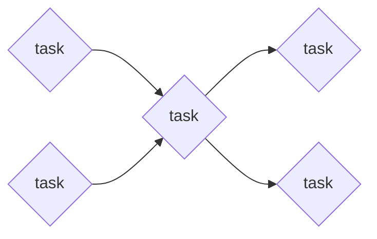
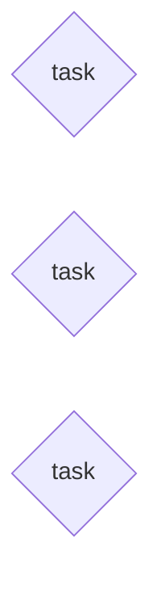

# Migration Progress: {source-name} → {target-name}

**Source:** {source-path}
**Target:** {target-path}
**Started:** {date}
**Updated:** {date}

## Summary

| Phase       | Progress        |
| ----------- | --------------- |
| Discovered  | {n} modules     |
| Refined     | {n}/{t} modules |
| Implemented | {n}/{t} tasks   |
| Verified    | {n}/{t} tasks   |

## Modules

<!-- Module status: pending-refinement | refined | in-progress | completed -->
<!-- Task status: pending | ready-to-implement | in-progress | done | verified | needs-revision -->

| Module        | Status             | Priority | Tasks |
| ------------- | ------------------ | -------- | ----- |
| {module-name} | pending-refinement | high     | —     |
| {module-name} | refined            | medium   | 0/4   |
| {module-name} | in-progress        | high     | 2/5   |
| {module-name} | completed          | low      | 3/3   |

## Tasks

### {module-name}

| Task            | Status                | Priority | Blocked By |
| --------------- | --------------------- | -------- | ---------- |
| 001-{task-name} | pending               | high     | —          |
| 002-{task-name} | pending               | high     | —          |
| 003-{task-name} | in-progress ← CURRENT | high     | 001, 002   |
| 004-{task-name} | pending               | medium   | 003        |
| 005-{task-name} | pending               | medium   | 003        |

### {module-name}

| Task            | Status   | Priority | Blocked By |
| --------------- | -------- | -------- | ---------- |
| 001-{task-name} | verified | high     | —          |
| 002-{task-name} | verified | medium   | —          |
| 003-{task-name} | verified | medium   | —          |

## Excluded

| Module        | Reason   |
| ------------- | -------- |
| {module-name} | {reason} |
