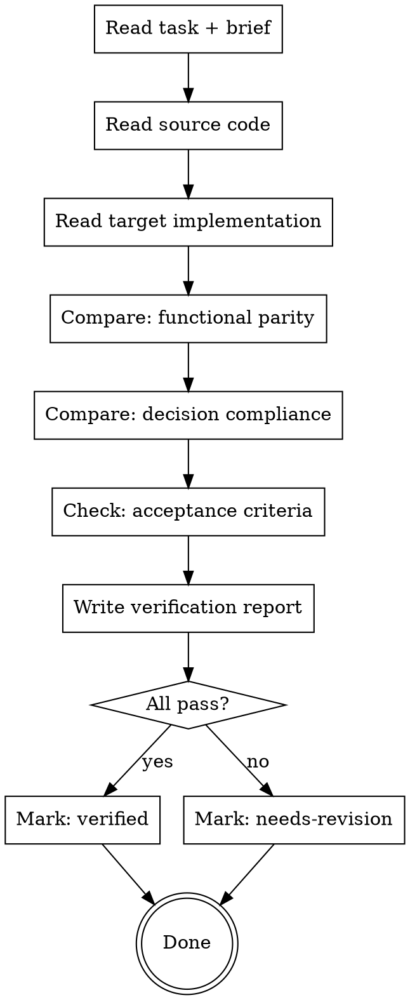

# Clone Verify — Implementation Verification

Compares the implemented code against the source and the design decisions from the brief. Catches gaps, missed edge cases, and deviations from the plan.

## Resuming

If you're starting a new session mid-migration, run `/clone-plan` first — it shows which tasks are implemented but unverified.

## Prerequisites

- Task file must exist with status `done` or `in-progress`
- Brief file must exist for the module
- If not, this task hasn't been through the pipeline yet

## Process



## Three Verification Dimensions

### 1. Functional Parity

Compare source and target implementations:

- **Business logic** — same workflows, rules, validations?
- **Data handling** — same queries, mutations, relationships?
- **Error paths** — same error cases handled?
- **Edge cases** — anything in the source that's missing in the target?
- **Test coverage** — does the target have equivalent or better tests?

For features marked **keep**: the target should behave identically (adapted to target conventions).
For features marked **reimagine**: the target should solve the same problem but may differ in approach. Verify the business outcome, not the implementation details.

### 2. Decision Compliance

Read the brief's keep/reimagine/skip decisions:

- **Keep** features: are they faithfully ported?
- **Reimagine** features: did they actually improve, or just change? Is the business outcome preserved?
- **Skip** features: were they actually omitted? (Sometimes skipped features creep back in)

### 3. Acceptance Criteria

Check each criterion from the task file's `- [ ]` checklist. For each:

- **Pass** — criterion is met
- **Fail** — criterion is not met, explain what's missing
- **Partial** — partially met, explain what's incomplete

## Verification Report

Write to `docs/clones/{source-name}/modules/{module-name}/tasks/{date}-{sequence}-{feature-name}-verify.md`

### Report Format

```markdown
---
module: { module-name }
task: { task-name }
verified-at: { date }
result: verified | needs-revision
---

# Verification: {task-name}

## Result: {VERIFIED | NEEDS REVISION}

## Functional Parity

| Aspect                | Status                 | Notes     |
| --------------------- | ---------------------- | --------- |
| {business logic area} | pass / gap / deviation | {details} |

## Decision Compliance

| Feature   | Decision            | Compliance           | Notes     |
| --------- | ------------------- | -------------------- | --------- |
| {feature} | keep/reimagine/skip | compliant / deviated | {details} |

## Acceptance Criteria

- [x] {criterion} — PASS
- [ ] {criterion} — FAIL: {what's missing}

## Gaps Found

- {description of gap and its impact}

## Recommendations

- {fix / revisit / accept as-is — with reasoning}
```

## After Verification

### If verified

In `PROGRESS.md`:

- Tasks table: update task row status → `verified`
- If all tasks in the module are `verified`: Modules table → module status `completed`, tasks count `{n}/{n}`
- Update Summary table verified count and Updated date

### If needs-revision

In `PROGRESS.md`:

- Tasks table: update task row status → `needs-revision`
- The verification report's gaps become context for the next `/clone-implement` run
- Guide user: "Run `/clone-implement` on this task again — verification findings are included as context"

Task files are specs only — do not add status fields to them.

## Invocation Modes

When offered after `/clone-implement`, ask the user:

> "Want to verify this implementation against the source?"
>
> - **A)** Yes, in this session — interactive, can discuss findings
> - **B)** Yes, via subagent — background verification, non-blocking
> - **C)** Skip for now — verify later or in batch

### Batch Mode

Can also verify all tasks in a module at once:

> "Verify all implemented tasks in {module-name}?"

Produces one report per task.

## Handoff

After the verification report is written, end the session with:

**If verified:**

```
Task "{task-name}" — VERIFIED ✓
  Report: docs/clones/{source}/modules/{module}/tasks/{date}-{seq}-{name}-verify.md
  PROGRESS.md updated ✓

Next steps:
- Run /clone-implement to pick up the next task: {next-task-name}
- Run /clone to see quick status and next recommended command

To resume in a future session, start with /clone.
```

**If needs revision:**

```
Task "{task-name}" — NEEDS REVISION
  Report: docs/clones/{source}/modules/{module}/tasks/{date}-{seq}-{name}-verify.md
  Gaps: {count} issues found (see report for details)
  PROGRESS.md updated ✓

Next steps:
- Run /clone-implement on this task again — verification findings are included as context
- Run /clone to see quick status and next recommended command

To resume in a future session, start with /clone.
```

## Important

- **Read the actual code** — don't just check file existence. Compare logic.
- **Be specific about gaps** — "missing validation for negative amounts in refund flow" not "some validation might be missing"
- **Don't nitpick style** — if the target follows its own conventions, that's correct. Only flag logic gaps.
- **Respect reimagine decisions** — different implementation is expected. Verify the outcome, not the approach.
- **Always end with the handoff block** — never finish silently.
